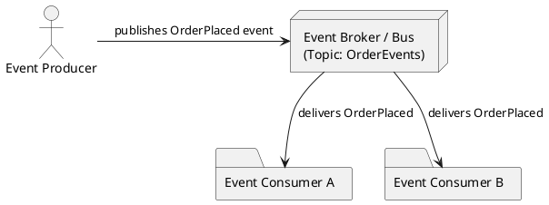
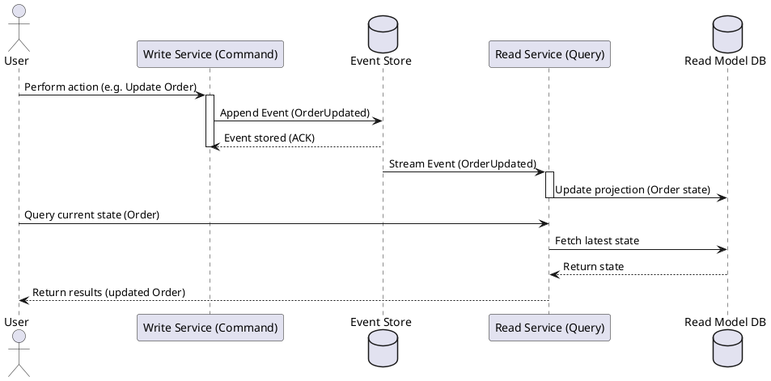
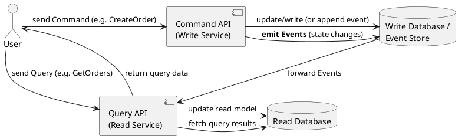
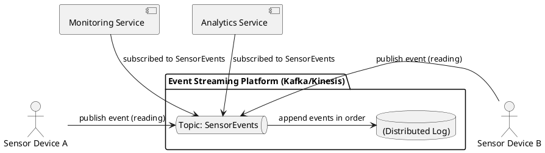

Great. I’ll compile a concise, technically oriented overview of Event-Driven Architecture (EDA) suitable for a technical engineering team. It will include foundational concepts, major architectural patterns (with both PlantUML diagrams and explanations), architectural trade-offs, and a diverse set of real-world use cases across industries.

I’ll let you know as soon as the report is ready for review.

# Event-Driven Architecture: A Comprehensive Technical Overview

## Definition and Core Philosophy of EDA

Event-Driven Architecture (EDA) is a software design paradigm centered around the production, detection, and reaction to events. In an EDA system, components communicate by generating and responding to events (signals of state changes) rather than through direct calls or tight integrations. An **event** represents a *significant change in state* – for example, a customer placing an order or a sensor reading crossing a threshold – which is published as an asynchronous message that other parts of the system can consume. This paradigm has roots in early software (e.g. GUI event loops and message-passing systems) and has evolved through decades of enterprise messaging into a modern approach for building loosely coupled, scalable systems. EDA’s core philosophy is to **“react”** to changes: instead of services calling each other directly, they announce changes and let interested parties *autonomously react*, enabling a more **flexible and adaptive** system structure.

Historically, event-driven ideas have been around for a long time, but the approach has gained significant traction in recent years as distributed systems and integrations grow more complex. Modern implementations of EDA often build on technologies like messaging brokers and streaming platforms that efficiently route and store events (e.g. Apache Kafka, AWS Kinesis). Overall, EDA promotes a design where **behavior emerges from events**, offering high degrees of decoupling and adaptability. This comes at the cost of added complexity – EDA systems tend to be **inherently more challenging to monitor and test** end-to-end than simple request/reply systems. Nonetheless, for **dynamic, large-scale, or real-time workloads**, EDA has proven extremely effective.

## Key Benefits of Event-Driven Architecture

EDA brings numerous advantages that address the needs of modern, distributed applications:

* **Loose Coupling and Modularity:** Components in an EDA system are decoupled – event producers need not know which consumers will act on their events. This allows each service to be developed, updated, and deployed independently. The only dependency is on the *event schemas/contracts*, not on direct service interfaces. New features can be introduced by adding new consumers or producers without impacting existing services, which greatly improves system **modularity, agility, and maintainability**. In practice, an event producer “is unaware of and unconcerned by” any downstream consumers, making it easy to extend the system with minimal friction.

* **Scalability and Independent Scaling:** Because services communicate asynchronously, each component can scale out or fail independently. Producers and consumers are buffered by the event pipeline, so a spike in one area (e.g. a burst of incoming events) won’t overload others – the event broker can queue or stream events and consumers can process at their own pace. This elasticity is crucial for handling variable or “spikey” traffic patterns. For example, an e-commerce site using EDA can handle a surge of orders by scaling order-processing consumers, without changing the order producer. If one service goes down, others continue running, improving overall resilience. In short, loosely-coupled event-driven systems naturally lend themselves to **horizontal scaling and fault isolation**.

* **Real-Time Processing and Responsiveness:** EDA enables near **real-time reactions** to events. Instead of periodic batch jobs or polling, events are pushed as soon as they occur. This makes architectures ideal for use cases requiring instant feedback or processing – such as financial trade processing, live dashboards, or IoT sensor alerts – since events propagate through the system immediately and trigger consumers to act. Users or systems can get updates with minimal latency, improving responsiveness and enabling faster decision-making.

* **Flexibility and Extensibility:** Because the event flow is dynamic and not hard-wired, organizations can more easily extend functionality. Adding a new process simply means introducing a new event consumer for an existing event, or emitting a new event type – without changing the core producer logic. Heterogeneous systems (microservices, legacy apps, third-party APIs) can be integrated by sharing event streams. This **extensibility** means EDA systems can evolve gracefully with changing business needs. For example, publishing an event can allow future services (even ones unknown at design time) to subscribe and react, “without changing the existing solution”.

* **Resilience and Fault Tolerance:** Events can be durably logged, providing a natural audit trail and recovery mechanism. If a consumer service fails or needs to reboot, it can replay or catch up on missed events from the log (if the infrastructure supports persistence), thus self-healing when it comes back online. Having a record of all events also enables **state recovery** – a service can rebuild its state by reprocessing past events, which is especially useful in combination with Event Sourcing (discussed later). Overall, EDA’s decoupling means a failure in one part often doesn’t cascade; other parts can continue processing events or queue them until the failing component is restored. This, combined with the ability to replay or redirect events, yields a high degree of fault tolerance and system resilience.

* **Better Resource Utilization:** Since EDA is *push-based* rather than pull-based, services do not need to constantly poll for updates. This reduces wasted cycles and can cut costs – infrastructure scales with the event volume on demand, and idle time is minimized. It also means lower latency compared to batch polling, as mentioned. Additionally, using an event router/broker that buffers events can smooth out load bursts, avoiding the need to over-provision resources for peak loads.

It’s important to note that while EDA provides these benefits, achieving them requires good design and tooling. Without careful planning, an event-driven system could devolve into a hard-to-manage collection of parts. Next, we’ll clarify the core concepts and components that make up an EDA, before examining patterns and trade-offs in detail.

## Core Concepts and Terminology

Understanding Event-Driven Architecture requires familiarity with a few fundamental concepts and terms:

* **Event:** An event is a **noticeable occurrence or change in state** in a system. In formal terms, an event is a fact that *something happened* – for example, “Order #123 was placed” or “Temperature sensor reading = 75°C”. An event usually carries some data about the change (event details or identifiers). It is often defined as *immutable* (once an event happens, it is a historical fact). In EDA, events are the primary means of communication: they are created by producers and then captured by the infrastructure to be delivered to consumers. *Important:* There is a distinction between the actual state change and the **event notification** message. The message is a representation describing that an event occurred. (Often the term “event” is used to mean the message itself for simplicity.) The event message may contain either the full state after the change or just a reference/ID (more on this trade-off shortly). Fundamentally, events serve as **triggers** that may cause one or many reactions elsewhere in the system.

* **Event Producer:** An event producer (or **publisher**) is any component or service that **detects or initiates** a meaningful state change and publishes an event about it. For example, a user service might produce an event “UserCreated” when a new user registers, or a sensor device might emit events for every measurement. Producers could be UI front-ends, backend processes, IoT devices, database triggers, etc. The producer’s job is simply to *record the fact* by sending an event message into the system. Crucially, **producers are unaware of who will consume their events** – they just emit events to the event channel and continue their work. This decoupling means a producer doesn’t pause or wait for responses; it might not even know if any consumer processed the event. The system may have one or many producers for a given event type. For instance, multiple microservices could all emit audit events into a common stream.

* **Event Consumer:** An event consumer (or **subscriber**) is a component that **listens for events** and reacts to them. Consumers subscribe to certain event types or topics (often via a broker; see below) and get notified when relevant events occur. Upon receiving an event, a consumer will perform some logic or trigger some process. For example, an “Inventory” service might subscribe to “OrderPlaced” events to update stock, or a logging service might subscribe to various events to record them. In EDA, consumers are typically **asynchronous** handlers – they process events independently and in parallel, rather than blocking a request/response flow. Consumers can be added or removed without affecting producers, as long as they adhere to the event contract. This allows multiple independent reactions to the *same event* – e.g. upon a “NewUserRegistered” event, one consumer sends a welcome email while another updates a recommendation model. Consumers often run in loops or use event handlers/callbacks that continuously wait for new events from the infrastructure.

* **Event Channel / Message Broker / Event Bus:** Because producers and consumers are decoupled, an **intermediary** is needed to carry events from one to the other. This layer is often called a *message broker*, *event bus*, or *router*. It is responsible for **receiving published events and delivering them to interested consumers**. In practice, this could be implemented by a messaging system (like RabbitMQ, Kafka, AWS EventBridge, etc.) that supports topics or queues. The broker decouples timing (producers and consumers don’t have to run at the same time) and number (one producer, many consumers or vice versa). Consumers register their interest (subscribe) in certain event types or topics with the broker, and producers publish events to those topics. The broker then routes each event to all subscribers that need it. This pattern is known as *publish-subscribe (pub/sub)*. The event bus may also buffer events (holding them until consumers process them) and often provides reliability features (durability, retries, etc.). By introducing a broker, we avoid direct connections between every producer and consumer, which greatly simplifies connectivity in a large system. Many EDA systems also use **event routing** rules or topics to filter events – so consumers only get relevant events. In summary, the event broker/bus is the **backbone** of EDA, enabling asynchronous, many-to-many communication.

* **Event Stream / Event Log:** An **event stream** is a *sequence of events* ordered in time. Many modern EDA implementations treat events as a continuous stream of data that can be processed, stored, and replayed. An **event log** is an append-only, persistent record of events. For example, Apache Kafka topics are essentially logs of events where each event is stored with an offset. This allows new consumers to read from any point in the stream (even past events) and for state to be recreated by replaying the log. Streaming platforms (Kafka, Kinesis, Pulsar, etc.) provide **durable event streams**: events aren’t removed once consumed (or at least not immediately), unlike traditional transient message queues. This enables powerful capabilities: consumers can join the system later and still process historical events, multiple independent consumers can read the same stream at different speeds, and the data pipeline can branch and fan-out. The event log acts as the **source of truth** for what has happened in the system. In fact, in the Event Sourcing pattern, the primary store for an entity is its event log (see below). Modern event streaming systems emphasize high throughput, ordering guarantees (usually within partitions or topics), and retention policies. They are essentially distributed commit logs: producers append events to the log, and consumers read from it at their own pace. Both Kafka and Kinesis, for instance, rely on the concept of an immutable log of events as their core abstraction. In EDA, event streams enable real-time analytics and processing of data in motion, often in tandem with stream processing frameworks. It’s worth noting that simpler message broker setups (like a classic pub/sub queue) may not retain events long-term – but the trend is toward treating event flows as stored streams for reliability and replay.

With these terms defined, we can now explore several **architectural patterns** that frequently appear in event-driven systems. These patterns provide structure and best practices for designing an EDA system, and they are often used in combination.

## Key Architectural Patterns in EDA

EDA encompasses a spectrum of patterns for how events are used and how state is managed. Here we describe four important patterns – *Publish/Subscribe, Event Sourcing, CQRS,* and *Event Streaming* – each with a concise explanation and a diagram in PlantUML format illustrating the concept.

### Publish/Subscribe (Pub/Sub) Pattern

**Overview:** Pub/Sub is the fundamental messaging pattern underpinning most event-driven architectures. In a publish/subscribe model, senders of messages (publishers) do not send directly to specific receivers. Instead, publishers **broadcast events to a topic or channel**, and any **subscribed consumers** receive those events. This indirection via an event broker decouples the producers and consumers – they never communicate directly, and neither needs to know about the other’s identity or availability. The broker (or event bus) filters and delivers messages to all subscribers interested in that topic. Pub/Sub is essentially the *runtime form* of EDA: it allows a **one-to-many** or many-to-many flow of events, as opposed to the one-to-one of request/response.

**Use Cases:** The Pub/Sub pattern is useful wherever the same event may trigger multiple actions, or when you want to avoid tight point-to-point integrations. Common scenarios include: **microservices integration** (e.g., one service publishes an event and several other services independently act on it), **notifications** or fan-out distribution (e.g., a user action event is sent to dozens of downstream systems), and **background processing** decoupling (front-end publishes events and back-end workers consume them asynchronously). For example, when a customer places an order, an Order Service publishes an `"OrderPlaced"` event. Inventory, Billing, and Shipping services (among others) might all be subscribed to that event – each will get the message and perform its task (update stock, charge payment, arrange shipment) independently. Pub/Sub ensures all interested parties get the memo without the Order Service calling each one. This leads to highly **extensible workflows**: adding a new step (e.g., send a confirmation SMS) is as easy as adding a new subscriber to the event, with no changes needed to the publisher.

**Diagram – Pub/Sub Basics:** The following PlantUML diagram shows a simple Pub/Sub setup with one producer, a broker (event bus), and two consumers. The producer publishes an event to a topic on the broker, and the broker forwards the event to both subscribers:

In this diagram, **Producer** emits an `OrderPlaced` event to the **Broker** on topic **OrderEvents**, and both **Consumer A** and **Consumer B** receive the event (assuming they subscribed to `OrderEvents`). This highlights the decoupling: the producer knows only about the broker, and each consumer independently gets the event from the broker. Pub/Sub patterns can scale to many producers and many consumers, with the broker handling the distribution of events. Modern messaging systems implement pub/sub with features like topic wildcards, consumer groups (to balance load among multiple instances of a consumer), and durable subscriptions (so subscribers can get events even if offline at the moment of publish).

### Event Sourcing Pattern

**Overview:** **Event Sourcing** is an architectural pattern in which **state changes are not stored as overwrites to a database, but rather as a sequence of immutable events** in an append-only log. In a system using event sourcing, whenever something changes (e.g., an entity’s property is updated), the system **records an event describing that change** (instead of directly updating a row or object in place). The current state is derived by replaying or aggregating all the events in order. Each event represents a fact like “AccountCredited \$100” or “OrderShipped on date X”. These events are stored in an **Event Store** which acts as the source of truth (system of record) for the data. To get an entity’s state, one would retrieve all events for that entity and reconstruct the state from scratch (often this is optimized with cached snapshots or projections, but logically the events are the primary record).

**Motivation and Benefits:** Event Sourcing can dramatically improve **auditability** and **historical analysis** because every change is preserved. You don’t lose information by overwriting fields – you have a full log of how an entity arrived at its current state. This is invaluable for debugging, compliance (e.g., financial systems that require a ledger of all transactions), and the ability to **replay events** to recover or recompute state if needed. Another benefit is that it naturally produces an **event stream** for other components: since all changes are events anyway, other services can subscribe to those events (integrating nicely with pub/sub). Event sourcing can also enable temporal queries – for example, you can reconstruct what a customer’s data looked like at any point in time by replaying events up to that point. From a performance standpoint, writes are very fast (just appending a log) and **write throughput** can scale well, since it’s append-only and often partitionable by entity.

**Trade-offs:** The trade-offs are non-trivial: the system and mental model become more complex. Instead of a single state table, you have event logs and need to **derive current state** on the fly or maintain projections. This means every read either replays events or queries a pre-computed projection (leading to the need for CQRS, discussed next). Also, **migrating to or from** event sourcing is costly once in place, because it pervades the entire design. It’s typically used in domains where the benefits outweigh the complexity – high-volume systems needing scale and audit, or where business logic naturally fits an event log (e.g., accounting systems, which have ledgers of transactions). Ensuring **consistency** in an event-sourced system requires careful handling of concurrency and ordering of events, since the final state depends on processing all events in sequence.

**Data Persistence Implications:** With event sourcing, the primary persistence is the **event store** (which could be implemented via a relational DB, NoSQL store, or a dedicated event database). The event store holds events in the order they occurred, grouped by aggregate or stream. To get current state efficiently, often a **snapshot** mechanism is used (periodically store a snapshot of full state so you don’t always replay from scratch) and **materialized views** or read models are maintained. These read models are updated by consuming the event stream and storing a version of the data optimized for querying (this is essentially CQRS). The separation of write (event log) and read (materialized view) concerns is key to making event-sourced systems performant.

**Diagram – Event Sourcing Workflow:** Below is a PlantUML sequence diagram illustrating how an event-sourced application handles an update and subsequent state reconstruction:

In this sequence: a **User** performs some action that changes state (e.g., updating an order). The **Write Service** (part of the system that handles commands) doesn’t directly update an Order record in a database. Instead, it **appends an `OrderUpdated` event** to the **Event Store**. The Event Store persists this event in an append-only log. Once stored, the event is propagated to any subscribers – here the **Read Service** (responsible for maintaining queryable state) is subscribed to the event stream. The Read Service receives the `OrderUpdated` event and **updates a projection** of the Order in a **Read Model DB** (for example, a denormalized view optimized for reads). Later, when the user (or another system) queries the Order’s state, the **Query** is served from the Read Model (which has been kept up-to-date by processing events). This demonstrates a key aspect of event sourcing: the write path and read path are separated. The *write path* is just recording events, and the *read path* is deriving state from those events asynchronously. The current state is *eventually consistent* with the events (there’s a short delay between the event occurrence and the projection update). But the event log is the source of truth – if needed, you could rebuild the Read DB by replaying events from the Event Store at any time.

### Command Query Responsibility Segregation (CQRS)

**Overview:** CQRS stands for **Command Query Responsibility Segregation**, a pattern that **splits the read side and write side of an application into separate models**. In a traditional system, the same data model (database and code) is used to both update data (commands) and read data (queries). CQRS recognizes that read and write operations have different characteristics and optimizes each separately. In a CQRS design, **commands** (actions that change state) are handled by one part of the system – which can have its own data schema optimized for updates – and **queries** (requests that do not change state, just retrieve it) are handled by another part, with a separate schema optimized for reads. The write model and read model might use different databases or different data representations entirely. They are kept in sync via events: typically, updates in the write model emit events that the read model consumes to update its copy of the data.

**Benefits:** By separating concerns, CQRS allows each side to scale and evolve independently. For example, the read side can be replicated and sharded to handle high query volumes, without affecting write performance. The write side can focus on ensuring transactional consistency for updates, possibly with a simpler model of aggregates, without worrying about servicing complex query join operations. CQRS also naturally fits with event-driven approaches: often the communication from the write model to update the read model is done via events (this is essentially **Event Sourcing + CQRS combined**). Another benefit is **security and clarity** – you can restrict certain data to only appear in read models or enforce that all writes go through specific command handlers, making the system’s structure clearer and possibly more secure. In domain-driven design terms, CQRS aligns with having separate **command handlers** and **query handlers** with explicit contracts.

**Trade-offs:** The primary trade-off is **increased complexity**. There are now two representations of the data (or more), which means duplication of some logic and the need to keep them in sync. The system becomes **eventually consistent**: after a write, the read model is not updated instantaneously, but shortly after (the data is eventually consistent with the writes). This can complicate user experience (e.g., a user might submit a transaction and a subsequent read might not show it immediately if the read model is lagging). Developers must handle this lag and design for eventual consistency (e.g., show “processing...” states or read from the write model for that user’s recent changes). Also, implementing CQRS requires effort – tools like ORMs and simple CRUD assumptions no longer directly apply. You often need custom integration code, event handling, and possibly separate databases, which adds to infrastructure complexity. Therefore, CQRS is most beneficial in systems where the **read load is much higher than write load** or the types of data queries are very different from the write structures (e.g., reporting/analytics vs transactional updates). Simpler domains might not need it.

It’s worth noting that while CQRS and Event Sourcing often go hand-in-hand (because event sourcing naturally produces an event stream to feed a read model), one can implement CQRS without event sourcing (e.g., by doing synchronous replication to a read schema), and one can do event sourcing without separate read models (query by replaying events, albeit less practical). But together, they provide a powerful combination for high-performance, scalable systems: the event log is the source of truth (write model), and multiple read models can serve different query needs.

**Diagram – CQRS Architecture:** The following PlantUML component diagram sketches a simplified CQRS setup with separate command and query handling:

In this diagram, the **User** interacts with two different endpoints: one for commands (writes) and one for queries (reads). When the user sends a **Command** (like creating an order), the **Command Service** writes to the **Write Database**. In an event-sourced system, this would mean appending an event to the event store; in a non-event-sourced CQRS, it could be a direct update but also generating an event to notify others. The key part is that the **Write side emits an Event** (or events) describing the state change. These events are delivered to the **Query Service**, which then updates the **Read Database** (for example, inserting or updating a denormalized view of the order for fast lookup). When the User later issues a **Query**, the **Query Service** reads from the Read DB (which is optimized for queries) and returns the data. The Write DB and Read DB might be different technologies (e.g., the write side could be a normalized SQL store or an event log, and the read side could be a NoSQL store or in-memory cache optimized for reads). The crucial point is that the **read model is eventually consistent** with the writes – there is a delay between the command and the ability to query the result, as indicated by the event propagation. CQRS thus embraces eventual consistency for the sake of scalability and separation of concerns. In practice, designing a CQRS system means carefully defining the boundaries of commands and queries and ensuring the event update loop to the read model is reliable (often using messaging).

### Event Streaming and Event Stream Processing

**Overview:** **Event Streaming** refers to the use of a streaming platform to continuously publish and process events as data flows through the system. It extends the pub/sub idea with the concept that events are **records on a durable, scalable stream** that can be processed in real-time by multiple subscribers and even replayed if needed. Technologies like Apache Kafka, Apache Pulsar, and cloud services like AWS Kinesis or Azure Event Hubs are purpose-built for event streaming. They provide high-throughput, distributed logs that can handle **massive volumes of events in real time**. In an event streaming architecture, producers write events to **streams** (topics/partitions), and consumers read those events, potentially transforming or aggregating them and writing new streams. Event streaming is the backbone of **data pipelines**, feeding events to systems that do analytics, monitoring, or other downstream processing continuously.

**Key Platforms:** Two prominent examples are **Apache Kafka** and **AWS Kinesis**. Kafka is an open-source distributed streaming platform originally developed by LinkedIn, known for its ability to handle very high event rates with low latency. At its core, Kafka is essentially an **append-only log** server: producers append events to topic partitions, and consumers read sequentially. Kafka persists events on disk (with configurable retention), enabling replay and historical consumption. It also supports consumer groups (for load-balanced consumption) and stream processing through APIs like Kafka Streams. AWS Kinesis is a fully managed service that similarly allows real-time ingestion and processing of streaming data; under the hood, it also uses an immutable log concept – “the core of Kinesis is an immutable event log” where producers write and consumers read. Both systems allow multiple independent consumers to read the same stream, perhaps at different positions, which is useful for creating branching pipelines (one consumer might be an analytics engine, another might be feeding data to a dashboard, etc.).

**Event Stream Processing:** Beyond just transporting events, event streaming architectures often involve **processing events on the fly** (stream processing). This includes filtering, transforming, aggregating events, or correlating multiple event streams. For instance, an application might consume raw click events and continuously compute trending topics, or join a stream of user activity with a stream of advertisement data to dynamically place ads. Frameworks like Apache Flink, Apache Spark Structured Streaming, or Kafka Streams allow writing such computations that run continuously as new events come in. The results might be emitted as new event streams (which can feed to other services or databases). This pattern enables **real-time analytics** and reactions (like triggering alerts when certain event patterns appear, updating metrics every second, etc.), which would be difficult to achieve with batch processing.

**Use Cases:** Event streaming is commonly used in **logging and monitoring** (where logs from many sources are aggregated in real-time), **analytics pipelines** (processing user behavior data live), **financial trading platforms** (handling streams of market data and orders with minimal latency), and **IoT data ingestion** (collecting and analyzing sensor data from thousands of devices). Another use case is **event-driven microservices** at scale: instead of simple broker, large systems use Kafka as a central event bus to which all services publish/subscribe, enabling data to flow reliably between many microservices. Because streams retain history, a new service can start and “catch up” by reading past events, which is great for system evolution.

**Diagram – Event Streaming Architecture:** The diagram below illustrates a basic event streaming setup with multiple producers and consumers around a central streaming platform (Kafka as an example):

In this scenario, **Producer A** and **Producer B** (imagine IoT sensors or any event-producing clients) both publish events to a stream called **SensorEvents** on the streaming platform (e.g. Kafka topic). The platform internally stores events in a **partitioned log** to ensure they are durable and ordered. Two independent consumer services, **Monitoring Service** and **Analytics Service**, subscribe to the `SensorEvents` stream. The platform pushes the events to both consumers (or more accurately, consumers pull at their own rate, but conceptually they each get the full stream). The Monitoring service might, for example, check readings against thresholds and raise alerts, while the Analytics service computes statistics or feeds a live dashboard. Because the stream is persistent, if a consumer falls behind or goes down, it can resume from where it left off. Also, new consumers can be added to perform new tasks on the same event data without disrupting the producers. This decoupling and persistence are hallmarks of event streaming architecture. It provides **high throughput** (the broker can batch and write events efficiently) and **scalability** (topics can be partitioned over many nodes, and consumers can be parallelized in groups reading different partitions). The trade-off is complexity in managing the distributed system and in handling ordering across partitions, but frameworks and tools have matured to manage these aspects.

## Architectural Trade-offs and Considerations

While Event-Driven Architecture offers many benefits, it also introduces specific **trade-offs and challenges**. Engineering teams should weigh these factors when designing an EDA system:

* **Increased System Complexity:** An event-driven system is **distributed and asynchronous** by nature, which makes it more complex than a simple linear architecture. There are more moving parts – event brokers, multiple consumer services, event schemas, etc. – and the flow of logic is not always obvious from the code (since it’s triggered by external events). This can lead to a steep learning curve for developers new to EDA. Traditional request-response call flows are straightforward to trace, but in EDA the flow is non-linear. As Martin Fowler quipped, one downside is the “inability to see what’s going on in the system as a whole” – the overall behavior emerges from many small event handlers, which can feel like a *“dark side”* of EDA. Designing and maintaining such systems requires careful **documentation and monitoring** (see below). Moreover, because producers and consumers are decoupled, a given event could trigger an unforeseen chain reaction in various services if not managed. **Over-engineering** is a risk: if the domain is simple, introducing an event architecture might add needless complexity. Mitigation strategies include starting with a clear *domain model* of events, keeping the initial design as simple as possible (you can expand event-driven aspects gradually), and using standard frameworks or cloud services to manage the plumbing. It’s also crucial to establish consistent **event naming, schema, and versioning** practices up front to reduce confusion later.

* **Eventual Consistency (and Latency):** In an EDA system, especially one employing event sourcing or CQRS, you often forego strong immediate consistency in favor of eventual consistency. Since components process events asynchronously, there is usually a **delay** between a state change in one service and the reflection of that change in another service. This means the system may not have a single up-to-date state at any given moment – different services might momentarily have different views of data until they process the latest events. For example, in a CQRS setup, after a user updates their profile (write side), a read query immediately after might still return the old data if the update event hasn’t been applied to the read model yet. This **lag** can range from milliseconds to seconds or more, depending on system load and design. Designing for eventual consistency requires thinking in terms of compensations and user experience (e.g., showing stale data warnings or disabling certain read-after-write actions until confirmation). On the flip side, because EDA decouples operations, it can improve throughput (no blocking on synchronous calls), but the introduction of queues and brokers can add a small overhead to end-to-end latency. In many cases, *near-real-time* is acceptable, but EDA might not be suitable for scenarios that absolutely require atomic, instantaneous consistency across components (like certain financial transactions – those might still use two-phase commit or synchronous patterns internally). **Mitigations:** Embrace eventual consistency where possible – design idempotent operations so that applying out-of-order or duplicate events doesn’t break state (discussed below), use **timestamps or version numbers** on events to detect staleness, and employ **compensating transactions** when an eventual fix-up is needed (e.g., if an inventory went negative because of timing, a later compensating event corrects it). Where ordering is critical, ensure that your event broker supports ordering on a key (like Kafka’s partitioning by entity ID to maintain order per entity) or have the consumer logic handle reordering/buffering of out-of-order events.

* **Event Ordering and Delivery Guarantees:** By default, many messaging systems only guarantee **at-least-once** delivery, not exactly-once, which means a consumer could receive duplicate events (e.g., if a consumer crashes after processing an event but before acknowledging it, the broker may re-deliver that event). Also, in a distributed environment, events from different producers or partitions can arrive out of order. *Ordering* is typically guaranteed only within a single partition or topic (and sometimes not even then, if multiple threads are consuming). As a result, developers must not assume a strict global ordering of events unless designed. For example, if two related events “UserEmailChanged” and “UserDeleted” are published, their arrival order at a consumer might be swapped under certain conditions. A 3Pillar Global article notes: *“Since events are asynchronous, there can be no anticipation of a specific order of occurrence or assured delivery of anything. Duplicates may occur in differing conditions that each require a contextual response.”*. **Mitigations:** If order matters, design your topics such that events that must be ordered go through the same partition (key them by user ID, for instance, so all events for that user go sequentially). Implement **idempotence** in consumers – meaning if the same event is processed twice, it has no adverse effect (for example, track processed event IDs, or make the operation naturally idempotent like “set value to X” rather than “add X”). Use **exactly-once processing** features if available (Kafka, for instance, offers an *exactly-once* processing semantic in specific conditions, but it has constraints). For duplicates, having unique event IDs and having consumers check if they’ve seen an event ID before can prevent double-processing. In summary, assume *at-least-once* and out-of order delivery and code accordingly.

* **Debugging and Tracing Difficulty:** Debugging an event-driven system can be significantly more challenging than debugging a synchronous one. When a failure or bug occurs, the cause may be separated by both space and time from the effect. You might see an incorrect value in Service C, caused by an event from Service B that was triggered by something in Service A much earlier. Tracing that chain requires good observability. As one source points out, in EDA “the harder it is to trace the publishing and passing of events, the harder it can be to test and debug the resulting functions”. Traditional step-by-step debugging doesn’t apply easily when nothing is waiting (everything is event handlers invoked by a framework). Also, errors might propagate as *missing events* (something expected didn’t happen) which is harder to notice than an immediate exception. **Mitigations:** Invest in **centralized logging and tracing**. A common approach is to use **correlation IDs** – for instance, attach a trace ID to every event as it goes through the system (the producer generates one, and all events stemming from a given initial request carry it). This way, you can search logs across services to reconstruct the event flow. Distributed tracing tools (like OpenTelemetry, Jaeger, Zipkin) can be configured for asynchronous flows to some extent, to visualize event paths. It’s also useful to have a **dead-letter queue** (DLQ) for events that a consumer cannot process – this prevents silent loss and allows ops teams to see and fix problematic events. Testing EDA components in isolation requires tooling to simulate event streams or to use test event brokers. Embracing techniques like **event replay in staging** or property-based testing on event streams can help. Monitoring should be designed to track the health of event pipelines (e.g., queue lengths, consumer lag, processing rates) to catch issues early. It’s certainly more effort than in linear systems, but it’s necessary to tame the complexity.

* **Error Handling and Idempotency:** In a synchronous call, if something fails you can immediately propagate an error back to the caller or roll back a transaction. In an asynchronous chain, error handling is more complicated. If a consumer fails to process an event, what then? Some frameworks will retry automatically, which could cause duplicate processing or out-of-order processing. Others might drop the event into a DLQ as mentioned. State might become inconsistent if one service applied a change from an event and another did not. Therefore, a robust EDA design often includes **idempotent consumers** (so that retrying the same event won’t harm) and possibly **compensating actions** (if an event handler partially succeeded and then failed, another event may need to trigger a rollback of the partial changes). For instance, if an “OrderPlaced” event triggers charging a customer and reserving inventory, and the inventory service fails after the charge succeeded, you might later have a compensating “OrderCanceled” event that triggers a refund. Such saga-like patterns are common to maintain consistency. The need for idempotency and carefully orchestrated error handling is a trade-off – it pushes complexity into the design of each event handler. Using **transactional outbox** patterns (where a service writing to its DB and publishing an event is done in one transaction to avoid publishing events that might roll back) is another important consideration to avoid losing events on errors.

* **Monitoring and Observability:** An event-driven ecosystem requires a different monitoring approach. Instead of monitoring only request latency or error rates, you must watch **event flow metrics**: Are events accumulating somewhere (backlogs)? Are consumers keeping up (lag)? Is the throughput as expected? It can be tricky to detect problems like a stuck consumer or a dropped subscription, which might silently cause parts of the system to stop reacting. Specialized tools or features of the broker (e.g., Kafka’s consumer group monitoring) can alert on such conditions. Also, **schema evolution** is something to monitor – when you update event schemas, both producers and consumers need to handle versioning. Using a schema registry and validating event schemas can prevent a new event version from breaking consumers. Essentially, effective observability in EDA means treating the event *pipeline* itself as a first-class entity to monitor (like you’d monitor HTTP endpoints in a traditional app).

* **Common Pitfalls (and Mitigations):** There are several well-known pitfalls in adopting EDA:

  * *Overcomplicating simple scenarios:* It’s tempting to use events for everything, but not every interaction needs to be asynchronous. For instance, if you have a workflow that actually requires step-by-step consistency and there’s little benefit to decoupling, forcing it into an async event flow can make things harder. To avoid this, evaluate use cases carefully – use EDA where it provides clear value (e.g. scalability, decoupling, or real-time needs) and not just as an over-engineered abstraction.
  * *Accidental Tight Coupling:* If consumers become implicitly dependent on the sequence or timing of events, or if events are too intimately tied to internal data structures of producers, you lose the benefits of loose coupling. Avoid designing events that are essentially **commands in disguise** (e.g., an event named “SendEmailNow” is directing a specific action – that’s not a pure event, that’s a command). True events should be more like facts (“UserRegistered”) and let consumers decide how to act. This way, new consumers can make different uses of the event without the producer needing to know. Also, use clear naming and avoid reusing the same event type for too many purposes.
  * *Flood of Events:* Emit events at a meaningful granularity. If your system emits a torrent of very fine-grained events, consumers might be overwhelmed or incur high processing cost, and storage of event logs grows. Sometimes batching or coalescing events, or using *event filtering* before they reach consumers, is necessary. For example, an IoT sensor might send 100 readings per second, but maybe consumers only need an aggregated event per second.
  * *Stale Data vs Complete Data in Events:* There is a design choice between **event notification** (thin event that just says “X changed, go fetch the details”) and **event-carried state transfer** (event contains the full data that changed). Both have pros/cons: thin events keep payloads small and always force consumers to get fresh data (avoiding stale info), but they require an extra round-trip to fetch data and tight coupling to the data source; fat events carry all info so consumers don’t need to call back, but if the data changes *after* the event, consumers might act on outdated info. A noted pitfall is sending complete state and not realizing it went stale. The mitigation is to carefully decide event payload strategy per use case: for critical consistency, maybe use notifications and have consumers pull fresh state; for high-throughput cases, include necessary data in the event to avoid chatty interactions, but be aware of versioning and stale data issues (maybe include a version number or timestamp in the event).
  * *Lack of Skill or Tooling:* Sometimes teams dive into EDA without sufficient training or infrastructure. It’s a different paradigm – DevOps practices need to cover managing message brokers, developers need to handle async logic, and testing requires new approaches. It’s important to provide team training and perhaps start with a smaller pilot project to build experience. Use managed services (like cloud messaging platforms) where possible to offload the operational burden.

In summary, the trade-offs of EDA often boil down to **complexity vs. scalability/flexibility**. You gain the latter at the cost of the former. However, by applying proven patterns (like CQRS, idempotent consumers, saga compensations) and using modern tooling, many teams have successfully managed these challenges. As one source succinctly puts it, *“embracing loose coupling, real-time processing, fault tolerance, and seamless integration, EDA enables robust and agile systems”*, but it also requires addressing *“operational overhead, event ordering challenges, and the need for effective event modeling and management”*. Being mindful of these trade-offs from the design stage will help in building a reliable event-driven system.

## Real-World Use Cases of EDA

Event-Driven Architecture is applied across various industries and scenarios. Here are some practical real-world use cases and patterns where EDA shines:

* **Microservices Communication and Orchestration:** In a microservice-based application, EDA is often used to **coordinate services** without tight coupling. Rather than making synchronous API calls, services emit events about business actions. For example, in an e-commerce platform, the Order service publishes an **Order Placed** event. Downstream services – Payment, Inventory, Shipping – subscribe and react to that event in parallel. This achieves an **event-driven workflow** (sometimes called *choreography* of microservices) where each service does its part upon receiving events. It improves reliability (if one service is down, the others are not blocked – the event is processed when it recovers) and scalability (each service scales independently under load). Companies like Amazon and Netflix use event-driven approaches to handle huge volumes of user actions through microservices. Another pattern is using EDA for **saga orchestration** in distributed transactions: each step emits events, and subsequent steps listen, possibly with a central orchestrator or fully choreographed. Microservices also use EDA for **inter-service notifications** (e.g., a User service emits “UserCreated” which other services use to provision resources for that user). Overall, EDA is a key enabler for building **loosely coupled, resilient microservice ecosystems**.

* **Real-Time Analytics and Dashboards:** Many organizations need to process streams of data in real time to gain insights or update user interfaces. EDA (especially with event streaming) is ideal for **real-time analytics**. For instance, a web analytics company might stream click events or page views into an event pipeline. Streaming consumers aggregate this to produce up-to-the-second analytics on user behavior (like calculating trending topics, detecting anomalies, etc.). These results can be pushed to **live dashboards** or used to trigger immediate actions (like real-time personalization on a website). Financial services use event streams to monitor transactions for fraud in real time, analyzing patterns as each event (transaction) comes through. Similarly, application performance monitoring tools collect event data (logs, metrics) from servers and update dashboards or alerts within seconds. The **publish-subscribe model** ensures that the same raw event data (say, a sensor reading or user click) can feed multiple analytic processes simultaneously – one updating a dashboard, another storing to a data lake, another triggering an alert if thresholds are crossed. The net effect is that businesses can respond **immediately** to conditions rather than waiting for batch reports. Technologies like Kafka Streams, Apache Flink, or cloud stream analytics services are often used in these scenarios to continuously compute results from event data.

* **Audit Logging and Compliance:** EDA (and particularly event sourcing) provides a natural solution for systems requiring strict audit trails. Because every state change is captured as an event, you automatically build an **audit log** of all actions. This is invaluable in domains like finance, healthcare, insurance, and any regulated industry. For example, a banking system might log events for all account transactions, balance changes, etc., and regulators can later review the sequence of events to verify no tampering occurred. Similarly, an e-commerce platform can retain all events like “PriceChanged”, “ProductAddedToCart”, “OrderPlaced”, which is useful for auditing business processes or investigating issues (why did an order ship late? Check the event timeline). **Compliance requirements** such as GDPR can also be aided by event logging – e.g., you have a record of exactly when a user consent was given or withdrawn as an event. Many systems use an **event bus to tap off events to an audit store**: each service might publish events to a central audit topic which is stored in a long-term datastore (like an immutable log or database) for compliance records. Because events are immutable and timestamped, they provide non-repudiation (proof that something happened at a time). Using a schema registry and ensuring events are well-defined also helps with compliance, since you can prove the structure of data exchanged. In summary, EDA ensures that **nothing happens “silently”** – every important action produces an event that can be archived. That not only helps in compliance audits but also in debugging and forensic analysis of system incidents.

* **IoT and Sensor-Based Systems:** The Internet of Things generates vast numbers of small messages from devices – a textbook scenario for EDA. IoT architectures commonly use event-driven approaches because devices (sensors, smart appliances, etc.) naturally emit events (readings, status changes) and need to function asynchronously (devices may be intermittently connected, etc.). In an IoT platform, each device might publish events (via MQTT or HTTP) to an ingestion broker (cloud IoT service or Kafka). These events then fan out to various consumers: a real-time monitoring system, a storage service, perhaps an automated control that sends commands back to actuators. For example, consider a smart building: temperature sensors report readings as events; a monitoring service consumes these and if temperature > X, it triggers an event to turn on the AC; meanwhile another consumer logs all readings to a database for trends. **EDA enables the system to react in real time to sensor input**. As 3PillarGlobal noted, IoT absolutely requires loose coupling because it’s impossible to anticipate all devices and events ahead of time – new sensors can join, new consumers of data can be added, without central coordination. Event brokers (like MQTT brokers or cloud IoT hubs) decouple the tiny devices from the big analytics systems. The result is a highly scalable and extensible IoT architecture: you can plug in new event processors (e.g., a machine learning service that looks for anomalies in sensor data) simply by subscribing to the event streams. EDA also helps manage the **real-time command and control** loop – e.g., an event from a motion sensor triggers an alarm actuator device via events, achieving millisecond-level responsiveness. In short, IoT systems leverage EDA to handle **high volume, real-time, decoupled communication** across a network of devices and services.

* **Enterprise Integration and SaaS Connectivity:** Beyond internal microservices, EDA is used to integrate **across organizational boundaries**. Enterprises often have many systems (CRM, ERP, billing, etc.) that need to sync data. By using an event backbone, one system can broadcast an event like “CustomerUpdated” and all other interested systems (which may be completely different applications or even hosted by different companies) can consume it and update themselves. This is preferable to writing custom point-to-point integrations for each pair of systems. Many SaaS products now offer webhook or event streams for integration – essentially allowing your organization to subscribe to events from their system (e.g., receive an event when a new lead is created in a CRM, to then trigger a process in your system). EDA can be the strategy to handle these webhooks: treat them as events coming into your event bus, and route them to internal consumers. Similarly, in **data synchronization** scenarios, instead of nightly batch exports, systems produce events for changes and other systems ingest those events to update data in near real-time. This leads to more **responsive and loosely-coupled enterprise architecture**. A concrete example: an online marketplace might integrate with multiple external inventory suppliers; whenever a supplier’s system registers a sale (reducing inventory), it emits an event to a cloud event bus (like an API gateway or event router), which the marketplace consumes to update its catalog stock levels live. This is event-driven integration in action.

Each of these use cases demonstrates how EDA can provide **scalability, flexibility, and real-time responsiveness** in different contexts. By embracing events as the unit of communication, systems can achieve levels of decoupling and performance that are hard to get with traditional architectures. However, as discussed, designing such systems requires careful thought to handle the complexity. For teams considering EDA, a good approach is to start with a **small pilot project** or a specific use case (for example, implement an audit log via events, or offload a heavy batch process to an event-driven pipeline) to build expertise.

## Best Practices and Design Recommendations

To successfully implement Event-Driven Architecture, consider the following best practices and recommendations:

* **Design Coherent Event Contracts:** Treat events as a **public API** of your services. Define clear schemas for event messages (using JSON, Avro, etc.) and manage them with versioning. Include semantic information in event names and payloads (e.g., `OrderCreated` with necessary details). Avoid breaking changes to event formats; when needed, publish new event versions and have consumers gradually migrate. Using a **schema registry** can enforce compatibility and inform consumers about data structure.

* **Ensure Idempotency and Safety:** As noted, consumers should handle duplicate events gracefully. This often means making your event handling logic idempotent. For example, if an event says “ship order #123”, ensure that if that event is received twice, the second time finds that order #123 is already shipped and does nothing (rather than shipping a second package!). One strategy is to include unique event IDs and keep a cache of processed IDs. Another is to structure handlers as *set state to X* rather than *add X*, where possible. Also design events to be **idempotent in intent** – e.g., an event “AddedItemToCart (item123)” vs “CartTotalUpdated(\$50)” – the former can be processed twice without harm if you check state, the latter might double-charge if repeated.

* **Use Dedicated Infrastructure (Don’t Reinvent the Wheel):** Employ battle-tested messaging brokers and stream processors instead of crafting your own eventing system on a relational database or via polling. Tools like Kafka, RabbitMQ, ActiveMQ, Amazon SNS/SQS, Google Pub/Sub, Azure Service Bus/Event Hubs, etc., each solve different needs (queueing vs streaming, ordered vs unordered, on-prem vs cloud). Choose one that fits your use case and throughput. Managed services can reduce operational burden significantly. Also utilize their features: for instance, Kafka’s consumer groups for parallelism, or SQS’s dead-letter queues for error capture.

* **Monitor, Alert, and Plan for Backpressure:** In production, keep an eye on event queues and consumer lags. If a consumer falls behind (queue length growing), that’s a sign of trouble – maybe the consumer is too slow or down. Implement **backpressure** strategies: if downstream can’t keep up, consider throttling producers or scaling out consumers. Some systems and protocols (like reactive streams, or MQTT with QoS flow control) have built-in backpressure signals; use them to avoid running out of memory when inundated with events. Also, set up alerts for unusual conditions, like a sudden drop in events (which might mean a producer died) or a DLQ receiving messages (meaning consumers are erroring out).

* **Plan for Failure and Recovery:** Embrace the reality that parts of an EDA system will fail independently. Use **retry policies** for transient errors (but with backoff to avoid event storms). Use **dead-letter queues** or parking of messages for events that consistently fail processing, and have a procedure to reprocess them once the issue is resolved (possibly with a fix to the code or data). Make sure events are persisted in a durable store so that if brokers restart, you don’t lose events (most enterprise brokers do this, but ensure it’s configured – in-memory queues are not safe for critical data). Also, test your recovery: simulate a consumer going down for an hour and coming back – does it properly catch up on missed events? Ensure ordering assumptions still hold in such cases.

* **Security and Access Control:** With decoupled events, enforcing security can be tricky. Sensitive data might be flowing through a broker; use encryption for data at rest and in transit if needed. Implement access controls on who can publish or subscribe to certain topics (many brokers support ACLs or role-based access). Also be mindful of **multi-tenant** event buses – if multiple apps or teams share a bus, one could accidentally consume another’s events if topics aren’t protected. Define clear ownership of event topics and namespaces to avoid confusion.

* **Gradual Adoption & Domain-Driven Design:** Identify **bounded contexts** in your domain that naturally lend themselves to events. Domain-driven design (DDD) concepts align well with EDA – aggregates publish domain events. A good practice is to model your system’s significant domain events explicitly and see if the business finds them valuable (e.g., “PaymentReceived”, “InventoryLow”). Start by using events internally within a monolith (even before breaking into microservices) as domain events that trigger asynchronous handlers. This can validate the event definitions and benefits before you invest in distributed infrastructure. Gradually evolve the architecture – perhaps first use events for non-critical things like sending notifications or for audit logs, then extend to core business logic once comfortable.

* **Avoid Common Anti-Patterns:** A known anti-pattern is using events in a request-response manner (like expecting an immediate response to an event by having another event come back quickly – effectively building a poor-man’s RPC). If you truly need a response, it might indicate that part of the interaction should be synchronous. Another anti-pattern is letting **event data become a dumping ground** – be cautious not to put huge payloads or irrelevant data in events “just in case someone needs it,” as it increases network and processing costs. Stick to what’s needed for the consuming processes; if more data is needed, perhaps the consumer should fetch it or the event schema should be revised in a controlled way.

* **Documentation and Culture:** Finally, fostering a culture where the team **thinks in events** is important. Document the events your system emits and consumes. Often it’s useful to maintain an **event catalog** – a list of event types, their schema, who produces them, and who consumes them. This helps onboarding new developers and analyzing impacts of changes. Encourage team members to log and share knowledge on how to debug event flows, and possibly build internal tools (or use existing ones) to visualize event streams or play/replay events for testing.

By following these practices, teams can mitigate many of the challenges mentioned earlier and fully leverage the power of Event-Driven Architecture. EDA can lead to systems that are **highly scalable, loosely coupled, and responsive**, capable of meeting the demands of modern distributed applications – from handling extreme load bursts to integrating disparate systems in real time. It requires a disciplined engineering approach, but the payoff is a system that can evolve and respond to change more naturally, very much in line with the events it processes.

**Sources:**

1. Wikipedia – *Event-driven architecture*: Definition, characteristics, and example of events.
2. Confluent (Kafka) – *Complete Introduction to EDA*: Benefits of loose coupling, real-time processing, fault tolerance, and discussion of trade-offs like complexity and ordering.
3. Amazon AWS – *Event-Driven Architecture Explained*: Emphasis on decoupling producers/consumers and scaling independently; use cases like microservices communication and real-time processing.
4. Martin Fowler – *The Many Meanings of EDA* (GOTO 2017 talk notes): Clarification of patterns (Event Notification, Event Sourcing, CQRS) and the notion of global visibility being a trade-off in EDA.
5. Ably – *Challenges of EDA*: Noted difficulty in tracing events across subscribers and need for specialized monitoring.
6. 3Pillar Global – *Disadvantages of EDA*: Discussion of unforeseen interactions, testing difficulty, and quote on asynchronous delivery & duplicates.
7. Hookdeck Blog – *EDA Pitfalls*: Advice on event message design (notification vs state transfer) to avoid stale data issues.
8. PubNub – *Guide to EDA*: Examples of EDA in IoT (real-time device control without polling).
9. Microsoft Azure Architecture Center – *Event Sourcing pattern*: Benefits for auditability, explanation of append-only log and replay; *CQRS pattern*: Separation of read/write models, eventual consistency of read side.
10. Quix Blog – *Kafka vs Kinesis*: Explanation of event streaming platform concepts, Kafka as append-only log and Kinesis as immutable log for massive real-time data.
