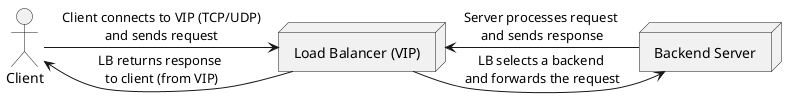

Great. I’ll create a 1,200–1,500 word executive overview titled **“Foundations & Layering of Load Balancing,”** written in a clear, real-world, problem-solution narrative style. It will target intermediate-to-advanced software engineers preparing for SDE interviews.

The piece will:

* Open with a concise TL;DR.
* Cover key motivations like high availability, scaling, and zero-downtime deploys.
* Explain the OSI layering of L3, L4, L7, and DNS/global load balancers, with relevant protocols.
* Highlight the role of virtual IPs/services.
* Walk through a client-to-backend request/response path.
* Explore trade-offs between layers, stateless/stateful design, and chaining approaches.
* Include a clearly labeled PlantUML block diagram of a simple request flow.
* Provide a quick-reference comparison table (L4 vs L7 vs GSLB).
* Conclude with 5 authoritative further-reading links.

I’ll get started and let you know as soon as it’s ready.

# Foundations & Layering of Load Balancing

**TL;DR:** Load balancing is the practice of distributing client requests across multiple servers to prevent overload and downtime. This overview explains how load balancers operate at different network layers (from low-level IP routing to high-level HTTP routing and global DNS anycast) to achieve high availability, horizontal scaling, low latency, and zero-downtime deployments. We walk through the role of virtual IPs, a client-to-backend request/response flow, and key trade-offs between fast but simple L4 load balancers and more intelligent L7 load balancers, including how global load balancing extends these concepts across datacenters.

## Core Motivations for Load Balancing

When an application grows beyond what a single server can handle, load balancing becomes essential. Load balancers allow **horizontal scaling** by spreading incoming traffic across multiple backend servers, ensuring no single machine becomes a bottleneck. This improves **high availability**: if one server fails, the load balancer detects it (via health checks) and routes incoming requests to other healthy servers, preventing downtime for users. By not letting any one server get overwhelmed, a load balancer also helps **latency smoothing** – each server handles a reasonable share, keeping response times low and consistent for users. Finally, load balancing enables **zero-downtime deployments**: you can take servers out of rotation one at a time to upgrade or restart them, while the load balancer seamlessly directs traffic to the remaining instances. This rolling update strategy means users experience no outage even during software releases or maintenance. In summary, load balancers keep services **available**, **scalable**, and **responsive** even as demand grows or infrastructure changes.

**Key reasons to use load balancing:**

* **High Availability:** Automatically reroute traffic if a server goes down, so the service stays online (no single point of failure). Health checks and intelligent routing let the system **“route around”** bad or overloaded instances.
* **Horizontal Scalability:** Distribute workload across multiple servers. As traffic increases, new servers can be added behind the load balancer to handle the load, with clients still connecting to one service endpoint.
* **Performance & Latency:** Prevent any one server from bogging down. Load balancers can send each new request to a lightly loaded or geographically closer server, reducing response times and smoothing out spikes in latency.
* **Zero-Downtime Deployments:** Enable rolling updates (draining traffic from one server at a time) or blue-green deployment strategies. Users continue to be served by other servers while one is updated, achieving deploys with no downtime.

## Load Balancing Across OSI Layers (L3, L4, L7, Global)

Load balancers can operate at different layers of the network stack, each with distinct capabilities. The classic references are **Layer 4 (L4)** vs **Layer 7 (L7)**, referring to the OSI model’s transport and application layers respectively. There are also **Layer 3 (L3)** load balancing techniques at the network layer, and **global load balancing** that operates above the local network (often via DNS or anycast). Each layer deals with particular protocols and data:

* **L3 Load Balancing (Network Layer):** Operates at the IP routing level. L3 load balancers direct traffic based on IP addresses without considering any transport ports or application data. This is often achieved through routing techniques – for example, advertising a service’s IP (VIP) from multiple devices or locations and letting routers decide (using protocols like BGP and ECMP) where to send each client packet. The load balancer here functions much like a router that spreads flows among multiple next-hop servers. L3 methods (like IP anycast) are simple and fast, but lack insight into higher-level details. They are useful for coarse load distribution and failover across networks or datacenters.

* **L4 Load Balancing (Transport Layer):** Operates at the transport layer, using information from protocols like TCP, UDP, or QUIC. An L4 load balancer makes forwarding decisions based on IP addresses and **port** numbers – essentially, it looks at the connection 4-tuple (source/dest IP and port) without inspecting the actual application data. L4 load balancers often perform Network Address Translation (NAT): the load balancer presents a single frontend IP/port but internally directs packets to one of many backend server IPs. Because they don’t decode application content, L4 balancers are highly **efficient** and fast. They “shuffle bytes” between client and server at high throughput, acting as a pass-through for TCP/UDP streams (sometimes terminating the TCP connection on the frontend and opening a matching connection to the backend, or even forwarding packets at the kernel level). Typical protocols at this layer include **TCP** and **UDP** – for example, an L4 balancer might distribute TCP connections for a database or UDP requests for a DNS service. Modern L4 load balancers also handle new transport protocols like **QUIC**, which operates over UDP. L4 is ideal when content-based routing isn’t needed – it’s simpler and generally faster (lower latency overhead) because it doesn’t inspect or modify the payload.

* **L7 Load Balancing (Application Layer):** Operates at the application protocol level, with full awareness of message content (Layer 7 of OSI). An L7 load balancer (also called an “application load balancer”) actually parses the client’s request (for example, an HTTP request) and can make routing decisions based on **application data** like URLs, HTTP headers, cookies, or message body content. This means the load balancer is effectively acting as an **HTTP/HTTPS** reverse proxy: the client connects to the L7 LB (often via TCP/TLS), the LB terminates that connection (decoding the HTTP request), and then opens a separate connection to a chosen backend server. Because it operates at the HTTP level, an L7 load balancer can do smart things like route `/api/*` requests to one server pool and `/images/*` to another, or implement **SSL/TLS termination** and **cookie-based session affinity**. Protocols commonly handled at L7 include **HTTP** and **HTTPS** (and WebSocket or gRPC, which ride on HTTP/2). The trade-off is performance: an L7 LB adds more overhead (parsing and possibly buffering application data) and typically can’t handle as many raw requests per second as an L4 balancer on the same hardware. However, the **intelligence and flexibility** at this layer are crucial for web applications and microservices, where content-based routing, security filtering, and application-aware health checks are needed.

* **Global Load Balancing (DNS/Anycast):** Beyond a single cluster or datacenter, **global server load balancers (GSLB)** distribute traffic across multiple geographic regions or sites. Global load balancing usually operates via **DNS** or **anycast**. In DNS-based load balancing, the system will return different IP addresses for a service’s domain name depending on the client’s location or server health – effectively directing users to a regional endpoint. This happens at the DNS application layer: the user’s DNS query is answered with an IP that routes to the “best” datacenter (based on proximity, load, etc.). GSLBs also monitor health and can failover traffic from one region to another if an entire site goes down. **Anycast** is a network-layer global balancing technique where the same IP address is advertised from multiple locations around the world; routers send each client to the nearest (in network terms) location announcing that IP. Anycast is often used for services like global DNS resolvers and CDN edge servers. Global load balancing focuses on **where** to route a client (which data center), rather than which specific server – once the client is connected to the chosen site’s front-end, a local L4 or L7 balancer takes over to pick an individual server. In summary, GSLB extends load balancing to the **worldwide scale**, considering factors like geographic latency, regional capacity, and disaster recovery.

## The Virtual IP (VIP) and Virtual Service Abstraction

A core concept in load balancing is the **Virtual IP (VIP)** or **virtual service**. This is an IP address (often paired with a port and protocol) that clients use to reach a service, but it isn’t tied to any single physical server. Instead, the VIP is owned by the load balancer and represents the service as a whole. The load balancer advertises this address and listens on it, fronting for a pool of backend servers. When clients send requests to the VIP, the load balancer transparently forwards or proxies those requests to one of the real servers in the pool.

Why is this abstraction important? It decouples the service endpoint from individual hosts. Servers can be added or removed behind the scenes without clients knowing or changing how they connect. The VIP remains constant – it’s the “single entry point” to a distributed service. Under the hood, the load balancer uses techniques like one-to-many NAT to map the single virtual IP to many real server IPs. For example, a load balancer might hold VIP **203.0.113.10** for web traffic on port 443. Clients connect to 203.0.113.10:443; the LB then chooses an actual server (say 10.1.1.5:8443 on the internal network) to handle each connection, translating addresses as needed. The backend server sees the connection coming from the load balancer (or in some modes, directly from the client’s IP), and the client gets responses as if they came from 203.0.113.10. If a server goes offline, the LB simply stops routing traffic to it and uses others, all transparent to the client. The VIP abstraction is what makes a cluster of many servers look like one unified service.

In load balancer configuration, you’ll often define a **“virtual service”** which includes the VIP (address and port) plus the protocol (e.g. TCP or HTTP) and perhaps a set of rules (like which pool of real servers to use, what load balancing algorithm, etc.). This abstraction is powerful: it allows changes in the backend (scaling up/down, maintenance) without altering the client-facing interface at all.

## End-to-End Request Flow (Client → LB → Backend)

Let’s walk through a typical request lifecycle with a load balancer in the mix, from client to server and back. Consider a user’s browser requesting a page from **[https://example.com](https://example.com)**:

1. **DNS Resolution:** The client first resolves *example.com* via DNS. In a global load balancing scenario, DNS might direct the client to an optimal data center. For instance, it returns the IP address of a load balancer (a VIP) in the nearest region. Suppose the DNS returns **203.0.113.10** – which is the VIP for our service’s load balancer.

2. **Client Connection to LB:** The client opens a TCP connection to 203.0.113.10 on port 443 (HTTPS). The load balancer at that IP\:port accepts the connection. If it’s an L7 load balancer, it may terminate the TLS encryption and the HTTP protocol. If it’s L4, it might just pass the bytes along to a backend after initial setup. In either case, the LB now represents the service to the client.

3. **Request Handling:** The client sends an HTTP GET request (for example, “GET /index.html”) to the load balancer. The LB now must choose a **backend server** to handle this request. It consults the configuration/algorithm – e.g. round-robin, least-connections, or perhaps a content-based rule (if L7) that directs traffic for “/index.html” to a certain server pool. Let’s say the LB picks Server A (one of the healthy backends) based on these rules.

4. **Load Balancer Forwards the Request:** The LB forwards the client’s request to Server A. In an L4 scenario, the load balancer might simply open a corresponding TCP connection to Server A and start relaying packets. In an L7 scenario, the LB likely crafted a new HTTP request on behalf of the client: it may add or remove certain headers (for example, adding an `X-Forwarded-For` header to record the client’s IP), then send the request over its own persistent connection to Server A. The destination IP of this packet is Server A’s IP (e.g., 10.1.1.5) and source IP might be the LB’s own IP (if doing NAT or proxy). Server A receives the request thinking it’s from the load balancer (or from the client’s IP if transparency is enabled).

5. **Backend Processing:** Server A processes the request just like a normal client request, then produces an HTTP response (say, the HTML for index.html). It sends the response back to the requester, which in this case is the load balancer’s address.

6. **LB Receives Response and Forwards to Client:** The load balancer takes the response from Server A and relays it back to the original client. For an L7 proxy, this means re-encrypting it if it had terminated TLS, and sending the bytes on the client’s TCP connection. For L4, it might mean simply forwarding the packets through the NAT. The client sees a response coming from the VIP (203.0.113.10) and the requested content is delivered. The load balancer might also do bookkeeping here – updating any metrics, logging, and maintaining the session if needed (for example, ensuring subsequent requests from the same client go to the same server if “sticky sessions” are configured).

7. **Connection persistence:** Depending on configuration, the LB may keep the client’s connection open for additional requests (HTTP keep-alive) and reuse the existing connection to Server A or possibly choose a different server for a new request (particularly if it’s a new session or after some idle time). The client is none the wiser that an intermediate device handled the communication with Server A.

Throughout this flow, the client is only aware of the service’s public address (the VIP), and the distribution of work to Server A (or B, C, etc.) is entirely transparent. The response path typically goes back through the load balancer as well, so the LB can potentially modify or inspect responses (in L7 cases, e.g. adding a header or doing compression) or simply ensure the return traffic is forwarded correctly to the client. In some configurations (like L4 direct server return), the response might bypass the LB for efficiency, but that requires special networking setup and is a niche case.

*(Diagram: Basic request flow from Client → Load Balancer → Backend. The load balancer sits in the middle, proxying requests and responses.)*

## High-Level Trade-offs and Design Choices

Different load balancing approaches involve trade-offs in complexity, performance, and capability. It’s important to understand these when designing a system:

* **L4 vs L7 – Speed vs Insight:** L4 load balancers are all about speed and light weight. Because they operate at the packet/connection level without peering into application data, they can handle large volumes of traffic with minimal added latency. For example, an L4 balancer might simply rewrite IP headers and send packets on their way, leveraging fast kernel-level switching – this makes it **“generally faster due to less content inspection”**. However, L4 lacks visibility into requests: it can’t distinguish an HTTP GET for `/login` vs `/images/banner.png`. L7 balancers, conversely, provide deep insight. They decode the actual requests and thus can make fine-grained decisions (routing or modifying traffic based on URLs, headers, methods, etc.). The trade-off is additional processing per request (parsing, terminating TCP/TLS, etc.), which means more CPU and potentially higher latency per hop. In practice, many architectures use L7 load balancers at critical user-facing boundaries where smart routing and policies are needed, and L4 load balancers for internal or high-throughput scenarios where content awareness isn’t required.

* **Stateless vs Stateful Designs:** Load balancers can be designed to minimize state, or they might track sessions in detail. **Stateless** load balancing (for example, using consistent hashing on source IP/port to pick a server) means each load balancer node doesn’t need to store per-connection information – any instance can make the same routing decision given the same input. This aids in building *highly scalable, distributed LBs* (you can add more load balancer instances without complex coordination). DNS and anycast-based global load balancing are inherently stateless in that sense: once the client is directed, the “load balancer” isn’t in the path. **Stateful** load balancers, on the other hand, track active sessions/flows and often bind a client to a specific server (e.g., for session persistence or just maintaining the same TCP connection). They may offer richer features (like tracking user sessions, detailed metrics, or in-order packet delivery guarantees) but have to manage that state (which can complicate failover of the LB itself and limit horizontal scaling unless state is shared). Many modern L7 proxies keep some state (like HTTP session affinity or WebSocket connections), so designers must consider how an LB cluster shares or partitions connections. In summary, stateless methods are simpler and more robust for scaling out, while stateful methods enable advanced behavior at the cost of complexity.

* **Edge vs Internal Load Balancing (Chaining):** In large systems, load balancing often isn’t a single layer — it’s done in **tiers**. An **edge load balancer** sits at the boundary (receiving traffic from external clients). This might be a global anycast IP or a set of L7 proxy servers at the front door of a service. Edge LBs handle initial routing, DDoS protection, TLS termination, etc. Once traffic arrives at the right data center and is filtered through the edge, it may be handed to **internal load balancers**. Internal LBs work within the system, distributing requests among microservices or database shards, for instance. A common pattern is chaining: e.g., DNS directs to a regional load balancer; that L7 load balancer routes the request to a specific service; within that service, another load balancer (perhaps at L4) balances across instances of that service. Each layer addresses a different scope – global vs local, or coarse vs fine-grained distribution. The trade-off here is added complexity versus specialization: multiple load balancers in series add slight overhead but allow each tier to make the decisions appropriate to its context (global vs regional vs service-level). Designing the right layering ensures reliability *and* efficiency – for example, global DNS LB handles geography, while an internal L7 LB knows application-specific routing logic.

In practice, high-performance systems often use a mix of these approaches. For instance, a global anycast IP provides ultra-fast routing to the nearest cluster (L3 technique), then an L4 load balancer inside that cluster terminates the TCP connection and distributes it to a set of application servers, and those servers might themselves call other services via an L7 load balancer (like a service mesh sidecar or an API gateway). Understanding the layering of load balancing helps in building systems that are robust (no single bottleneck), scalable to huge traffic, and yet intelligent enough to route each request to the optimal destination.

## L4 vs L7 vs Global Load Balancers – Quick Reference

To summarize the differences among a transport-layer load balancer (L4), an application-layer load balancer (L7), and a global load balancing solution (GSLB), the table below highlights key aspects:

| **Aspect**                 | **Layer 4 (Transport LB)**                                                                                                                                                                                                                            | **Layer 7 (Application LB)**                                                                                                                                                                                                                                                | **Global (DNS/Anycast LB)**                                                                                                                                                                                                                                                    |
| -------------------------- | ----------------------------------------------------------------------------------------------------------------------------------------------------------------------------------------------------------------------------------------------------- | --------------------------------------------------------------------------------------------------------------------------------------------------------------------------------------------------------------------------------------------------------------------------- | ------------------------------------------------------------------------------------------------------------------------------------------------------------------------------------------------------------------------------------------------------------------------------ |
| **OSI Layer & Scope**      | Network/Transport (Layer 4), typically within one site or region. Operates on IPs and ports.                                                                                                                                                          | Application (Layer 7), within a site or cluster. Understands application protocols.                                                                                                                                                                                         | Operates above L7 via DNS system or at L3 via BGP anycast. Spans multiple regions/datacenters globally.                                                                                                                                                                        |
| **Routing Decision Basis** | Uses IP addresses and port numbers. No insight into request content (e.g. treats all TCP streams the same).                                                                                                                                           | Inspects full request content (e.g. URL path, HTTP headers, cookies) to make content-based routing decisions.                                                                                                                                                               | Routes clients based on geographic proximity, server **health/capacity**, or policy. Often done by returning region-specific IPs in DNS, or letting routers send traffic to the nearest anycast announce.                                                                      |
| **Protocols Handled**      | TCP, UDP, and other transport protocols (e.g. handles TLS as opaque bytes, or QUIC as UDP traffic).                                                                                                                                                   | HTTP/S, WebSocket, gRPC, SMTP, and other application-layer protocols (often terminating TLS and HTTP).                                                                                                                                                                      | DNS protocol (for DNS load balancers) and BGP anycast at the IP layer. Not inline with application traffic – it influences where traffic is sent, rather than proxying it.                                                                                                     |
| **Performance**            | High throughput and low latency overhead. Minimal packet inspection means it’s very fast and can handle large volumes (like many millions of packets/sec).                                                                                            | Moderate overhead per request due to parsing and processing at the application level. Often the limiting factor is CPU/memory for deep packet inspection and SSL termination.                                                                                               | Not in the data path for each packet (clients talk to local LB after initial direction). DNS-based LB can react quickly to failures but is limited by DNS caching. Anycast is fast but routing changes propagate slowly (and long-lived TCP sessions may not re-route easily). |
| **Use Cases**              | Ideal for **basic load distribution** when all requests are equivalent – e.g. balancing database connections, or an internal service where content switching isn’t needed. Also used when raw performance is top priority (network appliances, etc.). | Ideal for **web applications and microservices** where intelligent routing is required – e.g. directing traffic by URL, implementing A/B tests, injecting auth or compression at the proxy. Also used for offloading SSL, caching, and application-layer attack protection. | Used for **multi-region deployments** and disaster recovery – ensures users around the world get directed to the nearest or healthiest datacenter. Crucial for high availability across data centers and for reducing global user latency (CDNs, global APIs).                 |

## Further Reading

* **“Maglev: A Fast and Reliable Software Network Load Balancer”** — Google (USENIX 2016)
* **RFC 4786 – *Operation of Anycast Services*** — IETF Best Current Practice
* **“Introduction to Modern Network Load Balancing and Proxying”** — Envoy Proxy Blog (Matt Klein)
* **“DNS Load Balancing and Failover”** — VMware Blog
* **“The Linux Virtual Server (LVS) HOWTO – Section on Scheduling and NAT”** — Linux Virtual Server Project
