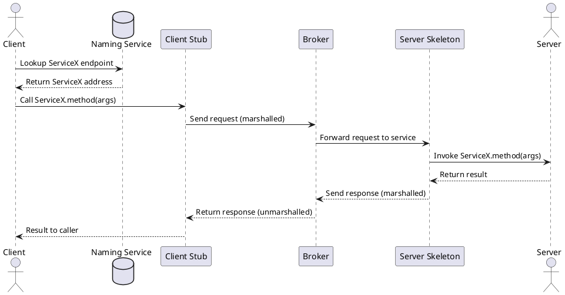

Great. I’ll draft a 1,000–1,200 word executive overview titled **“Broker Architecture Pattern: Decoupling Clients and Services at Scale”**, targeting intermediate-to-advanced software engineers preparing for system design interviews.

The article will:

* Follow a problem-solution storytelling format with clear, concise sections.
* Explain why direct client-service calls fail at scale.
* Detail broker architecture anatomy, including client stubs, server skeletons, brokers, and registries.
* Walk through the invocation flow with a `plantuml` diagram.
* Compare sync vs async models and transparency goals.
* Dive into discovery, versioning, load balancing, security, and modern tech like gRPC and service meshes.
* Conclude with common pitfalls and a Key Takeaways section.

I’ll let you know when it’s ready for your review.


# Broker Architecture Pattern: Decoupling Clients and Services at Scale

**TL;DR:** In large distributed systems, direct client-service calls become brittle and hard to scale. The **Broker architecture pattern** inserts an intermediary broker layer (with generated client stubs, server skeletons, and a registry service) to decouple clients from servers. This provides location transparency, standardized communication, load balancing, security enforcement, and easier monitoring at scale.

## The Downside of Direct Client-Service Calls

Imagine a growing microservices system where each service calls others directly over HTTP. At first it’s simple, but as services proliferate, **direct calls start to break down**. Clients must know each service’s network location and API details, leading to tight coupling. Hard-coded endpoints and protocols make it difficult to move or scale services without updating clients. Cross-cutting concerns like authentication, encryption, and rate limiting have to be implemented in every client-service pair, causing duplicated effort and potential inconsistency. As complexity grows, features like location transparency (calling a service without knowing its address), dynamic scaling, and observability become essential – but achieving these with ad-hoc direct calls requires bolting on proxies or sidecars later.

Furthermore, direct RPC-style calls can lull developers into treating remote calls like local function calls, which may result in **overly chatty interactions** that flood the network. Without a mediator, each client must handle connection management, retries, failover, version compatibility, and more. In short, **point-to-point integration doesn’t scale** gracefully; we need a better approach when the number of services and clients grows.

## Introducing the Broker Pattern and Its Core Components

The **Broker architecture pattern** addresses these issues by inserting an intermediary broker between clients and services. In this pattern (descended from classic Object Request Broker architectures like CORBA and modern RPC frameworks), clients do not call services directly. Instead, the broker **coordinates communication, results, and exceptions** on their behalf. This indirection decouples client and server, enabling each to evolve or move independently.

**Core components of a broker system include:**

* **Client-side Proxy (Stub):** A client calls a local *stub* object as if it were the remote service. The stub *encapsulates system-specific details* (like marshaling data and handling transport) and *“speaks the client’s language,”* presenting a native interface to the application. It mediates between the client and the broker, packaging the request into a message.

* **Server-side Proxy (Skeleton):** On the service side, a *skeleton* (server proxy) receives requests from the broker. It *unmarshals (deserializes) the data* and *“speaks the server’s language,”* invoking the actual service implementation. The skeleton then marshals the response (or exception) back. This proxy hides the networking logic from the service code.

* **Broker:** The broker is the intermediary that *locates the appropriate server*, routes requests, and transmits responses. It manages the communication infrastructure: handling connections, forwarding messages, and often enforcing policies (security, retries, etc.). The broker can be a dedicated service or a distributed component (e.g. a network of proxies).

* **Naming/Registry Service:** To allow dynamic discovery, services register themselves with a *naming service* (or registry). Clients (or the broker on their behalf) consult this registry to *find service endpoints by name*. This indirection enables location transparency – clients don’t need hard-coded addresses. The naming service may be a standalone directory (like DNS, ZooKeeper, Consul) or built into the broker.

* **Interface Definition (IDL):** Typically, the remote services are defined in an *Interface Definition Language* – a language-agnostic contract. From the IDL, code generation tools produce the client stubs and server skeletons in various programming languages. This ensures **protocol and language independence:** clients and servers can communicate even if implemented in different languages. The IDL serves as the single source of truth for the service’s interface, supporting consistent versioning and documentation.

**Practical Example – Defining a Service:** For instance, using Apache Thrift’s IDL one might define a service interface:

```thrift
service UserService {
  string getUserName(1: i32 userId)  // Request userId, returns user name
}
```

After running the Thrift compiler, a Java client can call `getUserName(42)` via a generated stub, and a Python server can implement the same service – the Thrift broker mediates between them. Similarly, in gRPC (which uses Protocol Buffers for IDL), you would define a service with RPC methods in a `.proto` file. The gRPC tool generates code, and the client simply calls `stub.getUserName(request)`; the library handles marshalling the request to a binary format, sending it over HTTP/2, and unmarshalling the response back to the stub.

## How a Brokered Request Works (Invocation Flow)

When a client invokes a remote operation via the broker, a series of steps occurs behind the scenes:

1. **Lookup:** The client (or its stub) queries the naming/registry service to resolve the target service’s current location (e.g. obtain a host/port or a specific server identifier). This lookup may be cached for performance.

2. **Marshalling:** The client stub *marshals* the invocation – i.e. it serializes the method name, parameters, and context into a request message. This could be a binary encoding (as in gRPC or Thrift) or JSON/XML, etc., depending on the protocol.

3. **Transport via Broker:** The stub sends the request to the broker (over the network). The broker uses the service identifier (from lookup) to route the message to an appropriate server instance. The actual transport might be a socket, HTTP call, message queue, etc., but the client doesn’t need to care – the broker and stubs handle the details.

4. **Unmarshalling & Execution:** On the service side, the server skeleton (possibly triggered by the broker delivering the message) unmarshals the request data back into a method call and invokes the actual service implementation. The service processes the request and produces a result or exception.

5. **Marshalling Response:** The result (or error) is marshalled into a response message by the server skeleton.

6. **Response Transport:** The broker sends the response back to the client (often over the same connection or via a callback mechanism).

7. **Unmarshalling Result:** The client stub receives the response and unmarshals it into a return value or error, which it then returns to the original caller as if it were a normal function return.

This entire flow **aims to be transparent** to the developer writing the client or service – the remote invocation is made to feel like a local call in syntax and semantics, even though a lot of networking magic happened in between.

**Sequence Diagram – Remote Invocation via a Broker:**



In the above diagram, the client first resolves the service location via the registry. It then calls into the local stub, which handles serialization and passes the request to the broker. The broker forwards it to the server’s skeleton (possibly on a different machine). The skeleton calls the actual service implementation and then sends back the result through the broker and stub.

## Invocation Models: Synchronous vs. Asynchronous

A brokered invocation can be **synchronous** (blocking the caller until a response arrives) or **asynchronous** (non-blocking invocation). Synchronous RPC calls are the closest to making the remote call act like a local procedure call (the caller waits and then continues with the result). Asynchronous models allow the client to fire off a request and do other work, or handle the response via a callback or future/promise when it arrives. Many RPC frameworks support both styles – for example, gRPC allows stub methods to be called in async fashion, and most languages’ gRPC libraries offer both sync and async APIs.

Beyond request/reply semantics, some broker systems also support **one-way, “fire-and-forget” calls**. A one-way call means the client sends a request but does not expect any response (not even an acknowledgment at the application level). This is useful for logging, notifications, or commands where you don’t need to block. For instance, Apache Thrift lets you mark service methods with the `oneway` keyword, which generates client code that doesn’t wait for a response. The trade-off is that the client won’t know if the server actually completed the operation – only that the request was delivered to the transport layer. One-way invocations can improve performance and decouple timing, but require the system to tolerate “at-most delivery” semantics (no retry by default, since the client isn’t waiting).

Additionally, modern broker frameworks often support **streaming or duplex communication** (e.g. gRPC streams, or message brokers with continuous feeds). These allow a single invocation to yield multiple messages in response or allow both client and server to send messages independently over a session. This is beyond basic request/reply, but is an evolution of the broker idea for real-time or large-scale data transfer.

## Location, Protocol, and Language Transparency

One of the broker pattern’s **key goals is transparency**: the client shouldn’t need to know where the service is, what language it’s written in, or what transport protocol is used. The broker and proxies abstract these details away:

* **Location Transparency:** The client interacts with a service by logical name or interface, not by hardwired address. Whether the service is on the same machine or across the globe, the call works the same. The broker handles locating an appropriate server instance at runtime. This indirection also supports mobility – services can change IP/port or scale to new hosts, and as long as they update the registry, clients continue calling seamlessly.

* **Protocol Independence:** A robust broker can translate between different communication protocols. For example, a broker might accept a JSON/HTTP request from a web client and forward it as a binary RPC to a backend service, or vice versa. More commonly, the stubs and broker agree on a single protocol (e.g. gRPC uses HTTP/2 + Protobuf), but the point is the application code doesn’t have to deal with HTTP vs. TCP sockets, etc. The broker can also upgrade transports (like handling TLS encryption on behalf of the client and server).

* **Language Interoperability:** Using an IDL and code generation, the broker pattern enables polyglot systems. A service can be implemented in Go and a client written in Python, and the broker will make them talk smoothly. The IDL compiler generates the necessary marshalling code in each language. For example, Apache Thrift and gRPC both support generating stubs/skeletons in numerous languages from the same service definition, ensuring that the wire format and contracts match on both sides. This allows teams to choose appropriate languages for different services without sacrificing the ability to intercommunicate.

* **Interface Versioning:** Because all interactions go through well-defined interfaces, we can manage changes via versioned IDLs or endpoints. A broker or registry can support multiple versions of a service simultaneously (e.g. `UserService.v1` vs `UserService.v2` as separate registrations) to allow a smooth transition. Good IDL practice (like Protocol Buffers’ rule of not reusing field numbers and allowing optional fields) enables adding new parameters or methods in a backward-compatible way. The broker can route clients to the appropriate service version based on requested interface or metadata. This dynamic binding means clients can upgrade to new versions gradually rather than all at once.

## Service Discovery and Dynamic Binding

**Service discovery** is how a broker-based system remains flexible in a dynamic environment. Rather than using static addresses, services **announce themselves to the broker/registry** on startup (often registering a name and version, plus their network location). When a client needs to call a service, it performs a lookup by service name (and possibly other attributes like version or locale). The broker or naming service returns a current endpoint (or list of endpoints) for that service. This allows **dynamic binding** at runtime: if a service instance goes down or new ones are added (scale-out), the registry info updates, and new client calls automatically use the updated list.

For example, in a microservice deployment, a service might register with a system like *Consul, etcd,* or *Eureka,* or in a service mesh the control plane provides the registry via an API (Envoy’s *EDS* in xDS API is an endpoint discovery service). The client stub or sidecar proxy then resolves and may even cache these endpoints. Some brokers also do late-binding per request, choosing a fresh server instance for each call (useful for load balancing).

**Dynamic versioning strategies:** With a registry, you can deploy multiple versions of a service simultaneously. Each registers under a different identifier (or the same name with different version metadata). Clients can specify which version they want, or the broker can tag requests (e.g. using an HTTP header or method variant) to route to a particular version. Another approach is *capability negotiation* – new clients may call a newer method, while old clients stick to old methods; the service implementation checks and handles both. The key is that the broker pattern makes these version hops explicit and manageable via the service interface and registry, rather than hidden in scattered URIs.

## Load Balancing, Connection Pooling, and Fault Tolerance

In a distributed system at scale, a single service is often replicated across many instances. The broker pattern naturally enables **load balancing** strategies: since the client doesn’t call a specific instance, the broker can decide which server instance should handle each request. This could be a simple round-robin, a random choice, or a sophisticated policy based on health and load. Modern broker implementations (like API gateways or RPC proxies) often include *health checking, outlier detection,* and *zone-aware load balancing* to efficiently distribute traffic. For example, Envoy (a popular service proxy) can perform active health checks on service instances and avoid sending requests to unhealthy ones, and it supports many load balancing algorithms out of the box.

**Connection pooling** is another essential mechanism. Opening new network connections for every request is expensive, so brokers and stubs reuse connections when possible. For instance, a gRPC client maintains a channel (HTTP/2 connection) to a server or load balancer and sends multiple requests over it concurrently. Brokers like Envoy maintain connection pools to upstream services to reduce handshake overhead. This pooling improves performance and also provides a place to enforce connection limits to protect servers from being overwhelmed.

The broker pattern also helps with **fault tolerance**. If a service instance is down or slow, the broker can retry the request on another instance, or return a fallback response if configured. Many systems implement **circuit breakers** – if a service is failing repeatedly, the broker (or client stub) “opens” the circuit and stops sending requests there for a cooldown period. This prevents wasting calls on an unresponsive service and gives it time to recover. Brokers can also implement **timeouts** (notifying the caller if the service doesn’t respond in time) and **failover** logic (e.g. try a secondary service or data center if the primary fails). By centralizing these policies in the broker, you avoid duplicating them in every client.

**Example:** In a service mesh using Envoy proxies, each service’s sidecar proxy monitors the health of upstream services and load-balances calls. If one instance of `OrderService` goes down, the sidecars automatically stop sending traffic to it. They also pool connections to `OrderService` instances so that each service talker isn’t opening new TCP connections for each call. This yields more resilient and efficient communication than naive direct calls.

## Security Hooks in the Broker

Security is a cross-cutting concern significantly simplified by a broker architecture. Rather than building authentication and authorization into every service and client, the broker (or proxies) can act as a gatekeeper:

* **Authentication & Authorization:** A broker can require clients to present credentials (tokens, certificates, API keys, etc.) on each request. It can authenticate the client’s identity and enforce authorization rules before forwarding the request to the service. For example, an API gateway might verify a JWT token and check the client’s permissions for the requested operation. Only if the check passes does it route the call to the backend service, which can thus trust that the broker handled auth. This centralizes security logic and ensures uniform enforcement.

* **TLS Termination & mTLS:** Brokers often handle encryption. A client might communicate with the broker over TLS (HTTPS), and the broker can terminate TLS (decrypt) and then use an internal secure channel to the service. In service mesh environments, mutual TLS is common – the sidecar proxies (brokers) in front of both client and server establish a mutual authenticated TLS connection, handling certificate verification. The service code doesn’t need its own TLS stack; the broker ensures data-in-transit is encrypted and that both sides are who they claim to be.

* **Tenant Isolation:** In multi-tenant architectures (where multiple customers or user groups use the same services), the broker can ensure isolation by tagging or segregating traffic. For instance, it might use separate routing rules or credentials for each tenant’s requests, preventing any accidental cross-talk. A broker could route Tenant A’s requests only to Tenant A’s dedicated service instances or apply policies (like rate limits) per tenant. This is much easier at a central broker point than scattered across services.

* **Auditing and Input Sanitization:** Because all calls funnel through the broker, it’s an ideal choke-point to log security-sensitive actions and sanitize inputs. A broker can scrub or validate request data (e.g. checking for SQL injection patterns in a query string, if acting as an API gateway) before it even reaches the service.

By leveraging these hooks, organizations achieve **consistent security** across services. A real-world example is a service mesh like Istio (built on Envoy): it provides a declarative policy to require JWT authentication on certain endpoints, enforce role-based access control, and encrypt all service-to-service traffic with mTLS – all without changing the service code.

## Monitoring, Tracing, and Back-Pressure Management

When all inter-service calls go through a broker or proxies, it creates a natural vantage point for **observability**:

* **Monitoring & Metrics:** Brokers record metrics for each call – latency, throughput, error rates, payload sizes, etc. These metrics can feed into dashboards and alerting systems to watch the health of the system. For example, gRPC and Envoy emit stats like request counts, error counts, and timing distributions for each service cluster. This helps identify performance bottlenecks or failing services quickly.

* **Distributed Tracing:** In modern architectures (using tools like Jaeger or Zipkin), each request carries a trace ID that tracks it through multiple services. Brokers and stubs can automatically propagate these IDs and even start trace spans for the leg of the journey they handle. For instance, the client stub might start a span for the outbound call, the broker logs an annotation when it forwards the request, and the server skeleton continues the trace. This gives end-to-end visibility into how a request flows and where time is spent, critical for debugging in microservices.

* **Logging:** Central brokers often perform **access logging** – recording each request and response (or at least metadata about them). This is useful both for audit purposes and for debugging interactions. Instead of chasing logs on every microservice, you might find an error logged once at the broker.

* **Back-pressure & Throttling:** A well-designed broker can prevent overload by pushing back on clients when services are overwhelmed. Techniques include **rate limiting** (denying or queueing requests that exceed a certain rate) and **load shedding** (dropping or scaling back less critical traffic when the system is saturated). Envoy’s overload manager is an example: if CPU or memory is too high, it can start shedding load (e.g., returning error responses without hitting the backend). Brokers can also enforce client-specific quotas to ensure no single client overconsumes resources. Additionally, brokers or messaging-based brokers can use **queueing** to buffer bursts of requests and let services work at a safe pace, effectively decoupling producer and consumer speeds. This prevents the classic “thundering herd” problem where a surge of requests could crash a service.

By centralizing monitoring and back-pressure at the broker, the system gains resilience. The **broker becomes an early warning system** – noticing latency creep or increased error rates – and can take action (open circuit breakers, throttle input) to keep the overall system stable.

## Modern Real-World Examples

The broker pattern is not just theory; it manifests in many modern systems:

* **gRPC with xDS:** [gRPC](https://grpc.io) is Google’s open-source RPC framework that embodies the broker pattern via libraries. Developers define services in a Proto IDL, and gRPC generates client stubs and server interfaces in multiple languages. Under the hood, gRPC stubs handle name resolution (e.g. via DNS or a custom resolver), marshalling (Protocol Buffers), and transport (HTTP/2). Out of the box, gRPC channels can do simple client-side load balancing (round-robin across addresses). Moreover, gRPC is integrating with **xDS**, a set of APIs originally from Envoy’s control plane, to allow dynamic service discovery and configuration. This means a gRPC client can get its backend endpoints, load balancing policy, and even routing rules from a central control plane (like traffic director or Istio’s pilot), just like an Envoy proxy would. In essence, gRPC acts as a **broker library** inside the application process – the pattern without an external broker process.

* **Apache Thrift:** Thrift is a veteran cross-language RPC framework (born at Facebook, now Apache) that also follows the broker architecture. You write an interface in Thrift IDL, generate stubs/skeletons, and Thrift takes care of network communication. Thrift supports multiple protocols (binary, compact, JSON) and transports (raw sockets, HTTP, etc.), so the broker could be configured to use different underlying encodings without changing the interface. Thrift even has a built-in service discovery mechanism in some setups, or you can plug in your own. It supports **oneway** methods (fire-and-forget) as noted earlier, showing how asynchronous invocation is built in. While not as hype-worthy as gRPC, Thrift remains a solid example of the broker pattern in practice, widely used in high-scale systems (Twitter’s RPC framework *Finagle* can speak Thrift, for example).

* **NATS (Request-Reply):** [NATS](https://nats.io) is a lightweight publish/subscribe messaging system, but it also supports a request-reply pattern that essentially turns it into a broker for RPC-style calls. A client can **publish a request** on a subject and include a reply-to subject; some service subscribed to that subject will handle it and publish a response to the reply subject. The NATS server (broker) handles delivering the request to one of the subscribers (it can load balance via queue groups) and routing the response back to the originator’s inbox. This achieves location transparency because neither client nor server needs to know each other’s address – they just use subjects. NATS’ approach emphasizes simplicity: the broker is a generic message router, and request/reply is a convention on top. It shows that even systems not explicitly called “RPC frameworks” can implement the broker pattern for decoupling and scaling. NATS additionally has built-in support for **observability** (you can attach a sniffer subscriber to see requests for monitoring) and can easily scale responders up or down without reconfiguring clients.

* **Service Mesh (Envoy + Control Plane):** In a service mesh like *Istio* or *Linkerd*, the data plane is a network of Envoy proxies (sidecars) that intercept all service-to-service calls – effectively acting as a distributed broker. When service A wants to call service B, in reality A’s Envoy intercepts the call and routes it to B’s Envoy, which then forwards to B. This indirection provides the classic broker benefits: **service discovery** (Envoy gets dynamic endpoint info via the control plane’s xDS APIs), **load balancing** (Envoy chooses an endpoint for each request, with many algorithms available), **fault tolerance** (retries, timeouts, circuit breaking), and **security** (Envoy terminates and initiates TLS, and can require authentication tokens). The control plane (e.g. Istio Pilot or Kuma CP) acts as the *naming/registry*, distributing service directories and policies to the proxies. This architecture is an evolution of the broker pattern where the broker is decentralized: each service instance has a local broker (sidecar) and they coordinate. Nevertheless, the principles are the same – clients are oblivious to where services run, and you can inject policies in the middle. For example, if service B’s API is updated, you could deploy a new version B2 and program the mesh to route 10% of traffic to B2 and the rest to B1 – all transparently to service A. **Envoy** is essentially a modern, high-performance broker with a rich feature set for microservice communication.

* **Message Broker Systems:** The term “broker” also appears in systems like **Apache Kafka, RabbitMQ, or MQTT brokers**. These are more geared towards asynchronous messaging, but they share the decoupling goal. A sender publishes messages to a broker rather than directly to a receiver. While not an RPC request/response, many architectures use message brokers to achieve the same decoupling for commands or events. For example, instead of a direct HTTP call, a service might publish a message to a broker and another service will consume it – the broker buffers it, routes it, maybe transforms it. Some message brokers (like RabbitMQ) even support RPC by having the client send a message with a reply queue and correlation ID, similar to NATS request-reply. These demonstrate the versatility of the broker concept across different integration styles (synchronous vs event-driven).

Each of these real-world technologies implements the broker pattern with its own twist, but all share the common theme: **don’t let clients and services be tangled in point-to-point spaghetti.** Use an intermediary (or an abstraction layer) to handle the complexity of communication.

## Common Pitfalls and Anti-Patterns

While the broker pattern brings many benefits, one must be wary of potential pitfalls:

* **Overly Chatty Interfaces:** The convenience of calling remote methods like local ones can lead to designs with lots of fine-grained calls. An “API” that requires a dozen remote calls to accomplish a task will suffer in performance due to network latency. This is an anti-pattern often called *chatty services*. It’s crucial to design interfaces with coarse-grained operations or use batching to avoid excessive round trips. Otherwise, the broker just ends up forwarding an avalanche of tiny requests – overwhelming the network and the broker itself.

* **Broker as a Bottleneck:** If the broker is implemented as a single service or a small cluster, it can become a scalability chokepoint. All traffic going through one broker means you must scale that broker vertically or horizontally to handle load. A poorly tuned broker could add latency or even crash under high throughput. The remedy is to ensure the broker is distributed (e.g. multiple instances, or like in a mesh each service has its own proxy) and stateless where possible so it can scale horizontally. Also, avoid doing heavy processing in the broker – keep it mostly a pass-through with minimal logic to reduce overhead. Systems like Kafka avoid a single broker bottleneck by partitioning topics across many brokers, so load is shared.

* **Single Point of Failure:** Relatedly, a broker introduces a dependency in the call chain – if the broker is down, communication stops. This can be mitigated with redundancy (multiple broker nodes) and failover logic in clients (try another broker endpoint). Nonetheless, careful planning is needed to ensure high availability of the broker layer.

* **Hidden Coupling via Contracts:** The broker decouples the *networking*, but not the *service contract*. Clients and servers are still tightly coupled to the interface (IDL) they share. If you change a service’s interface (say remove a field or alter semantics), it can break clients – even though the broker is in place. This is not a flaw per se, but something to manage through proper versioning and backward compatibility. Teams should not get a false sense of security that the broker handles all changes magically. It’s “loose coupling” in terms of deployment and scaling, but still a **coupling of API**. Also, performance coupling: a client may treat a call as local, but if the network or server is slow, the client’s experience suffers. These interactions are hidden behind the broker, which can make debugging tricky if developers forget there’s a network in between.

* **“God Broker” Anti-Pattern:** This refers to shoving too much logic or responsibility into the broker such that it becomes a giant, monolithic component (and often, a headache). If your broker not only routes calls but also transforms messages, calls other services (becoming an orchestrator), and contains business logic, you may be turning it into a **central brain that’s hard to replace or scale**. It can also blur separation of concerns – business logic is best kept in services, not middleboxes. A God Broker can slow down development (every change needs broker update) and reintroduce tight coupling in a different form. The lesson is to keep the broker focused on generic communication concerns (routing, monitoring, security, etc.) and not let it become a catch-all for every concern. If you need request orchestration or complex data aggregation, consider dedicated services for that, rather than overloading the broker.

* **Latency and Debugging Surprises:** Introducing a broker adds an extra network hop (or two) which does add some latency. In many cases it’s negligible (microseconds to a few milliseconds, especially with efficient brokers), but in ultra-low-latency domains this might be a deal-breaker. Also, when something goes wrong, you now have to consider the broker in your troubleshooting: is the bug in the client, broker, or server? Good logging and tracing are critical, as is ensuring the broker doesn’t obscure error messages (e.g. passing through error details from the server to the client appropriately).

* **Cost of Maintenance:** Operating a broker infrastructure (whether a fleet of API gateways or a mesh control plane) comes with operational complexity. Teams must manage the deployment, upgrades, and configuration of this intermediary layer in addition to the services themselves. If the broker pattern is implemented via library (like gRPC), then ensuring all services upgrade to new library versions for bug fixes can also be a chore. These are manageable issues, but worth remembering that the broker is another moving part in the architecture.

In summary, to avoid these pitfalls: design thoughtful service APIs, scale your broker layer appropriately, maintain clear service contracts, and keep the broker’s role focused and reliable. Used judiciously, the broker pattern greatly amplifies a system’s scalability and flexibility, but misused, it could become the proverbial wrench in the works.

## Key Takeaways

* **Decoupling via Indirection:** The broker pattern uses an intermediary to decouple clients from service implementations. Clients call stubs *locally*, brokers route to actual services – enabling location and implementation transparency.

* **Core Building Blocks:** **Client stubs** and **server skeletons** handle marshalling/unmarshalling and hide transport details. A **broker** coordinates communication and a **registry** enables dynamic service lookup.

* **Transparency and Flexibility:** Brokers provide **location transparency** (clients need not know where services run), **protocol independence**, and **multi-language support** via IDL and code generation.

* **Scalability Features:** Built-in **service discovery**, **load balancing**, and **connection pooling** allow systems to scale out easily, while **fault tolerance** techniques (health checks, retries, circuit breakers) keep things resilient.

* **Security and Observability:** The broker acts as a choke point to enforce auth (identity, permissions) and encryption, and to gather metrics and traces. This centralizes security checks and monitoring for all service calls.

* **Sync vs Async:** Both traditional request/response and one-way or streaming calls are supported. Brokers can handle synchronous blocking calls or asynchronous fire-and-forget messaging, depending on use case.

* **Real-World Use:** Modern platforms like **gRPC**, **Thrift**, **NATS**, and **service meshes (Envoy/Istio)** all utilize the broker pattern’s principles – demonstrating its relevance from RPC frameworks to messaging systems.

* **Beware of Pitfalls:** Avoid *chatty APIs* that undermine performance. Ensure the broker doesn’t become a single point of failure or bottleneck by scaling it horizontally. Keep broker logic generic and not a dumping ground for business logic (to prevent a “God Broker”). Always manage service interface changes carefully, since the broker won’t save you from breaking changes.

By adhering to these principles, the Broker architecture pattern can significantly simplify **system design at scale**, making your distributed system more **robust, flexible, and easier to manage** in the long run.
