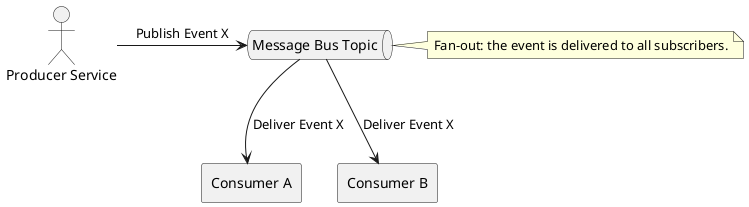

Got it. I’ll prepare an executive overview titled “Message-Bus Architecture: Command, Event, and Everything in-Between,” tailored for intermediate-to-advanced software engineers prepping for system-design interviews.

I’ll walk through the problem-solving narrative format and cover all the specified technical points, including diagrams and a vendor-neutral tone except in the real-world snapshots.

I’ll let you know when the overview is ready for your review.

**TL;DR:** A message bus architecture decouples services and coordinates communication when direct calls or ad-hoc point-to-point integrations break down. This overview explains how a message bus works (channels, envelopes, publishers, handlers) and contrasts command vs. event buses. It covers synchronous vs. asynchronous modes, delivery guarantees, reliability patterns (ordering, idempotency, retries, dead-letter queues), distributed transactions via Sagas, schema versioning, observability (monitoring/tracing/back-pressure), common pitfalls (hidden coupling, bottlenecks, complexity), and real-world examples (in-process bus, Kafka-style log, enterprise service bus).

# Message-Bus Architecture: Command, Event, and Everything in-Between

## Why Simple Approaches Fail – The Case for a Message Bus

Imagine a growing microservices system where each service calls others directly via APIs. Initially it’s simple, but cracks appear as you scale. What happens when a downstream service is slow or offline? Synchronous calls stall the upstream service; requests pile up and failures cascade. Even using point-to-point message queues between specific services doesn’t fully solve the problem: with many services, the number of individual connections or queues explodes, creating a fragile web of integrations. This spiderweb of direct links is hard to manage and still tightly couples each producer to each consumer. We need a **better mediator**.

**Enter the message bus.** A message bus introduces an intermediary so that producers and consumers communicate indirectly. Services publish messages to the bus without waiting for a response, handing off work asynchronously. The bus (often a broker) stores and routes messages to interested parties. If a recipient service is slow or down, the message simply waits in the bus until it can be delivered; nothing else stalls. This decoupling provides resilience and flexibility. New services can tap into the bus to receive events without the senders even knowing they exist, avoiding modifications to each producer. In short, when direct calls and ad-hoc queues start to fail under load or complexity, a message bus becomes the system’s communication backbone that **levels out spikes, buffers failures, and simplifies many-to-many interactions**.

## Anatomy of a Message Bus (Channels, Envelopes, Publishers, Handlers)

At its core, a message bus is an abstraction for exchanging messages between components without them needing direct knowledge of each other. It consists of a few key parts:

* **Bus and Channels:** The bus acts like a central hub or **communication pipeline**. Logically, it may be divided into *channels* or *topics* that categorize messages. Think of channels as named mail slots on the bus – messages labeled with a channel go into the corresponding slot. Publishers post messages to a channel, and only the subscribers to that channel receive them. This organization prevents a noisy mess; each service can focus on the message types it cares about.
* **Message Envelope:** Every message is more than just data – it’s wrapped in an *envelope* that carries metadata. The envelope typically includes a message type or name, a unique ID, maybe a timestamp or origin, and sometimes headers like routing keys, correlation IDs, or version numbers. This metadata allows the bus and consumers to route and process the message correctly. For example, a message envelope might declare “Event: OrderCreated, CorrelationID: 12345, SchemaVersion: 1.2” along with the actual payload. Envelopes make the system robust by adding context (who sent this? what format?) and traceability to each message.
* **Publishers (Producers):** Any component that sends messages into the bus. A publisher does not call a specific receiver; it simply *publishes* to the bus on a channel and continues on. The publisher often doesn’t even know which service (if any) will ultimately handle the message. This is a sharp contrast to direct calling – the publisher’s only dependency is the bus’s availability, not the myriad of potential receivers.
* **Handlers (Consumers/Subscribers):** Components that receive messages from the bus and act on them. A handler subscribes to certain channels or message types. The bus ensures each message delivered matches a subscriber’s interest. Handlers can be services in other processes, or even in-process functions for a lightweight bus. Importantly, handlers typically run independently and concurrently; one service’s handler processing a message doesn’t block another. Handlers may acknowledge messages after successful processing (allowing the bus to record completion or remove the message), or let the bus know if processing failed so it can retry or redirect the message.

Under the hood, the bus can be implemented in various ways – as an in-memory mediator within a single application, or as a full-fledged message broker service (like RabbitMQ, Kafka, or a cloud service) facilitating cross-network communication. But the **conceptual anatomy remains the same**: a structured pipeline (bus/channels) carrying self-contained envelopes from senders to one or more receivers.

## Command Bus vs. Event Bus – One-to-One vs. One-to-Many

Not all messages are the same. Two common messaging styles are **commands** and **events**, and they differ in intent, dispatch semantics, and coupling.

A **Command Bus** carries commands – imperative messages that **tell a single receiver to do something** (e.g. “CreateOrder”, “GenerateReport”). By design, a command is handled by **exactly one** component. The sender often expects that *someone* will act on the command, possibly even wanting a result or acknowledgement (though typically commands don’t return a direct value). Command buses are often used to decouple requesters from handlers in a system: the sender puts a command on the bus, and the bus ensures it reaches the one appropriate handler. This still gives us decoupling in space (the sender doesn’t know the handler’s location or implementation) but introduces a form of logical coupling – the assumption that a handler exists and will perform the action. In practice, command messages imply a **tighter contract**: if no service subscribes to a given command, that’s usually an error. Thus, a command bus is great for **directed tasks** with single responsibility, while still avoiding direct service calls.

An **Event Bus** carries events – **statements of fact about something that *happened*** (e.g. “OrderCreated”, “UserRegistered”). Events are published *after* some business action has occurred, and there may be **zero, one, or many handlers** interested. The event publisher does not wait for any response and doesn’t assume any particular receiver. If no service cares about an event, it simply vanishes into the void (or sits in a log) with no impact on the publisher – this is fine, as the event’s purpose was just to announce. If multiple services subscribed, the bus will deliver a copy to each of them (a **fan-out** delivery). This one-to-many capability is a powerful way to add new reactions to events without changing the event producer at all. Event buses thus enable extremely **loose coupling** in time and knowledge: producers and consumers are unaware of each other. However, events also imply that the publisher **doesn’t control outcomes** – it’s up to each subscriber to decide what to do, if anything, when the event arrives.

**Dispatch semantics:** In summary, commands are like direct *point-to-point* messages (but routed through the bus), whereas events are *publish-subscribe* broadcasts. A command bus often enforces a **single active handler** policy (like a queue with one consumer), ensuring only one component processes each command. An event bus uses a **multicast** model – every subscriber gets the event. This difference affects system design: command handlers might be designed to perform required actions *instead of* the sender (often in a RPC-like fashion, even if decoupled), whereas event handlers perform additional work *in reaction* to something already done (often asynchronously and in parallel).

**Coupling:** Command buses tend toward *logical coupling*: the sending code might need to know that a command of a certain type will be handled by some component that fulfills a specific function. Changing the command’s intent or format is akin to changing an API contract. Event buses reduce this by making notification fire-and-forget. Yet, they introduce *implicit coupling* on data schemas – publishers and subscribers still share the definition of the event’s structure. We’ll discuss schema versioning later, but it’s worth noting that even in an event-driven design touted as “fully decoupled,” if multiple services rely on an event’s content, a change to that event’s schema can ripple through and break consumers, creating hidden coupling beneath the surface.

## Synchronous vs. Asynchronous Messaging

One critical design choice is whether message handling is synchronous or asynchronous. **Most message bus interactions are asynchronous** by nature – a service publishes a message and doesn’t block waiting for it to be handled. The bus queues the message and the flow is *fire-and-forget* from the publisher’s perspective. This asynchrony is what gives a message bus its power to decouple and buffer systems: the publisher can move on immediately, and the receiver processes on its own time. It’s ideal for workflows where immediate responses aren’t required and for increasing system resiliency. For example, a web server can publish “SendWelcomeEmail” to a bus and return a signup response to the user without waiting for the email service to actually send the email.

However, there are cases where **synchronous behavior on a bus** is useful. In an *in-process bus* (within a single application), posting a message might directly invoke the handler method and return when it’s done (essentially functioning like a function call dispatcher, but decoupled by interface). Some command bus patterns in application architectures work this way – e.g., a controller puts a command on the bus and expects the command handler (in the same process) to run and maybe give a result. This yields a synchronous call *through* the bus. Another scenario is a **request-reply** pattern over a message bus: a service sends a request message and then waits (synchronously) for a specific response message. The messaging infrastructure can correlate the response to the request (using correlation IDs) to wake up the sender with a reply. This is still decoupled communication (the reply could come from any instance of a service listening), but it introduces a synchronous waiting period.

In general, pure message bus architectures favor asynchrony for maximum decoupling. Synchronous usage of a bus (especially across network boundaries) can negate some benefits, since if the sender waits, we’re back to being blocked by the receiver’s speed. Thus, use synchronous messaging sparingly – for example, in orchestrating a workflow where a step needs a quick answer and using the bus’s routing but still wanting to block minimally. Always consider if the *temporal coupling* of a synchronous call is truly needed; often, redesigning to fully async yields a more robust solution.

## Delivery Guarantees: At-Least-Once, Exactly-Once, etc.

When messages are flying around, we have to consider **delivery semantics** – does every message always get delivered? Could it be delivered twice? These guarantees are a crucial aspect of a bus’s design:

* **At-Most-Once:** A message is delivered *0 or 1 times*. In at-most-once, the system makes no retry attempts. If something goes wrong, the message might be lost forever. This is essentially “fire-and-forget” with no confirmation. It’s simple but risky for important data (imagine losing a “process payment” command!). Many push-based notification systems are at-most-once by default – they don’t wait for acknowledgments. Unless the business can tolerate occasional drops, at-most-once isn’t commonly desired for critical processes.

* **At-Least-Once:** A message will be delivered *one or more times* – the system will keep trying until it gets an acknowledgement from a consumer that the message was processed. This is the most common guarantee for robust messaging. It trades potential duplicates for much higher reliability. The bus or broker will persist the message and expect a consumer to explicitly ACK it. If an ACK isn’t received (consumer crashed, network glitch, etc.), the message is redelivered (often to the same handler or maybe another, depending on the system). Almost all enterprise message queues operate at-least-once by default because it’s better to do something twice than to never do it at all for critical tasks. The downside is that handlers **must be ready to handle duplicates**, because at-least-once means two deliveries are possible if the ACK didn’t get through or took too long.

* **Exactly-Once:** The holy grail – ensure each message is processed *exactly one* time, no more, no less. In practice, exactly-once is very hard to achieve in a distributed system. Many message buses claim exactly-once, but under the hood it often means “effectively once” through clever mechanisms. Usually, this is implemented as *at-least-once delivery with additional deduplication or idempotency* so that duplicate deliveries don’t lead to duplicate effects. For instance, a broker might tag each message with a unique ID and keep track of which IDs have been seen by a consumer, so if it sees the same one again it drops it. Another approach is transactional consuming: the consumer processes a message and the broker only marks it done if the consumer’s processing (including any database writes) succeeded in a transaction – this is complex and not universally supported. Apache Kafka, for example, introduced an *exactly-once semantics* option via transactions, but it comes with trade-offs and requires specific usage patterns. When people truly need exactly-once, they often achieve it by designing **idempotent handlers** (so duplicates don’t matter) or using a **deduplication store**.

Most systems settle for *at-least-once* because it’s simpler and very reliable, then mitigate the duplicate side-effects at the application level. It’s important to know what your chosen bus technology supports. Some systems can be configured for at-most-once (fast but maybe lossy), or at-least-once (durable with possible repeats). A few provide exactly-once with caveats. As a designer, you must align delivery guarantees with your business needs: for example, a chat app might be fine with at-most-once for typing notifications (missing one is okay), but an order processing service will require at-least-once and careful logic to avoid double processing orders.

## Reliability Patterns: Ordering, Idempotency, Retries, Dead Letters

A robust message bus system has to cope with real-world imperfections. Here are key reliability tools and patterns:

* **Ordering Guarantees:** Many times, the *order* in which messages are processed matters. For example, if a service receives account balance updates, processing them out of order could result in incorrect totals. Some message buses guarantee FIFO (first-in-first-out) ordering on a per-channel or per-key basis. A point-to-point queue naturally does FIFO for a single consumer. In a publish-subscribe or partitioned system, ordering is often guaranteed per topic-partition or per key (e.g. Kafka ensures messages with the same key go to the same partition and are read in order). But if multiple consumers work in parallel or if a service scales out horizontally, you might lose global ordering. The design question is: do we need strict ordering? If yes, ensure the bus or configuration provides it, or design the system so each ordering-dependent subset of messages has a single consumer or partition. Sometimes you may sacrifice some throughput for the sake of ordering by processing sequentially. In other cases, you can allow out-of-order processing and handle it in logic (e.g., by versioning state updates and ignoring old updates that arrive late).

* **Idempotency:** This is the ability for an operation to be applied multiple times without changing the result beyond the first application. Idempotency is the **cure for duplicate messages**. Since at-least-once delivery can lead to retries, consumers should ideally be idempotent. For example, if a “SendEmail” message accidentally is received twice, design the email service to detect duplicates (maybe by a message ID) and not double-send, or make the action idempotent (e.g., setting a status to “sent” is idempotent because doing it again doesn’t change the status). In financial systems, an “add \$100 to account” operation is *not* idempotent by itself (doing it twice is bad), but you can redesign it as “set account balance to X” which can be made idempotent or ensure a unique transaction ID so duplicate adds are ignored. Implementing *idempotency keys* or using natural idempotency (like only create an order if it doesn’t exist yet) is a best practice when using an at-least-once bus. It allows you to freely retry messages on failure without fear of side effects.

* **Retries and Backoff:** Even with a reliable bus, consumers can fail to process a message due to transient errors (a database was down) or even permanent ones (message content is invalid for the operation). The bus or messaging framework typically provides **automatic retries** for transient failures. For instance, if a consumer crashes or returns an error, the message might be re-queued and tried again after a delay. Best practice is to use **exponential backoff** for retries – wait a little longer for each subsequent retry – to avoid hammering a flailing service continuously. Most queues will have a default retry count or timeout. As a designer, tune these: you might allow, say, 3 retries at 1s, 5s, 30s intervals for a quick task. Also ensure idempotency because each retry is effectively a duplicate delivery.

* **Dead-Letter Queues (DLQ):** What if retries keep failing? We don’t want a poisonous message (one that always fails, e.g. due to bad data) to clog the system endlessly. This is where a DLQ comes in. A **dead-letter queue** is a designated channel where messages go when they can’t be processed successfully after a certain number of attempts. The bus can automatically move such messages to the DLQ. This prevents the main queue from being blocked by unprocessable messages and allows out-of-band handling. Operators or developers can monitor the DLQ and inspect messages there to diagnose issues. For example, if an “OrderPlaced” event has invalid format and always fails the consumer, it will land in DLQ after 5 tries, and an engineer can later examine it, fix data, or manually trigger a reprocessing after deploying a fix. The DLQ is essentially a safety net for message handling – **fail fast, isolate the bad message, and keep the rest flowing**.

Using these tools in combination yields a highly reliable system. For instance, a message bus might guarantee at-least-once delivery *with* ordering on a per-key basis, and your consumers handle duplicates via idempotency. If something is still amiss, retry a few times, and if still no luck, dump the message to DLQ for human intervention. Together, these patterns ensure that even when things go wrong (and in distributed systems, they eventually will), the impact is controlled and recoverable.

## Crossing Service Boundaries – Workflows and the Saga Pattern

A message bus really shines in coordinating **cross-service workflows** that have multiple steps and need to maintain data consistency. In a traditional monolith, you might have a single ACID transaction to cover a complex operation. In a microservices architecture, that’s often impossible because each service has its own database (the *Database per Service* pattern). We can’t do a single distributed transaction across all services easily (two-phase commit is an option but is usually avoided due to complexity and fragility). So how do we ensure a multi-step business process completes reliably across services? Enter the **Saga pattern**.

A **Saga** is essentially a *sequence of local transactions* across multiple services, coordinated by messages or events. Each service performs its part of the work and then uses the bus to trigger the next step. If any step fails, the saga defines compensating actions to undo the work done by prior steps, since we can’t roll it all back automatically like a database would.

There are two main flavors of saga coordination:

* **Choreography:** This is an *event-driven saga*. There is **no central controller**; instead, each service listens for events and publishes the next event when it’s done with its step. For example, in an e-commerce order saga, the Order Service might emit an “OrderCreated” event. The Customer Service, upon seeing that event, attempts to reserve credit for the order and then emits either “CreditReserved” or “CreditLimitExceeded”. The Order Service listens for those outcome events and then either marks the order as confirmed (on reserved) or cancels it (on exceeded). All of this is done through the event bus – events trigger one another in a chain. It’s fully distributed and loosely coupled: each service knows only about the events, not about the overall saga’s existence. The upside is simplicity and decoupling; the downside is, as more steps are involved, **the business flow is “hidden” in the event chain**, which can be hard to understand and change (logic is scattered across services).
* **Orchestration:** This approach uses a **central coordinator**, often called a saga orchestrator. This could be a dedicated service or object that knows the saga steps. It sends *commands* to each service in turn and waits for replies or events to know whether to proceed or compensate. For instance, an Order Saga Orchestrator receives the initial “CreateOrder” command (maybe from the Order Service itself or a workflow trigger). It then explicitly sends a “ReserveCredit” command to Customer Service and waits for a success/failure response. Based on that, it might send a “ScheduleShipping” command to the Shipping Service, etc., or send a compensating "CancelOrder" to Order Service if something failed. Orchestration centralizes the saga logic, making it easier to see the whole process in one place (and handle errors in a single spot), but it introduces a central point of control that you must implement and keep reliable.

Either way, the message bus is the transport for these saga interactions – events or commands. Each local transaction (e.g., “reserve credit in customer DB” or “create order in order DB”) is a separate ACID transaction within one service. The bus events ensure that if one part succeeds, the next part is triggered. If something fails mid-saga, the compensating messages are sent to undo the prior steps (e.g., if reserving credit failed in the e-commerce example, perhaps a “CancelOrder” event triggers Order Service to set the order status to canceled and maybe issue a refund if payment had been taken).

A critical aspect when using sagas is handling the **transactional boundary** between the database and the message bus. We need to ensure that when a service completes a step and updates its database, the event or command to kick off the next step is not lost (what if the service crashes right after writing to DB but before publishing the message?). Solutions include the **Transactional Outbox** pattern – the service writes an “outbox” record in its DB as part of the transaction, and a separate thread or agent reads that and publishes the event, guaranteeing at least once publication if the DB commit succeeded. This avoids a gap between DB commit and message send. Designing such patterns is advanced but necessary for data consistency in distributed sagas.

In summary, the saga pattern allows us to maintain overall consistency without locking everything in a giant transaction. The message bus is the **nervous system** carrying the signals of each stage’s completion or request. With careful planning (and possibly a bit of orchestration), sagas ensure that even across microservice boundaries, the show goes on – or cleanly rolls back – via a series of coordinated messages.

## Versioning and Schema Evolution – Managing Message Contracts

Using a message bus decouples components’ timings and knowledge of each other’s existence, but **they are still coupled by the data that is exchanged**. Every message is effectively a contract: the structure and meaning of that message must be understood by both sender and receiver. This is known as **schema coupling** – even in an event-driven system, if one service publishes an event with a certain schema and others consume it, they all share that schema.

Over time, requirements change and schemas need to evolve. Perhaps you need to add a new field to an event, or change a field’s meaning. Unlike a direct API call (where one can version an endpoint or use feature flags), with a bus you likely have *multiple consumers* and producers that may update at different times. This makes versioning and schema evolution critical to get right.

Strategies for evolving message schemas include:

* **Backward-Compatible Changes:** Whenever possible, make changes in a way that old consumers can still process new messages (maybe ignoring a new field), and new consumers can still handle old messages. For instance, adding a new optional field can be backward-compatible if consumers not expecting it simply ignore it. Removing or renaming fields is *not* backward-compatible and should be avoided without a version bump.
* **Version Fields or Event Versioning:** One approach is to include a version number either in the message envelope or event name itself. For example, you might publish `UserCreated.v2` as a separate event type, or include a `schemaVersion:2` in the payload. This way, new consumers can opt into the new version while old ones continue with v1. The downside is some duplication — a producer might need to publish both v1 and v2 events for a while to serve both consumer sets. Eventually, old versions can be phased out once all consumers update.
* **Schema Registry and Evolution Rules:** In systems using a schema definition language (like Avro or Protocol Buffers with Kafka, or JSON schemas with a registry), a schema registry can enforce compatibility rules. For example, Confluent Schema Registry for Kafka can ensure that any new schema version is backward-compatible with the previous (no breaking changes), or enforce that consumers and producers only use known schema versions. This provides governance: you can’t accidentally break the contract because the registry will reject incompatible schemas.
* **Consumer-Driven Contracts:** In some cases, especially with many consumers, teams will communicate upcoming changes via contracts or even testing. A producer might use contract tests to verify that new message formats won’t break any known consumer expectations (consumers often share what they use). This is more of a process than a technology solution, but it’s part of managing the “bus API” over time.

The key point is to **treat message schemas as public APIs** of your system. Just as you version REST APIs, you must version messages carefully. In practice, this means planning for co-existence of multiple versions or ensuring strict backward compatibility. It also means documenting events and commands – what data they contain and what they mean – so that services integrate correctly. Without this discipline, a simple change in one service can cause a domino effect of failures in others (a classic hidden coupling problem where an event schema change cascades and “breaks multiple services” unexpectedly).

By handling versioning and schema evolution deliberately, you maintain the agility that message buses afford (services can evolve independently) without derailing the whole ecosystem when a change occurs. Always remember that loosely coupled does *not* mean “can ignore what others need” – it means the contract is looser than a direct interface but still needs consistency.

## Observability and Back-Pressure – Keeping the Bus Healthy

With a message bus, your system gains flexibility but also complexity – work is happening in many places, possibly with indeterminate timing. **Monitoring and tracing** become vital to ensure everything is running smoothly and to troubleshoot issues.

**Monitoring:** You’ll want to monitor the bus itself (if it’s an external broker, keep an eye on its health metrics like queue lengths, topic lag, throughput, memory usage). Long queues or increasing lag (how far behind consumers are) can indicate bottlenecks. Each service should also expose metrics like how many messages it’s processing, how long it takes to handle them, and error rates. Aggregate dashboards might show, for example, “Orders placed vs. orders fulfilled events per minute” to catch if something’s falling out of sync. Alerting on unusual backlogs or dropped messages is important – e.g., if the dead-letter queue starts accumulating messages beyond a threshold, that’s a red flag that some consumer is failing consistently.

**Distributed Tracing:** In a synchronous call chain, a single trace or transaction ID can follow the flow through service calls. In an async bus world, an initial request might trigger a bunch of events and downstream processing that doesn’t return a result directly to the user, making it tricky to piece together what happened. To get observability across these boundaries, we use *correlation identifiers* and tracing systems. A correlation ID (like an order ID or a trace UUID) can be attached to messages as part of their metadata. All services then log that ID with their actions, allowing engineers to grep logs or use tracing tools to reconstruct the sequence. Modern observability stacks (e.g. OpenTelemetry) support propagating trace contexts through message buses. Often, when publishing to the bus, the service will include the current trace span or ID in the message headers. Consumers then continue the trace when processing. Because a message may not have a single clear parent request (the originating context might have already returned a response), tracing may use models like *span links* instead of a strict tree of spans. The bottom line is you need to plan how to trace asynchronous flows, otherwise debugging problems (like “why did this event not lead to the expected outcome?”) becomes guesswork. It might involve custom logging with IDs, or integrated distributed tracing solutions, but don’t skip it – it’s your eyes into the bus.

**Back-Pressure:** One often overlooked aspect is managing flow control when producers and consumers have mismatched speeds. A message bus can act as a buffer, but it has limits (memory, storage) and even with infinite queue length, if consumers are too slow, latency will grow unbounded. *Back-pressure* is the mechanism to **prevent overload by slowing down producers when consumers can’t keep up**. In some systems (especially pull-based ones like Kafka or SQS), consumers naturally pull at their own rate, so producers can keep sending and messages just queue up. This can lead to large delays or memory usage. In push-based brokers (like some MQTT or RabbitMQ setups), the broker might push until the consumer or its buffer is overwhelmed. Either way, we need strategies:

For **pull-based** (like event streaming), monitoring lag is key – if it grows, you may need to scale out consumers or pause producers for non-critical data. For **push-based** or broker-managed delivery, brokers often have built-in back-pressure: for example, RabbitMQ can detect a queue length beyond a threshold and stop acknowledging publishers (blocking or slowing them) until consumers catch up. Designing your producers to handle such signals (like exceptions on send or blocks) is important so they don’t crash or overload. Another strategy is to set an upper bound on queue length – if the queue is full, further publish attempts from producers can be throttled or rejected, causing upstream logic to slow down. This fails fast rather than piling up infinite work.

At the application level, sometimes back-pressure means **shedding load** gracefully: e.g., if an analytics event bus is overwhelmed, you might start dropping less important events or sampling them. Or use a buffer with a sliding window that discards oldest messages if consumer is too slow (acceptable for non-critical data).

The goal is *stability*: no part of the system should run out of memory or crash due to overload, and ideally high-priority messages still get through with reasonable latency. Achieving this requires careful capacity planning and possibly dynamic control. In advanced setups, you might implement a feedback loop: consumers report their status (like “I’m X messages behind”) and producers adapt their rate. But often, relying on broker features (like blocking publishes or signaling via credits) is sufficient. Always test your system under load to see how back-pressure behaves – it’s much better to throttle or queue messages than to have uncontrolled failures when the system is flooded.

## Common Pitfalls to Avoid

While message buses offer many benefits, there are pitfalls if not used carefully:

* **Hidden Coupling:** It’s easy to assume an event-driven system is totally decoupled, but services can end up **tightly coupled by implicit assumptions and shared schemas**. If multiple services must react to an event with certain fields, any change to that event format or semantic can break them all, just as a bad API change would. This hidden coupling can make independent deployments hard. As noted, a minor schema change can cascade into major issues across consumers. Moreover, the timing and ordering of events can introduce coupling – if Service B assumes Service A will always send Event X before Event Y, that’s an implicit temporal coupling that’s not obvious in code. Avoid by clearly documenting contracts and making consumers robust to changes (and using schema versioning as discussed). Also, watch out for **logic coupling**: e.g., two different services each handle part of a workflow triggered by events, but if one is missing an update, the system state might be inconsistent. Ensure each service truly owns its piece and communicate via well-defined events.

* **Bottlenecks and Single Points of Failure:** The message bus itself can become a **central bottleneck** or failure point. If every piece of data flows through one broker or one topic, that component must scale and stay highly available. Many a system has suffered outages because the message broker went down – suddenly nothing can talk to anything. Mitigate this by using clustered message brokers (e.g., Kafka clusters, RabbitMQ clusters, etc.) and partitioning load across multiple channels or instances if possible. Also design with *graceful degradation*: if the bus is down, can critical services still communicate via fallback paths or handle a limited mode? In some designs, if the event bus fails, services might at least be able to use synchronous calls for urgent tasks (not ideal, but a fallback). Bottlenecks can also occur if one slow consumer holds up a queue – using a pub-sub model or multiple consumer instances can relieve that, but careful that one bad apple doesn’t block others. Always remove single points of failure through redundancy and monitor throughput to avoid unseen choke points.

* **Complexity Creep:** A distributed asynchronous system can become very complex over time. What starts as a simple set of events can turn into an entangled mesh with circular dependencies and unclear responsibilities. Without discipline, you might find that to implement one new feature you need to coordinate changes across many services because the event flows are so interconnected. Also, debugging can become a nightmare if you don’t have good tracing – “event-driven spaghetti” is a term some use when events bounce around unpredictably. One way to avoid undue complexity is to follow Domain-Driven Design principles: keep bounded contexts clear so that events are mostly within a domain, and use the bus sparingly for cross-cutting concerns. Also consider introducing an orchestrator if pure choreography becomes too hard to reason about. **Over-engineering** with an enterprise bus that does everything (transformations, routing rules, etc.) can also add complexity – sometimes a simple, well-defined event is better than a fancy dynamically-routed message with lots of logic in the bus.

* **Performance Surprises:** While a bus can improve scalability, it can also introduce latency (messages sitting in a queue) and overhead (serialization/deserialization, broker hops). For high-throughput, low-latency systems, tune your bus and consider partitioning topics to parallelize processing. Also be wary of message size (don’t send huge payloads if a simple ID would do with consumers fetching details elsewhere) – large messages strain the bus and consumers. And if you have a synchronous part (like waiting for a reply), that can become the slow link. Always measure and if needed, optimize critical paths (perhaps using in-memory bus for hot paths, and the big bus for less time-sensitive stuff).

In short, maintain *architectural awareness*: just because the bus decouples at runtime doesn’t mean you can ignore the overall design. Keep an eye on how the system evolves, address fragility, and regularly revisit if the event choreography or bus usage is getting unwieldy.

## Real-World Snapshots of Message Buses

Message bus concepts manifest in different forms in practice. Let’s look at a few common categories:

* **Lightweight In-Process Bus:** In a single-application context (say a monolith or a modular application), engineers often use an in-process message bus for decoupling modules. This could be a simple event dispatcher or mediator library. For example, in a MVC web app, instead of calling component methods directly, a controller might send a `UserRegistered` event into an in-memory bus. Multiple handlers within the app (email sender, analytics logger, etc.) each listen and react. This is synchronous (since it’s just method calls under the hood) but provides compile-time decoupling and a clean structure. Frameworks in many languages implement this pattern (e.g., MediatR in .NET for commands/events, or Node.js’s `EventEmitter`). It’s *lightweight* – no external broker needed – but only works within one process or runtime. It’s great for modularity in monoliths or serverless functions orchestrating events in-process, but it doesn’t solve cross-service communication.

* **Kafka-Style Log-Based Bus:** A prevalent approach in modern microservices is a **log-based event streaming platform** – Apache Kafka being the poster child. In this model, the “bus” is a distributed commit log. Producers write messages to *topics* (which are partitioned logs), and consumers read from those logs at their own pace. Kafka provides durable retention of events (so consumers can come later or replay from the past) and scales to very high throughput. It implements pub-sub (multiple consumer groups can each get a feed, and within a group messages go to one consumer). Kafka’s design favors at-least-once delivery, but with careful configuration and its transaction API, you can get exactly-once processing in specific scenarios. A **log-based bus** treats the event stream as the source of truth – for instance, an event “OrderCreated” is stored and can be replayed to reconstitute state or backfill a new service. Many systems built around event sourcing or CQRS use this style. It’s powerful but adds operational complexity: you run a Kafka cluster, manage partitions, handle schema via a registry (often Avro/Schema Registry to manage evolving schemas), and manage consumer offsets. Alternatives in this category include Pulsar, Kinesis, and Redpanda, but the core idea is a high-throughput, durable event bus with replay. This is ideal for event-driven architectures at scale, data pipelines, and where you need to tap into event streams for multiple uses (real-time processing, analytics, etc.).

* **Enterprise Service Bus (ESB):** In many large enterprises (especially in the 2000s era of SOA), the **ESB** was the go-to integration backbone. An ESB is typically a more heavyweight, all-in-one bus that not only routes messages but can also transform them, apply business rules, and orchestrate workflows. Products like TIBCO, Microsoft BizTalk, Mule ESB, or IBM Integration Bus would often sit at the center of an enterprise’s architecture. Applications would connect to the ESB, and the ESB would handle translating one app’s message format to another’s, invoking multiple services, and ensuring security and compliance policies. For example, an ESB might accept an order message from a legacy system, convert it to a canonical format, split it into an inventory request and a shipping request to two different systems, wait for responses, combine them, and send a consolidated response back – all configured in the ESB’s orchestration engine. This provided a lot of power without changing the endpoints, but it came at the cost of **complex configuration and potential bottlenecking**. ESBs could become the central brain that was difficult to scale and debug, sometimes undermining the very agility that microservices aim for. Today, pure ESBs are less common in greenfield designs (people favor decentralized smart endpoints and a dumb pipe like Kafka or simple brokers). However, many enterprises still use ESB approaches or iPaaS (integration platform as a service) for connecting diverse older systems or when a central control is desired. The concept has also morphed – you might see event mesh or service mesh in modern contexts, which carry some ESB-like features (routing, policy) but with more distributed nature. Regardless, the ESB illustrates one end of the message bus spectrum: **feature-rich and centralized**. It’s best applied when you need heavy-duty integration logic in one place (and can invest in the infrastructure and expertise to maintain it).

Each of these snapshots shows the message bus idea in action, from a tiny scale (in-process) to massive scale (Kafka streaming) to enterprise integration (ESB). They all share the principle of decoupling senders and receivers via an intermediary, but with different trade-offs in complexity, scalability, and flexibility. Depending on the problem at hand – be it internal module decoupling, high-throughput event pipelines, or legacy system integration – the appropriate flavor of message bus will vary.

*(Diagram: An illustration of a message bus topic with one producer and two consumers. The producer publishes an event to the bus, and the bus delivers it to both Consumer A and Consumer B, demonstrating a one-to-many publish-subscribe delivery.)*

## Key Take-aways

* **Decoupling via Bus:** A message bus decouples services in *space and time*, avoiding brittle direct calls and allowing asynchronous communication that survives failures.
* **Command vs Event:** Use a **command bus** for one-to-one directed actions and an **event bus** for one-to-many notifications. Commands have one handler; events can have many (or none).
* **Reliability Patterns:** Embrace *at-least-once* delivery (with idempotent consumers) for resilience, and manage duplicates, ordering, retries, and dead-letter queues to handle errors robustly.
* **Distributed Workflows:** Implement cross-service transactions with the **Saga pattern**, coordinating local transactions via messages and compensating on failures instead of using expensive distributed transactions.
* **Schema Contracts:** Treat message schemas as versioned APIs. Plan for schema evolution with backward compatibility or explicit versioning to avoid breaking consumers.
* **Observability:** Invest in monitoring message flows, distributed tracing (correlation IDs), and handling **back-pressure** so that an overwhelmed consumer can signal producers to slow down.
* **Beware Pitfalls:** Watch out for hidden coupling through shared event schemas, potential bottlenecks (the bus must be highly available), and complexity creep in event-driven designs.
* **Use-Case Fit:** Choose the right bus implementation for your needs – in-memory buses for simple decoupling, log-based buses (Kafka) for scalable event streaming, or an enterprise bus for heavy-duty integration – staying mindful of the trade-offs each brings.
