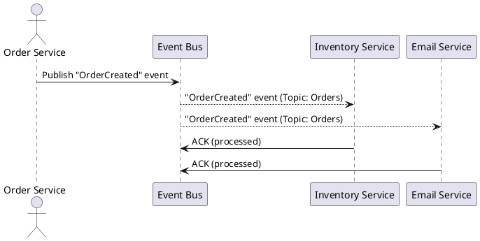

Understood. I’ll craft a technical, vendor-neutral executive overview titled “Event-Driven Architecture & the Event Bus: Reacting at Scale” aimed at intermediate-to-advanced engineers. It will follow a problem-solution narrative, cover all 14 specified points, include a `plantuml` diagram, and end with concise takeaways.

I’ll notify you as soon as the full piece is ready for review.

**TL;DR:** Event-driven architecture (EDA) uses an **event bus** to decouple producers and consumers, enabling systems to react at scale in near real-time. Unlike brittle direct calls or slow batch jobs, an event bus broadcasts events asynchronously to multiple handlers. With careful design of event types, delivery guarantees, ordering, schema evolution, and observability, EDA yields scalable, resilient systems – avoiding common pitfalls of “event storms” and hidden coupling.

# Event-Driven Architecture & the Event Bus: Reacting at Scale

## The Limits of Direct Calls and Batches (The Problem)

Traditional request-driven designs (e.g. REST API calls or nightly batch processes) **buckle under scale and complexity**. Imagine a web of microservices calling each other synchronously: one service’s slowdown or outage halts the entire chain. Synchronous calls create *temporal coupling* – the caller waits, tying up resources until the callee responds. Under heavy load or spikes, these direct calls can saturate threads and collapse performance. Batch jobs, meanwhile, leave systems blind to new data until the next batch, causing stale information and inflexibility.

**Why events?** In an event-driven approach, services communicate by **emitting events** instead of directly invoking each other. This asynchronous *fire-and-forget* style breaks the dependency on immediate responses. The producing service simply publishes an event to an **event bus**, then moves on – no waiting on downstream processing. Consumers pick up events at their own pace, smoothing out traffic bursts and failures. If a consumer is slow or briefly offline, events queue up (or get persisted) instead of crashing the producer. Overall, EDA improves scalability, resilience, and team autonomy: publishers and subscribers evolve independently, reducing tight coupling and coordination overhead. In short, when **direct calls break down**, an event-driven architecture shines by enabling real-time, decoupled reactions to changes.

## Core Components of an Event-Driven System

At the heart of EDA is the **event bus** (or broker) mediating between senders and receivers of events. The key players are:

* **Event Producer (Publisher):** Any component or service that *generates an event* when something of interest occurs (e.g. an Order Service emitting an “OrderCreated” event). Producers publish events to the bus without concern for who listens.
* **Event Bus / Broker:** The central hub that *receives and routes events*. It can be a message broker, event stream, or pub-sub system. The bus uses topics or subjects (channels) to categorize events. Producers send events to a topic (like a named stream), and the bus delivers them to all subscribers of that topic. This decoupling means publishers don’t need to know subscribers, and vice versa.
* **Topic (Subject):** A logical channel on the bus for a particular category of events. For example, a topic “orders.created” carries all new-order events. Topics enable **filtering and routing** – subscribers can listen to specific topics of interest. Under the hood, the bus may use queues or logs per topic. Every event published to a topic is delivered to all authorized subscribers of that topic. (In some systems, an event can also be broadcast via a *fanout* exchange, where it’s replicated to multiple queues so each subscriber group gets its own copy.)
* **Event Consumer (Subscriber/Handler):** A component or service that *listens for events* on certain topics and reacts. Upon receiving an event, it triggers a handler – business logic to process the event (e.g. updating a database, sending a notification, invoking another service). Multiple consumers can independently react to the same event, enabling one event to drive diverse actions in different services.

**PlantUML Sequence Diagram:** The following diagram illustrates the publish–bus–subscribe flow for an “OrderCreated” event being consumed by two independent services:

*(In this scenario, the Order Service publishes an event to the **Orders** topic on the bus. The event bus then **fans out** a copy of the event to both the Inventory Service and the Email Service, which have subscribed. Each consumer independently acknowledges processing.)*

## Event Types: Domain vs. Integration; Thin vs. Fat Events

Not all events are equal – architects distinguish **domain events** from **integration events**, and “thin” notifications from “fat” state-transfer events:

* **Domain Events:** *Within a service boundary*, domain events signal something important happened in the business logic (e.g. an `OrderPlaced` event raised inside the Order Service as part of handling a command). These are often used in **Domain-Driven Design (DDD)** to trigger side-effects within the same service or transaction. They may be handled in-memory and not leave the service’s process. The key idea is capturing a fact (“Order X was placed”) as a first-class concept. Domain events can later be *converted* to integration events if needed to propagate the change out to other services.

* **Integration Events:** These are *events published to other services or systems*, typically after a state change is committed. Once a transaction completes (say the order is saved in the DB), an integration event like “OrderPlaced (for external)” is published via the event bus to notify other microservices. Integration events ensure cross-service **state propagation** – they tell the outside world about changes that have been finalized in a service. (In practice, a service might raise a domain event internally, then after committing, publish an integration event to the bus – implementing the **outbox pattern** described later.)

* **Thin vs. Fat Events:** This refers to how much data an event carries. A **thin event** (also known as *Event Notification*) contains minimal information – often just an identifier or reference and a type. It’s basically a heads-up that “something happened”. For example, a thin “OrderCreated” event might only contain the order ID, requiring consumers to call back to the Order Service to fetch details if needed. Thin events are lightweight and reduce duplication, but they introduce *dependency*, since consumers must make follow-up requests to get full context.

  In contrast, a **fat event** (or *Event-Carried State Transfer*) includes all relevant data about what happened. The “OrderCreated” event might embed the entire order info (items, amount, customer data). Consumers can perform their work without further calls, improving autonomy and reducing latency. The downside is duplicated data and larger event payloads. However, in an era of cheap storage, **event-carried state transfer** trades some redundancy for *resilience and performance*: each service has the data it needs locally. In practice, architects use a mix – for some changes a simple ID notification suffices, while for others carrying state avoids extra round trips.

**Example:** Martin Fowler describes how a customer address change event could carry the new address so that downstream systems can update their caches without calling back to the customer service. This fat event yields **greater resilience** (subsystems can function if the customer service is down) and **lower latency** (no remote fetch needed), at the cost of propagating copies of data.

## Dispatch Semantics: Fire-and-Forget, Pub/Sub, and Queues

When an event is emitted, what happens next depends on the dispatch semantics configured on the event bus. Common patterns include:

* **Fire-and-Forget Pub/Sub:** The producer simply publishes the event and does not wait for any response. The event bus immediately returns an ACK to the producer (or at least writes the event durably) and then asynchronously delivers the event to subscribers. This pure *publish/subscribe* model (as in Kafka, Google Pub/Sub, etc.) decouples completely – producers and consumers run at independent speeds. It’s ideal for scalability: producers can emit events as fast as needed, and consumers process when they can. The trade-off is that the producer doesn’t know or control how quickly consumers react or if they succeed.

* **Fan-Out Queues:** This pattern is useful when you want **multiple independent consumers** to receive the event, but each in isolation. Message brokers often implement this by *copying messages into separate queues*, one per subscriber (for example, AWS SNS can fan-out a message to multiple SQS queues). Each queue then behaves like a point-to-point channel for one consumer group, ensuring that if one consumer is slow or down, it only affects its queue. All queues bound to a *fanout exchange* get a copy of each message. This achieves pub-sub delivery with the reliability and back-pressure control of queues.

* **Durable Subscriptions:** A challenge in pub-sub is what happens if a subscriber is offline or slow when an event is published. **Durable subscription** means the event bus will persist the events for that subscriber until they can be delivered. In other words, the broker retains messages for consumers that are not currently connected, rather than dropping them. Durable subscriptions ensure that even if a service goes down for a while, it can catch up on all events it missed after it comes back. Many systems (Kafka, Pulsar, NATS JetStream, JMS brokers) support this via persisted logs or queues combined with subscriber acknowledgments. Without durable subscriptions (i.e. with ephemeral or non-durable subscriptions), any events sent while a consumer was offline are lost. Durable subscriptions are crucial for reliability: *“the message broker retains messages until they can be delivered to the subscriber”*, preventing data loss in the pub-sub flow.

In summary, the event bus can operate in a broadcast mode (one event to many listeners) and/or a work-queue mode (each event to one of many workers). By combining these, an event can be broadcast to *multiple consumer groups*, and within each group, delivered to one instance (for parallel processing). This is how many systems achieve both scale-out and multi-subscriber delivery.

## Delivery Guarantees: At-Least Once, At-Most Once, & Effectively Exactly Once

Distributed messaging involves unavoidable trade-offs in reliability vs. duplication. There are three common delivery semantics to consider:

* **At-Most-Once:** Each event is delivered *at most one time*. This is essentially “best effort” – the system makes no attempt to retry if a message is lost. If there’s a network glitch or broker failure, some events may never reach the consumer, but those that do will never be duplicated. This can be acceptable for non-critical data (e.g. transient UI updates or metrics) where *a little data loss is okay*. Simplicity and low overhead are the advantages. However, you risk **missing events** if failures occur.

* **At-Least-Once:** The system will try *repeatedly to deliver* the event until it gets an acknowledgment. This ensures events are **never lost** – every event will eventually be processed by the consumer *at least one time*. The trade-off is the possibility of **duplicates**: if an ack is missed or a retry happens, the consumer might receive the same event multiple times. “At least once” is a common default because losing data is often worse than duplicate processing. Consumers must be made **idempotent** to handle repeats safely. For example, include a unique event ID or use natural keys so that if the same event comes again, the handler can detect it has already been processed (e.g. by checking a processed-message log or ignoring duplicate database keys). Idempotent event handlers (or deduplication logic) are vital companions to at-least-once delivery.

* **Exactly-Once (Effectively Once):** Each event is processed *once and only once* – no loss, no duplicates. This is the “holy grail” but is tricky in distributed systems. Brokers like Kafka offer *effective exactly-once* by combining at-least-once delivery with atomic commitment and deduplication. Typically this involves end-to-end transaction support or *consumer-side idempotency* so that even if an event is delivered twice, it has no effect the second time. Some systems achieve this via message IDs or *broker coordination* (e.g. Kafka’s **Exactly Once Semantics** with producer idempotence and transactional writes). Under the hood, “exactly once” often means *“at-least once + dedupe”*, since true exactly-once over an unreliable network is impossible without cooperation. The bottom line: aim for effectively-once processing by using at-least-once delivery and designing consumers to handle potential duplicates gracefully. For critical workflows (finance, inventory), this extra work is worth it to avoid double-processing or lost events.

In practice, at-least-once is the common denominator for reliable systems, with idempotent consumers making it behave like exactly-once. At-most-once is used when simplicity or low latency is paramount and occasional loss is tolerable (e.g. high-frequency analytics where a dropped event is no big deal). It’s important to **label the guarantees** clearly in any event flow so downstream services know what to expect and whether they need dedup logic.

## Event Ordering, Partitioning, and Consumer Scaling

Ensuring events arrive in the correct order can be critical (e.g. an “ItemAdded” event followed by “OrderCompleted” event must be processed in sequence). In a distributed event bus, strict global ordering is hard to guarantee at scale, so systems typically provide *ordering per key or partition*.

* **Partition Keys & Shards:** Modern event brokers partition the event stream for scalability. A **partition key** (like a customer ID, order ID, etc.) is used to map events to a specific partition (shard). Within a partition, events are totally ordered – they will be received by consumers in the exact order produced. But events with different keys may go to different partitions and thus have no guaranteed order relative to each other. For instance, if two events share `OrderID=123`, a hash function sends them to the same partition so that Consumer A sees them in sequence. If another event has `OrderID=789`, it might go to a different partition (handled by Consumer B concurrently). Partitioning is how Kafka and others achieve horizontal scaling while preserving order in logical sub-streams.

* **Consumer Groups:** To scale consumption, multiple consumer instances can form a **consumer group**. The event bus will deliver each partition to at most one consumer in the group. This way, events in one partition still go to a single consumer (preserving order per key), but different partitions can be processed in parallel by different consumers. *“Each partition is consumed by exactly one consumer within each consumer group at any time”*. If you have more partitions than consumers, some consumers handle multiple partitions. If consumers outnumber partitions, the extras will be idle (since you cannot have two consumers on the same partition in one group). Consumer groups give *queue semantics* (each message goes to one member) combined with pub-sub (multiple groups can subscribe to the same topic). This fan-out plus load-balance model is a cornerstone of event streaming architectures.

* **Event Ordering Considerations:** When choosing a partition key, pick one that groups events needing ordering. For example, to ensure all actions on a single order are ordered, use OrderID as the key; all events for that order go to the same partition and the same consumer. If events span keys or you choose a poor key (e.g. a timestamp), ordering might be lost. No system can guarantee a total order across all events without sacrificing scalability (a single file or node would become the bottleneck). Therefore, design your services to require ordering only where necessary (e.g. within an entity’s timeline) and not assume global ordering.

* **Sharding & Hot Keys:** Partitioning does introduce the risk of **hot partitions** – if one key (or a few) gets disproportionate traffic, their partition and its consumer become a bottleneck. It’s important to choose partition keys or strategies that evenly distribute load. Sometimes this means adding a random suffix or hashing composite fields to avoid lopsided partitions (a technique known as *key salting or sharding*). The key is balancing load without losing the needed ordering guarantees.

* **Log Compaction:** In some event systems, topics can be configured for **log compaction** instead of (or in addition to) time-based retention. Log compaction retains only the latest event per key, removing older duplicates of the same key. This is useful for maintaining a snapshot of last-known state. For example, a compacted topic of “CustomerUpdated” events will always have the most recent update for each CustomerID (older updates may be pruned). As Kafka docs put it, *“log compaction ensures that Kafka will always retain at least the last known value for each message key within the log”*. Consumers can thus reconstruct the current state by reading the compacted topic from start to end, without needing every intermediate change. Compaction is great for caches and large data sets where only the latest value matters, but remember it sacrifices the full history beyond the latest per key.

In summary, ordering is achievable *within partitions*, and partitioning is how we scale. Use keys wisely. Leverage consumer groups to scale out processing. And consider compaction or sharding strategies to handle data growth and hot keys.

## Persisted Logs and Replay: Event Sourcing, CQRS, and Outbox Patterns

A powerful aspect of event-driven systems is the ability to **replay events** from a log to reconstruct state or feed new consumers. Unlike transient request/response, events can be stored as a **chronological log** – forming an audit trail of what happened, in order.

* **Event Sourcing:** This is a design where the *sequence of events* *is the primary source of truth* for an application’s state. Instead of storing the current state in a database, the system stores every state-changing event in an event store (log). To get current state, you replay or aggregate the events. *“Whenever we make a change to the state of a system, we record that state change as an event, and we can rebuild the system state by reprocessing the events at any time”*. The log of events becomes the database – fully **persisted** and immutable. Event sourcing offers strong auditability (complete history) and flexibility (you can spin up new projections or troubleshoot by replaying events). However, it adds complexity in ensuring idempotent reprocessing and handling very long logs (snapshots are often used for optimization). Many architectures use event sourcing for write models and pair it with **CQRS** for reads.

* **CQRS & Read Models:** Command Query Responsibility Segregation (CQRS) means using separate models for updates (commands) and reads (queries). In event-driven terms, the system processes writes by storing events, and then asynchronously **projects** those events into one or more read-optimized views. For example, an Order Service might store events like OrderCreated, ItemAdded, OrderConfirmed. A separate **read model** service subscribes to these events and updates a queryable table (say, an “Order Summary” table for fast lookup). This read model is essentially a **projection** built by event handlers. If needed, you can replay all past events to rebuild a fresh read model from scratch – useful if you change the schema or need to recover from an error. Microsoft notes that *“the same events that update the write model can serve as inputs to the read model”* – meaning every state change event feeds into keeping the read-side in sync. Because the read side might lag slightly behind (events take time to propagate), CQRS often entails **eventual consistency** between writes and reads. Tools and patterns (like **materialized views** or **cache invalidation events**) help manage this delay. The benefit is each side is optimized: writes are simple (just append events), reads are fast (precomputed views), and you can scale or change them independently.

* **Replaying and Repairing:** Persisted logs allow recovery from bugs. If a consumer’s logic was wrong, you can fix the code, then *reconsume* the event log from the beginning (or a checkpoint) to recompute correct state. This is a powerful insurance: the events are the ledger, and any number of derived systems can be created or recalculated. Techniques like **snapshots** (saving periodic state) can speed up replays by not starting from scratch every time – similar to how a version control system stores commits but you might start from a recent checkpoint.

* **Outbox Pattern & CDC:** One practical issue is ensuring that when a service updates its database and publishes an event, those two actions are atomic. If a service writes to DB but crashes before publishing the event, other services miss an important update. Or if it publishes an event that later fails to commit, you have a phantom event. The **transactional outbox pattern** solves this by treating event publish like a DB insert: the service writes an “outbox” record in its database as part of the main transaction, containing the event to send. Then a separate process or thread reads from the outbox table and actually publishes the events to the bus. Since the outbox insert and the business data update are one transaction, you never get one without the other. If the transaction fails, no outbox record is written (no event). If it succeeds, the event will eventually be sent (even if the service crashes, the outbox entry remains for a retry). Tools like Debezium can even monitor the DB logs to automate this publishing step. As the reference notes, *“the Transactional Outbox pattern consists of sending events only when a RDBMS transaction is fully achieved”* – ensuring no desynchronized state.

  **CDC (Change Data Capture)** is a related approach: rather than the application explicitly writing an outbox, the database’s own transaction log is tailed. For example, if a row is inserted/updated, the CDC system (like Debezium) publishes an event reflecting that change. CDC can effectively turn any database into an event source without application changes – though you may need to define what changes map to what event types. Many modern systems use CDC to integrate legacy databases into an event-driven pipeline.

* **Event Replay & Versioning:** When events are stored long-term, you must consider schema evolution (see below) so that new consumers can interpret old events. Some event stores allow “upcasting” or transforming old events on the fly to new formats. Others require maintaining backward compatibility in event schemas.

In essence, persisted event logs (as in Kafka or event stores) give you a time machine for your data. They enable patterns like *Event Sourcing* (source of truth as events) and *CQRS* (decoupling read projections), and reliable cross-system communication via *Outbox/CDC*. These techniques significantly improve **reliability** (no lost updates), **auditability** (full history), and **recoverability** (recompute any derived state). They do introduce complexity in data handling and storage volume, so apply them where the benefits outweigh the costs.

## Sagas: Distributed Transactions via Choreography vs. Orchestration

Many business processes span multiple services. For example, placing an order might involve the Order service, Payment service, and Shipping service. **Saga pattern** is a way to manage such multi-step workflows without a two-phase commit. In a saga, each service performs its local transaction and publishes events to trigger the next step. There are two coordination styles:

* **Choreography:** There is *no central coordinator* – services simply react to each other’s events in a chain. *“Each local transaction publishes domain events that trigger local transactions in other services”*. For example, Order Service publishes “OrderCreated”; an event handler in Payment Service listens and reserves payment, then emits “PaymentConfirmed”; another handler in Shipping Service listens and creates a shipment, etc. If something fails, compensating events roll back previous actions. Choreography is **fully distributed** and decoupled – adding a new step means just listening for an existing event. However, as sagas grow complex, the flow (happy path and failure compensations) can become implicit and hard to manage. There’s a risk of an “event cascade” and difficulty in tracking the overall status.

* **Orchestration:** A **central saga orchestrator** (a dedicated controller) tells each service what to do and tracks progress. *“An orchestrator (object) tells the participants what local transactions to execute”*. In this model, when an order comes in, the Order Service might start a saga orchestrator instance. That orchestrator sends explicit commands to Payment (like “ReserveCredit”), waits for a reply event, then sends “InitiateShipping” to Shipping, etc., deciding the next step based on outcomes. If a step fails, the orchestrator issues compensating actions to previously completed services. Orchestration centralizes the workflow logic (making it easier to understand the steps and apply consistent retry logic), but it introduces a coupling to the orchestrator component.

Neither approach is one-size-fits-all. **Choreography** shines for simple or **loosely coupled flows** where steps are independent and order can be implied by events (e.g. various services reacting to a single event in parallel). It can become unwieldy if there are many conditional steps or if you need global insight into the saga’s state. **Orchestration** is often preferred for **complex workflows** where central coordination can ensure all parts complete or trigger compensations in a controlled way. Think of orchestration as having a conductor for a distributed transaction, while choreography is like jazz improvisation where each service plays off the others. Both rely heavily on events: even orchestrators typically use events/commands under the hood to communicate with services.

When designing sagas, carefully plan compensating actions for failures, and use **correlation IDs** to tie together all events/steps of one saga (more on tracing below). This helps maintain **data consistency without locks**: each service remains independent, yet the saga mechanism ensures eventual consistency across them.

## Evolving Event Schemas: Avro, Protobuf, and Contract Testing

As event-driven systems grow, event schemas (the data structures sent on the bus) will change. New fields might be added, formats tweaked, etc. Managing **schema and version evolution** is crucial to avoid breaking consumers.

* **Schema Languages (Avro/Protobuf):** Unlike ad-hoc JSON, technologies like Apache Avro and Google Protocol Buffers include explicit schema definitions. Avro and Protobuf both support **schema evolution** with backward and forward compatibility rules. For example, you can add a new optional field to an Avro schema – consumers with the old schema will just ignore it (backward compatible), and new consumers can handle old events by using a default for the missing field (forward compatible). Avro embeds the writer’s schema in the message or a schema ID (with a schema registry), so readers can always decode data as long as it’s not a completely unknown format. Protobuf uses field tags and rules like optional vs. required to allow similar evolution.

* **Schema Registry:** In systems like Kafka, a **Schema Registry** service is used to centrally manage schema versions for topics. Every event’s schema is versioned and stored. Producers must register new schemas and typically the registry will enforce compatibility (e.g. you configure a topic to only allow backward-compatible changes). This ensures consumers don’t suddenly choke on an incompatible message. *“Schema Registry is built for exactly that purpose”* – to handle versioning and compatibility checking for Avro/JSON Schema/Protobuf data. By using a registry, you enable robust *schema evolution*: you can evolve your event formats while serving both old and new consumers simultaneously. For example, a new version might add a field with a default value; the registry can enforce that this change is backward compatible so that it won’t break existing consumers. Compatibility modes (BACKWARD, FORWARD, FULL, etc.) define what changes are allowed (add optional fields, remove fields with defaults, etc.).

* **Contract Testing:** Beyond static schemas, teams use **consumer-driven contract testing** to validate that changes in events won’t break consumers. In contract testing for EDA, each consumer specifies expectations (a “contract”) for an event (e.g. fields and meanings it uses). When the producer’s schema or logic changes, these contracts are tested to ensure the new events still meet the expectations. This can catch issues like a field’s meaning changing in a way a consumer doesn’t handle. Tools like Pact (popular for REST) are being adapted for event streams (some call it Schema Testing or bi-directional contracts in messaging). The idea is to shift-left the detection of integration problems: instead of finding out at runtime that an event rename broke something, tests fail in CI. Even without formal tools, maintaining **sample events** and verifying consumers against them can prevent surprises.

* **Schema Versioning Strategy:** A common practice is **compatible evolution**: make changes additive and avoid removing or renaming fields without a transition plan. If a breaking change is truly needed, one approach is **topic versioning** (publish new events to a new topic version while phasing out the old). Another approach is to include a version indicator in the event payload and have consumers handle versions if necessary. But this can get messy – hence the preference for non-breaking schema changes when possible.

* **Message Contracts and Payload Coupling:** A caution: putting entire databases into your events (extremely fat events) can tightly couple consumers to producers’ internal representation. This is a schema evolution headache – even if your schema tech supports it, changing something deep in the payload means coordinating all consumers. To mitigate, some teams embrace **data contracts** for events: treat the event schema as a public API that should change more slowly and deliberately than internal code. The schema registry pattern helps enforce this discipline by making any schema change an explicit, versioned act.

In summary, use well-defined schemas (Avro/Protobuf or at least JSON schemas), invest in a registry and compatibility checks, and consider contract tests or at least communication so that producers and consumers stay in sync as the event formats evolve. This prevents the nightmare scenario of a producer deployment breaking half the consumer services because an event field disappeared or changed type.

## Observability & Debugging in an Event-Driven World

EDA can make debugging harder – there’s no single call trace, and workflows are spread across asynchronous events. That’s why **observability techniques** must be built in:

* **Trace Correlation:** To follow a transaction that spawns events across services, you need a **Correlation ID** (or Trace ID). This is an identifier that travels with the initial request and is included in all events and logs spawned by it. For example, when a user action triggers Service A to emit Event X which causes Service B to do Y, all logs and event metadata carry the same correlation\_id (e.g. the user session or order ID). By searching the logs for that ID, you can reconstruct the event chain. A common pattern (from Greg Young) is each message has three IDs: its own ID, a correlation ID (unique per saga/flow), and a causation ID (link to the message that caused it). The correlation ID remains constant through a flow, tying together all related events. Logging and tracing systems (like OpenTelemetry) can propagate these. Without correlation IDs, investigating *“why did this event happen?”* is hunting in the dark. With them, you can see the entire conversation of events that led to an outcome.

* **Logging and Audit Trails:** Because events often carry business significance, it’s wise to store them or at least key info from them for auditing. Many organizations keep a centralized **event log store** or log aggregator. This helps answer questions like “Did we send an email for Order 123? Which service consumed the payment event?” after the fact. Tools like Kafka can retain events for a long time, doubling as an audit log. Alternatively, consumers might log important event handles with IDs.

* **Consumer Lag Metrics:** In a streaming platform, **consumer lag** is the gap between the latest event produced and the latest event consumed in a topic partition. Monitoring lag is critical. An *increasing lag* indicates a consumer is falling behind real-time; if lag grows unbounded, the consumer is too slow or stuck. By watching lag (via metrics in Kafka, AWS CloudWatch for Kinesis, etc.), you can trigger alerts or autoscaling – e.g. spin up more consumer instances if lag exceeds a threshold. Lag metrics tell you about **back-pressure** in the system: where the bottlenecks are. Ideally, steady-state lag is near zero for near-real-time processing, except maybe during occasional spikes which should catch up.

* **Dead-Letter Queues (DLQs):** Despite best efforts, some events will fail processing (bad data, transient downstream errors, etc.). Rather than block the entire pipeline or drop them silently, many buses use a **dead-letter queue** for poison messages. A DLQ is a holding area where messages that *can’t be processed successfully after X retries* are routed. For example, if a consumer tries 5 times and crashes each time on an event, that event is moved to a DLQ to isolate it. This prevents one bad apple from stuck in an infinite retry loop and blocking newer events. Operators can later inspect the DLQ, fix data or code issues, and possibly replay those messages. DLQs significantly improve debuggability by **surfacing failures** instead of losing or endlessly retrying messages. They act as a safety net and diagnostic goldmine. (E.g. AWS EventBridge, SQS, Azure Event Grid all support DLQs natively.)

* **Metrics & Instrumentation:** Every component – producers, brokers, consumers – should emit metrics: publish rates, consume rates, error counts, queue lengths or log end offsets, processing latencies per event, etc. These metrics allow you to see **the health and performance** of the event pipeline. For instance, if a consumer’s processing time spikes, that might explain rising lag. If a broker’s publish throughput flatlines, maybe producers are failing.

* **Distributed Tracing:** Modern tracing systems can actually tie together spans from different services if they propagate a trace context. An event can be treated as a span that links producer and consumer in a trace graph. This way, you could see a trace that starts with an HTTP request to Service A, which publishes an event, then Service B handling that event, and so on – all in one view. It’s more complex than tracing sync calls, but tools are evolving to handle asynchronous linkages via explicit parent IDs (e.g. Jaeger or Zipkin with message tagging).

In short, **make events observable**. Use correlation IDs to connect the dots. Monitor lag to catch slowdowns. Utilize DLQs to catch failures for later analysis. And treat the event bus as part of your monitored infrastructure: it’s your backbone, so instrument it as such. This is crucial for building confidence in an event-driven system, especially when something goes wrong – you want to quickly pinpoint where and why.

## Managing Back-Pressure: Flow Control and Throttling

Event-driven systems decouple senders and receivers, but back-pressure (when consumers can’t keep up) can still cause issues if not handled. Key strategies include:

* **Consumer Throttling & Batching:** If an event consumer is overwhelmed, it can explicitly slow down or batch its intake. For example, a consumer might process messages in batches and commit offsets after each batch to avoid frequent commits overhead. Many client libraries allow pausing the consumption if the application’s queue is full. In a **pull-based** system (like Kafka), consumers inherently only take what they can, which is a natural back-pressure mechanism. In **push-based** brokers (like older MQTT or some cloud pub-subs), you can often set a prefetch window (max in-flight messages) to avoid being flooded. Throttling can also mean telling producers to slow down via acknowledgments or applying back-pressure at the network/protocol level (like TCP does). It’s crucial to configure broker and client settings so that if a consumer is slow or down, messages queue up *in the broker* (or persist) rather than overwhelming the consumer or being dropped.

* **Overflow Handling:** If back-pressure is extreme (consumer down for hours), queues can build up. You need policies for that: do you **drop old events** (maybe acceptable for non-critical ones), or apply **load-shedding** where producers stop accepting new events until caught up (ensuring system doesn’t get further behind). Some systems allow separate *high-priority vs low-priority streams* to avoid less important data crowding out critical events (this might be what is referred to as **red/black streams** or similar – akin to having separate channels or a dual-pipeline, so that if one stream is choking it doesn’t block another). In practice, teams sometimes run two parallel Kafka clusters or topics (for example, one for real-time and one for replay or bulk events) – you might consider this a “red/black” stream approach, analogous to blue/green deployment but for segregating traffic types. A well-known pattern is to have a secondary pipeline for reprocessing or backfill data so it doesn’t interfere with the live stream.

* **Reactive Streams and Back-Pressure Signals:** In code, using reactive libraries (like Project Reactor or RxJS) can propagate back-pressure signals from consumer to producer. This is more applicable within a process or with certain protocols (e.g. HTTP/2 or gRPC streaming can use flow control). For cross-service event buses, usually the broker mediates: e.g., Kafka’s consumer pull model means if a consumer falls behind, it just lags and the broker retains data up to retention limits. If retention is finite and the consumer is too slow, old events might expire before being read – that’s a form of data loss as back-pressure outcome. Monitoring lag and scaling out consumers or increasing retention time can mitigate this.

* **Back-Pressure in Streaming Processing:** If you do stream processing with frameworks (Flink, Spark, etc.), they often have built-in back-pressure handling. For instance, operators will block reading from sources if sinks are slow. Ensure you configure buffer sizes and timeouts appropriately so that slow stages propagate back-pressure signals upstream rather than crash.

In summary, design the system to **handle bursts gracefully**: use message queues or logs to buffer, allow consumers to catch up, and have clear behavior when buffers overflow (drop, dead-letter, or block producers). “Overwhelmed subscriber” should not equal “system failure” – it should be a *known mode* that triggers scaling or throttling. Proper back-pressure control avoids scenarios where one slow consumer either crashes the broker (due to resource exhaustion) or causes memory bloat.

*(Aside: The term “red/black streams” might refer to an operational pattern of running two parallel streams – one active (red) and one new (black) – to handle cutovers or differing QoS. For example, you could route live traffic to the “red” pipeline and use a “black” pipeline to replay historical data or test a new version of consumers, then switch over. This ensures that heavy replay or backfill (black) doesn’t interfere with real-time (red).)*

## Security in the Event Bus

With many services exchanging critical data via the event bus, security is paramount:

* **Authentication (AuthN):** Only authorized producers and consumers should connect to the event bus. Implement robust authentication, e.g., using API keys, OAuth tokens, or mutual TLS. Each service proves its identity when publishing or subscribing. Technologies: Kafka supports SASL (Simple Authentication and Security Layer) with mechanisms like SCRAM or Kerberos for user authentication; cloud pub-sub services integrate with cloud IAM roles; NATS has user credentials, etc. The goal is no rogue actor can inject or read events.

* **Authorization (AuthZ):** Not every service should access every topic. Use **Access Control Lists (ACLs)** or similar to enforce *who can publish or subscribe to what*. For instance, the Payments service might be allowed to consume “order.*” events but not the internal “HR.*” events. Kafka’s multi-tenant security model, for example, allows setting ACLs so that a consumer from Team A cannot read Team B’s topics. Proper authorization ensures data segregation and least privilege. In multi-tenant platforms, prefixing topics with tenant IDs combined with ACLs is common.

* **Encryption in Transit:** Always encrypt event traffic across networks. Brokers should support TLS for all client connections so that event payloads and sensitive info aren’t sniffable on the wire. Most enterprise messaging systems provide TLS configuration – it might be as simple as enabling an “SSL/TLS” port on the broker and using certificates on clients. Encryption ensures that even if events flow over public networks or untrusted segments, they remain confidential and untampered.

* **Encryption at Rest:** If the event bus persists data (like Kafka storing logs on disk, or cloud services storing messages), consider disk encryption or broker-level encryption. Some cloud services do this by default (e.g. AWS Kinesis data is replicated and encrypted at rest). If using Kafka, you can enable OS-level encryption or use tools to encrypt payloads at the application level (though that complicates consumers needing keys). For especially sensitive data, end-to-end encryption at the message payload level might be needed (where only consumers have the decryption keys).

* **Multi-Tenant Isolation:** In a shared event bus, design it as if it’s an **enterprise event backbone** crossing trust boundaries. That means one tenant or team’s events should not be accessible by another. Use separate topics per tenant with ACLs, or even separate clusters for very stringent isolation. Kafka, for example, is often set up with **namespace isolation** (topic name prefixes and ACLs) and **quotas** so that tenants can’t interfere with each other’s data or hog resources. There are also emerging patterns like using **Sandboxed connectors** or encryption keys unique per tenant to ensure that even if a topic is shared, data is segregated logically and cryptographically.

* **Integrity & Non-Repudiation:** For high-security contexts, you might sign events (digitally) so consumers can verify they weren’t altered, and keep audit logs of who published what (so no one can deny sending an event). This is less common but can be layered on via the payload (e.g. JWTs as event payloads carrying signatures).

* **Security Monitoring:** Treat the event bus like an entry point to your system – monitor for unusual patterns (e.g. a burst of events from a client that usually is quiet – could indicate a breach or malfunction). Ensure access logs are kept. Many message systems integrate with SIEM tools for auditing.

In short, **secure the pipes**: authenticate, authorize, and encrypt. In an event-driven architecture, the event bus is a critical shared infrastructure – harden it accordingly. This prevents leaks of sensitive data and stops malicious or buggy actors from wreaking havoc (like publishing fake events or reading things they shouldn’t).

## Event Bus Implementations (Brief Overview)

Several technologies embody the event bus concept, each with strengths:

* **Apache Kafka:** A distributed commit log that has become a de facto standard for event streaming. Kafka provides high throughput, persistence, and replayability of event streams. It uses partitioned topics for scalability and stores events durably on disk with replication for fault tolerance. Kafka’s design favors at-least-once delivery with the ability to achieve exactly-once processing (with proper configurations). It has a rich ecosystem (Kafka Streams, Connect, etc.). Many of the concepts discussed (partitions, consumer groups, log compaction, schema registry) come from Kafka’s influence. Kafka is often self-managed or available as a managed cloud service (e.g. Confluent Cloud).

* **Amazon Kinesis:** A fully-managed streaming service on AWS. Kinesis behaves similarly to Kafka in many ways (shards instead of partitions, checkpointing consumers, at-least-once). It’s a cloud service, so it abstracts the server management. It’s great if you are on AWS and want quick setup, integrating nicely with other AWS services. Throughput scaling and retention are configurable (with cost implications). One downside is vendor lock-in and cost at large scale, but the upside is you offload operations to AWS.

* **Google Cloud Pub/Sub:** A globally scalable pub-sub service on GCP. It’s fully managed and **designed for event-driven architectures** (Google even markets it as supporting “enterprise event bus” patterns). Pub/Sub automatically scales throughput, handles ordering within key (with features like ordering keys), and offers at-least-once delivery with optional dead-letter topics. It integrates with Google’s dataflow and cloud functions for easy event-driven serverless apps. If you’re on Google Cloud, Pub/Sub provides a frictionless way to get an event bus with minimal config – just topics and subscriptions.

* **Apache Pulsar:** An open-source distributed pub-sub system that has a different architecture: it separates the compute (brokers) from storage (BookKeeper nodes). Pulsar supports both queue and stream semantics and has **multi-tenancy** and geo-replication built-in. It’s known for very low publish latency and the ability to create many topics cheaply. Pulsar has the notion of *subscriptions modes* (exclusive, shared, failover) for flexibility in how messages are delivered to consumers. It also has an **infinite retention** with tiered storage (offloading old data to cheaper storage). Pulsar can be more complex to run (two layers of cluster), but it excels in certain scenarios like multi-region and multi-tenant (one Pulsar cluster can safely serve many teams). It even supports **transactional messaging** now, moving toward exactly-once guarantees.

* **NATS JetStream:** NATS is a lightweight, high-performance messaging system known for simplicity. By default NATS is transient (at-most-once, best effort). JetStream is an add-on that provides persistence, streams, and at-least-once delivery, turning NATS into an event streaming system with durability. NATS+JetStream is easier to deploy than Kafka in some cases (a single Go binary for NATS server) and is written in Go for minimal memory footprint. It’s great for cloud-native microservices needing pub-sub without the full weight of Kafka. However, at extreme scale with heavy persistence needs, Kafka/Pulsar might outperform it. NATS shines for low-latency messaging and has features like interest-based retention (only keep messages if someone is listening).

* **Others:** There are many others like **RabbitMQ** (popular message broker with pub-sub via exchanges, typically used for reliable queues more than high-scale streaming), **Azure Service Bus/Event Hubs** (Microsoft’s equivalents for pub-sub and streaming, respectively), **Redpanda** (a Kafka-compatible engine written in C++ for better efficiency), and **EventBridge** (AWS’s serverless event bus focused on event routing rather than high throughput streaming). Each comes with trade-offs, but all implement the core idea of decoupled event publication and subscription.

**Vendor Neutrality:** When designing for interviews, it’s good to mention Kafka as it’s widely known and covers most bases. But also note that any robust pub-sub or log system can serve as the event bus – the patterns above apply regardless of technology. The choice might depend on operational preferences (self-manage vs. cloud, open source vs. proprietary) and specific requirements (e.g. need global ordering? use something like Pulsar with partitions of size 1, or need simple integration? use cloud Pub/Sub, etc.). The key is to treat these as *implementation details* once you understand the fundamental event-driven patterns.

## Common Pitfalls (and How to Avoid Them)

Finally, be aware of these pitfalls which can derail an event-driven system:

* **Event Storms:** Emitting events for *every tiny change* can lead to a deluge of messages (and high costs or performance issues). Moreover, if events trigger other events in uncontrolled feedback, you can get a storm or infinite loop. Avoid by designing meaningful, coarse-enough events (don’t publish millions of “value incremented” events that no one truly needs). Put guardrails: for example, a service might rate-limit how many events it emits per second if downstream can’t cope. Monitoring will help detect storms (sudden surges in event volume). Use event-driven where appropriate, but not everything must be an event if it doesn’t drive a reaction.

* **Hidden Coupling via Payloads:** If consumers start relying on specific fields deep in event payloads (especially ones that are meant to be internal to the producer), you get *tight coupling* disguised in an asynchronous form. Then changing the event structure or semantics becomes as hard as changing a synchronous API – every consumer breaks. To combat this, treat events as public APIs with clear contracts. **Document event schemas** and perhaps restrict them to what consumers truly need (don’t leak internal DB schemas). Use schema registry compatibility checks to ensure changes don’t surprise consumers. Essentially, even though the services are decoupled temporal-wise, they can become **coupled by data** – communicate with the consumers when making changes, or use versioning wisely.

* **Long-Running Consumer = Bottleneck:** If a consumer takes a long time to process each event (e.g. doing a complex computation or waiting on an external API), it will lag and possibly hold up ordered event streams. This becomes especially problematic if ordering is required – subsequent events for the same key have to wait. To avoid this, offload heavy work: a consumer can do minimal work and quickly ack, then hand off to a background job for the slow part (this is like two-stage processing). Alternatively, scale out the consumer with more instances if possible (partitions permitting). Consider breaking the processing into smaller tasks or using an asynchronous model inside the consumer. In worst cases, if truly long transactions are needed, you might need to redesign the workflow (perhaps the consumer should just record the event and let another component poll or complete the work outside of the main event loop).

* **Overly Eventual Consistency:** *Too much* eventual consistency can harm user experience and make reasoning difficult. For example, if every piece of data is always eventually consistent, your system might show stale info to users or allow conflicting actions. Some processes actually need synchronous or atomic steps (e.g. authentication events might need immediate effect). The pitfall is swinging the pendulum too far: not every interaction fits EDA. Sometimes a direct call or immediate consistency is needed for correctness. The solution is to identify critical paths that need consistency and handle them specially (maybe by using a mini-transaction or ensuring a read-your-write guarantee via caching). Also, make the consistency model clear: if an action is eventually consistent, design the UI/UX to accommodate the lag (e.g. show a status “Pending update…”). Don’t hide eventual consistency – make it an explicit part of the design.

* **Debugging Difficulties:** If you lack the observability practices we described, debugging becomes a pitfall. Teams new to EDA often struggle to trace what happened when something goes wrong (“The order was placed but no confirmation email – where did it drop?”). Without logs, metrics, and correlation IDs, it’s painful. So ensure from day one that you invest in the tooling for tracing and monitoring events.

* **Infrastructure Overhead:** Managing an event bus (Kafka, etc.) is non-trivial. Mis-configure retention or partitions, and you lose data or choke performance. This isn’t exactly a pitfall of the architecture itself, but of implementation. Solution: use managed services if possible, or allocate proper SRE attention to your messaging backbone. Don’t treat the event bus as a black box – understand its quirks (like Kafka requiring tuning of retention, segment size, etc., or cloud pub-sub having quotas).

* **Mixing Real-Time and Batch on Same Channel:** If you try to use one event pipeline for both real-time events and huge batch dumps, you can cause consumer grief. For instance, dumping a million records as events at 2 AM might saturate the bus and backlog the regular real-time events. It’s often better to separate these uses (different topics or even systems). This relates to the earlier mention of possibly having dual streams for different use cases.

By being mindful of these pitfalls, one can mitigate them: **design events thoughtfully, maintain observability, plan for scaling, and keep an eye on the data flow dynamics**. Event-driven architecture offers immense benefits in scalability and flexibility, but it must be tamed with good practices to avoid chaos.

## Key Take-aways

* **Decoupling via Events:** EDA loosens direct service dependencies – producers emit events and don’t wait on consumers, improving scalability and resilience.
* **Core Components:** An event **producer** sends events to a **bus/broker** on a topic, and **consumers** subscribe to those topics to react. This pub-sub fabric enables multi-subscriber notification and asynchronous processing.
* **Event Design:** Use *domain events* internally and publish *integration events* externally once state is committed. Decide between *thin events* (lightweight notifications) vs. *fat events* (self-contained state transfer) based on consumer needs.
* **Delivery Semantics:** Understand at-most-once (possible loss), at-least-once (no loss but possible duplicates), and achieving effectively exactly-once via idempotency. Design consumers to handle duplicates safely.
* **Ordering & Scale:** Partition the event stream by key to preserve order per entity. Use consumer groups to scale horizontally – one consumer per partition. Watch out for hot partitions; shard or load-balance keys if needed.
* **Event Replay & Storage:** Durable logs allow replaying events for recovery or new consumers (e.g. event sourcing). Use the outbox/CDC pattern to publish events reliably with DB transactions. Leverage CQRS projections for efficient read models fed by events.
* **Managing Sagas:** For multi-step workflows, use sagas instead of distributed transactions. *Choreography* (event-driven chain) works for simple flows, whereas *orchestration* (central coordinator) gives clarity for complex sequences. Include rollback/compensation events for failure paths.
* **Evolution & Contracts:** Treat event schemas as evolving contracts. Use Avro/Protobuf with a schema registry to enforce compatibility. Consider consumer-driven contract testing to catch breaking changes early.
* **Operational Visibility:** Implement traceability with correlation IDs to link events across services. Monitor consumer lag and set up dead-letter queues for failures. These measures are critical to debug and maintain an event-driven system.
* **Flow Control:** Design for back-pressure. Allow consumers to throttle or pause intake, and use queueing to buffer bursts. Plan separate pathways or streams for bulk loads vs. live events to avoid interference.
* **Secure the Bus:** Enforce auth on publish/subscribe and use ACLs to isolate topics. Encrypt data in motion (TLS) and at rest. Multi-tenant event buses must prevent data leakage across tenants by design.
