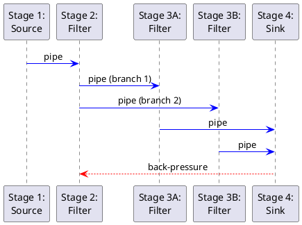

Great. I’ll create a modular executive overview titled “Pipes-and-Filters Architecture: Building Streaming & Batch Pipelines” with a narrative, problem-solution style, targeting intermediate-to-advanced engineers. The overview will hit all 13 required bullets, include a TL;DR, a GitHub Pages–friendly PlantUML diagram, and a concise “Key Take-aways” section. I’ll keep technology examples light and define any advanced terms.

I’ll let you know when it’s ready for your review.

# Pipes-and-Filters Architecture: Building Streaming & Batch Pipelines

**TL;DR**: *The Pipes-and-Filters architectural pattern divides complex data processing into a pipeline of independent stages. Each *filter* performs one task, passing data via *pipes*. This modular design enhances reuse, scalability (parallel stages, back-pressure control), and flexibility across streaming or batch jobs – with built-in support for error isolation, monitoring, and robust, secure data flows.*

## From Monolithic ETL to Pipeline – Why Pipes & Filters?

Monolithic ETL jobs or ad-hoc scripts that handle extraction, transformation, and loading in one big chunk eventually hit a wall. Imagine a single massive script that reads data, validates it, applies transformations, and loads results. As requirements grow, this monolith becomes brittle – code is tangled, hard to reuse, and any change risks breaking the whole flow. Often the same parsing or cleaning logic is duplicated across multiple such scripts. When one part slows down or fails, the entire job suffers, and scaling is all-or-nothing. These issues with one-size-fits-all ETL modules motivated a better approach.

**Enter Pipes-and-Filters.** Instead of one opaque program, the work is *broken into a series of independent steps (filters)*, each responsible for a single task (say, *parse JSON*, *validate schema*, *anonymize PII*, *aggregate stats*). Each filter’s output flows into the next step through a *pipe* – a conduit that carries data records or messages downstream. This pattern yields *composability and reuse*: filters are small and self-contained, so you can add, remove, or reorder them without rewriting everything. Need a new pipeline? Mix and match existing filters or plug in new ones as needed, instead of cloning and tweaking a monolith. In short, Pipes-and-Filters turns a rigid script into a flexible assembly line.

## Core Anatomy: Filters, Pipes, and the Pipeline Runner

At the heart of this architecture are three concepts: **filters, pipes, and the pipeline orchestrator** (or runner). A *filter* is an independent processing stage that performs one operation on the data. It could be as simple as a function in memory or as heavy as a separate process or container – the key is it encapsulates one *unit of computation*. Filters are often *stateless* (more on that shortly) and ideally do not share resources, which makes them easy to scale and test in isolation.

A *pipe* is the channel that connects filters and passes data along. In a program, a pipe might be an in-memory queue, a Unix pipe streaming bytes, or an asynchronous message queue/topic connecting two services. The pipe decouples the filters – a filter just writes output to the pipe, and the next filter reads from it, without needing direct function calls. This decoupling means filters don’t need to know about each other’s internals, only the *contract* of data that flows through.

The *pipeline runner* (or orchestrator) is what sets up and coordinates the chain of filters and pipes. In a simple in-process pipeline, this might be just the thread of execution passing data from one function to the next. In more complex systems, the runner could be a framework or engine (like Apache Beam’s runtime or a Unix shell) that takes a pipeline definition and manages threading, scheduling, and data movement. Essentially, it ensures each filter gets data from its inbound pipe, runs the processing, and emits to the outbound pipe, until the pipeline completes.

## Dataflow Modes: Push vs Pull, Streaming vs Batch

A Pipes-and-Filters pipeline can run in different modes of dataflow depending on how data availability is managed:

* **Push vs Pull** – In a *push-based* pipeline, each filter actively pushes its output to the next stage as soon as it’s ready. Data cascades downstream driven by the producers. This yields low latency, but if downstream is slow, data may back up unless there’s a feedback or blocking mechanism (back-pressure). In a *pull-based* pipeline, by contrast, each filter acts when the next stage asks for data – the consumer pulls inputs when it can handle them. This naturally throttles the flow: *the consumer controls the pace*, preventing overload. Many streaming systems (e.g. Reactive Streams, Kafka Streams) implement pull-based or hybrid approaches so that slow consumers signal upstream to slow down (avoiding memory bloat or crashes).

* **Streaming, Micro-Batch, Batch** – Pipelines can handle data as a continuous stream or in discrete batches. **Batch** pipelines work on fixed sets of data (e.g. process all logs for yesterday as one job) – easier to reason about (all data is present) but with higher latency (results ready only after the batch completes). **Streaming** pipelines process events on the fly, outputting results with minimal delay (e.g. updating metrics per incoming event). Streaming is powerful for real-time needs but requires handling infinite data, out-of-order events, and is generally more complex. A middle ground is **micro-batching**, where the pipeline processes data in small, frequent batches (e.g. every few seconds) to simulate streaming. This can simplify some consistency issues by having mini-batches, at the cost of a bit more latency. For example, early Spark Streaming used micro-batches, whereas Apache Flink and others offer true event-at-a-time streaming. The Pipes-and-Filters pattern itself is agnostic to this – you can implement it as a pure streaming flow or set it up to run on batches of records at scheduled intervals. What matters is defining how data is triggered through the pipes: either the presence of data pushes it through, or a scheduler pulls data through on a schedule.

## Filter Design: Stateless vs Stateful, Pure vs Effectful

One important design decision is whether filters hold state. A **stateless filter** treats each input independently and does not retain anything between messages. For example, a filter that converts Celsius to Fahrenheit or trims text fields – given the same input, it always produces the same output and doesn’t rely on past history. Such filters are much easier to scale and reuse, and they don’t introduce coupling between pipeline stages. In fact, it’s recommended that filters be *idempotent and stateless whenever possible* – ensuring that re-processing an event or running two instances of a filter yields the same result. Stateless filters can be duplicated to increase throughput without worrying about consistency.

However, some tasks inherently need state. A **stateful filter** might aggregate counts, compute running averages, or join events over a time window – it must remember past inputs. These filters can still fit in pipelines but require careful handling: e.g. periodic checkpointing of state for recovery, and logic to manage state across parallel instances (sharding by key, etc.). For example, a filter that counts unique users needs to store seen user IDs. When using stateful filters, design them so that state is *internal* (encapsulated in that filter) and consider making them *idempotent* – if re-run with the same inputs, they don’t double-count, which aids exactly-once processing.

We also distinguish **pure transformation filters** versus **sources and sinks** (effectful stages). A pure filter takes input, transforms it, and emits output with no external side-effects – e.g. mapping a record to a new schema. In contrast, a **source filter** has no upstream (it introduces new data into the pipeline, like reading from a file or message queue), and a **sink filter** consumes data at the end (writing to a database or triggering an API call). Sources and sinks often have side effects (I/O, external interactions). While internal filters ideally avoid side effects, sinks by nature produce an effect (persisting results), and sources often involve external systems (data ingestion). In design interviews, it’s good to mention that sources/sinks wrap the edges of a pipeline, while the filters in between focus on pure transformations whenever possible – this separation makes the middle of the pipeline easier to test and parallelize.

## Concurrency and Parallelism: Pipelines at Scale

One of the big advantages of Pipes-and-Filters is the ability to run different filters concurrently. In a monolith, even if you can use threads, the tightly coupled nature often forces sequential flow. In a pipeline, each filter can potentially run in its own thread or even on a separate machine, consuming from input pipe and pushing to output asynchronously. This opens the door to **parallel filters** and distributed pipelines.

If one filter stage is a bottleneck (say it does heavy CPU work or waits on I/O), we can **scale out that stage** by running multiple instances of the filter in parallel, all reading from the same inbound pipe (queue) and writing to the outbound pipe. For example, if *Filter 2* is slower than others, spin up N parallel consumers of the pipe feeding Filter 2 – now the work is divided and the system’s throughput increases. Each filter being independent also allows deploying different stages on different hardware optimized for their workload (CPU-heavy filters on beefy servers, I/O-bound ones on cheaper nodes). This *partitioned pipeline* approach (also called *parallel pipeline*) lets us meet demand by scaling individual stages rather than the whole thing.

**Back-pressure** is a critical concern in concurrent pipelines. What if an upstream filter produces data faster than the downstream can handle? Without checks, the pipes will fill up (in memory or queue length) and possibly crash or cause high latency. Back-pressure is the mechanism to handle this: it’s essentially *feedback from slower consumers upstream to throttle production*. In a pull-based pipeline, back-pressure is implicit (downstream only pulls when ready). In push-based systems, frameworks implement protocols to signal demand. For instance, Reactive Streams use a subscription request model where the consumer signals how many items it can handle, and the producer limits itself. In distributed pipelines using queues, the queue depth can serve as a signal – e.g. auto-scaling more consumers when backlog grows. If scaling isn’t an option, the pipeline might pause ingest or shed load (drop messages or divert them) when back-pressure builds. The goal is to **resist uncontrolled flow** and prevent a slow stage from crashing the whole pipeline.

Below is a simple **PlantUML** diagram of a 4-stage pipeline with a branching path and a back-pressure feedback loop. Stage 2 splits into two parallel filters (Stage 3A and 3B), whose outputs are merged and collected by Stage 4. A dashed red arrow illustrates back-pressure: if the final stage (Stage 4) is overwhelmed, a signal is sent upstream (in this case to Stage 2) to slow down input.

In this diagram, Stage 1 might be a source (no input pipe, perhaps reading from a file or API). Stage 2 processes the data and then **branches** into two parallel filters (Stage 3A and 3B) – for example, Stage 3A could enrich data with one service, while 3B performs a different computation. Both results go into Stage 4, which might merge or store the final output. If Stage 4 can’t keep up, the *back-pressure* dashed arrow indicates that Stage 2 (and thus Stage 1’s intake) will be slowed or paused until Stage 4 catches up. This ensures the pipeline doesn’t blindly push data into a bottleneck.

## Data Serialization and Contracts

For filters to work in concert, they must agree on the **data format and schema** traveling through pipes. This is the *data contract*. In simple in-memory pipelines, the contract might just be a shared data structure or object. But in most realistic scenarios – especially if filters are separate services or processes – you need to serialize data into a common format as it passes through pipes.

Common choices include **CSV, JSON Lines (JSONL), Avro,** or **Protobuf**:

* **CSV (Comma-Separated Values)**: A text format where each record is a line of fields separated by commas. It’s human-readable and easy to produce, which is why many quick-and-dirty pipelines start with CSV. However, CSV has no schema (fields are positional) and no strong typing – every value is a string. It’s brittle if you add or remove columns, and special characters (commas, newlines) can cause issues. CSV is best for simple, tabular data exchange where format rarely changes. It also lacks support for nested data.
* **JSONL (JSON Lines)**: JSON is a flexible text format with self-describing field names. *JSON Lines* (or NDJSON) means each line is a separate JSON object, which is convenient for streaming (you can parse one record at a time). JSONL retains human-readability and can express nested structures. The downside is JSON is verbose, and parsing JSON is slower than a binary format. No fixed schema is enforced, but producers and consumers must still agree on field names/types informally. It’s great for flexibility and debugging (you can open the pipeline data in any text editor), but inefficient for very high throughput.
* **Avro**: Apache Avro is a binary serialization format that includes a schema definition (usually as JSON) to encode and decode data. Avro messages are compact and fast to serialize. Crucially, Avro’s schema can evolve (with backward-compatible changes), and because schema travels with data or is agreed upon via schema registry, each filter knows how to interpret the bytes. In a pipeline with high volume, Avro beats CSV in size and speed. The presence of a schema also prevents some errors – e.g. if a field is missing or of wrong type, Avro library will catch it (which helps avoid certain *poison pill* issues at runtime). The downside is it’s not human-readable (requires tools to inspect).
* **Protocol Buffers (Protobuf)**: Similar to Avro in that it’s a binary, schema-defined format. Protobuf, from Google, uses an interface description (IDL) to generate code for producers/consumers. It’s extremely efficient and popular in high-performance systems and gRPC pipelines. Protobuf ensures a strict contract – if a filter expects a `UserRecord` Protobuf and another sends a `TransactionRecord`, they won’t magically interoperate. Evolving schemas requires coordinating versioned .proto files. Protobuf is ideal when you control both ends of the pipe and need speed. (Avro vs Protobuf is a nuanced choice – Avro is often favored in data engineering for schema-on-read flexibility, while Protobuf is common in microservices.)

The choice of format affects **coupling**. Text formats (CSV, JSONL) are more forgiving – a new field might be ignored by old filters – but they rely on convention. Binary formats with explicit schemas (Avro, Protobuf) enforce the contract strictly, which is safer but means you must manage schema evolution carefully. In any case, it’s critical to define the data contract up front: what fields, types, and semantics each record carries. This contract is what allows independent teams to build or change one filter without breaking others (as long as they respect the contract or negotiate changes through versioning).

## Error Handling and Compensation

No pipeline is perfect – errors will happen, whether it’s a malformed record, an unavailable external service, or a bug in filter logic. In a monolith script, often the whole job fails on an unexpected error. In Pipes-and-Filters, we have more nuanced strategies to handle errors and continue processing when possible.

One technique is using **Poison Pills**. A “poison pill” is a data item that causes a filter to consistently fail – analogous to a toxic message that poisons the pipeline if not dealt with. For example, a corrupt record might make a parsing filter throw an exception every time it’s read. If the pipeline naively retries the same bad message, it will stall (keep failing on the pill). To avoid a single bad apple halting the entire flow, filters implement **error-handling policies**. A common approach is to catch exceptions within a filter and either *skip the bad record* (logging it) or *send it to an error channel*. Many robust pipelines use a **Dead Letter Queue (DLQ)** for poison pills: when a message keeps failing, it’s published to a separate DLQ instead of propagating the failure downstream. This way, the pipeline can continue with subsequent messages and the problematic data is isolated for offline analysis. The DLQ acts as a holding area for events that were not processed – operators can examine these events later, possibly run a compensation workflow or manual fix, then replay them if needed after the issue is resolved.

There is a trade-off between **“skip-record” vs “halt-pipeline”** on error. Skipping (or routing to DLQ) prioritizes throughput – the pipeline keeps running even if some inputs are bad, which is crucial in long-running streams. However, you may lose data or at least delay processing those records. Halting the pipeline (fail fast) ensures no data is lost silently – the moment something is wrong, everything stops so the problem can be addressed. In practice, many systems adopt a hybrid: try a few **retries** (in case the error was transient, e.g. a momentary network glitch), then if still failing, send to DLQ and move on. This provides resilience without giving up on problematic events entirely.

Another error-handling pattern is the use of **sentinel messages** like a special end-of-stream marker or flush command. For instance, when shutting down a pipeline gracefully, one can inject a “poison pill” message that isn’t actual data but a signal for filters to finish up and stop. Each filter, upon receiving this pill, would perform any cleanup and not forward it further. This is a controlled way to terminate a pipeline (especially in multi-threaded scenarios, rather than killing threads abruptly).

**Compensation** refers to corrective actions after an error. In the context of a pipeline, this might mean if a filter failed halfway through a batch, you can replay that batch (if your pipeline supports replay) or apply a compensating transaction. For example, if a sink filter wrote partial results to a database before a downstream filter crashed, you might have to roll back those writes or mark them incomplete. Idempotent filter operations greatly simplify compensation: if filters can be safely retried without side effects, the system can just rerun failed pieces. We’ll discuss replay and idempotency more in the resilience section.

## Observability: Metrics and Tracing

Building a pipeline is one thing – keeping an eye on its health is another. With multiple filters possibly distributed across systems, observability becomes critical. You’ll want to instrument **stage-level metrics**: each filter should track how many records it’s processing per second (throughput), how long it takes on average to process one item or a batch (latency), and how often it fails or discards a message (failure/error rate). By monitoring these metrics, you can pinpoint bottlenecks – e.g. if Filter 3’s throughput is lagging behind incoming rate, it’s time to scale it out or investigate why it’s slow. Many pipeline frameworks provide these metrics out of the box, or you can embed counters and timers in your filter code (and export to a monitoring system like Prometheus, CloudWatch, etc.).

**End-to-end tracing** is crucial for understanding the journey of data through the pipeline. In a monolith, you might log “started processing record X” and “finished record X” in one process. In a distributed pipeline, record X might pass through four different services – we need a way to correlate events. A common approach is to assign a unique ID or correlation ID to each message (or batch) at the source, and include it in logs/metrics at each stage. This allows using tracing tools (like OpenTelemetry, Jaeger, Zipkin, or cloud-specific ones like AWS X-Ray) to reconstruct the path of a message. Indeed, when filters are spread out, “monitoring and observability become challenging… necessitating distributed tracing solutions… to understand the interactions between filters”. With a trace, if an output is wrong or delayed, you can see which stage caused the issue.

Logs are also part of observability: each filter should log important events, but avoid overwhelming logging in hot loops (that can itself become a performance issue). Structured logs (e.g. JSON logs) with the message ID, stage name, timestamp, and outcome (processed, error, etc.) are invaluable for debugging in production.

In summary, treat the pipeline as an assembly line where you have sensors at each station. You want to quickly detect if stage 2 is backing up, or if error rate spikes at stage 4 after a new deploy. Throughput, latency, and error metrics per stage, plus end-to-end latency from source to sink, give a comprehensive picture. Dashboards often visualize each stage’s throughput and queue backlog. And tracing enables drilling into specific instances or flows for diagnostics. Observability isn’t just nice-to-have – in a complex pipeline, it’s what turns “black box” stages into transparent units you can trust and tune.

## Resilience Patterns: Checkpointing, Replay, and Exactly-Once

In long-running pipelines (especially streaming ones), things will go wrong: a node might crash, a network partition might occur, etc. We need resilience so that the pipeline can recover from failures without data loss or duplication. A few key patterns help achieve this:

* **Checkpointing**: This involves taking periodic snapshots of a pipeline’s state so that if a failure happens, the pipeline can resume from a recent checkpoint rather than starting over. For stateless filters, a checkpoint might simply record the last processed record ID or offset in the input. For stateful filters (e.g. a running count), the filter’s internal state (the count value so far) is saved. Frameworks like Flink use checkpoint barriers to snapshot state consistently across all operators. In effect, a checkpoint is like saying “all filters have processed up to record #N, and here is the state at that point.” If a crash occurs, the orchestrator restarts each filter from the checkpointed state and replays data from record N+1. Checkpointing frequency is a tuning knob – more frequent means quicker recovery but overhead during normal operation.

* **Replay (reprocessing)**: With checkpoints, or even without for simple pipelines, the system should be able to replay or reprocess data after a failure or when new filters are added. For batch jobs, this might mean simply re-running the batch. For streaming, it might mean your source is durable (e.g. reading from Kafka or a file) so you can seek back to an older offset/timestamp and reconsume events. Designing filters to be **idempotent** (producing the same outcome even if run multiple times on the same input) is vital for safe replay. Idempotency prevents duplicate outputs when a retry or replay happens. For example, if a filter writes to a database, having an identifier so that the same record isn’t inserted twice on retry helps maintain *exactly-once semantics*.

* **Exactly-once semantics**: This is the holy grail of data processing guarantees – each input affects the final outcome exactly once, no more, no less. In a naive system, if a node crashes after processing a message but before acknowledging it, a restart may cause that message to be processed again, leading to duplicates (at-least-once delivery). Or if errors cause a message to be dropped, you get at-most-once. Achieving exactly-once requires a combination of the above techniques: stable storage of what’s been processed (checkpointing offsets), and atomic commits of results so that if something fails, partial effects are rolled back. For example, Apache Flink uses two-phase commit with its checkpointing to coordinate distributed state and side effects, ensuring that on recovery, either a transaction was committed (so we don’t redo it) or it was rolled back (so we will replay it). Kafka Streams achieves exactly-once by committing consumer offsets and output writes in an atomic transaction. The key is *coordination* – all filters (or their orchestrator) agree on a consistent checkpoint, and side effects honor that (often by buffering writes and only making them visible on successful checkpoint). While implementing exactly-once from scratch is tricky, using frameworks that support it (or transactional sinks) can offload much of the complexity.

* **Idempotent Filters**: We mentioned this but to emphasize – if each filter can detect and ignore duplicate inputs (or produce the same result without double side-effects), the pipeline can safely retry operations. For instance, if a filter is sending an email for each input, making it idempotent might mean including a unique message ID such that if the same email was already sent for that ID, it won’t send again. Idempotency is a form of *functional resilience*.

* **Fallback and Circuit Breakers**: Sometimes a filter might depend on an external service (say an enrichment filter calling an API). If that service is down, the filter could either buffer and retry later (risking back-pressure building up) or “fail open” by skipping that enrichment or using a default. A circuit breaker pattern could detect the external failure and instruct the filter to temporarily route around that step (maybe mark data as partially enriched). While not specific to Pipes-and-Filters, designing filters with fallback logic can prevent one broken dependency from totally blocking the pipeline.

## Orchestration Options: DIY vs Frameworks

You can implement a basic pipes-and-filters pipeline with just the Unix shell: for example, `cat data.txt | grep "ERROR" | sed -e 's/.*ERROR: //' | sort > output.txt` represents source -> filter -> filter -> filter -> sink using shell commands connected by `|`. The shell (or OS) acts as the pipeline runner, piping the stdout of one process to the stdin of the next. This is a quick and vendor-neutral way to orchestrate simple pipelines, especially for text data. The downside is limited error handling and observability (you rely on each command’s exit code and logs), and everything runs on one machine.

For more complex or large-scale pipelines, there are robust frameworks:

* **Apache Beam**: a programming model that lets you define a pipeline (with filters as transforms) in a unified way, and then run it on various engines (Flink, Spark, Google Cloud Dataflow, etc.). Beam handles many concerns like windowing (for streaming), aggregation, watermarks (for out-of-order data), and you get the benefit of its runners handling distribution, fault tolerance, and so on.
* **Apache Flink**: a stream processing engine (with batch capabilities) that natively implements pipelines of operators. Flink’s APIs (DataStream, SQL, etc.) allow you to express a series of transformations. Under the hood, Flink will manage threads, network shuffles between stages, checkpointing, and backpressure. Flink even applies optimizations like *operator fusion* – combining adjacent operators to avoid unnecessary serialization between them – yielding very high throughput.
* **Kafka Streams**: a library (part of Apache Kafka) for building streaming pipelines within your application. Here, your filters are defined in code as Stream processors that read from Kafka topics and write to Kafka topics. The Kafka platform handles data transport and state storage. Kafka Streams is great for event-driven microservice pipelines where using a separate cluster (like Flink) might be overkill.
* **AWS Data Pipeline**: a managed service (part of AWS) that allows one to orchestrate data flows between AWS services. It’s a bit older and has a configuration-driven approach to define steps that run on AWS resources. Modern equivalents might be AWS Step Functions orchestrating ETL jobs, or AWS Glue for managed ETL. Similarly, Azure Data Factory or Google Cloud Dataflow (which is actually Beam under the hood) fall here. These services take care of scheduling, retrying failed tasks, and moving data between storage and processing units according to a pipeline definition.

**DIY vs Framework**: Building a custom pipeline runner (perhaps using threads, queues, and custom code) can be appropriate for simple use cases or when learning the fundamentals. It gives full control – you can optimize every part for your exact needs. However, you’ll have to implement many features from scratch: queue management, scaling, checkpoints, metrics, etc. Frameworks and cloud services provide these out of the box, at the cost of some learning curve and less low-level control. In an interview, it’s wise to mention that for most large systems, using a proven framework (Beam, Flink, etc.) is preferable to reinventing the wheel – unless the problem is very unique or the team is extremely specialized. A framework also provides *portability*: e.g. a Beam pipeline can run on your laptop in batch mode or on Cloud Dataflow in streaming mode with minimal changes.

In summary, a lone developer might string together Python scripts or shell commands as a pipeline (DIY approach), but as complexity grows (need for parallelism, exactly-once, complex windows, etc.), they would likely migrate to a pipeline framework or service that handles those concerns systematically.

## Performance Tuning Knobs

Even with a good framework or architecture, performance tuning can make a big difference in a pipeline’s throughput and latency. Here are key levers:

* **Buffer Sizes**: Pipes often have buffers – e.g. an in-memory queue might hold 100 items by default. Increasing buffer size can smooth out bursts of data (absorbing short spikes so filters don’t immediately throttle). Larger buffers generally increase throughput (the pipeline is less often stalled waiting for consumers) but at the cost of latency (data may sit in a queue longer) and memory. If buffers are too small, filters spend more time blocking/waiting; if too large, you risk high memory usage and longer delays if backpressure kicks in late. Finding the right size can be empirical. Some frameworks auto-tune or offer dynamic resizing. As an example, consider TCP window size in network pipes – it’s analogous to pipeline buffer size in controlling flow.

* **Windowing**: In streaming pipelines, windowing controls how events are grouped over time (for stateful computations like aggregations). The window size (and type – tumbling, sliding, session, etc.) can affect performance. A very small window (say 1 second windows) creates more overhead: more windows to manage, emit, and checkpoint. A very large window might reduce overhead but increases state size and latency of results. Tuning window duration, allowed lateness, and triggers (when to output partial results) is important. For example, if you only need minute-level aggregates, using a 60-second tumbling window rather than per-event processing can drastically reduce load, as the framework can aggregate events in that window efficiently and emit one result per minute instead of many per second.

* **Operator Fusion**: As mentioned, some engines can fuse filters. If doing a DIY pipeline, you might manually decide to combine what logically could be two filters into one implementation to eliminate overhead. For instance, if one filter parses JSON and the next filter filters out certain records, you could fuse those into a single filter that parses and decides to output or drop records in one pass. However, doing too much in one filter can reduce modularity (and reusability). Frameworks like Flink automatically apply operator fusion behind the scenes for performance – they chain adjacent operations to avoid needless serialization between them. If writing your own pipeline code, be mindful of how data is handed off: if filter A immediately calls filter B (in the same thread) versus enqueuing data for B (introducing context switch and serialization), the former is faster but less decoupled. High-performance designs find a balance, e.g. fusing within a stage but not across network boundaries.

* **Lazy Evaluation**: Some data processing frameworks (like Spark) use lazy evaluation – they build up a pipeline of transformations but don’t execute until an output is needed. This allows global optimizations (e.g. rearranging filters, pushing down predicates, etc.). In a streaming context, lazy eval is less common (since data is continuously processed), but in batch pipelines, ensuring that computations are only done when necessary (and avoiding materializing intermediate results unless needed) can greatly improve speed. If writing a pipeline, consider whether intermediate results need to be realized or if you can stream through. For example, in a batch ETL, you might not need to write out the result of Filter 2 to disk if Filter 3 can consume it directly – avoid unnecessary I/O by piping in memory if possible. Many frameworks have options like *operator fusion, pipelining, or cache hints* to control this.

* **Parallelism Levels**: Deciding how many threads or instances each filter gets is crucial. Too few and you under-utilize resources; too many and overhead or contention can hurt performance. This often involves benchmarking different configurations. Some frameworks auto-parallelize based on CPU cores or data partitioning, but tuning the parallelism per stage (e.g. giving more instances to a heavy stage and fewer to a light stage) is an important knob.

* **Resource Allocation**: Ensure each filter has enough memory and CPU. For example, a garbage-collected language might pause if memory is tight, affecting throughput. If using separate processes, pinning them to CPUs or giving dedicated memory can reduce interference. In cloud environments, right-size the VMs or containers for each stage.

In performance tuning, beware of the *downstream effects*: speeding up one stage can move the bottleneck to the next stage. Always tune and test the pipeline end-to-end, watching the metrics as you adjust knobs.

## Security Considerations

When data flows through multiple stages, possibly across networks or services, security must be considered at each step:

* **In-flight Encryption**: If pipes connect filters across network boundaries (between microservices or cloud components), use encryption (TLS) on those channels. For example, if Stage 1 sends data to Stage 2 over a message queue, ensure the queue is using SSL/TLS so that sensitive data isn’t exposed on the wire. Even internally, if the pipeline handles PII or confidential info, treat internal pipes as untrusted networks. Many frameworks have this built-in (Kafka can encrypt data in transit; Beam on Dataflow encrypts between workers, etc.), but it’s something to verify.

* **Data at Rest**: If the pipeline writes intermediate data to disk (even temporarily, like spill files or checkpoint files), encrypt those at rest especially if they contain sensitive information. This might be handled by the OS or filesystem encryption.

* **PII Masking and Anonymization Filters**: Often one stage of the pipeline might specifically handle sensitive data. For example, a filter could hash or redact personally identifiable information (PII) early in the pipeline. By doing so, subsequent filters (which might be developed by another team or running in a multi-tenant environment) see only masked data. This is a defense-in-depth measure – even if later stages are compromised or logs are leaked, the sensitive fields aren’t in plain text. A common pattern is to apply encryption or tokenization in a filter: e.g. replace a credit card number with a token before proceeding. Just be mindful to do it in a way that still allows necessary processing (e.g. you can’t sort by a token unless the token preserves order, etc., so sometimes partial masking or format-preserving encryption is used).

* **Multi-tenant Isolation**: If your pipeline is shared by data from multiple sources or customers (multi-tenant), ensure that one tenant’s data can’t be accessed by another’s filter. This could mean logically partitioning data (with tenant IDs and access checks at each filter) or physically isolating pipelines per tenant. For example, a SaaS might have one pipeline instance per customer to avoid any chance of data crossover. If that’s not feasible, then robust tagging and filtering of data with security checks become necessary. Also, be cautious with any *global state* or caches in filters that might inadvertently mix data from different tenants.

* **Access Control**: Control who can deploy or modify filters in the pipeline. A malicious or buggy filter could leak data or open a backdoor. Use code reviews and secrets management (filters should not hardcode credentials; pass them securely). Also, if using a managed service or cluster, use IAM roles or equivalents so that each component only has the minimal permissions needed (principle of least privilege). For example, if Filter 3 only needs read access to a certain database, don’t give it admin rights.

* **Auditing and Compliance**: In pipelines processing sensitive data, it’s important to log access and transformations for compliance. This ties into observability: you might keep an audit log of who/what code version processed the data and when. If data falls under regulations like GDPR, consider filters for data deletion (e.g. a filter that checks a “right-to-be-forgotten” list and removes those records).

Security filters can be part of the pipeline itself (like a stage that scrubs data), and security measures like encryption are part of the pipe infrastructure. In system design, mentioning encryption (in-flight and at-rest) and data privacy handling in the pipeline will earn you points.

## Common Pitfalls and Anti-Patterns

While Pipes-and-Filters is powerful, there are traps that engineers should avoid:

* **Chatty Pipes**: This is when filters exchange data in extremely small units or too frequently, causing excessive overhead. For example, if Filter A outputs one record at a time over a network to Filter B, and the overhead (network latency, serialization) per record is high, the throughput will suffer. It might be more efficient to batch records in the pipe (send in chunks) or even combine filters. Chatty communication also can overwhelm monitoring or cause needless context switches. The pitfall is designing a pipeline where each character or tiny message goes through 10 filters individually – the overhead dominates the actual work. To avoid this, adjust batch sizes or window settings to strike a balance between real-time processing and efficiency.

* **Global State Leaks**: If a filter unintentionally uses global or shared state, it breaks the isolation principle. For instance, if two filter instances (supposedly independent) write to the same global variable or static cache, they might interfere with each other. This can cause unexpected behavior and make it hard to scale (because scaling out expects filters to not share mutable state). Always prefer passing data through pipes over side-channels. If truly necessary, use clearly defined shared services (like a database or distributed cache), and handle concurrency. A particularly bad scenario is a filter that assumes it’s the only one running and uses a global singleton – when you run multiple in parallel, they stomp on each other’s data. The fix is to keep state either within the filter instance or in external systems designed for concurrency (and then treat that external system as part of the pipeline contract).

* **Rigid Contract Coupling**: While having a data contract is important, it can become a pitfall if it’s too rigid and not versioned. If every filter expects the exact same schema and a slight change breaks everything, your pipeline becomes fragile. This often happens when teams don’t plan for schema evolution – e.g. adding a new field should ideally not crash old filters that ignore it. Using formats like Avro/Protobuf helps by allowing optional fields or ignoring unknown fields. Another aspect of coupling is tightly coupling filters through assumptions not in the contract (like “Filter B must always follow Filter A because A leaves data in a certain sorted order” – that’s an implicit contract). Make those assumptions explicit or eliminate them by redesign (maybe have Filter A formally sort the data and document it, or better yet, have B do sorting if it needs it). To avoid rigid coupling, design versioned schemas and consider backward compatibility: a new filter version should handle old data format if possible and vice versa.

* **“Mega-Filter” Anti-Pattern**: This is when the supposed pipeline degenerates back into a monolith because one filter accumulates too many responsibilities. For example, a filter that does parsing, validation, transformation, and loading all in one because it’s “efficient” – you’ve essentially bypassed the whole pattern. A mega-filter is hard to reuse (because its logic is entangled), and if you need to scale just one part of it, you can’t. Sometimes this happens due to premature optimization (combining everything to avoid overhead). While operator fusion is good when automated, don’t let your high-level design collapse into one giant stage. Keep filters focused; if performance is an issue, consider slight fusion or adjust pipes, but maintain logical separation. Another flavor of mega-filter is one that tries to handle multiple types of input messages in one block of code (doing different things for different data types). It might be better to split that into separate pipelines or filters for clarity.

* **Lack of Back-Pressure**: Designing a pipeline that doesn’t account for back-pressure is a pitfall. It may work in testing but will break in production under load. Always ask “what if stage N is slower than others?” If the answer is “unbounded queue growth” or “we’ll never fall behind”, that’s not robust. Solutions include bounded queues, blocking calls, or reactive frameworks – but it must be addressed.

* **Poor Error Isolation**: If you treat the pipeline like a black box and any error causes a total stop, you lose one benefit of this pattern. Failing to implement DLQ or skip strategies means one bad record or a minor issue can halt everything, which is the monolithic behavior we wanted to escape. On the other hand, not alerting on errors and just skipping everything can hide problems. The pitfall is extremes; the solution is balanced error handling with monitoring of those errors.

By being aware of these pitfalls, one can better utilize Pipes-and-Filters. Essentially, keep the spirit of the pattern – independence, modularity, and controlled interactions – without over-complicating or undermining it.

## Key Take-aways

* **Modularity & Reuse** – *Pipes-and-Filters* breaks down data processing into independent, reusable steps, making it easier to maintain and extend pipelines.
* **Scalability** – Filters can be scaled in parallel and deployed independently, preventing slow stages from bottlenecking the whole pipeline. Back-pressure mechanisms ensure the flow is regulated under high load.
* **Flexibility in Dataflow** – Supports streaming (continuous low-latency processing), batch (high-throughput offline jobs), or micro-batch hybrids, with either push or pull data movement to match use case needs.
* **Robustness** – Built-in error handling patterns like retries, poison pill detection, and Dead Letter Queues prevent single bad records from crashing pipelines. Resilience techniques (checkpointing, replay, idempotent operations) enable recovery and exactly-once guarantees.
* **Observability** – Each stage can be instrumented with metrics (throughput, latency, errors) and logs, and distributed tracing ties it together for end-to-end visibility – critical for debugging and optimizing complex pipelines.
* **Contract & Format** – A clear data contract (schema/format) between filters is vital. Choose serialization formats (CSV, JSONL, Avro, Protobuf) based on needs (human-readable vs efficient binary) and plan for schema evolution to avoid tight coupling.
* **Security** – Protect data in transit (encryption on pipes) and at rest, and include filters for PII masking or policy enforcement. Multi-tenant pipelines require strict isolation and access control at each stage.
* **Avoid Anti-Patterns** – Watch out for chatty communications, shared mutable state, over-coupling, or giant do-it-all filters that defeat pipeline benefits. Keep filters focused and interactions clean to fully leverage this architecture.
