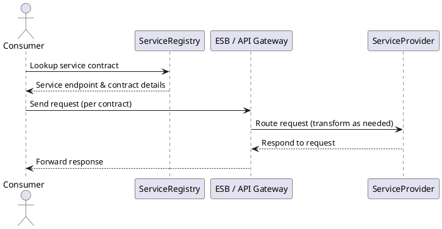

Understood. I’ll write a technical executive overview titled “Service-Oriented Architecture: Contract-Driven Decoupling at Enterprise Scale” targeting intermediate-to-advanced software engineers.

It will feature problem-solution storytelling, concise headings, and cover all 11 required technical bullets, including a `plantuml` diagram and key takeaways.

I’ll get started and notify you once the draft is ready.

# Service-Oriented Architecture: Contract-Driven Decoupling at Enterprise Scale

**TL;DR:** Service-Oriented Architecture (SOA) breaks big, tightly-coupled systems into modular services with explicit contracts. It enables independent development, flexible integration via a service bus or API gateway, and standardized governance. The result is a loosely coupled enterprise system with reusable services, improved scalability, and easier maintenance, at the cost of added complexity in design and management.

## When Monoliths Break Down: Why Adopt SOA?

Organizations turn to SOA when monolithic applications or tightly-coupled RPC integrations start to hinder growth. In a monolith, all components live in one codebase – any change means redeploying the entire system, which *“leads to challenges in scalability, deployment, and maintenance”*. As the codebase grows, development slows and risk of regression rises. Similarly, point-to-point RPC calls between systems create a brittle web of dependencies: if each client directly integrates with a service’s internals, any interface change or downtime can cascade failures. Early RPC-based architectures lacked key elements like unified discovery, security, and governance, causing **tight coupling** across applications.

**SOA** emerged to solve these issues by introducing *loose coupling* through well-defined service contracts and intermediaries. Instead of a single monolith, business capabilities are modularized into **services** that communicate via standardized interfaces. This decoupling means one service can change or scale without breaking others, addressing the pain points of monoliths. By *“dividing functionality into distinct units, each capable of independent operations,”* SOA offers far greater flexibility and agility than a one-piece architecture. In short, when the monolith becomes a liability, SOA’s service-oriented approach provides a path to scale and evolve systems without a complete rewrite.

## SOA Core Anatomy: Contracts, Services, and the Service Bus

At the heart of SOA is a set of core components that define how services are designed, discovered, and used together:

* **Service Contract:** The formal agreement describing what a service does and how to interact with it. It specifies the interface (inputs, outputs, protocols) and any quality guarantees. In classical SOA, this might be a WSDL for a SOAP service or an OpenAPI/REST definition. The contract is the *public face* of the service – consumers rely on it, not the implementation. Every service *“adheres to a service-description”* as a contract, enabling platform-independent communication.

* **Service Implementation:** The behind-the-scenes code and logic that fulfills the contract. This is the actual software component (e.g. a web application, EJB, or microservice) providing the business functionality. The implementation can change freely as long as it continues to honor the external contract, allowing internal upgrades without impacting consumers.

* **Service Provider & Consumer:** The **provider** is the entity (or team) that owns and deploys the service. A **consumer** is any client that invokes the service – this could be another service, an application, or an end-user interface. Typically, the consumer uses a **proxy/stub** generated from the service contract (for example, code stubs from WSDL in SOAP or an SDK for a REST API) to call the service. The consumer is coded against the abstract interface, not the concrete implementation, reinforcing loose coupling.

* **Service Registry/Repository:** A central directory where service contracts and metadata are published and looked up. A registry allows consumers to discover available services and retrieve connection details. It’s essentially the *“searchable directory where service providers publish service contracts”*. The **repository** often goes hand-in-hand, storing versioned specifications, documentation, and policies for each service (a governance tool). This enables **discoverability** and governance across the service ecosystem.

* **Communication Middleware (ESB/API Gateway):** Rather than calling services directly, SOA typically employs an intermediary for messaging. An **Enterprise Service Bus (ESB)** is a messaging backbone that *“facilitates communication between…applications within a service-oriented architecture”*. The ESB routes requests, performs data transformations to a canonical format, handles protocol differences, and applies business rules or policies in transit. It decouples senders and receivers – consumers just send to the bus, which takes care of delivering to the correct service. Modern implementations might use a lighter-weight **API gateway** instead: *“a single entry point for clients”* to call microservices, handling concerns like authentication and rate-limiting. The API gateway is more decentralized than a classic ESB (which often does heavy orchestration), but both serve as the “glue” that connects services. Without an ESB or gateway, every application would need direct point-to-point connections to others, resulting in fragile spaghetti integration.

Putting it together, a typical SOA interaction goes like this: a consumer finds a service’s address via the registry, then invokes it through the ESB which mediates the request, and the provider returns a response. The sequence diagram below illustrates this flow:

*(In the diagram, the ESB/API Gateway mediates the communication, using the registry’s info to locate the service.)*

## Key Principles of Service Orientation

SOA is guided by fundamental design principles that ensure services remain loosely coupled and robust. The key principles include:

* **Loose Coupling:** Services minimize dependencies on each other. The only dependency is the contract. This means a client remains independent of a service’s internal details – if changes occur behind the interface, the client isn’t affected as long as the contract stays consistent. Loose coupling greatly reduces ripple effects of changes and allows services to be replaced or updated with minimal impact.

* **Service Abstraction:** A service hides its implementation details from consumers. Only the contract (what the service does and how to call it) is exposed – things like programming language, internal logic, or database schema are kept private. This **abstraction** ensures that services can change or even be completely re-written without breaking consumers. It also means the service interface is designed in business terms, not leaking low-level concerns.

* **Reusability:** Services are designed as reusable components, not one-off modules. By encapsulating a specific business capability (e.g. customer lookup, payment processing) with a stable contract, the same service can be used in multiple applications or contexts. This *“reduces development time and costs”* and promotes consistency across the enterprise. Reusability is achieved by careful design of service granularity and contract generality (not over-tailoring to a single consumer).

* **Autonomy:** Each service has control over its own logic and data. Services should be self-contained units that can be developed, deployed, and scaled independently of others. They manage their own state and resources as much as possible, which improves reliability (a failure in one service won’t directly bring down others) and allows teams autonomy in implementation decisions. In practice, autonomy means avoiding shared databases or shared in-memory state – a service should stand on its own.

* **Composability:** Services are orchestrated and combined to build higher-level processes or applications. Because they are modular, **composable** services can be linked together like building blocks to fulfill complex workflows. This enables **orchestration** (central coordination of a multi-service workflow) and **choreography** (distributed, emergent interactions), allowing IT to rapidly assemble new capabilities by reusing existing services. The end goal is an agile business, where new processes can be realized by recombining services rather than writing code from scratch.

* **Discoverability:** Services are supplemented with metadata that makes them easy to find and understand. Through a service registry or portal, developers can discover what services exist and read their contracts and documentation. This prevents “reinventing the wheel” and encourages reuse. Good discoverability entails clear service descriptions, keywords, and perhaps a rating/governance system to know the service’s trustworthiness or SLAs.

* **Statelessness:** Whenever possible, services are designed to be **stateless** – they don’t persist session-specific information between requests. In a stateless service, *“it has no memory”* of prior calls; each request contains all information needed to process it, and any required state is stored externally (e.g. in a database or passed back to the client). Stateless services can scale out easily (since any instance can handle any request) and avoid complex synchronization or memory issues. Not all operations can be perfectly stateless, but the rule is to minimize statefulness. If a service must maintain state (e.g. a workflow service), it should treat that state as a *business transaction* that can be managed (and recovered) explicitly.

These principles collectively enforce **loose coupling** in different dimensions. By adhering to them, SOA systems gain agility – services can change, scale, or be reused with minimal side effects, which was the original promise of SOA.

## Message Exchange Patterns in SOA

SOA supports multiple **message exchange patterns (MEPs)** to accommodate different integration needs:

* **Synchronous Request/Response:** In this classic pattern, a service consumer sends a request and waits for a direct reply. The caller is blocked (or holds the connection open) until the provider returns a result. This is suitable for real-time queries or operations where an immediate answer is needed (e.g. getting a customer profile). Many SOAP web services and REST APIs use synchronous request/reply as their basic mode. The downside is the tight temporal coupling – both consumer and provider must be available simultaneously. Still, it’s straightforward and *“the request/response pattern demonstrates synchronous communication”* clearly.

* **Asynchronous (Fire-and-Forget or Callback):** In an async pattern, the consumer sends a message and does not wait for an immediate response. The request might be put on a **message queue** or bus, and the consumer can continue other work. The service will process the message and either send a separate response later (to a callback endpoint or topic) or simply not respond at all (one-way). This *fire-and-forget* style is useful for tasks like order processing or batch jobs where instant feedback isn’t required. Asynchronous messaging decouples the timing – it improves resiliency (the system can buffer messages if a service is slow or down) and can smooth load spikes. Technologies like JMS, MSMQ, or Kafka are often used for async SOA messaging. Designing for asynchrony often implies using **event-driven** approaches or a **publish/subscribe** model for multi-cast messages.

* **Document-Oriented vs. RPC-Style:** Early web services allowed an RPC-style invocation (calling remote procedures with parameters) versus a document-style interaction (exchanging self-contained data documents). **RPC-style** services mimic local function calls – they often lead to fine-grained interactions (many small calls) and tight coupling because the client and server share an *API* shape closely. **Document-oriented** services treat messages as entire business documents (often XML or JSON) that the service consumes or emits. This encourages coarse-grained operations: e.g. sending a complete “PurchaseOrder” document to a service rather than calling addItem(), setShippingAddress(), etc. The document approach tends to be more robust in SOA because it’s *data-centric* – clients and providers only agree on schema, not on executing exact methods. Best practice is to *“think in data (the wire format) instead of RPC”* for loose coupling. In practical terms, SOAP services using “document/literal” encoding or RESTful services sending JSON/XML payloads exemplify document-oriented messaging.

* **Canonical Data Model:** In heterogeneous enterprise environments, different services or apps might speak different data formats. A **canonical data model (CDM)** is a design pattern where the organization defines a standard, unified data representation for common business entities (customers, orders, etc.). All services agree to exchange data in this canonical format, or the ESB will transform messages to/from the canonical model. The CDM acts as a lingua franca, reducing the need for every pair of services to have custom translators. For example, Service A’s “order” JSON might be transformed by the ESB into the company-wide canonical Order XML, then Service B reads that. *“Canonical Data Model defines \[a] common architecture for messages exchanged between applications”*, including a common set of entities and semantics. The benefit is **interoperability** and consistency – everyone talks about data in the same way. However, maintaining a canonical model is challenging; if it’s too generic it can bloat or if too specific it doesn’t cover all cases. Many SOA implementations use XML schemas or industry standards (like OAGIS, HL7, etc.) as canonical models.

In summary, SOA messaging can be **synchronous or asynchronous**, and **RPC-oriented or document-oriented**. Modern best practice favors coarse-grained, document-style async interactions for flexibility and performance. But in reality, architects choose the pattern per use case: e.g. a user-facing service call might be sync for quick response, while inter-service communications in the back end are async for resilience.

## Governance and Service Lifecycle Management

Having dozens or hundreds of services requires oversight – **SOA governance** is the discipline of managing the service portfolio from design through retirement. Governance covers versioning, compatibility, policies, and SLAs to keep the ecosystem healthy:

* **Contract Versioning & Backward Compatibility:** As business needs evolve, service contracts will change (new operations, new fields, etc.). A well-governed SOA has a versioning strategy to introduce changes without breaking existing consumers. For example, one approach is to deploy a new version of the service (with an updated contract) alongside the old version, allowing clients to migrate over time. Old versions are only deprecated and shut down once consumers have switched. This prevents the “big bang” upgrade problem. Governance policies often dictate how version numbers are assigned and how long old versions must be supported. Backward compatibility (ensuring new versions still accept old message formats) is encouraged to reduce required client changes. In practice, techniques like message schema evolution (e.g. making new XML fields optional) help avoid breaking changes. The goal is to allow services and consumers to *evolve independently* with minimal coordination, which is achieved by design-time governance and versioned endpoints.

* **Policy Enforcement:** SOA governance also means defining and enforcing cross-cutting policies. These can include security requirements (e.g. every service must authenticate callers and encrypt certain data), logging/auditing rules, usage quotas, and design standards (naming conventions, error handling formats, etc.). A **service gateway or ESB** often acts as an enforcement point, applying policies to every request and response. For instance, an ESB can check that a message meets a schema (contract validation), or inject a monitoring agent on each call, or deny calls that violate a policy. Governance tools (like SOA management suites or API management platforms) allow central definition of policies and auto-enforce them, so that individual teams don’t implement these concerns differently. This ensures consistency and compliance (for example, meeting regulatory requirements via common security policies).

* **Service Level Agreements (SLAs):** In an enterprise SOA, each service may have promised performance and availability targets – e.g. response time < 200ms 99% of the time, or 99.9% uptime monthly. Governance involves formalizing these **SLAs** and monitoring them. Providers and consumers might even have contracts (internal or external) specifying these guarantees. Runtime governance tools will track metrics and alert if an SLA is violated. Additionally, when onboarding a new consumer to a service, governance might verify that adding load won’t break the SLA (capacity planning). SLAs tie into quality-of-service knobs (like scaling out or throttling if needed to maintain performance).

* **Lifecycle Management:** Services go through stages – design, development, testing, deployment, version updates, and eventually deprecation. SOA governance provides processes at each stage. For example, a registry/repository helps during design (ensuring architects register new services, avoiding duplicates), and a review board might assess whether a proposed service meets design guidelines. In deployment, governance might require certain tests or documentation before a service is exposed to others. At runtime, governance monitors usage and can flag services that need attention (maybe a service is underutilized and could be consolidated, or overutilized and needs more resources). When services become obsolete, a retirement plan (with consumer migration) is enforced. All these practices ensure the service ecosystem remains *consistent, reliable, and aligned with business objectives* rather than devolving into chaos.

In essence, **governance** is about having the rules and oversight so that independent service teams still play by a common playbook. It answers questions like: *“How long will this service be supported? Who can access it under what rules? What happens if we need to change it?”* – and it puts mechanisms in place (versioning, policies, monitoring) to manage those concerns proactively.

## Ensuring Reliability and QoS in SOA

Distributed services introduce new failure modes, so SOA must address reliability and Quality of Service (QoS) concerns explicitly. Key techniques include:

* **Transactions and Compensating Transactions:** In monolithic systems, a database transaction can ensure ACID consistency across operations. In SOA, a business operation may span multiple services (each with its own database or state), so global transactions are tricky. The WS-\* standards introduced protocols like **WS-AtomicTransaction** and **WS-BusinessActivity** to coordinate distributed transactions across web services. These allow a two-phase commit or compensation model among participating services – e.g. all services agree to commit or all roll back if any fails. However, such **distributed ACID** transactions can be complex and tightly coupled, so they saw limited use. Instead, many SOA designs favor **compensating transactions** for long-lived processes. In a *saga* or business activity, each service performs its action immediately, and if a later step fails, a compensating action (essentially an “undo”) is triggered on the earlier services to roll back logically. For example, if a travel booking service succeeds in reserving a flight but fails on hotel booking, it would send a cancel request to undo the flight reservation. This provides eventual consistency without locking all services in a single XA transaction. Designing idempotent operations and explicit compensation logic is a best practice for reliable SOA workflows.

* **Retries and Timeouts:** Remote calls can fail due to transient issues (network glitches, temporary service downtime). Consumers should implement **retry logic** for idempotent requests – if no response or a network error occurs, try again after a brief wait. Many ESBs and client frameworks allow configurable retries with exponential backoff to avoid overwhelming a struggling service. Coupled with retries are **timeouts** – a consumer shouldn’t wait forever for a response. If the service doesn’t reply within, say, 2 seconds, the call is aborted (and possibly retried or an error returned to the user). Timeouts prevent resources from hanging and free the caller to handle the failure (perhaps by falling back to a default behavior). Proper timeout settings, combined with retries, can mask brief outages and keep the system responsive. They also provide predictable behavior under failure (rather than threads just stuck indefinitely).

* **Circuit Breakers:** A **circuit breaker** is a design pattern popularized in microservices but equally applicable in SOA. It guards calls to a remote service by monitoring failures. If the failure rate is too high (or requests are taking too long), the circuit “trips” and subsequent calls fail immediately without contacting the service. This prevents a flailing service from bogging down all its callers (failing fast instead of queuing). After a cooldown period, the circuit breaker will let a limited number of test requests through to see if the service has recovered; if so, it closes the circuit and resumes normal operation. In an ESB or service proxy, implementing a circuit breaker can improve overall resilience by isolating failing components and avoiding cascading failures. Enterprise service buses or API gateways sometimes have built-in circuit breaker or **failure handling** features (for example, Oracle SOA Suite’s “Resiliency” settings can suspend calls to an unresponsive endpoint).

* **Quality of Service (QoS) Settings:** Besides transactions and fault handling, SOA infrastructure often provides other QoS knobs. **Message persistence and reliable messaging** (e.g. WS-ReliableMessaging) can ensure that a message is delivered *at least once* even if the network or a service goes down temporarily – the message might be stored and retried until acknowledged. This prevents data loss in transit. **Throttling** is another QoS control: limiting the rate of requests to a service to protect it from overload (perhaps enforcing that no client calls more than X times per second, or pausing intake if downstream is slow). **Load balancing** across multiple service instances is yet another – improving availability and throughput. All these mechanisms contribute to an SOA system that can meet its performance and reliability targets even in the face of failures or high load.

In summary, achieving reliability in SOA means embracing the realities of a distributed system: anticipate failures and design to mitigate them. Transactions are handled through either special protocols or compensating logic; faults are handled by graceful degradation (retries, timeouts, circuit breakers); and the middleware often shoulders responsibility for delivering messages reliably. These techniques together uphold the *quality of service* promised by the service’s SLA.

## Security in SOA

Security in a service-oriented architecture must operate at multiple layers to protect data and ensure only authorized access to services:

* **Transport-Level Security (TLS):** Many services secure communications by running over HTTPS, which uses TLS (Transport Layer Security) to encrypt data in transit. TLS (and its predecessor SSL) provides point-to-point encryption of the HTTP channel, as well as server authentication (and optionally client authentication via certificates). This is straightforward to implement (just require `https://` endpoints) and protects against eavesdropping or man-in-the-middle attacks in transit. However, transport security only covers the data *while on the wire* between two specific endpoints. If a message passes through intermediaries (like an ESB, load balancer, etc.), each hop terminates and re-establishes TLS. Thus, *“TLS can only support point-to-point security”*, not end-to-end through multiple hops.

* **Message-Level Security (WS-Security):** For end-to-end protection and more granular security, SOA can employ **WS-Security**, a SOAP extension standard. WS-Security lets you embed security tokens, digital signatures, and encryption *within the SOAP message* (in the header). For example, a service can encrypt just the sensitive parts of an XML message (like a credit card number element) so that only the intended receiver can decrypt it. Even if the message goes through an ESB, that sensitive part remains encrypted – the security travels with the message itself. Similarly, WS-Security supports signing parts of the message to ensure integrity (detecting tampering) and authenticity of the sender. Because WSS operates at the message level, it provides *end-to-end security that is not possible using TLS alone* – intermediate nodes may forward the message without needing to decrypt content (they might only look at routing headers). The trade-off is complexity: WS-Security (with its XML Signature and Encryption) is complex to implement and can impact performance due to XML verbosity and cryptographic overhead. In scenarios that require high security (financial transactions, cross-company messages), WSS is valuable. In simpler internal networks, TLS at transport might suffice.

* **Authentication and Authorization (AuthN/Z):** Establishing *who* is calling a service and *what* they are allowed to do is crucial. In enterprise SOA, **SAML (Security Assertion Markup Language)** was a common solution for federated identity and single sign-on. SAML can provide an XML token (an **assertion**) that includes a user’s identity and attributes, issued by a trusted Identity Provider. A WS-Security header might carry a SAML assertion, allowing the service to validate the caller’s identity and even role information without needing a direct username/password exchange. SAML is often used in SOAP-based SOA for cross-domain authentication (e.g. integrating an outside partner’s services securely by trusting each other’s SAML tokens).

  In more modern, lightweight services (especially RESTful ones), **OAuth 2.0** is the dominant protocol for authorization. OAuth 2 issues access tokens (often in the form of JWTs – JSON Web Tokens) that a client presents to a service as a bearer credential. For example, a mobile app might obtain a JWT from an authorization server and then include it in the `Authorization` header when calling a REST API. The service will verify the token (checking signature and claims) to authenticate the user and enforce authorization (the token might contain scopes/roles). JWTs are compact, JSON-based tokens that are efficient for web use (unlike SAML’s XML). They can encapsulate user identity, expiry time, and permissions in one token. Many API gateways and service platforms support OAuth/JWT validation out of the box.

  **Authorization** in SOA can also be managed by centralized policy: e.g. an enterprise might have an **LDAP/AD** group-based policy where only certain roles can call certain services or operations. The service bus or gateway can enforce these rules (checking the caller’s identity token or certificate against policy). Fine-grained authorization can be baked into the service as well, but centralizing it via an identity service or gateway policy often simplifies management.

* **Message Integrity and Non-repudiation:** Beyond confidentiality and auth, SOA security might require guarantees that messages aren’t altered (integrity) and that senders can’t deny sending them (non-repudiation). Digital signatures applied via WS-Security can ensure integrity – the message receiver can verify the signature with the sender’s public key, proving the message wasn’t tampered and indeed came from the holder of the private key. This is important in B2B service interactions or any high-trust environment. Non-repudiation comes from the combination of digital signatures and audit logs – if every message is signed and logged, a party cannot later claim “I didn’t send that request” because the cryptographic signature serves as evidence.

* **Network and Endpoint Security:** While the focus is often on message-level security, traditional network security still plays a role. Services should be deployed in secure network segments, using firewalls and API gateways to expose only what is necessary to the outside. Many SOA suites have a **DMZ gateway** component that safely proxies calls from external clients to internal services, sanitizing inputs to prevent SQL injection or XML bombs, etc. Services should also do input validation and output encoding as part of good practice, since they could be accessible to various clients. Finally, **security monitoring** (detecting anomalies, potential attacks, or misuse) is important – e.g. detecting if someone is scraping an API or if a sudden spike might indicate a DoS attack.

In summary, SOA security often blends enterprise identity standards with transport and message security. For SOAP-based SOA, you’d see TLS plus WS-Security with SAML for a full spectrum solution. In newer RESTful services, you might see TLS plus OAuth2/JWT. In both cases, architects must consider end-to-end data protection (especially through intermediaries) and a unified authentication model so that services trust the identities of consumers. A well-secured SOA will ensure that services are only talking to legitimately authenticated partners and that sensitive data remains protected throughout its journey.

## Observability and Service Management

With many moving parts in an SOA system, **observability** and management are critical to pinpoint issues and maintain reliability. Key aspects include:

* **Centralized Logging:** Each service typically produces log entries (for errors, warnings, business events). In a distributed architecture, logs should be aggregated to a central logging system so that administrators and developers can search and correlate events across services. Tools like the ELK stack (Elasticsearch/Logstash/Kibana) or cloud logging services are often used. Centralized logging lets you query, for example, all logs related to a specific transaction or customer across multiple services. It’s invaluable for debugging – if a request flows through Service A, B, and C, you can trace it by a correlation ID in the logs. Without centralized logs, one would have to SSH into many servers or check multiple consoles, which is untenable at scale. It’s a best practice for each service call to carry a **Correlation ID** (unique identifier) that is logged by all services in that call chain, enabling end-to-end traceability in the logs.

* **Distributed Tracing:** While logs are unstructured, **distributed tracing** provides a structured view of a transaction spanning services. Tracing frameworks (like OpenTelemetry, Zipkin, or Jaeger) propagate trace IDs with requests. Each service reports timing and metadata for the part of the trace it handled. The result is a **trace timeline** or graph that shows how a single user request flowed through various services and how long each step took. This is crucial for performance tuning and finding bottlenecks: e.g. you might discover that a user request spent 100ms in Service A, then queued 200ms on the bus, 50ms in Service B, etc. If a service is slow or errors out, the trace highlights it. In microservices, tracing is a must-have; in SOA with an ESB, sometimes the ESB itself provides a trace view of orchestrations. Regardless, adopting tracing improves **observability** by illuminating cross-service interactions which are otherwise a “black box”. Many APM (Application Performance Management) tools offer transaction tracing tailored for SOA and microservices.

* **Health Checks and Heartbeats:** To manage a large number of services, automated health monitoring is needed. **Health check endpoints** are simple APIs (e.g. `/health`) that each service exposes for monitoring systems to ping. A health check typically returns a status (healthy/unhealthy) and maybe checks vital dependencies (like database connectivity). Monitoring software regularly calls these endpoints to verify if services are up and responding. Alternatively, some systems use a **heartbeat** pattern, where each service periodically sends a heartbeat message to a central monitor or service registry to indicate it’s alive. If a heartbeat is missed, the service might be assumed down and an alert triggered. These mechanisms ensure operations teams are quickly aware of any service outages or issues, often before consumers even notice. Health checks can also integrate with orchestration – e.g. in Kubernetes or cloud environments, unhealthy services can be auto-restarted or taken out of rotation.

* **Service Dashboards:** Bringing together all this data (logs, traces, health, metrics) are **dashboards** and management consoles. Many SOA management suites (IBM, Oracle, MuleSoft, etc.) provide a dashboard view where you can see all deployed services, their current status (up/down), recent performance metrics (e.g. average response time, error rate), and SLA compliance. These dashboards might highlight, for instance, that Service X is experiencing a spike in errors or that the overall environment has Y number of services with no issues and Z services with warnings. Dashboards often provide drill-down capabilities – clicking a particular service could show its history, its dependent services, and maybe even documentation from the registry. This central visibility is crucial for **operational management** of SOA. Without it, diagnosing problems would be like finding a needle in a haystack.

* **Alerts and Incident Response:** Observability isn’t just for eyeballing – it feeds into automated alerts. Metrics like error rates, latency, or health check failures can trigger alerts to on-call engineers. For example, if a service’s error rate goes above 5% for 5 minutes, an alert might be sent. Or if a trace shows latency exceeding a threshold, that could trigger an anomaly alert. By defining these thresholds (often derived from SLAs or baseline behavior), the system can proactively notify humans or even trigger self-healing actions (like auto-scaling, restarting a service, etc.).

* **Governance Dashboards:** In addition to runtime metrics, some platforms offer governance views – e.g. showing which services have older versions still in use, which contracts are nearing end-of-life, or which consumers are using which services. This helps manage the lifecycle and usage of services from a high level.

In summary, observability and management in SOA ensure that despite the decoupled, distributed nature of the system, you can still effectively monitor and control it. They turn the chaos of dozens of logs and metrics into coherent insights about system health. A well-observed SOA will significantly reduce mean time to repair (MTTR) for incidents and enable continuous improvement by highlighting performance and reliability trends.

## Deployment Topologies: ESB-Centric vs. Decentralized, On-Prem vs. Cloud

How an SOA is physically deployed can vary from traditional centralized patterns to modern cloud-native approaches:

* **ESB-Centric (Hub-and-Spoke) Topology:** In many enterprise SOA implementations (especially circa 2000s), the **Enterprise Service Bus** is the central point through which all service calls flow. This *hub-and-spoke* model has the ESB at the center and services connected around it. When Service A needs data from Service B, it sends the request to the ESB, which routes to B; B’s response goes back via the ESB. The ESB may also host orchestrations that compose multiple services for a higher-level function. This topology simplifies integration in that every service only needs one connection (to the ESB) and a single transformation to the canonical format. It also centralizes control: things like logging, security, and policy enforcement are handled in one place (the bus). However, it introduces a dependency on the ESB’s performance and reliability – the ESB can become a **bottleneck** or single point of failure if not scaled and managed well. Still, for many large enterprises, an ESB-centric deployment was the first step in moving away from point-to-point chaos. As TechTarget notes, *“most SOAs are implemented using an enterprise service bus”* and indeed sometimes people conflated SOA with “ESB architecture”. Examples of ESB-centric stacks are IBM Integration Bus, Oracle SOA Suite, or Microsoft BizTalk Server, where the ESB (or equivalent integration broker) is the linchpin of the system.

* **Lightweight Gateway + Peer-to-Peer:** With the rise of microservices and lighter protocols, a more decentralized topology emerged. In this model, there may still be an **API Gateway** at the edge (handling external requests, API security, and acting as a directory of services), but internally services often communicate more directly (peer-to-peer) rather than always through a central bus. For instance, Service A can call Service B’s REST endpoint directly (perhaps using a service discovery mechanism to find B’s address at runtime). The gateway is mostly for clients coming in from outside or for cross-cutting concerns at the boundary, not for each internal call. This approach aligns with the microservices philosophy of “dumb pipes, smart endpoints” – keep the integration layer simple (just routing and basic auth) and push complexity to the services themselves. It reduces dependency on any one middleware component and can lower latency (no extra hop through a bus for each call). The trade-off is that without a central mediator, you need robust **distributed management** – e.g. each service might need to handle transformations or fallbacks, and observability becomes a bit harder without a single choke point to tap into. In practice, many organizations use a hybrid: some form of message broker or streaming platform for asynchronous events (so not all comms are point-to-point), and an API gateway for synchronous calls, but no heavy centralized orchestration engine. This topology works well in cloud environments where services are containerized and can dynamically discover each other (using tools like Kubernetes service discovery or service meshes). It’s essentially SOA without a traditional ESB, replaced by a combination of simpler gateways and direct links, which can improve scalability and autonomy of teams.

* **On-Premises vs. Cloud-Managed SOA:** Historically, SOA was often implemented on-premises with enterprise vendors – companies would run their own ESB servers, registries, and governance tools in data centers. Today, many of these capabilities are available as **cloud-managed services**. For example, instead of hosting an ESB, an enterprise might use a cloud integration platform (iPaaS). **Integration Platform as a Service (iPaaS)** offerings (like MuleSoft Anypoint Platform, Azure Integration Services, AWS Step Functions + API Gateway, etc.) provide cloud-hosted buses, message queues, and API gateways that you can configure without managing the infrastructure. As Cortex notes, *“iPaaS provides a scalable and flexible platform to integrate systems…reducing the need for on-premises middleware”*. Cloud-managed SOA suites often come with web-based consoles for design, centralized logging, auto-scaling, and high availability out of the box. This can accelerate projects and lower the ops burden, at the cost of some control and potential vendor lock-in. Some organizations adopt a hybrid: keep sensitive integrations on-prem but use cloud services for others, connecting the two.

* **Microservices Platforms and Containers:** Although not strictly required for SOA, modern deployments frequently use container orchestration (like Kubernetes) to deploy services. Each service might run in its own container/pod, and the platform handles scaling and inter-service networking. Service mesh technology (e.g. Istio) can inject capabilities like traffic routing, retries, and security at the platform layer, acting as a distributed “bus” of sorts but in a more granular way. The boundary between a classical SOA and microservices becomes blurred here – effectively microservices architecture is one style of deploying SOA principles (with each service highly independent and containerized). We mention this because deployment topology impacts architecture: a monolithic ESB on-prem vs. a swarm of containerized services in the cloud are both “SOA” in spirit, but the operational approach is very different.

In choosing a topology, enterprises weigh factors like **legacy integration** needs (sometimes an ESB is best to interface with old systems), **team skillsets**, **performance needs**, and strategic direction (cloud-first vs. staying on-prem). An ESB-centric approach might simplify certain integrations but at the risk of creating a new silo (the ESB itself), whereas a gateway+peer model emphasizes autonomy and cloud alignment but requires stronger DevOps maturity. The key is that SOA is flexible – it doesn’t mandate one deployment style, so long as the core ideas (services with contracts, etc.) are met.

## SOA vs. Microservices: Evolution and Trade-offs

It’s often said that **microservices are an evolution of SOA** – they share the principle of building applications as a collection of services, but with different emphasis and granularity. In fact, microservices *“are a form of SOA”* and both aim for modular, flexible software. However, there are notable differences in approach and trade-offs:

* **Service Granularity:** SOA services are typically larger, coarse-grained components – each service might encapsulate a broad business area (e.g. “Customer Management Service”). Microservices slice functionality into much smaller units – each microservice focuses on a very specific capability (e.g. just “Customer Address Service”). Thus, an SOA might have tens of services, while a microservices architecture might have hundreds of much smaller ones. This fine granularity in microservices yields greater flexibility (you can update or scale one tiny piece independently) but also more **overhead** in managing inter-service communication.

* **Team Autonomy and Organization:** In microservices, the philosophy is often one team per service (or a few services) – small, cross-functional teams that own the full lifecycle of “their” microservices. This maps to Conway’s Law, aligning architecture with independent teams. As Atlassian notes, *“microservices demand a higher degree of expertise and collaboration within smaller teams”*, whereas “larger, centralized teams can manage SOA”. In classical SOA, it wasn’t uncommon to have a centralized integration team or to have teams own large services that multiple groups would use. Microservices push autonomy further – each team can choose its tech stack, deploy on its own schedule, and is responsible for its service’s reliability. This yields faster iteration and technology diversity (polyglot), but requires strong DevOps culture to avoid chaos.

* **Data Ownership:** A key distinction: microservices typically have \*\* decentralized data management\*\* – each microservice owns its database or data store, and direct database sharing between services is avoided. This is to enforce loose coupling; services communicate only via APIs. In many earlier SOA implementations, it was common for multiple services to still share a single monolithic database (especially in a legacy environment). That can reintroduce coupling at the data layer (changes in schema affect all). Microservices therefore often embrace **event-driven patterns** to propagate data changes and keep their own data stores in sync, whereas SOA might rely more on a shared schema or canonical model. The trade-off is that microservices deal with eventual consistency and duplication of data, while SOA with a shared DB might have strong consistency but tighter coupling.

* **Communication Patterns:** Microservices favor **simple protocols** like REST (HTTP/JSON) or lightweight messaging (gRPC, message brokers), often in an asynchronous manner. They avoid centralized messaging as much as possible – the mantra is “smart endpoints, dumb pipes.” In contrast, traditional SOA often utilized heavier protocols (SOAP, WS-\*), enterprise message buses, and synchronous request/reply. So microservices communication is generally more decentralized and **asynchronous** (to improve resilience), whereas SOA historically leaned synchronous and **centralized**. Microservices also encourage using *API Gateway* patterns for handling external access and use techniques like service mesh for internal communication resilience.

* **Deployment and DevOps:** With microservices, each service is independently deployable. Continuous Delivery is a common goal – small changes can be rolled out service by service without impacting the whole system. SOA services could also be independent, but often due to coarser size, deployments were less frequent and sometimes batch (especially if many services lived in the same ESB container or app server). Microservices typically use containerization and orchestration (Docker, Kubernetes) enabling on-demand scaling and isolation. SOA was born pre-container era, typically on VMs or physical servers, and scaling might require scaling the ESB or using clustering which was more heavy-weight. Thus, microservices brought in a lot of modern DevOps practices (infra-as-code, automated deployment pipelines, etc.) as part of the architecture’s success, whereas SOA in the 2000s often involved more manual, traditional ops.

* **Governance vs Agility:** SOA implementations often introduced **governance bodies** to manage service reuse and design (to avoid duplication and enforce standards). This sometimes led to slower change (over-governance). Microservices tend to push decision-making down to teams, favoring agility over central standardization. This can lead to inconsistency (different teams might solve similar problems in different ways), but accelerates development. Essentially, SOA was sometimes **more centralized in governance** (“top-down”), while microservices are *decentralized (“bottom-up”) by design*. An Atlassian article put it as: “SOA employs a top-down, centralized approach, while microservices favor a bottom-up, decentralized model”.

* **Overlap:** In many ways, microservices adhere to the same *principles* we listed for SOA: loose coupling, abstraction, etc. Microservices can be seen as **a granular form of SOA** optimized for cloud environments and continuous delivery. They emerged learning from SOA’s failures: for instance, to avoid the “ESB bottleneck” problem, microservices architectures often avoid a single ESB and use decentralized messaging. In fact, success stories of microservices (Netflix, Amazon) can be viewed as doing SOA with improved tooling (containers, cloud, CI/CD) and finer services.

* **Trade-offs:** Choosing SOA (in a more classic sense) vs. microservices depends on context. Microservices shine for large, complex applications requiring quick evolution and where the organization can support many independent teams. They bring benefits of scalability and fault isolation, but also complexity in operations (monitoring hundreds of services is not trivial). A more coarse-grained SOA might be appropriate if an organization needs integration and modularity but with lower operational overhead (fewer deployables to manage). Some even adopt a hybrid: **macroservices** or bounded-context services – not as monolithic as old apps, but not as small as microservices, to balance manageability and decoupling.

In short, microservices are the “modern variant” of SOA. They share common goals – *“creating modular and flexible software”* – but differ in scale and methodology. Understanding the distinction is important for system design: if you invoke “SOA” in an interview, you should clarify how it compares to the now more fashionable microservices approach. The best architecture often takes inspiration from both: use service-orientation to break down the system, and apply microservice practices to each unit to maximize autonomy and speed.

## Common Pitfalls of SOA

While SOA promises a lot, there are well-known anti-patterns and pitfalls that organizations have fallen into. Being aware of these “failure modes” helps to avoid them in design:

* **“God” ESB or Service** – An overly centralized design where a single service or ESB carries too much responsibility. For example, a *God Service* that tries to handle an entire business domain end-to-end becomes a mini-monolith: *“too large, complex, and monolithic… a single point of failure and a bottleneck for scalability”*. Similarly, a God ESB that implements extensive business logic can choke the system. This negates the benefits of modularity and can severely impact performance. The fix is to break up large services into smaller, focused ones (separate concerns) and to use the ESB for what it’s good at (integration logic) but not make it do everything. Load should be distributed – avoid designs where if the ESB goes down, **everything** goes down (use clustering, multiple brokers, etc., to eliminate singletons).

* **Over-Governance and Bureaucracy** – Some SOA initiatives failed because they imposed heavy governance processes that slowed development to a crawl. If every new service or change requires approval from an architecture board and weeks of review, teams become frustrated and either bypass the process (leading to shadow services) or productivity drops. Over-governance can manifest as insisting on overly rigid standards or extensive documentation/paperwork for every service, which might be impractical. The key is finding the balance: governance is important for consistency, but it should be enabling (through automation and templates) rather than a gate that stifles agility. Modern approaches use automated linting of service definitions, developer portals, and foster a culture of reuse without mandating it through edicts.

* **Chatty Communication** – A *chatty service* is one that requires many back-and-forth calls to accomplish a task. This often happens if the service granularity is too fine or the contract too granular (RPC-like). For example, a client needing to get customer info calls `getName`, `getAddress`, `getOrders` as separate calls instead of one `getCustomerDetails`. Chatty interactions suffer from high latency (each call has network overhead) and can overload networks with extra traffic. They also increase the chance of partial failure. The remedy is to design **coarse-grained interfaces** that minimize round trips – perhaps using bulk operations or aggregating data in one call. In integration scenarios, patterns like *“fetch everything you need in one go”* or using asynchronous batch retrieval can mitigate chatty communication. Also, leveraging document-style messages (as mentioned) naturally makes interfaces chunkier rather than chatty.

* **Coarse or Leaky Data Contracts** – There’s a subtle pitfall where a service’s data contract is *too coarse* or exposes internal details. “Coarse” in terms of data means maybe the service dumps a huge object with a lot of fields to avoid being chatty, but many of those fields might be irrelevant to consumers or, worse, reveal internal implementation specifics (like internal IDs, or fields that only some consumers need). This can *leak domain details* that should be encapsulated. Consumers might start depending on those extraneous fields or specific formats, making it hard to change the service internals. For instance, if a service simply exposes its database table as an API (one-to-one mapping), it’s leaking the DB schema (which is an internal detail) to all clients. If the DB changes, all clients break – that’s tight coupling via the data contract. To avoid this, design the service contract with **abstraction** in mind: include only necessary data, use business-friendly terms, and avoid exposing raw internal keys or technical info. Sometimes this means creating an **anti-corruption layer** or translation between the internal representation and the outward contract. Also, versioning comes into play: if you realize a contract was poorly designed (leaky), you’d introduce a new version with a cleaned-up schema rather than silently changing it.

* **Vendor Lock-in / Stovepipe Services** – An anti-pattern mentioned as *“stovepipe service”* is when a service is tightly coupled to a specific technology or vendor platform. For example, building all services such that they only run on a particular proprietary ESB and use vendor-specific protocols can make it hard to evolve or mix technologies. If that vendor goes out of favor, you face a big rewrite. It violates the SOA principle of interoperability. The solution is to stick to open standards in contracts (SOAP, REST, JSON, etc.), and abstract away vendor specifics. If using a vendor’s product, try to use it in a way that doesn’t permeate every service (for instance, use a standard WSDL contract, even if the service is hosted on Vendor X’s container). This keeps your architecture flexible.

* **Reinventing the Monolith in Disguise:** A broader pitfall is when people adopt SOA in name, but not in spirit. For example, wrapping a big monolith in a SOAP interface and calling it “SOA” (the monolith is now one giant service). Or deploying many services but still coupling them through a shared database and synchronized deployments – effectively a distributed monolith. These scenarios carry the complexity of SOA with none of the benefits. Avoid this by genuinely decoupling deployments and data. Each service should be able to stand alone and be replaced independently; if not, you might still be in a monolithic mindset.

* **Performance Overhead:** Lastly, a practical pitfall is underestimating the performance overhead of SOA. Network calls, XML/JSON parsing, transformations – they all add latency compared to in-process calls. If not managed, an SOA system can be slower than the monolith it replaces. Using caching where appropriate, optimizing message sizes, and not making unnecessary remote calls (again avoiding chatty patterns) help alleviate this. In high-throughput scenarios, consider binary protocols or gRPC to reduce overhead, or event-driven updates to avoid constant polling.

Understanding these pitfalls, many stemming from improper use of the architecture, will help you implement SOA in a way that truly delivers on its promises (modularity, agility) without falling into common traps that negate its benefits.

## Key Take-aways

* **SOA breaks down monolithic or tightly-coupled systems** into modular services with well-defined **contracts**, yielding greater agility and independent scaling.
* **Core SOA components** – service contracts, providers/consumers, registry, and an integration middleware (ESB or API gateway) – enable **loose coupling** and interoperability between heterogeneous systems.
* **Design principles** (loose coupling, abstraction, reusability, autonomy, statelessness, discoverability, composability) guide service orientation and ensure services remain independent, reusable units.
* **Flexible messaging patterns:** SOA supports sync request/reply for immediate needs and async fire-and-forget for decoupling. Prefer **document-style** message exchanges over chatty RPC calls, and use a **canonical data model** to standardize data across services.
* **Strong governance** is essential – manage service lifecycles with versioned contracts (for backward compatibility), enforce policies (security, logging) via gateways, and monitor SLAs to keep services reliable.
* **Reliability techniques** like distributed transactions (or compensating transactions), intelligent retries with timeouts, and circuit breakers help maintain **QoS** in the face of failures, preventing cascading outages.
* **Security in SOA** operates at multiple layers: use TLS for transport encryption and WS-Security for end-to-end message protection; manage auth with standards like SAML for SSO or OAuth2/JWT for lightweight API security.
* **Observability** is key to operating SOA at scale – implement centralized logging, distributed tracing, and health checks so you can trace transactions, detect issues, and visualize service health in real time.
