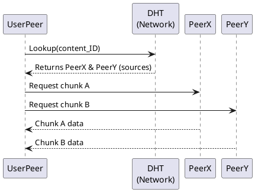

Great. I’ll write a 1,000–1,200-word executive overview titled “Peer-to-Peer Architecture: Decentralised Discovery, Storage & Compute at Internet Scale,” tailored for intermediate-to-advanced software engineers preparing for system design interviews.

This will include:

* A TL;DR summary
* Narrative structure with problem-solution storytelling
* Coverage of all 12 required bullet points
* A PlantUML diagram showing DHT-based peer discovery and chunk retrieval
* Vendor-neutral tone, using specific examples only when useful
* A "Key Take-aways" section with 8 bullets

I’ll get started and let you know once it’s ready.

# Peer-to-Peer Architecture: Decentralised Discovery, Storage & Compute at Internet Scale

**TL;DR:** Peer-to-peer (P2P) architectures eliminate central bottlenecks by having nodes act as both clients and servers. Peers form an overlay network, often structured via Distributed Hash Tables (DHTs), to discover each other and share data directly. Modern P2P systems use chunked swarming (e.g. BitTorrent), replication with eventual consistency, NAT traversal for connectivity, and incentive mechanisms to encourage fairness. Security remains a challenge (Sybil attacks, encryption, etc.), but well-designed P2P networks can achieve massive scalability and resilience beyond what centralized models offer.

## Why Peer-to-Peer? Avoiding Central Bottlenecks

Traditional client-server systems concentrate resources and control on central servers – which becomes a **single point of failure** and a performance bottleneck under load. In contrast, **peer-to-peer networks have no central authority**: each node (peer) both uses and provides services, spreading load across the network. This decentralization greatly improves resilience – if some peers fail, others can still communicate – and mitigates chokepoints, as traffic is distributed among many sources rather than funneled through one server. P2P systems became popular for file sharing and VoIP because they naturally scale: as more users join, they also contribute capacity, **increasing total throughput and eliminating central failures**. For example, early P2P file sharing (Napster, Gnutella) showed that offloading work to peers allowed the network to survive surges in demand that would crash a single server. In short, P2P addresses the **central bottleneck problem** by design: “all peers interact directly, making the system more resilient to failures and reducing bottlenecks”.

## Core Anatomy of a P2P Network

Each **peer node** in a P2P system runs the same protocol stack and has equal roles (no dedicated clients or servers). Peers form an **overlay network** – a logical topology built on top of the Internet. This overlay can be unstructured (random mesh) or structured (organized by a virtual addressing scheme). **Routing/lookup tables** are maintained by each peer to find data or other nodes. For instance, many P2P networks use a DHT like Kademlia or Chord, where each peer stores portions of a distributed index mapping content keys to peer addresses. Peers use that **routing table** to efficiently locate who has a given resource (usually in \$O(\log N)\$ hops for structured overlays). On the protocol stack side, P2P applications typically run on standard transport (TCP or UDP) but implement custom **application-layer protocols** for peer discovery, messaging, and data transfer. They often incorporate features like encryption, message signing, and NAT traversal within their stack. P2P overlays are **self-organizing** – peers discover each other via protocols (gossip, bootstrap lists, or DHT lookup) and dynamically update connections as nodes join/leave. In summary, the anatomy consists of *peers* (equal participants), an *overlay topology* connecting them, a *distributed routing/index* (like a DHT), and the *P2P protocol stack* enabling direct data exchange.

## Structured vs. Unstructured Overlays

Not all P2P overlays organize peers the same way. **Unstructured overlays** (e.g. original Gnutella) connect peers arbitrarily and use simple search techniques like flooding or random walks. They’re easy to construct and robust against churn (random failures) because there’s no rigid structure to maintain. However, search in unstructured networks is **best-effort** – you may not find a rare item if it doesn’t happen to be in the portion of the network you searched – and performance is unpredictable (queries could hit many nodes). **Structured overlays** impose an algorithmic topology (like a ring for Chord, tree for Pastry, XOR metric for Kademlia) so that content can be placed deterministically. These use DHTs to guarantee that a lookup for a given key will find the responsible peer in a bounded number of hops. The trade-off: structured networks achieve **guaranteed content location with predictable lookup time** (e.g. \$O(\log N)\$), but require more maintenance to handle churn, and typically assume content is identified by keys (immutable or hash-based addresses). Unstructured networks handle highly dynamic peers better (they “support high failure rates” with low overhead), making them suited for small or volatile groups (e.g. mobile ad-hoc networks). Structured DHTs scale to very large networks with efficient lookups, but heavy churn can disrupt their routing tables, limiting them to “moderate” churn environments. Many real systems blend approaches – e.g. BitTorrent uses a structured DHT for peer discovery but unstructured swarms for data exchange. Choosing structured vs. unstructured overlay affects lookup time and **churn tolerance** directly: structured overlays provide faster lookup on stable networks, whereas unstructured ones degrade more gracefully when peers constantly come and go.

## Data Dissemination: Chunking, Swarming, and Gossip

Once peers have discovered who has the content, how is data distributed? P2P excels at **parallel, chunked data dissemination**. Large files are split into many chunks, and peers download chunks from multiple sources in parallel – a process known as **swarming**. For example, in BitTorrent each file is divided into pieces; a peer downloading the file will get different pieces from different peers simultaneously, dramatically speeding up transfers. This also avoids overloading any single source. Peers reciprocate by uploading chunks they have to others. BitTorrent’s famous **tit-for-tat incentive** mechanism prioritizes uploading to those who upload back, rewarding contributors with faster downloads. In practice, each BitTorrent client maintains a small set of “unchoked” peers – those it is uploading to – favoring the ones providing it the best download rates (a fairness mechanism). It also periodically performs **optimistic unchoking** (randomly giving a new peer a chance to download) to discover better partners and to ensure newcomers can get started. This tit-for-tat + optimistic unchoke strategy encourages sharing and prevents **free-riders** from completely leeching bandwidth.

Beyond direct swarming, P2P networks use **epidemic techniques** to propagate data. “Epidemic replication” refers to gossip protocols where peers randomly exchange information (like new updates or chunks) with other peers, similar to how viruses spread. This can achieve *eventual dissemination* of content throughout the network. For instance, a peer with a new chunk can gossip it to a few others, who in turn pass it on, etc., until (with high probability) all peers have it. Gossip is often combined with **anti-entropy** measures – e.g. periodically, a node will compare its data with a random peer and fix any differences – to eliminate the chance that an update misses some peers. These epidemic algorithms ensure **eventual consistency** of data in highly decentralized systems (at the cost of some redundant messaging). BitTorrent’s trackerless mode exemplifies gossip: peers join via a DHT and then gossip about the “rarest” pieces they need, downloading and further spreading those pieces. In summary, P2P data dissemination is characterized by *chunking* (splitting data for parallel fetch), *swarming* (getting chunks from many peers at once), *tit-for-tat* incentives (to promote fairness in sharing), and *epidemic replication* (robust, lazy propagation of updates to reach consistency).

## Consistency and Durability in Distributed Storage

In P2P storage or computation networks (like distributed hash tables, file systems, or blockchains), maintaining data reliability is critical. **Replication** is the primary strategy for durability: each piece of data is stored on multiple peer nodes so that if some go offline, the data isn’t lost. For example, a DHT like Chord keeps \$k\$ “successor” nodes for each key as replicas. If the primary node for a key leaves, one of its successors (which has a copy of the key’s value) takes over – thus the system remains available. By tuning the *replication factor* (number of replicas), the designer can achieve a desired level of fault tolerance (more replicas = higher durability).

**Eventual consistency** is the common consistency model in such P2P systems. Rather than locking or strongly coordinating all replicas (which is hard at Internet scale), P2P systems allow temporary inconsistencies but ensure they resolve in time. Peers use background **anti-entropy protocols** – periodic syncs between nodes – to reconcile differences. A classic example is Amazon’s Dynamo (inspired by DHTs), which replicates data across nodes and uses *Merkle trees* to identify differences between replica contents efficiently. In an anti-entropy sync, two nodes exchange hash trees of their data; by comparing the Merkle root and branches, they can quickly spot any divergent keys and exchange only the missing or newer data. Merkle proofs thus allow efficient and secure consistency checks: any peer can verify data integrity by checking a chunk’s hash against a trusted root hash (a technique also used in BitTorrent piece verification and blockchain transactions). If a malicious peer tries to supply bogus data, the hash mismatch will expose it.

To manage concurrent updates without central coordination, P2P stores may use version vectors or conflict-resolution rules (like “last-write-wins” or application-specific merge rules). The **goal is eventual consistency**: even if at a given moment different peers have slightly different copies, if the network is quiescent all replicas will converge to the same state. Systems like Cassandra or IPFS employ such models – they trade off immediate consistency for higher availability. Meanwhile, **durability** is enhanced by choosing appropriate replication factors and placing replicas strategically (e.g. on diverse peers or geographic regions) so that data survives even major network partitions. In sum: *replication, anti-entropy, and Merkle-tree-based validation* combine to give P2P networks confidence in data durability and integrity, albeit with an *eventually consistent* approach rather than strict real-time synchronization.

## NAT Traversal and Connectivity

One practical headache in peer-to-peer networking is that many peers sit behind **NATs (Network Address Translators)** or firewalls, which block incoming connections. Since P2P relies on peers connecting directly, how do two peers behind NATs reach each other? The solution is a toolbox of **NAT traversal** techniques. **STUN (Session Traversal Utilities for NAT)** is commonly used: a peer contacts a public STUN server to learn its *public IP and port* as seen from the Internet. This also reveals the NAT’s type (Full Cone, Symmetric, etc.). Once each peer knows its public endpoint, they can attempt a direct UDP connection – this is called **UDP hole punching**. Essentially, both peers send UDP packets to each other’s public address simultaneously; NATs, seeing outbound traffic, often open a “hole” that allows the incoming packet through. With a well-behaved NAT, this enables a direct P2P UDP link with minimal help from servers.

However, not all NATs cooperate. **Symmetric NATs** and port-restricted variants might thwart hole punching. In those cases, peers fall back to **relay nodes**. **TURN (Traversal Using Relays around NAT)** is a protocol where an intermediary server relays data between two peers. If direct traversal fails, peers can send traffic to a TURN relay which forwards it to the other side – at the cost of higher latency and bandwidth usage on the relay server. Modern approaches use the **ICE (Interactive Connectivity Establishment)** framework, which tries all possible methods (multiple candidate IPs, STUN, TURN) to get a working connection.

P2P systems like Skype (classic) mastered NAT traversal: Skype would designate some peers with public IPs as relay *supernodes* to help NATed peers connect, and it could even chain relays if needed. Other techniques include **UPnP or NAT-PMP** (where a peer asks the router to open a port – not always available) and **TCP hole punching** (similar concept for TCP, albeit trickier). The bottom line: successful P2P networks implement robust NAT traversal so that being behind a home router or firewall isn’t a showstopper. For example, WebRTC data channels (used in browser-based P2P apps) combine STUN, TURN, and ICE to achieve peer-to-peer connectivity in the majority of scenarios. Still, *heavy NAT scenarios* (enterprise firewalls, Carrier-grade NATs) remain a challenge and sometimes lead to a portion of peers acting solely as consumers unless relays assist.

## Security Challenges and Mitigations

Decentralization introduces unique security issues. Without a central server, **authentication and encryption** become the peers’ responsibility. P2P frameworks like libp2p ensure all connections are encrypted and peers mutually authenticate via cryptographic keys. For example, each peer may have a public/private key pair, and peer IDs are derived from public keys, so you can verify you’re talking to the right node by a challenge-response signature. This prevents eavesdropping and impersonation on the open Internet. Data integrity is also crucial – content-addressable storage (like IPFS) uses hashes so peers can verify data wasn’t tampered with, and strong encryption (often end-to-end) is used for sensitive communications (as in Tor or modern P2P messengers).

One pernicious threat is the **Sybil attack**, where an attacker generates a swarm of fake nodes to subvert the network. Since creating new peer identities is often cheap, an attacker can flood a P2P network with Sybil nodes that cooperate maliciously – for example, to bias DHT routing or overwhelm honest nodes. **Mitigating Sybils** usually involves making identity creation or influence expensive. Some networks require proof-of-work or proof-of-stake for a node to have weight – effectively a Sybil must expend real resources for each identity. Bitcoin and Ethereum use PoW/PoS not only for consensus but inherently to harden against Sybil control of the network’s mining or validation process. Other approaches include **identity webs of trust** or cryptographic identity attestation, but these are hard to decentralize. In practice, many DHTs remain somewhat vulnerable: for instance, an attacker can join with many nodes and cluster around a target key (an **eclipse attack**) – isolating a victim so all its neighbors are attacker nodes, thereby controlling what it sees. Defenses here include requiring nodes to prove work for their ID (to slow Sybils), or randomizing query paths so an attacker can’t easily sit on all routes.

**Reputation systems** are another security layer: peers record experiences with others (who uploads good data vs. who sends garbage). Decentralized reputation is tricky, but algorithms like EigenTrust have been proposed to let peers collaboratively rank trustworthy nodes. Libp2p suggests using peer scoring to drop or ignore bad actors if they consistently behave maliciously. On the privacy front, P2P networks can leak a lot of metadata (who’s connecting to whom). Systems like **onion routing** (Tor) address this by routing traffic through multiple encrypted hops: each relay only knows the next hop, not the full path, and messages are wrapped in layers of encryption – just like layers of an onion. This provides anonymity for the source and destination. Some P2P applications (e.g. Bitcoin’s Dandelion protocol or the Lightning Network’s onion routing) use similar ideas to hide transaction origins.

In summary, **security in P2P is multifaceted**: it requires encrypted channels and strong peer authentication, data integrity checks (hashing, Merkle trees), **Sybil resistance** via economic or social mechanisms, **robust routing** to avoid eclipsing, and often **incentive-aligned design** so that behaving honestly is also the most rewarding strategy (as in BitTorrent’s tit-for-tat or blockchain rewards for valid behavior). It’s an ongoing challenge – there’s no central gatekeeper, so the network must collaboratively police itself against abuse.

## Resource Fairness and Incentive Mechanisms

Open peer-to-peer systems face the **free-rider problem**: some users may consume resources (downloads, CPU cycles) without contributing anything back. Without incentives, rational users tend to leech, as observed in early networks (in Gnutella, \~70% of users shared no files at all!). To combat this, P2P protocols build in fairness mechanisms. **Rate limiting and tit-for-tat** are simple ones: BitTorrent will choke (temporarily block) connections to peers that aren’t uploading data back, effectively **limiting free riders’ download rates**. Only peers that reciprocate get high bandwidth. This creates a barter economy where upload capacity becomes the currency. Other systems introduced **virtual credits**: for example, the eMule file-sharing network assigned credit scores to peers – if you uploaded a lot to others, your downloads would get priority in return. This discourages pure leeching because your download speed depends on your contribution.

Modern decentralized networks sometimes integrate **blockchain-based incentive layers**. A prominent example is Filecoin, which is built on top of the IPFS P2P storage network. In Filecoin, peers (storage providers) earn cryptocurrency (FIL tokens) for storing data reliably, and they put up collateral (staking) as a guarantee. This market-driven approach directly rewards resource sharing with a tradeable token. Similarly, some bandwidth-sharing networks have explored token rewards for forwarding traffic. Blockchain consensus itself can enforce fairness: Proof-of-Stake requires validators to lock up capital (ensuring they have “skin in the game”), and Proof-of-Work expends energy – both prevent someone from cheaply acquiring excessive influence.

On a more technical level, **fair scheduling** and **congestion control** in P2P protocols also promote fairness. BitTorrent uses a variant of TCP-friendly rate control and even employs **LEDBAT**, a latency-sensitive congestion protocol, to utilize leftover bandwidth without interfering with other traffic. P2P video streaming protocols (PPSPP, etc.) allow peers to advertise priority of chunks or assign different upload rates to different neighbors to ensure smooth playback for all. Some networks use **“give-to-get” algorithms** beyond tit-for-tat, or reputation-based throttling (if a peer is known to never upload, others gradually stop sending to it).

Incentive design goes hand-in-hand with security: it’s about aligning each peer’s rational self-interest with the network’s health. By *rewarding contribution and penalizing parasitic behavior*, P2P networks remain sustainable. Whether through **explicit credit or token systems** or implicit ones (like BitTorrent’s bandwidth tit-for-tat), robust incentive mechanisms are key to preventing an avalanche of free-riders that could otherwise undermine the network’s performance.

## Observability and Network Health Monitoring

Operating a large-scale P2P system requires visibility into its state. Unlike a centralized system, there’s no single dashboard – instead, health must be inferred from the collective behavior of peers. **Churn metrics** are especially important: measuring how often nodes join and leave, session lengths, and the rate of turnover. High churn can disrupt performance; for instance, if nodes constantly leave, the DHT or routing tables need continuous repairs. Studies have shown that when churn is high, DHT routing can suffer increased lookup failures and latency. Operators or the protocol itself can monitor the fraction of failed lookups or the time it takes to retrieve content as an indicator of churn-related issues. If lookup latency spikes or success rate drops, it might indicate a partition or excessive churn.

**Lookup latency** and **success rates** are direct measures of the overlay’s efficiency. A well-functioning structured overlay should resolve keys quickly; if those times grow, it could mean routing tables are out-of-date or overloaded. P2P networks often include nodes that periodically perform test lookups or pings to gauge these metrics. For example, BitTorrent DHT nodes might measure how long it takes to get N responses to a announce query as a sign of network responsiveness.

**Replication lag** is key for P2P storage systems: how out-of-sync are replicas? Many systems employ **eventual consistency**, so some lag is expected. However, if anti-entropy mechanisms aren’t keeping up (say, due to bandwidth limits or too much churn), data might diverge significantly. Some DHT-based stores include version counters or timestamps and can compute metrics like “X% of reads see stale data older than T seconds”. If replication lag grows beyond a threshold, it might indicate the need to increase sync frequency or replication factor.

Detecting **overlay partitions** is crucial: a partition means the network has split into disjoint sub-networks that can’t communicate (often due to many node failures or network issues). In a DHT, a partition might be detected if certain ID ranges become unreachable or if the routing algorithm cannot find certain keys that should exist, implying a section of the ring is isolated. P2P networks can include gossip about network size or peer lists – if one peer suddenly sees the network size drop drastically, that peer might be in a partition. Monitoring tools track the connectivity graph of peers (perhaps sampling neighbors of neighbors) to see if the graph remains mostly one giant component.

Modern P2P applications sometimes include a feedback loop: **nodes share telemetry** about e.g. how many neighbors they have, recent ping times, or content availability. This helps pinpoint problems (e.g. a spike in nodes with zero neighbors might mean a bootstrap node went down). Ultimately, maintaining P2P network health is about measuring and reacting to trends: *churn, latency, data consistency,* and *connectivity*. For example, a paper on mobile DHTs noted: “churn can make routing tables inconsistent, increasing lookup latency and failure rates and even partition the network” – metrics like those inform developers whether their stabilization protocols are effective. With the right observability, a P2P network can self-tune (adjust replication, timeouts, etc.) or alert operators to intervene (e.g. add more bootstrap nodes or relay infrastructure).

## Performance Knobs and Optimizations

P2P networks expose several “knobs” to tune for performance. One is **parallelism** in requests: since multiple peers can serve data, clients can issue parallel fetches. For example, a BitTorrent peer doesn’t download pieces one by one sequentially; it requests many pieces at once from different peers, keeping all its connections busy. If one peer is slow or goes offline, others fill in – improving robustness and throughput. Similarly, DHT lookups can be parallelized: Kademlia typically queries \$α\$ (e.g. 3) nodes in parallel at each step to speed up the search and avoid being stalled by a slow node. This **parallel fetch** knob reduces tail latency significantly.

Another important optimization is **locality-aware routing and peer selection**. Not all peers are equal distance – connecting to a peer on another continent might incur high latency. Structured overlays like Pastry or Kademlia can incorporate proximity metrics when building routing tables (choosing neighbors that are close in the Internet topology). Pastry, for instance, has a secondary optimization where among several candidates for a routing table slot, it prefers the one with lowest ping latency. By **routing locally when possible**, P2P networks reduce latency and cross-network traffic. Even unstructured networks can benefit: e.g. Gnutella introduced “ultrapeers” which would try to serve nearby leaf nodes. **Peer exchange protocols** (PEX) also help optimize connectivity by quickly finding not just any peers, but good peers (fast, nearby ones). Some BitTorrent clients do “local peer discovery” to find peers on the same LAN to trade chunks with ultra-fast.

**Caching and cache hinting** can further improve performance. If certain data is in high demand, peers might decide to keep it in cache even if they don’t need it, to serve others (much like HTTP caches). P2P content distribution networks leverage this: peers that download a video chunk might cache it for a short period to supply any neighbor who also requests it, reducing load on the original source. **Cache hinting** could mean the system informs nodes about popular content or instructs them to pre-fetch likely-needed items. For instance, in a P2P CDN, if a video’s first segments are very popular, the network could ensure those are cached on many peers (or edge servers) ahead of time. In DHTs, *caching* query results along the lookup path is a common trick: when a node searches for a key, intermediate nodes on the route might store a copy of the answer. Next time, queries can be answered faster by those intermediate caches. This effectively creates a lightweight implicit caching layer that **hints at data locality** – keys that get looked up often become replicated near the query sources.

Other performance knobs include adjusting message concurrency (how many outstanding requests a peer allows), **tuning timeouts** and retry strategies for slower networks, and using **protocol extensions** for bulk transfers or compression. P2P designs also sometimes use *prefix caching* or *neighbor hints* – nodes tell close neighbors about content they recently fetched, so those neighbors know whom to ask if they need it (an indirect hint of “I have X”). And as mentioned, specialized congestion controls like LEDBAT allow P2P traffic to utilize available bandwidth but politely back off when the network is busy, thus optimizing throughput without harming other applications.

In summary, P2P networks have a rich set of performance levers: *parallel operations, locality-awareness, caching, concurrency control,* etc. By carefully tuning these, they can approach the efficiency of dedicated infrastructure while retaining the benefits of decentralization.

## Real-World Incarnations of P2P Systems

Many of these concepts come to life in real-world systems:

* **BitTorrent:** The poster child of P2P file sharing. It uses a **tracker** or DHT for peer discovery, then peers form a swarm to download file pieces. BitTorrent implements chunking, swarming, and tit-for-tat incentives as discussed. It dramatically illustrated how a flash crowd for a file can be tamed: the more people want it, the more bandwidth collectively becomes available to distribute it. Modern BitTorrent is decentralized (trackerless mode uses a DHT) and extremely scalable for large distributions (e.g. many Linux ISOs and game updates are shared via torrents).

* **IPFS (InterPlanetary File System):** A distributed content-addressable storage network. IPFS peers form a DHT to index content by the hash of its contents. Fetching a file in IPFS retrieves it from whatever peer has it, potentially in chunks from multiple peers. It emphasizes **content integrity** (through Merkle DAGs) and caching – once one peer fetches some data, nearby peers can get it from them instead of a distant source. **Filecoin** builds on IPFS by adding a blockchain incentive layer: storage miners earn tokens for storing files and proving they have them via cryptographic proofs. This aligns with the resource fairness point – it’s a marketplace for storage backed by P2P tech.

* **Ethereum (and Bitcoin):** Public blockchain networks are essentially P2P overlays. Ethereum’s node discovery protocol is **Kademlia-based** – new nodes find peers via a DHT-like process. Transactions and blocks propagate via **gossip**: each node relays new messages to its neighbors. The network is highly redundant (every full node eventually gets every block) and must be to achieve consensus. Both Ethereum and Bitcoin have to contend with Sybil and eclipse attacks; their use of proof-of-work/stake and requiring multiple connections are partly to mitigate that. They also provide a great study in **network health metrics** – for instance, block “propagation latency” (time for a block to reach most nodes) is crucial for performance and is actively measured. Additionally, **Bitcoin’s Lightning Network** is a Layer-2 P2P network: nodes create payment channels and form a network to route payments. Lightning uses an overlay where each payment is onion-routed through a path of peers (for privacy), and it employs a gossip protocol to announce channel updates. It’s a modern P2P system tackling real-time financial transactions.

* **WebRTC Data Channels:** Power peer-to-peer features in web applications (like video calls, P2P file transfer between browsers, or decentralized games). WebRTC uses ICE (STUN/TURN) under the hood for NAT traversal, then sets up a direct link between browsers. While not a full-fledged content-sharing network, it demonstrates P2P connectivity and is often used in mesh networks for video conferencing (each client sends media to each other directly in small meetings). WebRTC’s design showcases the importance of **adaptive bitrate and congestion control** in P2P streams, to fairly share available capacity between participants.

* **Skype (Classic):** Skype’s original architecture was a hybrid P2P. Login was centralized (through Skype login servers), but actual voice/video calls were mainly peer-to-peer, facilitated by a P2P overlay of **supernodes**. Supernodes (which were just selected high-bandwidth Skype clients on public IPs) acted as directories and relays for users behind NAT. They helped peers find each other and, if necessary, relayed encrypted call data. This allowed Skype to scale to millions of users without maintaining a proportional server farm – the users’ own machines carried the traffic. (Modern Skype has since moved to more cloud-based, but the classic model was a P2P triumph.) It also integrated strong encryption and was known for its ability to work around firewall restrictions – an example of P2P NAT traversal in action.

These examples highlight different emphasis: BitTorrent on throughput and fairness, IPFS/Filecoin on storage and incentives, Ethereum on consistency under adversarial conditions, WebRTC on real-time communication, Lightning on low-latency payment routing, and Skype on a consumer-friendly P2P application. All leverage the core P2P ideas of decentralized discovery, direct exchange, and redundancy to achieve their goals at Internet scale.

## Common Pitfalls in P2P Systems

Despite their strengths, P2P architectures face pitfalls:

* **Free-Riding:** As noted, some users may consume without contributing. Without carefully designed incentives (like BitTorrent’s tit-for-tat), free-riders can dominate – e.g. in Gnutella, a tiny 1% of users provided \~50% of answers, while \~70% shared nothing. This skew can reduce content availability and discourage altruistic peers. Mitigation: enforce sharing ratios, use reputation or trade systems, or at least make freeloaders lower priority.

* **Flash Crowds:** A sudden surge of interest in content (like a viral file or a popular livestream) can overwhelm initial seeds or parts of the network. In the first moments of a flash crowd, there may be insufficient upload capacity to satisfy everyone, leading to slow start or even failure to obtain the content. BitTorrent partially solves this by quickly spreading pieces among early downloaders (so they can upload to others), but an initial seeder’s upload speed is still the limiting factor until the swarm “ramps up”. Systems need to handle this by, say, temporarily boosting replication or having multiple entry points (multisource seeding) to absorb the spike.

* **Eclipse Attacks:** As discussed under security, an attacker controlling many Sybil nodes can try to surround a victim and **eclipse** their view of the network. In a DHT, they might try to own all the neighbor slots in the target’s routing table. The result is the victim only connects to bad actors, who can feed false data or block certain info (imagine eclipsing a Bitcoin node to make it accept a fake fork). This is a dangerous attack vector. Countermeasures include diversifying peer connections (don’t trust all to have the same prefix or IP subnet), periodically verifying data via alternate routes or cross-checks, and making identity generation resource-expensive to reduce the number of Sybils.

* **Heavy NAT and Firewall Barriers:** If many peers are behind NATs that even hole-punching can’t traverse (e.g. symmetric NATs, corporate firewalls), the network’s connectivity graph can become weak. You might end up with numerous peers that can only connect out but not accept connections, resulting in **reduced connectivity or reliance on relays**. This can form bottlenecks at relay nodes and increase latency/cost. Some corporate networks might also block P2P traffic specifically. There’s no easy solution aside from incorporating relay infrastructure or using port 443 (HTTPS) as camouflage (some P2P networks do attempt to mask as regular web traffic, which leads to…).

* **Protocol Ossification:** If a P2P protocol becomes widespread, network operators or middleboxes might start recognizing and regulating it – for instance, ISPs in the mid-2000s throttled BitTorrent traffic once they detected its signature. Middleboxes might assume certain patterns (handshakes, port usage) – if the protocol tries to evolve (say, new message formats), these dumb middleboxes could interfere, effectively “ossifying” the protocol’s evolution. Additionally, older peers that don’t upgrade can hold back new features (since in P2P you must maintain backward compatibility to keep the network unified). This happened with protocols like eMule or older BitTorrent extensions – introducing new encryption or compression had to be done carefully so as not to be dropped by legacy nodes or traffic shapers. The workaround is often to tunnel P2P traffic over protocols that are allowed (e.g. uTP over UDP to appear like VoIP, or using TLS to make it look like regular HTTPS traffic) – but this increases complexity.

* **Managing Churn and Partitioning:** If churn is extremely high (nodes flapping constantly), even structured networks can struggle to stabilize. Lookups may fail if routing tables can’t update fast enough. In worst cases, the overlay can **partition** (split) without quickly realizing it, as mentioned earlier. Ensuring rapid stabilization (like Chord’s stabilization protocol or Kademlia’s refresh queries) and having sufficient redundancy in links (each node keeping multiple alternate neighbors) is vital. Still, mobile and IoT P2P networks face this as a fundamental issue – high churn often requires specialized designs (e.g. gossip-based overlays that don’t rely on strict structures).

* **Protocol Complexity and Ossification:** P2P protocols can become quite complex (to handle all the above issues). This complexity can lead to **implementation bugs** or unintended interactions. Also, once widely deployed, that complexity is hard to change (ossification again). We’ve seen cases where P2P networks can’t upgrade to more efficient algorithms because a huge installed base won’t upgrade or the risk of partition is too high. Thus, many networks carry legacy baggage that can hamper performance or security until a major fork or overhaul is forced.

Despite these pitfalls, peer-to-peer architecture remains a powerful approach, especially as modern applications combine P2P with cloud services (hybrid models) to get the best of both worlds. Awareness of these common issues helps in designing robust P2P systems that can gracefully handle the dark side of decentralization.

*Above: Sequence of peer discovery via DHT followed by parallel chunk downloads from two peers. The user’s peer first queries the distributed hash table (DHT) for a content ID to find which peers have the content. The DHT returns Peer X and Peer Y as holders. The user peer then requests different chunks (A, B) from X and Y simultaneously, and they respond with the data.*

## Key Take-aways

* **No Single Point of Failure:** P2P networks eliminate central servers, avoiding bottlenecks and improving fault tolerance. Peers self-organize and distribute both load and control.
* **Overlay & Routing:** Peers form overlay topologies (random mesh or structured ring/tree). Structured DHT overlays (Chord, Kademlia, etc.) enable efficient (\$O(\log N)\$) lookups at the cost of more maintenance, while unstructured networks use simpler flood or gossip searches with best-effort results.
* **Efficient Data Distribution:** Large content is split into chunks for parallel downloading. Swarm-style protocols (BitTorrent) use chunk trading with tit-for-tat incentives to maximize throughput and discourage free-riders. Gossip-based replication spreads updates gradually, ensuring eventual consistency.
* **Robustness via Replication:** P2P systems replicate data across multiple nodes for durability. Anti-entropy syncing (often via Merkle trees) keeps replicas consistent over time, yielding eventual consistency rather than strict real-time consistency.
* **NAT Traversal is Essential:** Techniques like STUN (hole-punching) and TURN (relays) allow peers behind NATs to connect. Without NAT traversal, many peers would be isolated; successful P2P networks implement ICE to cover diverse network scenarios.
* **Security Requires a Multi-Prong Approach:** All P2P traffic should be encrypted and authenticated. Sybil attacks are mitigated by making identities or influence costly (PoW/PoS). Reputation systems and distributed trust help identify bad actors, while onion routing can provide anonymity.
* **Incentives and Fairness:** Mechanisms like tit-for-tat, upload credits, or blockchain tokens align individual incentives with network health. These prevent scenarios where most users leech resources without contributing.
* **Monitoring & Tuning Matter:** P2P networks track metrics like churn rate, lookup latency, and replication lag to assess health. High churn or partitions can degrade performance, so protocols include stabilization routines and redundancy (e.g. multiple neighbors, parallel queries) to compensate. Performance tweaks such as locality-aware routing, caching, and parallelism are used to optimize throughput and latency.

