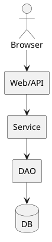

Great. I’ll write a vendor-agnostic executive overview titled “Layered (N-Tier) Architecture: Separating Concerns for Maintainable Scale,” structured for intermediate-to-advanced software engineers. It will follow a problem-solution narrative style and hit all 12 of your specified bullets, include a TL;DR and PlantUML diagram, and conclude with succinct key takeaways.

I’ll let you know when the draft is ready for review.

**TL;DR:** Layered architecture breaks a software system into distinct tiers (e.g. presentation, business logic, data) to combat the “big ball of mud” problem. Each layer has a defined role and only interacts with adjacent layers, improving maintainability, testability, and scalability by separating concerns and enforcing clear boundaries.

# Layered (N-Tier) Architecture: Separating Concerns for Maintainable Scale

## From Monolith Mud to Layered Clarity

In a **monolithic “big ball of mud”** system, all logic is tangled together without clear divisions. Over time such a codebase becomes a *“tangled, disorganized mess”* that is *difficult to understand, maintain, and extend*. Small changes can ripple unpredictably, **slowing down teams** as they grapple with tightly intertwined components and fragile code. This lack of structure leads to high technical debt, increased bugs, and fear of modifications. The motivation for layering is to impose **order and separation of concerns** on this chaos. By breaking the system into logical layers, each with a distinct responsibility, teams can untangle dependencies and work on different parts of the system in parallel with less risk. In short, layering addresses the pain points of the monolith by introducing modular boundaries – a remedy for the slowdown caused by the ball-of-mud architecture.

## Canonical Layers in N-Tier Architecture

A classic layered architecture divides an application into **four main layers**: **Presentation (UI)**, **Application (Service)**, **Domain (Business)**, and **Persistence (Data)**. The **Presentation layer** is the user interface or API that handles input/output – for example, web pages, mobile UIs, or REST endpoints. It displays information and collects user commands, but contains minimal business logic. The **Application (or Service) layer** sits behind the UI and orchestrates use cases and workflows. This layer *“defines the jobs the software is supposed to do”* and coordinates tasks, but **contains no business rules itself**. It’s kept thin, delegating all real work to the layer below. The **Domain (Business Logic) layer** is the heart of the application – it represents core business concepts, rules, and policies. Here live the business models (entities), domain services, and validation logic that implement the essential behavior of the system. The domain is independent of any UI or database concerns (pure business logic). As Eric Evans notes, this domain layer *“is the heart of business software”* and holds business state and rules, while technical details (like storage) are delegated elsewhere. Finally, the **Persistence (Data) layer** handles data access: communicating with databases, file systems, or external services to persist and retrieve data. This layer often includes Data Access Objects (DAOs) or repositories which encapsulate SQL or other storage operations.

**Each layer has a clear focus:** UI for interaction, Application for workflow, Domain for business logic, and Persistence for data. This separation means, for example, that changing how data is stored (e.g. swapping a SQL database for NoSQL) only affects the persistence layer, leaving the domain and UI code untouched. Likewise, you can modify business rules in the domain layer without rewriting UI forms or database queries. Such encapsulation of concerns makes the system easier to reason about and modify.

## Layer Interaction and Communication Rules

A fundamental rule in layered architecture is **unidirectional flow**: higher layers can call lower layers, but not vice versa. For instance, the UI layer may call a service in the application layer, which in turn calls a domain service or repository, but a lower layer should never directly invoke something in an above layer. This prevents circular dependencies and keeps the hierarchy clean. In a typical three-layer setup (UI → Business → Data), *“users make requests through the UI layer, which interacts only with the BLL (business logic layer). The BLL…can call the DAL (data access layer) for data access requests”*. The UI **should not call the DAL directly**, nor bypass business logic. Enforcing this rule ensures each layer only depends on the layer beneath it, reducing coupling.

To further decouple layers, developers rely on **interface-based abstractions**. Rather than an upper layer depending on concrete classes of a lower layer, it depends on an interface or abstract type. For example, the domain or service layer might define an interface for a `UserRepository`. The persistence layer then provides an implementation of that interface (say, `SqlUserRepository`) behind the scenes. At compile time, the higher layer only knows about the interface, not the database details. At runtime, dependency injection supplies the actual implementation. In a *“clean”* architecture variant, *“the UI layer works with interfaces defined in the Application Core…and shouldn’t know about the implementation types in the Infrastructure layer. At run time, these implementations are wired up to the interfaces via DI”*. This dependency inversion allows swapping out implementations (e.g. use an in-memory repository in tests or switch data sources) without affecting higher layers.

Another communication pattern is the use of **DTOs (Data Transfer Objects)** to ferry data between layers. Rather than passing database entities or rich domain objects directly to the presentation, the system can map them to simpler, serializable DTOs tailored for that interface. This protects the inner layers from exposure and prevents *leaky abstractions*. For instance, a service layer might map domain entities to DTOs before returning data to the UI. Many frameworks adopt this practice – e.g. Broadleaf’s service layer *“is responsible for mapping DTO ‘projections’ to and from the actual persisted entities”*. By transforming data at layer boundaries, each layer can use the data formats or models that suit its needs (the UI might use view models, the domain uses rich objects, the DB layer uses records), further separating concerns.

## Variants and Evolution of Layered Architecture

**Not all layered architectures use all four layers**, and physical deployment may group or split layers differently. In a simple **2-tier architecture**, there may be only a client and a database – e.g. a fat client application where UI and business logic run on the user’s machine and talk directly to a database. This is essentially a client–server setup. A more common **3-tier architecture** introduces a dedicated middle tier: the client (presentation) → an application server (business logic) → the database. For example, a web browser (UI) makes requests to a web/application server that executes business rules and then reads/writes to a database. **4-tier architectures** further subdivide responsibilities – often separating the business logic into *application services* vs. *domain logic* as distinct layers, or adding an integration layer. In practice, 3-tier and 4-tier models both follow the same layered principles, just with finer granularity in the latter.

Over time, architects have proposed refinements to the layered pattern to address its shortcomings. **Onion Architecture**, **Hexagonal Architecture (Ports and Adapters)**, and **Clean Architecture** are closely related variants that place the domain model at the core of the design. In these patterns, the domain and use-case logic form the inner layers, and all dependencies are reversed: outer layers (like UIs, databases, devices) *depend on abstractions defined in the domain*, rather than the domain knowing about outside details. This inversion of control ensures business logic is completely independent of infrastructure. The *“onion”* naming comes from diagrams showing concentric rings – the innermost ring is the domain model, surrounded by application services, then adapters like UIs or DB implementations on the outer rings. These styles evolved because traditional layered architectures were often **data-centric**, with business logic implicitly dependent on database schemas. As one comparison notes, *“the layered architecture is criticized for its focus on the database…, whereas hexagonal architecture emphasizes business logic over database design”*. Onion/hexagonal/clean architectures aim to solve issues like transitive dependencies, difficulty testing, and domain logic leakage by enforcing strict boundaries and dependence on interfaces. All three share the philosophy of **isolating the core domain** and achieving flexibility by making infrastructure plug-in modules.

Another variant is the **Micro-Kernel (Plug-in) architecture**. In this style, the system is split into a minimal **core** and multiple independent plug-in modules. The core contains only the essential, stable functionality, while **plugins implement extra features**, extensions, or customizations. The plugins are decoupled from each other, communicating with the core via well-defined interfaces. In essence, *“the software’s responsibilities are divided into one ‘core’ and multiple ‘plugins’. The core contains the bare minimum functionality. Plugins are independent… and implement shared interfaces to achieve different goals.”*. This approach, used in products like Eclipse or VS Code, lets you add or modify features by adding new plug-ins without altering the core, illustrating another dimension of layering (core vs. extensions) beyond the typical horizontal tiers.

## Handling Cross-Cutting Concerns

Certain concerns in a system are **cross-cutting** – meaning they affect multiple layers or the entire application. Examples include logging, authentication, authorization, input validation, caching, performance monitoring, and error handling. If not managed carefully, these concerns can end up duplicated in every layer or tangled with business logic, defeating the purpose of separation. A principle of layered design (and especially of “clean” architectures) is to keep cross-cutting code **separate from core logic**. Often, the solution is to implement these concerns in *infrastructure or framework layers* that sit at the edges of the system, or to use **aspects** and interceptors.

For instance, **authentication and authorization** checks are typically performed in the outermost layer (the presentation/API layer or an API gateway) to verify user identity and permissions before proceeding to business logic. Similarly, **input validation** of basic format and completeness is done as the request enters (UI or API layer) – ensuring that by the time data reaches the domain, it’s well-formed. However, deeper **business rule validation** (ensuring the data makes sense for the business) is a domain layer responsibility. Centralizing cross-cutting policies prevents scattering them across modules. *“Cross-cutting concerns are aspects that span layers… they should be centralized in one location to prevent code duplication and tight coupling”*.

Technologies like dependency injection containers, middleware pipelines, or AOP (Aspect-Oriented Programming) help factor out such concerns. For example, in many web frameworks you might have a logging **middleware** that automatically logs each request, or a security filter that handles authentication, wrapping the core processing. In a layered architecture, a common guideline is to place these cross-cutting modules in a separate **infrastructure layer** or inject them around the core logic. In Clean Architecture, one might implement logging, caching, or validation as decorators or middleware in the outer circle. The key is that **each layer remains focused on its primary job**, while cross-cutting concerns are handled in a consistent way across all layers (for example, using a shared logging utility or global error handler). This yields a cleaner design: the core business code isn’t cluttered with repetitive checks or technical boilerplate, yet the system still gains those important features in a uniform manner.

## Transactions and Consistency Across Layers

When an operation involves multiple steps or data updates, **managing transactions** is critical to maintain consistency. In layered systems, a question arises: which layer should define the transaction boundary? One school of thought is to begin and end transactions in the data layer – e.g. the repository opens a database transaction when a save is requested, and commits it after. However, this can be limiting. Often a **business operation spans multiple data calls** (perhaps updating several tables via different repositories). If each repository acted independently, it’d be hard to coordinate a single atomic commit. Thus, it’s generally better for the higher-level **business layer to control transactions**. In fact, *“transaction is a business concept and it should be coordinated from within the Business tier”*. The service layer can delineate a unit of work that encompasses several lower-level operations, ensuring all succeed or all fail together.

A common pattern is the **Unit of Work**, which encapsulates a set of changes to be made as a single unit. The unit of work tracks all the modifications to domain objects during a business operation and then commits them in one go. It *“maintains a list of objects affected by a business transaction and coordinates the writing out of changes,”* grouping related operations into a single **transactional unit**. For example, an application service might start a unit of work, perform various updates through repositories (which don’t immediately commit), and then call a commit method once everything is done (or rollback if any step failed). Many ORMs (like Hibernate or Entity Framework) implement a unit-of-work under the hood, so that multiple data modifications can be committed or rolled back atomically.

In simpler cases, you might not explicitly code a unit of work, but still you manage the transaction scope at the service layer – e.g. using a transactional annotation on a service method to start a DB transaction when the method begins and commit on success. The data layer then participates in that ambient transaction. The key is defining clear **transaction boundaries** that align with business operations (often one service method = one transaction). This ensures **consistency** across layers: changes made in the domain model (aggregates) are all persisted together by the data layer. It also prevents partial updates – if something fails midway, the transaction is rolled back so no layer sees an inconsistent state.

One must also consider distributed transactions or eventual consistency if the operation spans multiple services or databases (this ventures into microservices patterns like saga, which is beyond a single layered application’s scope). In an N-tier monolith though, typically a single transaction in the primary database suffices to keep the layers in sync. The guiding principle is that **business logic dictates transactional requirements** (e.g. “these five updates must all succeed or fail as one unit”), and the infrastructure provides the mechanism (database commit/rollback or unit-of-work pattern) to fulfill that.

## Scaling the Layers for High Traffic

One advantage of a layered architecture is the ability to **scale each tier independently** to handle increasing load. Key scalability strategies include making middle layers **stateless** and adding horizontal capacity where needed:

* **Stateless middle tiers:** By avoiding session state or user-specific data on individual servers, you ensure any instance of the application layer can handle any request. For example, store user session data in a shared cache or pass state in tokens, rather than keeping it in memory on one server. In a *stateless architecture, “any web server can serve a user request”* because no request is tied to a specific server’s memory. This allows seamless scaling – you can add more servers and the load balancer can distribute requests among them without worrying about session affinity.

* **Horizontal scaling of UI and service layers:** When the user load grows, you can simply deploy **multiple instances** of the presentation and application servers (e.g. a farm of web servers behind a load balancer, and a cluster of app servers behind another load balancer). Each layer can be scaled out independently. For example, if the business logic layer is CPU-intensive, you might run more service instances, whereas if the UI layer is handling many static requests, you scale out the web front-ends. Horizontal scaling improves throughput and also resilience (if one node goes down, others continue serving). *“Add more servers to the server pool (web tier),”* and similarly add *“read replicas \[for] the data tier”* to spread out load. Note that monolithic designs can also be scaled horizontally (by replicating the entire app), but layered design makes it easier to pinpoint and relieve specific bottlenecks.

* **Read replicas and database scaling:** The **data layer** is often a bottleneck in scaling. A common technique is to use one primary database for writes and multiple **read replicas** for read-only queries. The application layer can direct heavy read traffic to the replicas, reducing load on the primary. This improves throughput for read-heavy workloads and provides some failover capability. Additionally, techniques like **caching** frequently requested data in an in-memory store (Redis, Memcached) can drastically reduce database load. The caching layer can be considered another (cross-cutting) layer improving scalability by serving repeated queries from memory.

* **CDN for static assets:** Offloading static content (images, CSS, JavaScript, videos) to a **Content Delivery Network** is essential for web app scaling. A CDN caches content on servers globally, so user requests don’t always hit your origin server. This both accelerates response times for users and lightens the load on your UI layer. As a result, the web layer mainly handles dynamic requests while static files rarely reach it. *“Use a CDN to deliver static content with low latency, reducing the load on your origin servers.”* In layered terms, the CDN is like an additional caching layer in front of the presentation layer.

Other scalability knobs include **auto-scaling** (automatically add/remove instances based on load), using **message queues** between layers to smooth bursts, and employing **microservices** to isolate and scale hot spots. But within a single layered application, the primary strategy is *scale out the stateless middle tiers* and *scale up or out the data tier* (replication, sharding) as needed. By keeping layers loosely coupled and largely stateless (except the data layer), an N-tier architecture can support high traffic by distributing load across many machines and optimizing each layer (e.g. connection pooling in the DB tier, in-memory caching in the app tier, etc.).

## Performance Considerations

While layering brings many design benefits, it can introduce performance overhead if misused. Each layer boundary is a potential cost – a function call or even a network hop if layers are distributed. Careful design is needed to avoid **“chatty”** interactions between layers that can degrade throughput. A chatty architecture is one where the upper layer makes numerous fine-grained calls to the lower layer (e.g. calling the database repeatedly in a loop instead of one bulk query). Such designs suffer from latency accumulation. As Microsoft’s guidance notes, *“Chatty applications make excessive data access operations that are sensitive to network latency.”* The solution is to **reduce the number of round-trips** by using batching or more coarse-grained operations. For example, instead of calling a lower-layer service 10 times to get 10 records, have one call that returns all 10 in one go. Or batch multiple small commands into one transaction when possible. Similarly, replacing iterative single-row database writes with a bulk insert operation can dramatically speed things up.

**Bulk operations and batching** are thus key optimizations. They turn many small interactions into a few larger ones, cutting down on overhead. However, one must balance this with clarity – sometimes too much aggregation can complicate logic or memory usage. The goal is to find the right granularity of calls so that each layer does significant work per call, rather than the upper layers micromanaging lower layers with a flood of requests.

Another important technique is **connection pooling**. Opening and closing database connections (or connections to any remote service) is expensive. A data layer should reuse connections efficiently. By maintaining a pool of ready-to-use connections, each query or transaction can be executed without the setup cost of a new connection. Most frameworks handle this under the hood – it’s a standard practice in layered apps to configure a pool for the database, and even thread pools for calls to external services, so that resources are reused and throughput is higher.

Developers should also watch out for unnecessary **layer traversal** and context switching. If the layering is too granular, data might be transformed and passed through many layers with little added value at each step (sometimes called *“over-layering”*). In extreme cases, this could be an anti-pattern – e.g. calling through five layers to execute a simple calculation wastes CPU. Thus, one must ensure each layer meaningfully contributes separation of concerns; avoid creating layers or abstraction for trivial operations as it only adds latency.

In summary, to keep performance high in N-tier systems: minimize round trips (favor chunky over chatty interactions), employ caching and pooling to avoid redundant work, and periodically profile the system to collapse any overly layered or repetitive call patterns. With these measures, a layered architecture can achieve both cleanliness and speed.

## Testing and Maintainability Benefits

A well-implemented layered architecture greatly **simplifies testing and ongoing maintenance** of the software. Because each layer is responsible for a specific aspect of the system, you can test layers in isolation by **mocking or stubbing the adjacent layers**. For example, you can unit test the business logic (domain layer) by replacing the data layer with a mock repository that returns controlled data, so you focus solely on business rules. Similarly, the UI layer can be tested with the underlying service layer simulated by a stub that provides expected responses. Microsoft’s guidance highlights this decoupling: with layers, *“instead of having to write tests against the real data layer or UI, these layers can be replaced at test time with fake implementations… making tests much easier to write and faster to run”*. By limiting inter-layer dependencies to interfaces, you can create dummy implementations (fakes) to stand in for a lower layer during tests. This isolation yields more **reliable and focused unit tests**.

Beyond unit tests, layering also enables **contract testing** between layers. Since layers communicate via defined interfaces or DTOs, you can write tests to ensure that, for instance, the service layer’s outputs conform to what the UI expects (and vice versa). This might involve integration tests or acceptance tests at the boundary of layers to catch mismatches early. Because each layer’s role is well-defined, teams can reason about contracts like “Service X will return data in format Y to the presentation.” Tools or custom test suites can verify these contracts without running the entire system end-to-end.

From a maintainability standpoint, the separation of concerns means changes tend to be localized. If you need to change a tax calculation formula, you likely only touch the domain layer. If you need to redesign the UI, you modify the presentation layer (controllers, views) without altering the underlying logic. The impact of changes is thus constrained. Moreover, when the layers are encapsulated behind interfaces, you have the freedom to refactor internally as long as the interface contract remains the same. This gives a **safety net for continuous refactoring**. A robust suite of tests per layer further ensures that any refactoring (say, optimizing a data access query or restructuring domain classes) doesn’t break overall functionality – tests will catch regressions quickly. Essentially, the combination of clear module boundaries and strong tests encourages developers to improve the codebase continuously, as they can trust that failures will be caught and confined.

Additionally, layering helps manage **team collaboration** and **version control**. Different teams or developers can work on different layers simultaneously with minimal merge conflicts – e.g. one team works on UI features while another improves data persistence logic, interfacing through stable contracts. If the project grows, each layer could even be a separate module or repository, enabling clear ownership.

However, these benefits only come if the layered architecture is followed consistently. Skipping layers or introducing tight coupling “through the back door” (like one layer reaching into another’s data structures) can sabotage testability and maintainability. Sticking to the discipline of one-way dependencies and separation ensures that the system remains modifiable and test-friendly as it scales.

## Deployment Topologies: From Single Process to the Cloud

Layered architecture describes a logical organization of code, but those layers can be **deployed in various ways**. In a simple scenario, all layers reside in a **single process** or server – this is a *monolithic deployment*. The entire application (UI, logic, and data access) is packaged as one deployable unit (for example, a single WAR file or a single Node.js server connecting to a database). This is straightforward to manage and deploy. In fact, it’s *“quite common to have an N-Layer application that is deployed to a single tier”*. Here, *tier* refers to a physical deployment target, and *layer* to logical separation; an N-layer monolith runs all layers together on one machine.

For greater scalability or organizational reasons, layers can be split into **separate processes or containers**. A classic case is deploying the web UI on a separate server from the database. Many enterprise apps use three physical tiers: e.g. (1) a web server hosting the presentation layer, (2) an application server running service and domain logic, and (3) a database server for the persistence layer. These would communicate over a network (HTTP between UI and app layer, JDBC or similar between app and DB). The benefit is that you can scale or maintain each tier independently. The drawback is additional complexity: network latency between layers, need for remote call handling, etc. But as load grows, this separation can be crucial – you might run a **farm of web servers**, a **cluster of app servers**, and a robust DB cluster all cooperating. Each tier can be containerized (e.g. Docker containers for the web front-end, containers for the API/service layer) and orchestrated via Kubernetes or cloud services, achieving resiliency and ease of deployment.

Modern cloud platforms offer various options for hosting each layer. In an **on-premises** scenario, you might manually manage VMs or physical servers for each layer. In contrast, in a **cloud PaaS (Platform as a Service)** model, you could use a managed service for a given layer: for example, use Azure App Service or AWS Elastic Beanstalk for the web/app layer (letting the cloud auto-scale and manage the runtime), and use a managed database service (Azure SQL, Amazon RDS) for the data layer. This reduces operational burden and often provides easy scaling knobs.

You can even push layers into **serverless** deployments. For instance, the business logic layer could be implemented as a set of AWS Lambda or Azure Functions (each function handling a certain service operation). The UI could be static content served from a CDN or a serverless edge network, calling those functions via an API Gateway. The database might remain a managed DB or could be a serverless NoSQL store. Serverless layers scale automatically on demand and you pay per execution, which can be efficient for spiky workloads. However, going serverless might require re-thinking how state is managed (since each call is stateless and short-lived) and might blur the layer boundaries slightly (each function might encapsulate parts of multiple layers for one action).

In summary, layered architecture doesn’t force a particular deployment topology – you can deploy **all-in-one** for simplicity, or **split by tiers** for scalability and isolation. The key is that the **logical layering** remains intact regardless of physical distribution. Indeed, many systems start as a monolith (single deployable) and later *evolve* to separate tiers or even microservices as needed, leveraging the fact that layers were decoupled. Each approach has trade-offs: a single process is simpler and avoids network overhead (faster calls between layers), while multi-process or multi-container adds overhead but enables independent scaling, technology heterogeneity at different layers, and fault isolation (e.g. a memory leak in the UI layer won’t directly crash the database). The choice often depends on scale requirements, team structure, and infrastructure constraints (on-prem vs cloud).

## Security Gates at Each Layer

A layered system naturally lends itself to a **defense-in-depth security** strategy. Security is applied in multiple layers, ensuring that even if one layer’s defense is bypassed, the next layer provides another check. For example, at the outermost edge (before traffic even hits the app), one might have an **API Gateway or load balancer** that terminates TLS (SSL) and filters out obviously malicious traffic. TLS termination here means the front gateway handles HTTPS encryption, decrypting requests and often re-encrypting them when forwarding internally. This offloads the heavy cryptographic work from the app servers and centralizes certificate management. The gateway or a dedicated **WAF (Web Application Firewall)** can also inspect requests for SQL injection, XSS, and other attacks, blocking them early (this corresponds to the network or edge layer of defense).

Once a request enters the application, the **presentation layer** (especially in an API) should enforce **authentication and input sanitization**. At this layer, you validate that the caller is authorized (e.g. check JWT token or session, ensure user roles) and that all input data is clean and within expected bounds. This prevents malicious data from propagating deeper. The UI or API controllers act as a guard line: rejecting bad input, encoding outputs to prevent injection attacks, etc. They also ensure secure practices like not exposing internal implementation details (stack traces, etc.) to the user.

The **business logic layer** often adds another level of authorization – enforcing business-level permissions (like “user can only modify their own data”) and auditing operations. Even if an upstream check was missed, the domain layer shouldn’t, say, perform an operation violating business rules or data visibility constraints. The **data layer** in turn should ensure that any direct database access is parameterized (to avoid injection), and possibly apply database permissions as a last resort. Most databases allow defining users/roles and privileges on tables, adding one more safety net in case the application layer is compromised.

This multi-layer approach is the essence of *defense-in-depth*. As Amazon’s security guidance states: *“Apply security at all layers – apply a defense-in-depth approach with multiple security controls… at the edge of network, VPC, load balancing, every instance, OS, application, and code.”*. In practice, this means no single security mechanism is relied on exclusively; every layer implements relevant security measures. For example, network layer might restrict ports and origins (firewalls, network ACLs), the application layer does input validation and output encoding, the data layer uses encryption at rest and strict access control, etc. Even within the app, you might adopt **Zero Trust principles** where each call between services is authenticated and authorized, not assuming the internal network is safe.

**API gateways** often serve as a chokepoint for security. They can handle TLS, rate limiting (to prevent DDoS or abuse), and request authentication (e.g. verifying API keys or tokens). They often integrate with identity providers for single sign-on and can provide an additional layer of input validation (schema validation for JSON, for instance).

Another aspect is **monitoring and intrusion detection** at each layer. The UI layer might detect unusual patterns (multiple failed logins), the domain layer might log unexpected access patterns, and the DB might have anomaly detection on queries. By layering these, you improve chances of catching malicious behavior early.

One must also ensure that **sensitive data** is secured as it moves through layers – using TLS for any network hops between layers, and possibly additional encryption for data at rest or in transit internally. For instance, if the service layer calls the database, using secure connections (SSL) to the DB ensures no eavesdropping on that link.

In summary, each layer of the architecture should be treated as a *security boundary*. External inputs are validated and sanitized at the entry, each subsequent layer assumes the input could still be compromised and validates critical conditions, and secrets or privileges are never escalated across layers without checks. The result is a system that’s much harder to penetrate, because even if one defense is broken, an attacker finds another hurdle in the next layer.

## Common Pitfalls and Anti-Patterns

While layered architecture is powerful, teams can run into pitfalls if it’s misapplied or overapplied:

* **Anemic Domain Model:** This occurs when the domain layer is merely a set of data containers with no business behavior, and all logic is pushed up into the service layer. Martin Fowler describes this anti-pattern as having *“objects \[that] have hardly any behavior… \[and] a set of service objects which carry out all the computation, treating the domain objects as bags of getters/setters”*. An anemic domain is essentially a procedural design in OO clothing. It incurs the complexity of having a domain layer without leveraging it – all the business logic ends up in transaction scripts in the service layer. This leads to overly complex service classes and can make the code less intuitive (because behavior isn’t associated with the data it pertains to). The remedy is to push logic down into rich domain models when appropriate, keeping services thin (per DDD’s advice, *“service layer is thin – all the key logic lies in the domain layer”*). Avoid turning your domain entities into mere DTOs.

* **“God” Service Layer:** This is related to the above. If one or a few service classes accumulate too many responsibilities, they become gigantic orchestrators doing everything – validating input, performing calculations, coordinating other services, etc. This often happens in a layered system that doesn’t enforce proper distribution of logic. For example, a single `PaymentService` class might swell to hundreds of methods and dependencies, calling numerous other services. The Medium author Johnny Willer notes how overuse of service classes leads to *“a mesh of services… calling each other without a clear structure”*, resulting in *“data and logic spread through a network of service classes”*. This not only is hard to maintain (any change might affect a tangle of calls), but it replicates the big ball of mud at the service layer. The solution is to refactor such classes into more focused services or move logic into the domain objects, and use clear boundaries (perhaps adopting a use-case driven structure or command pattern to break the “god service” into smaller units of work).

* **Tight Coupling and Leaky Abstractions:** Layers should communicate via abstract interfaces or simple data structures. A pitfall is when layers become overly aware of each other’s internals. For instance, if your UI layer is tightly coupled to specific database schemas (e.g. UI code building SQL queries or assuming certain table structures), that’s a leak – the UI has knowledge that belongs in the data layer. Another example is the domain layer code directly using SQL or file I/O, which breaks abstraction. Tight coupling also appears if a change in one layer forces changes in others for non-contractual reasons (like altering a private helper in the data layer causes recompilation of the service layer – indicating the service was reaching too deep). Such coupling negates the benefit of layering. To avoid it, stick to well-defined interfaces and data transfer objects between layers. If you find one layer needs to know too much about another (like calling two layers down), consider if your layering is correct or if you need to introduce a new abstraction.

* **Layer Skipping (bypassing the architecture):** Sometimes, developers might be tempted to cut through layers for a quick solution – e.g. a UI component directly querying the database because calling the service takes a few extra steps. This *“easy to skip layers and take harmful shortcuts”* problem is common if discipline isn’t maintained. It may work in the short term but undermines the architecture – that UI component now breaks the rules, and other parts of the system can’t easily reuse or intercept that logic. Skipping layers leads to inconsistency (some logic goes through services, some directly to DB) and often duplication of security or validation checks. It’s important to enforce that all access goes through the proper channels, even if it seems a bit more indirect. If performance is the reason for skipping, that’s a sign to revisit the design (perhaps the service layer needs an optimization or caching) rather than punching through the layers.

* **Over-abstracting trivial code:** On the flip side of skipping is adding too many layers or abstraction for little gain. It’s possible to go overboard – e.g. introducing an extra abstraction layer for every single method, or creating interfaces for things that will never have multiple implementations, etc. Every abstraction has a cost in complexity and indirection. If you find yourself writing pass-through methods (one layer merely calls the next without adding value), you might have an unnecessary layer. For instance, having a “manager” layer on top of a “service” layer on top of a “repository” for a simple CRUD app could be overkill. **Aim for simplicity:** use the number of layers that make sense for your project’s complexity. The goal is to separate distinct concerns – if two layers have no clear separation of responsibility, consider merging them. Over-abstraction can also manifest as excessive use of factories, mappers, adapters for things that are not likely to change, which can make the codebase harder to follow than the original ball of mud! A good architecture finds the right balance between clarity and flexibility; abstractions should solve real coupling or dependency problems, not be done “just in case.”

In conclusion, layered (N-tier) architecture remains a foundational pattern for building scalable and maintainable software. By learning from its pitfalls – keeping domain logic rich, services focused, and boundaries clean – teams can leverage layering to build systems that are easier to extend, test, and reason about over time.

## Diagram: Three-Tier Web Application Example

&#x20;A typical three-tier web application flows from **client to database** through layered services. In the UML diagram above, the *Browser* (presentation layer) issues a request to the *Web/API* tier (application layer), which invokes the *Service* (business logic) layer. The service uses a *DAO* (data access object in the persistence layer) to interact with the *DB* (database). Each layer only calls the next immediate layer downward – for example, the Web controller calls a service method, which calls a DAO method. This structure enforces separation: the browser never talks to the database directly, and the business logic doesn’t depend on how the web request was made. The arrows denote the direction of function calls (or data flow), illustrating strict layering from the UI down to data storage. By following this pattern, the application ensures that higher-level concerns (UI/Service) remain decoupled from low-level details (SQL/DB), improving maintainability and scalability.

## Key Take-aways

* Layered architecture divides software into logical tiers (UI, application, domain, data) to **separate concerns** and tame complexity.
* **Monolithic “ball of mud” systems slow development**; layers introduce clear boundaries that make large systems maintainable.
* Layers should interact one-way (top-down) via interfaces and DTOs – preventing tight coupling and enabling swaps or mocks.
* Variations like **Onion/Hexagonal/Clean architecture invert dependencies**, putting the business logic at the core and treating UI/DB as plugins.
* **Cross-cutting concerns** (logging, auth, validation, caching) are handled in a centralized way (e.g. middleware or infrastructure layer) so core logic stays clean.
* Transaction management is typically coordinated in the service layer using patterns like **Unit of Work** for consistency across multiple operations.
* Layering supports scalability: e.g. stateless app servers scaled horizontally, **read replicas** for databases, and CDNs for static content to handle millions of users.
* Common pitfalls include anemic domain models (no logic in domain), **God objects** in the service layer, leaking low-level details into higher layers, skipping layers, or over-engineering abstraction.
