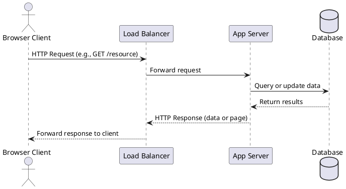

Great. I’ll craft a 1,000–1,200 word executive overview titled “Client–Server Architecture: The Two-Tier Foundation Behind Modern Systems” targeting intermediate-to-advanced software engineers preparing for system design interviews. It will follow a narrative, problem-solution style, directly address all 12 required technical bullets, begin with a concise TL;DR, include a PlantUML sequence diagram, and conclude with clear key takeaways.

I'll get started and let you know when it's ready for your review.

# Client–Server Architecture: The Two-Tier Foundation Behind Modern Systems

*TL;DR:* Client–server architecture divides applications into two roles – a client (front-end interface) and a server (back-end provider). This split overcame the limitations of monolithic systems, enabling multiple users to share common services and data. We explore why this model emerged, how it evolved (thin vs. thick clients, multi-tier, cloud), and key considerations in state management, scalability, performance, reliability, security, observability, and deployment.

## From Monoliths to Distributed Clients and Servers

Early software ran on single machines – e.g. standalone desktop apps or centralized mainframes – which eventually hit scaling and maintenance limits. In mainframe-era setups, “dumb” terminals merely relayed input to a monolithic mainframe that handled all processing. This centralized approach struggled as user counts and data volumes grew, often overloading the lone system. Likewise, single-user desktop applications couldn’t easily share data or support concurrent users. These pressures motivated the *client–server split*: distributing work between user-facing clients and powerful servers. The term *client–server* itself emerged to contrast this PC-based distributed computing with the old *monolithic mainframe* model. By offloading UI and some logic to client machines and centralizing shared business logic and data on servers, organizations achieved better scalability and flexibility. Multiple clients could now request services from one server over a network, enabling collaboration and resource sharing beyond what isolated monoliths allowed.

## Core Anatomy of a Client–Server System

At its core, a client–server system has two primary components: **clients** and **servers**. The *client* is the user-facing side – responsible for presentation (UI) and user input – while the *server* hosts the business logic and data storage, fulfilling requests. They communicate over a network via defined *protocols*. At the transport level, most client–server exchanges use TCP/IP for reliable communication (though UDP is used in cases where speed is favored over reliability, like some streaming/gaming scenarios). On top of transport protocols, higher-level *application protocols* define the interaction pattern:

* **HTTP** (typically over TCP) – the ubiquitous request/response protocol of the web, generally stateless and text-based.
* **WebSockets** – a persistent, full-duplex channel (often upgraded from HTTP) enabling real-time two-way messaging (used for live updates, chats, etc.).
* **gRPC** – a binary RPC protocol running on HTTP/2, allowing clients to call server methods as if they were local (often used in microservices or mobile APIs for efficiency).
* **Others:** Depending on needs, systems may use protocols like SMTP for email, or proprietary ones for specialized client–server apps. The key is that client and server *agree on the same protocol rules* so that requests and responses are understood on both sides.

**Sequence Diagram – Typical Client–Server Interaction:** Below is a sequence illustrating a web client request flowing to a server and database via a load balancer:

In this flow, the **client** (e.g. a web browser) initiates a request. A **load balancer** (if present) routes the request to one of potentially many **server** instances. The server executes the business logic and may interact with a **database** before sending a response. The client then processes or displays the server’s response. This clear separation of concerns – UI vs. data/logic – underpins the two-tier architecture’s success.

## Variants and Evolution of the Two-Tier Model

Not all clients are equal. **Thin vs. Thick Client** distinctions refer to how much work is done on the client side:

* **Thick client (fat client):** A feature-rich client that performs much of the data processing itself, beyond just rendering UI. Thick clients often have their own storage and can sometimes function offline, syncing with the server when connected. For example, a desktop email app like Outlook stores mail locally and lets you compose messages offline, reducing server load and providing rich features. The downside is higher complexity on the user’s machine – requiring frequent client-side updates and stronger hardware, and posing security challenges (since logic and sometimes sensitive data reside on the client). Maintenance is harder because each client installation must be managed.
* **Thin client:** A lightweight client (often just a web browser or minimal app) that handles presentation but relies on the server for processing and data storage. A thin client (like a web app) has minimal local logic; it may just render server responses (HTML/JS) and forward user input to the server. This makes deployment and updates easier – update the server and all clients benefit – and is cost-effective with lower device requirements. However, thin clients need a network connection for most operations and may have limited offline capability.

Over time, systems also moved beyond simple 2-tier client–server into **multi-tier architectures**:

* **Two-Tier:** The classic client–server model is “2-tier” – client (Tier 1) and server (Tier 2). Often, the client contains the presentation and some application logic, while the server (e.g. a database server with stored procedures) handles data and possibly some logic. There is no middle layer between client and server in pure 2-tier.
* **Three-Tier:** Introduced an intermediate **application server** between the client and database. In a 3-tier web app, for instance, the browser is the client tier (presentation), which talks to an application tier (business logic on a web server), which in turn interacts with the database tier. All communication passes through the middle tier – the client never talks directly to the data layer. This separation of presentation, logic, and data improves modularity and scalability (each tier can be scaled or modified independently).
* **N-Tier (Multi-tier):** Further splitting responsibilities into more layers or services. For example, a multi-tier system might have separate services for authentication, caching, etc., in addition to the basic 3 tiers. **Microservices** (more on this later) take this to an extreme, with many small services (many tiers of logic) behind the scenes.
* **Mobile and SPA clients:** Modern clients like mobile apps or single-page applications (SPAs in browsers) often act as *thick clients* running significant logic (e.g. rendering via React, local caching) while communicating with servers via APIs. They still follow the client–server principle but tend to consume **REST/JSON** or **GraphQL** APIs rather than full HTML pages, effectively making the client responsible for UI/UX and the server for data via web services.
* **Edge vs. Origin:** The rise of CDNs and edge computing has introduced a mini “tier” at the edge. **Edge servers** (close to users) might serve cached content or even run serverless functions, acting as a lightweight server for certain requests, with the **origin server** being the central source of truth deeper in the network. This reduces latency and offloads work from the origin. For example, a CDN edge cache may serve images or static files so the origin web server doesn’t have to, or an edge function might validate a request quickly without hitting the core service. It’s still client–server, but the “server” side is now a hierarchy of servers (edge and origin), reflecting how the basic model has evolved and scaled out.

## Stateful vs. Stateless Communication

A critical aspect of designing client–server interactions is whether the server maintains *state* about each client, or treats each request independently:

* **Stateful interactions:** The server remembers context about the client’s session or past requests. Classic example: a user logs in, and the server keeps a session in memory indicating that user’s identity and preferences; subsequent requests associate with that session (via a session ID). Stateful designs can simplify certain workflows (no need to re-authenticate each request, can store a shopping cart server-side, etc.), but they complicate scalability. If state resides in one server’s memory, requests from that user must be “sticky” to that same server (a **sticky session**) or the state must be replicated across servers or stored in a shared database/cache. More state means more to synchronize and higher memory usage on the server. In distributed systems, statefulness can hinder horizontal scaling because load balancers can’t freely route any request to any server without considering where the user’s session lives. Managing state often requires techniques like server affinity, or externalizing the state.
* **Stateless interactions:** The server keeps *no persistent memory* of client state between requests. Each request stands alone, carrying all information needed to process it. HTTP is, by nature, a stateless protocol – every request/response is independent. In stateless web apps, for example, authentication can be achieved via tokens: the client includes a token (like a JWT) with each request, and the server, instead of storing a session, simply verifies the token on the fly. This makes scaling out much easier – any server can handle any request, since no prior context is needed. The downside is the client often has to do more work (e.g. store tokens, send them every time) and certain features (like multi-step transactions or real-time interactions) require careful design (often leaning on the client or a database to hold transient state).
* **Session Management Strategies:** Many systems blend approaches to get the benefits of both:

    * **Cookies + Server Sessions:** A classic stateful approach where upon login, the server creates a session record (in memory or a session store) and gives the client a cookie with a session ID. The client sends this cookie on each request, and the server looks up state (like user identity) using that ID. This is simple but requires sticky sessions or a distributed session store if you have multiple servers.
    * **Token-Based (Stateless Sessions):** Here the server issues a token (often a JWT – JSON Web Token) to the client upon login. The token itself encapsulates the user’s identity/permissions (usually cryptographically signed). The client sends it with each request (often in an `Authorization` header). The server can authenticate/authorize purely by validating the token, with no server-side session record at all. This is stateless since the token carries the state. It scales well (no session lookup needed), though revocation or expiration must be handled (e.g. short token lifetimes or a revocation list) since the server can’t easily “kill” a token it issued except by trust expiry.
    * **Sticky Sessions:** In load-balanced environments, if using server-memory sessions, a load balancer can be configured to always route a given user to the same server (often via a cookie or IP hashing). This ensures the user’s session data is found, but it reduces the effectiveness of load balancing and failover (if that server goes down, that user’s session is lost).

Designing *idempotent* server endpoints also plays a role in safe state management. An **idempotent operation** is one that can be repeated multiple times without causing additional effects beyond the first call. For example, a “reset password” link or a payment API might be designed so that if the client doesn’t get a response and retries the request, the outcome is the same and not double-processed. Idempotency is crucial for reliability when using retries (discussed more below) – it ensures a stateful action isn’t wrongly executed twice. HTTP methods like GET are defined as idempotent by convention (repeating a read doesn’t change data), whereas POST is not (it could create a new record each time unless you design it carefully). Making certain POST operations idempotent (say, by using a client-generated unique request ID to ignore duplicates) is a common practice for robust client–server APIs.

In summary, stateless designs ease horizontal scaling and resiliency, while stateful designs can offer convenience for certain interactive experiences. Many modern systems lean stateless for core request/response APIs (REST APIs with tokens, for instance), and use stateful channels only when needed (e.g. WebSocket connections for live updates or a session-oriented protocol for streaming).

## Scalability Knobs in Client–Server Architecture

One of the biggest advantages of splitting applications into client and server is the ability to **scale** the server side to handle many clients. Key strategies and “knobs” to turn include:

* **Load Balancing:** Instead of a single server handling all requests, we can have a **pool of servers** behind a load balancer. The load balancer distributes incoming requests across multiple servers so none is overwhelmed. This horizontal scaling allows the system to serve more clients concurrently. Load balancers can use algorithms like round-robin, least connections, or IP-hash for sticky sessions. They also typically monitor server health and stop sending traffic to any server that fails. This not only improves capacity but also provides high availability (if one server goes down, others continue serving). In practice, statelessness greatly helps here – if any server can handle any request, the balancer can truly optimize the distribution.
* **Horizontal Server Pools:** By adding more server instances (scaling out), you can handle increased load. Cloud auto-scaling groups exemplify this: they automatically spin up new server instances when CPU or request count goes high. Each server runs the same application, and with a load balancer in front, clients just see one logical service. This is core to scaling modern web services to millions of users. (Vertical scaling – using a bigger server – is also possible but has limits and often higher cost; horizontal scaling is usually preferred for web systems).
* **Caching Layers:** Caching can dramatically reduce load and latency. This can happen at multiple levels:

    * **Server-side caching:** The server may store frequently accessed data in memory (using tools like Redis or Memcached). Instead of doing an expensive database query for every request, it can return a cached result for repeated queries. For example, caching user session data or the results of a heavy computation.
    * **Database caching and replicas:** Databases themselves often have caching, and you can add **read replicas** – duplicate copies of the database that handle read-only queries, taking that load off the primary database. Clients (or application servers) can send reads to replicas and only send writes to the primary, thus scaling read-heavy workloads.
    * **Content Delivery Networks (CDNs):** These are essentially distributed cache servers at the network edge. Static resources (images, CSS, videos) and even dynamic content (via advanced CDNs) can be cached closer to users, so the request never even hits your origin server. This reduces latency for users globally and offloads work from your server (a win-win). For example, if your server is in US-East and a user in Europe requests an image, a European CDN node might serve it from cache, making it faster for the user and saving your server from doing anything.
    * **Client-side caching:** Web browsers cache responses per HTTP caching headers. This is part of client–server planning too – sending proper headers so that clients don’t re-fetch things unnecessarily. If a JavaScript file or an API response is cacheable for some time, the browser may reuse it, reducing server load and speeding up UX.
* **Database Scaling:** Besides read replicas, other DB scaling strategies include **sharding** (splitting data across multiple database servers by key) to distribute writes, and using NoSQL/NewSQL stores that scale horizontally. But a common pitfall in client–server apps is relying on a single relational DB as a bottleneck – no matter how many app servers you add, if they all serialize through one DB, throughput caps out. Thus, identifying the database as a scaling knob (through replication, sharding, or caching) is crucial.
* **Asynchronous Processing:** Making parts of the system async can handle load better. For instance, instead of the server doing all work while the client waits, the server can enqueue work to background workers (using message queues like RabbitMQ or Kafka). This way, immediate responses can be fast, and heavy lifting is done out-of-line. This isn’t purely a client–server scaling (it’s more server–server), but it’s a common technique in web backends to absorb burst load without dropping requests. Clients might get an immediate acknowledgement and later fetch results, rather than hold a connection open for a long processing task.
* **Use of Edge Computing:** Pushing some logic to the “edge” servers or CDN (as mentioned) also contributes to scalability. E.g., performing input validation or API aggregation on a CDN worker can prevent lots of requests from hitting your origin servers, effectively scaling out capacity using the CDN provider’s infrastructure.
* **Load Shedding and Backpressure:** In extreme cases, servers might deliberately shed load (e.g., by returning an error or quick failure for some requests) if they’re overloaded, to recover. A well-designed client–server system may include circuit breakers or rate limiters (discussed later) that ensure the system doesn’t melt down under load but instead gracefully declines excess requests or degrades non-critical functionality.

All these techniques used together allow modern client–server systems to handle **massive scale**, far beyond what any single mainframe or desktop app could. For example, a stateless web service might run on dozens of containerized servers behind multiple load balancers across regions, utilize in-memory caches and CDN edges, and have a cluster of database shards with replicas – all invisible to the client, which just sends requests to what appears to be one endpoint. Scalability is baked into the server side, while the client side remains relatively simple.

## Performance Considerations

Performance in client–server systems often boils down to reducing latency (response time) and increasing throughput. Some key considerations and optimizations include:

* **Latency Budgets:** In distributed calls, every network hop and processing step adds latency. Teams often use a “latency budget” to allocate how much time each part of a request should take (e.g., in a 200ms total page load, maybe 50ms can be database query, 50ms in application logic, 100ms in network transit, etc.). If one component exceeds its budget, the overall response might slow down. Keeping an eye on these budgets helps pinpoint bottlenecks.
* **Connection Pooling:** Setting up a new TCP connection (or database connection) is expensive – involving handshakes and slow start – which adds latency and overhead. *Pooling* means reusing connections instead of closing them after each request. For databases, a connection pool allows your server to handle many queries without constantly reconnecting (saving perhaps dozens of milliseconds on each query). Web servers similarly use HTTP keep-alive or persistent connections so that multiple HTTP requests can reuse the same TCP connection. By **reusing existing connections**, you avoid the cost of repeated handshakes, improving overall throughput and latency.
* **Nagle’s Algorithm vs. TCP\_NODELAY:** Nagle’s algorithm is a TCP feature that batches small packets to improve network efficiency. However, batching can introduce small delays while TCP waits to accumulate data. In interactive applications (like real-time chat or certain HTTP scenarios with lots of small messages), those delays hurt latency. Setting the TCP\_NODELAY option disables Nagle’s algorithm, ensuring packets are sent immediately without waiting to batch. This can improve responsiveness at the cost of potentially more packets on the network. The right choice depends on context: for example, a telnet or game server wants every keystroke sent now (disable Nagle), but a bulk file transfer is fine with Nagle’s batching.
* **HTTP Keep-Alive:** By default, HTTP/1.0 closed the TCP connection after each request. HTTP/1.1 introduced *keep-alive* persistent connections, meaning the TCP connection stays open for multiple requests in sequence. This saves the time of reopening a connection for each resource (HTML, then images, then CSS, etc.). With keep-alive, the client and server incur the handshake cost once and can send many requests over one connection, improving performance dramatically. Modern HTTP/2 goes further to allow multiplexing many parallel requests over one connection, reducing the need for multiple connections at all.
* **Batching and Pipelining:** If a client needs to make several requests, *batching* them together can cut down overhead. For example, instead of a client making 10 separate HTTP calls (incurring latency and processing per call), it might make one call that asks for all 10 pieces of data in one go. This reduces round-trip times and overhead per request. Many APIs offer batch endpoints for this reason. Similarly, HTTP/1.1 allowed *pipelining* (sending multiple requests without waiting for each response in turn), though it was tricky to use in practice and HTTP/2’s multiplexing is the modern answer. In databases, batching multiple updates into one transaction or using bulk operations can also significantly improve throughput.
* **Latency vs. Throughput Trade-offs:** Sometimes improving throughput (handling more data) can increase latency (taking more time per request) and vice versa. For example, reading 1000 small items in one batch call might through-put-wise be efficient, but it could make the single call slower (higher latency) compared to retrieving just what the user needs at that moment. Designing with a clear understanding of requirements (do we need raw speed for one request, or better overall efficiency for many?) is key. Setting budgets as mentioned, and measuring both p99 latency (tail latency) and throughput, helps ensure performance is balanced.
* **TCP Tweaks:** Beyond Nagle/NoDelay, there are other low-level tweaks like adjusting TCP window sizes, using UDP for some traffic to avoid handshake latency, enabling TCP Fast Open, etc., which advanced applications might use. For most developers, sticking to proven protocols (HTTP/2, etc.) and using CDNs covers these.
* **Avoiding Chatty Interactions:** This crosses into design – if a client has to make dozens of back-and-forth calls to accomplish a use case (a “chatty” protocol), latency adds up from each round trip. Performance can often be improved by changing the interaction pattern – e.g., send one request that includes all needed info and get one response (coarse-grained API), instead of many small exchanges. We’ll discuss this pitfall later, but it’s worth noting here as it severely impacts perceived performance.

In practice, performance tuning often involves using tools to profile response times across components, adding caching where it helps, and adjusting how data is sent over the network. Connection reuse, request batching, and judicious use of protocol features (like keep-alive) are relatively low-hanging fruits that can yield big gains. For instance, an internal study might find that disabling Nagle’s algorithm on a game server cut 100ms from chat message latency, or enabling HTTP/2 multiplexing reduced page load time by 20% by fetching resources in parallel over one connection. Such details can be the difference between a snappy service and a sluggish one.

## Reliability and Fault-Tolerance

In a client–server system, what happens when things go wrong? Networks can drop, servers can crash, data can be inconsistent. Designing for reliability means anticipating failures and minimizing their impact:

* **Retries with Backoff:** A fundamental strategy is to automatically retry failed requests, since many failures are transient (a momentary network glitch or a server restarting). Clients (or intermediary services) often implement retry logic. However, retries must be done carefully: hitting a struggling server with rapid retries can make things worse (the **thundering herd** problem). Thus, use **exponential backoff** – wait progressively longer (e.g. 1s, then 2s, 4s…) between retries – to give the system time to recover. Also add some jitter (randomness) to avoid many clients retrying in sync. Only retry idempotent or safe operations; if an operation is not idempotent, ensure the system can handle duplicates or avoid retrying it to prevent side effects.
* **Idempotent Endpoints:** As noted, making server operations idempotent where possible greatly aids safe retries. For example, an API to “create order” might accept a client-generated order ID – if the client gets no response, it can retry and the server will see the same ID and not duplicate the order. This way, reliability improves without compromising correctness.
* **Graceful Degradation:** Not all features are equally critical. A robust client–server design will allow non-critical components to fail without bringing down the whole system. For example, if a recommendation service times out, the e-commerce site can still serve the product page minus recommendations, rather than failing completely. This is graceful degradation – the system provides partial functionality instead of a full error. Circuit breakers (below) can help automate this by detecting failures and bypassing the broken component.
* **Circuit Breakers:** This is a design pattern to avoid cascading failures. Imagine a service A calls service B. If B is down or very slow, A might get backed up waiting on B, possibly exhausting its resources (threads, memory) and then failing, causing a domino effect. A *circuit breaker* in A will “trip” after a certain number of failures calling B – meaning A will *stop calling B for a short time*, and immediately fail or fallback those requests. This prevents resource blockage and gives B time to recover. After a delay, the circuit breaker can allow a trial request to see if B is back, and if so, reset to normal operation. Libraries like Hystrix or Resilience4j implement this. It’s analogous to an electrical circuit breaker protecting a circuit from overload.
* **Timeouts and Fallbacks:** Always use timeouts on network calls – a client that waits indefinitely for a response can tie up resources. If a call exceeds, say, 2 seconds, it should timeout and perhaps retry or fallback. **Fallbacks** could be serving cached data or default responses. For instance, if a live pricing API fails, maybe use the last known price from cache as a fallback.
* **Redundancy:** Have redundant servers and components so that one failure doesn’t mean total outage. This can mean running servers in multiple availability zones or data centers (so a power outage or network issue in one doesn’t down the service entirely), having multiple instances of each service (so one crash just triggers failover to the next), and even redundant network paths.
* **Graceful Shutdowns:** When servers need to go down (for deploys or auto-scaling down), design them to finish in-flight requests or signal clients to retry elsewhere, rather than just dropping connections instantly.
* **Data Integrity and Idempotency:** Use transactions or compensating transactions to keep data consistent. If a server crashes mid-operation, make sure either the operation is completed fully or rolled back. Idempotent reprocessing can also resolve uncertain states.
* **Health Checks and Self-Healing:** Deployment environments (like Kubernetes or cloud platforms) use health check endpoints (like `/healthz`) to know if a server is alive. If a server becomes unresponsive or unhealthy, it can be auto-restarted or replaced. This ties into reliability – the system detects failures and corrects them proactively. Clients might also have logic to try a different server if one doesn’t respond (e.g. a web app can have multiple API endpoints or use DNS to get another server).

In essence, reliability features ensure that a hiccup doesn’t turn into a full outage. As an example, a robust server will implement *defensive programming*: timeouts on outbound calls, try-catch around critical sections, maybe a queue to buffer requests if a downstream is slow, etc. On the client side, if a server is unavailable, the client might show cached content or a friendly error with a retry button rather than just freezing. Systems like Netflix popularized many of these patterns (circuit breakers, bulkheads, fallback logic) to keep their services running even when dependent components failed. Always assume something *will* go wrong – then design so that when it does, you “fail soft” and recover quickly.

## Security Layers in Client–Server Models

Because client–server architecture often underpins internet-facing applications, security is paramount. Multiple layers of security defenses are applied:

* **TLS Encryption:** At the transport layer, use HTTPS (HTTP over TLS) or other protocols over TLS. TLS (SSL) ensures communication between client and server is encrypted and cannot be easily intercepted or tampered with. It also ensures the client is talking to the genuine server (server presents a certificate). Today, TLS is a default for any sensitive or public traffic – APIs, websites, etc., all should be using it to prevent eavesdropping and man-in-the-middle attacks. In internal networks, encryption might sometimes be skipped for performance, but zero-trust philosophies are pushing encryption everywhere.
* **Mutual TLS (mTLS):** While TLS typically authenticates the server to the client (the client checks the server’s cert), **mutual TLS** means *both sides* present certificates and authenticate. This is common in service-to-service communication within a data center or between microservices – each service verifies the other’s identity via certificate. It’s also used in highly secure client scenarios (e.g. a trading application where the client machine has a cert to prove it’s authorized). mTLS helps prevent unauthorized clients from even establishing a connection.
* **Authentication & Authorization:** On top of transport, the server needs to authenticate the client’s identity (e.g. via login credentials, API keys, tokens) and authorize their access to resources. **OAuth 2.0** is a common framework for delegated auth (think “Log in with Google” – your client gets a token from Google to access an API). **JWT (JSON Web Tokens)** often carry authentication info: a server might issue a JWT at login which the client presents on each request. The JWT is signed, so the server can validate it hasn’t been forged, and it might contain the user’s roles/permissions. This allows *stateless auth*, as mentioned – no server-side session, the token itself is proof. *Access control* should be enforced on the server for each request (the client should be assumed potentially compromised – never rely solely on client-side checks).
* **CSRF Protection:** Web browsers have an odd quirk – if you are logged into a site, any other site can try to send a request to that site using your credentials (because the browser will send cookies). Cross-Site Request Forgery (CSRF) is mitigated by the server requiring a secret token in sensitive requests (e.g. form submissions) that a malicious third-party site can’t obtain. Frameworks often generate a CSRF token for each session and validate it on each state-changing request. This ensures the request genuinely originated from the intended client interface, not an attacker’s page. Additionally, setting auth cookies as `SameSite` and not allowing third-party usage helps.
* **CORS:** Cross-Origin Resource Sharing is a browser security model. By default, a web page from origin A (domainA.com) cannot call an API on origin B (domainB.com) via AJAX unless the server B explicitly allows it. The server does so via CORS headers (like `Access-Control-Allow-Origin`). CORS prevents rogue web pages from accessing APIs they shouldn’t. It is a *browser-side* defense (doesn’t affect cURL or server-server calls). Servers should configure CORS to only allow trusted domains to call them, and perhaps only allow certain methods. In summary: **CORS controls who can make AJAX calls to the server**, while CSRF protections ensure that even if a call is made, it has the right user intent. Together they mitigate cross-site attacks.
* **Rate Limiting and Throttling:** To prevent abuse or simple overload, servers often enforce rate limits – e.g. an API might say “max 100 requests per minute per IP or per API key”. This can stop brute-force login attempts, web scraping, or DoS attempts at the application level. Clients who exceed the limit get a 429 Too Many Requests or similar. Throttling could also mean gradually slowing responses if a client exceeds a threshold. These measures ensure one bad actor (or buggy client) doesn’t hog resources.
* **Input Validation and Sanitization:** On the server side, never trust client input. Validate that it conforms to expected format and size (prevent buffer overflows or injection of weird data). Sanitize inputs to avoid **SQL injection** or **XSS** if that input is later displayed. Use prepared statements for database queries. Essentially, *defensive coding* to assume the client might be malicious.
* **Logging and Monitoring (Security):** Keep logs of authentication events, important actions, etc., and monitor for anomalies (like a single IP failing login 500 times = likely attack). Intrusion detection systems can flag odd patterns.
* **Secure Storage:** The server should secure sensitive data at rest as well – e.g. hashing passwords, not storing secrets in plain text. If the client–server model includes persistent sessions, those should be stored securely (e.g. HTTP-only cookies so JavaScript can’t steal them, and maybe encrypted).
* **API Security (OAuth, etc.):** If the system is providing APIs, using standards like OAuth 2 for third-party access (so users can authorize other apps limited access to their data) is important. For internal APIs, issuing short-lived tokens and requiring mTLS can ensure only authorized microservices talk to each other.
* **Network Security:** This is more infrastructure, but segmenting networks, using firewalls to only allow expected traffic (e.g. only allow public to hit the web server, only allow the web server to talk to the database on the DB port), helps contain breaches. Also, DDoS protection services or WAFs (Web Application Firewalls) can filter out malicious traffic (like SQL injection attempts or known attack patterns) before they hit your app.

Overall, security in client–server systems is about layers: from transport security (TLS) to application-level auth (sessions/tokens) to coding practices and infrastructure. A well-secured system will encrypt data in transit, authenticate every request, guard against common web attacks (XSS, CSRF, injection), and ensure the principle of least privilege (clients only get access to what they should). It will also have monitoring to catch any breaches. For instance, if you build a REST API, you might use HTTPS + OAuth 2.0 + JWT access tokens, enable CORS only for your domain, implement CSRF tokens for any web forms, and log all admin actions with alerts on suspicious activity. These measures working in concert protect both the client and server from threats.

## Observability Across Tiers

With a client–server (especially multi-tier or microservices) system, observability is critical to understand behavior and troubleshoot issues. The main pillars of observability are **logs, traces, and metrics**, and we can add health checks and synthetic monitoring to the mix:

* **Centralized Logging:** Each server (and even clients in some cases) produces logs – records of events, errors, requests, etc. In a distributed system, it’s essential to aggregate these logs into a central system for analysis. Tools like the ELK stack (Elasticsearch/Logstash/Kibana) or cloud logging services collect logs from all servers so you can search them in one place. Centralized logs give a consolidated view of system activity and let engineers quickly find, say, all error messages in the last hour across all instances. Structured logs (e.g. in JSON) with fields like request ID, user ID, etc., make it easier to filter and correlate events. Logging is often the first line of debugging when something goes wrong in production.
* **Distributed Tracing:** In a microservices or multi-tier environment, a single user request might flow through many services (e.g., from web server to auth service to database and to a caching service). **Distributed tracing** assigns each request a unique trace ID and tracks it as it goes from system to system. Each segment of work (span) reports timing and metadata, and by aggregating them, you can reconstruct the journey of that request. Tools like Zipkin, Jaeger, or OpenTelemetry facilitate this. The result is you can see a timeline: e.g., request 123 took 500ms total – 100ms in service A, 300ms in service B, 100ms in service C – and you can pinpoint where the slowdown or error occurred. Tracing is invaluable for diagnosing performance issues and understanding complex interactions across tiers. For instance, if a user action triggers a chain of 5 service calls and one is intermittently slow, tracing will reveal that.
* **Metrics & Monitoring:** Servers expose metrics like CPU, memory, request counts, error rates, etc. Tools such as Prometheus or DataDog collect these and provide dashboards. Metrics give a quantitative view: e.g., requests per second, average response time, database query count, etc. They also feed **alerting** – you might set an alert if error rate > 1% or if response time > 2s average, etc. This way, you proactively discover issues (maybe before users even notice).
* **Health Probes:** Servers often implement health endpoints (like `/health` or `/ping`) that load balancers or orchestrators use to check if the server is alive and well. A **liveness probe** might simply return OK if the process is up. A **readiness probe** can indicate if a server is ready to take traffic (maybe it’s still warming up or connecting to the database). These probes ensure that traffic isn’t sent to unhealthy instances. In Kubernetes, for example, readiness probes control if a pod is in the service endpoints; liveness probes trigger restarts of stuck pods. In client–server terms, think of it as the server saying “I’m good” or “I’m not OK” to an automated doctor, which then routes traffic accordingly or recovers the server.
* **Synthetic Monitoring:** This involves actively simulating users to test the system. Services like Pingdom or custom scripts can periodically perform typical client actions – e.g., an HTTP GET to a login page, or a multi-step transaction – to ensure everything is working. These synthetic transactions run from various locations and report back on success or failure and response time. The benefit is you can often catch outages or slowdowns before real users report them. For example, an e-commerce site might have a synthetic monitor attempt to search for a product and go to checkout every 5 minutes. If it fails, ops gets an alert. Synthetic monitoring is proactive (doesn’t rely on real traffic). It’s especially useful for external dependencies: you might monitor that your payment gateway is responding properly, for instance.
* **End-to-End Tracing (User perspective):** Beyond back-end tracing, RUM (Real User Monitoring) scripts on the front-end can measure page load times, API call times from the user’s browser, etc., giving insight into the actual user experience. But focusing on server-side, we mostly consider logs/traces/metrics there.
* **Correlation IDs:** It’s useful to pass a correlation ID (like the trace ID) through all logs in a request. That way, in logs, you can grep for that ID and see all related log entries across services. Many frameworks support automatically injecting these.
* **Observability Culture:** It’s not just tools – teams must ensure that meaningful data is being logged and measured. For example, log an error with enough context to debug, emit a metric for unusual events, trace new service calls, etc. Also, regularly test that alerts fire correctly and that dashboards reflect what matters (there’s a joke: the first time you know your monitoring is working is when it wakes you up at 3am).

A scenario highlighting observability: suppose users report that saving a record sometimes hangs. With distributed tracing, you find that in those cases, the trace shows a call to a downstream service that took 30 seconds. Logs (with the same trace ID) in that downstream service show a timeout connecting to the database. Metrics show that database connections spiked at that time. You correlate that to a deploy 10 minutes earlier which perhaps exhausted the connection pool. This narrative is only possible if you had logs, metrics, and traces in place – otherwise you’re guessing in the dark. Observability turns production systems from black boxes into glass boxes where you can see what’s happening inside.

## Deployment Topologies: From On-Prem to Cloud Native

How and where servers are deployed has a big impact on operations:

* **On-Premises vs. Cloud:** Traditionally, companies ran servers in-house (“on-prem”). This meant buying/renting hardware, installing OS and application servers, and managing everything from power to networking. Cloud computing (AWS, Azure, GCP, etc.) changed this by offering on-demand infrastructure managed by providers. In a cloud deployment, you can spin up virtual servers (or containers, or functions) in minutes, pay-as-you-go, and scale dynamically. On-prem offers more control (and sometimes cost advantages at scale), but cloud offers agility and global reach easily. Many use hybrid models (some on-prem for sensitive stuff, cloud for public-facing). For a system design interview, noting that an architecture can be deployed either on-prem or cloud is good – the client–server logic doesn’t change, but cloud gives you ready-made load balancers, auto-scaling, etc., whereas on-prem you might need to set up F5 hardware load balancers and manually add servers.
* **Containerized Servers:** Containers (like Docker containers) package an application with its environment, ensuring consistent deployment across environments. In a client–server app, you might containerize the server component, allowing it to run on any infrastructure with the same behavior. Container orchestration (Kubernetes, ECS, etc.) then handles deploying many container instances, rolling updates, scaling, and so on. Containers are more lightweight than full VMs, and they’ve become a standard unit of deployment. For example, instead of installing your web server on 10 VMs, you might run 10 containers of it on a Kubernetes cluster. This also enables microservices where each service is in its own container image.
* **Serverless Back-Ends:** Serverless computing (such as AWS Lambda, Google Cloud Functions, Azure Functions, or Cloudflare Workers) pushes abstraction even further. You don’t manage servers at all – you just deploy functions, and the cloud provider runs them on demand. Serverless functions can automatically scale from zero to thousands of instances based on incoming requests, and you pay only for actual execution time. In our client–server context, a serverless backend might be an API where each endpoint is a Lambda function. Serverless is “even more cloud” than containers – it’s fully managed. It tends to be very scalable and cost-efficient for intermittent workloads. However, long-running or very latency-sensitive apps might not be ideal due to startup overhead (cold starts) and execution time limits. There’s also **FaaS** (Function as a Service) vs **BaaS** (Backend as a Service, like Firebase, which provides a full managed backend like auth and database). The key is that serverless offloads server management – you focus on code.
* **Reverse Proxies and API Gateways:** A reverse proxy like Nginx or HAProxy often sits in front of application servers, acting as an entry point. It can handle TLS, compress responses, do request routing, and serve static files. An **API Gateway** is a more advanced reverse proxy for microservices: clients talk to the gateway, which then routes to various services. Gateways can also enforce security (auth checks, rate limiting) and aggregate multiple service calls into one for the client (BFF pattern – Backend For Frontend). In a two-tier app, you might simply have Nginx in front of your app (one reason is to allow multiple apps on one host via virtual hosting, or to buffer requests, etc.). In a cloud environment, a cloud load balancer or ingress controller plays a similar role. Reverse proxies also often do things like **content caching**, which is why you might use them even with a single server – e.g., Nginx can cache certain responses or static content on disk or memory, reducing load on the app.
* **Geographic Distribution:** Deployment can be single-region or multi-region. Multi-region deployment (servers in e.g. US and Europe) can improve latency for users in different areas and provide disaster recovery if one region goes down. It complicates data consistency (databases across regions need syncing) but is a consideration for global services.
* **DevOps and Infrastructure as Code:** Modern deployments use IaC (Terraform, CloudFormation) to script the provisioning of servers, load balancers, etc., making it reproducible. CI/CD pipelines then automatically deploy new versions to servers or serverless platforms, often with strategies like blue-green or canary deployments to minimize downtime.
* **On-Prem Topologies:** In on-prem, you might have a DMZ network where public-facing servers (web server, reverse proxy) live, and a secure internal network where database servers live. Firewalls in between enforce that only certain traffic passes. In cloud, similar patterns using security groups and subnets achieve the same.
* **Scaling and Cost:** In cloud, auto-scaling and pay-per-use (especially with serverless) mean you can handle sudden spikes without pre-provisioning everything (and you pay only for what you use, though at high scale the cost can add up). On-prem, you typically have to provision for your peak and carry that cost at all times.
* **Serverless vs Containers vs VMs:** It’s worth noting trade-offs. **Containers** give you more control over runtime and state (you can maintain in-memory state if needed across requests, etc.), whereas **serverless** functions are ephemeral (start fresh each time, with some reuse but not guaranteed). If your app is easily broken into stateless request-response pieces, serverless can be great. If it needs persistent connections (like a WebSocket server) or custom networking, containers/VMs might be needed. Also, some architectures use a mix: e.g., a serverless function for the API, but a container for a long-running service or database.
* **Edge Deployment:** With things like Cloudflare Workers or AWS Lambda\@Edge, you can deploy code that runs on edge locations around the world. This can serve as a globally distributed application layer (good for A/B testing, auth checks, customization very close to users). It blurs the line of client–server because some logic is at the network edge, but essentially it’s pushing parts of the server out closer to the client.

In summary, deployment topology choices (on-prem vs cloud, VMs vs containers vs serverless) don’t change the fundamentals of client–server communication, but they impact how you scale, manage, and secure the system. For example, migrating a traditional two-tier app to cloud might involve containerizing it and using a managed database service, plus adding a CDN. The client still sends requests the same way, but the “server” is now a bunch of container instances behind an ELB, auto-scaled, with a cloud database and perhaps some serverless functions for certain tasks. Understanding deployment options lets you tailor the architecture to requirements like cost, scaling, team expertise, and so forth.

## Client–Server vs Peer-to-Peer vs Microservices

It’s worth contrasting client–server with other architecture paradigms:

* **Client–Server vs Peer-to-Peer (P2P):** In client–server, there is a clear role separation – servers provide, clients consume. In peer-to-peer networks, every node can act as both a client *and* a server. No central coordinator is necessary. For example, in BitTorrent or blockchain networks, peers upload and download to/from each other without a central server directing traffic. P2P can be more robust (no single point of failure; if some peers go offline, others can still share data) and can distribute load inherently. However, P2P networks face challenges in consistency, search (finding who has the data you need), and sometimes trust/security (since any peer could be malicious). Client–server architectures, by contrast, centralize control which can simplify management (easier to secure one server than thousands of peers, easier to update logic in one place, etc.) but can suffer if that central server is down or overloaded. Many systems actually blend models – e.g., a messaging app might use a central server for login and rendezvous, but then use P2P for the message exchange if possible. For an interview, it’s enough to say: P2P is decentralized (no fixed clients or servers), whereas client–server is centralized (one or more servers serving multiple clients). P2P naturally scales by adding peers, while client–server scales by beefing up the server side. P2P can be more complex to design for data integrity (since data is spread out). Classic client–server fits most web applications, while P2P is seen in file sharing, telephony (Skype originally), some blockchain applications, etc.
* **Monolith vs Microservices (Server-side decomposition):** A *monolithic server* means all server-side functionality is in one deployable application (even if logically layered). Microservices architecture decomposes the server into many small services, each responsible for a specific business capability. From the client’s perspective, it might still just call one API (often via an API gateway), so client–server externally looks the same. The difference is internal: instead of one giant server handling everything, that request might be routed to different services (one for user profiles, one for orders, one for notifications, etc.). Microservices are essentially an evolution of multi-tier: each microservice is like its own mini-tier. The benefits include independent deployability and scaling – each service can scale on its own. For example, a high-traffic service (like search) can scale out without having to also scale the entire app. It also enforces clear boundaries (if well-designed) and can allow different teams to own different services, possibly even using different tech stacks. However, microservices add a lot of complexity: network calls between services (so more points of failure and latency), the need for distributed monitoring (hence the importance of tracing and centralized logs), and challenges like **distributed transactions** or maintaining data consistency across services. There’s also the danger of a *distributed monolith* – where microservices are so tightly coupled that they must all be deployed together, losing many benefits.

  In essence, microservices **decompose the server side** further. While a classic 2-tier has one server and N clients, a microservice system might have M services and N clients, making effectively an N\:M communication (though usually clients still interact through a unified interface). Many large systems started as a monolith (easier to build initially) and later broke into microservices for scale and team velocity. A common compromise is a **modular monolith** or **service-oriented architecture (SOA)** which is somewhere in between. From a design interview standpoint, mention that microservices add overhead and are not always necessary unless the system is large/complex enough to warrant it. If used, each microservice is itself a mini client–server (some services act as clients to others). Microservices also typically require an API gateway or some method of service discovery for clients to find them.

To compare succinctly: *client–server vs P2P* differentiates centralization, and *monolith vs microservices* differentiates how the server side is structured internally. The client–server model can host either a monolithic server or a cluster of microservices – the client just sees one “server endpoint” either way. Microservices are more about maintainability and scaling of development/teams (and runtime scaling for specific components). For instance, Amazon famously moved from a monolith to hundreds of microservices so that each part of their site (search, recommendations, payments, etc.) could be managed by separate teams and scaled separately. But this required building a robust client–server *network* of services with reliable comms, monitoring, etc.

## Common Pitfalls and Anti-Patterns

Even with solid architecture principles, there are several pitfalls teams encounter in client–server systems:

* **Chatty APIs / Request Storms:** This refers to an interaction pattern where a client makes an excessive number of requests to accomplish a single logical task. For example, an app that needs to display a dashboard might make 20 separate API calls to fetch each widget’s data. This *“chatty” communication* adds high overhead – each request has network latency, and servers have per-request processing cost. Under high user counts, this can overwhelm the server (lots of small requests) and congest the network. The system might spend more time in HTTP overhead than doing useful work. Solution: make APIs more *chunky* (fetch more data in one go), use batch endpoints, or redesign so the server can provide a composite result. GraphQL is one technology aimed at solving chatty REST APIs – the client asks for exactly what it needs in one request rather than calling multiple REST endpoints. In microservices, chatty communication between services is also a problem – too many synchronous calls can increase latency and fragility. As mentioned, consider asynchronous messaging or aggregation to reduce chatter. A telltale sign of this pitfall is high number of requests per user action.
* **Overly Thick Clients:** While leveraging client-side processing is good, an *over-thick* client can become a problem. Thick clients (native apps, SPAs) that implement a lot of logic can be harder to update (every user might need to install a new version for a fix) compared to server updates. They may also inadvertently duplicate business logic (some in client, some in server) leading to inconsistency. In worst cases, important security logic could be on the client only – which is a vulnerability because clients can be tampered with. Another pitfall is embedding secrets (API keys, credentials) in thick client code, which can be extracted by attackers. The architecture should ensure that anything sensitive is properly handled (e.g., use the server as a proxy for calls that need secret keys). Over-thick clients can also lead to performance issues on low-end devices if not careful. The key is balancing: use the client for what it’s good at (UI, offline caching, minor computations) but avoid putting the source of truth or critical control solely in the client. Always assume a client can be compromised and validate on the server.
* **Single Point of Failure (SPOF) Database:** A very common pattern is scaling the stateless app servers easily, but relying on one single database instance that all servers talk to. If that database becomes a bottleneck or fails, your whole system is down. If it’s handling too much load, everything slows. It’s crucial to plan database scalability and redundancy – whether through replication, clustering, or sharding. A shared database also can become a coupling point: in microservices, if multiple services directly write to the same database/schema, you’ve essentially broken the independence of services (changes in one affect others). This is called the **shared database anti-pattern** in microservices – better to give each service its own datastore or at least its own schema. In two-tier systems, mitigate DB SPOFs by using failover replicas (hot standby) and by optimizing queries/indexes so the DB can handle the load. Also consider moving read-heavy workloads to caches or search indices (e.g., use Elasticsearch for searching data instead of making the DB do full-text search).
* **Unversioned (or Badly Managed) APIs:** In a client–server setup, especially with third-party clients or mobile apps, you must **version your API**. If you deploy a server change that modifies an API response format or contract and clients aren’t expecting it, you can break all existing clients – a fiasco that might be hard to roll back if, say, mobile app users can’t all upgrade instantly. Not versioning the API means you can never change it safely once clients depend on it, or you risk chaos with each update. The pitfall is often thinking “we’ll just update client and server in lockstep” – that rarely holds true beyond controlled environments. Best practice is to include a version in the API path or headers (e.g. `/api/v1/...`). When changes are needed, introduce a new version (v2) and maintain the old one until clients migrate. Also communicate deprecation plans clearly. Another aspect is compatibility: if you have multiple client versions in the wild (e.g. mobile app v1.0 and v2.0), the server might need to handle both for a while. Ignoring this leads to either stagnation (can’t evolve the API) or breakage (users’ apps suddenly don’t work).
* **Lack of Monitoring and Insight:** Not exactly a structural pitfall, but failing to implement the observability discussed above means when issues occur, you fly blind or take much longer to diagnose. Many outages are prolonged or repeated because of insufficient logging or metrics. For example, you might not realize your database is the bottleneck because you never set up a dashboard for DB CPU or slow query logs. Or an intermittent error might be missed because logs weren’t aggregated. So not investing in observability is a pitfall that can make other problems far worse.
* **Ignoring Network Realities:** Sometimes developers design client–server interactions as if calls are instant and reliable (like calling a function in memory). In reality, networks have latency and fail. This can lead to designs that are too granular (chatty) or no error handling. Assuming the network is reliable is a pitfall – always code for retries, timeouts, and the fact that calls can take variable time. Also, not using techniques like keep-alive can inadvertently slow things if each request pays handshake cost.
* **Security Oversights:** A classic pitfall is forgetting to secure one aspect – e.g., using HTTPS for the main site but leaving an API endpoint over HTTP (leaking tokens), or not validating server certificates (making you vulnerable to man-in-middle). Or enabling CORS too broadly (`Access-Control-Allow-Origin: *` on a sensitive API). Another is storing sensitive config in client code (as mentioned) or not sanitizing inputs. These oversights often come from focusing on functionality and deferring security, which can be disastrous later. Regular security reviews and assuming a hostile client help mitigate this.

Avoiding these pitfalls requires vigilance and often experience from past mistakes. A good design anticipates them: e.g., design the API from day one with versioning in mind, implement caching to reduce chatty calls, ensure a migration path for the database, put in proper logging, and so forth. It’s also useful to do *load testing* to catch chatty interactions or DB bottlenecks before real traffic does, and *security testing* (pentests, code analysis) to find weaknesses before attackers do.

In conclusion, client–server architecture remains the fundamental backbone of modern systems – from web apps to mobile backends – but its effective implementation involves careful thought around state, scaling, performance tweaks, reliability patterns, security defenses, and operational visibility. Mastering these concepts and being aware of common mistakes will greatly help in system design and in building robust, scalable applications.

**Key Take-aways:**

* Client–server splits a system into consumer and provider roles, introduced to overcome monolithic limitations (enabling multi-user and distributed computing).
* Core components are clients (UI/presentation) and servers (logic/data); they interact via network protocols (TCP/IP, HTTP, WebSockets, gRPC, etc.) with clear request-response patterns.
* Variations include thin vs. thick clients (server-heavy vs client-heavy processing) and multi-tier architectures (adding app servers, microservices, or edge layers for scalability and separation of concerns).
* Stateless designs (e.g. REST with tokens) improve scalability by not tying requests to specific servers, whereas stateful sessions require strategies like cookies with server sessions or sticky sessions – often a hybrid is used for the best of both worlds.
* Scalability is achieved through horizontal scaling (load balancers + server pools), caching (in-memory, CDN), database replication/sharding, and async processing – removing single bottlenecks and enabling parallelism.
* Performance tuning focuses on reducing latency: reuse connections (keep-alive, pooling), avoid chatty interactions by batching requests, disable Nagle’s algorithm for interactive small packets, and leverage HTTP/2+ features.
* Reliability is enhanced via resilience patterns: clients/services implement retries with exponential backoff, endpoints are made idempotent to handle duplicates, use circuit breakers to prevent cascading failures, and design for graceful degradation under partial outages.
* Robust security in client–server apps requires defense in depth: TLS for encryption, mTLS for mutual auth, strong authentication (OAuth 2.0, JWT) and authorization, CSRF tokens and CORS policies for web apps, plus rate limiting and diligent input validation.
* Observability is crucial: centralized logging provides a unified view, distributed tracing follows requests across microservices, metrics and health probes enable monitoring and auto-healing – all helping to quickly diagnose issues in complex distributed environments.
* Deployment can range from on-prem servers to cloud infrastructure. Containerization (Docker/K8s) is common for managing server instances, while serverless platforms allow deploying functions that auto-scale without managing servers. Reverse proxies/API gateways front-end servers to route requests, enforce policies, and sometimes cache content.
* Compared to peer-to-peer networks (decentralized), client–server centralizes services for easier control but requires scaling the central servers. Compared to monolithic servers, microservices decompose the server side into independently deployable units – improving agility and scaling at the cost of added complexity in communication.
* Common pitfalls include overly chatty APIs (too many fine-grained calls causing latency and load), putting excessive logic or trust in thick clients (leading to update and security issues), relying on a single database as a scale or failure bottleneck, and neglecting API versioning (which can break clients on updates). Being aware of these helps architects mitigate them from the start.
