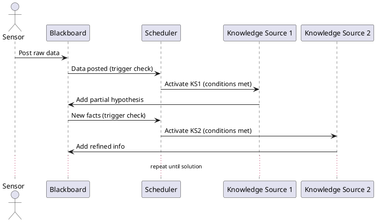

Great. I’ll write an executive overview titled **“Blackboard Architecture: Opportunistic Problem Solving with Shared Knowledge Space”** tailored to intermediate-to-advanced software engineers preparing for system design interviews.

It will:

* Use narrative, problem-solution storytelling.
* Explicitly cover all 12 specified technical points.
* Include a TL;DR, a `plantuml` diagram showing data flow and scheduling, and finish with concise key takeaways.

I’ll get started and let you know when it’s ready.

# Blackboard Architecture: Opportunistic Problem Solving with Shared Knowledge Space

**TL;DR:** *The blackboard architecture is a problem-solving design where independent expert modules (“knowledge sources”) collaborate by reading and writing to a shared memory (the “blackboard”). A control mechanism schedules these contributions opportunistically based on the evolving state, enabling dynamic, non-sequential solutions to complex problems that defy fixed pipelines or simple rule-based approaches.*

## From Hearsay-II to Sensor Fusion – Origins of the Blackboard Pattern

The blackboard architectural pattern emerged in the 1970s from early AI systems that needed to integrate **multiple forms of expertise** to solve hard problems. A classic example is the **Hearsay-II** speech understanding system (developed 1971–1976), often cited as the first blackboard system. Hearsay-II had to convert noisy audio into text, a task requiring many specialized analyses (acoustic, phonetic, linguistic) that could not be arranged in a strict linear pipeline. Instead, it used a shared knowledge base where hypotheses (sounds, phonemes, words, etc.) at various abstraction levels were posted and refined opportunistically. Another early adopter was the **HASP** project for passive sonar/radar signal interpretation in anti-submarine warfare. HASP fused continuous sensor signals from hydrophones by letting different signal-processing experts contribute partial interpretations on a common blackboard. These systems demonstrated that when a problem spans **multiple domains of expertise, requires different data representations, and has no predetermined control flow**, a blackboard approach can outperform rigid pipelines or standalone rule engines. Unlike a simple production-rule engine, which fires rules on a working memory, a blackboard system can host *heterogeneous* knowledge sources (from heuristic rules to complex algorithms or even neural nets) all cooperating via a **global store**. The blackboard excels when *no single fixed sequence* of steps can reliably produce a solution – it allows **opportunistic reasoning**, letting the data “drive” which expert runs next. This flexibility was key in Hearsay-II and sensor fusion: whenever new evidence appeared (a possible phoneme, a radar blip), *whichever* knowledge source was best suited could jump in, rather than following a predetermined chain.

## Core Components: Blackboard, Knowledge Sources, and Control Shell

Every blackboard system has three core parts:

* **The Blackboard:** a **shared repository** of information – the global data store where the problem’s state is collectively represented. All partial inputs, hypotheses, intermediate results, and the current best solution live here. The blackboard is often structured in **levels** corresponding to different stages of problem abstraction (e.g. signal level → feature level → decision level). For example, in a speech or sensor fusion system, the lowest level might hold raw input data, higher levels hold processed features or partial patterns, and the top level holds the final solution hypothesis. This layering lets knowledge sources focus on specific “strata” of the problem – one might specialize in cleaning raw data, another in assembling low-level clues into higher-level hypotheses. The blackboard is essentially a **global, evolving database** of the solution state, accessible to all knowledge sources.

* **Knowledge Sources (KS):** the independent specialist modules (akin to virtual experts or agents). Each KS encapsulates specific expertise or an algorithm for part of the problem. For instance, one KS might detect phonetic segments from audio, another might match words to a lexicon, another might apply grammatical rules – or in a sensor fusion scenario, one KS tracks radar blips, another correlates them with known flight paths. Crucially, KSs are **decoupled** – they don’t call each other directly. Instead, they communicate only through the blackboard: each KS **watches** for certain patterns or changes on the blackboard that fall in its domain, and when its trigger conditions are satisfied (e.g. “there is an unclassified signal segment of type X”), it awakens to contribute. KSs can both read and post data on the blackboard, incrementally contributing to the collective solution.

* **Control Component (Scheduler/Arbiter):** the moderator that **orchestrates the problem-solving process**. Because all KSs are watching the same blackboard, there must be a control mechanism to decide *which* KS gets to act next (to avoid chaos akin to many people grabbing the chalk at once). The control shell monitors the blackboard for new or changed data, figures out which KSs are *eligible* to run (whose conditions match the current state), and then uses some strategy to pick the most appropriate next KS to execute. This scheduling may involve an **agenda** or queue of pending KS actions, often prioritized by heuristics. The control is what allows the system to be **opportunistic** instead of strictly sequential – at any moment, it can choose the KS that offers the best progress given the current state on the board.

## Blackboard Levels and Evolving Hypotheses

A distinguishing aspect of blackboard design is organizing the blackboard into **multiple levels of abstraction** or states. Think of these as tiers where the solution is **gradually refined**. For example, a speech-understanding blackboard might have levels for: raw acoustic signal → spectral features → phonemes → words → parsed sentence. A multi-sensor tracking blackboard could have levels like: raw sensor detections → clustered object tracks → fused multi-sensor track → classified target. Each level builds on the ones below it. Early blackboard systems formalized this as a hierarchy from “level 1” (raw input) up to “level n” (final solution). Knowledge sources will typically focus on transitions between levels – e.g. one KS might take data from level 1 to hypothesize something at level 2. The blackboard thus holds a **spectrum of hypothesis states**: from unprocessed data, to partial inferences, up to completed solutions. This structure not only mirrors how complex problems are solved in stages, but also helps manage **KS scope** – each KS can post its results at the appropriate level. It also aids the control strategy, which can prioritize higher-level hypotheses or detect when the solution is converging.

All data on the blackboard is usually time-stamped or versioned, and may carry **credibility scores or labels** to indicate confidence (e.g. Hearsay-II assigned credibility to each hypothesis). As the solution evolves, some hypotheses will be confirmed and others discarded. A well-designed blackboard will have mechanisms to mark or remove hypotheses that have been superseded or proven incorrect, preventing clutter. This multi-level, multi-state memory is what enables incremental refinement – a hallmark of blackboard problem solving.

## The Opportunistic Control Loop

Unlike a linear pipeline, the blackboard control loop is **event-driven and dynamic**. It can be summarized as a repeating observe–decide–act cycle managed by the control component. Here’s how it typically works, illustrated in a sequence diagram:

**Event Posting:** The loop starts when either an external input arrives (e.g. a sensor posts new data to the blackboard) or a KS posts a new fact/hypothesis. This **blackboard update is treated as an event**. The control component’s **monitor** notices the change and immediately checks which KSs have their trigger conditions satisfied by the new or updated data. In essence, each KS subscribes to certain patterns; when the pattern appears on the board, the KS becomes **enabled** (eligible to run).

**Agenda and Eligibility Tests:** In non-trivial cases, multiple KSs may become enabled at once (or a single KS might be enabled in multiple distinct ways). The control component then places all these *candidate actions* onto an **agenda** (a queue or list of pending KS activations). Each agenda item typically records which KS to run and on what data or hypothesis (e.g. “KS2 could run to refine hypothesis H at level 2”). At this point, the system must resolve **conflicts**: deciding which KS from the agenda should run *next*. This is where **dynamic prioritization** comes in. The scheduler might assign a priority or rating to each enabled KS based on factors like the **importance of the data** it would process (e.g. working on a top-level hypothesis might be higher priority than a low-level one), the **credibility or cost** of the inference, deadlines or time stamps (e.g. focus on the most recent data), or domain-specific heuristics (perhaps certain knowledge sources generally produce more promising results). Some blackboard systems use a simple rule like “always advance the most highly developed hypothesis first” while others use sophisticated control knowledge to choose the best KS. The key is that this decision is made *opportunistically* based on the current context – not a fixed order. In effect, the control is performing a kind of *meta-reasoning* or *focus of attention*.

**Execution and Scheduling:** Once a KS is selected from the agenda, the control component **invokes** it (often by calling a procedure or sending a message). The chosen KS then runs **concurrently** (if multi-threading is allowed) or effectively atomically (if single-threaded control) to perform its specialized computation. It may read various facts from the blackboard (the data it needs) and then post its results back to the blackboard. This posting of new or modified facts *in turn generates new events*, and the cycle repeats: newly enabled KSs are identified, added to the agenda, prioritized, and one chosen to execute next. This loop continues until some termination condition is met – typically when a complete solution at the highest level is achieved, or no KS can make further progress.

Notably, blackboard control is often described as **data-driven or opportunistic** control. There is no predetermined sequence of which KS runs after which; at each step, *the current data state dictates the next best action*. This allows the system to nimbly handle unexpected situations or partial solutions out of order. For example, if a high-level hypothesis suddenly becomes plausible early (skipping some intermediate steps), the system can jump directly to refining or verifying that hypothesis rather than slavishly executing a preset pipeline.

**Conflict Resolution & Strategies:** When many KSs vie for execution (the “conflict set”), the control shell’s strategy is crucial. Different blackboard implementations have tried different strategies, from simple static priorities (each KS has a fixed priority) to dynamic rating by heuristic scores. Some systems allow **goal-directed influence** on the control – for instance, a high-level goal can bias the scheduler to prefer KSs that advance that goal. Others implement *meta-knowledge* as separate knowledge sources that advise the scheduler (as in BB1, a blackboard system that had meta-level control KSs). Regardless of method, the aim is to resolve conflicts in a way that yields rapid convergence and avoids “thrashing” (frequent context-switching without progress). Thrashing can happen if the scheduler alternates between competing hypotheses or tasks without giving any one enough time to mature – good control heuristics mitigate this by recognizing when to stay focused versus when to shift attention.

## Opportunistic vs. Sequential Processing

Blackboard systems thus embody **opportunistic problem solving**: at each iteration, the next step is chosen based on current opportunities (partial results available), not a predetermined sequence. This is in contrast to **sequential pipelines** where processing follows a strict order regardless of intermediate outcomes. Opportunistic processing is powerful for problems that are **non-deterministic** or **ill-structured**, where you may not know in advance which approach (or ordering of approaches) will succeed. For example, in Hearsay-II, sometimes a strong top-down expectation (like a known phrase) could drive interpretation even when bottom-up acoustic evidence was weak – the blackboard allowed the system to skip ahead and fill in likely words, then go back to confirm sounds, a highly opportunistic (and effective) tactic. A sequential system would not allow such back-and-forth.

Rule-based expert systems (production systems) also perform dynamic conflict resolution (the **recognize–act cycle**), and in fact blackboard architecture can be seen as a generalization that supports more diverse representations and loosely-coupled modules, not just rules. Blackboard’s advantage is the **common global store** that multiple sources read/write, enabling richer collaboration than isolated rule firings. It also accommodates *multiple strategies simultaneously*: e.g. one KS might be hypothesizing forward from data, while another works backward from an expected goal, meeting in the middle on the blackboard. This mix of data-driven and goal-driven (forward/backward reasoning) is naturally supported in a blackboard, whereas a pure rule engine or pure pipeline tends to commit to one direction. In summary, opportunistic control brings **flexibility**, at the cost of a more complex control mechanism to manage the chaos.

## Concurrency and Distributed Blackboards

Early blackboard systems were often implemented on single processors with one KS active at a time, but modern needs push for **concurrency** and distribution. In principle, multiple independent KSs could run **in parallel** if they operate on different parts of the blackboard. For example, two vision analysis KSs might process separate image regions simultaneously. However, concurrency introduces issues of **consistency**: if two KSs try to update the same data or related hypotheses, their actions must be synchronized. One approach is to partition the blackboard data and use **locking** per partition (or per level) – e.g. each “bucket” or level on the board has its own lock, so KSs writing to different levels can proceed in parallel, but if they target the same level, one will block. Fine-grained locks (per data item or hypothesis) are another approach, though they add overhead and complexity (risk of deadlocks, etc.).

Another strategy is **copy-on-write (COW)** or transactional updates: a KS works on a private copy of relevant blackboard section and when it’s done, attempts to merge its changes. If the underlying blackboard has changed in the meantime, the changes might be reconciled or even discarded (similar to how modern databases handle transactions or how Git handles merges). This can allow optimistic parallelism without locks, at the cost of possibly wasted work if conflicts occur.

In distributed settings (multiple machines), one can either have a single logical blackboard accessible over a network, or **partition the blackboard** across nodes. Partitioning can be by function or by data domain – for example, in a large multi-sensor fusion system, you might have a separate blackboard (or a partition of a global blackboard) per geographic region or per sensor type. Each partition handles local hypotheses, and a higher-level fusion process merges insights from all partitions. This improves scalability by limiting communication and focusing each node on a subset of the problem. Some systems implement a **distributed blackboard** where each node’s local blackboard syncs certain information with others (often using an eventual consistency model – updates propagate to other nodes in the background). Ensuring **consistency across nodes** can be challenging; strategies include master-slave architectures (one node is authority for certain data), distributed consensus for critical decisions, or simply accepting slight inconsistencies that correct over time (acceptable in some AI applications).

**Multi-threaded KS execution** is common in modern designs – for instance, if one KS is waiting for a slow I/O or a long computation (like a deep neural network inference), other KSs can run in parallel on other CPU cores or accelerators. This requires the control component to be thread-safe and possibly to manage a thread pool or dispatch events asynchronously. Concurrency can dramatically speed up solving by utilizing all available resources and not idling while one knowledge source works.

**Synchronization mechanisms** (beyond locking) might include using a **blackboard update queue** – where KSs post *intentions* to change the blackboard, and a coordinator serializes the actual commits (thus the blackboard state changes in a controlled order even if KSs run in parallel). There are also architectures where each KS is an **agent** that communicates through a tuple-space (like the Linda coordination language) – a tuple-space is akin to a blackboard where reading and writing tuples is atomic, often simplifying concurrency at the cost of expressiveness.

## Scaling Considerations

When scaling a blackboard system to larger problems or higher throughput, a few techniques are employed:

* **Partitioned or Hierarchical Blackboards:** As mentioned, dividing the blackboard into segments can confine the scope of each KS and reduce contention. A hierarchical blackboard might have a top-level board that receives coarse results from several lower-level boards (each of which might itself integrate multiple KSs). This looks like a tree of blackboards, each solving part of the problem, feeding upward. Partitioning can also be horizontal: if many similar tasks need to be solved (say multiple independent instances of a problem), you could spin up multiple blackboard instances (shards) each handling a subset of tasks, possibly with a load-balancer directing inputs to the right shard.

* **Sharded KS Pools:** If certain knowledge sources are in heavy demand, you can maintain **multiple instances** of them running concurrently. For example, if KS1 (image recognizer) is the bottleneck, run a pool of KS1 workers so multiple images can be processed at once. The scheduler can dispatch tasks to any free worker implementing that KS. This introduces complexities (ensuring two workers don’t duplicate effort on the exact same data), but can greatly improve throughput for independent tasks.

* **Hardware Offloading:** Some KS computations can be offloaded to specialized hardware – GPUs for image processing or neural network inference, FPGAs for signal processing, etc. In a modern blackboard system, one could integrate this by having a KS that is essentially a wrapper for a GPU kernel or an ML model. The KS activation might involve sending data to the GPU and getting results back. Offloading heavy tasks frees the CPU for other KSs and can speed up particular algorithmic bottlenecks. For instance, an object recognition KS using a deep network could run 10x faster on a GPU than CPU, thus not holding up the agenda queue as long.

* **Memory and Storage Scaling:** A single-machine blackboard might run out of memory if it tries to hold too many hypotheses (e.g., in very large search spaces). Scalable designs may employ a persistent store or database for the blackboard, allowing more data than fits in RAM, or moving older hypotheses to disk. Caching strategies can keep the most relevant data in memory. In distributed blackboards, each node’s memory is effectively adding up, but then cross-node communication overhead becomes a factor.

* **Throughput vs Latency Tuning:** Depending on the use case, the blackboard control can be tuned for throughput (processing many tasks/inputs in parallel, as in a streaming data scenario) or for low latency on a single complex problem. For throughput, you’d favor more parallel KS execution, possibly batch processing of similar events, and sharding. For low latency on one problem, you’d focus on picking the best KS actions to reach a solution quickly, perhaps even disabling some less-critical KSs that might distract or overwhelm the agenda.

In all cases, scaling a blackboard system must preserve its core strength: the ability for any knowledge source to potentially contribute to any part of the problem. Partitioning or sharding should therefore be done along sensible boundaries (like independent sub-problems) to avoid cutting off needed interactions between KSs.

## Performance Knobs and Tuning

Complex blackboard systems can suffer performance issues if not carefully managed. Several **knobs** help tune performance:

* **Agenda Heuristics:** The order in which tasks are executed can make or break efficiency. If the scheduler’s heuristics are poor (say, always picking low-impact tasks first), the system might churn a long time. By tweaking heuristics – for example, giving preference to KS activations that significantly reduce uncertainty or that operate on higher-level hypotheses – one can speed up convergence. Some systems implement an *age-based* penalty (so items that sit too long on the agenda increase in priority) or *breadth-vs-depth control* (sometimes dive deep on one hypothesis, other times explore alternatives broadly). These scheduling policies can often be adjusted without altering the KS logic, making them a powerful lever.

* **Incremental Recomputation:** Whenever possible, KSs should work **incrementally**, not from scratch. The blackboard can support this by allowing KSs to subscribe not just to the presence of data, but to *changes* in data. For instance, if a KS has already analyzed part of a hypothesis, and only a small portion changed, it should only recompute that part. Caching intermediate results on the blackboard for reuse can save time (with proper invalidation when assumptions change). In essence, the blackboard can act as a memoization table for partial results.

* **Pruning Stale Hypotheses:** As new data arrives and certain possibilities become unlikely, the system should prune or archive those to reduce clutter. Stale or superseded hypotheses can lead to wasted KS activations (KSs might keep getting triggered on an old hypothesis that is no longer relevant). Many blackboard implementations periodically clean up: they might remove hypotheses below a confidence threshold, or that have been “dominated” by better hypotheses. Pruning not only saves memory but also reduces noise for the control component so it doesn’t spend time on low-value tasks. The challenge is to prune safely – one doesn’t want to prematurely delete something that could later become useful. Often a hypothesis will be marked inactive or deprecated (so KSs ignore it unless it gets revived by new evidence) rather than outright deleted, until we’re fairly sure it’s dead.

* **Concurrency Level:** Tuning how many KSs can run in parallel (if the system supports it) can impact performance. Too little parallelism underutilizes resources; too much parallelism can cause thrashing or excessive overhead (especially if KSs start contending for locks or overwriting each other’s work). Sometimes a controlled degree of parallelism (like up to N threads) is set based on empirical testing.

* **Focus Control:** Some advanced blackboard systems incorporate a **focus-of-attention mechanism** – essentially a way to limit which portion of the blackboard is “active” at a given time. By focusing on a subset of hypotheses or a specific level until some progress is made, the system avoids spraying effort everywhere at once. This can be implemented by temporarily raising the priority of all tasks related to a particular hypothesis or, conversely, delaying tasks that are outside the current focus. Proper focus can dramatically reduce unnecessary work (much like how a human problem-solver doesn’t try to solve every part of a puzzle simultaneously, but zeroes in on a promising area).

In summary, performance tuning in blackboards is about maximizing useful work (KS contributions that lead toward a solution) and minimizing overhead (redundant calculations, chasing unlikely possibilities, excessive context-switching). It often involves iterative refinement of the control strategy and careful analysis of where time and memory are being spent.

## Observability and Debugging the Blackboard

Blackboard systems can be **opaque and complex**, so observability is crucial. Because the solution emerges from many small contributions, developers need ways to trace and understand this emergent process:

* **Trace and Replay:** A common practice is to log every significant event: when a KS becomes enabled, when the scheduler picks a KS to run, what data was read/written to the blackboard, etc. This chronological log (a “blackboard trace”) can be replayed to **reconstruct the problem-solving process** after the fact. In debugging, one might replay a trace to see why the system made a certain decision (e.g. why did it choose KS1 over KS2 at time T). Some frameworks allow stepping through a trace in a viewer, essentially **time-travel debugging** the multi-agent process.

* **Knowledge Source Metrics:** Tracking each KS’s activity helps spot inefficiencies. For example, you can measure **KS hit/miss rates** – how often a KS ran and actually contributed something versus how often it ran and found nothing to do (perhaps because the triggering data was irrelevant). If a KS has a low yield (often activated without useful output), its trigger conditions might be too broad or its priority too high. Other metrics include average runtime of each KS, the backlog of pending KS activations (agenda length over time), and how frequently each level of the blackboard is updated. These metrics inform performance tuning (maybe a certain KS is the bottleneck, or a particular level is churning with too many hypotheses).

* **Hypothesis Evolution Timeline:** For critical hypotheses (especially at higher levels), it’s useful to visualize their evolution – when they were created, which KS refined them, how their confidence changed, and whether/when they were resolved or discarded. This can be presented as a timeline or tree. It provides an **explainability** aspect: one can answer “how did we arrive at this final solution?” by tracing the lineage of contributions on the blackboard. In domains like medical diagnosis or financial decision-making, such explanation is as important as the solution itself.

* **Monitoring and Alerts:** In a production system (say a real-time event processing pipeline using a blackboard), you’d also have monitors for abnormal conditions: e.g. if the agenda is growing without bound (possible thrashing), or a KS has not run in a long time (maybe it’s starved out), or the solution hasn’t converged in expected time. These can trigger alerts to operators or even automated mitigations (like resetting part of the blackboard).

* **Visualization:** Some implementations provide a GUI showing the blackboard’s content at various levels, possibly as a kind of whiteboard with annotations. Seeing the “state of the blackboard” at a pause can help developers and domain experts validate that the system’s reasoning makes sense (e.g. are there hypotheses that a human expert would also consider?). It can also reveal duplicate or contradictory hypotheses that slipped in.

Observability tools turn the blackboard from a black-box into a glass-box, which is essential for trust and for iterative improvement, especially when the problem solving doesn’t go as expected.

## Security and Data Integrity

In collaborative architectures like blackboard systems, **security** and **integrity** of the shared data are important, particularly if knowledge sources come from different teams or even different organizations (or if some KSs are less trusted). Key considerations include:

* **Access Control:** Not every knowledge source should necessarily see or modify everything on the blackboard. Large systems may implement **access control lists (ACLs)** or permissions per KS. For example, a KS that provides low-level sensor data might not be allowed to overwrite high-level hypotheses, or an external third-party module might be restricted to read-only access on certain sensitive data. By assigning read/write privileges carefully, the system prevents accidental or malicious tampering. Some blackboards partition the data not just for performance, but for security – e.g. segments of the blackboard that contain confidential information are only accessible to authorized KSs (ensuring, say, that a plugin from a vendor cannot exfiltrate data it shouldn’t see).

* **Data Sanitization and Validation:** Since multiple KSs write to the blackboard, the system should treat inputs defensively. A buggy or rogue KS could post malformed data that confuses others. Thus, the blackboard often includes a layer of **sanity checking** – e.g., validating that any new hypothesis or data item conforms to expected schemas or value ranges. If a KS posts something outlandish (like a negative time stamp, or a hypothesis at an impossible level), the control shell might reject it or flag it. This is akin to a shared database enforcing schema constraints.

* **Provenance and Audit Trails:** Each fact on the blackboard can be tagged with **provenance metadata** – which KS produced it, at what time, using what input data. This is valuable not only for debugging (as discussed in observability) but also for security auditing and trust. If a particular KS is later found to be faulty or compromised, one can trace all hypotheses that originated from it and review or purge them. Provenance tags also help implement **confidence aggregation** – you might trust a piece of data more if it came from two independent KSs that agree, or if it came from an especially reliable KS. In sensitive domains (military, finance), having a full audit of who contributed what to the final decision is required for accountability.

* **Integrity and Consistency:** The blackboard could implement transactions or use checksums/hashes to ensure that partial failures or network issues don’t corrupt the shared state. For example, if a KS crashes mid-update, the control might need to roll back that update to avoid leaving half-written state. In distributed blackboards, cryptographic hashes or signatures might be used so that receiving nodes can verify data wasn’t tampered with in transit.

* **Isolation of KS Execution:** From a security standpoint, each KS might be run in a sandbox or separate process, especially if they come from different sources. If a KS misbehaves (e.g., infinite loop or memory leak), the control shell can detect that it didn’t return in time and possibly terminate or restart it, without bringing down the whole system. Similarly, a sandbox can prevent a malicious KS from directly accessing system resources; it only communicates via the blackboard API.

In summary, while the blackboard model encourages open collaboration between knowledge sources, in practice a robust system puts **guardrails** on this collaboration. By doing so, it ensures that the benefits of sharing don’t come at the cost of security breaches or corrupted results.

## Modern Incarnations and Hybrid Systems

The blackboard concept, though born in early AI, appears today in various forms and combinations:

* **Behavior Trees with Blackboards (Robotics & Games):** In robotics (e.g., ROS 2) and game AI, **behavior trees** are a popular architecture for decision-making. Many behavior tree implementations include a component literally called a *blackboard*: a key–value store that all behavior tree nodes can access to read or write shared state. This is a simpler form of blackboard – usually there isn’t an active control shell arbitrating (the tree’s flow dictates execution), but the idea of a **shared knowledge space** for the behaviors echoes the blackboard pattern. It allows different behaviors to coordinate via shared variables (for instance, one behavior writes the current target location on the blackboard, another behavior reads it to decide where to navigate). The combination of a hierarchical behavior controller with a global blackboard marries deliberative structure with flexible data sharing.

* **Apache NiFi and Dataflow Systems:** Apache NiFi (and similar dataflow/ETL platforms) use directed graphs of processors to route and transform data. While primarily pipeline-oriented, NiFi’s **FlowFiles** (data packets) carry attributes that can accumulate as the FlowFile passes through various processors. This is conceptually akin to a blackboard in that multiple processors (knowledge sources) progressively annotate a shared data item (the flowfile) with additional information. NiFi’s design includes a centralized flowfile repository and provenance tracking, which parallels blackboard ideas (shared data, provenance, etc.). In cases where NiFi flows have loops or feedback, they essentially implement a blackboard-like iterative refinement. Other stream processing systems and complex event processing (CEP) engines in finance or IT security also follow a similar ethos: events are published to a common bus, multiple analysis modules contribute detections or enrichments, and a coordinator correlates them. While not always labeled “blackboard,” the pattern of **shared fact space + multiple analytic modules + orchestration** is present.

* **Ensemble Machine Learning Orchestrators:** In advanced ML deployment, one often combines multiple models or algorithms to improve results (ensembles, cascades, etc.). For example, an ensemble system might have different models analyzing different aspects of data (vision, language, etc.) and a meta-learner fusing their outputs. A rudimentary way to do this is sequentially (pipe data through each model). A more flexible way is blackboard-style: have a shared state (e.g. an in-memory data structure or database) where partial predictions are posted, and let specialized modules (could be model evaluators, feature extractors, etc.) pick up those partial results and contribute further (for instance, one model’s output triggers another model to run a refined analysis). Some cutting-edge AI systems, especially in research, use blackboard-like designs to orchestrate **AI agents or tools** working together on a task – for example, systems that decompose a complex query into sub-tasks solved by different models might use a shared memory to coordinate (OpenAI’s “tool use” frameworks can be seen this way).

* **Workflow Engines and Hybrid Integration:** Enterprise integration platforms (like NiFi, Apache Camel, or even rule engines like Drools Fusion) sometimes blend rule-based engines with shared working memory. A CEP engine in finance might use a shared **fact pool** where various rules (knowledge sources) insert insights (fraud alerts, risk indicators) and an agenda mechanism picks which rule to apply next – essentially a blackboard under the hood, optimized for event streams. Another example: ROS (Robot Operating System) itself has a “blackboard” concept in some of its planning systems, and the term is used in the context of **ROS 2 Behavior Tree** libraries as noted above.

* **Distributed Agent Blackboards:** Modern multi-agent systems sometimes use a blackboard or “tuple space” (like IBM’s TSpaces or JavaSpaces) for agent coordination. Agents post messages or partial solutions to a space, others respond – a direct parallel to the metaphor of experts around a blackboard.

* **Apache NiFi flowfiles and beyond:** (To elaborate slightly more on NiFi as it was explicitly mentioned) NiFi’s flowfile repository holds data that any processor in the flow can retrieve by following connections. While NiFi’s model is more static than a blackboard (the graph is fixed), advanced use can involve feedback loops and dynamic routing that effectively make the flowfile repository a communal knowledge store for the workflow. Additionally, NiFi’s **Provenance** feature, which tracks the history of each data object through the flow, is reminiscent of blackboard systems tracking hypothesis evolution (though for data lineage purposes).

In essence, the pure blackboard architecture is not as commonly referenced today, but its principles live on in many systems requiring **integrative AI and complex event processing**. Whenever you have multiple modules contributing to a shared understanding (with a need for dynamic control), you likely have a blackboard-like mechanism at work, whether it's called a “blackboard”, “world model”, “context store”, or simply a shared database with subscriptions.

## Pitfalls and Lessons Learned

Despite its power, the blackboard architecture comes with potential pitfalls:

* **“God” Controller Bottleneck:** The control shell (scheduler) can become a single-point bottleneck. If it’s too centralized or if every little change causes a flurry of scheduling decisions, the overhead can grow. In poorly designed systems, the controller can also become extremely complex (“a god class”) trying to encode all the heuristics, making it hard to maintain. Mitigation: distribute some control (e.g., hierarchical scheduling) or simplify by giving KSs more autonomy in scheduling themselves when safe.

* **Thrashing and Oscillation:** Without good control heuristics, a blackboard system might keep switching focus among competing hypotheses or subproblems, making little progress on each – a form of *agenda thrashing*. This typically happens if many KS activations have similar priority and the scheduler cycles through them, or if new data constantly interrupts ongoing analysis. Mitigation: implement commitment strategies (stick with a hypothesis for a minimum time), or use state to detect oscillation and break the tie (e.g., randomly choose one path to pursue more deeply).

* **Over-Granular Knowledge Sources:** If the KS modules are too fine-grained (each doing a tiny piece of work), the system spends more time in overhead (scheduling, context switching, communication) than doing useful computation. The ideal granularity is coarse enough that each KS activation makes meaningful progress, but not so coarse that opportunities for parallelism or specialization are lost. Designing the “right” granularity is more art than science – it often requires iteration.

* **Unbounded Hypothesis Growth (Memory Blow-up):** A naive blackboard might keep every hypothesis ever generated. In complex problems, this can explode memory usage and slow everything down (search space explosion). If old or unlikely hypotheses aren’t pruned, the blackboard becomes cluttered with noise, making it harder for KSs to find useful info and for the control to make decisions. Always incorporate mechanisms to prune or archive hypotheses that are no longer promising, and to merge equivalent ones (to avoid combinatorial explosion of duplicate hypotheses).

* **Complexity of Implementation:** Blackboard systems are inherently more complex to build and tune than straightforward pipelines. The interplay of KS triggers, control logic, and shared data can lead to bugs that are hard to reproduce (timing-dependent issues, subtle conflicts). If not carefully architected, a blackboard project can become an “over-engineered” solution where a simpler design might have sufficed. It’s important to ensure that the problem truly warrants a blackboard (usually, it’s justified by very high uncertainty or need for integrating very diverse expertise).

* **Debugging Difficulty:** Even with good observability, debugging a distributed, concurrent blackboard with a lot of moving parts is challenging. Engineers must be prepared for a steep learning curve to trace emergent behaviors.

* **Maintenance and Evolution:** As new knowledge sources are added over time, the control strategy might need retuning. The system’s performance could degrade if new KSs conflict with old ones. Without clear modular separation (e.g. well-defined interfaces for KS triggers and contributions), the blackboard can turn into a tangle of interdependencies. Thus, governance of the blackboard content and KS roles is important as the system evolves.

Despite these pitfalls, when applied to the right kind of problem – complex, multi-disciplinary, and dynamic – the blackboard architecture provides a **robust framework for cooperative problem solving**. Its longevity from the 1970s to now is a testament to the power of the metaphor: a shared blackboard where minds (human or software) convene to solve what none could solve alone.

## Key Take-aways

* **Opportunistic Problem Solving:** Blackboard architecture enables dynamic, data-driven control – knowledge sources act when the “opportunity” (relevant data) appears, not in a fixed order, making it ideal for ill-structured problems.
* **Core Triad:** Every blackboard system consists of a **global data store (blackboard)**, multiple independent **knowledge sources**, and a **control mechanism** that schedules KS execution, analogous to experts collaborating with a moderator.
* **Incremental Refinement:** Solutions emerge in layers on the blackboard – from raw inputs to partial hypotheses to final answers. KSs contribute to different levels, gradually building and refining shared hypotheses.
* **Control Loop Mechanics:** A monitor-detects-change → KS-triggering → agenda-prioritization → KS-execution cycle repeats continually. Conflict resolution and intelligent scheduling of KSs (via heuristics or control knowledge) are crucial to performance.
* **Concurrency and Scaling:** Blackboard systems can exploit parallel KS execution but must manage consistency (via locks, transactions, or partitioning). Partitioned blackboards and distributed designs allow the architecture to scale to big problems or high data rates.
* **Modern Usage:** Variants of the blackboard concept appear in modern robotics (behavior tree blackboards), data integration (NiFi flowfiles), complex event processing in finance, and AI model ensembles – wherever diverse processes share state and collaborate.
* **Tuning & Maintenance:** Performance can be tuned through smarter scheduling (agenda management), pruning of stale data, and focusing of attention. High observability (traces, metrics) is needed to debug and optimize the emergent behavior. Security measures (ACLs, provenance) guard the integrity of the shared knowledge space.
* **Avoiding Pitfalls:** Successful blackboard implementations avoid controller bottlenecks, prevent thrashing by using strong heuristics, choose appropriate KS granularity, and implement memory management for hypotheses. The architecture should be used when the problem complexity warrants it, not as an over-engineered solution to simpler tasks.
