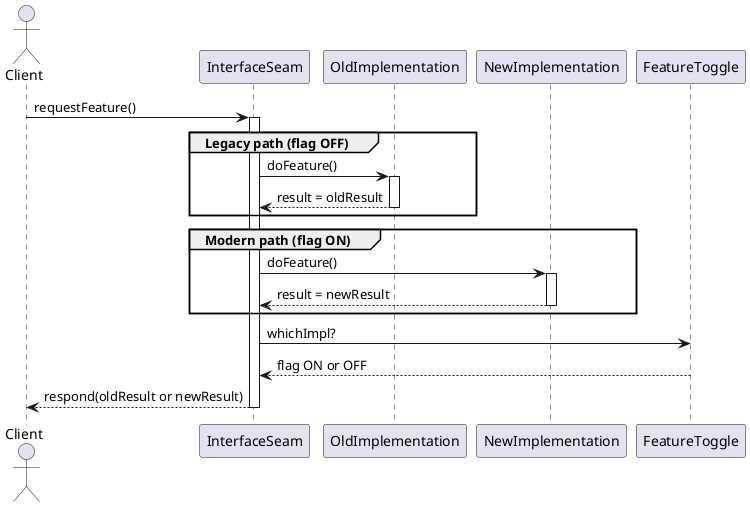

Got it. I’ll draft an executive overview titled **“Branch-by-Abstraction: Replacing Code Safely Behind a Stable Contract”**, designed for intermediate-to-advanced engineers preparing for system design or refactoring interviews.

It will follow a problem-solution storytelling format, hit all 12 key bullets, include a TL;DR and a PlantUML sequence diagram, and conclude with a set of key takeaways. I’ll let you know as soon as it’s ready.

# Branch-by-Abstraction: Replacing Code Safely Behind a Stable Contract

**TL;DR:** Branch-by-Abstraction is a refactoring strategy to replace major code components incrementally without long-lived feature branches. It works by introducing a stable *abstraction seam* (interface or facade) that routes calls to either the old or new implementation. Using feature flags, both implementations can run in parallel, allowing gradual rollout, testing, and safe fallback until the old code is retired.

## Why Avoid Long-Lived Branches? (The Problem)

Merging a long-running feature branch back into main can be a nightmare. The older a branch gets, the more it drifts from the mainline, leading to *“merge hell”* where conflicts and duplicated work abound. Integration is delayed, so bugs surface late and team collaboration suffers. In continuous integration (CI) environments, having code sit stagnant on a separate branch is untenable – by definition, code on a feature branch isn’t integrated and can’t be continuously tested or released. The pain of massive last-minute merges and release risk is why teams seek alternatives. **Branch-by-Abstraction** addresses this by keeping development on trunk (mainline) and avoiding long-lived divergence, thus eliminating big-bang merges. It lets you deliver value and refactor simultaneously, preserving a releasable state at all times.

## Core Anatomy of Branch-by-Abstraction

At the heart of this pattern is an **abstraction seam** – typically an interface, adapter, or facade – that acts as a stable contract between the rest of the system and the component being replaced. All callers are refactored to call this abstraction instead of the old implementation. The existing logic becomes one implementation of the interface (the “old” path), and the new logic is developed as another implementation (the “new” path) behind the same interface. This allows *multiple implementations to coexist* in the codebase safely. A **runtime selector**, often a feature flag or configuration toggle, determines which implementation is actually used for any given call. In effect, the system *branches by abstraction* instead of by source control: you have two codepaths in one codebase behind one contract.

In the sequence above, a client’s request goes into the **abstraction seam**, which can invoke either the old or new implementation (or even both in a shadow-test mode) based on a feature flag. The rest of the app is unaware of which implementation is serving the request – it only knows the stable interface contract. This indirection and control point is what makes branch-by-abstraction powerful: you can switch implementations without changing the callers.

## Migration Workflow: Safe Replacement in Phases

Branch-by-Abstraction provides a stepwise workflow for migrating from the old code to the new behind the scenes:

1. **Insert an Abstraction Layer:** Wrap the existing component with a new interface or facade. All callers are refactored to call this abstraction (with behavior initially delegating 100% to the old code). This maintains existing functionality and keeps the build green.
2. **Build the New Implementation:** Develop the new component (or system) that conforms to the same interface. Initially, keep it “turned off” or unused in production; it can live in the codebase behind a feature flag that defaults to off. Both old and new implementations now compile in the project, but only the old is active.
3. **Dual Run and Gradual Switch:** With both implementations available, begin shifting traffic gradually from the old to the new. This can happen in small increments – for example, route a tiny percentage of requests or specific user cohorts to the new path while others still use the old. Over time, increase the new path’s share. During this phase, you might also run both in parallel (see **verification mode** below) to compare outcomes. The abstraction ensures *all* calls – whether served by old or new – go through the same seam.
4. **Delete the Old Implementation:** Once the new code has proven itself (it’s handling 100% of live traffic with satisfactory results), remove the legacy implementation from the codebase. At this point the abstraction simply delegates to the new code for all calls.
5. **Collapse the Abstraction:** If the abstraction layer was purely transitional and adds unnecessary indirection now, you can remove it, having the callers call the new implementation directly. (In some cases, teams choose to keep the interface for modularity, but it’s no longer a toggle point.)

Throughout this process, the application *stays in a runnable, deliverable state* – you could ship to production at any time, even mid-refactor. The code with an inactive new implementation is still stable and passes tests, so regular releases can continue. This is a key benefit: **“your code is working at all times throughout the re-structuring, enabling continuous delivery”**.

## Feature Toggle Strategies for Switching

A critical enabler of branch-by-abstraction is the use of feature toggles (feature flags) or other conditional switches to control which implementation is in use. There are a few strategies for these toggles:

* **Compile-time or Launch-time Flags:** In some cases, the choice of old vs new can be made at build or startup (for example, using dependency injection to bind the interface to one implementation or the other at app initialization). This approach keeps runtime overhead low – the decision is fixed for that deployment. It’s useful if you can afford to deploy separate versions for testing new code, but it’s less flexible for gradual rollout.

* **Runtime Feature Flags:** More commonly, a runtime flag controls behavior on each call or each user session. This could be a simple config check (`if flagEnabled then newImpl else oldImpl`). Runtime flags allow dynamic toggling without redeploying. They support **percentage rollouts** and **targeted cohorts**: e.g., enable the new implementation for 5% of users, or only for internal testers, then ramp up if all goes well. This gradual exposure mitigates risk – if a bug appears, you can flip the flag off or dial back the percentage immediately.

* **Canary Releases and Cohorts:** One strategy is to do a canary release of the new implementation on a single server or a small subset of the environment while the rest continue on the old code. This isolates potential failures. Similarly, you might enable the new path for specific user groups (beta testers, or employees) first to get real usage data with limited blast radius.

* **Dark Launch (Shadow Mode):** In a *dark read* or *shadow traffic* scenario, the system processes calls through both implementations, but only the old result is returned to the user. The new implementation runs “in the dark,” either logging its outputs or writing to a shadow datastore. This lets you compare outcomes without impacting users. For example, you might log any differences between the old and new results for the same input. This is sometimes called **verify mode** – the feature flag triggers a *verifying implementation that calls both components with the same inputs and fails fast (or logs differences) if outputs diverge*. Running dual paths in production for a short period provides high confidence that the new code matches the old code’s behavior (and performance) before you fully cut over.

Each toggle strategy has trade-offs. **Compile-time switches** are simpler but inflexible. **Runtime flags** give fine-grained control, at the cost of additional conditional logic in code. Regardless of approach, feature flags in branch-by-abstraction are meant to be **temporary** – they are scaffolding to support the migration. Once the new implementation is fully deployed, the flag and old code are removed together.

## Data Consistency Considerations

Replacing a component often involves data. Perhaps you are migrating to a new database or service with its own data store. In such cases, running old and new in parallel raises the question of data consistency:

* **Dual-Writes:** If both old and new systems need to stay up-to-date, you might perform dual-writes – updating both the legacy datastore and the new datastore for each change. This keeps data in sync but beware of the infamous *dual-write problem*: updating two systems atomically is hard. If one update succeeds and the other fails, you get inconsistent state. Solve this by using reliable messaging or retry mechanisms, or by treating one write as the source of truth and eventually reconciling the other.

* **Read-Repair and Shadow Reads:** During migration, you might route reads to the old system but have the new system also read the data in parallel (shadow read) to warm its caches and compare results. If a discrepancy is found or if the new store is missing some data, the system can perform a read-repair – fetching from the source of truth and fixing the new store in the background. This ensures the new implementation catches up with any data it missed while it was “dark.”

* **Eventual Consistency Safeguards:** Embrace eventual consistency techniques: for instance, use change-data-capture or event streams to feed changes from the old system to the new one. Implement monitoring to detect any data drift between systems. Before final cutover, do a bulk sync of any remaining data. The AWS guidance cautions that branch-by-abstraction isn’t trivial when data consistency is a major factor – you must design a plan for keeping two sources consistent or choose a cutover strategy (like a maintenance window) if dual operation is too risky.

In short, when data is involved, branch-by-abstraction requires additional work to prevent divergence. Many teams implement a **dual-write with verify**: writes go to both old and new, and the new system runs in read-shadow mode until it’s deemed consistent and correct, then it becomes primary.

## Testing Safety Nets

Robust testing is the backbone of safe refactoring. When two implementations are running, you need to ensure they meet the same *contract*. Several testing approaches help:

* **Golden Master / Approval Testing:** Create a battery of inputs (unit tests or system tests) that exercise the old implementation, and record its outputs – this is the “golden master.” Then run the same tests against the new implementation and compare results. Any deviation is flagged. This technique treats the old behavior as the specification. It’s especially useful when no formal requirements exist beyond “do what the old code did.” Approval testing frameworks can automate the diffing of outputs for large data sets or complex outputs.

* **Contract Tests:** Since both old and new code implement the same abstraction interface, you can write a suite of interface-level tests (akin to an abstract test class or interface compliance tests) that each implementation must pass. This ensures that for a given input, both versions produce valid results conforming to the expected contract (even if not byte-for-byte identical, they should meet the requirements). In microservices, consumer-driven contract testing plays a similar role if the change crosses service boundaries.

* **Dual-run (Shadow) Testing in CI:** As part of your continuous integration, you might include a phase where certain integration tests run both implementations side-by-side in memory and automatically compare outputs. This can be done with dependency injection: inject both versions and assert that `newImpl.calculate(x)` == `oldImpl.calculate(x)` for a variety of scenarios. This gives fast feedback if a code change introduces a behavioral difference. It’s essentially an automated form of the dark launching discussed earlier, but in a controlled test environment.

* **Regression and Performance Tests:** Ensure you have good regression test coverage before starting. As you swap pieces out, re-run your test suite frequently. Additionally, test non-functional aspects: is the new implementation as performant as the old? Does it handle error conditions gracefully? You might run load tests against both implementations (perhaps by toggling traffic or in separate environments) and compare metrics.

During the migration, testing should be continuous. In fact, branch-by-abstraction often encourages adding more tests: when introducing the seam, it’s a great opportunity to increase unit test coverage around the behavior being replaced. Those tests will then validate the new implementation as well, since it’s behind the same interface.

## Observability & Monitoring During Migration

Live observability is crucial when rolling out the new code. Since you can have both versions running, take advantage of that to monitor and compare:

* **Side-by-Side Metrics:** Instrument both the old and new implementations with metrics (latency timings, throughput, resource usage). While running in parallel, watch these metrics. The new system should ideally meet or exceed the old system’s performance. If you see, for example, that the new code’s response time is twice as slow, you might decide to hold rollout until it’s optimized. Similarly, track error rates. If the new path logs errors or exceptions, compare those to the old path’s stability.

* **Diff Logging:** If using a shadow mode where both implementations process requests, log any differences in results. For instance, if old and new produce a slightly different recommendation or calculation, capture that in logs (with input details) for analysis. This acts like a real-time golden master test in production. It’s often wise to only sample a portion of traffic for detailed diff logging (to control log volume and overhead).

* **Alerting and Error Budgets:** Define acceptable error thresholds for the new implementation. Tying into the feature flag system, you might set up an alert if the new code’s error rate or latency exceeds a certain percentage of the old’s. This is essentially an error budget approach – if the new system starts “burning” through the error budget (indicating instability), your monitoring can automatically trigger a rollback (i.e. flip the feature flag off) or at least alert engineers to do so. Having quick rollback hooks (like the ability to instantaneously route all traffic back to the stable old path) is key to safe experimentation.

* **Tracing and Debugging:** Use distributed tracing or detailed request logging on both paths to pinpoint where any divergences occur. If a user transaction fails on the new path but succeeds on the old, a trace can highlight what the new code did differently. This level of insight is invaluable given that, by design, both implementations are supposed to fulfill the same function – any difference is a bug or an unconsidered scenario.

In summary, treat the migration like an A/B test experiment. You have control and visibility, so define success metrics (correctness, performance, etc.) for the new implementation and actively watch them. Observability ensures that you’re not flying blind when you “turn on” the new code for real users.

## Tooling and Automation Support

Branch-by-abstraction works best in a DevOps-friendly environment with strong automation. Key tools and practices include:

* **CI/CD Pipeline:** Continuous Integration is non-negotiable – every commit (including those that introduce the abstraction, add the new implementation, etc.) should trigger automated builds and tests. Your CI pipeline should build both implementations and run all tests to ensure nothing is broken at each step. Many teams add temporary tests during migration (like the dual-run tests mentioned) to catch discrepancies. Also consider adding static analysis checks to prevent use of the old APIs outside the abstraction. For example, one team set up a build breaker to fail if any developer accidentally writes a new call to the old database layer once the abstraction is in place – this ensures progress only goes in one direction (toward the new system).

* **Trunk-Based Development:** Branch-by-abstraction fits naturally with trunk-based development (TBD) and feature flag workflow. All work happens on the main branch behind flags, so maintaining coding discipline is crucial. Feature flags allow merging WIP code into trunk without activating it. Embrace short-lived branches (for coding tasks) that merge quickly into trunk behind a toggle, rather than one mega-branch that lives for weeks. Your source control strategy should support frequent merges and deployments.

* **Feature Flag Management:** Use a robust feature flagging system or library to manage the runtime toggles. This could be a commercial platform or an open-source library – important is that it allows dynamic toggling, user targeting, and metrics. Such platforms often provide dashboards to see which flags are active and for whom, and may support kill switches (to turn off a flag globally in case of emergency). They can also enforce governance like flag expirations. For instance, some systems let you set an automatic expiration date on a flag or notify when a flag hasn’t been toggled in a long time, to prompt removal.

* **Dependency Injection & Inversion of Control (IoC) Containers:** If your language supports dependency injection, leverage it. Configure the interface-to-implementation binding in one place. This makes it easier to swap implementations or even bind both (in a composite that calls both). Many frameworks allow conditional binding based on config, which can serve as your feature toggle. The **Dependency Inversion Principle** (DIP) is at play here – high-level code depends on the abstraction, not the concrete implementations. IoC containers or service locators can inject the desired implementation at runtime or startup, giving you a clean way to flip the switch across the app.

* **Continuous Delivery & Deployment:** With trunk-based development and feature flags, you can deploy changes continuously even if a feature isn’t finished. This decouples deployment from release. The new code can be deployed in an “off” state. Your CD pipeline should have automated tests to ensure that deploying with the flag off does not change behavior (the new code is truly quiescent and hidden). Then turning the flag on gradually *releases* the feature. This separation of deploy vs release is powerful: it means you can ship partial refactoring work without exposing it until ready.

* **Monitoring and Flag Analytics:** Integrate your feature flags with monitoring tools. Many feature flag platforms allow hooking into analytics – e.g., track performance for users who saw new vs old implementation. Automation can extend here: automatically halt rollout if metrics degrade beyond a threshold, etc.

* **Backlog Automation:** It’s wise to create automation or scripts to track flags and seams. For example, some teams tag each temporary flag with a JIRA ticket or owner and an “expiry” date. Your CI could warn if a flag has been alive too long. As one guide suggests, have a clear expiration policy and even limit how many flags can be active to reduce complexity. Managing these toggles and cleaning them up is as important as the code itself for long-term quality.

## Team Coordination and Governance

A successful branch-by-abstraction effort requires strong team discipline and communication:

* **Ownership of the Seam:** Assign clear ownership of the abstraction layer and migration process. This could be the team refactoring the component or a specific engineer acting as “flag bearer” for the change. They will oversee that all calls are rerouted to the abstraction, monitor progress on the new implementation, and coordinate the rollout. They’re also responsible for ultimately removing the old code. Code reviews should involve this owner to ensure nobody accidentally reintroduces calls to the deprecated code path or violates the intended boundaries.

* **Development Moratorium on Old Code:** Once you start migrating, make a rule: no new features or bugfixes are to be applied to the old implementation (unless absolutely necessary). Direct all such work to the abstraction or to the new path. This prevents the old and new from diverging in behavior during the transition. One quote encapsulates this discipline: *“never add to the old style of things... You can only ever reduce the count (of old usage) and not increase it.”*. If a hotfix must be applied to old code, ensure the equivalent fix is applied to the new code as well so they remain consistent.

* **Flag Life Cycle Policies:** Feature flags used for refactoring should be short-lived. Teams often establish a policy that any temporary flag must be removed within, say, one or two release cycles after the feature is done. Include flag cleanup in your Definition of Done. A “flag review” might be part of each sprint demo or release retrospective. Some organizations even track flag counts as a health metric. *Unmanaged flags can introduce cognitive load and code complexity*, so plan their retirement from the start. If you no longer need a flag (because the new implementation is fully rolled out), kill it and remove the conditional code. Leaving it “just in case” leads to clutter and confusion.

* **Code Reviews and Hygiene:** During the migration, code reviews should be extra vigilant. You’re essentially adding complexity (duplicate logic paths, conditional behavior) in the short term, which goes against the grain of simplicity. Reviewers should verify that new code under the flag adheres to the same contract as old code. They should also ensure tests cover both paths. Once the migration is done, do a cleanup pass: eliminate dead code, remove the abstraction if unnecessary, and generally refactor to simplify the codebase back to normal. It’s important to treat branch-by-abstraction as a temporary *detour* – the end state should be clean with a single implementation. Teams may institute a governance rule that any *branch-by-abstraction seam* comes with a planned removal task and perhaps a time limit to enforce that it doesn’t become a permanent fork in the code.

* **Communication:** Keep the whole team (and possibly stakeholders) informed of the plan. Everyone should know that a major change is happening behind a feature flag. This prevents surprises like another developer inadvertently working in the old code area or misunderstanding test failures (“why is this code running twice?”). Good communication ensures that parallel work streams don’t conflict. It might help to document the abstraction: e.g., in the README or architecture docs, note that module X is being replaced via interface Y, with flag Z controlling it.

Governance also involves knowing when to *not* use branch-by-abstraction. If the team cannot commit to cleaning up afterwards or if the effort is too large to manage safely even with flags, sometimes a short-lived fork or big-bang may be considered. But in most cases, careful coordination makes branch-by-abstraction a safer choice for large changes.

## Relationship to Strangler Fig and Feature Toggle Patterns

**Branch-by-Abstraction vs. Strangler Fig:** These patterns share the idea of incremental replacement but at different levels. The *Strangler Fig* pattern is typically applied at the architecture or service level – you gradually replace an old service or monolith by strangling it with a new system from the edges. Calls at the boundary (perimeter of the system) are redirected piece by piece to the new service. Branch-by-abstraction, in contrast, is usually applied *within* a codebase or application process, often to swap out an internal component or library. It’s “in-repo” and uses an abstraction in code, whereas Strangler Fig might use an API gateway, proxy, or routing rules to divert traffic.

The scope differs: strangler fig is great when you can intercept calls to the old system easily (e.g., all requests go through a facade where you can reroute some to the new system). Branch-by-abstraction shines when the thing you’re replacing is deeply embedded or has many upstream dependencies making it hard to peel off at the edges. In fact, you might use branch-by-abstraction *inside* a monolith to carve out pieces which you then *strangle* into microservices. They can work together: branch-by-abstraction can be the first step (making a component swappable via interface), and then strangler fig can be used to redirect certain functionality to a new microservice via that interface.

**Branch-by-Abstraction vs. Plain Feature Toggles:** Feature toggles (flags) are a more general technique to hide new features or control feature exposure at runtime. You can use feature toggles without creating an abstraction layer – for example, wrapping a new UI element in an `if (newFeatureFlag) { showNewButton() } else { showOldButton() }`. That works for simple cases but can get messy for large-scale changes affecting many parts of the code. Branch-by-abstraction goes further by introducing a formal interface and possibly duplicating significant code paths. It’s a development pattern that often leverages feature flags, rather than a competing approach. Martin Fowler distinguishes them: *feature toggles allow new features to be developed and hidden from users at runtime, whereas branch-by-abstraction is a way to do large refactorings on mainline* – often *combining* the two by using a feature flag to swap implementations under the hood.

In practice, branch-by-abstraction is a specialized use of feature toggles for internal rework. The pattern is sometimes called a **“feature toggle on steroids”** because you’re not just turning a feature on/off, you’re running two versions of an entire module side by side. This adds overhead but gives you the safety to do big changes in tiny steps. The **scope** difference is key: feature toggles can be as small as toggling a single button or logic branch; branch-by-abstraction typically spans a wide scope (e.g., replace an entire data access layer or engine) and thus requires a more structured approach (abstractions, parallel logic, etc.).

**Traffic Steering Differences:** With feature toggles or branch-by-abstraction, traffic steering is done in-code (via conditional logic or dependency injection). With strangler fig, traffic steering is often at the network or request routing level. For instance, a strangler might route certain REST endpoints to a new microservice and others to the legacy system. Branch-by-abstraction would likely handle the routing inside the app, perhaps in a function that decides which implementation object to call for a given operation. Both allow gradual shifts of traffic, but the mechanism differs (code flag vs. infrastructure routing).

In summary, strangler fig is about decomposing across service boundaries, while branch-by-abstraction is about large-scale refactoring within a codebase or single service. Feature toggles are a more granular mechanism that branch-by-abstraction uses to achieve its goal safely. All three aim to reduce risk by avoiding “big bang” changes, but they operate at different structural levels.

## Performance and Cost Overheads

One trade-off with branch-by-abstraction is the temporary overhead of running duplicate code paths. When both old and new implementations execute (especially in verify/dark mode scenarios), you are doing extra work. This can impact performance and cost:

* **Throughput and Latency:** If every request is processed twice (once by old, once by new), you’ve roughly doubled the compute cost for those requests. In a high-throughput system, you might not be able to afford running both for 100% of traffic. The solution is to *sample*: run dual processing for a small percentage of requests that are statistically significant enough to gain confidence, or enable shadow mode during off-peak hours. You can also mitigate impact by making the dual-run asynchronous (e.g., return response from old path immediately, but execute new path in parallel and log results). That way user-facing latency isn’t hit, though you still pay compute cost.

* **Resource Utilization:** The new implementation might use additional memory or other resources even when not actively in use (e.g. caching data, holding database connections). Monitor the overhead – in some cases you might keep the new code mostly idle (flag off) to minimize footprint until you start ramping it up.

* **Gradual Rollout to Limit Blast Radius:** From a cost perspective, ramping up slowly isn’t just about safety – it also spreads out the resource hit. If the new code is less efficient right now, rolling out to 10% of traffic means you only incur that inefficiency on 10% of load. You can optimize the new path as you increase the percentage. If you turned it on 100% instantly and it was twice as expensive per request, your infrastructure might fall over or your cloud bill might spike. Staged rollout pacing avoids unpleasant surprises.

* **Testing Overhead:** Running extra tests (like dual-run comparisons or extensive golden master suites) also has a time cost in CI. This is usually acceptable (it’s a short-term cost for long-term stability), but teams should be aware that build times or test execution times may increase temporarily during the migration. It’s wise to isolate heavy comparison tests to nightly builds or specific pipelines so that developers’ inner-loop (quick tests) aren’t overly slowed.

* **Maintenance Cost of Two Codebases:** There is also the human cost: for a while, developers must maintain two versions of the logic. This can double the work if changes occur. It’s critical to minimize how long this period lasts. The **Verify Branch-by-Abstraction** extension trades a bit more upfront maintenance for confidence – which is usually worth it, but it does mean more code to juggle. Keep the duration of parallel maintenance as short as practical. If done right, it’s a finite investment to avoid a catastrophic failure. As Steve Smith notes, there is *increased maintenance cost associated with managing multiple implementations for a period of time, but the preservation of release cadence and reduced risk makes it worthwhile*.

* **Selective Flagging:** You can choose to not expose the toggle to everyone. For example, guard it behind an environment variable that is only true in staging or for certain tenant accounts. This way, the dual-run or new implementation is only active in contexts you choose, limiting performance impact on general users until you’re ready.

In practice, the overhead of branch-by-abstraction is a calculated, temporary cost. It’s like scaffolding in construction – yes, it costs extra and looks redundant, but it supports safe rebuilding. To manage the cost, use targeted rollouts and turn off dual-processing as soon as you’ve gathered enough data. Also, design your flag system so you can disable the new path instantly if it overwhelms the system.

## Common Pitfalls and How to Avoid Them

Branch-by-abstraction is powerful but not foolproof. Watch out for these common pitfalls:

* **Forgetting to Remove the Seam:** It’s surprisingly easy to finish the migration and move on, leaving the abstraction layer or feature flag logic in place. This results in needless complexity (an extra indirection and dead code). “Zombie” feature flags that outlived their purpose clutter the codebase. Always schedule the cleanup tasks (removing flags, old code, and seams) as part of the migration’s story. Treat it with the same importance as the rollout. A flag that’s no longer needed is tech debt; if it’s simply forgotten, future devs may be confused by code that is always executing one branch of an if-statement that can never go the other way.

* **Flag Debt and Configuration Sprawl:** Using many feature flags or leaving retired ones around can create a maintenance headache. Each active flag increases cognitive load and the testing matrix (you should ideally test with it on and off). Limit the number of concurrent branch-by-abstraction efforts or feature flags in flight. If there must be several, clearly name them and possibly implement tooling to list all flags and their status. Perform periodic “flag bankruptcy” exercises to purge stale flags. A good practice is to mark each temporary flag with an expiry date or owner when introduced.

* **Divergent Behavior Between Old and New:** During the migration, the two implementations should ideally behave the same from a user’s perspective. But if the transition period is long, there’s a risk they drift. For instance, a developer might fix a bug in the old code but forget to apply it to the new code, or vice versa. A *long-lived dual system can suffer the same problems as long-lived branches!* As one engineer warns, *“if the feature is in development for a long time, a developer may accidentally change one code path without realizing there's another one that needs changing.”*. Mitigate this by keeping the parallel period short and by double-maintaining rigorously: any change to one path must be applied to the other. Code reviews should specifically catch this. Also, automated verify tests (comparing outputs) will quickly highlight if behavior diverges unexpectedly.

* **Test Flakiness from Dual Writes:** If you implement dual-writes or shadow reads, your test environment might sometimes see unexpected results. For example, your new component writes data and your test asserts it, but the old component was considered the source of truth and maybe overwrote it or the order of writes is indeterminate. Tests might need to be adapted to account for eventual consistency (e.g., waiting for asynchronous replication). Flaky tests can erode team confidence, so design your dual-write so that in test mode you perhaps turn off one of the paths to get deterministic outcomes, or use assertions that allow either outcome if both are acceptable. Another strategy is to test the new component in isolation with simulated data rather than in full dual-write mode for every test.

* **Big-Bang Release Disguised as Incremental:** A trap teams can fall into is doing all the work on the new implementation behind an interface flag (which is good), but then flipping the switch to 100% new in one go without a phased rollout. Technically, you avoided a long-lived Git branch, but you still did a “big bang” flip in production. If something goes wrong, you’re in firefighting mode (though you can toggle back, which is helpful). To truly reap the benefits, do a gradual rollout with monitoring. Sometimes deadlines or pressure lead teams to bypass the gradual approach – resist that if possible. The pattern’s safety comes from incremental exposure. If you just delay the big switch until later, you haven’t reduced risk, only postponed it. Use the feature flag’s flexibility: even if you’re confident, roll out the new implementation to 50%, then 100% over a short period while watching metrics, rather than 0% to 100% at once.

* **Premature Abstraction Generalization:** When creating the abstraction seam, keep it as narrow and focused as possible for the change at hand. A pitfall is over-engineering the interface to anticipate future variations. This can complicate your work. Remember, the abstraction might be temporary – you don’t need to make it a grand, generic interface for all time. It just needs to be sufficient to support both implementations for the migration’s duration. YAGNI (you ain’t gonna need it) applies here. A too-broad abstraction can slow down development and testing. Aim for a minimal viable abstraction.

* **Lack of Governance Leading to Partial Migrations:** In some cases, teams start a branch-by-abstraction but never complete it. They might switch some of the traffic to the new system, then get pulled onto other priorities, leaving a half-migrated state indefinitely. This is dangerous because you now have two code paths to maintain forever. To avoid this, treat completion (or at least a checkpoint) as a priority. If you must pause a migration, perhaps because the new implementation isn’t meeting expectations, then consciously roll fully back to the old (remove or disable the new) so you’re not stuck maintaining both. It’s better to abort cleanly than live with a limbo state. Ideally, secure leadership buy-in that refactoring work using this pattern is important to finish, because incomplete work can indeed become worse than doing nothing.

Done right, branch-by-abstraction yields a cleaner, more modern codebase with minimal user disruption. But it demands engineering rigor to avoid simply moving complexity around. Keeping sight of the end goal – retiring the old code – and having processes to get there are what separate a successful migration from a mess.

## Key Take-aways

* **Branch-by-Abstraction solves “merge hell”** by avoiding long-lived branches. All changes happen in main behind a stable interface, enabling continuous integration and delivery.
* **Three-part setup:** Introduce an abstraction seam, implement the *old* and *new* code behind it, and use a feature flag or toggle as a selector between them. This lets you swap or run implementations without affecting callers.
* **Incremental migration:** Gradually shift from old to new in small steps – you can even run both in parallel to verify behavior. Remove the old code (and the flag) once the new is fully vetted.
* **Feature flags are essential** to control rollout. They support partial launches (percentages, cohorts, canaries) and instant rollback. But they must be managed – retire flags and cleanup toggles once done to avoid tech debt.
* **Data consistency needs special care:** Consider dual-writes and shadow reads to sync data between old and new systems, and use eventual consistency patterns to reconcile differences. Monitor for any drift if both systems operate in parallel.
* **Robust testing and monitoring** underpin safety. Use golden master tests and contract tests to ensure new matches old outputs. In production, compare metrics and logs side-by-side; set up alerts to catch regressions early and enable fast fallback.
* **Tooling and CI/CD make it feasible:** Trunk-based development with CI, feature flag management, and automated checks (like preventing new calls to old code) are key enablers. Dependency injection and similar patterns help inject new vs old implementations cleanly.
* **Discipline is required:** Coordinate the team so that no one extends the old code during migration and everyone knows to use the abstraction. Plan the decommission of old code from day one. Without governance, you risk divergent behavior or leftover “scaffolding” in the code.
* **Strangler vs. Abstraction:** Use branch-by-abstraction for in-app refactoring where you can’t just route at the perimeter. Use strangler fig for splitting out services. Both aim for gradual change; branch-by-abstraction operates via internal interfaces, strangler via external routing. Both often utilize feature flags for controlling traffic.
