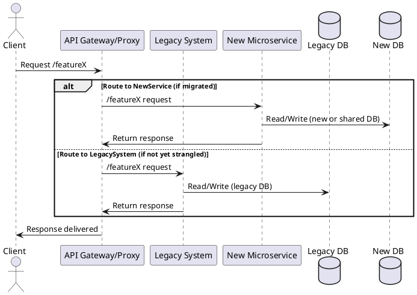

Great. I’ll write a 1,000–1,200 word executive overview titled “Strangler Fig Pattern: Incremental Decomposition Without the Big-Bang Rewrite,” tailored to intermediate-to-advanced software engineers preparing for system design interviews. It will follow a narrative, problem-solution structure and cover each of the required points including a PlantUML sequence diagram in a broader architecture context (not limited to REST).

I’ll let you know when the draft is ready for your review.

# Strangler Fig Pattern: Incremental Decomposition Without the Big‑Bang Rewrite

**TL;DR:** The Strangler Fig Pattern modernizes legacy systems gradually, like a vine overtaking a tree. Instead of a risky “big bang” rewrite, you peel off one feature at a time. A proxy routes some requests to new microservices while the rest still go to the old system, ensuring continuous operation. Over time the new system grows around the old, which is safely retired.

## Origin: A Rainforest Metaphor for Safer Modernization

In 2001, Martin Fowler hiked through a Queensland rainforest and noticed strangler fig vines enveloping host trees. The vine starts in the tree’s branches and slowly grows around the trunk until the original tree dies, leaving a fig shaped like the host. Fowler saw a powerful analogy: **gradually replace a legacy system** by growing a new system around it. He coined the “Strangler Fig Application” pattern (later refined to include “Fig” to emphasize the botanical metaphor) as an alternative to the **“big bang” rewrite** approach. The strangler fig pattern was popularized via ThoughtWorks and has since become a go-to strategy for legacy modernization. The **rainforest origin story** highlights *why incremental replacement beats wholesale rewrites*: big rewrites are tempting but notoriously risky. Entire rebuilds take a long time during which business needs keep changing and users must wait for improvements. Often the old system’s exact behaviors (and bugs) aren’t fully understood, so a clean-room reimplementation can miss subtle requirements or waste effort rebuilding obsolete features. By contrast, **a gradual strangler approach delivers value early and often**: you can release the first new component quickly and continuously improve, rather than waiting years for a complete replacement. This reduces risk and cost by avoiding the all-or-nothing gamble of a big bang rewrite. In short, Fowler’s strangler fig metaphor became a guiding light for modern architects: *evolve* systems safely instead of trying to replace them in one fell swoop.

## Core Anatomy of a Strangler Migration

At the heart of the strangler fig pattern are three key pieces working in concert:

* **The Legacy “Host” System:** The existing monolithic application (the “tree”) continues to run, providing all functionality initially. It is the system we aim to gradually replace, but we keep it operational throughout the migration.
* **The New “Strangler” Services/Modules:** These are the modern replacements (the “vines”) built to take over specific slices of functionality from the legacy system. Over time, more new services are added, each encapsulating a portion of what the monolith used to do. The new services might be microservices or modules in a new architecture, developed with updated tech stacks and best practices.
* **The Façade/Routing Layer:** A **proxy or API gateway sits in front** of both the legacy and new components, routing incoming requests to either the old or new implementation. This layer is the “traffic cop” that makes the coexistence transparent to consumers. It can be implemented as an API Gateway (e.g. Kong, NGINX, Amazon API Gateway) or an edge proxy service. In modern cloud setups, a **service mesh** (e.g. Istio or Linkerd) can also handle this routing internally. The facade ensures that as pieces of functionality migrate out of the monolith, clients still interact via a stable single endpoint or URL structure; the router hides whether a given feature is served by legacy code or a new service.

This intermediary “strangler router” is essential transitional architecture. It remains in place until the migration is complete, at which point the legacy system can be turned off. Below is a simplified sequence illustrating how a request flows through the proxy to either the legacy or new component, accessing either a shared database or separate databases for old and new systems:

In this way, the **proxy facade** directs each call to the appropriate implementation. Initially, almost all traffic goes to the legacy backend. But as new “strangler” services sprout, more requests get routed to new code, and the legacy system’s role diminishes until it’s entirely supplanted.

## Incremental Migration Workflow

The strangler fig approach follows a **repeating cycle** for each piece of functionality being migrated:

1. **Identify a Thin Slice:** Examine the legacy system and pick a slice of functionality to extract. This could be a specific feature, module, or business capability that can be isolated. It’s often wise to start with a relatively small, well-understood, and high-value feature—something that delivers business benefit but isn’t the most complex part of the system. For example, a read-only endpoint or a self-contained service is a good first candidate.
2. **Build the New Component:** Develop a new service or module that implements that slice’s functionality in the new architecture. This new component lives outside the monolith (or alongside, if in the same codebase with feature toggles) and is ideally built using modern tech and clean design. It should fulfill the same contract (inputs/outputs) as the old component (unless intentionally improving the interface) so that consumers can use it transparently.
3. **Introduce the Routing Layer (Seam):** Deploy or configure the facade layer (API gateway, proxy, etc.) such that it can divert traffic for the chosen functionality away from the monolith to the new service. This often means adding routing rules: e.g., if the request is for “/featureX”, send it to the new service, otherwise let it go to legacy. At first, this routing might be dark (testing only) and then activated for real users.
4. **Route Traffic to the New Service:** Once the new component is tested, start directing a portion or all of the feature’s requests to it via the proxy. Consumers should not notice a difference except for improvements. Gradually increase the traffic to the new service until it handles 100% of that slice. (Techniques for routing gradually are discussed in the next section.)
5. **Retire the Old Slice in the Monolith:** With the new implementation running successfully, the equivalent code in the legacy system is turned off or removed. Data or state owned by the old component may be migrated fully to the new system’s datastore at this point (if not done earlier). This reduces the monolith’s scope. The legacy system continues to operate for everything else, but it no longer needs to support that particular feature.
6. **Iterate for the Next Slice:** Repeat the cycle, selecting another piece of functionality to strangle next. Over many iterations, piece by piece, the new system grows around the old. The process is *incremental*: each slice delivers some value or risk reduction on its own, and the business gains confidence with each successful cutover.

This workflow ensures **continuous delivery of value**. Users and stakeholders see steady improvement rather than waiting for a big rewrite that “arrives” years later. At all times, there is a working system in production (combined legacy + new) so there’s a fallback if issues arise. Importantly, this approach *embraces change*: after each slice, plans can adjust based on what was learned, allowing flexibility if business priorities shift or if initial assumptions were wrong. Modernizing becomes a process of discovery and learning, not a blind leap.

## Finding the Right Slices: Decomposition Heuristics

A crucial (and hard) part of using the Strangler Fig pattern is deciding *how to break the monolith into pieces*. You want to carve out slices that are neither too large and risky nor so small that they provide no value. Here are some **heuristics for decomposition**:

* **Bounded Contexts / Domain Mapping:** Use Domain-Driven Design to map out the distinct *business domains or bounded contexts* in the system. These contexts often make natural candidates for services. If the legacy application was never cleanly modular, try to identify “seams” in functionality – places where you can separate a concern with minimal entanglement. For example, an e-commerce monolith might have clear domains like Product Catalog, Orders, and Payments. Each can potentially be extracted one by one. Aligning slices to business boundaries ensures each new module has a coherent purpose and reduces the chance of splitting what should remain coupled.
* **High-Churn or High-Pain Areas First:** Prioritize extracting components that **change frequently or cause the most pain** in the status quo. Parts of the system with constant new feature requests or recurring bugs (“high-churn”) are prime strangler targets. By carving those out early, you enable faster innovation in those areas (since they’ll be in a more agile service) and relieve pressure on the monolith. Similarly, features that are performance bottlenecks or scalability issues in the monolith could be tackled early if they can be isolated. The key is to get *quick wins* that demonstrate progress and yield immediate improvements for the business. However, balance this against complexity – don’t pick the absolute most mission-critical core function as your very first slice if it’s deeply intertwined with everything.
* **High-Risk or Complex Areas Last:** Conversely, identify parts of the system that are **very complex, risky, or tightly coupled** and save them for later in the migration. These might be things like critical transaction processing or core logic that every other module calls. Attempting to strangle these too early can jeopardize the entire effort. Instead, leave them until you have strangled surrounding features and gained experience. By the time you get to these hard parts, the legacy system will already be smaller, and you’ll better understand its quirks. In some cases, you might discover that some “high-risk” modules can even be *retired outright* if requirements have changed (e.g. nobody needs that old feature anymore), saving you the trouble of rebuilding them at all.
* **Goldilocks Scope:** Aim for slices that are “not too big, not too small, just right.” If you pick a slice that’s overly simplistic (too fine-grained), you might spend effort on something with little business value or end up doing a lot of slices to deliver a meaningful outcome. If you pick one that’s too broad (too many intertwined functionalities at once), the migration may bog down and start to resemble a mini big-bang. A good slice delivers a **complete, independent piece of business functionality** that stakeholders care about, but is scoped tightly enough that the team can implement and deploy it in a reasonable time frame (e.g. a few weeks or months). Use criteria like complexity, business value, and dependencies to evaluate candidate slices. Some teams use a **scorecard matrix** to rank potential thin slices against factors (e.g. effort, user impact, risk) to choose an optimal order.
* **Seams and Module Boundaries:** Look for natural seams: maybe the legacy app already has components or services that could be peeled off. For example, if the monolith calls an external module or has a clearly delineated layer (like a rules engine or a reporting component), those might be easier to extract first. In legacy codebases, sometimes hidden boundaries exist (e.g. a certain package or namespace handles one concern). Tools like static analysis, or simply reading the code and domain knowledge, can help find these potential slice boundaries. When domain boundaries are unclear, techniques like Event Storming workshops can help teams clarify the domain model and define service boundaries.

Ultimately, slice selection is part art and part science. Fowler notes that *breaking a big ball of mud into pieces is inherently tough*, since well-defined seams are rare in messy legacy systems. But using domain understanding and prioritizing by value and risk, you can choose a sequence of slices that gradually delivers modernization with minimal regrets.

## Smart Routing Strategies for Incremental Cutover

Once you have both the legacy and new implementations running, the **routing layer** decides who handles each request. Implementing flexible routing is critical for safe, incremental migration. A variety of **routing strategies** can be employed, often in combination:

* **URL Path–Based Routing:** The simplest approach is to route based on the request URL or API endpoint. For example, if the new service replaces the `/orders` endpoints, the API gateway can forward any `/api/orders/*` path to the new service, while all other paths still go to the monolith. Sometimes a versioned path is used: e.g. `/v2/orders` goes to the new system vs `/v1/orders` to legacy. Path routing is straightforward and works well when your slices align with distinct request patterns or resources.
* **HTTP Header–Based Routing:** A more granular method is to use custom headers or parameters to decide routing. For instance, a special header `X-Use-New: true` might signal the proxy to send the request to the new service. This can be useful for **feature toggles, A/B testing, or gradual rollouts**. Header flags allow you to route certain users or test clients to the new code while others stay on the old. It does require control over the clients (or at least the ability to insert the header via a gateway or test tool).
* **Canary Releasing (Percentage-Based Routing):** To gradually build confidence in a new component, you can do **weighted routing** where a small percentage of live traffic is directed to the new service initially. For example, start by sending 5% of requests for `Feature X` to the new service and 95% to legacy. If the 5% goes well (no errors, metrics look good), increase to 20%, then 50%, and eventually 100%. Service meshes like Istio support traffic splitting by percentage, enabling canary releases without client changes. This strategy mitigates risk by limiting blast radius – if something’s wrong in the new service, it only affects a small slice of users and you can quickly roll back to 0%.
* **Shadow Traffic (Traffic Mirroring):** In a **shadow deployment**, you **duplicate real user requests** and send the copies to the new service *in parallel*, without impacting the primary response. The user continues to get responses from the legacy system, but behind the scenes the same request is processed by the new service (its response is not returned to the user). This “dark launch” lets you validate the new service under production load and compare its behavior against the old system’s output. It’s a powerful way to catch any discrepancies or performance issues in the new code *before* routing actual user traffic to it. Shadow traffic is typically used in testing phases; once the new service proves itself (producing correct results and handling the load), you can move to canary or full cutover. Many companies (e.g. Facebook’s “dark launches”) have used this to test major rewrites.
* **Feature Flags & User Scoping:** Feature flag systems allow runtime switching between old and new code paths for particular features. For example, a configuration flag could make the monolith call out to the new service for certain operations. Flags can target specific user segments (beta testers, internal users) to try the new functionality. This is similar to header-based routing but often implemented at the application level. During strangulation, you might deploy the new service and have it disabled by default, then use a feature flag to enable it for a small group of users, gradually increasing. Feature flags provide a quick **rollback lever**—if an issue is detected, turning the flag off instantly reverts all users to the old system. They also facilitate testing in production with low risk.
* **Routing by Content or Request Attributes:** In some cases, routing can depend on request content or user identity. For instance, you could route all requests from a particular customer group or geographical region to the new service (to do a regional trial) – this is a form of **user-based routing**. Or route based on data in the request (say, orders over a certain amount go to a new high-value order service). These are less common but illustrate that the routing layer can use arbitrary logic to choose the target system.

Using these strategies in combination gives fine-grained control over the migration. Early on, you might do shadowing and feature-flag toggles for careful testing. Then progress to a canary release (percentage rollout) when you’re confident, eventually moving all traffic over. The **API gateway or service mesh** should support these patterns – modern gateways can route on headers, cookies, weights, etc. For example, an Envoy proxy or Istio ingress controller can be configured with routing rules to implement all of the above. The goal is to **mitigate risk during cutover**: by controlling who and how many users hit the new service, you ensure any issues can be caught and reversed before they affect everyone.

## Data Management Strategies During Transition

Migrating functionality is not just about code; *data* poses one of the thorniest challenges. During the strangler migration, you may have to keep data consistent between the legacy and new systems. Consider a scenario: the legacy and new service each have their own databases – when a user updates something handled by the new service, perhaps the old system’s data needs updating too (or vice versa) until cutover is complete. Here are common **data strategies** to handle this gracefully:

* **Dual-Reads / Dual-Writes:** One straightforward approach is to perform operations against both systems’ data stores during the transition. For example, when a new service handles an update, it could also **write the change to the legacy system’s database** (or call a legacy API) so the old system stays in sync. Similarly, reads might be served from one system but verified against the other if needed. This *dual-write* approach ensures both old and new have the latest data, but it can be tricky: two-phase commits across systems are generally to be avoided. Instead, teams often implement *eventual consistency* – the new system writes to its DB and then asynchronously updates the old system (or vice versa). Dual-writes must be used carefully to avoid race conditions or excessive coupling of the two systems.
* **Change Data Capture (CDC) and Outbox Pattern:** A robust way to sync databases is using **CDC tools**. With CDC, any change in one database is *captured from the transaction log* and propagated to interested parties (often via an event stream). For instance, if the legacy database is still the primary source, you could set up a CDC pipeline (using a tool like **Debezium** or database-specific CDC) that streams changes from the legacy DB to the new service’s database in real time. The *Transactional Outbox* pattern is commonly used in tandem: instead of trying a distributed transaction, the application writes its changes to an “outbox” table in the same database, and a CDC process publishes those changes as events, ensuring reliable transfer. CDC and outbox decouple the systems – each writes to its own store, and a background process keeps them in sync. This reduces the chances of data loss due to partial failures (compared to direct dual-writes). For example, the legacy app could write to its DB (which includes an outbox), and Debezium picks up the outbox entry and sends an event that the new service consumes to update its DB.
* **Database-per-Service (Strangler Databases):** In a microservices architecture, each service ideally has its own database (to ensure loose coupling). Adopting strangler fig often means **gradually moving from one big shared database to multiple databases** owned by each new service. In early phases, you might still have the monolith and new service using the old database (perhaps new tables or columns for the new service). But as you progress, you’ll likely introduce new databases. *Strangling the database* can be done table by table: for example, when you extract a “Customer” service, you might also carve out the customer-related tables into a new Customer DB. The legacy system can either be pointed to that new DB for customer data or use synchronization to keep its own copy. Over time, the goal is each strangler service has a **dedicated data store**, and the monolith’s big database shrinks as tables move out. This avoids the new services being tightly coupled via a shared database schema.
* **Strangling (Shadow) Tables:** In some migrations, you keep the legacy database but create **shadow tables** for new services. A *shadow table* is a copy of a table in a new location that is kept in sync with the original. For instance, if you’re extracting an Order service, you might still write orders to the old orders table for legacy’s sake, but also maintain a new `orders_new` table (or a whole new DB) in parallel. You feed changes to the shadow table in real-time (via triggers, CDC, or dual-writes) so that it’s a complete up-to-date mirror. Once fully synced, you “flip the switch” to use the shadow as the primary store, and the old table can be retired. This approach allows a *zero-downtime migration of data*: you backfill historical data to the shadow, continuously sync changes, then cut over when ready. Teams have used this for large table migrations (e.g., with tools like gh-ost by GitHub, which essentially creates such ghost tables). It provides a safety net—if something goes wrong after cutover, you still have the old data intact as backup.
* **Event Sourcing Sidecars:** In cases where capturing intent is important, an **event sourcing** approach can be introduced alongside the legacy system. For example, as you strangle features, you could start storing domain events (like “OrderPlaced”, “OrderShipped”) in an event log. A small sidecar component attached to the legacy system might publish events for every important state change. New services can consume these events to build their state. This way, even if the legacy and new databases are separate, the *sequence of truth* is in the event log, and you can rebuild state if needed. Event sourcing sidecars effectively instrument the old system with an audit trail that the new system can leverage, reducing the chance of missing data or functionality during migration. It’s a more complex approach, but can be powerful for high-value data that must not be lost. For example, legacy mainframe modernizations sometimes put an event-publishing layer on top of the mainframe transactions, so new microservices gradually subscribe to relevant streams and maintain their own projections of the data.

Throughout these strategies, a core principle is to **minimize periods of dual data ownership**. The longer two systems are both writing to their own stores for the same data, the more you risk inconsistencies. Ideally, try to migrate in such a way that for each piece of data, one system is the primary source and the other is a follower. For instance, you might decide “after we migrate feature X, the new service owns that data; the legacy only reads or gets updates via events.” By *carefully choosing migration slices that are relatively self-contained data-wise*, you can often simplify the sync problem (perhaps even avoiding two-way sync). In the end, as more of the system moves to new services, the data synchronization needs decrease until the legacy data store can be fully turned off.

## Testing, Validation, and Safety Nets

Because strangler migrations run old and new systems side by side, **rigorous testing and validation** is critical to ensure they behave identically (unless intentionally changing behavior). The last thing you want is a subtle discrepancy where the new service silently diverges in functionality. Several safety net practices can keep you on track:

* **Contract and Acceptance Testing:** Before switching traffic to a new component, verify that it meets the same contract as the old. **Contract tests** (for example, consumer-driven contracts) validate that the new service’s API and outputs conform to what consumers expect (often derived from what the old system did). Teams sometimes record real requests/responses from the legacy system and replay them against the new service to check for differences. Additionally, **comprehensive acceptance tests** should be run in a staging environment where both systems are exercised with the same inputs. If the legacy system had minimal tests (common in old systems), you might create a set of black-box tests around it *before* migration, to capture its behavior as a specification. These tests then serve as a check that the new implementation hasn’t broken anything essential. Essentially, treat the legacy code as the spec and ensure the strangler service is a drop-in replacement from the outside.
* **Dark Launches & Parallel Run Comparison:** Utilize **dark launches** (shadow mode as described earlier) to validate the new system’s behavior under real scenarios. In a parallel run, the legacy and new systems both process transactions, and you compare outcomes. For example, if the old system calculates a price quote, have the new service calculate it too, and alert if the values differ. This can be done in real time with shadow traffic or in batch by replaying logs. Running both systems simultaneously for a period (sometimes called a “parallel run” or dual production) is a powerful way to gain confidence that the new service truly replicates or improves on the old. **Dark launching** new features (deploying them but not exposing them to users yet) allows testing in production without end-user impact.
* **Monitoring Parity & Automated Alerts:** During migration, set up **side-by-side dashboards** to monitor the performance and outputs of old vs. new. Key metrics (the “golden signals” of latency, throughput, errors, and saturation) should be tracked for both implementations. If the new service shows higher error rates or slower response times than the legacy for the same requests, that’s a red flag to address before full cutover. Some teams establish automated comparisons – for example, if in the shadow phase the new service’s response differs from legacy’s or if a metric deviates beyond a threshold, trigger an alert. By ensuring **monitoring parity**, you don’t get blindsided after switching traffic over. You essentially require the new system to “prove” itself by matching or exceeding the old system’s reliability and performance on the same workload.
* **Gradual Validation with Feature Flags:** Feature flags not only help route traffic but also act as a quick rollback safety net. When you enable a flag to use the new service, monitor closely. If any issue arises (customer reports, metrics, logs), you can flip the flag off to instantly revert to the stable legacy path. This ability to **instantaneously rollback** encourages confidence in doing small experiments. It’s much safer than a permanent cutover – think of it as having a safety cord you can pull at any time. Always plan for how to rollback *each slice* migration if something goes wrong (e.g. keep the old code path alive and togglable until the new one is proven stable).
* **Automated Rollback and Circuit Breakers:** In addition to manual toggles, it’s wise to automate some fail-safes. For example, you might script the system such that if the new service’s error rate goes above X% or latency doubles, the routing automatically diverts traffic back to the old system. This can be done via health checks in the API gateway or a circuit breaker pattern in the code. The idea is to prevent a bad deployment from ever taking down the whole service – the proxy will cut it out like a tripped circuit. Moreover, keeping the legacy functioning in parallel means *rollback is simply routing traffic back*; there’s no lengthy redeploy of the old system needed. This quick fallback capability is a major advantage of strangler over big-bang, where rollback might be impossible because the old system is gone.
* **Contract and Schema Governance:** If your new services communicate with shared interfaces (like events on a message bus), ensure you have contract tests or schema validation for those too. Using a **schema registry** for event schemas can ensure producers and consumers remain compatible as you introduce new message flows. This prevents the “silently diverging behavior” problem where, say, the new service publishes an event that the old system doesn’t handle properly. By validating interface changes through tools and tests, you catch inconsistencies early.

The theme is *confidence through testing*. Treat each strangler slice like a mini product launch: verify functionality thoroughly in isolation, then in parallel with production load, and gradually ramp up while monitoring closely. Have a plan to swiftly undo or mitigate any issues. These practices act as the safety nets under your tightrope walk from old to new.

## Observability Throughout the Migration

Operating a hybrid system (part legacy, part new) demands first-class **observability**. You need a clear line of sight into transactions as they weave through old and new components. Without proper observability, debugging issues in a partially migrated system can be nightmarish. Key observability considerations include:

* **Distributed Tracing:** Implement end-to-end request tracing that can track a user request across both the monolith and microservices. For example, use trace IDs that propagate from the API gateway into the legacy app and the new services. Tracing systems like OpenTelemetry, Zipkin, or Jaeger can record spans for each service touched. This is crucial when a single user operation might involve calls to both legacy and new systems – you want to see the whole picture. Traces will reveal where latency is introduced (perhaps the proxy adds some overhead) and help pinpoint if a problem lies in the old code or the new.
* **Unified Logging:** Ensure that logs from the legacy system and new services are aggregated in one place with clear labeling. Use consistent log correlation (e.g. include the trace or request ID in logs) so you can follow an event through systems. Because during migration the legacy might log an error and the new service logs the succeeding request, you’ll need both to diagnose issues. Modern log aggregators and APM tools often allow creating composite views. For instance, if a user action fails, you could query logs from both systems by user ID or correlation ID to see which part failed. Without unified logging, you risk missing context and spending a lot of time guessing.
* **Metrics and Dashboards:** As mentioned in testing, build **dashboards that span old and new components**. For each important business transaction or service, have graphs showing metrics from both implementations side by side. One useful approach is a **“golden signals” dashboard** for each slice being strangled – it could show request rate, error rate, latency, and saturation for both the legacy endpoint and the new service endpoint. If you observe any divergence (e.g., new service latency is creeping up higher than legacy), you can investigate before fully switching over. Also track system-level metrics: e.g., memory/CPU usage in the new vs old, to ensure the new service is properly scaled. Over time, you might maintain a *migration progress dashboard*, including a **burndown chart of remaining legacy vs new** (for instance, number of transactions still hitting the legacy per day). This provides visibility on how far along the strangulation is and momentum to keep going.
* **Alerting Across Boundaries:** Set up alerts that consider the whole user experience, not just one side. For example, if an order placement fails, it might fail in legacy or new – the alerting should catch the failure either way. During migration, it’s wise to have some redundancy in monitoring: monitor the legacy path and the new path separately as well as collectively. This way, if the new service has a problem but fallback to legacy still works, you’ll be alerted to the new service issue even if users aren’t yet impacted. Conversely, if something was removed from legacy and a stale client somehow hit it, you want to know that too. Essentially, **holistic observability** treats the legacy+new system as one distributed system.
* **Visualization of Architecture:** Sometimes teams find it useful to map out the evolving architecture and see how requests flow. Service maps that include both legacy and new microservices can help everyone understand the current state. As more of the monolith is strangled, the map will show new nodes and shrinking old nodes. This is more of a nice-to-have, but it supports reasoning about failure modes and performance.
* **Data Observability:** If you are doing extensive data synchronization, observe that too. Monitor lag in CDC pipelines (e.g., how far behind is the new database from the old), monitor event queues for backlogs, and set up checks for data consistency (like periodically verifying record counts between legacy and new tables). Many a migration has gone awry due to silent data drift; catching those via automated checks is invaluable.

Overall, think of observability as your **navigational instruments** during the journey. Without them, you’d be flying blind. With robust observability, teams can confidently deploy new slices, knowing they’ll quickly see any aberrations. It also aids in making data-driven decisions: for instance, deciding which slice to do next might be informed by metrics showing which part of the system is most strained. Observability provides feedback that guides the migration and gives stakeholders confidence that things are under control.

## Governance and Ownership of the Migration

A strangler fig modernization isn’t just a technical exercise; it’s an *organizational project* that benefits from strong governance. Here are elements often seen in successful migrations:

* **Dedicated Migration/Platform Team:** Many organizations create a special team (or enable an existing platform team) to support the strangler migration. This team’s role is to provide the infrastructure and guidelines so that feature teams can peel off services smoothly. They might own the API gateway, CI/CD pipeline, observability tools, and overall migration roadmap. Having a focused team ensures the effort doesn’t lose steam and that cross-cutting concerns (like security, routing rules, data consistency mechanisms) are handled in a unified way. At the same time, each *slice* is usually implemented by the team that owns that business functionality (after all, they know it best). The platform team can act as facilitators and advisors, making sure each squad follows best practices and the proxy/edge infrastructure is kept reliable. Clear **ownership boundaries** are needed: who is on call for the legacy system vs the new services? Often, as slices migrate, responsibility shifts to the new service owners, and the legacy is maintained by a shrinking team until decommission.
* **Migration Scorecards and Progress Tracking:** Governance often includes **tracking metrics for the migration itself**. A scorecard might list all the identified slices or modules of the legacy system, with status: e.g. “not started / in progress / cutover / retired.” This gives a high-level view of progress and helps identify bottlenecks. It may also include qualitative measures: e.g., complexity of each slice, risk level, and a target or actual completion date. Such scorecards keep everyone aligned on what’s been done and what’s left, and they can be reported to stakeholders to show momentum. In addition, some teams use a **“thin slice scorecard”** during planning to evaluate which slice to do when (as mentioned earlier), ensuring an objective selection process and transparency about trade-offs.
* **Architecture Decision Records (ADRs):** During a multi-year strangler migration, countless architectural decisions will be made – ranging from “Should we use database X or Y for the new service?” to “How will the proxy handle auth tokens?” It’s vital to **document key decisions** and their rationale. Using Architecture Decision Records is a lightweight way to do this. Each ADR is a short document describing one decision, the options considered, and why one was chosen. For example, an ADR might record “Decided to use CDC with Debezium for syncing user data, instead of direct dual-writes, because of XYZ reasons.” Having these on record prevents revisit of settled questions and helps onboard new team members by explaining historical choices. It also forces clarity – writing an ADR ensures the team thought through the implications. As the modernization proceeds, these ADRs form a narrative of how the architecture evolved. Governance can mandate that any significant change (like splitting a module or altering the facade design) gets an ADR.
* **Communication and Stakeholder Buy-In:** Good governance involves keeping both technical and non-technical stakeholders informed. Regular updates, demos of new slices, and sharing of the migration scorecard build confidence. It’s wise to celebrate milestones (“We’ve strangled the Accounts module, response time improved by 30%!”) to maintain support. Governance might also set ground rules like “no new features in the legacy, except critical fixes” to ensure effort is focused on the new. These rules need executive backing so that product management and other departments understand why certain feature requests might be deferred until after migration of that component. Essentially, treat the strangler migration as an ongoing program with executive sponsorship, rather than a background refactor nobody hears about. This ensures it gets the necessary resources and attention.
* **Budget and Timeline Oversight:** Migrating gradually can take time and money (running two systems, extra complexity). Governance should keep an eye on costs – both cloud costs of duplicate environments and human costs. It may be necessary to periodically justify the continued investment by showing the value delivered so far (e.g., improved uptime, faster feature delivery in migrated parts) and the risks mitigated. A clear roadmap with rough timeline estimates for upcoming phases helps set expectations. Leadership can then balance this with other company priorities. A danger is a migration that drags indefinitely – governance must help avoid analysis paralysis or endless perfectionism by pushing for iterative delivery and sometimes making tough calls (like stopping migration at an acceptable point or speeding it up if market conditions demand).

In summary, treat strangler modernization as a first-class project. By establishing structure (teams, scorecards, documentation, management updates), you reduce the likelihood of it stalling out. Everyone from developers to business owners should know there’s a plan and see tangible progress. Good governance aligns the technical work with business objectives, ensuring that the modernization delivers real value, not just technical purity.

## Tooling and Infrastructure Support

Modern infrastructure provides many tools that make implementing the Strangler Fig pattern easier. While the pattern is *vendor-neutral*, it often leverages specific technologies in each area:

* **API Gateways and Edge Proxies:** These are essential for the routing layer. Tools like **NGINX, Kong, Traefik, AWS API Gateway, Azure API Management, or Envoy** proxy are commonly used to front the application. They can do path-based and header-based routing, handle SSL, and enforce policies. Many gateways also support canary releases and traffic shadowing out of the box. For instance, Kong (open-source gateway) can route requests with plugins and can be extended for feature-flag header routing. Envoy (often used with Istio) can split traffic by percentage for canaries. Choose a gateway that fits your stack – the key is it should be programmable and support dynamic routing rules as you migrate.
* **Service Mesh:** Inside a microservices cluster, a service mesh like **Istio or Linkerd** can provide fine-grained traffic control and observability. Istio, for example, can implement the strangler pattern at the service-to-service call level: you could have the monolith call what it thinks is an internal endpoint, which the mesh reroutes to a new microservice. Meshes also offer built-in telemetry (distributed tracing, metrics) and can enforce policies like timeouts, retries, circuit breakers uniformly. If your new services are on Kubernetes, using a mesh can simplify a lot of the networking and resilience plumbing. Linkerd is a lighter-weight mesh focusing on simplicity and performance. These meshes help avoid building custom routing logic in your services – you declare in config that traffic to `orders.service` goes 20% to new, 80% to old, and the mesh handles it.
* **Database Change Data Capture Tools:** As mentioned, **Debezium** is a popular open-source CDC tool (built on Apache Kafka) that can tail databases like MySQL, PostgreSQL, etc., and publish change events. Other cloud-specific tools exist (AWS Database Migration Service, Oracle GoldenGate, etc.) for streaming changes. Using these tools can offload the heavy lifting of data sync. If you implement the outbox pattern, a process (could be a Debezium connector or a custom job) will read the outbox table and emit events to Kafka or a messaging system. Those events then feed into the new system. **Schema registries** (like Confluent Schema Registry for Kafka) often come into play here to ensure the structure of these events is managed – they allow versioning of event schemas so producers and consumers evolve safely. For example, when the legacy adds a new field to an outbox event, the schema registry can ensure the new service can handle both the old and new schema versions.
* **Automation and CI/CD:** You’ll want robust CI/CD pipelines to deploy new services frequently. Tools like Jenkins, GitLab CI, or GitHub Actions, combined with containerization (Docker, Kubernetes), will let you spin up new components and update routing config rapidly. Also, infrastructure-as-code tools (Terraform, CloudFormation) can manage the proxy configurations and service mesh rules as code, making the migration steps repeatable and auditable.
* **Monitoring and APM:** Use monitoring tools that can span multiple systems – e.g., **Prometheus/Grafana** for metrics (with exporters in both legacy and microservices), **ELK/Graylog or Splunk** for logs, and **Jaeger or Zipkin** for tracing. Many companies also leverage **Application Performance Monitoring (APM) suites like Datadog, New Relic, or Dynatrace** which can instrument both old (via custom agents) and new code and provide a unified view. These tools greatly aid in the observability needs discussed earlier.
* **Testing Tools:** Contract testing tools like **Pact** can be useful for consumer-driven contracts if multiple teams are involved. Also consider **API simulation tools** or service virtualization – you might simulate parts of the legacy system to test new services in isolation. For performance testing, ensure you can test the new service under load and compare with legacy throughput – tools like JMeter or Gatling can replay traffic to both systems.
* **Message Queues and Event Buses:** If using an event-driven approach for some interactions or data sync, technologies like **Kafka, RabbitMQ, AWS SNS/SQS, Azure Service Bus** become part of your toolbox. They can decouple the legacy and new nicely. For example, the new service might publish an event that legacy subscribes to for backwards compatibility. A durable messaging backbone ensures no data loss during these exchanges and smooths eventual consistency.
* **Miscellaneous Utilities:** Other patterns often accompany strangler fig: for example, **circuit breaker libraries** (Netflix Hystrix or its successors like Resilience4j) to gracefully handle call failures between old and new, or **facade services** (sometimes an internal BFF- style service) that aggregate results from both systems for a time. Feature flag services (LaunchDarkly, Unleash, etc.) help manage gradual rollouts. And don’t forget documentation tools – a wiki or architecture diagramming tool to keep track of the evolving system.

The good news is that applying the strangler pattern today is easier than in Fowler’s early 2000s example, thanks to this rich ecosystem of tools. The pattern itself doesn’t mandate specific tech, but using the right infrastructure accelerates the journey. For instance, doing canary releases by hand is complex, but with Istio it’s a config change. Syncing databases manually is error-prone, but Debezium can make it reliable. The takeaway is: **leverage modern platforms to shoulder the heavy lifting**, so your teams can focus on building the new business functionality.

## Estimating Cost and Timeline

One common question is: how long will this migration take and what will it cost? While it’s hard to predict exactly (it depends on system size, team skills, etc.), you can plan and manage expectations by considering:

* **Slice Sizing and Cadence:** Break the overall effort into slices that you can complete relatively quickly (each slice potentially being a few sprints of work). By sizing slices appropriately, you maintain momentum and can give estimates per slice. It might be, for example, that you can migrate one module every 2 months. If there are 12 modules, you’re looking at roughly two years, but perhaps with accelerating returns as infrastructure gets built. Keep in mind that not all slices are equal – some will be more complex and take longer. Use early slices to gauge velocity and adjust future estimates. Avoid the trap of an “unknown unknown” huge slice that becomes a project in itself. If a part of the system is enormous, consider splitting it into sub-slices to deliver in stages rather than a mega-slice that undermines the incremental approach.
* **Parallel Run Costs:** During the migration, you’ll essentially be running two versions of the system, which can **double certain costs**. Infrastructure costs may rise because you have extra servers or cloud resources for new services, and you’re not turning off the old ones yet. There’s also operational overhead: monitoring, backup, and maintenance for two systems. It’s important to budget for this *temporary duplication*. Sometimes, businesses worry about “paying twice” – but it’s the price for mitigating risk. The longer the transition, the more time you carry the cost of both systems. This can pressure the timeline; for instance, if licensing or support costs for the old system are significant, that’s an incentive to finish migration sooner. On the other hand, rushing could cause failures that cost more. It’s a balance. You might track the costs of dual running explicitly and factor that into decisions about how aggressively to schedule slice migrations.
* **Talent and Upskilling:** Legacy systems often use older tech that current developers might not be experts in, while new services might use newer tech that legacy developers aren’t familiar with. **Team skill gaps can affect timeline.** Include time for training and learning in your plan. Maybe you need to train mainframe developers in microservices and cloud deployment, or vice versa, teach newer devs how the COBOL system works to extract logic. Sometimes companies bring in external experts or consultants (e.g., domain experts of the old tech or architects who have done migrations) – that’s an added cost but can speed up execution and avoid pitfalls. You should also ensure knowledge transfer: as each module is strangled, legacy knowledge should be documented or transitioned to new-system documentation so you’re not dependent on a few old-system veterans forever.
* **Unexpected Complexity:** Plan for some buffer because once you open up a legacy system, you often find surprises – maybe undocumented features, or interdependencies that weren’t clear. These can extend timelines. It’s wise to under-promise and over-deliver: acknowledge that a legacy modernization is a bit like archaeology, you might find “fossils” that require extra work. This can be communicated to management as inherent uncertainty – you can reduce it by doing exploratory spikes in the legacy codebase to uncover complexity *before* committing to a timeline for that slice.
* **Opportunity Cost:** While migrating, developers spend time on this rather than new features. That is a cost (though you do often deliver some new features as part of the new system). Leadership should understand the trade-off: we’re investing X developer-months in migration to enable faster development later and avoid risk of system failure. One way to mitigate this is to try combining migration with feature development – for example, instead of rebuilding a module exactly as-is, you might take the opportunity to add a few minor improvements. This can make stakeholders happier to allocate time to it. However, be cautious not to let the scope creep too much, or each slice becomes an ambitious re-engineering with added features (which inflates cost/time). It’s a fine line between “modernize and improve” and “overreach.”
* **Timeline Management:** Using agile methodologies helps here. Treat each slice as a mini-project with its own backlog and deliverables. After a few iterations, re-estimate the remaining work based on how the earlier slices went. Share a high-level timeline with quarter-by-quarter or month-by-month milestones (e.g., “Q1: Complete user account and auth services, Q2: Complete billing service...”). This sets expectations and allows the organization to plan around the migration (like marketing might avoid big promotions while a critical component is being cut over, etc.). But remain flexible – if one slice encounters difficulties, you might adjust the order of subsequent slices to keep things moving (perhaps do an easier one next to buy time).
* **Budget for Tooling:** Include costs for the tools mentioned (some might be licensed products, or increased cloud spend for monitoring). Also factor in testing environments – you may need duplicate test environments (one for legacy, one for new, plus integrated environment) during transition. All this should be justified by the end goal: lower maintenance and tech debt cost, better scalability, etc., which save money long-term.

In essence, **incremental migration trades a big upfront cost for a series of smaller costs spread over time**. This is usually easier to swallow and less risky. However, it requires discipline to not let the effort stall and thereby incur ongoing costs without end. By keeping slices small and valuable, running dual systems only as long as necessary, and investing in your team’s skills, you can ensure the costs and timeline stay under control and deliver the desired payoff.

## Common Pitfalls to Avoid

While the strangler fig pattern is powerful, there are several pitfalls and anti-patterns to watch out for:

* **The “Frozen Façade” Problem:** This happens when teams implement the routing façade and perhaps migrate a few easy services, but then progress halts. The proxy becomes a permanent fixture and the monolith behind it never fully shrinks. You end up with an added layer of complexity (the facade) but not much benefit because the legacy core still does most of the work. This often results from loss of momentum or shifting priorities mid-stream. It’s essentially a **stalled migration**, leaving a hybrid that’s more complicated than either a pure monolith or a fully modular system. To avoid this, secure long-term commitment from stakeholders and keep delivering slices to maintain momentum. Regularly update that migration scorecard and don’t declare victory too early. If priorities change, at least try to strangler a few high-value pieces so the facade isn’t just indirection with no value.
* **Inconsistent Data & Divergent Behavior:** Running two systems in parallel carries the risk that their data or behavior can drift apart if not tightly managed. If, for instance, the new service updates some field in its database that the old system doesn’t know about, and then later the old system processes something and overwrites that field, you get data inconsistency. Or the new system might evolve to have slightly different business rules, resulting in different outputs for the same input compared to legacy (if you haven’t tested thoroughly). These **silent divergences** can undermine user trust – e.g., a user gets two different answers depending on which system served them. The remedy is rigorous synchronization and testing, as discussed. Keep an eye on any duplicate logic: for a period you might have the same validation in old and new; ensure changes are mirrored until the old is gone. Also, consider freezing changes in the legacy for areas being strangled (except critical fixes) so it doesn’t continue to evolve while you’re rewriting it – otherwise you’re shooting at a moving target.
* **Underestimating Integration Complexity:** The strangler approach avoids a big bang, but each small bang (slice cutover) is still a delicate operation. Sometimes teams underestimate the challenge of integrating a new service back into a still-running legacy environment. You may have to build **anti-corruption layers** or adapters so the legacy can call the new service in-process or via an API without breaking. If the new service needs data from the legacy, you must provide an interface or feed for that. Overlooking these integration points can cause delays. Essentially, strangling a piece often requires touching some of the legacy code to redirect calls or data flows. Plan and budget for that “glue work” – it’s throwaway code in the end, but necessary for coexistence.
* **Big Bang Disguised as Incremental:** A risk is starting out calling it strangler, but then effectively doing a big bang by over-scoping a slice or not deploying iteratively. For example, a team might decide to rebuild *half* the system as one “slice” over a year – that’s not really incremental. Or they build new services but don’t actually route any traffic to them until almost everything is done, which means no real feedback loop. This is a **false strangler** that loses the primary benefits of incremental delivery. To counter this, enforce that each slice should be a deployable, user-impacting change on its own (even if small). If you find a slice is taking too long, consider splitting it further. Also, avoid the temptation to refactor everything perfectly in the new system before releasing anything – it’s okay to do the minimum to get parity and deliver, then improve while it’s live.
* **Performance Regressions and Bottlenecks:** If not careful, the introduction of a proxy and many services can degrade performance. Common mistakes include not optimizing the gateway (it could become a **bottleneck or single point of failure** if it’s not scaled or configured well), or creating chatty interactions between the new service and legacy that add latency. It’s important to monitor and load test. Use techniques like caching at the gateway or in new services to offset any added latency. And as mentioned, use circuit breakers so a slow legacy call doesn’t slow down the entire user request.
* **Security Gaps:** With two systems in play, ensure security is consistent. For instance, if the gateway authenticates users, both legacy and new must trust that and not redo auth differently. Or if the legacy had certain authorization checks that the new service initially overlooks, you could have a vulnerability. Make sure to **port security and compliance requirements** to the new parts. Also be mindful of data privacy – duplicating data (in dual writes, etc.) might raise compliance issues if not handled properly (e.g., GDPR concerns if data is stored in two places).
* **Cultural Resistance and Fatigue:** Sometimes teams or users resist the changes. Developers maintaining the monolith might feel threatened or unhappy with the shift to new tech. Users might be wary if things change or if early slices have issues. If the migration drags on, people can get fatigued or doubt whether it will ever finish (“we’ve been strangling this for 3 years…”). It’s important to address these human factors: celebrate wins, communicate clearly why it’s needed (e.g., “this will enable faster feature delivery, here’s proof from the first module we did”). Rotate people through tasks so nobody is stuck only on boring legacy support all the time. Keeping morale up and focus sharp is key to avoid a half-finished effort.
* **Hybrid Complexity Lasting Too Long:** Living in a hybrid state (part old, part new) is inherently more complex than either alone. The goal is to transit through this state, not make it permanent. If the migration takes too many years, the system could spend a long time in a neither-here-nor-there state, which is hard on operations and understanding. This relates to the frozen facade issue – basically, *don’t camp out in the interim phase forever*. If you find that a partial migration is worse than the monolith (maybe due to complexity overhead), consider if finishing it faster or even reverting is better. Sometimes strangler pattern might reveal that a different approach is needed (though that’s rare if planned well). The worst outcome is a system that’s half-modernized and now *less* reliable or harder to develop on than the original monolith.

By being aware of these pitfalls, you can proactively mitigate them. The strangler fig pattern doesn’t guarantee success – it provides a framework to reduce risk, but execution matters. With discipline (and perhaps a bit of humility from learning from others’ mistakes), you can avoid these common failure modes and reap the full rewards of a gradual modernization.

## Key Take-aways

* **Strangler Fig = Gradual Rewrite:** Inspired by vines that slowly replace a tree, this pattern **modernizes legacy systems piece by piece** rather than via a risky all-at-once rewrite. It’s about evolving *in-place* with minimal disruption.
* **Core Pattern:** Keep the **legacy “host” running** while building new services around it. An **API gateway or proxy** routes requests to either old or new code, making the transition invisible to users. Over time, the new system “strangles” the old.
* **Iterative Migration Workflow:** **Identify a thin slice** of functionality, **implement it in a new service**, **redirect traffic** for that slice to the new service, then **retire the old code**. Repeat iteratively, delivering value at each step instead of waiting for a big bang.
* **Smart Slicing & Routing:** Choose migration slices wisely – use **bounded contexts** as guides and tackle **high-churn, high-value features first** while leaving most tangled parts for later. Use flexible routing strategies (URL paths, headers, feature flags, canary percentages, shadow traffic) to **gradually and safely cut over** users to each new slice.
* **Data Consistency Solutions:** Manage data carefully during the transition. Techniques like **dual-writes**, **CDC/outbox patterns**, and **shadow tables** keep legacy and new databases in sync. Aim for eventual consistency and minimize long-term dual data ownership to avoid sync nightmares.
* **Safety Nets:** Invest in **testing and validation** to ensure the new services truly replicate (or improve) legacy behavior. Use **contract tests, parallel “dark” runs, and monitoring** to compare outputs. Feature flags and automated rollback mechanisms provide a quick way to revert if a new component misbehaves.
* **Observability & Tracking:** Treat the hybrid system as one distributed system – implement **distributed tracing, unified logging, and combined dashboards** spanning old and new. Track migration progress (like % of traffic on new) via scorecards or burndown charts to maintain momentum.
* **Governance Matters:** A strangler migration benefits from **strong governance and cross-team coordination**. Dedicated teams can provide platforms (gateways, CI/CD, monitoring) and maintain an architectural vision. Document decisions with **ADRs** and keep stakeholders engaged with regular updates. This prevents stagnation and aligns the effort with business goals.
* **Modern Tools Enable Strangulation:** Leverage **API gateways (Envoy, Kong)** for routing, **service mesh (Istio, Linkerd)** for traffic splitting and resilience, **CDC tools (Debezium)** for data sync, and **schema registries** for event consistency. These tools reduce custom work and make incremental migration more manageable.
* **Beware Pitfalls:** Avoid half-finished migrations (don’t let the facade layer become a permanent band-aid). Watch out for data or behavior drift between systems. And don’t inadvertently do a “big bang in slow motion” by tackling too much at once. The strangler pattern demands discipline – done right, it significantly **lowers risk and downtime**, but done poorly it can devolve into a messy “distributed monolith” or stalled project.
