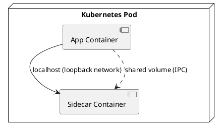

Great. I’ll draft a 1,000–1,200-word executive overview titled “Sidecar Pattern: Off-loading Cross-Cutting Concerns Beside Your Service” with a problem-solution storytelling style, specifically for intermediate-to-advanced engineers preparing for system design interviews.

I’ll cover the full set of required bullets — from pain points and sidecar anatomy to deployment patterns, observability, performance knobs, and pitfalls — and include a `plantuml` diagram and concise key takeaways.

I’ll update you here as soon as it’s ready.

# TL;DR

The sidecar pattern offloads cross-cutting tasks (like networking, logging, security) from your service to a separate sidecar process. This keeps services lean and language-agnostic, while infrastructure concerns are handled in the sidecar – improving modularity, observability, and security at minimal performance cost.

## Why Adopt a Sidecar? (Pain Points)

Monolithic or in-library approaches duplicate cross-cutting logic and tightly couple it to the service. A bug in that support code (say, a logging library) can crash the whole service. The sidecar pattern moves such concerns into a separate process, reducing internal complexity and isolating failures (a sidecar crash is less likely to take down the app). It’s also language-agnostic: one sidecar can provide a feature to services written in any language via standard APIs.

## Core Anatomy: Service + Sidecar

A sidecar is an **auxiliary process/container** that runs alongside a primary service. They typically share the same **localhost network** and can share a filesystem volume for IPC. In Kubernetes, for example, both containers run in one Pod, so the app calls the sidecar at `localhost` and they can exchange data via a shared volume.

Other platforms follow a similar model. Each container is isolated (its own process, memory, etc.) but co-located. The orchestrator schedules them together and accounts for their combined resources.

## Common Sidecar Workloads

* **Network proxy (ambassador)** – Envoy/Linkerd sidecar proxy handles service discovery, routing, retries, and mTLS for the app’s traffic.
* **TLS termination** – a sidecar (e.g. Nginx) terminates HTTPS and forwards plain HTTP to a legacy service.
* **Logging/metrics agent** – collects and ships logs or metrics to external systems (the app just outputs logs, sidecar forwards them).
* **Config reloader** – watches for configuration changes and updates the app (e.g. via a shared config file or by sending a reload signal).
* **Lifecycle adapter** – manages startup/shutdown logic, e.g. wait until the app is ready before serving traffic, handle graceful termination signals.
* **Language-agnostic bridge** – provides common APIs via HTTP/gRPC that any app can use (e.g. a Dapr sidecar offering pub-sub, caching, etc.).

## Deployment: Pods & Container Groups

Sidecars are deployed together with the main service. In Kubernetes, this means putting the sidecar and app containers in the same Pod so they share network and volumes. Other orchestrators (Nomad, ECS) have similar constructs. Each container still has its own environment and resource limits. When you scale the service, each instance includes its sidecar (one sidecar per app instance). The scheduler will account for the combined resource ask of app + sidecar, and you must consider the overhead of running an extra container per service instance.

## Communication Patterns

**Loopback calls:** The app and sidecar usually communicate via `localhost` (loopback TCP). Calls to 127.0.0.1 stay on the host and can’t be accessed externally, making a low-latency channel.
**Unix sockets:** Many sidecars use a Unix domain socket in a shared volume instead. This avoids TCP/IP overhead and can be \~60% faster than loopback TCP. It also restricts access to only containers that have the socket file.
Either way, IPC overhead is small (often microseconds of latency) compared to a function call, so the flexibility is usually worth it.

## Lifecycle & Coupling

Coordinating the lifecycle of the app and sidecar is crucial. Ideally, the sidecar starts **before** the app (Kubernetes now has a flag to ensure that) and both must be healthy for the Pod to be considered ready. If one crashes, it doesn’t necessarily kill the other – the orchestrator can restart the failed container individually. However, if the sidecar is critical (e.g. a proxy handling all traffic), the app is effectively down until it recovers. In practice, treat them as a pair when planning for restarts.

## Scaling & Resource Isolation

Sidecars scale one-to-one with the app. Every service instance has its own sidecar, which means additional overhead (100 instances = 100 sidecars’ worth of CPU/RAM). The upside is **isolation**: you can give the sidecar separate resource limits so it cannot starve the main app. For example, if the sidecar does heavy computing (like encryption), you can allocate it CPU limits so the app’s CPU share remains safe. Schedulers consider the combined resource needs when placing workloads.

## Observability Benefits

Sidecars can improve observability without changing app code. For example, a sidecar proxy can automatically emit metrics (latencies, request counts) and propagate trace headers for distributed tracing. Logs can also be unified – a logging sidecar might tag app logs with service names or correlation IDs before shipping them. (Service meshes often provide these capabilities for free via the sidecar proxy.)

## Security Considerations

Secure sidecars just like your application. **Least privilege**: run sidecars with minimal permissions (drop unnecessary Linux capabilities, run as non-root). **Limit exposure**: bind sidecar services to localhost and restrict their network access via policies. **Secrets**: mount sensitive credentials (certs, tokens) only in the sidecar and let it handle the secure communication, so the primary app never directly touches secret material. In short, treat the sidecar as part of the app’s trust boundary and secure it accordingly.

## Advanced Variants

* **Service mesh proxies:** Many service meshes (Istio, Linkerd) inject a sidecar proxy per Pod to handle networking, security, etc. Emerging “ambient” meshes use eBPF to avoid having a proxy per Pod, reducing overhead.
* **WebAssembly & eBPF:** Sidecars can run WebAssembly plugins for custom logic. Meanwhile, some sidecar duties can be moved into the kernel with eBPF.
* **Init vs sidecar:** Use init containers for one-off setup, and sidecars for ongoing tasks. (Kubernetes now supports a sidecar container type to ensure sidecars start before the main app.)

## Performance Knobs

Optimize sidecar communication and work handling. Use the fastest IPC available (Unix sockets instead of TCP, or even shared memory if applicable) and batch I/O (e.g. flush logs at intervals instead of every line). Leverage any hot-reload capabilities (for example, Envoy’s hot restart reusing sockets) so you can update sidecars without downtime. Overall, the performance overhead of a well-optimized sidecar is minor in most scenarios.

## Common Pitfalls

* **Bloated sidecars:** Don’t overload a sidecar with too many responsibilities. A “mega-sidecar” becomes hard to manage and counterproductive.
* **Version skew:** If the app and sidecar communicate via an API or client library, ensure their versions stay compatible. Mismatches can cause errors, so coordinate deployments or maintain backward compatibility.
* **Noisy neighbors:** A sidecar using excessive resources can degrade the main app. Always set resource limits and monitor sidecar usage to prevent it from hogging resources.
* **Added complexity:** A sidecar introduces more components to manage and debug (another container, more configuration). Ensure you monitor the sidecar’s health and automate its injection/upgrades to avoid hidden orchestration issues.

## Key Take-aways

* **Offload cross-cutting tasks:** Sidecars handle generic functions (logging, monitoring, etc.), keeping core code simpler.
* **Co-located & polyglot:** Sidecars run locally (fast IPC) and provide language-neutral capabilities, avoiding per-language implementations.
* **Isolation improves resilience:** The sidecar is a separate process, so its failures or restarts are less likely to crash your app.
* **Consistent observability & security:** Sidecars enforce uniform logging, tracing, and security policies (like mTLS) across services.
* **Weigh overhead vs. benefit:** One extra container per service adds cost, so use sidecars when the benefits outweigh the cost.
* **Keep it focused:** A sidecar should have a single well-defined purpose. Give it minimal privileges and resource limits to contain any issues.
