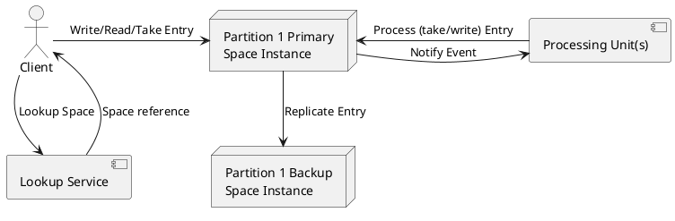

Great — I’ll draft a 1,000 to 1,200-word executive overview titled **“Space-Based Architecture: Eliminating the Database Bottleneck with an Elastic Memory Grid.”** It will be vendor-neutral where possible, use a narrative problem-solution tone, and explicitly address all twelve required points with clear formatting. I’ll include a TL;DR summary, a `plantuml` diagram, and a final section on key takeaways.

I’ll let you know as soon as it’s ready.

# Space-Based Architecture: Eliminating the Database Bottleneck with an Elastic Memory Grid

**TL;DR:** Space-Based Architecture (SBA) uses an in-memory data grid (the “space”) and co-located processing units to remove the traditional database bottleneck. By partitioning data into memory shards and processing events **in-situ**, SBA achieves extreme throughput and low latency, with dynamic scaling, built-in replication for fault tolerance, and optional persistence for durability.

## Origin Story: From Tuple Spaces to Extreme Scaling

Space-based architecture traces back to the *tuple space* concept from the Linda language (Gelernter, 1986) – an associative **“blackboard”** where producers and consumers exchange data tuples. Sun’s **JavaSpaces** (late 1990s) adapted this idea for Java/Jini, enabling distributed processes to share state via simple operations (`write`, `read`, `take`) on a shared space. Early adopters in finance and telecom recognized that decoupling components through an in-memory space could support high concurrency when databases and message queues began to choke. Traditional web architectures inevitably hit the **database** as the final scaling limit – adding web/app servers simply shifts the bottleneck downward. The **breakthrough** was to remove the centralized DB from the critical path: *“Because there is no central database, the database bottleneck is removed, providing near-infinite scalability”*. Companies like GigaSpaces (early 2000s) built on JavaSpaces to create a **commercial SBA platform**, proving that an elastic in-memory grid plus distributed processing could meet extreme throughput and ultra-low latency demands where queues + RDBMS fell short.

## Core Anatomy: Processing Units, the Space, and Virtual Middleware

At the heart of SBA is the **Processing Unit (PU)** – a deployable module that bundles application logic with a slice of data grid. Instead of separate tiers (database server, message broker, etc.), a PU contains the service and its data “cache” together. This co-location means what used to be remote calls (app ↔ DB or app ↔ message queue) become in-process operations. The PUs collectively host a distributed **in-memory data grid**, often called the **space**, which holds objects/entries in memory and also functions as an in-memory messaging bus. In effect, the space serves as an **embedded enterprise service bus (ESB)** for delivering events to the PUs, while simultaneously storing the shared state in memory.

A typical SBA runtime includes supportive *virtual middleware* services: a **lookup service** (directory) so clients can discover space instances transparently, and a **deployment manager** that manages PUs across a cluster. For example, in JavaSpaces the Jini lookup service helps clients find a space by name, and in modern SBA platforms a “Grid Service Manager” places PUs on available nodes based on SLAs (e.g. CPU or memory constraints). These are *virtual* in the sense that they are part of the infrastructure layer (often running as separate components or containers) rather than dedicated hardware appliances. Overall, the core anatomy comprises: **clients** that interact via the space, **PUs** hosting data and services, and built-in middleware that handles discovery, routing, and life-cycle (so external message brokers or load balancers can be optional).

*(Diagram: A client looks up the space via a lookup service, then interacts with a partitioned in-memory space (Partition 1’s primary). The primary replicates to a backup, and co-located Processing Units consume events from the space and update it.)*

## Data Model: Entries, Operations, and Leasing

The space holds **entries** (tuples or objects), which are the unit of data. These entries are typically plain objects with public fields that serve as matching criteria. Interaction is done through a minimal set of operations: one can **write** an entry (add it to the space), **read** an entry (get a copy without removal), or **take** an entry (consume and remove it). Reads and takes use **associative lookup**: the caller supplies a *template* object with certain fields set, and the space returns a matching entry (or waits until one arrives). This content-based addressing decouples producers and consumers – e.g. a worker can take any “Task” entry from space without knowing which process wrote it.

Entries in space may be given a **lease time** (TTL) when written. A lease is essentially an expiration timestamp: the space guarantees to retain the entry for that duration, after which it will be automatically removed if not consumed. Leasing prevents buildup of stale data and acts as a safety net for failures (for instance, if a consumer dies after taking an entry, the entry can be auto-reinserted when its lease lapses). Leases can be renewed by clients if they need more time. This mechanism avoids “orphaned” entries or locks persisting forever – everything in the space is *temporal* unless explicitly made eternal.

For concurrency control, SBAs favor **optimistic concurrency** patterns. Rather than using heavy locking, updates often use version checks or compare-and-swap semantics. For example, modern in-memory grids support atomic operations like `putIfAbsent` or `replace` which perform a versioned update (only applying if the entry wasn’t modified in the meantime). This approach fits the assumption that most entries are independently processed (e.g. tasks) with minimal contention. When stronger consistency is needed across multiple entries, space operations can participate in transactions (e.g. Jini transactions or two-phase commit across partitions), but these are used sparingly given the performance focus. The default is that a `take` operation inherently provides mutual exclusion (only one consumer will get a given entry) and the space’s design (remove-modify-reinsert) naturally supports *single-writer concurrency*. In summary, the data model is simple – a shared bag of entries with **associative access**, time-based expiry, and optimistic update semantics – enabling loose coupling and resilience to partial failures.

## Elasticity and Partitioning: Shards, Affinity, and Scaling Out

To scale both data capacity and throughput, the space is **partitioned** (sharded) across multiple processing units. Each PU holds one **space partition** (a subset of the entries) and handles all operations for that partition. For high availability, each primary partition has one or more **backup replicas** in standby: if a primary node fails, a backup in a different PU seamlessly takes over as the new primary. This primary-backup pair (or group) constitutes a **partition unit**, often kept on separate hosts to tolerate machine loss. Clients see a single logical space; behind the scenes, a **clustered proxy** or routing layer forwards each request to the correct partition based on an entry’s key or routing field. Typically a hash function on some key (e.g. order ID, customer ID) determines the partition, ensuring the same key consistently maps to the same node (data affinity). This **affinity routing** means related data (and requests for it) go to the same partition, maximizing cache locality.

Partitioning enables *elasticity*: you can scale out by adding more partitions (and thus more PUs). If the system is reaching capacity or throughput limits, simply **increase the number of space partitions and corresponding PU instances**. SBA middleware will distribute the new partitions among the available servers and trigger rebalancing (moving subsets of keys to the new partitions). For example, Apache Ignite’s affinity function maps keys to 1024 partitions by default, and if new nodes join, partitions are **re-distributed** such that each node handles roughly an equal share (with minimal data movement). The platform automatically detects new nodes and **redistributes data** across the cluster to optimize resource use. Similarly, when a node leaves or crashes, its primary partitions fail over to backups, and the system may promote new backups or consolidate partitions on remaining nodes. This self-organizing behavior gives SBA its elasticity – the capacity and processing power of the data grid can grow or shrink on demand without central bottlenecks.

Notably, SBA encourages **co-locating state with compute**. Each PU is designed to contain *both* the data it needs and the services that operate on that data, so that a business operation often hits only one partition (avoiding cross-network calls). By designing the data model such that entries frequently used together reside in the same partition, one can ensure most queries and transactions are single-partition (and thus atomic and fast). This is known as *affinity collocation* – storing related data in the same shard to avoid distributed joins or scatter/gather queries. If designed properly, the system achieves near **linear scalability**: doubling the number of partitions and PUs doubles the throughput, as load is evenly spread and interactions remain local. The flip side is to avoid **hot partitions** – if one partition has disproportionately hot keys or heavy computation, it can become a new bottleneck. SBA architects must choose partition keys carefully to avoid skew (e.g. hashing should distribute keys uniformly) and sometimes replicate or split particularly hot spot data. But overall, partitioning + elasticity is what gives SBA its *scale-out sweetness*, seamlessly handling growing load by just plugging in more cheap machines rather than vertical scaling.

## Event-Driven Processing: Asynchronous Notifications and Listeners

Space-based systems are inherently **event-driven**. Instead of services polling a database or queue, a PU can simply register interest in certain entries and get **asynchronous callbacks** when they appear. This is achieved via **notification templates**: a service can subscribe to the space with a template (much like a read template) and provide a listener object. When a matching entry is written to the space, the space will notify the listener (often by invoking a method on it, e.g. a remote event callback). Under the covers, this uses the distributed event model (in JavaSpaces, built on Jini events) – but to the developer it means you can handle space events in a reactive manner, without continuous polling.

These **notifications** effectively turn the space into a **pub/sub messaging system** in addition to a data store. PUs can subscribe to data changes or new “work” entries and handle them asynchronously. The space ensures that events are delivered reliably: for instance, if a client is slow or temporarily disconnected, the event can be stored in a buffer (much like a message queue’s durability for slow consumers). SBA implementations offer features akin to messaging systems – e.g. **FIFO ordering** for queues, filtering, and **content-based routing** where only listeners interested in certain content get the event. In some configurations, entries can be tagged as FIFO such that the space enforces first-in-first-out delivery to consumers (useful when modeling a queue). By default, though, the system may not guarantee a global order (events can be unordered across partitions or listeners). When ordering matters, one typically confines the ordering requirement to a single partition or uses a single-threaded consumer pattern.

A crucial best practice is making event handlers **idempotent**. In a distributed environment, an event may occasionally be delivered twice or a listener might see a duplicate (for example, after a failover, the new primary might re-emit a notification, or a client reattach could replay some events). Therefore, PU event logic should be able to handle reprocessing an entry without side effects (or detect duplicates via an ID). Additionally, **at-least-once delivery** is a common goal – the system ensures an event is not lost, even if that means a rare duplicate. By designing listeners to be idempotent and stateless, one ensures correctness despite these trade-offs. Also, if multiple events can be processed in parallel, developers must consider concurrency control (e.g. two PUs taking two different entries that logically conflict). SBA offers tools here – one can use transactions to bracket a take and subsequent write, or use **FIFO grouping** (processing all events for a certain key in order) – but these come at complexity costs. Oftentimes a simpler approach is to embed enough information in the entry to process it independently and let the space mediate any needed locking through its single-entry take semantics.

In summary, SBA fosters *event-driven, decoupled processing*: producers just write entries, and one or many consumers will be notified to handle them asynchronously. There is no direct invocation between services – everything goes through the space – which yields extremely loose coupling and resilience. The event model combined with in-memory speed allows handling of high-frequency messages (for example, a trading system can handle orders as space events in sub-millisecond time). This style naturally supports **Master-Worker patterns**, streaming pipelines, and real-time analytics, all driven by the flow of entries through the space.

## Persistence Strategies: Write-Behind, Snapshots, and Recovery

While SBA keeps data in RAM for speed, most real systems still need **persistence** for durability or integration with external databases. Several persistence strategies are used, often in combination:

* **Write-Behind to DB/NoSQL:** Instead of writing through synchronously to a database (which would add latency), the space can buffer and asynchronously flush changes to a backend store. For example, when an entry is written or updated in space, it is queued to be written to an RDBMS or NoSQL store in the background (often via a **MapStore** interface or a dedicated “mirror” service). This *write-behind* mode improves throughput by decoupling user transactions from slow disk I/O. Changes may be coalesced – e.g. if an entry is updated 5 times in a short span, the system might write only the final state to the DB, reducing write load. The trade-off is **eventual consistency**: the database will lag behind the in-memory state. If the space crashes before flushing, some recent updates might not make it to the DB. Systems like Apache Ignite let you choose strict sync (write-through) versus write-behind: *“A ‘write-behind’ approach delivers faster writes by buffering transactions in the in-memory layer and providing eventual consistency”*. Applications must tolerate this inconsistency window. Typically, critical data can use write-through (slower but safe) and less critical data uses write-behind for performance.

* **Snapshotting:** The entire in-memory grid can be periodically dumped to disk storage (or to a distributed filesystem) as a snapshot. This is analogous to a database checkpoint. Some IMDGs have native persistence which periodically writes a snapshot of each partition’s memory to local disk (e.g. Hazelcast Persistence, Apache Ignite native persistence). Snapshots allow fast restarts – if the whole grid goes down (e.g. a full power loss), it can reboot and **recover data by reading persisted entries and snapshots from disk** without needing to reload from an external DB. Snapshots can be taken manually at off-peak times or continuously in the background. They complement write-behind: the write-behind log covers recent operations, and snapshots provide a point-in-time baseline.

* **Journaling (Write-Ahead Logging):** Some implementations log every change (write/take) to a **redo log** on disk or replicate it to a durable topic. In case of crash, this log can be replayed to bring the space back to the latest state. Journaling is often used in tandem with the backup replicas in memory – e.g. a primary might sync to a backup (fast) and also append to a disk journal (slower, but guaranteeing durability if both primary and backup are lost). Journals can be truncated once data is persisted elsewhere or snapshot. For example, Oracle Coherence and GigaSpaces XAP offer persistence stores where each partition writes a transaction log.

In practice, many SBA deployments use a **hybrid approach**: the in-memory grid holds the operational working set (removing the runtime load from the database), and a persistent store (or stores) act as system of record for post-fact analysis, longer-term storage, or disaster recovery. The space might be pre-loaded from the database on startup (to warm the cache and avoid cold-start latency), then operate from memory, and trickle updates back to the DB asynchronously. If the entire grid were to fail, the system can be reinitialized from the DB (accepting that the very last transactions might have been lost if not flushed – a risk mitigated by the backups and journals). Indeed, SBA explicitly trades some consistency and durability guarantees for speed. Engineers must decide the acceptable window of data loss. Some systems configure synchronous replication to at least *one* persistent target (for example, write to a distributed log like Apache Kafka or disk journal) to minimize loss.

After a crash or shutdown, **recovery** involves either restarting from the latest snapshots plus applying any journaled operations, or reloading from the source-of-record database. Because the grid may have held un-flushed writes, recovery procedures should reconcile differences – e.g. compare DB state and possibly reprocess the transaction log. Many IMDGs provide tooling for this (consistency checking between cache and DB). The goal is to restore the space to a consistent state without manual data repair. As long as the persistent store is available, even a complete memory wipe can be recovered: *“in the event of a complete data grid loss, the persistent data store can reinitialize the system”*. This gives SBA an additional safety net beyond memory and replication.

## Fault-Tolerance: Replication, Quorum, and Rebalancing

High availability is a core aspect of SBA – the system should keep running even if nodes die or networks partition. **Replication** is the first line of defense: each partition’s data is stored redundantly on at least one other node (the backup). If a primary partition process crashes, a backup on another machine is promoted to primary automatically. This failover happens quickly (often in milliseconds) since the data is already in memory on the backup; clients may experience a brief pause but no data loss, as the new primary has an up-to-date copy. Upon failover, the system can also **create a new backup** (if resources allow) to restore redundancy – either by starting a new PU instance or using an existing idle one to take over the backup role.

**Split-brain** (network partition) is a tougher scenario: if the cluster breaks into two isolated sets, each could think the other is down. SBA clusters use **quorum** or coordination services to avoid data divergence. A common strategy is **majority quorum** – only the partition of the cluster that has a majority of nodes continues to act as primary; the minority partition’s primaries go inactive to avoid two masters. For example, Hazelcast allows configuring a minimum cluster size and will freeze operations if fewer than that number of nodes are present. This ensures that when the network heals, you don’t end up with conflicting updates from two sides. If both sides were active (split-brain without protection), reconciliation is hard – some SBA systems offer **merge policies** to reconcile data (e.g. last-write-wins, or a custom resolution), but the recommended approach is to prevent it via quorum. Essentially, one side “wins” and the other side’s space is either shut down or switched to read-only until reconnection.

When the partition heals or when new nodes join, the cluster initiates **rebalancing**: moving data to where it should be in the new topology. If a node was lost, its partitions now running on backups may be redistributed among the remaining nodes to balance load. Conversely, if a node is added, some partitions (or backup responsibilities) will migrate to it. Partition migration is typically done carefully – in segments or with rate limiting – to avoid flooding the network or causing big performance hits. Modern IMDGs transfer partition data in chunks and can even allow ongoing reads during migration (with a risk of *stale reads* which can be mitigated by configuration). The overall goal is to **restore an optimal balance** without stopping the world. As noted, adding nodes linearly improves capacity: the system automatically sees the new node and spreads out partitions, so each node has fewer partitions (hence less data and load per node).

One must also consider **failure detection** – SBA often relies on heartbeat mechanisms or a membership protocol to detect node failure quickly (e.g. a missed heartbeat threshold triggers failover in a few seconds or less). There’s a subtle dance in ensuring the backups don’t take over too late (data unavailable) or too early (false positive causing two primaries). Well-designed systems include tunable heartbeat intervals and require (if possible) an external coordinator for cluster membership (some use etcd/ZooKeeper or built-in Paxos-style managers for consensus). In practice, most SBA products have solved these issues: e.g. GigaSpaces and Coherence use leasing and external monitors to detect splits; Hazelcast and Ignite employ custom cluster membership with configurable timeouts.

Finally, after failover or changes, the system must maintain **consistency of replicas**. If the primary goes down mid-update, the backup must have either the committed state or be able to roll back uncommitted changes (if transactions were in use). This is often handled by replicating operations in real-time (synchronously or asynchronously). Some systems choose *synchronous replication* (the primary waits for backup ack on each write – lower risk of divergence but higher latency), others allow *async replication* (primary proceeds and the backup may briefly lag – higher performance but a tiny window of possible data loss if primary dies at that exact moment). Many default to sync for critical data and async for less critical or for backups in remote sites. For example, an IMDG might let you configure a backup as synchronous in the same data center and an asynchronous backup to a remote site for disaster recovery.

In summary, SBA handles faults through **redundancy** (in-memory replication), **smart cluster management** (quorums to avoid split brain), and **dynamic reconfiguration** (rebalancing and self-healing). When a node fails, its load is taken over by others, and when a node joins, the load is leveled out. The result is no single point of failure – the database isn’t a SPOF because there *is no single database*, just a grid that can lose parts and still function.

## Performance Knobs and Optimizations

Space-based architectures are geared for performance. Beyond the fundamental boost of keeping data in RAM, there are several tuning knobs and patterns to squeeze out maximal throughput and minimal latency:

* **Off-Heap Memory:** Garbage collection (GC) pauses in JVMs can severely impact latency. Many IMDGs offer off-heap storage to manage memory outside the Java heap, avoiding GC overhead for the majority of data. For instance, Hazelcast’s High-Density Memory Store uses native memory for object storage, which **bypasses the JVM GC** and lets the IMDG handle its own memory management. Off-heap (often using direct `ByteBuffer` or sun.misc.Unsafe under the hood) allows caching far larger datasets without proportionally increasing GC pause times. The trade-off is you must serialize/deserialize to move data between off-heap and your application, but smart serialization (and sometimes direct memory access via generated classes) mitigates this. With off-heap, it’s common to see **“near zero GC”** on the critical path, which is vital for low-latency systems.

* **Zero-Copy Serialization:** Even serialization can be optimized. “Zero-copy” typically means avoiding unnecessary copying of bytes between user space and kernel, or between buffers. Some IMDG protocols use direct I/O buffers so data can be sent over the network straight from off-heap memory without extra copy steps. Also, formats like Chronical Wire or Agrona can allow reading/writing objects in a binary form directly from memory. The bottom line: minimize copying and object creation when moving data in/out of the space. For example, **snapshotting** using memory-mapped files can dump memory to disk with minimal CPU, and **Delta updates** (sending only changed fields) reduce payload sizes.

* **Batch Operations:** Amortizing overhead by batching multiple operations into one can dramatically increase throughput. SBA systems often provide bulk APIs (e.g. read-multiple, take-multiple, or multi-put) so a client can retrieve a batch of entries in one network round-trip. Similarly on the back-end, replication to backups can batch several updates into one packet, and write-behind can batch DB updates. For instance, GigaSpaces can batch multiple queued updates to a backup in one network call, improving throughput at the cost of slight replication delay. Tuning batch sizes is an art – too large can increase latency variance, too small underutilizes capacity. A related concept is **piggybacking**: combining a replication acknowledgement with a heartbeat or bundling multiple event notifications into one callback if they arrive concurrently.

* **Collocated Processing (Joins and Computations):** In distributed systems, performing a **join** or multi-key computation can be expensive if data is scattered. SBA encourages **collocated joins** – if you need to combine two datasets, design the key or partition such that the relevant data is on the same partition, and then execute the join *within that node*. Many IMDGs support executing code on a partition (for example, executing a predicate or a custom processor on each partition and aggregating results). This avoids shipping large datasets over the network. A classic pattern is using an EntryProcessor (in Hazelcast/Ignite) or an invokeAll on partitions: rather than fetching all data to the client to join, send the query to where the data lives. If collocation is impossible (some queries inevitably need cross-partition data), you can use distributed query mechanisms but expect slower performance. **Distributed joins** often use scatter-gather: query each node then join partial results – which is fine for small intermediate sets but can bottleneck if data is large. Therefore, as mentioned, affinity design (storing data used together in one partition) is key: *“design your data model so that entries used together are stored together… This technique is called affinity collocation”*. When done, remote reads are minimized, and many use cases don’t need distributed joins at all.

* **Parallelism and Threading:** On the implementation side, one can tune the thread pool sizes for handling operations, the number of partition threads, etc. For example, Hazelcast uses partition-operation threads; increasing them can boost throughput if CPU is available, but too many can increase contention. Some systems pin one thread per partition (ensuring single-threaded access to that partition’s data, which simplifies concurrency). Others allow multiple threads to work on different entries in the same partition concurrently if it’s safe. Exposing enough configuration here allows tailoring to the workload (CPU-bound vs IO-bound processing).

* **Network and Serialization Tuning:** Turn on TCP no-delay to avoid nagling, use decent message batching to fill packets, and prefer a binary protocol that’s compact. Many IMDGs use their own binary serialization (e.g. Coherence’s POF, Hazelcast’s BinaryInterface, Ignite’s BinaryMarshaller) that is more efficient than Java’s default. Some allow **native clients** that skip serialization entirely if client and server share memory (like Ignite’s collocated compute can run user code inside the grid JVM, avoiding serialization costs altogether).

In summary, SBA can be tuned almost like a high-performance engine: off-heap memory to avoid GC stalls, zero-copy network paths to shave microseconds, batching to maximize throughput, and careful data placement to avoid cross-node chatter. These optimizations, when applied, let a space-based system handle **hundreds of thousands to millions of ops/sec** with latency in the low milliseconds or below, on a modest cluster – performance that would be impossible with a disk-bound central database.

## Observability: Monitoring the Space and PUs

Operating a space-based system requires good visibility into its moving parts. Key metrics and tooling include:

* **Space Metrics:** The data grid itself exposes metrics like *entry counts, memory usage, and throughput*. For example, GigaSpaces provides `space_data_entries_total` (total number of entries in the space, and even per-type counts). Memory consumption is split into on-heap vs off-heap; e.g. metrics for off-heap bytes used and percentage used are tracked. You can monitor *entry churn* via operation counters – writes, reads, takes per second – which indicate load patterns. **Latency stats** for operations (min/avg/max) are also crucial; some systems don’t provide it out-of-box, but you can infer issues if, say, takes per second drop while CPU is idle (maybe a hung consumer). A healthy space usually shows steady throughput and memory within expected bounds.

* **Processing Unit and SLA Monitors:** Since each PU is essentially a microservice instance, you monitor them much like microservices. Track **CPU usage** per PU, *heap usage per PU*, and any internal queues (e.g. if a PU uses an internal polling container, monitor the queue length of pending events). Many SBA platforms integrate with JMX or Prometheus to collect JVM stats: threads, GC counts, etc. For example, you might set an SLA rule: if a PU’s CPU stays over 80% and its event queue backlog > N, then spin up another PU instance (scale-out). Likewise, if memory usage in a PU exceeds a threshold, it might indicate a hot partition or a leak. GigaSpaces’ **SLA-driven container** concept actually automates deploying PUs based on such criteria (CPU, memory, machine availability). Ensuring you have dashboards for each partition/PU helps pinpoint imbalances (e.g. one partition’s heap is 2x larger than others – could signal a skewed key distribution or a stuck data that isn’t expiring).

* **Rebalance and Failover Tracking:** It’s important to know when the system is in a **rebalancing state**. Metrics like “partition migration in progress” or number of migrating partitions can be exposed (Hazelcast has metrics for migration queue, partition state). **Rebalance lag** can be defined as how long after a topology change the data becomes evenly distributed. One can instrument this by tracking when all partitions report a balanced state or when backup counts return to desired level. During scaling events, monitoring ensures that new partitions catch up (all data moved) and backups have been created. Additionally, **replication latency** – the time between a write on primary and its application on backup – is a crucial metric for sync vs async replication. Some systems offer a metric for the replication backlog or redo-log size; e.g. a *replication redo log pending packet count* can tell if backups are falling behind. If you see that creeping up, it means the network or backup node might be slow, risking potential data loss if primary fails. Ideally, replication latency stays very low (sub-millisecond in LAN).

* **Resource and OS Metrics:** Because SBA can be memory and network heavy, classic metrics are also important: OS memory free/used, swap usage (should be zero ideally), CPU, and NIC bandwidth. These can hint at saturation – e.g. if one node’s NIC is at 90% utilization, that node might be a bottleneck or handling too many partitions. Tools like **Management Center** (Hazelcast) or GigaSpaces Ops Manager provide a cluster-wide view: memory per node, CPU per node, and the ability to drill into each partition’s status.

* **Logging and Tracing:** In a distributed environment, enabling trace logs for a subset of operations can help debug issues (like why a certain entry wasn’t processed). Some SBA frameworks allow you to trace an entry’s lifecycle (written by X, taken by Y, etc.). **Distributed tracing** can be integrated by instrumenting the client calls to space and the callbacks on PUs, giving a cross-node trace of a transaction.

Given these metrics, one can set up **alerts**: for instance, alert if heap usage > 70% (risk of long GC), off-heap usage nearing its limit, entry count suddenly drops (could indicate mass eviction or a bug causing data loss), or if a partition has no backup (indicating redundancy broken). Also monitor **lease expiration counts** – a spike in expired leases might mean consumers are too slow or failing to take entries in time. And track **listener registrations** if dynamic: if those drop, maybe some PUs died.

In essence, SBA observability means watching both **system health (memory, CPU, network)** and **data grid health (entries, ops, replication)**. With the right monitoring, you can catch common issues like a memory leak (gradual heap growth), or an *inadvertent hot key* (one partition’s ops/sec is off the charts compared to others), or slow subscribers (increasing event queue sizes). Modern IMDGs ship with rich metric sets – e.g. dozens of metrics as shown above – leverage them to ensure the “space” truly remains elastic and isn’t quietly becoming a ticking time bomb.

## Security Considerations: Securing Data in the Space

With data living in-memory across many nodes, security is a critical concern in SBA design:

* **Transport Encryption:** All network traffic (client-to-space and inter-node replication) should be encrypted (TLS/SSL) to prevent snooping or tampering in transit. Many IMDGs support this out of the box – e.g. enabling TLS on the cluster means members and clients communicate over an encrypted channel. This ensures that sensitive data entries (like personal information, financial transactions) are not exposed as plaintext on the wire. In addition, authentication of nodes (certificates) prevents unauthorized machines from joining the cluster and reading the space.

* **Authentication & Authorization (Entry ACLs):** SBA should enforce that only authorized clients or services can perform operations on certain data. Some platforms integrate with security frameworks to provide fine-grained access control. For example, Hazelcast offers a permissions model where you can grant a role permission to read/write a specific map (cache) but not others. Apache Ignite/GridGain similarly support per-cache (per space) security where each cache (tenant) has its own access controls. In a multi-tenant scenario, you might **segregate data by tenant** – e.g. using separate spaces or caches per tenant – and assign permissions such that tenant A’s users cannot even see tenant B’s cache. Even within a single space, one could design an ACL system where entries are tagged with an owner and the space only returns those to authorized consumers (though that might be implemented at the application level using filtering). The key is to avoid a free-for-all in the data grid; leverage the security features of the IMDG or add a layer of validation in the PU services.

* **Tenant Isolation:** Beyond ACLs, true multi-tenancy might require separate logical spaces or partitions for different tenants to ensure no data overlap. This can also extend to **resource isolation** – for instance, run PUs for different tenants in separate JVMs or containers, to avoid one tenant’s workload affecting another’s performance or, worse, reading another’s data due to a bug. Some IMDGs support **namespaces** or prefixed caches to partition data. The GridGain example above outlines using distinct caches per tenant with per-cache permissions. Another approach is using a tenant ID as part of the entry key and configuring the affinity function to group by tenant, then dedicating certain partitions or nodes to each tenant (this is complex but can provide isolation). Additionally, ensure that backups of one tenant’s data do not co-reside on the same node as another’s if that’s a concern; basically treat each tenant’s data grid as separate as possible.

* **Data Encryption at Rest:** If the space persists data to disk (snapshots, journals, etc.), those files should be encrypted (disk encryption or application-level encryption) because they may contain sensitive info. Even in-memory, if extremely sensitive data is held, some frameworks allow using encrypted object fields or storing only hashes. However, encrypting data in memory is tricky – it’s decrypted to use it, so memory is ephemeral but could be compromised by an attacker with full access. Typically, focus on **in-memory time minimization** for sensitive pieces.

* **Eviction and TTL for Sensitive Data:** SBA gives the ability to auto-expire data. Setting short TTLs for sensitive entries (like session tokens, PII) ensures they aren’t hanging around in memory longer than necessary. For example, a one-time password entry could have a 5-minute lease; after that it’s gone from the space, reducing exposure window. If an entry contains something like a credit card number that is only needed for a transaction, you might design the PU to take and immediately process+delete it (so it’s not sitting in memory). Also, **eviction policies** can be configured to remove least-recently-used or largest entries when memory is pressured – for sensitive data, you might prefer an eviction policy that removes those first (though usually you just keep their TTL short). In essence, treat the space as an ephemeral cache: do not treat it as the eternal store for confidential data.

* **Auditing and Logging:** Security also means knowing who did what. SBA should integrate with audit logging – e.g. record that user X read entry Y at time Z. This might be done at the application level by the PU (since the space itself might not have user context for each operation). However, some enterprise IMDGs allow tagging operations with a subject (if the client authenticates), enabling auditing at the data grid layer.

* **Infrastructure Hardening:** Ensure the machines running the space are secured – since if an attacker can run arbitrary code on a node, they could potentially attach to the JVM and dump memory. Use OS-level security, network segmentation (only allow trusted networks or VPN to talk to space nodes), and possibly run the space in a container with limited access. Also consider **denial of service**: throttle clients that perform excessive operations or have the space require auth to prevent random public traffic from trying to overwhelm it.

In summary, while SBA provides a potent performance advantage, it must be *carefully secured*. Encrypt on the wire, isolate tenants either logically or physically, purge sensitive data promptly, and leverage built-in security controls of the IMDG. With regulations like GDPR, HIPAA, PCI etc., one must ensure that data in this fast-moving memory cloud is just as protected as it would be in a traditional database. The good news is many IMDG vendors have added enterprise security features to make this easier (from TLS to integration with LDAP/AD for auth), so engineers should turn those features on by default.

## Real-World Incarnations

The concepts of space-based architecture have influenced many modern data grid and caching platforms:

* **Apache Ignite (and GridGain):** An open-source in-memory computing platform that includes an IMDG with SQL support and ACID transactions. Ignite essentially provides a distributed cache that can be used as a *space* (it collocates compute via server-side “compute grid” execution). Ignite was used in SBA-style deployments (e.g. Sberbank’s massive Ignite cluster for real-time banking).

* **Hazelcast IMDG:** A popular in-memory data grid known for ease of use. It supports partitioned data structures, distributed execution (EntryProcessors), and near cache. Hazelcast can be seen as an SBA implementation where the data grid is front and center and you can deploy event listeners and processors in the cluster. Many **space-based patterns** (data affinity, backups, write-behind, etc.) are available in Hazelcast. It’s often used in Java caching, session clustering, and microservices data sharing.

* **Oracle Coherence:** One of the earlier commercial data grid products (originally Tangosol Coherence). Coherence provides distributed caches and topics, and was used in many financial institutions to implement reference data caches, trading spaces, etc. It follows the space model closely (it even had a concept of “backing map listeners” which act like space listeners, and entry processors for collocated logic). Coherence inspired a lot of patterns in this domain.

* **GigaSpaces XAP:** GigaSpaces (the company) explicitly branded around Space-Based Architecture. XAP (eXtreme Application Platform) was their product that combined a JavaSpaces-like space with an integrated processing unit container and messaging. Many of the examples in SBA literature (like trading, telecom event processing) were built on GigaSpaces XAP. It’s a quintessential SBA implementation with all the pieces (JavaSpaces API, embedded message bus, PU deployment, etc.). While not as common today, it pioneered concepts like the **Polling Container** and **Notify Container** for events, which have analogues in other systems now.

* **Redis (Streams and Lua):** Redis is often thought of as a cache or simple data structure store, but with the introduction of Redis Streams (a log-based message queue in Redis) and the ability to run Lua scripts atomically on the server, one can approximate a mini space-based architecture. For example, a Redis stream can serve as the space (holding events/tasks) and a consumer group processes them, with Lua scripts ensuring certain processing near the data. Redis is not a full IMDG (it doesn’t partition objects by custom keys in the same flexible way, and it lacks Java object support), but it’s used in practice for similar goals: high throughput in-memory messaging and state storage. Some patterns use Redis + custom app code in lieu of a true SBA platform, especially in smaller-scale or polyglot environments.

* **Apache Geode (Pivotal GemFire):** Not listed in the question but worth mentioning, Geode is another IMDG that has region-based partitioned caches with event subscriptions (listeners), and is used in financial and retail systems much like Coherence/Hazelcast.

* **Others:** IBM Extreme Scale, Ehcache with Terracotta, and *TIBCO ActiveSpaces* (a product literally named after tuple spaces) are all incarnations of the space idea. ActiveSpaces, for example, uses the Linda model of tuple spaces but optimized in C++ for very low latency, used in financial trading. These tools, along with **Infinispan** (by JBoss/Red Hat) and **Microsoft AppFabric (legacy)**, all operate on the same principle of distributed in-memory state and co-located compute.

In short, SBA’s influence is widespread – whenever you hear *in-memory data grid*, *distributed cache*, or *data fabric*, it likely includes these space-based notions. Even cloud services like Amazon DynamoDB Accelerator (DAX) or Azure Cosmos DB’s in-memory features echo the idea: keep data in memory, partitioned, and close to compute for speed. The combination of data grid + processing grid is seen in stream processing frameworks too (Flink, Spark Structured Streaming keep state in memory shards with local functions – conceptually similar to PUs and space). Thus, SBA isn’t a niche “JavaSpaces” idea anymore; it’s underpinning many high-scale architectures today.

## Common Pitfalls and Anti-Patterns

Despite its power, space-based architecture comes with its own landmines. Engineers transitioning to SBA should be aware of these common pitfalls:

* **Hot Partitions:** If your partitioning scheme is poor, you might direct a disproportionate amount of traffic to one partition (e.g. a bad hash function or a “celebrity” key that is accessed far more than others). This negates the scalability as one node becomes the bottleneck. Always analyze key distribution – for example, if using user ID, ensure you have enough users to spread across partitions, and consider composite keys or alternate keys if certain values dominate. Monitoring per-partition metrics can reveal if one partition handles significantly more ops or data than the rest. If so, you may need to **repartition** (increase partition count) or redesign the key. Some systems allow dynamic repartitioning, but it’s non-trivial and usually planned upfront. The *anti-pattern* is assuming the hash will save you without validating; always guard against skew.

* **Memory Pressure and GC Pauses:** A space is memory-hungry by nature. If you push it near the limits of RAM, you could trigger heavy GC activity (for on-heap) or even the Linux OOM killer (for off-heap, if you overcommit). GC pauses can cause latency spikes or even false failure detections (a stop-the-world GC might make a node seem dead to others). Tuning GC (or using GC-free off-heap) is crucial. Also, use **eviction** and set sensible limits – e.g. if the space exceeds X GB, start evicting least-used entries or prevent new writes until usage is down. A common mistake is to treat the space as infinitely large because “it’s distributed”; each JVM is still finite. OutOfMemory errors in one node can cause data loss if not handled. Another GC-related issue is improper sizing of young/old generation – if you create lots of short-lived entry objects, GC thrash can occur. Tools like GC logs, memory profilers, and load testing with realistic data sizes are important to catch this before production. As one reference, Hazelcast’s “Elastic Memory” (off-heap) was created explicitly to avoid GC stalls for large heaps – that tells you how real this problem is.

* **Orphaned Leases or Locks:** While leases prevent infinite resource wait, they introduce the need to renew and handle expiration correctly. If an application forgets to renew a lease on a long-running entry or lock, the space will consider it expired and make it available to others – potentially leading to multiple workers picking up the same task or other inconsistencies. Conversely, if a lease is set too long “just in case,” you might accumulate a lot of “orphan” entries that are actually not needed but haven’t expired yet. It’s important to calibrate lease durations to expected processing times and perhaps implement a secondary cleanup for truly stuck scenarios. Similarly, if using explicit locks (like a distributed ILock in Hazelcast), be wary of edge cases – e.g. a split-brain may allow the same lock on two sides, or if a client dies without unlocking and you didn’t set a lease time, that lock might remain locked (Hazelcast provides a leaseTime on locks for that reason). **Testing failure scenarios** is key: ensure that when a consumer dies, its work item reappears after the lease, and that your system can handle either reprocessing or alternative handling of that item.

* **Lost Write-Behind Data:** The asynchronous persistence queue (write-behind queue) can become a point of weakness. If a space node crashes while it has a backlog of operations to write to the DB, those operations could be lost if they weren’t replicated or persisted elsewhere. Mitigations include: use synchronous or at least replicate the write-behind queue to a backup node, use transactions for critical writes (so maybe the DB write occurs in a transaction that can be recovered), or at minimum, make the backlog size small (so even worst-case loss is limited). Another issue is if the DB is down for an extended time, the backlog might grow and eventually overflow memory (some implementations have a max queue size after which writes fail or oldest are dropped). You need monitoring on that queue depth. Also, **ordering of writes** in the queue can be an issue: if the same entry is updated frequently, a coalescing queue will drop intermediate states – usually fine, but if your processing requires intermediate states in DB (for audit, etc.), coalescing might be undesirable. Ensure you understand your write-behind configuration (coalescing on/off, retry intervals, maximum retry count). A “lost backlog” anti-pattern is assuming the write-behind will *eventually* handle it without planning for failure of the space node itself.

* **Big Distributed Dictionary (BDD) Anti-Pattern:** This refers to using the space as a dumb distributed cache without leveraging its event processing or locality capabilities. If you simply treat an IMDG as a giant key-value store where your application constantly does remote `get` and `put` calls (like a distributed hashmap), you may end up with a **chatty, non-scalable system**. All you’ve done is moved the database into memory, but if every operation still requires network hops and doesn’t co-locate logic, you haven’t gained much (and possibly lost durability and simplicity). The spirit of SBA is to push compute to the data – e.g. use entry processors or have PUs do work when data arrives, rather than pulling data to a centralized service to operate on it. BDD anti-pattern also includes storing excessively large objects or large graphs in the cache and frequently updating them (leading to big serialization costs), or using the space as a “shared global variable store” that many services continuously read – which can reintroduce contention. The fix is to rethink the design: if you find yourself getting lots of entries just to compute something and put them back, consider moving that computation *inside* the space (as a service running on each node or using a space notification). Another symptom is doing multi-key operations in the client side (which, if not using proper affinity, cause a fan-out of network calls). The SBA paradigm shift is sometimes hard – developers might still do things in a non-distributed way. Recognize when you’re not fully exploiting the space, and refactor toward events and collocation.

* **Insufficient Testing of Failures and Load:** Many pitfalls surface only under stress or failure. It’s an anti-pattern to test SBA like a normal app (just functionality under one node). Instead, you *must* test node failures (kill a primary and see if backup takes over cleanly, and if clients retry appropriately), network splits if possible, and high load scenarios (does latency degrade gracefully or do we see unpredictable stalls?). Because SBA is often used in mission-critical environments, invest in chaos testing or at least structured failover drills. For instance, test what happens if the DB is down while space is running (do write-behind queues overflow or block?), or if a backup was not configured (does the system alert you that data is not redundant?). Having these scenarios handled will differentiate a robust SBA deployment from one waiting for an incident.

In conclusion, space-based architecture offers tremendous upside, but it requires a disciplined approach to design and operations. Avoiding these pitfalls comes down to respecting the *distributed nature* of the system: anticipate uneven data, plan for memory and GC, assume things will fail, and don’t misuse the tool as a one-size-fits-all cache. When done right, the result is a system with **blazing performance** and good resilience; done poorly, one might simply shift the bottleneck or instability elsewhere. Learn from past experiences (the community around these products often document best practices), and you’ll navigate around the common failure modes.

## Key Take-aways

* **Eliminate the DB Bottleneck:** SBA replaces the central database with a **partitioned in-memory grid**, removing the slow disk I/O path and enabling near-instant data access. This design achieves **massive scalability** and low latency by keeping data and compute co-located in memory.
* **Processing Units = Data + Compute:** Application logic is deployed in **Processing Units** that own portions of the data (“space”). This bundling of state with behavior means many operations execute in one place without network hops, dramatically reducing latency and chatter.
* **Distributed, Elastic, Resilient:** The space is **sharded** across nodes, each with primary and backup replicas for HA. Adding nodes causes automatic data rebalancing and scaling. If a node fails, backups take over and the system continues – no single point of failure in the data tier.
* **Event-Driven and Decoupled:** PUs communicate via the space using **events** (writes/takes) and **notifications** rather than direct calls. This yields extremely loose coupling and natural load balancing (e.g. workers pull tasks as ready). The space functions as both an in-memory database and a **pub/sub bus** for events.
* **Performance Optimizations:** SBA platforms exploit **off-heap memory** to avoid GC stalls, **zero-copy I/O** paths, and allow **batch operations** for efficiency. Data affinity and collocation of related data enable most processing to avoid cross-partition calls, ensuring linear scalability.
* **Design Challenges:** Proper partitioning (to avoid hot spots), consistent replication (to avoid split-brain issues), and careful memory management are essential. Misusing the space as a generic cache (the “Big Distributed Dictionary” anti-pattern) or neglecting lease/TTL semantics can undermine the benefits. Testing under failure conditions is a must to iron out these edge cases.
* **Tooling and Ecosystem:** Technologies like **Hazelcast, Apache Ignite, Oracle Coherence, and GigaSpaces XAP** implement SBA concepts in real-world systems. They provide management UIs, metrics for entries/memory/throughput, and integration points for persistence and security – leverage these features to build an observable and secure system.
* **When to Use:** SBA shines in scenarios with **high concurrency, low-latency requirements, and unpredictable load spikes** – e.g. high-traffic web apps, real-time analytics, financial trading, telecom signaling. It trades off strong consistency for speed, so it fits use cases where eventual consistency is acceptable or data can be partitioned such that transactions are localized. Carefully evaluate the consistency and durability needs of your system before fully “ditching the database” in favor of an elastic memory grid.&#x20;
