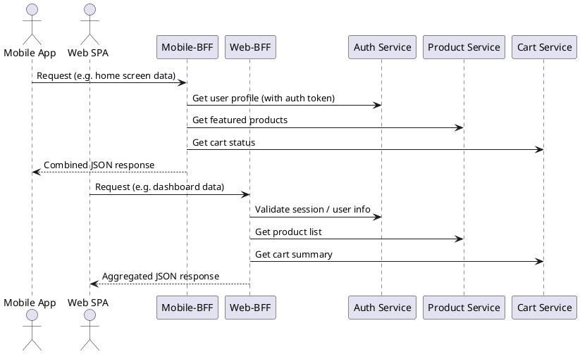

Got it. I’ll draft a detailed executive overview titled “Backend-for-Frontend (BFF): Tailored Gateways for Device-Optimised UX” with a strong narrative and all specified sections, including a `plantuml` diagram and key takeaways. I’ll let you know once it's ready for review.

# Backend-for-Frontend (BFF): Tailored Gateways for Device-Optimised UX

**TL;DR:** Backend-for-Frontend (BFF) is a microservice pattern where each client (mobile, web, etc.) gets its own lightweight backend service. A BFF aggregates and shapes data from many microservices into one optimized response for its client, reducing chatty API calls and improving user experience. This approach decouples UI-specific logic from generic APIs, enabling faster, independent releases and better performance for each device type.

## Motivation: Over-Chatty Clients and the Case for a BFF

Modern apps often use dozens of microservices. Without a BFF layer, a single screen might force a mobile or web client to make many fine-grained calls to different services. This “chatty” interaction wastes battery and bandwidth on mobile, adds latency, and forces the frontend to do heavy data composition. For example, a mobile app on a slow network might need product info, user profile, and cart status – calling each microservice separately is slow and inefficient. A generic one-size-fits-all API can’t easily fix this: if it tries, it becomes bloated and slow to change. Teams end up queueing for changes on a monolithic API backend, which bottlenecks feature delivery. BFFs tackle these pains by inserting a dedicated aggregator between the UI and microservices. Each BFF delivers exactly what its client needs in one go, sparing the client from multiple round trips and data massaging. This focused design leads to fewer calls (especially critical for mobile UIs that need **fewer** connections and smaller payloads) and faster, more tailored user experiences.

## Core Anatomy: Client-Specific Backends and Shared Contracts

In a BFF architecture, **every client type gets its own backend service**. Instead of one massive gateway, you might have a **Mobile-BFF**, **Web-BFF**, maybe a **Desktop-BFF** or even a **Partner-BFF**, each exposing a client-optimized API. These BFFs sit between the frontend and the **downstream microservices** (e.g. Auth, Product, Cart services). Clients send requests to their BFF, which in turn calls the necessary internal services. An optional **API Gateway or edge proxy** may still front these BFFs for cross-cutting concerns like global routing, but the BFFs themselves handle most of the request orchestration. All BFFs and UIs must agree on **shared contracts** – for instance, using common DTO schemas or GraphQL types – to ensure the data shape the BFF returns matches what the UI expects. (Some teams even auto-generate client models from BFF OpenAPI/GraphQL schemas to keep contracts in sync.) Crucially, each BFF is **tightly coupled to its client’s needs** and is usually owned by the same team that builds that UI. This way, the team can evolve the BFF and the frontend together without breaking others.

## BFF’s Duty Roster: What Does a BFF Do?

A BFF’s job is to simplify and optimize communication between a specific frontend and the backend. Its responsibilities include:

* **Request aggregation:** A BFF takes a single client request and fans out calls to multiple microservices, then **combines (fans in)** their results. For instance, when a mobile app needs user info, products, and cart data, the Mobile-BFF calls all three services and merges the data into one response. The client gets everything in one round-trip.

* **Response shaping and filtering:** The BFF **transforms and trims** service responses to exactly what the UI needs. Unneeded fields or extra data are removed to avoid bloating the payload. The BFF can also massage data formats (e.g. combining two service responses into one composite JSON model) so the frontend doesn’t have to. Essentially, the BFF provides a **bespoke API** tailored to its client.

* **Authentication and authorization propagation:** Rather than each microservice handling external auth tokens, the BFF takes care of **auth on behalf of the client**. It might verify an OAuth access token from the client, exchange it for an internal token (like a JWT with internal claims), and propagate that when calling downstream APIs. This keeps sensitive credentials off the client and ensures internal services see a consistent, trusted identity (often the BFF itself is a confidential client authorized to act on the user’s behalf). The BFF essentially becomes an OAuth/OIDC **token bodyguard**, managing refreshes and embedding tokens in outgoing requests so that internal services receive properly authenticated calls.

* **Protocol and format adaptation:** BFFs can bridge protocol gaps. If the client speaks GraphQL or gRPC and the backend only offers REST/JSON (or vice versa), the BFF handles the translation. For example, a Web-BFF might expose a GraphQL endpoint to the UI but under the hood call a cluster of REST microservices and then construct a GraphQL response. Or it might accept HTTP/JSON from a mobile app, but call internal gRPC services and convert their binary responses to JSON. BFFs thus act as **adapters**, making sure clients and services communicate seamlessly despite protocol mismatches.

* **Conditional caching:** Often BFFs implement caching strategies to boost performance. A BFF can cache certain responses (or fragments) for a short Time-To-Live if the data is not volatile, so repeated client requests are served faster. For instance, a Mobile-BFF might cache the static list of product categories for a few minutes. It may do **coarse-grained caching** (entire aggregated responses) or **fine-grained** (caching individual service call results), and apply cache invalidation based on headers or events. This caching is done judiciously – only when it won’t serve stale data – to reduce load on downstream services and latency for the user.

Everything the BFF does is in service of giving the client a **concise, speedy, and convenient API**. It basically offloads heavy lifting from the frontend (and from generic backends) into a purpose-built middle tier.

## BFF vs General API Gateway: Scoped Focus vs Global Front Door

It’s easy to confuse BFFs with API Gateways since both sit between clients and services. The difference comes down to **scope and purpose**. An **API Gateway** is typically a shared entry point for all clients – a general reverse proxy that handles cross-cutting concerns (logging, auth, rate limits) and routes requests to many services. A **BFF**, in contrast, is scoped to a specific client or UI and encapsulates **UI-specific aggregation and logic**.

* **Per-client focus and ownership:** Each BFF is owned by the frontend team using it, allowing rapid changes to meet that UI’s needs. The gateway is usually maintained by a platform team and must serve all clients uniformly. With a gateway, mobile, web, and other clients all hit the same endpoints; with BFF, mobile and web have distinct endpoints and can evolve independently. This per-client ownership means BFFs can have faster, decoupled release cycles (e.g. the mobile team can deploy Mobile-BFF changes without coordinating with web).

* **UI-centric domain logic vs cross-cutting logic:** BFFs are free to include **presentation-layer logic** – for example, combining product and cart data or mapping internal error codes to user-friendly messages – because they are essentially part of the frontend layer. In contrast, a general gateway should avoid any business or UI logic; it sticks to **cross-cutting concerns** like authentication, SSL termination, routing, and simple transformations. Think of a gateway as infrastructure plumbing, whereas a BFF can contain “last-mile” application logic for the UI.

* **Monolith risk:** A single API gateway that serves all clients can become a **bottleneck and bloated** over time, as it must handle every client’s requirements in one place. This often leads to a “mega-gateway” that’s hard to maintain – effectively a new monolith doing aggregation for everyone, violating microservice autonomy. BFFs avoid this by splitting the gateway by client type, so each remains small and focused. In Sam Newman’s words, a general-purpose API backend tends to accumulate multiple responsibilities and require its own team, turning into a “smart middleware” that isn’t aligned to any single business domain. BFFs, by limiting each service to a single consumer or experience, keep things **small and changeable**, and prevent a central gateway from becoming a development choke point.

In short, an API gateway is a **broad front door** (often still used for global concerns and to hide internal architecture), whereas a BFF is a **tailored concierge** for a given client. They can coexist: you might have an edge gateway that authenticates and then routes traffic to different BFFs. But the BFF pattern ensures no one gateway service turns into an oversized, slow-moving dependency.

## Data Orchestration in BFF: Fan-Out, Batching and Resilience

A core strength of BFFs is smart **data orchestration** – they coordinate multiple service calls so the client doesn’t have to. Instead of a user’s device making sequential calls to Service A, B, and C (a potential latency *waterfall*), the BFF can call all needed services in parallel and compile the results. This **fan-out/fan-in** approach markedly reduces total wait time. BFFs often use asynchronous or multithreaded calls to fetch data concurrently. They can also **batch requests**: for example, if a screen needs details for 10 product IDs, the BFF might call the Product service with one batch request (if supported) or fire off 10 calls in parallel, instead of the client doing it one-by-one.

BFFs also handle **fallbacks and partial failures** gracefully. Because they sit between the UI and many services, they can implement **resilience patterns** like circuit breakers, retries, and default responses. If one downstream service is slow or down, the BFF can return partial data from others or a cached/default value for that segment, rather than failing the entire client request. For instance, if the recommendations service times out, the BFF might still return the page with other data and just omit or stub the recommendations section. Good BFFs employ timeouts and **fallback defaults** to avoid halting the UI unnecessarily. They translate low-level errors into something the client can handle (or into a graceful degradation). Logging an error internally while still delivering what data is available improves resilience and user experience.

Effective BFFs also implement **caching** where appropriate. They might keep an in-memory cache or use an external cache for frequently needed data with a short TTL. For example, caching the “product of the day” for 5 minutes can avoid repeated database hits. Fine-grained caching might store individual service responses (like a user’s profile data) so that if another request comes in for the same user soon after, the BFF needn’t call the Auth service again. Coarse-grained caching might store entire aggregated responses for certain query parameters. Developers must balance cache granularity and freshness – **“coarse vs fine TTL caches”** – to maximize speed without serving stale data.

Lastly, orchestration includes handling data shape mismatches. If Service A returns data in one schema and Service B in another, the BFF merges or normalizes them into the unified format the client expects. This might involve data transformations or enrichment (for example, after getting a product and inventory info from different services, a BFF could combine them into one “productAvailability” JSON object). The BFF essentially acts as an **orchestrator and composer** of data: making sure multiple backend responses turn into one cohesive, usable payload.

## Security: Protecting Tokens, Throttling, and Safe Calls

Security is a first-class concern in BFF design. Because the BFF is a server-side component under our control, we can use it to **shield the frontend from direct exposure to the wild backend**. Key security aspects include:

* **Token exchange and storage:** A major benefit of BFFs is keeping sensitive tokens and secrets off the client. In an OAuth scenario, instead of a SPA or mobile app handling OAuth flow and access tokens, the BFF can do it as a confidential client. The BFF may perform an OAuth authorization code flow, receive tokens from the auth server, then mint its own **short-lived JWT** for the client’s session. The client never sees the real access token or client secret; those stay on the server. The BFF can then include that JWT or an internal token on requests to downstream services. This **“token mediation”** means that if the client is compromised, the damage is limited (no long-lived tokens leak), and internal services only see tokens from a trusted BFF. As one author put it, a BFF is like a *bodyguard* for your OAuth tokens, “keeping them safe and sound on the server-side”. It also allows the BFF to **augment tokens** – for example, adding user roles or permissions into a new JWT – giving fine-grained control internally.

* **Cookie-based sessions and CSRF protection (for web):** Web SPAs often use a BFF to avoid handling tokens in the browser at all. The BFF can manage an HTTP-only secure cookie as a session identifier for the SPA. Because the SPA only calls its BFF (not various domains), we can enforce strict SameSite cookies to mitigate cross-site attacks. The BFF must also implement CSRF protections for state-changing endpoints, since cookies will be automatically sent by the browser. Techniques include synchronizer tokens or double-submit cookies to ensure that requests originate from the SPA. In a proper BFF setup for a web app, the **session cookie is Secure, HttpOnly, and ideally SameSite**, and the BFF has measures to **prevent Cross-Site Request Forgery**. These measures ensure that even though we’ve reintroduced cookies (for security benefits), we’re not opening up CSRF vulnerabilities.

* **Rate limiting and quota enforcement:** Since each BFF is dedicated to a client type or app, we can apply **rate limits specific to that client’s usage patterns**. For example, you might allow a higher request rate from a web app (running on desktops) but throttle mobile clients more aggressively if needed to protect backends on flaky networks. Or set different thresholds for third-party partner BFFs vs first-party apps. The BFF (or an upstream API gateway) monitors incoming traffic and rejects or slows requests that exceed the allowed rate, preventing abuse or runaway loops from overwhelming the microservices. This per-client throttling provides a safety valve tailored to each channel.

* **mTLS and secure service calls:** In zero-trust environments, BFFs use **mutual TLS** when calling internal microservices to authenticate themselves at the connection level. Each BFF can present a client certificate to prove its identity to downstream services. This ensures only authorized BFF services (and not an impersonator) can consume internal APIs. Similarly, all traffic between the BFF and backends should be over TLS even within a private network. Many organizations also restrict backend APIs to only accept calls from whitelisted BFF instances or IPs. By isolating external traffic at the BFF, internal services remain hidden and protected behind it.

* **Passing user context securely:** BFFs propagate the **user’s identity and permissions** in a secure way. Rather than the frontend passing a user ID that could be spoofed, the BFF attaches a verified user context (e.g. a JWT or an auth header) on internal calls. This context is often enriched: the BFF might consult an auth service or user info service to get roles/permissions, ensuring each downstream call has the necessary auth info. This propagation is safer than pushing that logic to every client or every microservice.

Overall, BFFs create a **security buffer**. The BFF can validate inputs, sanitize requests, and block anything malicious before it hits core services. It’s also a choke point to enforce **policies** (IP allowlists, input validation, etc.). Combined with an upstream API gateway or CDN, the BFF pattern reduces the attack surface: only the BFF endpoints are exposed externally, and they are hardened and monitored closely.

## Observability: Tracing the Journey from UI to Microservice

When a BFF is introduced, observability becomes critical to maintain insight into the now-indirect client interactions. Good practices include:

* **End-to-end request tracing:** Generate or propagate a **correlation ID** for each client request and pass it along to downstream service calls. For instance, when a client request hits the BFF, the BFF might assign a unique request ID (or use one provided by the client). It then includes this ID in outbound calls (often via an `X-Request-ID` or trace context header) so that logs from the BFF and all microservices can be tied together. This way, if a mobile user action triggers 5 service calls via the BFF, you can trace them all in logging or APM tools using the common ID. Many BFFs integrate with distributed tracing systems (like Zipkin or OpenTelemetry), acting as the parent span that forks child spans for each service call. This stitched trace helps pinpoint slow segments and debug issues across service boundaries.

* **Centralized logging and metrics:** Since all client interactions funnel through BFFs, they are an ideal point to log every request and collect metrics. The BFF logs can record the incoming request details, the calls made to each backend (with durations and outcomes), and the final response sent to the client. This provides a consolidated timeline of what happened for each user request. Aggregating these logs allows building metrics like request rates, error counts, and latency distributions per endpoint and per client type. In fact, one advantage of a BFF is having this single choke-point to instrument – much easier than trying to piece together client-side logs. As noted in gateway patterns, having all traffic pass through a single service is perfect for consistent logging and monitoring of API usage. BFFs should emit metrics such as request latency (overall and per downstream call), error rates (including partial failures), and possibly custom business metrics (e.g. how many items in cart on average, if that is gleaned). This data can feed into dashboards and alerts (like, “Mobile-BFF 95th percentile latency > 500ms” alerts).

* **Synthetic transactions and probes:** To ensure the whole chain (UI → BFF → services) is working, teams often set up **synthetic requests** – automated probes that periodically call BFF endpoints with known test scenarios. These can run from various locations (or via a monitor service) to simulate user interactions. Because the BFF encapsulates a lot, a synthetic probe hitting the BFF and verifying the response is a good proxy for end-to-end health. If a probe fails, it might indicate an issue in one of the downstream services or the BFF itself. By monitoring BFF endpoints with such canaries, you catch problems proactively.

* **BFF-level SLOs:** Each BFF should have its own **Service Level Objectives** for availability and performance, reflecting the user impact of that layer. For example, you might aim for the Web-BFF to return responses in under 200ms 99% of the time, and have 99.9% uptime. Because a BFF is on the critical path for user requests, its reliability directly influences user experience. Teams track these SLOs and treat BFF issues with the same urgency as front-end outages. Real User Monitoring (RUM) from the frontend (timing how long API calls take) can be correlated back to BFF metrics, to ensure the BFF’s performance aligns with what real users see. By tying RUM data (which might measure total time for the app to get data) with BFF logs (which measure internal handling time), teams can pinpoint whether slowness is in the network, the BFF, or downstream.

* **Analytics and A/B test instrumentation:** Since BFFs often know about the user and the request context, they can log events for analytics or feature flags. For example, if doing an A/B test of a new feature on mobile, the Mobile-BFF can tag responses or log which variant was served to the user, making it easier to analyze later. The BFF sits at a vantage point where it can observe patterns (like “user called this sequence of APIs”) and help correlate them with front-end behavior.

In summary, treat the BFF as a **control tower**: instrument it to see all flights (requests) coming and going. Use IDs to connect the dots into the backend, set up monitors to continuously check critical flows, and define SLOs so you know when the BFF (and by extension the user experience) is degrading. Observability in a BFF-world ensures that even though we added a layer, we haven’t lost transparency into our system’s behavior.

## Deployment & Scaling: From Containers to Serverless and the Edge

**How do we deploy BFF services?** The good news is BFFs are stateless by design (they just aggregate calls), which makes them easy to scale horizontally. Common deployment models:

* **Containerized microservice:** Many teams run BFFs as containerized services (Docker/Kubernetes) just like any other microservice. Each BFF might live in its own repo with its own CI/CD pipeline. Scaling is straightforward: deploy more instances of the BFF behind a load balancer when load increases. Because each BFF only serves one type of client, you can scale them independently – e.g. if mobile traffic spikes but web traffic is steady, scale out Mobile-BFF pods without touching Web-BFF. This **independent scaling** prevents one client’s load from swamping others.

* **Serverless (Functions):** A modern approach is deploying BFFs as serverless functions (for example, an AWS Lambda per client API). In this setup, an API Gateway triggers a Lambda function which contains the BFF logic. The benefits are **zero server management**, automatic scaling, and pay-per-use cost efficiency. Each client’s API can scale from zero to millions of requests seamlessly, and you only pay for actual usage. This works well when traffic is spiky or when you want to quickly deploy many small BFF endpoints. For instance, a “Checkout-BFF” Lambda might run only when a user actually checks out. One thing to note: cold starts and execution limits (e.g. Lambda’s 15-minute max runtime) should be considered if BFF calls many services. But overall, serverless BFFs are increasingly popular for their simplicity and built-in scaling.

* **Edge deployment:** Some teams push parts of BFF logic out to the CDN or edge locations (using platforms like Cloudflare Workers, Fastly Compute\@Edge, etc.). An **edge BFF** can run very close to users globally, reducing latency. This is great for use cases like A/B testing or simple aggregations that can be done in a lightweight JS worker. For example, an edge worker might aggregate a couple of cacheable content APIs and return a combined response from a nearby POP (point of presence). However, edge environments have limitations (memory/CPU/time limits), so complex BFF operations may not fit. Still, certain BFFs can be deployed at the edge to give snappier responses – effectively a globally distributed BFF layer. Other BFFs run at the origin data center where they have low-latency access to all microservices.

In terms of scaling and release management, each BFF typically has a **separate deployment pipeline** aligned with its owning team. Feature flags are widely used in BFFs to toggle new aggregations or endpoints on/off per client version. For example, if a new mobile app version expects a different response format, the Mobile-BFF can detect the app version (from headers) and serve either the old or new format, controlled by a flag. This facilitates safe rollouts and backward compatibility.

Finally, consider *where* in the request path the BFF lives. Often, an API gateway or load balancer will route incoming requests to the appropriate BFF (say by subdomain or URL path). Some architectures combine gateway and BFF – e.g. using a gateway product that can run custom code (like AWS API Gateway with Lambda, or Apigee extensions). Others deploy BFFs as ordinary services and handle routing via DNS or a reverse proxy. Either way, ensure that scaling up a BFF is easy: container BFFs should have health checks and autoscaling rules, serverless BFFs should have appropriate concurrency limits and throttles to avoid overwhelming backends.

To summarize, **decouple the infrastructure**: each BFF is an independent service or function that you can build, test, deploy, and scale on its own terms. Whether containerized or serverless, BFFs should be lightweight enough that spinning up more instances is quick and cost-effective.

## Release Independence: Parallel Client Deliveries and Versioning

One big advantage of the BFF pattern is that it lets each frontend and its backend evolve on **their own schedule**. In practice:

* **Independent release cadences:** Mobile apps, web apps, and third-party clients all update at different speeds. By giving each one a dedicated BFF, we ensure a web deployment doesn’t have to wait for a mobile app store release, or vice versa. The web team can push changes to Web-BFF daily if needed, without affecting mobile. Similarly, mobile features can be rolled out in the Mobile-BFF even before the mobile app is available (or to support a staged mobile app rollout). This decoupling reduces coordination overhead and speeds up development. Teams can do parallel sprints and deployments, confident that their changes won’t break other clients.

* **Supporting multiple versions:** Especially for mobile, users don’t all upgrade immediately. BFFs often need to support a **version matrix** – e.g. mobile app v1.0 and v2.0 might expect slightly different API responses. Instead of cluttering a single API with version checks, the Mobile-BFF can handle it internally or via separate endpoints. Some approaches include URL versioning (e.g. `/v1/endpoint` vs `/v2/endpoint` handled by the BFF) or runtime detection (the app could send a header like `X-App-Version`, and the BFF conditionalizes logic). Because the BFF team controls both sides, they can manage backward compatibility gracefully, retiring old versions when app usage drops. This agility was much harder when a generic API had to cater to every client’s version; in those cases, deprecating anything was risky. With BFFs, **version management** becomes a focused concern per client.

* **Canary releases and A/B testing per client:** BFFs enable safer rollouts by client type. For instance, you might deploy a new Mobile-BFF version to 5% of mobile users (perhaps selected by some consistent hash or feature flag) while others use the old version. Since the BFF is separate, you can route traffic selectively without impacting web. You could even run two versions of Web-BFF and do A/B tests for web users (some get responses with experimental data, others standard). This fine-grained targeting builds on the idea that each BFF deals with a homogenous audience, so it’s easier to do experiments or gradual rollouts within that slice. The BFF can also inject **experiment flags or variant markers** into responses to help the frontend (and analytics) know which variant was used.

* **Feature toggles and kill switches:** By controlling the last-mile backend logic, BFFs allow quick toggling of features. If a new combined response is causing issues in production, you can disable that code path in the BFF without touching the microservices or rolling back the entire app. This is particularly useful for mobile apps where a bug in the app can’t be fixed until users update – but you might mitigate it by adjusting what the BFF sends to that version. Essentially, BFFs give a server-side lever to handle unforeseen client problems or to turn on features gradually.

* **Coordinated schema evolution:** When adding a new field or removing an old one, the UI team can update the BFF and the UI in tandem. For example, roll out BFF support for a new field, then update the app to use it – or vice versa, depending on strategy. Since one team controls both ends, they can do **staged rollouts** (e.g. BFF sends both old and new fields during transition) to ensure compatibility. This parallel rollout freedom is a key reason companies adopt BFF: it **decouples frontend and backend timelines** enough to avoid the classic “everybody coordinate the release at midnight” scenario.

In summary, the BFF pattern aligns well with microservice and agile ideals: each piece (each client+BFF pair) can ship and scale independently. Organizations like Netflix have multiple client-specific backends that allow their UI teams to push updates at will, confident that they’re not waiting on or breaking other platforms. This autonomy yields faster feature development and a more responsive product development process.

## Performance Knobs and Optimizations

While a BFF simplifies client interactions, it also introduces a new hop. To ensure this extra layer doesn’t become a bottleneck, engineers apply various performance optimizations:

* **Connection pooling & keep-alive:** BFFs should reuse connections to backend services rather than creating new TCP connections for each request. In practice, this means enabling HTTP keep-alive for REST calls and using connection pools for databases or gRPC channels. A well-tuned BFF will maintain persistent connections to downstream services so that calls are fast and avoid handshake overhead. For example, a Node.js BFF can use a keep-alive HTTP Agent, or a Java BFF might use a pool of HTTP client connections. This is particularly important if the BFF fan-outs to many services on each request – creating new connections each time would be very costly.

* **HTTP/2 multiplexing:** If possible, leverage HTTP/2 (or HTTP/3) for calls between BFF and microservices. HTTP/2 allows multiple requests to be in flight concurrently on a single connection, **multiplexing** streams over one TCP connection. This means the BFF can send requests to Auth, Product, Cart services all at once over one connection rather than three separate connections, cutting down on network overhead. Many modern service meshes or API gateways support H2 for service calls, which BFFs can take advantage of. The result is improved throughput and lower latency, especially in high RTT (Round-Trip Time) environments, as requests no longer queue behind each other on the network.

* **Server-side includes / fragment assembly:** In web page generation, “Server-Side Includes” refer to composing HTML fragments on the server. In the context of BFF, a similar idea is to assemble pieces of data on the server side so the client gets a ready-to-use payload. This avoids the client making follow-up requests for subcomponents. For example, instead of the client getting a product list and then calling for details of each product, the BFF could include detailed info for top products directly. Another angle is using techniques like ESI (Edge Side Includes) at a CDN to let cached fragments be stitched together. The principle is to **do composition as far upstream as possible**. Whether at the BFF or at an edge cache, combining responses early can reduce overall latency perceived by the user.

* **GraphQL persisted queries:** When the BFF exposes a GraphQL API, one performance concern is the overhead of parsing and optimizing large query strings on each request. **Persisted queries** offer a solution: the client only sends a pre-registered query ID (or hash), and the server loads the full query from storage. This saves bandwidth and processing time. Persisted queries essentially turn GraphQL into something like an RPC call – the query is predefined, and the client just asks for it by reference. This speeds up client load times (since less data is sent over the wire) and also acts as a safelist of allowed queries, which can improve security. Many GraphQL BFF implementations (Apollo Server, etc.) support Automatic Persisted Queries (APQ) to seamlessly cache queries after the first run. Companies like Toast have employed persisted queries to improve GraphQL performance and caching.

* **Asynchronous and streaming responses:** In some cases, a BFF can send data to the client in chunks as it arrives (if the client supports it). For example, using HTTP chunked encoding or a WebSocket, a BFF might stream parts of the response as soon as each service responds. This is an advanced optimization – essentially overlapping data transfer with data fetching – but can yield a snappier experience (the client starts rendering partial data while the rest is loading). Technologies like **Server-Sent Events (SSE)** or GraphQL’s `@defer` directive leverage this idea. It’s worth considering if your UI can consume partial data gracefully.

* **Efficient coding practices:** Under the hood, a BFF should be as lean as possible. Use non-blocking I/O or multithreading to handle many concurrent requests efficiently. Avoid unnecessary data copies or transformations. If using a garbage-collected language, be mindful of memory to prevent GC pauses. Essentially, treat the BFF as a high-throughput system: profile it, watch for hot spots (like a slow JSON serialization library), and optimize accordingly. Techniques like caching thread pools, using binary protocols internally (if all parts support it), etc., can all help reduce latency.

In practice, a well-optimized BFF adds only a few milliseconds overhead while saving potentially hundreds of milliseconds by reducing round trips and payload sizes. Keep measuring and tuning the BFF – it is on the front line of user interactions, so every bit of latency it can shave off or prevent counts.

## Governance & Ownership: Who Takes Care of the BFF Layer?

Effective use of BFFs requires clarity in **team ownership and governance**:

* **Frontend team ownership:** Typically, the team that builds a particular frontend (say the iOS app team or the web portal team) also owns the corresponding BFF service. This alignment ensures the BFF evolves in lockstep with UI needs. Frontend developers can add an API in the BFF and immediately use it in the UI without having to convince a separate backend team. It also means if a UI bug is caused by backend data, the same team can fix it on the BFF side. This autonomy greatly speeds up development and fosters a *“you build it, you run it”* mentality for those client-specific backends. In practice, BFF codebases often reside in the frontend team’s repo or an adjacent one, and are included in that team’s regular scrum/Kanban work.

* **Contracts as code:** Since BFFs define the API contract for their clients, treating those contracts formally is important. Many teams employ **API specifications** (OpenAPI/Swagger for REST, GraphQL schemas, or gRPC proto files) that act as the source of truth for what the BFF provides. These can be version-controlled and even tested against (with contract tests) to ensure the BFF and UI remain in sync. Some share models between the BFF and client (e.g. TypeScript type definitions) to avoid drift. Automated tools might generate client SDKs from the BFF’s API spec. All of this ensures that the contract – the agreed data structure and behavior – is managed “as code” and changes are deliberate. Before a BFF changes a response shape, for example, they might update a schema file and run it through a compatibility checker. This discipline prevents breaking the client and helps coordinate deprecations or additions.

* **Standards and linting:** If you have multiple BFFs (one per client platform, possibly more), it’s wise to maintain some consistency. Organizations set **coding standards, linters, and guidelines** for BFF implementations. This covers things like error handling format, logging structure, security practices (never log sensitive data, etc.), and performance guidelines. Some even create a *BFF framework or library* that all teams use, providing common utilities (for auth, metrics, caching, etc.). For instance, a shared BFF base library might handle propagating trace IDs or provide a consistent HTTP client wrapper for calling microservices. By linting and sharing code where appropriate, you avoid each BFF team reinventing the wheel or diverging in problematic ways. However, teams should still have freedom to optimize for their use case – governance is about consistency in approach, not stifling innovation.

* **Deprecation and version management:** A governance aspect is how to retire or change BFF endpoints. Suppose the web app no longer needs a certain field – how long does the Web-BFF keep supplying it for older clients? Processes need to be in place to monitor usage (maybe the BFF logs if any client is still asking for an old version) and eventually remove support. Coordinating this is easier than with public APIs since the consumer is known, but it still requires communication (e.g. mobile team tells mobile-BFF team that version 1.0 is end-of-life, so they can drop compatibility code). Governance might set rules like “support at least two versions back” or similar.

* **DRIs for cross-cutting issues:** While each BFF is separate, some concerns affect all (security patches, library upgrades, etc.). Many organizations assign a **tech lead or platform team** to oversee cross-BFF health. For example, if a critical vulnerability is found in the common BFF auth library, someone coordinates that all BFFs get updated promptly. Or if there’s a need to introduce a new logging format, there’s an effort to implement it across all BFFs. Having a designated person or group (sometimes called a BFF guild or similar) ensures that these cross-cutting fixes and improvements have owners and don’t fall through the cracks. It’s similar to how microservice architectures handle platform concerns – BFFs may form their own little ecosystem that benefits from shared attention.

* **Avoiding silos:** One pitfall is BFF teams becoming siloed and duplicating logic. Governance should encourage communication among BFF owners. Regular syncs or code reviews across BFFs can reveal opportunities to share code or approaches. For example, if the web and mobile BFFs both needed to implement image resizing logic, maybe that indicates it should be a shared service or library instead. By comparing notes, teams ensure the BFF layer doesn’t become a bunch of wildly different approaches solving the same problems.

In summary, treat BFFs as first-class parts of your architecture: give them clear owners (usually the UI teams), but also provide overarching guidance so they don’t grow wild. With contracts managed in code and some shared tooling, the BFF layer remains robust and maintainable.

## Evolution & Alternatives: GraphQL Federation, Edge Functions, and Beyond

The BFF pattern isn’t the only way to solve the multi-client problem – it’s just one of the more straightforward and team-friendly ways. It’s important to know alternatives and when a BFF is still the right choice:

* **GraphQL API Gateway / Federation:** One popular alternative is to expose a **single GraphQL endpoint** for all clients, instead of maintaining multiple RESTful BFFs. GraphQL allows clients to query exactly the data they need, which addresses over- and under-fetching in a different way. Some companies adopt GraphQL *in place of* BFFs, essentially letting the GraphQL server act as a unified BFF for all clients. Each client can request its specific fields, and the GraphQL engine fetches from microservices (resolvers) to fulfill the query. This can avoid having to maintain separate codebases for each client and prevents “BFF sprawl”. Additionally, **GraphQL Federation** (as used by companies like Netflix and Toast) lets you combine schemas from multiple domain services into one federated graph, so teams contribute their part of the API and clients see one unified graph. The trade-off: GraphQL introduces its own complexity (a schema to manage, performance tuning for large queries, caching challenges, etc.). In some cases, teams found that having dozens of mini-BFFs (each with GraphQL resolvers duplicating REST logic) became hard to maintain. Federation helped by centralizing that logic but requires strong schema governance. **When BFF still wins:** If your clients have vastly different needs or you want true isolation between client teams, separate BFFs might be simpler. Also, for binary protocols or specialized clients, GraphQL might not be a fit. In short, GraphQL can reduce the need for multiple BFF services by offering a flexible one-stop API, but it shifts complexity into schema design and query orchestration. BFFs remain a good choice when you want maximal decoupling and simple, specific endpoints per client.

* **Edge computing and CDNs:** Another alternative is to push aggregation to the edge using **CDN edge functions or workers**. For example, instead of a server in a central region doing the BFF work, a Cloudflare Worker could fetch data from two origin endpoints and combine them. This has the benefit of global distribution (low latency) and possibly leveraging CDN caching for parts of the data. Some refer to this as “edge BFF”. It works best for relatively simple compositions where network calls to origin are not too numerous (edge functions have limits) and where partial results can be cached. One can also serve stale data from edge cache if origins fail, improving resilience. However, debugging and developing complex logic in edge environments can be tough, and not all backend services may be exposed to the edge for security reasons. **When BFF still wins:** If your aggregation logic is complex or requires secure access to many internal services, a normal BFF service in the backend is easier to build and maintain. Edge functions shine for quick, stateless tasks and cache-heavy scenarios, but a stateful or more sophisticated orchestration might outgrow them.

* **Full-stack frameworks and server components:** Modern web frameworks (like Next.js with React Server Components, Remix, or Blazor) blur the line between frontend and backend. They allow fetching data on the server at page-render time or bundling server-side logic with the front-end codebase. In a scenario like Next.js, you might not need a separate BFF service – you can call microservice APIs directly in `getServerSideProps()` or API routes, essentially achieving the same effect as a BFF but within the web project itself. Similarly, mobile backends like Firebase or Realm allow mobile apps to query data without a custom server. These approaches can cover some use cases of BFF by simplifying data access in the framework. **However**, they often only work for that specific client and don’t easily share logic across clients. If you have one web app, using Next.js data fetching is great; but if you later add a mobile app, you might end up writing similar logic again. Also, not all companies want to tie themselves to a specific full-stack framework. **When BFF still wins:** If you need a clear API boundary (for third parties, or just for separation of concerns) and to support multiple client types, a dedicated BFF service can still make sense even if your web framework is capable. BFFs are framework-agnostic and can serve many clients, whereas embedding backend calls in a web app is, by definition, only for that web app.

* **tRPC and other RPC frameworks:** Some teams use RPC frameworks (like tRPC, gRPC-web, etc.) to let frontends call backend procedures directly with types and without writing a dedicated BFF. For instance, gRPC-web allows a browser to call gRPC services via a proxy. This can eliminate the need for a REST/GraphQL BFF by essentially pushing the client logic into generated stubs. But these still often require a thin server-side layer (like an API gateway that speaks gRPC to backends and HTTP to the client). **When BFF still wins:** BFFs can hold custom logic and mix multiple services easily, whereas pure RPC might require the client to orchestrate calls or the services to call each other. If orchestration is needed, you’re back to needing a BFF or aggregator somewhere.

In summary, **BFF is not a silver bullet**, but it remains a powerful pattern for many situations. Organizations sometimes start with BFFs and later consolidate to GraphQL as they mature (to reduce duplication), or start with a single GraphQL endpoint and later split into BFFs when that endpoint becomes too unwieldy for different client needs. The key is evaluating your team structure and needs: BFFs shine when you want to **empower frontend teams** to move quickly with their own tailored backends. Alternatives like GraphQL shine when you want a **product-wide unified API** and can invest in strong schema governance. Often, a mix is used – e.g. a GraphQL BFF that federates multiple services but still perhaps one GraphQL schema per client type to avoid one-size-fits-all (a hybrid approach).

## Anti-Patterns & Pitfalls: What to Avoid

As with any architectural pattern, there are ways BFFs can go wrong. Be mindful of these common pitfalls:

* **The Mega-BFF (Re-Monolith):** If you collapse too many responsibilities into one BFF (or reuse the same BFF for multiple clients with divergent needs), you risk creating a new monolith. A BFF should remain **small and focused** on one client or cohesive experience. A single BFF serving web, mobile, and public APIs will grow in complexity and team contention – defeating the purpose of autonomy. Avoid the temptation to save infrastructure by combining BFFs; the whole point is to keep them slim. If you notice a BFF has dozens of endpoints, each for different clients or purposes, consider breaking it into separate services. Netflix, for example, had separate BFFs for different device platforms (mobile, TV, etc.) to keep each one manageable. A mega-BFF not only is harder to maintain but can become a performance bottleneck and a single point of failure for many systems.

* **Duplicating domain logic:** BFFs are meant for **presentation logic and orchestration**, not implementing core business rules. A pitfall is to start putting significant business decisions in the BFF (because it’s easier than changing a backend service). For instance, if a pricing calculation is copied into the BFF to avoid calling the Pricing service, you now have divergent logic – and likely bugs when the rules update. Always ask: should this logic live in a domain microservice instead? The BFF can call that service rather than do it itself. The BFF should ideally **delegate heavy lifting** to backends and simply coordinate the results. As a rule, if multiple clients or services would benefit from a piece of logic, it probably doesn’t belong solely in a BFF. Duplicated logic leads to inconsistent behavior and technical debt. Keep BFF code lean and focused on assembling data for the user, not making business decisions. (One exception might be formatting or simple conditional tweaks for UX, which are fine in BFF.)

* **Lack of clear separation (coupling):** Sometimes developers tightly couple the BFF and frontend, treating them almost as one app. While these move together, watch out for practices like the BFF directly reflecting internal UI state or being required to change for every minor UI tweak. The BFF should provide a stable API that could even be used by other consumers in theory. Over-coupling can also occur the other direction: a BFF calling internal services in ways that break encapsulation (like reaching directly into a database or assuming knowledge of service internals). Keep the abstraction boundaries clean: the BFF is a client of the microservices – use their public APIs only – and a server to the frontend – serve it a versioned contract. If those lines blur, refactor to restore a clean interface. Otherwise, changes in one layer will unpredictably ripple into others, harming independence.

* **Naive sequential calls (latency waterfall):** A common mistake in early BFF implementations is to call downstream services one after the other, waiting for each to return before calling the next. This **serial fan-out** approach can lead to atrocious latency (sum of all call times, plus network overhead each time). Instead, make independent calls concurrently wherever possible. Use async/await or threads or non-blocking I/O to dispatch requests in parallel. If service A’s result is needed to call service B, that’s fine (that’s an inherent dependency), but don’t serialise calls that aren’t dependent. Also consider the slowest call: if one service is known to be slow, see if its data can be optional or loaded after the main response (perhaps via a separate endpoint or as an async component). The BFF’s value is largely in preventing latency pile-ups – but it requires consciously designing for concurrency. Tools like Promise.all in JavaScript or `parallelStream()` in Java can help. If not addressed, sequential calls can make the BFF layer *slower* than the chatty client it replaced, which obviously negates the benefits.

* **Overcaching or Stale data:** While caching is useful, be careful not to cache things in the BFF that can become stale and inconsistently so. If each BFF caches data differently, you might serve users outdated info. Have a strategy for invalidation – perhaps based on backend events or short TTLs. A pitfall is caching an aggregated response that contains both static and dynamic data; one part becomes stale while others are fresh. It may be better to cache fragments (like a lookup list) and always fetch the dynamic parts. Monitor cache hit/miss and staleness carefully to avoid user confusion or bugs.

* **Too much trust in the BFF:** Sometimes teams think because the BFF is an internal layer, they can relax validation or security on downstream services. But remember, bugs or malicious requests can still propagate. Services shouldn’t blindly trust data from BFFs if they wouldn’t trust it from an external client (the BFF might inadvertently relay bad data). Also, ensure proper error handling – if the BFF passes a slightly wrong parameter to a service, the error should be caught and handled, not buried. In short, don’t let downstream quality slip assuming “the BFF will always fix it”.

* **Neglecting the gateway layer:** If you decide to route client traffic directly to BFFs without an API gateway, make sure to implement important cross-cutting concerns in the BFF (authentication checks, rate limiting, etc.). A pitfall is dropping the gateway and forgetting something like SSL termination best practices or global throttling. Conversely, if you have both gateway and BFF, clearly delineate what each does to avoid duplication or conflict (e.g. don’t let both do payload rewriting in different ways).

The key to avoiding these pitfalls is **constant reevaluation**: Are our BFFs staying lean and focused? Are we accidentally re-introducing a monolith? Is the separation of concerns clear? Periodic architecture reviews of the BFF layer can catch these anti-patterns early. For instance, if a BFF codebase has swelled 10x in a year, ask why – maybe it’s time to split it or move logic down to services. If a BFF has frequent outages due to one downstream service being flaky, consider adding better fallbacks or isolating that service call (circuit breaker). Treat the BFF pattern as an evolving part of your architecture that needs tuning and sometimes pruning.

---

## Key Take-aways

* **BFF Pattern = one backend per client**: Instead of one generic API for all, each client app (mobile, web, etc.) gets a **Backend-for-Frontend** service tailored to its specific needs. This reduces over-fetching and multiple round trips for data.
* **Client-focused aggregation**: BFFs aggregate calls to many microservices into one response, **shaping the data** exactly for the UI. This yields faster, smaller payloads (critical for mobile on slow networks) and moves composition logic off the client.
* **Decoupled teams & releases**: Each BFF is typically owned by the corresponding frontend team. They can develop and deploy UI and BFF changes in parallel, without blocking other clients. Mobile and web can roll out features on their own timelines, with BFFs handling version differences and graceful fallbacks.
* **Not an API gateway (but can complement one)**: Unlike a general API gateway, a BFF carries **UI-specific logic** and only serves one client type. Gateways handle universal concerns (auth, routing), whereas BFFs handle **user experience concerns** (data combining, formatting, minor business logic for display). Avoid turning a BFF into a catch-all mega-gateway – keep it small and focused.
* **Orchestration, caching, resilience**: The BFF coordinates **fan-out calls** to services (often in parallel) and implements patterns like caching, request batching, and fallback defaults to optimize performance. It should use modern techniques (HTTP/2 multiplexing, connection pools) to minimize overhead and support partial responses when some services fail.
* **Security layer**: BFFs act as a **security gate** for clients – managing tokens (e.g. exchanging OAuth tokens for internal JWTs), enforcing rate limits per client, handling web security (cookies, CSRF), and using mTLS or other controls for service calls. They reduce the attack surface by hiding internal APIs behind a purpose-built facade.
* **Monitoring and traceability**: Because all client calls flow through BFFs, they’re the ideal point for **logging, metrics, and tracing**. Implement end-to-end correlation IDs and monitor BFF-specific SLAs. Strong observability on the BFF (and its interactions with downstream services) is crucial to understand and maintain the user experience.
* **Avoiding pitfalls**: Don’t let your BFFs become a new monolith – maintain one per client experience and regularly trim unnecessary logic. Keep business rules in the proper backend services to prevent duplication. And always design BFF calls for concurrency; a naive sequential approach can create latency issues.
