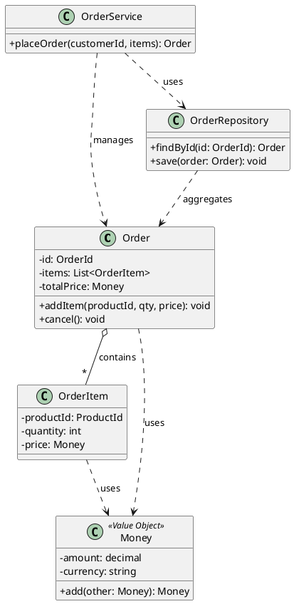

Great. I’ll write a 1,000–1,200-word executive overview titled “Domain Model Pattern: Rich Objects that Capture Business Truth” for intermediate-to-advanced engineers. It will use a narrative, problem-solution style with clear structure, covering each of the 12 required points using real-world business examples like e-commerce and payroll. I’ll also include a PlantUML diagram, a concise TL;DR, and a Key Take-aways section.

I’ll let you know as soon as it’s ready for review.

# Domain Model Pattern: Rich Objects that Capture Business Truth

**TL;DR**: The Domain Model pattern builds software around **rich business objects** that **encapsulate both data and behavior**, unlike procedural scripts. This approach uses **Entities** and **Value Objects** inside **Aggregates** with **Repositories** for persistence, ensuring **invariants** and reflecting a **ubiquitous language**. It trades simplicity for **maintainability**, making complex logic explicit and testable in the model.

## Motivation: From Scripts to Rich Models

When simple **Transaction Script** or **Table Module** approaches break down in complexity, a Domain Model becomes vital. In a transaction-script design, each use case is handled by a procedure or service call, which works fine for trivial logic but can lead to duplication and scattered rules as the domain grows. Table Modules organize logic per database table, but they still separate behavior from individual data records, and tend to bog down as relationships and rules span multiple tables. The **motivation** for a Domain Model is to encapsulate *behavior with data*, meaning each **object** in the model carries not just state but also the logic to manipulate that state. For example, instead of a checkout script calculating order totals and updating rows, an `Order` object could have a `calculateTotal()` method and enforce its own business rules. This leads to code that mirrors real-world concepts and **reuses logic** across scenarios. Domain Models shine in **complex applications** with extensive business rules or where code reuse and consistency are critical. By keeping data and related behavior together, the model ensures that **business invariants** are consistently enforced and easier to maintain, at the cost of a more sophisticated initial design.

## Core Anatomy: Entities, Value Objects, Aggregates, Repositories, Services, Factories

A rich Domain Model is composed of specific building blocks, each playing a distinct role:

* **Entities** – Objects with a unique identity and life cycle. They represent fundamental business concepts that change over time but can be tracked by an ID. For instance, an `Order` or `Customer` entity persists and evolves, identified by keys or IDs. Two `Order` instances with different IDs are distinct even if their content matches.
* **Value Objects** – Immutable descriptors that have no identity of their own, used to measure or describe things. They are defined only by their attributes. Examples include a `Money` value (amount & currency) or an `Address` – if two value objects have the same data, they are interchangeable. Value objects simplify the model by treating certain data as *values* that can be copied or compared whole, and they help keep Entities focused by moving out ancillary data.
* **Aggregates** – Clusters of related entities and value objects treated as a single unit for data changes. Every aggregate has a **root Entity** (aggregate root) that encapsulates the internal elements. All invariants and rules spanning the aggregate are enforced by the root. For example, an `Order` aggregate might include an `Order` entity as root and several `OrderItem` entities, plus value objects like `TotalPrice` or `OrderDate`. The root ensures consistency (e.g. you can’t add an `OrderItem` that violates pricing rules) and is the only entry point for modifying the aggregate. External code holds references only to the root, not the internal parts.
* **Repositories** – Mediators between the domain and the data store, handling the retrieval and persistence of aggregates. A repository provides methods like `findById()` or `save()` to load or persist entire aggregates. This abstracts away database or ORM code from the domain logic. For instance, an `OrderRepository` may fetch an Order aggregate from a database, fully populated with its OrderItems, so that domain code can work with a complete in-memory object graph.
* **Domain Services** – Operations that don’t naturally belong to a single entity or value object. A service is defined in terms of the **ubiquitous language** of the domain, but implements logic that might involve multiple aggregates or external resources. For example, a currency conversion service or a domain service that applies a discount across an entire `Order` would not be a method on a single Entity if it involves complex policy or external info. Domain services should be few, and often wrap domain logic that spans contexts (distinct from application services which orchestrate higher-level processes).
* **Factories** – Responsible for creating complex objects or aggregates in a consistent, valid state. Instead of calling constructors directly (which can get complicated for large aggregates), a Factory encapsulates the assembly of the aggregate, ensuring all invariants (e.g. required fields) are satisfied at creation. For instance, an `OrderFactory` might create an Order with all necessary OrderItems and initial total calculated, so that any new Order is from the start in a correct state.

These building blocks work together to make the model **expressive**. The Domain Model expresses the business **truth** – if something is invalid in real life (like a negative quantity or an order without a customer), the domain objects shouldn’t allow it. The code structure reflects this through Entities and Value Objects with meaningful methods, rather than procedural validations scattered around.

*(Illustration: An **Order** aggregate root containing **OrderItem** entities and using a **Money** value object. An **OrderRepository** retrieves the aggregate, and an **OrderService** (domain service) uses the repository and domain objects.)*

## Domain Logic Patterns: Invariants, Policies, Specifications, and More

Designing the domain layer involves certain patterns to capture business *logic* elegantly:

* **Aggregates and Invariants** – Each aggregate is a consistency boundary, so it enforces *invariants* within. For example, a `PurchaseOrder` aggregate might have an invariant that the sum of line items cannot exceed a spending limit. This rule is checked inside the aggregate (perhaps in an `addLineItem` method or before saving) and never broken by external operations. Aggregates make such rules explicit and prevent partial updates from leaving the system in an inconsistent state. In practice, an aggregate’s root will refuse or roll back any operation that violates its consistency rules.

* **Policy Objects (Strategy Pattern)** – Sometimes business rules are complex or variable (e.g. different discount algorithms, tax computations, or approval policies). In Domain-Driven Design, the **Strategy pattern** is often referred to as a Policy object. For instance, an `DiscountPolicy` interface might define how to compute discounts, with implementations like `SeasonalDiscount` or `BlackFridayDiscount`. The domain model can use these policy objects to apply the correct behavior without hardcoding it. By passing a policy object into an entity method (following *Tell, Don’t Ask* principle), the object can collaborate with the policy to perform the logic. This keeps the domain flexible and aligned with the **ubiquitous language** (calling it a “Policy” makes sense to business experts).

* **Specification Pattern** – A specification is a small boolean logic component that encapsulates a business rule or criteria in an object. For example, instead of hardcoding a rule *“customer must be premium and order total > \$1000 to qualify for free shipping”* scattered in code, you could define a `FreeShippingSpecification` with a method `isSatisfiedBy(Order)` that checks those conditions. Specifications can be combined (AND/OR/NOT) and reused for validation, selection, or enabling certain operations. They promote reuse of **business rules** and keep them in the domain layer, whether for validating an entity’s state or building database queries without leaking SQL into domain code.

* **Double Dispatch and Visitor for Complex Interactions** – In some scenarios, domain objects need to interact in ways where the *runtime* type of both objects matters. A classic example is applying **pricing rules** or tax calculations that vary by product type or customer type. **Double dispatch** is a technique to avoid clumsy `if` or casting logic by letting objects call back into each other to decide the correct method. For instance, an `Order` might have an `applyDiscount(DiscountPolicy policy)` method that calls `policy.discount(this)` – this way, at runtime the right overload (perhaps `SpecialDiscountPolicy.discount(SpecialOrder)` vs `discount(Order)`) is invoked. This pattern, often implemented via the Visitor pattern, lets you extend behaviors cleanly. In short, the object receiving the operation (like an `Order`) defers part of the work to a visitor/policy which then calls a type-specific operation on the original object, achieving a two-way dispatch. It’s an advanced technique to keep logic *encapsulated* and avoid exposing internal state just to calculate outcomes. For example, applying a different discount for `SpecialOrder` vs `RegularOrder` without the service layer needing to inspect types – the `Order` and `DiscountPolicy` collaborate to figure it out at runtime.

* **Self-Encapsulated State** – A cornerstone of a rich domain model is that objects guard their own state. No external code should reach in to manually set an entity’s fields in ways that violate invariants. Instead, entities provide methods (commands) that encapsulate the state change. This ensures any business rule can be enforced at the moment of change. For example, an `Account` entity might have a `withdraw(amount)` method that will **decline** if the account doesn’t have sufficient funds, rather than allowing external code to set a balance arbitrarily. By encapsulating state changes, the domain model maintains **truth**: it’s impossible to create an invalid state without deliberately subverting the model. This pattern aligns with *Tell, Don’t Ask*: we tell objects what we want done, and they ensure it’s done right (or not at all). It also aids testing, since invariants are centralized in the model.

## Fit with Domain-Driven Design: Ubiquitous Language, Bounded Contexts, Anti-Corruption

The Domain Model pattern is at the heart of **Tactical DDD**, but Domain-Driven Design also provides a broader strategic context for it:

* **Ubiquitous Language** – In DDD, the whole team (devs and domain experts) develop a common language for the domain, and the domain model reflects that language. Class names, method names, and module names all come from business terminology. A rich domain model thrives on this: an `Order.aggregateTotal()` or `Reservation.confirm()` method reads like a sentence a business stakeholder might say. The model becomes a crystallization of the domain knowledge in code. Maintaining ubiquitous language means if the business uses a term or concept, the model should include it (or vice versa, if it’s in code, everyone knows what it means in the real world). This makes the model more understandable and ensures that as the domain evolves, the code is updated in lockstep with terminology changes.

* **Bounded Contexts** – In a large system, it’s unrealistic (and undesirable) to have one *mega-model* for the entire business. Instead, DDD splits the system into **bounded contexts**, each with its own domain model that is internally consistent. The Domain Model pattern is applied *within* a bounded context. For example, an e-commerce platform might have separate models for Ordering, Shipping, and Billing – each context has entities/value objects relevant to its part of the business, even if some terms overlap (e.g. “Customer” might mean different things in Sales vs. Support contexts). Within a context, the ubiquitous language is consistent, but across contexts the same word could have different meanings. The Domain Model pattern helps keep each context’s logic clean. If later the system is **evolved into microservices**, typically each microservice corresponds to a bounded context, preserving its rich domain model internally. Bounded contexts allow teams to work on rich models without stepping on each other’s toes and to integrate via well-defined interfaces.

* **Anti-Corruption Layer (ACL)** – When integrating different bounded contexts or legacy systems, an **anti-corruption layer** is used to translate and protect the domain model from “foreign” concepts. The Domain Model should not be polluted with terms or structures from an external system; instead, the ACL maps external inputs into the concepts of the domain model. For instance, if a downstream context calls an upstream service, the downstream might implement an ACL that takes the upstream’s response (perhaps in a different language or data schema) and converts it into its own domain objects. This layer **prevents leaking** of external models into our domain and vice versa. The Domain Model thus stays pure and **expressive for its own context**, while the ACL takes on the grunt work of integration, adapting messages, or orchestrating calls so that to the domain layer, everything speaks its language. This is crucial in long-term maintenance, as it insulates the model from changes in other systems – only the ACL needs to change if an external API changes.

In summary, the Domain Model fits inside DDD as the core of the **domain layer**. Surrounding it are strategic patterns (contexts, mapping contexts via context maps, ACLs, etc.) that ensure each model remains true to the business and can evolve independently. The model plus these patterns keep the **software aligned with business reality** over time.

## Persistence Mapping: ORM Strategies, Lazy Loading, Identity Map, Unit of Work

A rich domain model often relies on an **Object-Relational Mapping (ORM)** or similar to persist objects to a database. Two primary mapping patterns are **Active Record vs. Data Mapper**:

* **Active Record** pattern ties the object directly to the database row – the domain object has CRUD methods and SQL knowledge within it. For example, an Active Record `Invoice` might have a `save()` method that inserts or updates the corresponding row. While simple (used by frameworks like Ruby on Rails), this can blur the line between domain and persistence logic. It’s easy to end up with fat models that know about database ids or queries, and business logic might be intermixed with SQL or validations needed only for DB constraints. Active Record works for simpler domains, but in complex models it can encourage **anemic designs** (since heavy DB logic pushes devs to treat objects as dumb records).

* **Data Mapper** pattern uses a separate layer of mapper or repository classes to handle all data access, leaving domain objects ignorant of the database. This aligns with the DDD ideal of **persistence ignorance** – the `Order` object doesn’t know if it’s stored in SQL or in-memory or a file; it just models behavior. A **Repository** is a form of Data Mapper: e.g., an `OrderRepository` might use an ORM under the hood to fetch data and reconstitute an `Order` aggregate. This separation allows domain objects to focus purely on business logic, at the cost of additional layers. Most full-fledged ORMs (like Hibernate, Doctrine, Entity Framework in Data Mapper mode) implement Unit of Work, lazy loading, etc., to support this style.

Using Data Mapper and repositories leads to certain patterns and pitfalls:

* **Unit of Work** – This pattern keeps track of all changes to objects during a business transaction and flushes them to the database in one go. It also handles **transaction boundaries**. For example, when an application service calls multiple methods on an aggregate and maybe multiple aggregates, a Unit of Work will register all modified entities and coordinate a single commit (or rollback). ORMs often provide this implicitly (e.g., an EntityManager in JPA/Hibernate is a Unit of Work tracking dirty entities). The benefit is you don’t have to call `save()` on every object manually; you commit once at the end, and it also can manage **concurrency** by checking versions (optimistic locking) or locks (pessimistic). A Unit of Work ensures that if something fails partway, none of the changes are persisted, preserving consistency.

* **Identity Map** – To avoid loading the same object twice and to maintain identity consistency, the identity map caches loaded objects by their IDs. This way, if you request `Customer#123` twice, you get the *same instance* (or at least logically same data), and changes unify. ORMs typically handle this with a first-level cache: within a session or Unit of Work, an object’s identity is unique. The Domain Model benefits because you don’t accidentally have two representations of the same real-world entity diverging in memory. It also means relationships can be resolved by reference (if `Order` has a `customerId`, the repository might ensure that any `Customer` with that ID is the same one in use elsewhere). The **identity map** reduces redundant SQL queries and prevents **invariant violations** that could occur if two copies of an aggregate were modified in parallel without knowledge of each other.

* **Lazy Loading** – Domain models often have associations that shouldn’t all be loaded upfront for performance. Lazy loading uses a proxy or placeholder for related objects that loads them from the database only when accessed. For example, an `Order` may not load all its `OrderItems` until code actually iterates them. This can keep initial queries fast, but it introduces pitfalls:

    * **N+1 Query Problem**: If you lazily load a collection in a loop, you might hit the database for each element. E.g., listing 100 orders and for each accessing `order.customer.getName()` could execute 100 additional queries if customers were lazy. Without careful batch fetching or eager loading for known use cases, performance can suffer.
    * **Persistence Context**: Lazy loading typically requires an open session/connection. If domain logic tries to access a lazy property after the Unit of Work is closed (e.g. outside a transaction), it will error (common in ORMs when you pass a domain object outside the request or transaction scope). Developers must manage these loading boundaries, often by eager-loading crucial data or using **DTOs** to fetch needed data for a view.
    * **Transparency vs. Surprise**: Ideally lazy load is transparent, but it can hide the cost of an operation. A domain model method that calls a getter might unexpectedly trigger a DB hit, making reasoning about performance harder. Caching or explicit loading plans can mitigate this.

In designing the persistence of a domain model, one must decide between simplicity and purity. Many DDD implementations favor the **Data Mapper** approach (using Repositories with ORMs that act under the hood) to keep the domain pure. This requires discipline to not let persistence concerns leak into domain classes – e.g., avoid having your entity classes extend base ORM classes or include ORM annotations directly if you can, as those are infrastructure concerns. Some architectures even separate the “database model” (e.g. using Data Transfer Objects or anemic record classes) from the domain model entirely and synchronize between them, though this can be heavy.

Ultimately, mapping a rich object model to relational tables is challenging (the famous *object-relational impedance mismatch*). Patterns like **Identity Field**, **Foreign Key mapping**, etc., help map object identity and relations to the relational world. The Domain Model pattern often goes hand-in-hand with such patterns to ensure that storing and reloading the objects preserves their invariants and identities properly.

## Consistency and Transactions: Locking Strategies, Eventually Consistent Aggregates, Domain Events

**Transactions and consistency** rules need careful thought in a Domain Model architecture:

* **Optimistic vs. Pessimistic Locking** – When multiple processes or users might attempt to modify the same entity concurrently, we need a strategy to avoid conflicts. **Pessimistic locking** locks the data (row or object) for exclusive access until a transaction completes. This is like checking out a file – it prevents others from editing but can cause waits or deadlocks. Pessimistic locking can ensure strong consistency but at a cost to throughput. **Optimistic locking** assumes concurrent edits are rare and doesn’t lock data upfront; instead, each aggregate carries a version (timestamp or number) that’s checked on update. If two transactions try to update the same object, the second one will fail upon commit because the version is stale (someone else changed it). The second can then **retry** by reloading the object (now with new state) and applying its changes again. This approach improves concurrency (no locks held), but you must handle collisions (often by showing the user a “data was updated, please confirm override or merge” message, or automatically retry if it’s a background process). For example, an `EditOrder` use case might retrieve Order version 5, and if a concurrent change made it version 6, the save will throw an exception indicating a conflict. The application can then decide how to resolve it (refresh, merge, or reject one of the updates). Many ORMs provide optimistic locking via a version field attribute. **Choosing**: For high-contention, low-latency scenarios, pessimistic might be needed; but optimistic is generally favored in DDD since business transactions are often short and can tolerate occasional retries while avoiding the complexity of distributed locks.

* **Aggregate as Transaction Boundary** – A rule of thumb from DDD literature is **“one transaction per aggregate.”** In other words, you typically load and modify *one aggregate* in a single atomic transaction. Cross-aggregate invariants (rules that involve multiple aggregates) are not enforced within a single ACID transaction, but rather by other means. Eric Evans advises that any rule spanning aggregates will not be immediately up-to-date across them; if needed, they’ll be settled asynchronously or via higher-level processes. This leads to **eventual consistency** between aggregates: each aggregate is consistent in itself, but across different aggregates you might have a slight delay or a coordination mechanism to achieve system-wide consistency. For example, in a retail system, the payment and the shipment might be separate aggregates: you wouldn’t lock both in one transaction routinely; instead, you’d record a PaymentReceived event and eventually a Shipping aggregate listens to that to proceed. Embracing eventual consistency is often essential in a domain model once you scale or decouple parts (especially in microservices). It means that invariants spanning aggregates (e.g. “the total of all accounts must equal X”) can only be ensured by asynchronous reconciliation, not by a single commit.

* **Domain Events for Side Effects** – One powerful tool to manage consistency and side effects is publishing **Domain Events**. A Domain Event is something that happened in the domain that others might care about (e.g. *OrderPlaced*, *PaymentProcessed*, *InventoryLow*). When an aggregate changes in a way that other parts of the system need to react to, the aggregate can produce a domain event. These events can be handled synchronously or asynchronously. For instance, when an `Order` aggregate transitions to “Paid”, it might raise an `OrderPaid` event. A handler (which could be in the application layer or in another bounded context or microservice) catches this event and triggers side-effects like emailing a receipt or informing Shipping to dispatch the goods. **Transactions and events**: you typically want to ensure that events are published *only if* the transaction commits (so that you don’t send an email for an order that failed to save). A common approach is the **outbox pattern** or using the Unit of Work to register events and dispatch them after commit. This way, inside the transaction you accumulate events, and after a successful commit, you publish them (or if using a framework like Event Sourcing with an event store, the events *are* the transaction record). Domain events help achieve eventual consistency by decoupling processes: each handler can run in its own transaction context upon receiving the event. If those handlers update other aggregates, they do so independently, meaning the system as a whole becomes eventually consistent. For example, a `OrderPlaced` event could eventually lead to an `Inventory` aggregate being updated and a `Shipping` aggregate being created, but if any of those fail, they can be retried or compensated without rolling back the original Order placement (since that was already committed). This pattern increases robustness and scalability at the cost of complexity in handling failures (you might need to compensate if a downstream action fails).

* **Consistency Boundaries** – It’s important to decide what needs strong consistency. Critical **invariants** that absolutely cannot be violated usually indicate things that should be inside one aggregate (transaction). For instance, if two accounts must be updated together or not at all for a transfer, you might have to model them within a single aggregate or use a distributed transaction (which is often avoided in DDD). If that’s not feasible, you design the process to accept a brief inconsistency and resolve it via events or sagas (process managers). Many DDD practitioners default to designing aggregates small enough that one can be updated in one transaction, and any cross-aggregate logic is handled via domain events or sagas, thereby keeping each transaction **boundary clear and isolated** for reliability and clarity.

* **Locking in Practice** – ORMs often implement optimistic locking automatically (through version columns). Pessimistic locking might be needed in specific cases (for example, a business requirement like “two users cannot edit the same contract at the same time” might be enforced by locking that contract’s row or using an edit token). In such cases, the repository or application layer would acquire a lock (select ... for update, etc.) before performing operations. The domain model itself generally remains oblivious to how it’s locked; it just cares that only valid operations go through.

In summary, the Domain Model pattern doesn’t eliminate the need to think about concurrency and consistency – it refines it. We treat aggregates as **consistency units**, use events to handle things across those units, and leverage ORM features or explicit patterns for concurrency control. The result is a system that is consistent where it matters, and gracefully inconsistent (with eventual resolution) where strict transactions are not practical.

## Validation and Invariants: Constructors, Methods, and Notification vs. Exception

In a rich domain model, **validation of business rules** is primarily the responsibility of the domain objects themselves. This means ensuring that an entity or value object is always in a valid state after construction or after any operation. Key practices include:

* **Constructor Guards** – When creating an object (via a constructor or factory), enforce all **invariants that must hold from birth**. For example, if an `OrderItem` must have a positive quantity and a non-null product reference, the factory or constructor should throw an error if those preconditions aren’t met. The idea is that you **never even have an invalid object in memory**; it can’t exist. This reduces the need for many later checks because you gain a guarantee: e.g., every `OrderItem` in the system has quantity >= 1. Many bugs are avoided by failing fast at creation. In practice, you might see code like: `if (name == null) throw new IllegalArgumentException("Name is required")` at the top of a constructor. Or using a special Value Object (like `NonEmptyString` for names) so that invalid data can’t even be passed in.

* **Method (Operation) Guards** – Not all rules apply at birth; some apply during state transitions. Domain methods that change state should validate the new state before committing to it. For example, an `Account.transferTo(target, amount)` method might check `amount > 0` and that `this.balance >= amount` and that `target` is not the same account, etc., before actually subtracting and adding balances. If any check fails, the method should leave the object unchanged and indicate failure (often by throwing an exception). The main point is that *any business invariant that could be broken by an operation is checked inside that operation*. This keeps the object self-consistent.

* **Exception vs. Notification** – How should a domain object signal a rule violation? **Throwing exceptions** (like `IllegalStateException`, custom `BusinessRuleViolation` exceptions, etc.) is common and straightforward: it immediately stops the operation on the first problem, preventing any illegal state change. This works well server-side where typically the application will catch exceptions and maybe translate them to error responses. However, if you need to gather *all* validation errors (e.g. to show a user all input issues at once), the **Notification pattern** can be used. With a Notification pattern, instead of throwing, the domain object collects errors into a notification object (essentially a list of strings or error codes) and returns that to the caller, which can decide how to respond. This allows, say, a `Customer.create(name, email)` to report both “Name is required” and “Email is invalid” together rather than failing fast on name then requiring the user to fix one field at a time. The trade-off: exceptions simplify the flow and ensure no invalid state ever persists; notifications allow richer error reporting but require the caller to handle an object full of errors. A common compromise is to use exceptions for invariants that *should never happen* in normal usage (they indicate a programmer error or a serious rule violation), and use notification objects for validation of user input that can be accumulated. In DDD, Evans suggests using a **Notification** to accumulate multiple validation errors when creating an object, especially in scenarios like an UI form to avoid lengthy back-and-forth. Tools or libraries can assist here (for instance, using a ValidationResult object).

* **Always-Valid Domain Model** – Many DDD practitioners aim for an “always-valid” model. This means after any public method on an aggregate, it’s still in a valid state according to business rules. If something is invalid, that method call would not complete (or the object would not be created). This philosophy does put more responsibility on domain code (to check everything), but it significantly improves robustness. It is far easier to reason about a system when you know certain conditions are always true (like “an Order either is paid or has an outstanding payment scheduled, never something else”). **Defensive programming** at the domain layer pays off: you catch issues early (often right at the boundary of the domain) rather than deep in processing where state might be half-changed.

* **Validation in Other Layers** – While the domain enforces business rules, other layers may still do validations for their own purposes. For instance, the UI might check formats (email regex) or required fields before calling the domain. But these are superficial; the domain should *still* check them (never trust the UI completely, perhaps some other interface might bypass it). Likewise, the database might enforce some constraints (non-null columns, unique keys); but the domain should ideally catch those before we hit the database, to fail with a clear cause. In a well-designed model, by the time you call `repository.save(order)`, you’re very confident the order is valid – because it was built through methods that enforce invariants. If using an ORM, you typically would not rely on something like JPA’s `@Valid` annotation to validate entities (that blurs layers); rather, do it in the model logic.

* **Potential Pitfalls**: One has to be careful with validation logic inside the domain to not break atomicity. The Microsoft example highlights a scenario: if you partially update an object’s fields then hit a validation exception mid-way, you might leave it in a partially updated, invalid state. The solution is usually to validate *all arguments first*, then mutate state only if all checks pass (or use a temporary object to accumulate state then swap it in). Another pitfall is oversharing validation logic with the presentation: sometimes a rule (like password strength) might be duplicated in front-end and domain. To avoid drift, domain model should be the source of truth, and other layers can call into it or share the specification definitions.

In summary, the domain model is **the enforcer of business invariants**. Use exceptions for quick fail-fast on logic errors and consider the Notification pattern when you need to report multiple issues. By constructing objects in valid states and guarding all mutations, the model ensures **no bad data sneaks in**. This reduces downstream errors significantly – as noted, many bugs occur because “objects are in a state they should never have been in”, a situation a vigilant domain model proactively prevents.

## Testing Strategy: Unit Tests, In-Memory Repositories, Builders, and Approvals

One of the big benefits of rich domain models is **testability** of business logic in isolation. Because the behavior resides in plain objects (ideally free of external dependencies), you can write fast unit tests for them. Here are common strategies:

* **Unit Testing Aggregates/Entities** – Each aggregate can be tested with straightforward *given-when-then* scenarios. For example, instantiate an `Order` with some items, call `order.applyDiscount(x)`, and assert the total price changed as expected. These are pure in-memory tests with no database or web server needed, which means they run fast. When domain services or policy objects come into play, you can pass stub implementations or use a fake (like a dummy tax calculator that returns a fixed value) to focus on the aggregate’s reaction. The goal is to test **business rules** (like “cannot add duplicate item” or “account balance cannot go negative”) in the domain layer thoroughly.

* **In-Memory Repositories** – To test higher-level behaviors that involve persistence without an actual database, you can implement repository interfaces with simple in-memory collections. For instance, a `InMemoryOrderRepository` that stores Orders in a `Map<Id, Order>`. This allows testing application services or multiple-step domain operations without the overhead or flakiness of a real DB. It’s particularly useful in tests that simulate a sequence (e.g. place an order, then retrieve and modify it) all in-memory. Some frameworks (like Spring) allow swapping out the real repository with a in-memory one in tests. Alternatively, you might use an embedded database, but a pure in-memory implementation is often faster and easier to control (you can preset it with certain data, etc.). Be mindful that an in-memory repository won’t simulate things like DB constraints or transaction isolation, so it’s not a substitute for integration testing, but it’s great for domain logic correctness tests.

* **Test Data Builders (Fixture Builders)** – To set up complex test scenarios, the **Builder pattern** can help create objects with less boilerplate. A test data builder is a class or set of functions that knows how to make a valid instance of a domain object (respecting all invariants), with default values that tests can override. For example, an `OrderBuilder` might by default create an Order with a unique ID, one item of quantity 1 and price \$10, and allow the test to override items or prices as needed. Builders make tests more readable and reduce duplicate setup code. They also encapsulate how to satisfy those constructor guards or factory requirements, so test code doesn’t need to manually fill dummy data for every required field – the builder does it. This is important if your domain objects have many fields or require other aggregates; builders can provide sensible defaults.

* **Approval Tests for Complex Logic** – Sometimes, especially with calculation-heavy domains (finance, engineering, pricing engines), you can’t easily assert every intermediate value by hand, or there are just too many combinations to explicitly code expected outcomes for. **Approval testing** is a technique where you generate output (could be a large object graph, a report, or a JSON) and have the test harness compare it against a *previously approved* golden copy. For instance, you might run a complex interest accrual on a loan for a year and produce an amortization schedule. The first time, a domain expert verifies the output and you “approve” that output file as correct. Future runs of the test compare current output to the approved version; if they differ, the test fails, alerting you that some change affected it. You then inspect whether the change is expected (and re-approve with updated output) or a bug. In domain models, approval tests are great for things like billing calculations, invoice generation, or any scenario with lots of detailed results. They give broad coverage (“the entire object’s state matches expectation”) rather than focusing on one field. Tools exist to make it easy (e.g., the ApprovalTests library can do a diff on text or JSON output). The key is capturing the domain outcome in a stable format. Another example: you might simulate 1000 trades through a trading domain model and approve the final portfolio positions and P\&L. This catches if any rule or rounding behavior changed unexpectedly.

* **Scenario/Story Tests** – On top of unit tests for individual rules, many teams write tests that simulate a full business scenario in memory. For example: *"User creates an order, applies a coupon, checks out, then cancels it – final state should be X and events Y should have been published."* These can often be done purely with domain layer and domain events (without a real messaging system—just by capturing events from the aggregate as it’s used in test). These scenario tests ensure that your domain objects collaborate correctly over a sequence of operations. They’re like integration tests for the domain layer itself, still without external infrastructure.

* **Testing with ORM/DB (edge cases)** – While in-memory tests are great, it’s wise to have a few tests that run against the real database/ORM especially for things that involve queries or data boundary conditions (to catch mapping issues, lazy load issues, etc.). These are slower, so not as comprehensive, but for example, you might test that saving and loading an Order doesn’t change its data (round-trip test), or that the ORM’s version field catches a conflict (two concurrent saves lead to an OptimisticLockException). This is more about testing your mapping configuration and transaction handling than the domain logic itself, but it is part of the persistence integration of the domain model.

Overall, a rich domain model encourages a **layered test approach**: lots of fast, focused tests at the domain object level, and fewer high-level tests once you trust those. Because the domain objects are decoupled from UI and DB, tests are easier to write and run quickly. This fosters design improvements too – if something is hard to test (say you find yourself needing to load half the database to instantiate an object), it might be a design smell that the aggregate is too large or not well-bounded. Testing guides design by pushing for more cohesion and single-responsibility so that each piece can be exercised on its own.

## Performance Knobs: Aggregate Size, Hotspots, Caching, Snapshots

A robust domain model must also contend with performance and scalability considerations:

* **Aggregate Granularity** – The size and contents of an aggregate have performance implications. Large aggregates (many objects within, or very large object graphs) can be expensive to load and modify, especially in high-throughput systems. For instance, if a `Customer` aggregate included every `Order` ever made (hundreds of orders, each with items), loading one customer might pull megabytes of data. In such cases, you might refactor the model: perhaps `Order` should be its own aggregate, and `Customer` just holds basic info and a list of Order IDs or a small summary. Conversely, making aggregates too small (splitting things that are always used together) can cause chatty interactions and overhead of managing multiple transactions. The key is to find a **practical balance**: an aggregate should be sized to encapsulate invariants and transactional consistency, but no larger. Use cases drive this: if a business operation commonly needs two aggregates updated together, that’s a hint they might have been one. If loading one aggregate frequently drags in lots of rarely-used data, consider separating that data (maybe into a different bounded context or as a separate entity with lazy loading). Monitoring and profiling can help spot if aggregate boundaries need adjustment.

* **Read vs. Write Hotspots** – In a domain model, certain aggregates might become **hotspots** under load. For example, an aggregate representing a high-traffic counter or a shared resource might see frequent writes, leading to contention (especially if using optimistic locking, many retries might happen) or if using a single DB row, potential bottleneck. A famous example is a “stock quantity” aggregate in an inventory system if everyone is trying to decrement it simultaneously. To alleviate this, consider *scaling out reads and writes*:

    * For heavy read demand, use caching or replicated read models (see below).
    * For heavy write contention, sometimes the model needs redesign: e.g., instead of one aggregate counting everything, use finer-grained ones. Or accept eventual consistency: have each transaction record an event (like “Sold 1 unit”) and tally asynchronously.
    * In distributed systems, **CQRS (Command Query Responsibility Segregation)** is often used with Domain Models to separate write models (rich domain model handling commands) from read models (denormalized views for queries). This allows optimizing each side differently.
    * If you identify a single aggregate instance that is the bottleneck (like a single “SystemSettings” aggregate everyone touches), it might be a sign to avoid that pattern (maybe use a different approach for that piece, since domain model patterns excel when there are many instances with moderate usage, not one instance with extreme usage).

* **Caching** – To improve performance, caching domain objects can save round-trips to the database. The Identity Map we discussed is a first-level cache within a transaction. Many ORMs also offer a **second-level cache** across transactions: recently loaded objects (or query results) can be cached in memory or a distributed cache. If your domain is read-heavy (lots of queries for the same data), this can drastically improve throughput. However, caching introduces complexity: ensuring cache coherence (updates invalidate or update cache, otherwise stale data might be served) and remembering that caching is often best-effort (you must still have correctness without it). In DDD, caching is considered an **infrastructure concern** – you typically implement it in the repository or ORM configuration, rather than in the domain objects themselves. But it’s a knob to be aware of. On a simpler note, within a single request, if you need the same aggregate multiple times, the repository should be returning the cached instance (identity map) so that you don’t repeat queries. Domain events and eventual consistency can complicate caching (if one service updates data and another service’s cache needs to know), so sometimes we rely on event handlers to evict/update caches on changes.

* **Snapshotting Large Histories** – In event-sourced domain models, or any model that accumulates a long **history of changes**, reloading the entire history can become a bottleneck. The solution is to take **snapshots** of the aggregate state at intervals. For example, if an aggregate has 10,000 events, you might store a snapshot of the state every 1000 events. Then to rehydrate the aggregate, you load the latest snapshot and only replay events after that point, instead of all 10,000. This drastically improves load time at the cost of some storage (storing the snapshot data) and complexity (creating the snapshot periodically). Snapshots are a purely technical mechanism and do not change the domain behavior; ideally, the domain code doesn’t even know about them. The repository or event store handles applying a snapshot during loading. Outside of event sourcing, snapshotting can mean periodically materializing summary data. For instance, if you have a Value Object that is a “trend of last 365 days”, instead of keeping 365 daily records and computing something over all of them each time, you might snapshot intermediate results (like a running total) to avoid full recalculation. In any case, **profiles drive decisions**: if you observe that reconstituting aggregates is slow due to huge histories, snapshots or archiving old parts of the history is warranted.

* **Aggregate Design for Performance** – In some scenarios, you might denormalize or duplicate data within the domain model to avoid expensive operations. For example, if an `Order` frequently needs the total and you have many items, you might store `totalPrice` as a field in the Order and update it on each change, instead of calculating on the fly each time (trading a bit of write overhead for read speed). Or maintain an index (like a Map of items inside an Order by productId for quick lookup) if needed. These are micro-optimizations but can be important in high-performance domains. Always weigh these against increased complexity or risk of bugs (any time you duplicate data, invariants must ensure the duplicates stay in sync). But a well-chosen duplication (like caching a count or sum) is often fine within an aggregate since one piece of code controls updates.

* **Scaling Out** – At the larger scale, if your domain model is used in a distributed system, consider techniques like sharding (distributing aggregates across nodes by some key, e.g., tenant or customer region). Since aggregates are independent by design (no direct references across them, ideally), they are naturally shardable units. Each aggregate can be treated almost like a mini-transactional entity that could live on a certain node or partition. Ensuring your design doesn’t force cross-aggregate transactions means you can route commands to the node owning that aggregate and not worry about global coordination (which is huge for scalability).

In essence, **performance tuning** a domain model is about identifying where the bottlenecks are (loading too much data, hitting same object too often, heavy computation) and adjusting either the model or the infrastructure. Domain-Driven architects often say, “first get it correct and clean, then optimize”. The rich domain model provides a clear structure so you *know* where to look if something is slow (maybe the aggregate is too coarse, or a calculation is O(n) when it could be precomputed). By keeping logic in the model, you actually make performance issues easier to reason about, because you see exactly when data is loaded or computed (versus hidden in scattered script logic). Still, be ready to refactor if needed: sometimes a model that was fine for 100 ops/second needs adjustments at 1000 ops/second – perhaps splitting an aggregate or moving a seldom-used part to a different context so it’s not always loaded, etc.

## Security and Multi-Tenancy: Tenant Segregation and Domain Access Control

In enterprise systems, domain models often run in a **multi-user, multi-tenant** environment where security is crucial. The domain model can incorporate these concepts:

* **Tenant Isolation in the Model** – In a multi-tenant system, you might have to ensure data from tenant A never leaks to tenant B. One approach (endorsed by some DDD practitioners like Vaughn Vernon) is to include a **Tenant ID** in the identity of each aggregate or entity. For example, `OrderId` might be a compound of `{tenantId, orderNumber}` or each `Customer` entity carries a `tenantId` field. This way, any check or operation can verify that the tenant context matches. It also means if you accidentally try to associate two entities from different tenants, it will be evident (their tenant IDs won’t match). Some find this distasteful if “tenant” isn’t a domain concept – but if you consider tenancy as part of your domain (especially if tenants are basically customers in a SaaS scenario), then it’s legitimate. Another route is to keep tenant info out of the domain objects and enforce it at the repository or application service layer (e.g., the repository always queries with a tenant filter, so it never returns cross-tenant data). Both can work; including tenant in the model provides stronger guarantees at the cost of cluttering the model with what might feel like infrastructure. However, an insightful point from a domain events perspective: if domain events are published globally, having tenant info in them (and thus in the aggregates that raised them) is necessary to route and handle them properly. If the domain model had no notion of tenant, you’d have to somehow attach it externally to events. Many conclude that **tenant is part of the ubiquitous language** (you talk about tenant’s orders, tenant’s users, etc.), and thus should be explicit. In practice, you could implement a base Entity that holds tenantId and have all multi-tenant entities extend it, ensuring every check or equality includes the tenant.

* **Context Scoping** – Security context (like the current user’s roles, permissions, or current tenant) often needs to be considered when performing a domain operation. For example, rule: “only a manager can approve an expense report”. There are a few ways to handle this:

    * Pass the user (or a role/permission object) into the domain method: e.g., `expenseReport.approve(by: User)`. The method then checks `if (!by.hasRole(MANAGER)) throw new AccessDenied`. This puts the logic in the domain object, which is good because the rule is a business rule (who can approve is domain policy). But it also couples the domain to the concept of a “User” or role system (which may be fine).
    * Use a **domain service** or policy to perform the check and then call a domain method: e.g., `if (permissionService.canApprove(user, report)) report.approve()`. This keeps the entity method free of security knowledge, but you must ensure the service is always invoked (the entity’s own method might be public and someone could call it bypassing the check – you could mitigate by making the domain method package-private and forcing use of a service).
    * Another technique is to model roles/permissions as part of the domain: maybe in the domain you have an `Approver` entity or an attribute on `Employee` that indicates their level. Then the rule becomes a normal invariant (“the approver must have level = manager or above”). This works well if your domain is something like an HR or workflow system where roles and permissions are first-class concepts.

* **Domain ACL (Access Control Lists)** – Complex authorization rules can be encapsulated as specifications or policies. For instance, a `CanViewOrderSpecification(user, order)` can check if the user’s tenant matches the order’s tenant and if the user has the “view” permission on orders. You can then systematically apply these: e.g., repository’s `findById(id, user)` will load the Order and then assert the spec is satisfied, throwing if not. Or an application service will query only orders allowed for that user. The key is, if security rules are critical business constraints, it’s better to fail early in the domain layer than to let unauthorized actions proceed and rely purely on UI to have hidden the button. Domain security checks are the **last line of defense**. They can throw a special exception (like `UnauthorizedException`) that bubbles up to an error response.

* **Multi-Tenancy Patterns** – There are different models: some apps use separate databases per tenant (so isolation is mostly at the infrastructure level). Others use a shared database with tenantId column everywhere – in that case, it’s even more important to not forget to filter by tenant. The domain model can help by requiring a tenant context for operations. For example, repositories could be injected with or constructed with the current tenant context and automatically apply it. If an errant query misses the tenant filter, either zero results come (if tenantId mismatches) or, worst case, data leaks. Unit testing can cover some of this (ensuring repositories never return someone else’s data given a context). Also, domain events or other cross-boundary things should carry tenant info so that subscribers only act on their own tenants’ data.

* **Audit and Impersonation** – Security also implies auditing: knowing *who* did *what*. A domain model often has audit fields (like createdBy, updatedBy, timestamps). It’s good to set these via the domain methods: e.g., pass the current user or system account into methods that create or change things so the object can record it. Alternatively, one might use decorators or interceptors at the repository layer to stamp audit info. But having, say, an `Order.place(user)` that sets `placedBy = user.id` is clear and aligns with ubiquitous language (“placing an order”). As for multi-tenant admin scenarios (like a support admin from HQ needs to act on behalf of a tenant), this is more an application service thing – the app might switch the tenant context or have elevated privileges. The domain model should consistently apply rules; if an admin can override, that might be a separate path or a special role that passes the checks.

* **Encryption and Privacy** – If fields need encryption or special handling per tenant (maybe each tenant has their own encryption key), it’s usually not the domain model’s job to encrypt data – that’s more at the database or infrastructure encryption level. But the model could hold data in a secure type (like a `Password` value object that only stores a hashed password, never the plaintext). Multi-tenancy can require that one tenant cannot infer anything about another’s data, so even things like auto-increment IDs could be a problem (if tenant A sees Order #10000, they might guess that across tenants orders share a sequence). Solutions include incorporating tenant into IDs (so OrderId = “TenantA-100”) or using GUIDs. These choices often bubble into the domain model (the format/type of your identity fields).

In short, **security and multi-tenancy must not be afterthoughts** – they should influence the domain design. Whether you choose to model tenant and user rights explicitly in the domain or enforce them at boundaries, the domain model plays a role. The guiding principle: if a security rule *impacts business outcomes*, put it in the domain. E.g., “A loan approval must be done by two distinct officers” – that is a domain rule (tied to security roles but very much a business logic). However, “user must log in to use the system” is an application concern. Domain objects don’t handle authentication, but they do enforce authorization on actions. A robust domain model combined with tenant-awareness prevents data from mixing and ensures only the right people can trigger certain state changes.

## Evolution: Refactoring Models, Splitting Contexts, and the Journey to Microservices

Businesses and requirements change over time, and a good domain model is designed to evolve:

* **Refactoring Aggregates** – As deeper understanding emerges, you might realize your aggregate boundaries are off. Perhaps what was one aggregate should be split into two for clarity or performance; or two separate aggregates actually always change together and should be merged. Unlike database schemas, refactoring the object model is relatively safe if you have strong test coverage. You can refactor the relationships and invariants in code, then handle the database migration (which might involve splitting tables or adding references). One common refactor is to eliminate a **“God Aggregate”**, an overly large aggregate that tries to do too much. For example, an initial model might have a single `Account` aggregate that holds profile info, settings, preferences, maybe orders, etc. Over time, you see that certain parts change independently – so you carve out a new aggregate (say, a `Preferences` aggregate separate from `Account`). This can usually be done incrementally: introduce the new aggregate, move logic to it, keep a reference if needed between them (or through a shared ID), and gradually migrate data. Because domain logic is isolated, such changes tend not to ripple outside the domain layer and perhaps repository implementation. The key is not being afraid to adjust the model when the domain reality or constraints become clearer. DDD emphasizes continuous **knowledge crunching** – the model is improved as our knowledge improves.

* **Splitting or Merging Bounded Contexts** – Perhaps you started with one context that became very complex. It might make sense to split it into two contexts, each with a simpler model. This is a strategic refactoring: you define a boundary within the domain and create two models where one existed. It requires revisiting the **context map**: define how the two new contexts will interact (probably you'll introduce an ACL or domain events between them). For example, you had a single “Marketplace” context handling both product catalog and ordering. If those grew, you might split into “Product Context” and “Order Context”. This entails duplicating or dividing up some concepts – maybe the `Product` entity stays in Product Context, and Order Context now just holds a `ProductId` and calls out to Product Context for details via an anti-corruption layer or events. This can be a lot of work but yields more maintainable subdomains. The reverse can also happen: you might combine contexts if it turned out separating them caused too much complexity and they were actually tightly coupled in the business. DDD doesn’t forbid merging contexts if needed. These large-scale refactorings are like moving from one architecture to another; but with a clear domain model, you often have an easier time identifying what pieces move where.

* **Transition to Microservices** – A rich domain model in a monolith is often the foundation for eventual microservices. Each microservice ideally owns a **bounded context** and implements the domain model for that context. The transition involves deciding service boundaries (which often follow the contexts you’ve defined). You then physically separate the code and data stores. The challenge is to replace in-process calls or shared repository access with inter-service communication (likely via events or well-defined APIs). The presence of a domain model actually makes this cleaner: since contexts were already interacting via well-defined means (like domain events or ACL translation), turning those into asynchronous messaging or REST calls is straightforward. The integrity of each subdomain’s invariants is preserved in its microservice (since by design no other service can directly alter its data, they have to go through its API). One must be cautious not to lose the richness of the model during this process. A common anti-pattern is when splitting a monolith, teams may inadvertently simplify or drop the nuanced domain logic in favor of quick data replication – resulting in a degraded model (essentially, anemic CRUD services). Avoid this by ensuring each new microservice fully implements the relevant part of the domain model as it was, including invariants and behaviors. If done right, the microservices architecture can actually strengthen the bounded context boundaries, preventing any temptation to bypass the domain rules across contexts (since you can’t directly poke into another service’s data).

* **Maintaining Ubiquitous Language** – As the software evolves, keep engaging domain experts. New features might introduce new terminology or reveal that existing models are insufficient. For instance, a new regulatory requirement might add a concept that was overlooked. Incorporate it in the model (maybe a new Value Object or a change in process in the Entities) so that the code stays a true representation of the business. This continuous alignment is crucial – it’s easy for models to rot if the business and developers stop talking closely.

* **Backward Compatibility** – When evolving, one must consider existing data. Changing an invariant might mean migrating data that currently violates the new rule (or deciding to grandfather old records and enforce only for new ones). Domain events can assist in evolution: you might retroactively produce events for historical data or write migration scripts that leverage domain logic to validate all existing aggregates. When splitting contexts or microservicifying, you often need to populate new services with data from the old system. Using the domain model itself to do part of the migration ensures the rules aren’t broken in the process (e.g., loading each aggregate through the old model and then feeding it into the new service’s API).

Evolution is a fact of life, and one of the selling points of Domain Model + DDD is that **the model can handle change**. Because logic is not duplicated in 20 places, you change it in one place (in the model) and you have consistency. Because the model is segmented into contexts, you can change one context with minimal impact on others (clear boundaries). And because it uses real-world language, when the business shifts meaning, you can rename classes or adjust structure to match, which might be a big refactor but it’s guided by understanding (not just guesswork). A living domain model is a competitive advantage: the software can adapt as fast as the business (or even help shape business thinking by revealing edge cases and invariants).

## Anti-Patterns and Pitfalls: Avoiding Anemia, God Objects, and Other Traps

Finally, knowing what *not* to do is as important as knowing what to do. Some common anti-patterns and pitfalls in Domain Model implementation include:

* **Anemic Domain Model** – This is the anti-pattern where the domain objects have no behavior, just fields with getters/setters, and all logic is in procedural services or transaction scripts. It’s essentially “objects as data bags” which sacrifices the whole point of OO design – combining data and process. An anemic model gives you the complexity of an ORM and object mapping without the benefits, since you’re not actually using objects to model behavior. It often arises from misunderstanding layering (thinking that *all* logic must be in a “service” layer, leaving entities as dumb DTOs). The result is code that is harder to maintain (behavior is not localized, often duplicated and procedural) and inconsistent (no single source of truth for invariants). The **cure** is to incrementally move logic into the entities/value objects where it makes sense, and keep service layer thin. Martin Fowler famously quipped that in an anemic model, *“you’ve incurred all of the costs of a domain model, without yielding any of the benefits”*. Recognize an anemic model by classes that have 20 properties and zero methods doing anything interesting, and by a service class that has methods like `approveOrder(order)` that could conceptually be `order.approve()`. If you see that, refactor.

* **God Aggregate (All-in-One)** – The opposite problem can occur: putting too much into one aggregate or entity, making a **God object**. This entity knows or does too much, violating *Separation of Concerns*. It can manifest as one giant aggregate that has numerous responsibilities. For example, a `Company` aggregate that tries to handle employees, payroll, benefits, budgets, etc., all in one. It leads to a very complex class, likely with tons of conditional logic inside, and it will be a hotspot for modifications (many use cases touch it, risking regression). It also likely means transactions on it become large and slow. The solution is to **break down** by finding distinct subdomains or entities within it that can be aggregates of their own. Use the single responsibility principle: each aggregate should have a clear purpose. If an object’s name has “and” or is something very generic like “System” or “Manager” containing everything, question that. Sometimes a God aggregate starts as an attempt to enforce cross-entity rules in one place – but consider alternate approaches like domain events between aggregates or a domain service to coordinate them, instead of fusing them.

* **Logic Leakage to Services** – Even with a decent domain model, it’s easy under deadline pressure to put a quick fix in an application service or controller, doing something that really belongs in the domain. Over time, these accumulations create inconsistency: some business rules in domain, some in services. This leakage often happens when developers are unsure where something fits, or when domain objects are hard to work with (maybe due to anemic design). To avoid it, maintain discipline: whenever you find yourself writing an if/then in a service that is checking some property of an entity to decide something, ask “should this logic live in the entity?”. For example, if an application service does `if (order.total > 1000) { order.applyFreeShipping(); }`, maybe that rule should be inside `order.finalize()` or similar. Another scenario: performing calculations in a report service that duplicates what the domain could provide (like summing up items outside the Order class). Every time logic is outside, it bypasses encapsulation and could lead to rule inconsistency if not updated in all places. Use the service layer to *orchestrate* and delegate to domain objects, not to make domain decisions itself. A thin service layer calling rich domain objects is ideal. If you see fat service classes, it’s a smell (unless they are application services just coordinating calls to multiple bounded contexts).

* **Over-Abstracting and Pattern-itis** – Domain-Driven Design has many patterns and it’s possible to overdo it. You might not need a Factory for every single object – sometimes using `new` is fine if construction isn’t complex. Don’t introduce a Specification for a simple one-off check that will never be reused – a clearly named method could suffice. Over-enthusiastic abstraction can make the code hard to follow (too many indirections) and even hurt performance. The rule of thumb is to follow YAGNI (You Ain’t Gonna Need It): implement patterns when they serve a clear purpose (extensibility, clarity, preventing duplication). Similarly, while designing a model, avoid making a deep class hierarchy “just in case” or making every relationship an interface. Keep it straightforward unless a need arises. Each extra abstraction is another concept devs must learn to understand the model, so there’s a balance between a model that’s *rich* and one that’s *unnecessarily convoluted*. Usually, focusing on the actual business language steers away from techy abstraction. Model real things concretely first; abstract later if duplication emerges.

* **Leaky Persistence Concerns** – This occurs when the domain model is tainted with knowledge of how it’s stored. Common examples: exposing an `id` property purely because the ORM needs one (when maybe the business concept didn’t need an ID, though often an identity is legitimate). Or having methods like `save()` on entities (Active Record style), which mixes the persistence into the domain API. Another leak is when domain logic performance is influenced by knowing that something is lazy-loaded – e.g., domain code might fetch a collection just to “prime” it because it knows about the underlying persistence. Ideally, the domain logic should be written as if fully in-memory; the persistence layer should figure out how to optimize queries to satisfy that. If you find domain methods that do things like open transactions or catch database exceptions, that’s definitely wrong. Also avoid dependency on specific ORM features in your model – e.g., relying on Hibernate to auto-proxy associations means your domain might break if used outside that context. Sometimes leaks happen in subtle ways: for instance, equals/hashCode methods on entities might be implemented using database primary keys which aren’t assigned until save. That can cause weird behavior in sets if used before saving. It might be necessary (object identity vs. value identity issues), but be aware of such pitfalls. One practice is to separate the concept of **domain identity** from **persistence identity**. For example, a `Customer` could have a globally unique `customerNumber` that is used in equals (and meaningful in business), separate from the surrogate auto-increment primary key used in the database. This way, two Customer objects refer to the same real customer if their customerNumber matches, not caring about the DB id. It avoids tying core concept equality to a DB artifact.

* **Ignoring the Bounded Context** – A pitfall outside the code: forgetting that your model context is bounded and trying to make it universal. If developers start using an `Order` entity from the Ordering context to represent something in a Shipping context (because “hey, it’s the same order”), you can end up tangling contexts. Ensure context boundaries are respected: integrate via translation or events, not by sharing the same model classes across contexts. If you see weird references or imports between modules that correspond to different subdomains, that might be an erosion of your context boundaries, which can turn the system into the dreaded *Big Ball of Mud*.

* **Not Letting the Model Emerge** – Sometimes teams predesign an elaborate model up-front, which can lead to wrong abstractions. DDD encourages evolving the model with continuous feedback. The anti-pattern here is rigidity – insisting the model is “done” and forcing all new features into the preconceived structure even if they don’t fit. Be ready to refactor; treat the model as a living thing. Conversely, avoid the other extreme of not modeling at all due to analysis paralysis – iterate towards the right model by implementing a bit, then reflecting.

By being mindful of these pitfalls, one can keep the Domain Model healthy and truly representative of the domain. Regularly revisit the model and ask: is it expressing the current understanding of the business? Are we hacking around it (which might indicate a missing concept or an anti-pattern emerging)? The best domain models are those that *people reading the code can learn the business from*, and that remains true only if we avoid these anti-patterns that obscure intent or scatter logic.

---

## Key Take-aways

* A **Domain Model** encapsulates behavior with data, excelling in complex domains where **business rules** and **invariants** must be enforced consistently.
* **Entities** (with identity) and **Value Objects** (immutable, no identity) are the core building blocks, organized into **Aggregates** with roots that ensure internal consistency. Supporting patterns include **Repositories** for persistence mediation and **Factories/Services** for creation and cross-aggregate logic.
* A rich domain model aligns with **DDD** principles: it thrives within a **Bounded Context** using the **Ubiquitous Language**, and integrates with other contexts via messaging or an **Anti-Corruption Layer** (preserving model integrity).
* The model enforces rules through patterns like **Policy (Strategy) objects** for variant business algorithms, **Specification** for reusable conditions, and by having methods that guard **invariants** (never allowing invalid state).
* Mapping to a database is handled by patterns like **Data Mapper** (decoupling objects from schema) with Unit of Work, Identity Map, and possibly lazy loading. This yields persistence ignorance at the cost of needing to manage performance (e.g., avoid lazy load pitfalls like N+1 queries).
* **One transaction per aggregate** is a guiding rule; cross-aggregate consistency is achieved via **eventual consistency** and **Domain Events** to trigger side effects. Use optimistic locking for concurrency by default, resorting to pessimistic locks only if necessary.
* Validate aggressively: use **constructor and method guards** to keep the model “always valid”. On rule violations, throw **exceptions** for immediate failure or use a **Notification pattern** when multiple errors need to be collected.
* The domain layer is highly **testable**: use in-memory repositories and **test data builders** for unit tests, and consider **approval testing** for complex calculation outputs. Fast, focused tests ensure you can refactor the model with confidence.
* Adjust the model for **performance**: right-size aggregates (not too large), watch for hotspots, and leverage caching or **snapshots** (in event sourcing) to alleviate heavy load. Keep domain logic optimized by design (e.g., precompute totals if needed) without sacrificing clarity.
* Incorporate **security and multi-tenancy** into the model where appropriate – include `tenantId` in identities if it helps segregate data, and enforce permissions in domain operations (domain rules often align with security rules). The model can thus prevent unauthorized or cross-tenant actions by design.
* Evolve the model as the business evolves: refactor aggregates, split or merge contexts, and don’t fear changes in object structures (with tests as safety net). Avoid **anemic models**, **god objects**, and logic distributed in the wrong places – a well-crafted domain model stays true to the business and yields long-term agility and maintainability.
