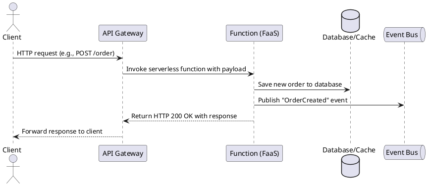

Great. I’ll prepare an executive overview titled **“Serverless (Function-as-a-Service) Architecture: Event-Driven Scale without Servers”** tailored for intermediate-to-advanced software engineers prepping for system design interviews. It will follow a narrative, problem-solution format, cover all 14 must-have technical points, include a PlantUML sequence diagram, and use AWS examples (like Lambda, API Gateway, Step Functions) where they clarify the concept.

I'll let you know as soon as it's ready.

# Serverless (Function-as-a-Service) Architecture: Event-Driven Scale without Servers

**TL;DR:** Serverless computing (FaaS) lets you run code without managing servers, charging **only when your functions run**. It automatically scales from zero to thousands of instances on-demand, eliminating capacity planning and idle costs. This event-driven model boosts agility and cost efficiency, but requires new approaches for state management, performance tuning, and architecture design.

## Why Pay-Per-Invocation? (Capacity Planning & Idle Cost Woes)

Traditional infrastructure forces you to **provision servers for peak load**, meaning you often pay for idle capacity. If a server is idle 90% of the time, you still pay 100% of its cost. This over-provisioning hurts: you either waste money or risk outages if you under-provision. Serverless flips this model to *pay-per-invocation*: you’re billed **only** when your code executes, not for idle time. This pay-as-you-go model **eliminates upfront capacity planning** – the cloud vendor handles scaling automatically. For spiky or unpredictable workloads, the benefits are dramatic: no need to **over-provision for peak traffic**, and no costs during quiet periods. In short, serverless motivates organizations to embrace event-driven architectures by removing the pain of guessing capacity and paying for unused servers.

## Core Anatomy of Serverless Platforms

A serverless FaaS platform has several core components working together:

* **Function Code Package:** The deployed application logic, typically as a **ZIP file or container image**. This package contains your function code and dependencies for a given runtime environment. Providers store and version these artifacts, loading them into the runtime as needed (for example, AWS Lambda accepts ZIPs or OCI images for code).
* **Runtime Sandbox:** An isolated, ephemeral environment where your function code runs. To ensure security and multi-tenant isolation, cloud providers run each function invocation in a sandbox — often lightweight containers or micro VMs. For example, AWS Lambda uses Firecracker micro-VMs with a minimal Linux and your chosen runtime (Node.js, Python, etc.) inside. This sandbox is allocated per invocation (or kept warm for reuse) and limits CPU, memory, and runtime according to configuration.
* **Event Source (Trigger):** An **event** is required to invoke a function. Common event sources include HTTP requests via API Gateway, messages from queues or pub/sub topics, file uploads to object storage, database change streams, scheduled cron jobs, or IoT device streams. The event source **routes events to the function** by invoking it with an event payload. For example, Amazon S3 can trigger a Lambda when a file is uploaded, or an API Gateway can trigger a function on an HTTP request. Event-source mappings glue your function to event producers in an event-driven architecture.
* **Control Plane (Management):** The cloud provider’s control plane handles **deploying and managing your functions**. This includes APIs or consoles to upload code, configure memory/CPU, set environment variables, and publish new **versions** of the function. Each version is immutable, and you can assign **aliases** (like “prod” or “staging”) that point to specific versions for traffic management. The control plane also manages integrations with other services (e.g., linking an API Gateway endpoint or an S3 trigger to a function) and enforces policies. In AWS Lambda’s architecture, for instance, the control plane handles create/update of functions, publishes layers, and ties triggers to your function.
* **Observability Hooks:** Built-in logging, metrics, and tracing that capture function activity. Every invocation can automatically push logs to a monitoring service (e.g., CloudWatch Logs) and update performance metrics (invocation count, duration, memory used, etc.). Many FaaS platforms also integrate with **distributed tracing**: for example, AWS X-Ray can trace a transaction through a Lambda function. These hooks allow you to monitor and debug serverless apps without building an observability system from scratch.

## Stateless Execution Model & Auto-Scaling

**Functions are stateless and short-lived by design.** They **do not retain state between invocations** – each call is independent, which simplifies horizontal scaling. Any state that needs persistence must be stored in external services (databases, caches, etc.), as the function’s memory or filesystem may be wiped after execution. This stateless model means functions can be **instantiated and terminated on demand** without affecting subsequent invocations.

When an event occurs, the platform quickly schedules your function to handle it. If traffic increases, the platform spawns multiple instances in parallel to handle many events concurrently. This yields an **N→0→∞ scaling model**: you can have zero instances when idle, and potentially “infinite” (practically, very large) instances under load, limited only by any configured concurrency quotas. Each event usually triggers a new function instance if no warm instance is available. The platform handles scaling up and down **automatically** – no pre-planned capacity needed. By default, AWS Lambda, for example, allows 1,000 concurrent executions per region (soft limit) and can rapidly scale within seconds. There is typically an **initial burst** capacity (e.g., hundreds of new instances per minute) and then a ramp-up rate to protect downstream systems.

Because containers may be created on demand, a **“cold start”** penalty can occur: the first invocation on a new sandbox includes startup time to download code, start the runtime, and initialize your handler. Cold start delays range from a few hundred milliseconds to a few seconds depending on runtime and package size. Providers mitigate this by keeping containers alive for some time (often \~5–15 minutes) after use – subsequent **warm starts** on an active container have near-zero startup latency. Nonetheless, designing with cold starts in mind is important for latency-sensitive apps. Functions also have **max execution time limits** (e.g., AWS Lambda max 15 minutes) making them unsuited for very long-running tasks. Finally, providers impose **concurrency limits and burst quotas** to control scaling. For instance, AWS Lambda starts with an initial burst of 500–3000 concurrent invocations per region (depending on region) and then adds capacity at \~500 instances/minute until the account limit (e.g. 1000) is reached. If these limits are exceeded, further invocations are throttled. Overall, the FaaS execution model scales effortlessly but requires awareness of statelessness, short execution times, and possible startup latency.

## Event Sources & Triggers

Serverless functions are **invoked by events** from a variety of sources, enabling highly decoupled, event-driven architectures. Some common trigger types and how routing works:

* **HTTP APIs:** An API Gateway (or Function URL in some platforms) routes HTTP requests to your function. You define routes/endpoints, and the gateway transforms the HTTP request into an event object for the function (including path, query params, headers, body, etc.). The function processes and returns a response that the gateway relays back to the client. This pattern is popular for REST/GraphQL backends where each API endpoint maps to a serverless function.
* **Pub/Sub Messaging:** Message brokers or event buses (like Amazon SNS, EventBridge, or Google Pub/Sub) can fan-out events to functions. When a message is published to a topic or bus, the service invokes subscribed functions with the message payload. This decouples producers from consumers; e.g., an order placed event can trigger inventory, billing, and notification Lambda functions concurrently.
* **Queue Events:** Queues (e.g., Amazon SQS, Azure Queue) trigger functions to process messages in a **point-to-point** async fashion. The function reads a batch of messages from the queue and processes them, achieving **auto-scaling consumers** for workload leveling. Queue triggers often provide at-least-once delivery with retry, and functions should delete messages upon successful processing.
* **Object Storage Events:** Cloud storage services (like Amazon S3, Azure Blob Storage) can trigger a function when a file/object is created, modified, or deleted. For example, an image upload to S3 can trigger a resizing function. The event contains details of the object (bucket name, key, etc.), and the function can use that info to retrieve the object and perform actions.
* **Scheduled Jobs (Cron):** You can schedule functions to run at fixed intervals or cron expressions using scheduler services (e.g., CloudWatch Events/EventBridge Schedule, Azure Timer triggers). This replaces cron on servers – useful for periodic tasks like nightly data aggregation or health checks.
* **Stream Processing:** Some platforms allow direct integration with streaming data sources (e.g., Kinesis or DynamoDB Streams invoking Lambda). The function is invoked with a batch of stream records and typically processes them in order, enabling real-time data processing pipelines.
* **IoT & Webhooks:** IoT services can trigger functions based on device telemetry or alarms. Similarly, incoming webhooks or events from SaaS products can be forwarded (often via an API Gateway endpoint) to functions for processing.

**Event routing** is managed by the platform’s integration; you typically configure triggers in the control plane. Under the hood, when an event occurs, the service (API Gateway, etc.) makes an **internal call** to the FaaS service, specifying which function to invoke (often by name or ARN) and passes along the event data. The FaaS platform then finds or launches a runtime sandbox for that function and executes it with the event. This seamless trigger mechanism is key to connecting serverless functions into larger workflows without explicit polling. It also means **loose coupling**: services don’t need direct knowledge of each other, only of events and handlers.

## Data & State Management

Because functions are stateless, **externalizing state** is a fundamental principle. All long-lived data must reside in databases, storage, or other services. A common pattern is to use a managed database (SQL/NoSQL) for persistent state and an in-memory cache for frequently accessed data. For example, an e-commerce function might store orders in DynamoDB and cache popular items in Redis. The function fetches and updates these external stores as needed, knowing that any in-memory variables will vanish after execution.

State externalization means **every invocation starts fresh**, so your code should retrieve necessary context (e.g., user profile from a DB) at start. If multiple related events need to share state, that data must be passed via the event or stored externally between function calls.

An important consequence is that **functions should be idempotent whenever possible.** The platform or upstream services might deliver an event more than once (e.g., retries on failure), so your function should handle duplicates gracefully. Use **idempotency keys** or checks in your database (for instance, avoid processing the same order ID twice) to ensure repeated invocations don’t cause inconsistent results. Designing idempotent logic is a best practice to deal with at-least-once delivery semantics.

For workflows that span multiple steps or have long-running interactions, consider using **orchestration services**. AWS Step Functions or Azure Durable Functions can manage complex, stateful workflows by chaining serverless function calls with state tracking, retries, and even long wait periods. In a *saga pattern* for distributed transactions, for example, an orchestrator function (or state machine) can trigger a series of functions (steps) and perform **compensating actions** if one step fails. This offloads state management and coordination out of your code into a dedicated service. Another approach is the **choreography pattern** using an event bus: each service/function listens for events and emits the next event in line, forming an implicit workflow. This is more decentralized but harder to track; using a centralized orchestrator is simpler for complex sequences.

Finally, note that each function invocation typically gets a small ephemeral disk space (e.g., **`/tmp` up to 512 MB** in AWS) which can be used to cache files between invocations on the same instance or to store temporary data. This storage is not persistent across different function instances, but can be useful for things like caching machine learning models or large dependencies on the local filesystem for performance. Be mindful of its size and that it resets when the container is recycled.

## Operational Envelope: Limits and Pricing

Every serverless platform defines an **operational envelope** for functions – the set of configurable resources and limits:

* **Memory and CPU:** You typically choose a memory size for your function, and CPU is allocated proportionally. For example, AWS Lambda lets you pick 128 MB up to 10,240 MB of RAM, and allocates CPU roughly linearly (e.g., \~1 vCPU at \~1.8 GB). More memory = more CPU and higher cost per millisecond. Tuning memory can impact performance; a higher memory may speed up execution (thus lower duration) at a higher per-ms cost, so there’s a trade-off. The optimal setting often requires benchmarking (AWS’s *Lambda Power Tuning* tool helps find the best memory setting for cost/performance).
* **Maximum Execution Time:** Functions are meant for short tasks. Most providers cap runtime per invocation (e.g., AWS: 15 minutes, GCP: 9 minutes default, Azure: \~5 minutes by default for HTTP triggers). If a function hits the timeout, it’s terminated. Long-running jobs must be broken into smaller tasks or use other services (like batch or step functions) for extended processing.
* **Ephemeral Disk (/tmp):** As mentioned, a small scratch disk (e.g., 512MB) is available during execution for caching and temp files. It persists *per container* (so can be reused by warm starts on the same instance) but not across different instances. Any needed larger or persistent storage should use network storage (S3, etc.).
* **Environment Variables & Config:** You can pass configuration data via env vars, often including secrets (though secrets should preferably use secure vault integrations). These are set per function and remain constant for each instance (they’re loaded at startup).
* **Concurrent Execution Limit:** By default, providers set an account- or region-wide cap on how many instances can run at once (e.g., 1000 concurrent in AWS). You can reserve concurrency for critical functions or raise the limit if needed. This ensures runaway invocations don’t exhaust resources.
* **Request Payload & Response Size:** There are limits on event data size and return payload. For instance, AWS Lambda limits the synchronous response payload to 6 MB, and event request size (for async calls) to 256 KB. API Gateway likewise might limit payload/body sizes. Large payloads should be stored in an external storage (like S3) and referenced by the function.
* **Deployment Package Size:** There may be limits on the size of your code package (e.g., 50 MB zipped for AWS Lambda for direct upload, or larger if using container images). Keeping packages slim also improves cold start times. Use features like layers (shared libraries) to avoid big packages.
* **Outbound Network Access:** Functions can make outbound network calls (e.g., to call external APIs or cloud services). If placed in a private VPC, ensure you have network routes (NAT Gateway, etc.) for egress. Some providers restrict internet access unless configured.
* **Pricing Formula:** Serverless pricing is typically **per-request plus per-duration**, with duration measured in fractional seconds \* RAM allocated. For example, AWS Lambda charges \$0.20 per 1 million requests and \$0.000016667 per GB-second of execution (with a 1M requests and \~400,000 GB-sec per month free tier). So a function using 128 MB for 100 ms costs about \$0.000000208 per invoke. Other providers have similar models (Azure charges by GB-s and adds a small per-execution, GCP rounds up to nearest 100ms, etc.). **Idle functions incur no cost** – this is a key difference from always-on servers. However, note that costs of associated services (API Gateway, data storage, etc.) also contribute to total expense.

In summary, the operational limits frame what a function can do (compute, time, space) and the pricing ties directly to how long and how much memory you use per invocation. It’s crucial to design functions within these constraints for efficient operation. For example, avoid hitting timeouts by breaking work into smaller chunks, and avoid using excessive memory if not needed. Use the cost model to your advantage: many small, fast functions can be extremely cost-effective due to precise billing, but a poorly optimized function with large memory and long runtime can rack up costs.

## Reliability & Availability

Serverless platforms are built for high availability and resiliency. **Functions are automatically run in a multi-AZ configuration** within a region – the provider ensures that your function instances are spread across Availability Zones so that a datacenter outage doesn’t take down your application. You don’t have to architect multi-AZ redundancy; it’s done by default. For even higher resilience, you could deploy your function to multiple regions and use a routing layer to failover if an entire region goes down, but for most cases, multi-AZ per region gives excellent uptime.

On the reliability side, consider the **invocation model**: events can be synchronous (e.g. an API call waiting for a result) or asynchronous (e.g. a file upload event). For **synchronous triggers**, the calling service is responsible for error handling – e.g., API Gateway will relay errors back to the client and it’s up to the client to retry if needed. For **asynchronous events**, the FaaS platform typically provides built-in **retry semantics**. For example, AWS Lambda will automatically retry asynchronous invocations (from services like S3, SNS, etc.) if the function returns an error or times out, with a few retry attempts over several minutes. This means your function might be invoked multiple times for the same event if it fails initially (hence the need for idempotency as noted). After the retries, if the function still fails, you can configure a **Dead-Letter Queue (DLQ)** – e.g., a failed event can be sent to an SQS queue or SNS topic for later examination or manual reprocessing. The DLQ acts as a safety net to catch events that could not be processed successfully after all retries.

The **delivery guarantee** for most event sources is *at-least-once* delivery. That is, an event will be delivered ≥1 times, so you must handle duplicates. Some triggers or orchestrators can achieve *exactly-once* processing (e.g., if the downstream actions are designed to be idempotent or transactions are coordinated, or using stateful workflows that track execution), but assume at-least-once in general.

**Regional isolation** is another factor: functions in one region are typically independent from another region (no automatic failover or state sync). If you need cross-region redundancy, you have to deploy in multiple regions and perhaps use a global API endpoint or DNS to direct to a healthy region. Keep in mind that state stores (databases, etc.) would also need replication across regions for a true active-active setup.

**Error handling and timeouts:** Functions should handle errors gracefully and timeout if stuck. Most platforms will **terminate** an invocation at the timeout and report an error. Your code can catch exceptions and either suppress or transform errors. For async invocations, unhandled errors trigger the retries as mentioned. It’s good practice to emit informative logs on failures and possibly implement alerting when certain error rates are exceeded.

**Integration failure modes:** Since serverless apps rely on many managed services, you must consider upstream/downstream failures. E.g., if your function depends on a database or API that is down, your function may fail repeatedly – potentially causing a **retry storm**. Implementing circuit-breakers or backoff in your code (or using DLQs) can mitigate pressure on a failing dependency. Also consider concurrency limits to avoid overloading a struggling downstream (you can set a max concurrent executions on a function to throttle it, which indirectly throttles events consumption).

Overall, FaaS platforms take care of infrastructure resilience (multi-AZ, quick scaling) and provide tools like retries and DLQs to increase reliability. It’s up to you to use those tools and write **idempotent, defensive code** to handle the remaining failure cases (like partial failures or poison messages). With good practices, serverless architectures can achieve very high reliability and fault tolerance out of the box.

## Observability & Monitoring

With highly ephemeral compute, observability is crucial. Fortunately, serverless platforms integrate **monitoring and logging by default**. Key aspects of observability in FaaS include:

* **Logging:** Every function invocation can emit logs (stdout/stderr or integrated logging APIs). These logs are aggregated by the platform – for example, AWS Lambda streams logs to CloudWatch Logs automatically. Developers can simply use console logging in code, and the platform will capture and store it. It’s recommended to use **structured logging** (e.g., JSON logs) so that log analytics tools can parse fields (like request IDs, user IDs, etc.). Many platforms tag each log event with a **Request ID** and possibly the function version, to correlate logs to invocations. For debugging, you can search logs by request ID to trace a single execution.
* **Metrics:** Standard metrics are reported for each function, such as invocation count, execution duration, memory used, and error count. These are viewable in dashboards (e.g., CloudWatch Metrics for AWS) and can be used to set alerts (e.g., alert if errors > N or if throttling occurs). Custom metrics can be emitted by calling telemetry APIs or by pushing to an external monitoring system.
* **Tracing:** Distributed tracing systems help follow a request across service boundaries. Many FaaS platforms support this via headers or context objects. For instance, AWS X-Ray can be enabled for Lambda, which will record traces including the function’s start, end, and any sub-calls (like to AWS SDK calls). The trace can show the portion of time spent in init (cold start), in the handler, and any downstream calls, giving visibility into performance bottlenecks. When integrated with API Gateway or other services, you can get a **end-to-end trace** of a transaction from the client, through the function, and on to databases or other services. Tracing is invaluable for diagnosing latency (e.g., identifying that a slow database query is the culprit or that cold starts are impacting 5% of requests).
* **Cold-start metrics:** Platforms are increasingly exposing metrics or logs specifically for cold starts. AWS now logs an `"Init Duration"` in the logs for cold starts (visible in CloudWatch logs). Third-party monitoring (like Lumigo, New Relic, Datadog) can aggregate this to show what percentage of invocations hit a cold start and how long they took. This helps in decisions around provisioning or optimizing startup.
* **Correlation and Cost Attribution:** Since serverless encourages many small functions, teams often want to attribute costs and performance by service or feature. Cloud providers offer ways to group functions (tags, resource groups) and see aggregated metrics/costs. Also, events can carry tracing headers that tie together multiple function calls in a flow. Use structured events (e.g., including identifiers in logs or traces) to correlate business-level operations across function boundaries. For cost, the precise metering per function means you can often break down exactly which functionality cost the most (e.g., “image processing function cost \$X, compared to data processing function \$Y this month”). Incorporating these into FinOps dashboards can guide optimizations.

In summary, observability in serverless is a **first-class citizen**: the platform gives you logs and metrics out of the box, and with a bit of configuration you get powerful tracing. The ephemeral nature (functions spin up and down) means traditional server monitoring (CPU, memory of a fixed instance) is less relevant; instead you monitor at the **service level** – success/failure rates, latencies, concurrency, costs. Embrace these tools and consider additional instrumentation in your code (e.g., log important parameters, emit custom metrics for key actions) to gain insight into your serverless applications’ behavior in production.

## Security & Isolation

Serverless architectures come with robust security isolation by default, plus the need for disciplined permission management on your part:

* **Isolated Execution:** Each function invocation runs in a dedicated, isolated environment – typically a micro-VM or container – ensuring **strong tenant isolation** between functions or different customers. Technologies like microVMs (Firecracker) and gVisor are used to sandbox execution with minimal overhead. This means one function cannot interfere with others or access resources (memory, disk, etc.) from another function. The sandbox is short-lived and frequently recycled, reducing the window for any attacker persistence. Additionally, managed runtimes are patched by the provider – you don’t worry about OS-level security updates.
* **Least-Privilege IAM Roles:** In serverless, you typically grant each function an *execution role* or identity with permissions to access other resources. **Adhere to least privilege** – each function should have an IAM role that allows only the specific operations it needs (e.g., read from a particular S3 bucket or write to a specific DB table). Avoid using one broad role for all functions. Fine-grained roles reduce blast radius if a function is compromised. Cloud providers integrate IAM tightly: e.g., AWS automatically provides temporary credentials to the function’s role, so any AWS SDK call uses those credentials to access resources. Ensuring the role is minimal is one of your key security responsibilities.
* **VPC Integration:** By default, functions run in the cloud provider’s general infrastructure, which can access the internet and cloud APIs but not your private networks. If your function needs to access resources in a private VPC (like a private database or cache), you can attach the function to your VPC subnets. This gives it ENIs (elastic network interfaces) in your subnets so it can communicate internally. You should provision subnets in multiple AZs for high availability. Keep in mind attaching to a VPC can increase cold start time due to ENI attachment (AWS mitigated this in recent years but some overhead remains). Also, when in a private VPC, if the function needs outbound internet, you’ll need a NAT gateway or similar. *Security-wise*, VPC attachment means the function is subject to your VPC’s security groups and network ACLs – you can control traffic to and from the function at the network level.
* **Secrets Management:** Functions often need API keys, DB passwords, etc. Never hardcode secrets in code; instead use environment variables or dedicated secret managers. Cloud platforms offer secure storage for secrets (e.g., AWS Secrets Manager or Parameter Store) and integration to load these into functions at runtime. If using env vars, prefer to store an encrypted form and decrypt in code (some providers do this automatically with KMS). Rotate secrets regularly – since functions are stateless, retrieving the latest secret on each cold start (or from a cache) is straightforward.
* **Resource Policies & Cross-Account Access:** If you invoke functions from other accounts or services, use resource-based policies (for example, allow a specific Service A to invoke Function B via a policy) to restrict who can trigger your functions. This prevents unauthorized event sources.
* **Code Security:** Even though you don’t manage servers, your application code security is still your responsibility. Typical practices apply: validate inputs (especially from event payloads that may come from untrusted sources), handle data securely, avoid vulnerable libraries, and keep dependencies updated. The small surface area of a single-purpose function can actually improve security (less code to review than a monolithic app).
* **Monitoring & Alerts for Security:** Use the observability tools to monitor for anomalous behavior. For example, sudden spikes in concurrency or execution time might indicate a misuse or attack (e.g., a DDoS via an API endpoint). Set CloudWatch/X-Ray alarms for error spikes or throttling, which could hint at issues. Also, AWS CloudTrail or equivalent can log when functions are created/modified and when they’re invoked (at least for certain trigger types), which is useful for auditing.
* **Third-Party Dependencies:** In FaaS, it’s easy to depend on many NPM/PIP packages. This can introduce supply-chain risks. Use tools to scan dependencies for vulnerabilities. Also, because each function is often packaged with its dependencies, ensure you don’t include unnecessary modules.
* **Compliance:** Many compliance regimes (PCI, HIPAA, etc.) are easier to meet with serverless because the provider takes over managing the base infrastructure securely (you inherit their certifications for the underlying platform). You focus on securing the application logic. Always understand the shared responsibility model: the cloud secures the **cloud** (runtime, OS, isolation) and you secure what you put **in the cloud** (your code, data, and configurations).

In essence, serverless provides a **secure-by-default isolation** and reduces many traditional server risks (no SSH access, no open ports unless you open via API Gateway, etc.). Your main tasks are to **lock down permissions** with IAM, handle secrets properly, and write secure code. If done right, a serverless app can be very robust against many common attack vectors, as there’s simply less surface to exploit (no long-lived servers to target, ephemeral containers, and each function does one thing with minimal privileges).

## CI/CD and Versioning for Functions

Deploying and updating serverless applications is a disciplined process, supported by built-in versioning and traffic shifting features. A typical CI/CD workflow for FaaS might look like: code changes -> commit -> CI runs tests and packaging -> CD deploys new function version -> optionally, route traffic gradually to the new version -> promote to stable.

Key concepts and tools in serverless deployment:

* **Build Artifact:** Your function code (and dependencies) is built into a deployment package (zip or container image). This artifact is immutable and versioned. Many teams use frameworks (Serverless Framework, AWS SAM, Terraform, etc.) to define their functions and deploy reproducibly. During CI, you might run tests (including using local emulators) to validate changes.
* **Versioning:** Cloud providers let you publish a new **version** of a function for each deployment. A version is essentially a snapshot of the code *and* configuration (memory, env vars) at deployment time. In AWS, for example, version identifiers are integers and you cannot change a version once published – you’d deploy a new version for any update. This immutability means you can reliably roll back by pointing to an old version if needed.
* **Aliases:** An alias is like a pointer to a version. You might have an alias “prod” pointing to version 5 of a function. When you deploy version 6, you can switch the “prod” alias to 6 (possibly gradually). This indirection allows **blue/green and canary deployments** easily. You can keep “prod” on version 5 while “beta” alias points to 6 for testing, etc.
* **Traffic Shifting (Canary Deployments):** Many platforms allow splitting traffic between two versions during deployment. For example, AWS Lambda supports **weighted aliases** – you can send a small percentage of traffic to the new version while the rest goes to the old version. This is useful to test the new code with real load (canary) and quickly rollback if errors spike. A typical canary might be 10% new, 90% old for a few minutes, then 100% new if no alarms trigger. If something goes wrong, the platform (via CloudWatch Alarms or other signals) can automatically roll back the alias to the old version. This **gradual deployment** approach greatly reduces risk compared to all-or-nothing deploys.
* **Continuous Deployment Tools:** AWS offers CodeDeploy integration for Lambda to automate the above process (with predefined canary or linear rollout strategies). Similarly, Azure Functions can integrate with Deployment Slots for staging and swaps. These tools handle the orchestration of shifting traffic and monitoring. In Kubernetes-based FaaS frameworks, you might use service mesh or custom controllers to do similar canaries.
* **Rollback and Audit:** If an issue is detected in new code (perhaps error rate goes up), you can near-instantly route all traffic back to the stable version (a “rollback”). Since the old version is still deployed, switch the alias back. Meanwhile, all function versions and edits are tracked. Deployment automation should ensure only tested artifacts are deployed and that configs (like env vars) are version-controlled too (Infrastructure as Code).
* **Configuration and Secrets Deployment:** Changes to env vars or secrets can also be managed via CI/CD. Treat them carefully – a bad config change can break a function just as code can. Platforms often allow separate versioning of environment config or use of parameter stores that your CI updates.
* **Multiple Environments:** Typically, you’ll have separate stages (dev, test, prod) possibly implemented as separate aliases or separate projects. For example, “dev-myFunction” vs “prod-myFunction” or same function with “dev” alias. Keep these isolated so you don’t accidentally deploy dev code to prod.
* **Testing Strategies:** For serverless, you should have automated tests for the function code (unit tests) and ideally integration tests using the cloud environment (some use local emulators, but ultimately a deployment to a test stage and execution of test events is best to catch platform-specific issues). CI pipelines often deploy to a staging alias, run tests (maybe by invoking functions with test events or hitting the API Gateway endpoint), then proceed to update the prod alias if all tests pass.
* **Monitoring Deployments:** Because serverless deployments are frequent (can be multiple times a day) and not tied to server provisioning, use monitoring to detect any anomaly post-deploy. If error count or latency jumps after a deployment, consider an automated rollback or alert developers.

Serverless CI/CD thus embraces the ideas of *immutable artifacts* and *gradual rollout*. The combination of function versioning and alias traffic shifting provides a powerful mechanism for **zero-downtime deployments**. For instance, you can deploy a new version behind the scenes, maybe run some internal tests against it (by invoking it directly or via a special alias), then update the public alias to it once satisfied. If an issue arises, switch back to the previous version in seconds. This encourages small, frequent deployments, as the overhead and risk of deployment is low compared to traditional servers.

## Performance Tuning and Optimizations

While the cloud handles scaling, you still have tools to optimize performance of individual functions and reduce latency:

* **Provisioned Concurrency:** For critical functions where cold start latency is unacceptable, providers offer options to keep instances warm. AWS’s *Provisioned Concurrency* allows you to pay to have N instances always initialized for a function. This eliminates cold starts for that pool of instances at the cost of paying for them idle. It’s effectively capacity you provision (blurring the pure serverless model). Use it for ultra low-latency needs (e.g., user-facing APIs) where even occasional cold-start delays (which might be 0.5s or more for languages like Java) are not tolerable. Keep the provisioned count to what you need for steady base load to avoid high costs.
* **SnapStart and Snapshotting:** AWS recently introduced **Lambda SnapStart** for Java functions – it takes a **snapshot of a fully initialized function VM** when you publish a version, and on invocation it resumes from that snapshot. This can dramatically cut cold start time (AWS claims up to 10x faster for Java). Other platforms or open-source tools use similar idea (e.g., caching the runtime state or using Quarkus/Substrate VM to reduce startup). Keep an eye on such features, especially if using Java or other slower-starting runtimes.
* **Choice of Runtime & Language:** Language matters – for example, Java and .NET have higher cold start overhead (due to JVM and JIT warmup) compared to Python or Node.js. Go is somewhere in between (compiled but still some startup). Choose a runtime appropriate for your needs; if you need fast startup and are okay with a bit of performance tradeoff, scripting languages or custom runtimes (like AWS provided a “Provisioned JVM” for SnapStart) can help. Also, within a runtime, minimize heavy static initialization – e.g., avoid expensive work at global scope that runs on cold start.
* **Optimize Package Size:** A smaller deployment package means faster transfer to the container and possibly faster cold start. Remove unused dependencies, use tree shaking or bundling to include only what’s needed. For Node.js, consider bundlers; for Python, avoid huge libraries if not necessary. Use compressed formats wisely (the platform already unzips your package).
* **Connection Reuse:** If your function calls external services (databases, APIs), *reuse connections* across invocations whenever possible. Since a warm function may handle many requests sequentially, you can, for example, initialize a database client outside the handler so that on subsequent invocations, the DB connection is already established. This saves time and avoids exhausting connection pools on the DB server. Keep-alive HTTP connections similarly reduce latency for repeated API calls. Caution: the platform might freeze idle instances, and some connections could be closed by the remote host, so implement retry logic if a reused connection is found dead.
* **Parallelize within Functions:** Although a single function invocation is single-threaded by default in many runtimes, you can sometimes perform parallel operations (e.g., spawn threads in Java, use `async` in Node/Python) to do I/O concurrently. Be mindful of CPU though – you have a fixed CPU share, and multi-threading won’t get you more CPU unless you have I/O waits to overlap. Using asynchronous APIs to call multiple downstream services in parallel can cut total time if those calls dominate latency.
* **Local Caching:** You can cache small amounts of data in memory or `/tmp` between invocations on the same instance. For instance, cache configuration data or a machine learning model so it’s not fetched repeatedly. Warm containers can reuse that, cutting down on repeated work.
* **Adjust Memory for CPU-bound tasks:** Because CPU is tied to memory, if your function is CPU-bound (e.g., image processing), giving it more memory (and thus more CPU) can drastically speed it up, reducing overall time (and possibly cost, since cost = time \* memory). Conversely, if it’s I/O-bound and uses little CPU, you might keep memory low.
* **Concurrency Considerations:** If a function is hitting concurrency limits or causing backend bottlenecks, consider using a queue to throttle it (as discussed in patterns). Also, use *Reserved Concurrency* to cap a function’s concurrency to protect a downstream resource. For example, if a function writes to a database that can only handle 100 writes/sec, set reserved concurrency to 100 to never exceed that.
* **Profiling and Monitoring:** Use the metrics and tracing to find where time is spent. Is the function waiting on external calls mostly? Then focus on those (caching, faster resource, etc.). Is it CPU-bound in parsing JSON? Maybe use more memory (thus more CPU). Did cold starts cause many >1s outliers? Perhaps enable provisioned concurrency or reduce package size. Iteratively optimize using data.
* **Async Processing for Performance:** For web applications, keep the function’s direct response path lean. Offload non-critical work. For example, for an API request that uploads an image, the function might quickly store the image and send a response, then asynchronously trigger another function (via an event or queue) to do thumbnail generation. This keeps the user-facing latency low and moves heavy lifting to async background functions.
* **Firecracker Tuning:** If you operate on a platform that allows some control (like an open-source FaaS on Kubernetes), you might look into container reuse settings, CPU pinning, etc. On managed services, you don’t have control at that level – focus on your code.
* **Keep-alive hack (if needed):** As a last resort for latency-critical paths, some people implement a “warmer” – a scheduled ping to the function (e.g., every 5 minutes) to keep it warm. This can reduce cold starts at the expense of some unwanted invocations. Provisioned Concurrency largely negates the need for this, but if that’s too costly and your traffic is low (so instances would otherwise cold start often), a lightweight warm-up ping can help. There are community tools (“lambda warmer” libraries) to coordinate this. But be cautious: it introduces constant load and isn’t guaranteed if concurrency scales beyond one instance.

In summary, serverless performance comes down to managing cold start impact and optimizing each invocation’s execution. Through features like provisioned concurrency and SnapStart, cold starts can be minimized. Good coding practices like connection reuse and efficient coding/bundling ensure each invocation runs as fast as possible. Since billing is tied to duration, performance optimizations can also save cost. It’s a win-win to keep your functions snappy!

## Common Design Patterns

Designing with serverless in mind often means adopting certain patterns that maximize decoupling, scalability, and resiliency. Here are some prevalent serverless architecture patterns and how they work:

* **API Backend per Function (Microservices):** Use a function to handle each API endpoint or resource in a microservice. For example, in a REST API for orders, you might have `CreateOrderFunction`, `GetOrderFunction`, `ListOrdersFunction`, etc. An API Gateway routes HTTP calls to the appropriate function. This pattern ensures each function is small and focused (like single-responsibility principle), and they can scale independently. It aligns with microservice ideas – each function can be developed and deployed independently, and you compose an application by integrating multiple functions behind an API. This is sometimes called *Backend-for-Frontend* or *Micro APIs* pattern. It’s great for agility, though if an API has many endpoints, managing a lot of functions could be a complexity (you might group some related endpoints in one function in such cases).
* **Event Pipeline (Fan-out/Fan-in):** When one event needs to trigger **multiple parallel processes** and then aggregate results, serverless can shine with a fan-out/fan-in pattern. **Fan-out:** one event (say a user signup) is published to a topic, and multiple functions (welcome email, analytics logging, etc.) receive it simultaneously. This is easy with SNS/EventBridge (publish-subscribe). Then **fan-in:** if you need to gather results from those parallel tasks, you can have them all report to a common place. For example, each function could write to a DynamoDB record or send a message when done, and another function or Step Function can wait for all to complete. AWS Step Functions has a Map state or parallel branch that can spawn tasks in parallel and then join. Or you could use an SQS queue where each parallel task writes a completion message and one function reading the queue aggregates them (though Step Functions is more straightforward for aggregation). This pattern is useful for batch processing too – e.g., split a large job into chunks processed in parallel by N functions (fan-out), then have an aggregator combine results (fan-in).
* **Queue-Based Buffering (Decoupled Invokers):** Use a queue between services to smooth out bursts and decouple producers/consumers. For instance, imagine an upload service puts tasks into an SQS queue. A pool of Lambda functions subscribes to the queue and processes items at whatever rate the downstream can handle. If 1000 items arrive at once, the queue buffers them and functions scale up (to concurrency limit) to work through them. If the downstream service (like a database) can’t handle too many concurrent writes, you can limit the Lambda’s concurrency or processing rate. This pattern – essentially a **message queue + lambda consumer** – is great for **load leveling** and simple async workflows. It also naturally retries on failure (messages can be returned to queue if not processed).
* **Event-Driven Choreography:** Use an **event bus** (like EventBridge) to let services communicate via events instead of direct calls. In a complex application, rather than service A calling service B (tight coupling), service A emits an event “OrderPlaced”. Service B (inventory) listens for that event and runs, then maybe emits “InventoryConfirmed”. Service C (billing) listens and so on. This is an **event choreography** approach to building workflows. It fits well with serverless because each step can be a function triggered by the previous step’s event. The advantage is loose coupling and easy addition of new listeners (e.g., add a notification function to “OrderPlaced” without touching existing code). The disadvantage is **lack of central coordination** – it can be hard to track the whole flow or handle failures globally. This pattern requires careful design to avoid lost events or inconsistent states (saga pattern often used to manage compensations on failure).
* **Orchestration with Step Functions (Saga Orchestrator):** In contrast to pure events, an orchestrator (like AWS Step Functions or Azure Durable Functions) manages the sequence of steps explicitly. This is often used for **saga patterns** in distributed transactions: the orchestrator (state machine) calls a function to, say, reserve inventory, then a function to charge payment, then a function to create order record. If any step fails, the orchestrator can invoke designated **compensating functions** to roll back side effects (cancel reservation, refund payment). The entire workflow state (which steps succeeded, which failed) is tracked by the orchestrator, making it easier to ensure consistency. Orchestration is often the better approach when **business logic spans multiple services** and error handling between them is complex. The tradeoff is a bit more upfront setup (defining the workflow), but it greatly simplifies each function (they just do their piece and throw errors if any, letting the orchestrator handle the rest).
* **Reactive Stream Processing:** For analytics or streaming data, serverless functions can be tied to stream sources (e.g., process every new log event from a Kafka/Kinesis stream). The pattern here is streaming aggregation or filter -> function -> output to another stream or store. For example, use Lambda with Kinesis to filter and transform IoT events then put into a time-series database. This pattern competes with specialized tools like Kafka Streams or Flink, but for simpler needs, FaaS is convenient.
* **Cron Jobs / Scheduled Automation:** This is straightforward – use scheduled triggers to run functions for periodic tasks. It replaces something like a cron job or a scheduled EC2. For instance, a nightly report generator or a function that cleans up old files every hour.
* **Edge Computing Patterns:** With edge functions (Cloudflare Workers, AWS Lambda\@Edge, etc.), you can move certain logic closer to users. A pattern here is to handle request customization at CDN edge: e.g., rewrite URLs, authentication checks, or serve different content based on geolocation – all done by a lightweight edge function running in dozens of data centers worldwide. Another edge pattern is real-time processing of streaming data at edge locations (for low latency) and then forwarding results to a central system.
* **Fan-out via SNS to multiple queues (hybrid):** A variant fan-out: one event goes to an SNS topic, which has multiple SQS queues subscribed, each feeding a different Lambda. This gives the reliability of queues (each consumer has its own queue and can retry independently) with the broadcast of pub/sub. It’s useful if different consumers have very different pacing or error handling needs.
* **Serverless MapReduce:** For large-scale data, you can orchestrate many Lambda functions to do a distributed compute. For example, a coordinator function breaks a task into 100 chunks (Map step), invokes 100 parallel Lambda functions (perhaps via SQS or direct invocation), then another function aggregates results (Reduce step). This can leverage massive parallelism for embarrassingly parallel tasks (like processing chunks of an image or brute forcing something) without managing a cluster – but be careful with coordination and hitting limits (i.e., Lambda concurrency and time limits).
* **WebSockets and real-time APIs:** Some platforms (AWS API Gateway, Azure Functions) allow WebSocket endpoints that trigger functions. This pattern enables serverless real-time chat or notifications – the function can push messages to connected clients via the gateway when triggered by events.

These patterns demonstrate how to build complex systems out of small, single-purpose functions with glue services in between (API Gateway, SNS, SQS, Step Functions, etc.). The best practice is usually to keep functions **focused on one task** and use managed services to connect them (rather than writing a large function that does too much). It yields a naturally scalable and maintainable system.

One must also consider **observability and tracing** in these patterns: with many moving parts, tools like X-Ray service maps or Dashbird can help visualize event flows, and logs need to be correlated. But the payoff is a highly scalable architecture where each component is fully managed and you can evolve pieces independently.

## Comparing FaaS with Containers, PaaS, and Edge Functions

**Serverless vs. Containers (Kubernetes):** Containers (or Kubernetes orchestration) and serverless functions both deploy code in portable units, but the operational model differs. With containers on K8s, you manage (or at least define) the cluster infrastructure, node sizing, scaling rules, etc. Kubernetes can scale pods, but it usually requires manual setup of auto-scaling (based on metrics) and you have to pay for nodes regardless of usage. Serverless auto-scales **instantly and down to zero** without explicit configuration. This makes serverless ideal for spiky or low-volume services where running a constant container would waste resources. Cost-wise, FaaS is pay-per-ms, whereas in Kubernetes you’re paying for VMs or reserved capacity continuously (plus overhead of managing those nodes). On the other hand, Kubernetes offers **more control** – you can run background processes, use custom networking, choose specific CPU/memory configurations, long-running services, etc., which serverless might not support (for example, a container can run 24/7 or handle a long WebSocket, a Lambda cannot easily maintain a WebSocket connection open beyond the request scope). Kubernetes also avoids the cold start issue since your containers usually stay running (unless you scale to zero manually). In short, **FaaS shines for event-driven, intermittent workloads and rapid development**, while **containers shine for complex, stateful, or steady workloads** requiring custom setup. Many organizations use both: critical core services on containers, auxiliary event-driven glue on Lambda. Note that projects like Knative and OpenFaaS allow running “serverless” frameworks on top of Kubernetes – giving a Functions-as-a-Service developer experience but backed by a K8s cluster. This can be a way to unify the ecosystem, though you lose the fully hands-off ops of a cloud-managed FaaS.

**Serverless vs. PaaS:** Platform-as-a-Service (e.g., Heroku, Google App Engine, Azure App Service) also abstracts servers, but typically you deploy an *application* that stays running (at least one instance) and scales on config. PaaS often requires you to allocate e.g. 1 dyno or instance size, and it might scale up/down based on load, but not usually to zero by default. **Serverless auto-scales more granularly and can scale to zero** when no traffic, whereas many PaaS apps have at least one instance always on, incurring cost. PaaS might have a quicker startup (no cold start for each request since the app process persists) and can maintain state in-memory between requests (since it’s not killed between each request). But that means as a developer you still think about process lifecycle, maybe multi-threading, etc. Serverless pushes you to stateless single-call logic, which can simplify each function. **Startup time and performance**: PaaS apps are typically long-lived processes, so no per-invocation cold start (though scaling from 0 or from one instance to many can still incur delays of seconds to boot new instances, albeit maybe not each request). FaaS cold start is per new container, which could affect any request if scaling from zero or if the function wasn’t recently used. Tooling: PaaS might allow more traditional debugging (attach to a live instance, etc.), whereas serverless requires logs and offline debugging. **Pricing**: PaaS can be similar in that some (like Heroku) charge per dyno-hour (which is more like per always-on instance). Others might charge based on usage but at a coarser level (e.g., GAE standard environment charges instance-hours with automatic scaling). Serverless is typically more fine-grained – down to the millisecond or request. If you have a **constant high load**, a PaaS with a few always-on instances might be cheaper than the equivalent serverless invocation cost, because serverless’ granular pricing could add up (plus the overhead of each invocation). Conversely, for spiky or low usage, serverless is usually cheaper since you’re not paying for idle capacity at all. **Edge deployment**: Most PaaS run in one region or a couple, whereas some serverless (like Cloudflare Workers, or Lambda\@Edge) can deploy code to many edge locations easily – that’s a differentiator where FaaS can beat PaaS for globally distributed needs.

**Serverless vs. Edge Functions:** Edge Functions (e.g., Cloudflare Workers, Fastly Compute\@Edge, AWS Lambda\@Edge) are a specialized subset of FaaS that run in many geographically distributed locations, typically to handle requests very quickly at the network edge. They often have language/runtime restrictions (Cloudflare Workers use a V8 isolate model, supporting JS, WASM, etc., but not full Node.js environment). They also have tight limits (e.g., 50ms CPU time per request, limited memory, no large binaries). Edge functions are excellent for things like modifying HTTP requests/responses, caching logic, or lightweight computing closer to users (reducing latency). They shine for CDN and personalization use-cases (like A/B testing content in the CDN, auth token validation at edge, etc.). Compared to general FaaS, edge functions trade some power for ultra-fast startup and global reach. Many are **truly run on demand** per request (Cloudflare Workers can handle millions of requests with essentially no cold starts due to their isolate tech). If you need heavy computing or integration with many cloud services (databases, etc.), standard region-based FaaS is better, as edge environments might not have direct access to your databases (some edge providers provide key-value stores or you have to call back to origin). Also, debugging edge functions can be trickier due to distribution. In summary, edge functions complement centralized FaaS: use them to handle request routing, caching, and minimal logic at edge, and call your central FaaS or APIs for the heavy lifting.

**When FaaS Stumbles:** Despite advantages, FaaS isn’t perfect for every scenario. Workloads that require **long continuous processing** (e.g., video transcoding of a long video, or big data jobs) may not fit into the max duration – containers or VMs might be better. Applications that maintain **long-lived network connections** (like a chat server over WebSocket) don’t map well to request-response functions (though AWS does have WebSocket callbacks via API Gateway, but behind the scenes it’s event-based). If you need **fine-grained control over the environment**, like specific OS tuning, special hardware (GPU for training a model), or custom networking (e.g., listening on arbitrary ports, custom protocols), then FaaS will likely not allow that – a container or VM would. Also, **predictable high-volume workloads** (e.g., 24/7 at a steady rate) might be cheaper on reserved infrastructure; serverless flexibility comes at a slight premium per unit compute. Additionally, running a **monolith** on FaaS by calling one function from another repeatedly is inefficient (and an anti-pattern – see below) as you pay for idle time waiting on other functions. In such cases, a containerized service might be simpler and cheaper.

Often, a **hybrid approach** yields the best architecture: use FaaS where you want event-driven, auto-scalable, granular services, and use containers/servers for parts that need to be always-on or have heavy, steady workloads. The ecosystem is not either-or; they can be combined, with event buses linking long-running services and serverless functions.

## Anti-Patterns and Pitfalls to Avoid

While serverless is powerful, there are common mistakes that can cause trouble:

* **Monolithic “God” Functions:** Packing too much functionality into one Lambda/function defeats the purpose of microservices. For example, a single function that handles all API endpoints of an app (routing internally) or does a huge batch of unrelated tasks is a monolith in disguise. This leads to large package size (slow cold starts), broad IAM permissions (violating least privilege), and difficult code maintenance (multiple developers colliding in one deployment). It’s better to split into smaller focused functions, even if it means more functions – use tagging or frameworks to manage them. Monolithic functions also make partial updates risky (any change redeploys the entire logic). Decompose them by use-case or domain.
* **Long-Running Tasks on FaaS:** If you find yourself trying to run a job that takes more than a few minutes or consumes a lot of CPU continuously, serverless might not be the best fit. Forcing it (by bumping memory to max and nearing the timeout) is an anti-pattern. Instead, break the job into sub-tasks that can run in parallel or sequence, or use an alternative (AWS Batch, Fargate, Kubernetes job, etc.) for the heavy lifting. Similarly, using a Lambda to orchestrate a complex multi-step workflow with lots of logic and waiting is a code smell. Offload orchestration to Step Functions or divide responsibilities among multiple functions. Remember, Lambda has a hard 15-min limit – any reliable system needing longer should be built to handle continuation (maybe via state machine).
* **Synchronous Chaining of Functions (Calling Functions from Functions):** A common rookie mistake is to have Function A call Function B (maybe via HTTP or an SDK) in a blocking way. This essentially means you’re paying for two functions running at the same time (A waiting while B executes) and introduces tight coupling and complex error handling. If Function B fails, does A retry? Do you end up double-charging for partial work? Instead, use asynchronous integration: e.g., Function A can publish an event or put a message that triggers Function B, and then A can finish or wait via a state machine if needed. Or combine logic into one function if they must run serially and quickly. But avoid deep call chains of Lambdas – it’s inefficient and often unnecessary with event-driven designs.
* **Chatty Downstream Calls:** FaaS is often used as glue between services. But if a function makes dozens of sequential calls to a database or API, it can become “chatty” and slow. For instance, a naive implementation might loop and call a database 100 times for 100 records – this will be slow on a fresh connection and you pay for all that wait time. Instead, try to **batch operations** (fetch or write multiple records in one query if possible), or use parallelism for independent calls, or move logic to where the data lives (maybe use a single SQL query instead of 100 calls). Also, excessive external calls increase the chance of hitting network or rate limit issues. Use caching to reduce redundant calls (e.g., cache reference data in memory on warm starts, or use an external cache like Redis for repeated lookups across invocations).
* **Ignoring Timeouts and Retries:** Each function invocation should be written with the mindset that it **could be terminated at any time** (by timeout) or **re-invoked** (by retry on error). If you perform side effects (e.g., charge a customer) near the timeout, you might not have time to finish or report back, leading to uncertainty (did it complete or not?). Always try to perform critical side effects well within the timeout limit, and use checkpoints if possible. On retried events, without idempotency, you might process something twice. So not designing for at-least-once events is a pitfall that can lead to duplicates in data or double charges. The remedy is idempotent processing (as discussed) and monitoring for any poison messages that consistently fail.
* **Tight Coupling to Vendor Services (Lock-In):** Relying on proprietary event sources or features can increase *lock-in*. For example, writing many AWS-specific Lambda triggers (DynamoDB Streams, Cognito triggers, etc.) means migrating to another cloud would require significant changes. While some lock-in is almost inevitable for convenience, be mindful of how tightly you couple logic to a single cloud’s ecosystem. Using more open triggers (like generic HTTP via API Gateway) or abstraction layers (the Serverless Framework, or CloudEvents standard) can help mitigate this. Also, avoid writing business logic in things like AWS-specific syntax (e.g., writing lots of code in AWS Step Functions’ state language) unless the productivity trade-off is worth it. Plan for *portability* if that’s a concern – for instance, you could use an open-source FaaS platform like Knative as a potential target in the future, or at least structure code so cloud-specific parts are isolated. In practice, many organizations accept some lock-in for speed of development, but it’s worth noting as a pitfall.
* **Overlooking Observability and Debugging:** Another anti-pattern is deploying serverless functions and not having good logging or monitoring in place. Because you can’t “ssh” into a function, the only insight is via logs and metrics. If you don’t log key information or track performance, you’ll fly blind. Always include basic logging (start, end, important decisions) and use tracing where available. Neglecting this will make debugging very hard, especially as the system grows.
* **Resource Exhaustion (Attacking downstream):** Functions can scale rapidly, which is great, but it can also **DDOS your own database** if you’re not careful. For example, if 1000 Lambdas all slam a database at once, you might exhaust connection limits or IO capacity. A pitfall is not designing with backpressure or limits – you should use SQS queues or throttling or reserved concurrency to protect downstream systems that cannot auto-scale as quickly. Similarly, if your function code isn’t efficient, you could waste CPU (cost money) or memory (hit limits) unexpectedly at scale.
* **Misconfiguring Timeouts or Memory:** It’s easy to choose default 3 seconds timeout or low memory and then wonder why functions are failing. Always set appropriate timeouts – if your function calls an API that might take 10 seconds, set the timeout a bit higher. But also don’t set it too high “just in case” (don’t make it 15 min if usually 1 sec), because that delays detection of stuck executions. For memory, not giving enough can cause thrashing or out-of-memory, too much can waste cost if not used.
* **No Pagination/Batch Handling:** If processing a big list, don’t try to load it all in memory in one invocation if it’s huge – break it into pages or use multiple Lambdas. There are service-specific pitfalls like reading a 10,000-record DynamoDB stream in one go – instead, those triggers batch to manageable sizes.
* **Using Lambda as a pure Cron for heavy jobs:** If you have a daily job that runs for 15 minutes doing heavy ETL, Lambda might succeed but could be costlier than a small EC2 running continuously. Evaluate if serverless truly benefits the scenario or if it’s being forced. If the daily job doesn’t benefit from auto-scaling (it’s just one run), the main benefit is not managing a server – but cost might be higher for high memory 15 min. It might be fine, but always compare alternatives.

In conclusion, avoid bending the model in ways it’s not meant to be. Embrace the event-driven, short-lived, stateless nature. When you find yourself doing something that seems like running a server (long loops, manual retries, calling one function from another synchronously), step back and consider the serverless way (break into events, use a queue, use an orchestrator, etc.). By sidestepping these pitfalls, you can fully leverage the strengths of serverless without falling into common traps.

## Key Take-aways

* **Capacity planning disappears:** Serverless is *pay-per-use*, eliminating idle server costs. It auto-scales on demand, so you no longer worry about pre-provisioning (no more paying for 24/7 servers you only need occasionally).
* **Functions, not servers:** In FaaS, you deploy small function code packages that run in isolated sandboxes on events. The cloud handles routing events (HTTP requests, queue messages, etc.) to the right function and scaling them from 0 to many instances effortlessly.
* **Stateless and short-lived:** Functions don’t carry state between invocations and typically complete within seconds. Any persistent state lives in external services (databases, caches). This enforces modular, stateless design and makes horizontal scaling trivial – but means you must handle state and idempotency in your data layer (e.g., avoid double-processing an event).
* **Event-driven architectures:** Serverless thrives on events. HTTP APIs, file uploads, database changes, pub/sub events, and schedules can all trigger functions. This enables reactive designs with loosely coupled components. Complex workflows can be built with patterns like fan-out/fan-in for parallel processing and Step Functions for orchestration with error handling.
* **Operational limits and cost:** Each function has constraints (memory, max runtime, temp storage) and a granular cost model (billions of invocations at milliseconds precision). Tune memory/CPU for performance; design within time limits or break work into smaller tasks. You *only pay* for milliseconds used and requests made, making it cost-efficient for sporadic workloads. High-volume steady workloads, however, should be cost-compared with container or PaaS alternatives.
* **Built-in reliability:** Functions run across multiple AZs for high availability. The platform auto-retries failed async invocations and can direct failures to Dead Letter Queues. Expect at-least-once invocation and write idempotent functions. Leverage these features plus proper concurrency limits to build resilient systems that gracefully handle failures and avoid cascading issues.
* **Observability & security are first-class:** Cloud providers integrate logging, metrics, and tracing into serverless platforms (e.g., CloudWatch Logs, X-Ray). Use them – they’re essential for debugging distributed functions. Security is robust, with each function running in a sandbox and accessing resources through least-privilege IAM roles. Keep secrets out of code (use env vars or secret managers) and validate inputs as you would anywhere.
* **Continuous delivery and evolution:** Serverless encourages fast, safe deployments. Use function **versioning and aliases** to promote code changes gradually (e.g., canary releases). You can deploy dozens of times a day with minimal risk, as each function update is isolated. Design for flexibility – small functions that are easier to update or replace – and avoid anti-patterns like one giant Lambda doing everything.
