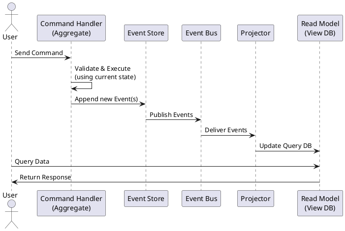

Great. I’ll draft an executive overview titled “CQRS & Event Sourcing: Splitting Reads from Writes and Making History Your Source of Truth,” tailored for intermediate-to-advanced software engineers preparing for system-design interviews. It will follow a problem-solution storytelling format, include real-world examples like banking and e-commerce, and address all 14 required topics. I’ll also include a PlantUML diagram and end with concise key takeaways.

I’ll let you know once it’s ready for your review.

**TL;DR:** *CQRS (Command Query Responsibility Segregation) with Event Sourcing splits an application’s write model from its read models. Commands update an **append-only event log** (the source of truth), and **projections** build query-optimized views from those events. This pattern boosts scalability for read-heavy systems and provides a full audit history, at the cost of added complexity and eventual consistency.*  

## The CRUD Problem – Why We Need CQRS + Event Sourcing

Traditional CRUD architectures use a single data model for writes and reads, which often becomes a bottleneck in complex, read-heavy applications. As UIs grow more sophisticated, they frequently need to **combine or reshape data** (e.g. joining many tables for a dashboard view), something the write-optimized, normalized models don’t naturally support. The result is an impedance mismatch – either the reads suffer (slow, complex queries) or the writes are denormalized (duplicating data) to speed up reads. Furthermore, high-load CRUD systems hit contention and locking issues, degrading performance as they scale. In a single data model, accommodating both heavy validation/consistency logic and fast query responses leads to a model “that does neither well”.

**CQRS** tackles this by **separating write and read responsibilities** into distinct models. The **write side (Command model)** is focused on enforcing business rules and integrity, while one or more **read side (Query models)** are tailored for fast data retrieval (often denormalized or cached for specific UI needs). This means each side can scale and optimize independently – e.g. scaling out read replicas or using different databases/techniques for queries vs. updates. Pairing CQRS with **Event Sourcing** goes further: instead of storing just the current state, the system stores every state-changing event in an **append-only log**. This event log becomes the **source of truth** and enables reconstructing any past state or regenerating new read models on the fly. In short, CQRS addresses the performance and modeling pain of CRUD by splitting reads from writes, and Event Sourcing ensures no business fact is lost – every change is captured as an immutable event. This combination solves the read/write impedance mismatch and provides a robust audit trail, at the cost of a more complex architecture.

## Core Anatomy of a CQRS & Event Sourced System

A CQRS+ES architecture is composed of several key components working in concert:

* **Command Side (Write Model & Aggregates):** The command side handles **commands** (intent to do something, e.g. “ReserveSeats” or “UpdateProfile”). Commands are processed by **domain aggregates** – clusters of domain objects treated as a unit for consistency. An aggregate encapsulates business rules and state; it loads its current state by replaying past events (event sourcing) and decides whether a new command is valid. If so, the aggregate produces one or more **new events** representing the state changes. For example, an `Order` aggregate handling a “PlaceOrder” command might emit `OrderPlaced` and `InventoryReserved` events. The command side is entirely **write-optimized** – it may use a rich domain model (often influenced by DDD) to ensure invariants, without worrying about read performance or query shapes.

* **Event Store (Append-Only Log):** Instead of updating a relational table in-place, each state change is recorded as an **event** in an event store. The event store is an append-only database (or log) that records all events in sequence for each aggregate or stream. It is the **system of record** – a persistent journal of everything that happened in the domain. Events are immutable facts (e.g. “Order #123 *shipped* on Jan 1”) and are never updated or deleted. The store can be implemented with specialized event databases (like EventStoreDB) or on top of regular databases, and it often supports **optimistic concurrency** (e.g. only append if the last seen event ID matches, to handle concurrent writes). The event store allows retrieving an aggregate’s full event history to rebuild its state, and acts as a publish/subscribe source of events for other processes.

* **Message/Event Bus:** After events are persisted, they are published on a messaging infrastructure (an event bus, message queue, or log). This decouples the producers (write side) from consumers – it ensures that as soon as a new event is recorded, any number of **subscribers** can be notified. The bus enables **asynchronous propagation** of changes: the write side commits quickly and returns to the user, while other processing (like updating read models, sending notifications, or initiating workflows) happens in the background. The bus could be a simple in-memory mechanism in a monolith, or an external system like a Kafka topic, RabbitMQ, AWS SNS, etc., in a distributed system.

* **Projectors / Read Side (Query Models):** One or more **projectors** subscribe to the event bus to build **read-optimized views** from the stream of events. Each projector listens for relevant events and updates its own **read model** – which could be a different database, cache, search index, or any data store optimized for querying. For example, a `CustomerProfileUpdated` event might trigger an update to a MongoDB document used by the profile UI, while an `OrderPlaced` event might update a SQL table that drives a reporting dashboard. These read models are essentially **materialized views** kept in sync with the event log. They are often denormalized and tailored to specific query needs (say, a single document per customer with everything needed for a profile page). The projectors must handle events *in order* for each aggregate stream to maintain consistency, and typically they operate asynchronously, making the read store **eventually consistent** with the writes. Projectors are also designed to be **idempotent** – since the same event may be delivered more than once, applying it multiple times should have the same effect as once.

* **Sagas / Process Managers:** While not present in every CQRS system, sagas (aka process managers) are essential for handling multi-step workflows or consistency across multiple aggregates. A **saga** listens for certain events and can send **commands** to other aggregates, thus coordinating long-running business processes that span bounded contexts or aggregates. For example, a `PaymentReceived` event might trigger a saga to issue a “ShipOrder” command to the shipping aggregate. Sagas maintain state (often minimal, like a state machine) to track progress and make decisions. They ensure **orchestration** in what would otherwise be eventually consistent processes – e.g. if payment fails, the saga might issue a “CancelOrder” command. Sagas effectively bridge the gap between the purely asynchronous event world and the need for cross-aggregate consistency by sequencing actions in response to events. (In choreography-based designs, instead of a saga, multiple listeners react to events in a chain, but the saga pattern gives more explicit control.)

With these components, the system cleanly separates the write path from the read path. Let’s walk through how data flows on each side.

## Command Flow: From Intent to Event

**Commands** are the only way to change state in a CQRS/ES system. A command (e.g. *“ReserveSeats{conferenceId, qty}”*) originates from the application – say, a user action in the UI – and is handled as follows:

1. **Command Handling & Validation:** The command is routed to a **command handler**, often a method on the appropriate aggregate or a service that loads the aggregate. The first step is to load the target aggregate’s current state. In an event-sourced system, this means retrieving the aggregate’s past events from the event store and replaying them to reconstruct state. For example, to handle “ReserveSeats” for a conference, the handler would load all `SeatAvailability` events for that conference and apply them to get the current number of seats booked. The aggregate (e.g. a `Conference` aggregate) is now “hydrated” with current state. It then executes business logic to decide whether the command can be fulfilled (are enough seats free?). If validation fails (say the command violates a invariant like overbooking), the aggregate throws an error and no events are produced. If it succeeds, the aggregate will **create one or more new events** describing the state change (e.g. `SeatsReserved{qty, user}`).

2. **Persist to Event Store:** The new event(s) are then **persisted** by appending to the event store (typically in the scope of the command’s transaction). Each event is recorded with a timestamp, unique ID, and often a version or sequence number. The event store append is done atomically – if any failure occurs, the events won’t be saved and the command is considered failed. The event store may enforce an **optimistic concurrency check** here, e.g. only append if the latest event version in store matches the aggregate’s expected version. This prevents two simultaneous commands from diverging the event history – one will fail with a concurrency exception if another got there first. Once saved, the event is a durable part of history.

3. **Publish to Event Bus:** After saving, those events are published to the message bus so that other components know about them. In many architectures, the write to the store and the publish on the bus are done in a single operation or transaction (to avoid the risk of storing an event but not notifying, or vice versa). Patterns like the **Transactional Outbox** are used when the event store and bus are separate – the event is stored in an “outbox” table along with the aggregate update, then a background process reads that outbox and publishes to the bus. This guarantees that if a command commits, its events will eventually be delivered. Once events are on the bus, the command side’s job is done – it can acknowledge success to the user. Notably, the command handling was entirely **synchronous** up to storing events, but everything beyond (updates to read models, notifications, etc.) is **asynchronous**.

4. **(Optional) Saga Coordination:** In some cases, an event from one aggregate triggers additional commands via a saga or process manager. For instance, an `OrderPlaced` event might be picked up by a saga that then sends a `ChargeCreditCard` command to the Payment aggregate and a `ScheduleDelivery` command to a Shipping aggregate. Sagas use the event bus just like any other listener. They often attach **correlation IDs** to track a business process. If one step fails (e.g. payment declined), the saga can send compensating commands (`CancelOrder`) to rollback the process. Sagas thus maintain eventual consistency across aggregates by orchestrating them through events and commands.

**Events as Source of Truth:** At the end of command processing, we don’t update a traditional mutable model – we’ve appended to a log. The system’s official state is now the **sequence of events** in the store. To get an aggregate’s latest state, we must replay its event stream. This might sound expensive, but in practice streams are often short (or can be snapshotted as we’ll see), and the decoupling provides huge benefits in scale and flexibility. The upshot is that **all writes are captured as events**, and those events drive every other part of the architecture.

## Read Flow: Projecting Events to Query Models

On the read side, **projectors** continuously update one or more queryable data models in response to the events:

1. **Subscription & Delivery:** Each read model component subscribes to the event bus, often filtering to the event types or aggregate IDs it cares about. For example, a **Customer Profile projector** might subscribe to `CustomerCreated` and `CustomerUpdated` events. As events are published, the bus delivers them (often in the same order they were appended for a given stream) to all interested projectors. Delivery is typically *at-least-once*, meaning a projector might see the same event multiple times (e.g. on retry or if it crashed and restarted). Therefore, projector handlers are designed to be **idempotent**, so processing a duplicate event doesn’t double-update the read model.

2. **Update Read Database:** When a projector receives an event, it updates its **read model** to reflect that change. This could mean inserting or updating a record in a SQL/NoSQL database, invalidating a cache, or indexing data in a search engine. The update is often simple because the event contains the data needed for the view (the system might use an **Event-Carried State Transfer** approach for simplicity, including enough information in events to update denormalized views). For instance, on `SeatsReserved{confId, qty}`, a projector for a “conference availability” view might subtract *qty* from an “availableSeats” counter in a Redis cache for that conference. These **materialized views** serve queries directly, so they are structured for efficient reads: e.g. pre-joined, aggregated, or duplicated data as needed. The read store update happens independently – it doesn’t affect the transactional success of the command; it’s eventually consistent.

3. **Serving Queries:** The application (or any consumer of the read model) can now query the read database to get the latest view. Because the read model is separate, queries can be highly optimized (using indexes, caching, etc.) without affecting write performance. One read model might be a SQL table for reporting, another a fast key-value cache for UI lookups. If a query comes **too soon** – i.e. immediately after a command, the read model might not yet have the new event applied (this is the window of *eventual consistency*). In practice this window is often milliseconds, but the system and UX should be designed to handle slight staleness (for example, by showing an “updating…” indicator or designing UI flows to tolerate the delay). The consistency model is **monotonic**: once the projection applies an event, all future queries will reflect that change. Many systems also expose the **projection lag** (how far behind real-time each read model is) via metrics or dashboards, so operators can monitor if readers are falling behind.

4. **Rebuilding and Recovery:** Because the **source of truth is the event log**, read models are considered transient or derived data. If a projector falls behind or a read database is lost, one can **replay events** from the store to rebuild it. This is a powerful feature: you can completely regenerate a fresh read model by reprocessing the history of events. On startup, a projector may do a bulk catch-up (reading old events) and then switch to live event processing. Frameworks support *catch-up subscriptions* to do this seamlessly – starting from the last processed event ID and moving forward. You can also build new read models long after the system is in production – just create a new projection and replay the entire history through it, enabling new features or analytics from day one of system data. This “history as data” approach is a key benefit of event sourcing.

Below is a sequence diagram summarizing the interaction between these components during a write and subsequent read:

*(The diagram above illustrates a user action triggering a command, which is handled by a write-side aggregate. New events are stored and then published to an event bus. A projector receives the events and updates a read-side view. Finally, the user (or another consumer) queries the read model to get the latest state.)*

## Event Sourcing Essentials: History as Your Source of Truth

At the heart of this architecture is **Event Sourcing** – the practice of storing every state change as an event, rather than storing just the latest state. Under Event Sourcing:

* **Events Are the Primary Data:** An *event* represents a fact that happened in the past (`OrderShipped`, `EmailChanged`, etc.). These events are stored sequentially in the event store, grouped by aggregate or stream. The current state of an entity is derived by **rehydrating** from its past events. For example, an Account’s balance isn’t a field in a database row – it’s calculated by replaying all `Deposit` and `Withdrawal` events. This means the **event store is the source of truth**, and the latest state is a *projection* of those events. This approach brings numerous benefits: the ability to audit or **time-travel** (reconstruct state at any past point), intrinsic **audit logging**, and the guarantee that no changes are lost or hidden. If a bug corrupted some derived state, you can fix the code and replay the events to regenerate correct state – a powerful recovery mechanism.

* **Immutability and Audit Trail:** Once an event is recorded, it is **never updated or deleted** in an event-sourced system. The append-only log forms an immutable audit trail of the system’s behavior. This is great for compliance – you have a complete history of how data evolved. If a mistake occurs (say an incorrect transaction), you don’t edit or remove past events; instead you add a new compensating event (e.g. a refund event) that corrects the state. As an analogy, it’s like accounting: never erase an entry, just append adjusting entries. One implication is that **event schema** (the structure of events) must be managed carefully over time (more on versioning below) because you can’t go back and change old events in place.

* **Rehydrating Aggregates:** To process a command, the aggregate loads its prior events and applies them in sequence to reconstruct its state (often by calling an `apply(Event)` method for each). This typically happens very fast if the number of events per aggregate is small. But if an aggregate has *hundreds or thousands of events*, replaying them every time could impact performance. Two common strategies mitigate this: **snapshots** and **caching**. A *snapshot* is a periodic checkpoint of the aggregate state (e.g. after every 100 events) stored separately. On loading, the system can start from the latest snapshot and only replay events after that, saving time. Meanwhile, caching can keep hot aggregates alive in memory to avoid replay entirely on each command. Snapshots are optional but often used for long-lived aggregates to ensure command handling stays fast.

* **Optimistic Concurrency:** Event stores typically implement optimistic concurrency control by only appending events if the stream is at an expected version. For instance, if two commands try to update the same aggregate simultaneously, one will append events with an expected version number (say “aggregate version 5”). The second, also expecting version 5, will fail because the version is now 6 after the first command’s events. This avoids lost updates without distributed locks. The command can be retried by reloading the aggregate (which now includes the other event) and applying its logic again. Designing idempotent or compensating behavior for retries is often necessary, but in practice many domains naturally handle this via business rules (e.g. rejecting a stale change).

* **Storing and Evolving Behavior:** Because events capture *why* something changed, not just *what* the new state is, they carry more semantic meaning than a typical CRUD log. This can be invaluable for debugging (“why did the system end up in this state? – replay events to see exactly what happened”) and for analytics (the sequence of user actions can be mined for insights, since we have every change, not just final values). However, capturing everything means the data volume is larger over time. Storage is usually cheap, and event data (being append-only) can be partitioned or archived if needed, but it’s a consideration. Another consideration is **reprocessing**: since events can be replayed to recalc state, you must ensure that reprocessing old events with new code doesn’t break invariants (hence the importance of versioning and keeping event semantics stable).

In essence, Event Sourcing turns the database inside-out: the log of changes *is* the database. State is a *derivative* of the log. This provides powerful consistency (the log is a single source of truth) and debugging capabilities at the cost of more complex data management.

## Ensuring Consistency & Reliability (Eventual Consistency, Delivery, and Fault Tolerance)

One big shift with CQRS+ES is embracing **eventual consistency**. Because the write and read sides are decoupled, there is an inherent lag between a command and the query side reflecting that change. The data in read models will **eventually** catch up to the latest events, but might not be instantaneous. This is usually acceptable – humans don’t notice sub-second delays – but it requires careful UX and design. The system should be designed knowing that if a user immediately reads after a write, they might get stale data. Techniques like informing the user “your changes are processing” or designing tasks such that slight delays don’t break things are common. Monitoring the **projection lag** is important – for example, a dashboard might show that “the reporting view is 2 seconds behind live data” – to ensure it stays within tolerable limits.

**Delivery Semantics:** In distributed systems, achieving *exactly-once* delivery of messages (events) is notoriously difficult. Most systems opt for *at-least-once* delivery with idempotent consumers. In CQRS/ES, this means a projector might receive the same event multiple times (due to retries, network issues, or the outbox replaying on failure). Thus, projectors must be **idempotent** – applying the same event twice should leave the read model in the same state as applying it once. For example, if an event says “Order #123 status = Shipped,” the projector can simply set the status to “Shipped” in its view store (doing that twice has no further effect). Or if an event increments a counter, the projector can keep track of the last event ID applied and not double-count if it sees it again. Designing idempotent projection logic is critical for correctness and exactly-once-ish behavior. Modern event streaming tools and databases (Kafka, EventStoreDB, etc.) often provide *at-least-once* guarantees, so the onus is on consumer logic to handle duplicates.

**Transactional Outbox & “Exactly-Once”**: To ensure events are not lost, systems use patterns like the **transactional outbox**. When a command’s data is persisted (say in a relational DB for a traditional system or even when an event store writes events), an outbox table in the same transaction records the event to send. A separate process or thread then reads from the outbox and publishes to the event bus. This way, even if a crash occurs after committing, the event is safely in the outbox and will be sent on restart. The outbox pattern, combined with idempotent consumers, achieves **effective exactly-once processing** – each event will influence the read model **at least once**, and duplicates won’t cause divergent results. Additionally, event stores often have built-in subscription retry mechanisms. If a projection handler fails (due to a transient error or even a bug), it can retry processing the event. If it keeps failing (e.g. a “poison” event that always errors out), the system can push that event to a **Dead Letter Queue (DLQ)** for manual intervention, rather than stalling the entire stream. This ensures one bad event doesn’t permanently block the projection; operators can examine the DLQ, fix data or code, and reprocess as needed.

**Ordering and Consistency:** Within a single aggregate’s event stream, order is preserved (events are appended in sequence and usually delivered in that sequence). Across different aggregates, there is no global ordering guaranteed – which is fine, since each read model typically cares about one stream or does some merge of independent streams. In any case, the read side should not make assumptions about the exact timing between events from different aggregates. If a business rule requires a strong consistency between two entities, they might need to be part of the same aggregate (transaction) or handled via a saga that can ensure both sides eventually line up. These design choices ensure that eventually consistent updates don’t violate critical invariants. For example, in an e-commerce system, the inventory might decrement a product stock in one event stream, and an order gets created in another – a saga could ensure that if inventory is insufficient, it compensates the order. In the read model, for a short time one might see an order without updated inventory or vice versa, but the system will correct it quickly.

In summary, CQRS+ES trades off immediate consistency for an architecture that can be highly reliable and scalable. The trade-off is managed with careful design: **idempotency**, **retries**, **outbox pattern**, and tolerance for eventual consistency gaps keep the system correct and robust.

## Evolving Schemas: Versioning Events Without Breaking History

Because events are immutable and never deleted, how do you handle changes in business requirements or data structure? This is where **schema versioning** and **upcasting** come in. As your system evolves, you may need to add a field to an event, split an event into two, or change its meaning. Since you “**never delete events**” or mutate history, the strategy is to **version your events** and handle old versions gracefully:

* **New Event Types or Versions:** The simplest approach for major changes is to introduce a new event type or version and have the aggregate start emitting that for new occurrences. For example, originally you had `ProductAdded` events, but now you want to capture more data, so you introduce `ProductAddedV2` events (with extra fields). The event store just sees them as different events. The challenge is what to do when replaying or projecting old `ProductAdded` events. You likely need conversion logic.

* **Upcasting / Upconverters:** *Upcasting* is a technique to transform old event data on-the-fly into the new schema expected by the application. Rather than bulk-migrating millions of stored events (which is risky and often forbidden), you write converter functions that take, say, a `AccountCredited` event without a `currency` field (old version) and output an `AccountCreditedV2` with a default currency added. These upcasters are applied when loading events from the store: if an event’s version is older, the framework invokes the converter to produce an equivalent new-format event object for the app to use. This allows seamless reading of mixed-version history – developers deal with the latest event class, and the upcast layer handles legacy ones. Upcasting preserves the **immutability of the store** (no in-place edits) while allowing your code to evolve.

* **Backward Compatibility:** Another angle is making new code handle old events (and vice versa) for a transition period. For example, if you add a field, you might make it optional (with a default if missing). This way, older events without that field can still be processed. You might deploy code that can emit both v1 and v2 events for a while if you have different services producing events. Eventually, you retire the old version producers. During this time, your projections might have to handle both versions of events.

* **Never Remove, Only Add (to contracts):** A general principle is to design event schemas that are forward-compatible. Never rename or repurpose a field to mean something else – instead, introduce a new field or event. If something truly must be removed (say you captured data you no longer should store), one approach is to introduce a *new event* that signifies removal or redaction (see “privacy” below) or to stop emitting that data and treat old data as null in new projections. Essentially, treat your event schemas like public APIs that clients (projectors, other services) depend on, and version them carefully with additive changes or new message types. Using explicit version numbers in event type names or a version field in the event metadata is common.

* **Upcasting vs. Downcasting:** Upcasting transforms old events to new. In some cases, you might also need the reverse (less common): for example, if a new service needs to emit an event but older consumers expect the old schema, you might **downcast** the new event into an older form for those consumers. More frequently, one solves this by having consumers also upcast forward or handle both versions, rather than truly downcasting producers. The goal is that all consumers eventually move to the new version, after which you can consider the old version deprecated.

* **Contract Testing:** Because events are at the core of integration, teams often do contract testing for events to ensure changes don’t break projections. Events should be documented and changes communicated like you would for any API change.

In practice, many frameworks and libraries provide built-in support for event versioning. For instance, Axon Framework and EventStoreDB let you register upcasters; Marten (in .NET) allows event type evolution; or one can use a serialization format like JSON with tolerant readers (ignore unknown fields) to enable adding fields without breaking old code.

Finally, a golden rule: **don’t delete or alter events in the store** – if something in the past is wrong, append a new event to correct it (e.g. a compensating “OrderCancelled” or an “EmailAddressCorrected” event to override a mistake). The event log is an append-only record of truth; design your versioning and business processes around that. This guarantees the integrity of the audit log while allowing the system’s behavior to evolve.

## Scaling and Performance Knobs

One of the advantages of CQRS+ES is the flexibility to scale reads and writes independently. Here are several strategies to scale such systems:

* **Sharding Event Streams:** The event store can be **partitioned** so that different aggregates or aggregate types reside on different nodes or databases. In fact, most event stores naturally partition by aggregate ID (each aggregate’s events are stored in its own stream). This minimizes contention – writes to different aggregates hit different parts of the database. For very high throughput scenarios, you might shard by some key (like user ID range, or geographic region) across multiple event store instances or clusters. Partitioning data by bounded context or entity type can improve write scalability and also parallelize read model updates. Azure’s guidance notes that partitioning in event sourcing helps **reduce contention and optimize performance**.

* **Scaling Read Models:** The query side can be scaled out by creating **multiple replicas** of a read model behind a load balancer, much like one would scale a typical database for reads. Since the read model is updated via events, you can also have multiple projector instances (in a competing consumers model) splitting the events among themselves – though careful, this only works if each event can be handled independently by different consumers (some frameworks like Kafka consumer groups or EventStore competing subscriptions allow load-balanced projection processing). Another approach is simply to maintain read-side replicas (e.g. if using a relational read model, have primary->replica replication to distribute query load). CQRS shines in read-heavy scenarios because you can use the best tool for each read pattern: e.g. a search engine for text queries, an in-memory cache for fast key lookups, a graph DB for relational traversals – all fed by the event stream.

* **Multi-Model Projections (Fan-out):** A single event can drive **multiple projections**. This is by design (one of the benefits of decoupling). For example, a `UserRegistered` event might update a user profile store, a marketing analytics store, and a search index. This “fan-out” of events to many handlers can increase load, but it also allows horizontal scaling – each projection can run on separate infrastructure. Cloud architectures often use a pub/sub so that each projector service gets the events independently. The key is that adding a new projection doesn’t add load to the others (they scale separately). An event router or broker can handle high fan-out by distributing events to many queues or topics if needed. The design should avoid a **projection storm** where a flood of events triggers heavy writes everywhere at once – if that becomes an issue, one can rate-limit certain projections or use backpressure from the queue (e.g. slow consumers signal the producer to pause, if supported).

* **Materialized View Tuning:** Each read model can be optimized internally. This might include building **indexes** or using specialized datastores. For example, if you need to display a customer’s order history, instead of querying orders by customer from an orders table (with an index perhaps), a projection could maintain a **pre-joined** structure like a document per customer containing all their orders. Then a single key lookup fetches the whole history. CQRS encourages such denormalization because it doesn’t impact the transactional consistency of writes. You might also maintain aggregated counters (e.g. a running total of something) so you don’t have to compute it on the fly. Essentially, **compute in advance, at event time, to make reads O(1)** at query time. This trades storage and a bit of duplication for speed.

* **Snapshots and Truncation:** We discussed snapshots for faster aggregate loading. Another scaling trick is **event stream truncation**: after creating a snapshot, some event stores allow *truncating* the older part of the stream (to save space or load time). That means discarding events that are no longer needed because their effect is captured in a snapshot. This should be used carefully (mostly for very long histories where storage is a concern), as it sacrifices the ability to fully replay from day one unless you keep the snapshot as a new “genesis”. Many systems simply keep all events forever, as storage is usually cheaper than the engineering effort to prune and the risk of losing data. If storage or regulatory rules demand, streams can be truncated or archived to cold storage.

* **Parallelizing Projections:** If one projection becomes too slow (can’t keep up with event volume), consider breaking it into smaller pieces. For instance, instead of one projector handling all customers, you could partition by customer ID hash – run N projector instances each handling a subset of customers’ events. Each instance writes to a different partition of the read database (or a differently keyed dataset). This way, event processing load is parallelized. The challenge is ensuring ordering per key is maintained (each partition must get events in order for the entities it manages). Message brokers and event buses often support keyed ordering or consumer groups to achieve this.

* **Caching Read Results:** On the query side, additional caching can help handle massive read load. For example, if certain queries are extremely frequent (like a home page feed), layering an in-memory cache or CDN in front of the read database can reduce direct hits. Since the read model updates eventually, cache invalidation needs to be timed or event-triggered. It’s common to invalidate or update a cache when a relevant event comes in (e.g. after a `PriceChanged` event, update the cache for that product’s price). The **Memory Image** pattern is also used in some CQRS systems – the projection keeps the entire dataset in memory (for fast reads) and just applies events in-memory. This works if the dataset is small or if you can afford big memory and occasional full rebuilds.

Overall, CQRS+ES gives you a toolbox of scaling options: scale writes by splitting streams or using optimistic concurrency without global locks; scale reads by creating as many tailored views as needed and replicating them; and scale processing by distributing projection work. Many high-scale systems (like large e-commerce or social platforms) use these techniques – e.g. **sharded event logs**, **fan-out event processing**, and **denormalized read stores** – to achieve both high throughput and low-latency queries.

## Operational Considerations: Replays, Recovery, and Evolving the System

Operating a CQRS+ES system introduces new considerations beyond a simple CRUD system:

* **Cold Start & Replays:** When bringing up a new environment or recovering from a failure, you often need to **replay events** to build state. Replaying an entire event history can be time-consuming if the log is huge (millions of events). In practice, one uses snapshots or starts projections from a known checkpoint to limit how much to replay. Some event stores support **catch-up subscriptions** that read from a last saved position. It’s good to have tooling to speed up replays – e.g. bulk-loading projections or using parallel processing for the initial catch-up phase. One strategy is to do periodic full exports of read models (like backups); if a rebuild is needed, you seed from the last backup and then replay recent events only. If full rebuild of a read model is too slow, consider **bounded replays**: maybe only the last X days of events are needed and older data can come from a snapshot.

* **Blue/Green Projection Deployments:** When you need to update the logic of a projection (say you fixed a bug or added a new field to the view), you have a choice: either write code to migrate the read database in place, or simpler, **rebuild the projection from scratch** with the new code. In event-sourced systems you can do a **blue/green rebuild**. Spin up a new instance of the projection (green) with the updated code, have it subscribe from the beginning of history (or a relevant point) and build a new copy of the read model (in a new table or index). While it catches up, the old (blue) read model is still serving queries. Once caught up (the green’s lag is zero), you switch the application to query the new read model (perhaps by swapping a connection or updating a service registry). This provides zero-downtime updates of read models. The old one can be archived or disposed. This approach is often easier than complex in-place migrations, especially if the changes are significant – you leverage the events as the source of truth to reconstruct the new state.

* **Event Version Deployment:** Operationally, introducing a new event version might involve deploying producers and consumers in a careful order. A common tactic is **deploy consumers first** that can handle both old and new events, then deploy producers that emit new events. This ensures no component encounters an unknown event type. Monitoring should be in place to catch any unhandled event types or serialization issues when new events roll out.

* **Catch-up and Live Subscriptions:** Event stores like EventStoreDB allow subscribing in two modes: *from now on* (live only) or *from a specific position* (catch-up). Many projection services will start in catch-up mode (processing backlog) and then automatically switch to live. Operators should be aware of the current position of critical projections. If a projection falls too far behind (lagging due to load or an error), you might scale it out or pause low-priority projections to let it catch up. In cloud environments, one could auto-scale projection workers based on queue length or lag metrics.

* **Replay Safety:** Replaying events through a projection should ideally yield the same end state as the original run. If your projection code changes, replaying old events with new code could produce a different result (which might actually be desired if the old code had a bug, or not desired if the logic is supposed to be historically accurate). Sometimes it’s useful to **version your projection logic** as well – e.g. keep the old logic for historical events and new logic for new events. This can be achieved by tagging events with a version and having the projector handle them differently. However, this complicates things. Often teams choose to accept that projections are *current truth* and if a new projection logic is introduced, they rebuild the projection under the new rules, effectively rewriting history in the read model (the event store still has the original facts; the interpretation has changed). This is acceptable if the read model is for UI/operational purposes, but for true audit you would keep the original events intact anyway.

* **Automated Catch-up Limits:** Some systems define a threshold that if a projection is too far behind (say, more than N events or M hours of data), they prefer to do a full rebuild offline rather than try to catch it up live. This is to avoid excessive load on the live system. This ties into using snapshots or splitting event logs by time periods to make reprocessing manageable.

* **Backpressure and Flow Control:** In operation, if events are being produced faster than they can be consumed by read models, you have a backlog building. Good monitoring and maybe backpressure signals are needed. Some event streaming systems allow throttling producers when consumers lag too much (to prevent infinite queue growth). Alternatively, you’ll need to scale out consumers or drop some less important projections temporarily. Partitioning projections (as above) can alleviate hotspots.

Operationally, the mantra is **everything is rebuildable** from the log. That gives confidence – a corrupted read model can be fixed by replay; a new feature can prepopulate its data by replay; downtime of a projector is okay because it can catch up. But also ensure you have the automation to do these replays in a timely manner (one doesn’t want to manually run scripts for hours to restore data during an outage). Many teams periodically test wiping and rebuilding a projection to ensure the process is smooth and the hardware can handle it in acceptable time.

## Observability: Monitoring and Tracing in a CQRS+ES System

With the added complexity of asynchronous processing, observability is crucial. Key aspects to monitor and trace include:

* **Event Store Metrics:** Treat the event store as a critical component to monitor like you would a database. Track write rates, read rates, and log growth. Monitor any internal queues or threads the event store uses (for example, EventStoreDB exposes metrics for its internal queue lengths, storage latency, etc.). Set up alerts if the event store is approaching capacity limits or if write latency increases, as this could bottleneck the whole system. If using a distributed log like Kafka, monitor the broker health, partition lags, and consumer group offsets.

* **Projection Lag (Staleness):** Each read model can report how far behind it is from the head of the event log. For instance, if the latest event ID is 1000 and a projector has processed up to 990, it’s 10 events behind (or if using timestamps, maybe X seconds behind real-time). Create **dashboards for projection lag** – ops can then see if a particular projection is consistently slow or stuck. If one read model’s lag grows beyond a threshold, it might indicate an issue (maybe the projection code is erroring on an event, or the read DB is down). Many frameworks allow capturing the last processed event timestamp or sequence; otherwise, you can build a simple mechanism (the projector writes a heartbeat or latest event ID somewhere in its read DB).

* **Throughput and Latency:** Measure the end-to-end latency from when a command is received to when the read model reflects it. This can be done by tagging events with a timestamp of creation and then having the projection compare that to the current time when applying it. A small delay (e.g. 100ms) is fine; if you see delays creeping to seconds or more, that’s a sign of trouble. Also measure command handling latency (time from command received to events appended) – this is more like traditional performance measurement of the write side. If that spikes, it could mean an aggregate took too long to load (maybe too many events without snapshots) or some I/O issue.

* **Correlation and Trace IDs:** In a distributed CQRS system, a single user request might traverse through a command, generate events, and then eventually show up in a query. To trace issues, it’s invaluable to use **correlation IDs**. Typically, you generate a unique ID (or use the command ID) and pass it along: attach it to the events as metadata, and also attach it to any logs. Many systems utilize **Correlation ID and Causation ID** on events. For example, if command *A* causes events *E1, E2*, those events carry `correlation_id = A` (tying them to the initiating request) and `causation_id = A` as well (meaning A directly caused them). If event *E2* then triggers a saga command *B*, that command might carry `correlation_id = A` (still the overall flow) and `causation_id = E2`. This way, one can trace an entire flow or conversation by correlation ID, and also understand parent-child relations via causation IDs. In practice, leveraging distributed tracing systems (like OpenTelemetry) helps: you can treat the command handling as one span, and the projection update as another span, linking them via trace context passed in the event metadata. When done correctly, you can go to a tracing UI and see: User did X -> command Y handled -> event published -> projection updated -> user queried read model. This is immensely helpful for debugging timing issues or verifying that processes complete as expected.

* **Logging and Alerting:** Each component (command handlers, event store, projectors) should log important events (not domain events, but operational logs). For example, log at WARN if a projection falls behind or if it encounters an unknown event type. Log errors with context (event ID, aggregate ID, etc.) if a handler fails. Set up alerts for repeated failures or if a DLQ receives messages. Often, a simple alert is if the gap between event store latest and projection latest exceeds X for Y minutes – that might page someone to check on it.

* **Metrics on Domain Activity:** Aside from technical metrics, CQRS+ES allows interesting domain metrics because all events are visible. You can count how many `OrderPlaced` events per minute easily, or detect spikes in `PasswordChanged` events, etc., by just observing the event stream. These can feed both ops monitoring (e.g. sudden drop to zero of normally regular events could indicate a system issue) and business monitoring.

In short, observability in these systems involves monitoring the **pipeline** (commands -> events -> projections) at each stage. You want to detect if commands are queuing up, if event processing is lagging, or if any component is misbehaving. With correlation IDs and proper metrics, you gain end-to-end visibility despite the asynchrony.

## Security and Audit: Keeping Data Compliant in an Append-Only World

Event sourcing provides an **audit trail by design** – every change is recorded. This is a boon for many security and compliance needs: you have a provable history of the system’s state changes. However, it also raises challenges, especially with privacy laws like GDPR (“right to be forgotten”) and sensitive data handling:

* **Append-Only Compliance and Audit:** In industries like finance or healthcare, being able to show an immutable log of changes is extremely valuable. The event log can serve as an audit log for who did what and when. It’s important to include relevant metadata (timestamps, user IDs, etc.) in events for this purpose. Because events are immutable, you can trust that log (assuming your event store is secure and append-only). Some event stores can be configured as WORM (write once, read many) logs to prevent even admin tampering. From a security standpoint, restrict access to the event store – production events may contain sensitive info. Provide read access only to services that need it (like projectors) and perhaps to audit tools, but not broadly to every service.

* **Personally Identifiable Information (PII):** A common guideline is to **minimize PII in events** unless truly needed. If an event like `UserRegistered` contains an email or address, remember that event will live forever in your log. If regulations later require deleting that data, it’s problematic. Strategies to handle PII include: (a) Don’t store it in the event at all – store a reference (user ID) and keep the PII in a separate secure store. (b) **Encrypt PII fields** in events so that even though the raw event is stored, it’s ciphertext. Only services with the decryption key can read it. If you need to “forget” someone, you can **drop the encryption key**, effectively making that data undecipherable (known as **crypto-shredding**). This is a powerful approach: you generate an encryption key per user (or per sensitive field), and when a deletion request comes, you just delete the key – all events remain but their sensitive contents are now gibberish. This satisfies “erasure” without log tampering. (c) **Anonymize or redact** via new events: e.g. issue a `UserDataAnonymized` event that indicates all prior personal info for that user should be considered wiped. Your projections then, upon seeing this event, could blank out or pseudonymize the data from earlier events. This requires that projections be aware of such tombstone events and handle them (for instance, a projection could maintain a list of “deleted users” and skip showing their info).

* **Right to be Forgotten (GDPR):** GDPR poses a direct conflict with “never delete events”. Solutions involve the above encryption strategy or selective deletion. Some event stores (like EventStoreDB) allow a **tombstone** operation on a stream – essentially marking an entire aggregate’s event stream as deleted (and it will no longer be accessible). This is a hard delete of that stream’s data (often implemented by scavenging the log). Tombstoning a user’s stream is one way to forget them, though you lose that portion of history. Another approach is **retention policies**: configure the event store to discard events older than X days for certain categories – but this clashes with event sourcing’s principle unless you have archived snapshots. A more nuanced approach: continue storing events but ensure no personal data is in them (e.g. replace names with a hash or an empty string via an update event). For example, if a user requests deletion, you might append `UserErased` event; projections seeing this would remove personal info fields and future events would not contain those fields. The historical events are still there but effectively inert with respect to personal data usage. It’s tricky – truly compliance-focused designs might even avoid event sourcing for user data to make deletion simpler. But many choose designs where events either don’t hold PII or use encryption so that deletion is feasible by key management.

* **Security of Event Data:** All the usual data security applies. Encrypt the event store at rest (most do). If using a log like Kafka, use ACLs to restrict who can consume events, and possibly use encryption for sensitive topics. Also consider that events might reveal patterns of user behavior, so treat them as sensitive even if they don’t have names or emails. Tokenize things like credit card numbers – you wouldn’t put raw sensitive credentials in an event.

* **Audit Read Models:** You can maintain a separate **audit read model** that is not for normal operations but for compliance officers. This model might store who changed what fields when, reconstructed from events, in an easy query form. Since you have all events, you can project an audit view (like a log of changes per user). This is a nice way to leverage the event log for internal monitoring. It’s read-only and doesn’t affect the domain logic, purely a byproduct of the event stream.

In summary, **events are forever (mostly)** – design the contents of those events with that in mind. Use encryption and tombstone techniques to square this with privacy requirements. Make sure your team and legal/compliance are on the same page: if “forget user data” is required, decide upfront how you’ll achieve that (maybe don’t put the user’s name in 20 different event types, instead use a userId everywhere and have a single `UserDetailsUpdated` event that can be handled specially, for example). Governance around the event schema is just as important as a traditional DB schema in this regard.

## Tooling Landscape: Frameworks and Platforms Supporting CQRS+ES

Implementing CQRS and Event Sourcing from scratch is non-trivial. Fortunately, many frameworks and tools exist across languages and platforms:

* **Axon Framework (Java/Kotlin):** Axon is a popular open-source framework that provides building blocks for CQRS and Event Sourcing on the JVM. It includes the concept of Aggregates, Repositories (to fetch aggregates from an event store), Command Buses, Event Buses, Sagas, and projections. Axon can work with a variety of event store backends, and it also offers **Axon Server**, which is a purpose-built event store and messaging system. Axon abstracts much of the plumbing – e.g. you define an aggregate class with @CommandHandler and @EventSourcingHandler methods, and Axon takes care of dispatching commands, storing events, and replaying them into the aggregate. It also has features for scaling out (distributed command bus) and monitoring. Teams using Axon appreciate that it’s a one-stop solution for DDD + CQRS + ES, though it can be heavy-weight and has a learning curve.

* **EventStoreDB:** This is a database specifically made for event sourcing, originally created by Greg Young. It treats streams of events as first-class, ensures ordering per stream, and supports subscriptions (push or pull) for projections. EventStoreDB is known for its “competing consumers” feature for scaling projections and built-in persistent subscriptions with tracking of positions. It uses a binary protocol and can scale in a cluster. If you don’t want a full framework like Axon, you can use EventStore as the event store and then write your own projection code separately.

* **Kafka (or Other Event Streaming Platforms):** Apache Kafka is not an event store in the classic sense (it’s log storage intended for pub/sub), but many teams use Kafka topics to implement event-sourced systems. For example, you can have one topic per aggregate type (or per aggregate instance using keys) and use Kafka’s log as the durable store of events. Kafka provides durability and horizontal scalability (partitions). To do CQRS, one might use **Kafka Streams** or **ksqlDB** to materialize read models: Kafka Streams has the concept of **KTables** (materialized state stores) that can be continuously updated from event streams and queried. This is essentially projection inside Kafka’s ecosystem. The downside is that Kafka has retention (you must configure retention to forever which can be done, but topics can grow huge) and doesn’t have the concept of snapshotting except what you implement. But it shines for high throughput and has a whole ecosystem (schema registry for versioning, etc.). Other pub/sub like Pulsar or AWS Kinesis could fill similar roles. Kafka is often combined with a separate database for the read side (the Streams app writes to a query DB).

* **AWS DynamoDB + Lambda (Serverless CQRS):** A pattern on AWS is to use DynamoDB (NoSQL) for the event store and/or the read stores, and AWS Lambda functions to handle commands and projections. For example, you could write each new event as an item into a DynamoDB table (with aggregate ID as partition key, sort key as sequence number). DynamoDB Streams can then automatically trigger a Lambda for each new item (event). One Lambda function (the “projector”) gets invoked with the event data and then it updates a separate DynamoDB table that serves as a read model, or perhaps an Elasticsearch index or whatever is needed. This approach leverages fully managed services: Dynamo can scale to huge throughput, and Lambdas scale out to handle event fan-out. AWS even has samples and the Prescriptive Guidance with this pattern for decomposing monoliths. The benefit is no servers to manage; the challenge is debugging serverless flows and hitting the eventual consistency between Dynamo Stream and the speed of projection, but in practice it’s a solid approach for many systems.

* **Akka Persistence (Scala/Java):** Akka is an actor-based toolkit, and Akka Persistence module allows actors to persist events (and snapshots) instead of state. Each actor (aggregate) can be event-sourced transparently. Akka Persistence plugins exist for various backends (Cassandra, JDBC, etc.) to store the events. The **Akka Projections** library helps build read side processors. Akka’s approach is highly scalable and distributed (each actor is like an independent aggregate instance). Akka streams can be used for processing event streams. Lightbend’s **Lagom** framework actually builds on Akka under the hood – Lagom provides a higher-level abstraction specifically for CQRS/ES services. In Lagom, you define persistent entities (aggregates) and event handlers, and Lagom handles publishing events to its built-in broker and updating read-side tables (with its Persistence API). Lagom and Akka are a bit specialized to the JVM/Scala ecosystem but are proven in production.

* **Temporal (Workflow Orchestration):** Temporal is a cloud-native workflow engine where you write workflows that have persistence, retries, and so forth. While not a CQRS framework per se, Temporal uses event sourcing internally to record the state of workflows (each step’s outcome). It ensures strong consistency for a workflow (all steps either complete or can compensate). You wouldn’t use Temporal to manage arbitrary read models for a UI, but it shines for saga-like scenarios. For example, instead of implementing a saga with events and separate services, you could write a Temporal workflow that does the steps (charging card, creating order, scheduling delivery) with built-in retries and compensation. Temporal guarantees that the workflow state is persisted (via an event log) so it can continue after crashes, etc. As one Temporal core dev noted, **Temporal solves a different problem** – reliable orchestration – whereas CQRS/ES is about modeling domain state as events. Temporal is fully consistent (not eventually), and you don’t directly get an event log you can use for arbitrary projections (it’s more an internal detail). However, it’s mentioned in the context of tooling likely because it can be an alternative to implementing sagas by hand. For system design, one could say: use Temporal for complex business processes, and use CQRS/ES for the domain data.

* **Others and Ecosystem:** There are many other tools. To name a few: **Eventuate** (Chris Richardson’s framework for event sourcing in microservices), **CQRS .NET frameworks** like NEventStore or CQRSlite, **Ruby Event Store** for Ruby, **Marten** library for .NET (which uses PostgreSQL as an event store and provides projections and sagas support), **Prooph** for PHP, etc. There are also services like AWS EventBridge or Azure Event Hubs which, combined with serverless functions, allow implementing these patterns. The **Kafka Streams + KTable** approach we mentioned is often championed by Confluent for building stateful event-driven apps. Each tooling choice comes with trade-offs (e.g. a framework like Axon ties you into certain patterns but accelerates development; using raw Kafka gives flexibility but you must implement more yourself).

Selecting tools depends on the context (language, infrastructure preferences, scale requirements). Importantly, **the concepts remain the same**: you need an event store (or log), a way to route events, and ways to handle commands and build read models. Many teams roll their own minimalistic approach using existing pieces (for instance: use an RDBMS as an event store table, use a message queue for events, and write custom projector code). This can work for simpler needs and gives full control. But for large systems, frameworks can prevent reinventing the wheel (they handle pitfalls like concurrency, versioning, serialization, etc., in a proven way).

## When is CQRS + Event Sourcing Worth It? (Relation to Traditional Architecture)

CQRS and Event Sourcing add complexity, so it’s natural to ask: when should we use them instead of a simpler CRUD or traditional Event-Driven Architecture (EDA) approach?

**CQRS/ES vs. Traditional CRUD Services:** In a typical CRUD microservice, you might have a single database and simply create/update records, perhaps emitting events (via an outbox) to other services for integration. This is simpler and works well for many domains. **Event-driven architecture** in that sense means you use events to communicate between services, but each service internally might still use CRUD for its own data. By contrast, in an **event-sourced service**, the internal storage is events as well, not just the communication. This yields more power (history, replay, complex derived views) but is more complex. For a lot of straightforward cases (data mainly flowing one way, or simple create/update operations without complex invariants), a CRUD model with maybe a caching layer or a separate reporting database is sufficient. Martin Fowler and others have warned that **CQRS/ES should be used only where truly needed** – many systems “fit well with an information base that is updated the same way it’s read”, and adding CQRS there just adds risk and development overhead. Udi Dahan bluntly states: *“When should you avoid CQRS? The answer is most of the time.”* If your system is not suffering from serious read-write impedance issues, or doesn’t require auditability, introducing CQRS/ES can be over-engineering.

**Signs You Might Benefit:** Good candidates for CQRS+ES are **complex domains** where business logic and validation are heavy, but read usage is also intensive with different perspectives on the data. For example, a trading system where many calculations ensure an order is valid (lots of invariants on the write side), and traders also need many different real-time views (positions, market data, audit logs) – that disparity suggests a separate write model and many read models. Another sign is if you have a domain with **natural events** and temporal logic – e.g. an IoT platform recording device readings (events) and needing to reconstruct state or derive analytics from the event stream. Event sourcing shines there. Also, if you anticipate **many evolving requirements** for how data is viewed or analyzed, having the full event history allows new projections later without data loss.

**Scaling Requirements:** If your application has a **read\:write ratio that is extremely high**, and especially if reads have to be served very quickly globally, CQRS can help by allowing read replicas or caches that are fed by events. Traditional scaling (read replicas of the primary DB) can also work, but if the read load requires different data shapes, those replicas won’t solve query complexity (they only offload traffic). In such cases, maintaining separate denormalized views is often the solution – essentially CQRS without event sourcing (maybe using change data capture). If you find yourself hacking in ad-hoc solutions like trigger-maintained summary tables, or complex cache invalidation schemes, that’s a hint that a formal CQRS approach could clarify the design.

**Event-Driven vs Event-Sourced:** It’s worth noting the difference. You can have an event-driven microservice architecture where services communicate via events (integration events), but each service still uses CRUD internally. This gives some benefits of decoupling and asynchronous processing, but you might still lose detailed history (each service only stores current state). **Event sourcing** takes the event idea *inside* the service boundary – it’s a more radical shift. Many systems start with event-driven pub/sub and only later consider event-sourcing certain services that really need it.

**Cost of Complexity:** CQRS+ES introduces complexity in development and mental model. There’s a steep learning curve for the team: thinking in events, eventual consistency, debugging across asynchronous boundaries, etc. It also can slow down development if overused – simple changes might require touching multiple pieces (a new field might need a new event type, an updated projector, maybe data migration). The testing strategy changes too (you test sequences of events and projections rather than just REST endpoints hitting a DB). For these reasons, **apply CQRS+ES selectively**, typically to **bounded contexts** that justify it. Often, a large system might use CQRS+ES for a few core components and use simpler CRUD for others. For example, you might event-source all Order and Payment processing in an e-commerce system (for audit and complex logic), but use a simple CRUD service for a static catalog of products (since that doesn’t need event sourcing).

**Traditional CRUD + Reporting DB vs. CQRS:** A middle ground many take is: keep a normal relational model for writes (especially if the domain is simple), but maintain one or more **reporting databases or caches** where data is periodically synced or denormalized for reads. This is essentially a limited form of CQRS (writes and reads separated) without going full event sourcing. Fowler mentions using a **Reporting Database** as an alternative if you just have a few heavy queries. If that solves your problem (with perhaps daily ETL or on-demand sync), it might be enough without the complexity of capturing every event. However, as soon as you need near-real-time sync and many different read shapes, you’re basically reimplementing event distribution – at which point embracing a CQRS/ES approach could be cleaner.

**Event Sourcing vs. Simply Logging Events:** Some argue, “I can just log events for audit, but still use a normal DB for state” – this is a valid approach for audit trails. The difference is that in event sourcing, the events *are* the state. Logging events after the fact (dual-write to a log and a DB) can achieve audit but not the other benefits like rebuilding state or easily making new projections (because those logged events might not be structured or complete enough to derive all state). If audit is the only goal, a simpler audit log might suffice. If redesigning how state is stored (for flexibility and scale) is the goal, event sourcing is the path.

**Consistency Considerations:** If your domain requires strong consistency (for example, a classic bank account – you might be wary of eventual consistency for balance inquiries, though many banks still do eventual for performance), then CQRS might complicate things. Also, if transactions that span entities are frequent, a single database might be simpler to ensure atomicity (whereas in CQRS/ES you’d need sagas). For example, if you absolutely need to atomically update two aggregates, that’s not straightforward in event sourcing (unless they are merged or you accept eventual consistency with a saga).

In summary, CQRS+ES is “worth the complexity” when **high scalability, complex domain behavior, or auditability** demands cannot be cleanly met with simpler patterns. It’s an architecture best applied with a scalpel: identify a bounded context that is a pain point with CRUD, and apply CQRS there, rather than to your whole system indiscriminately. When used appropriately, it can dramatically improve performance and maintainability for that context. When overused, it can become, as Fowler says, *“a significant drag on productivity… an unwarranted amount of risk”*.

## Common Pitfalls and Anti-Patterns

When implementing CQRS and Event Sourcing, beware of these pitfalls and anti-patterns:

* **Over-Engineering Small Domains:** The most common mistake is applying CQRS+ES to a problem that’s too simple for it. If the domain logic is straightforward and data volume moderate, the overhead might not pay off. Teams sometimes force every microservice into an event-sourced style (“because it’s cool”), resulting in needless complexity. Ensure you have a clear justification (scaling, complexity, audit) for each context. As Udi Dahan quips, misuse of CQRS happens a lot – *“there have been far too many \[projects] that used CQRS in areas where it wasn’t warranted”*. If you sense you’re doing a lot of work that provides little tangible benefit, step back and reconsider if plain CRUD or simpler event-driven approach would suffice.

* **Mega-Aggregates (Too Large Boundaries):** Defining aggregate boundaries incorrectly can hurt. A **mega-aggregate** that encompasses too much data will accumulate tons of events and become a performance and concurrency bottleneck. For example, making an entire shop’s inventory one aggregate would mean a very long event stream and serializing all updates through one sequence. This leads to slow loading (rehydrating thousands of events) and contention (everyone updating that aggregate). On the flip side, making aggregates too fine-grained (split when they shouldn’t be) leads to excessive sagas to maintain consistency. The sweet spot is to keep aggregates cohesive around invariants that require atomic consistency, and no larger. It might take some iterations to get right. If you find an aggregate’s event stream growing unbounded or commands often conflicting (concurrency exceptions), consider if the aggregate should be broken up. Conversely, if you have to implement sagas just to handle what should have been an atomic change, maybe those parts belong in one aggregate. **Tip:** measure events per aggregate and command conflicts in testing; if numbers are high, revisit the design.

* **Inadequate Event Modeling (CRUD-y Events):** Treating events as just data change notifications (“CustomerUpdated” with a blob of new state) is an anti-pattern that loses much of the value of event sourcing. Events should capture the *intent and meaning* of a change (“CustomerAddressChanged” with details, or better yet “CustomerMovedResidence” vs “CustomerCorrectedAddress”). If you just emit generic update events, you end up with something not much better than a table change log. It becomes hard to derive insights or handle evolving logic, because the events don’t tell *why* something changed. It’s tempting for beginners to mirror CRUD operations as events (Create, Update, Delete events). Avoid this; instead model events after real business occurrences. This requires collaboration with domain experts and careful thought, but yields an event stream that truly reflects the domain and is future-proof for use cases like analytics or complex policy changes. A tell-tale sign of CRUD-like events is names like `EntityCreated/Updated/Deleted` – strive for more descriptive domain language.

* **Query Model Drift / Sync Issues:** If projections aren’t robust, your read models can drift from the truth. This can happen if an event handler fails silently or misses events, or if the projection logic has a bug. Unlike a single database, where a transaction either applied or not, in async projections you might have partial updates. For example, if you update two read models for an event and one fails, you have an inconsistent state until that’s corrected. It’s important to make projections **idempotent** and possibly **idempotent across redeploys** (so you can re-run a projection from scratch without side effects). Using a **checkpoint** per projection (storing the last event applied) helps detect gaps (if current event ID is far ahead of last applied, you know it’s behind). Another potential drift is if you forget to update a projection when events evolve – say a new event type is introduced but one projector wasn’t updated to handle it. That projector might ignore those events and thus its read model misses data. Testing and monitoring help here: for instance, ensure that for each new event type, all projections that should react do indeed handle it. Some teams implement a warning if an event is seen by a projector in production and no handler exists for it (indicating the code isn’t up to date with the event schema).

* **Projection “Fan-out Storms”:** We noted fan-out as a scaling feature, but it can be problematic if misused. If a single event causes an expensive update in **too many** places at once, it can overwhelm the system. For instance, imagine an event “GlobalPriceUpdate” that forces recalculation of prices for every product – if handled naïvely, the projector might try to update millions of records as one event’s reaction. This would be slow and likely bog down your read DB or projector process. Solutions include breaking such events into many smaller events (one per product perhaps) or handling them in batches. Essentially, design events so that they don’t represent unbounded work in a projection. Another scenario: a bug or condition causes a projector to go into a tight loop or continuously reapply events (perhaps due to improper checkpointing). That can behave like a “storm” too – flooding the read DB. Good safeguards are needed, like rate limiting projection updates or having backpressure from the DB (e.g. if DB writes slow down, the queue should also not pile up infinitely).

* **Runaway Event Versions:** Having a clear versioning strategy is important. But if you find yourself on `OrderPlacedV5` and `OrderItemAddedV7` etc., it might indicate either the domain understanding was too volatile or you’re using events to patch for design changes too often. Frequent schema changes can complicate consumers and upcasters significantly. Try to batch non-urgent changes together and make one version bump. Or consider if some changes can be handled by adding new event types instead of versioning existing ones. Sometimes rampant versioning is a sign the boundaries weren’t well-defined – e.g. maybe you keep adding fields that only some consumers need. In such cases, maybe that data belonged in a different bounded context (with its own events) instead of bloating a single event type repeatedly. Discipline in event design and anticipating future needs (as much as reasonable) goes a long way. Having automated tests that replay old events through new upcasters ensures you don’t break things each version.

* **Ignoring Snapshots (Performance Pitfall):** If an aggregate’s event count grows large and you *don’t* introduce snapshots, you’ll see command performance degrade. This is more an omission than an anti-pattern, but it’s common to push event sourcing to its limits and then realize a certain aggregate now has 100k events and every command on it takes seconds to load. The fix is straightforward – implement snapshotting or break the aggregate – but it’s a pitfall if unnoticed. Monitor aggregate event counts and maybe log if any exceed a threshold. Similarly, not cleaning up or archiving very old data (if it’s truly not needed online) can bloat performance. Plan for data lifecycle: e.g. if an aggregate is truly done (no longer active, like a closed account), you might snapshot its final state and archive its event stream to cheaper storage, removing it from the live store (depending on tooling). That said, storage is cheap, and many live with very long histories without issue.

* **Mega-Sagas and Distributed Monoliths:** Another anti-pattern is to inadvertently create a system where a saga or process manager becomes overly central and complex, orchestrating too many things (a “mega-saga”), or where every service is so tightly coupled via events that you’ve just made a distributed monolith. For instance, if service A’s event triggers B, which triggers C, which triggers A again, and all have to succeed for a process – you’ve basically made a complex distributed transaction that’s hard to reason about. If not designed carefully, CQRS+ES can devolve into a tangle of events and processes. The remedy is to keep bounded contexts truly independent in their state as much as possible, and only use sagas for logical processes that cannot be avoided. If you sense that a simple change requires touching many services and event flows, maybe the boundaries are wrong or you are over-using asynchronous integration where a synchronous approach might suffice within a boundary.

* **Lack of Idempotency and Error Handling:** This was covered, but failing to make event handlers idempotent or not handling errors (e.g. assuming the projection will always succeed) is a pitfall. It can lead to duplicate records or a stopped projection without anyone noticing. Always design with the assumption that any event *may* be delivered twice or more, and any projection update *may* fail and need a retry. Use unique IDs, idempotent operations (e.g. SQL UPSERT or update-by-primary-key), and transactional operations on the read side if possible to either apply an event or not (so you don’t half-apply an event).

In conclusion, CQRS and Event Sourcing offer great power but come with traps for the unwary. By being mindful of aggregate sizing, meaningful event design, eventual consistency implications, and robust handling of the event lifecycle (from creation to projection), you can avoid these pitfalls. Many teams learn some of these lessons the hard way – e.g. spending months modeling everything with events only to realize the complexity outweighed the benefit for some parts. The key is **strategic use** and continuous evaluation. If something in the implementation feels overly complicated, step back and ask if there’s a simpler way or if you’re violating some of the DDD/CQRS principles (like mis-scoped aggregate or anemic events). Leverage community knowledge – many have written about their mistakes with event sourcing so you don’t repeat them.

---

## Key Take-aways

* **CQRS separates writes and reads:** One model strictly handles commands (state changes) and maintains invariants, while one or many other models handle queries with denormalized, read-optimized data. This resolves the conflict between transactional models and fast UI queries.
* **Event Sourcing as source of truth:** Instead of storing only current state, every change is recorded as an immutable event in an append-only log. The event store becomes the system of record, enabling complete history and rebuildable state. Aggregates are rehydrated by replaying events, and snapshots can be used to optimize performance.
* **Asynchronous, eventual consistency:** Writes commit events, and read models update asynchronously from those events. This yields a slight delay between a write and the data showing up in queries. The system must be designed to handle this eventual consistency. Exactly-once delivery is practically impossible, so projections must be idempotent to handle duplicates. Patterns like the outbox ensure reliability in publishing events.
* **Scalability and performance:** CQRS+ES allows independent scaling – e.g. scale out read databases or cache heavily without affecting write throughput. Event streams can be partitioned by aggregate for parallel processing. Multiple different read models (views) can be derived from the same events, enabling flexible, high-performance queries (no one-size-fits-all schema). Snapshots, caching, and sharding are available tools to keep performance high as data grows.
* **Audit and traceability built-in:** The append-only event log provides a reliable audit trail of all changes (who did what, when), useful for debugging and compliance. Using correlation IDs on events and commands enables end-to-end tracing of flows across the write and read sides. However, careful strategies (encryption, tombstones, etc.) are needed to comply with data privacy deletions given the immutable log.
* **Complexity and use cases:** CQRS+ES adds significant complexity and is not a default choice for all systems. Use it in bounded contexts where high scale or complex transactional logic *and* diverse read requirements justify it. For simpler domains, a CRUD approach or basic event-driven syncing may suffice – don’t over-engineer by applying CQRS universally.
* **Tool support:** Robust frameworks (Axon, Lagom, etc.) and event stores (EventStoreDB, Kafka) exist to ease implementation. They handle much of the boilerplate (dispatching, storing, subscription) and provide tested patterns for sagas, upcasting, snapshots, and more. Evaluate tools based on your language and needs to avoid reinventing the wheel.
* **Pitfalls to avoid:** Ensure proper aggregate boundaries (to avoid mega-aggregates or excessive sagas). Model meaningful domain events (not just CRUD events) to maximize benefits. Make projection logic idempotent and resilient. Plan for event versioning from day one. Monitor system health (projection lag, error rates) to catch issues early. With discipline, you can prevent common failure modes and reap the rewards of this architecture.
