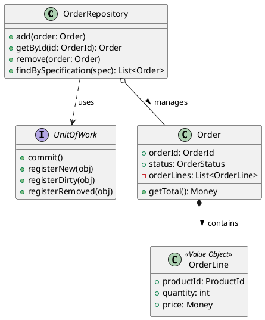

Great. I’ll draft a 1,000–1,200 word executive overview titled **“Repository Pattern: Collection-Like Access to Persistent Aggregates”**, focused on practical, real-world implementation for intermediate-to-advanced software engineers. The overview will follow a narrative, problem-solution structure, explicitly cover the twelve required topics, include a `plantuml` class diagram, and close with concise key takeaways.

I’ll let you know once it’s ready for your review.

# Repository Pattern: Collection-Like Access to Persistent Aggregates

**TL;DR:** The Repository pattern provides a collection-like abstraction for working with persistent domain objects (aggregates) while hiding database details. By mediating between the domain and data mapping layers, it promotes separation of concerns, improves testability (no SQL scattered in business logic), and upholds domain-driven design principles like aggregate consistency.

## Motivation

In large applications, scattering raw `SELECT`/`UPDATE` calls across the codebase tangles business logic with persistence concerns. This makes code harder to test (since database access is baked in) and diverts focus from the domain’s behavior to low-level data handling. The Repository pattern was introduced to **separate the “what” from the “how”** of data access. Instead of littering your domain logic with SQL or ORM code, you define repository interfaces that express intent (e.g. *“find orders by customer”*) and put the actual data-access code behind these interfaces. This indirection vastly improves **testability** – in unit tests you can swap in a mock or in-memory implementation of the repository, so your domain logic is exercised without a real database. It also keeps the domain model pure and focused on business rules, since persistence logic is abstracted away. In short, a repository acts as a *mediator* between your core domain and the data store, providing a clean API so domain code isn’t concerned with SQL syntax or database transactions. This yields more maintainable, decoupled code and makes it feasible to change the persistence technology with minimal impact on the higher layers.

## Core Anatomy

At its heart, the Repository pattern defines a **Repository interface** – a contract in the domain layer specifying operations for retrieving and managing aggregate roots. For example, an `IOrderRepository` might declare methods like `Add(Order)`, `GetById(OrderId)`, `Remove(Order)`, and query methods for Orders. This interface represents the **collection-like** behavior: from the caller’s perspective, working with a repository feels like working with an in-memory collection of `Order` objects (add, remove, find by criteria, etc.). The interface hides *how* and *where* the data is stored.

A corresponding **Repository implementation** resides in the infrastructure/data layer, actually talking to the database (or ORM, or even an event store). There may be different implementations using SQL, NoSQL, etc., but all conform to the same interface. The domain only depends on the interface, never on the database specifics. In a typical DDD layering, the repository implementation is injected into the domain or application layer code (often via dependency injection). This decoupling allows swapping out the persistence mechanism without affecting domain logic.

Each repository is responsible for an **aggregate root** type (and by extension the entire aggregate). It’s a one-to-one mapping: *one repository per aggregate root*, not per database table. For example, if `Order` is an aggregate root that contains `OrderLine` value objects, you’d have an `OrderRepository` to retrieve/save whole Order aggregates. You would **not** create separate repositories for the `OrderLine` or each database table – all persistence operations for the `Order` aggregate go through `OrderRepository`. This ensures the aggregate’s invariants and transactional consistency are maintained in one place.

Often, an optional **Unit of Work (UoW)** is used alongside repositories. A Unit of Work represents a **batch of changes** to be committed as a single transaction. In practice, the UoW tracks new, modified, and removed aggregates and flushes them to the database together (e.g. at the end of a use case). Many ORMs implement Unit of Work internally (for example, an EF Core `DbContext` in .NET automatically behaves as a UoW by deferring writes until `SaveChanges` is called). Repositories often collaborate with the Unit of Work – for instance, the repository might register operations with the UoW instead of executing SQL immediately, so multiple operations become one transaction. In simpler setups, the repository itself may initiate a transaction per operation, but in more advanced scenarios the UoW coordinates transactions across multiple repository calls.

For example, consider an Order domain in a shopping system. We have an `Order` aggregate (as the root) composed of `OrderLine` value objects. We create an `OrderRepository` interface for retrieving and saving orders, and we use a `UnitOfWork` to batch the commits:

In this diagram, `OrderRepository` provides an interface to **manage** `Order` aggregates (which contain `OrderLine` value objects). The repository uses a `UnitOfWork` to orchestrate the commit of changes (e.g. all new or modified Orders are committed in one transaction when UoW’s `commit()` is called). The `Order` aggregate root encapsulates its `OrderLine` items, and only the `OrderRepository` deals with loading or persisting these from the data store.

## Responsibilities

A repository’s responsibilities include acting as an **in-memory collection** for aggregate roots. Clients can add a new aggregate (e.g. `repo.add(order)`), remove one, or retrieve aggregates via queries – all **without exposing the underlying persistence details**. The repository internally translates these operations to the appropriate database commands, but externally it behaves like a simple collection of objects. As Martin Fowler puts it, objects can be added to or removed from a repository just like a normal collection, and query specifications can be submitted to it for satisfaction.

Another key responsibility is to **enforce aggregate boundaries**. Because each repository is tied to an aggregate root, it ensures all accesses respect that aggregate’s invariants. For example, if `Order` is an aggregate, the `OrderRepository` will always return complete `Order` aggregates (with their `OrderLines` in memory), never partial data that could violate the aggregate’s consistency rules. Likewise, it should be impossible to save an `OrderLine` on its own – it must go through the `Order` aggregate via the repository. This one-repo-per-aggregate design prevents the anti-pattern of having repositories per table that ignore the domain aggregate structure.

Repositories also often implement an **identity map** or rely on the ORM’s identity map to avoid duplicate object instances. An identity map is a cache of already-loaded entities keyed by their ID, ensuring you don’t fetch the same aggregate twice within one session or transaction. This way, if two parts of the code request `Order #123`, they get the same in-memory object (and changes unify), rather than two different copies that could diverge. The identity map is typically part of the Unit of Work/ORM, but the repository works with it to maintain consistency.

Lazy loading is another related concern: repositories might defer loading of large object graphs until needed. For instance, the `OrderRepository` might load basic order data eagerly but load the `OrderLines` lazily on first access (often the ORM does this via proxies). This way, repositories balance performance with completeness of data. However, it’s important that lazy loading doesn’t violate the aggregate consistency rules – typically all parts of an aggregate should be loaded together unless they’re truly optional. Repositories are responsible for making these trade-offs transparent to the domain layer.

In summary, a repository **hides persistence** and presents a simple collection API, **enforces the aggregate’s invariants** by controlling how aggregates are retrieved/added, and works with lower-level patterns like Unit of Work and identity map to ensure consistency and performance.

## Query Strategies

How do we ask a repository for the data we need? Naively, one might create many finder methods (e.g. `FindOrdersByStatusAndDateRange(status, start, end)`), but that doesn’t scale – you’d end up with a proliferation of methods for every new query requirement. Instead, repositories often use **flexible query strategies**:

* **Specification Pattern:** The client constructs a *specification* – an object encapsulating a query criteria (for example, an `OrderSpecification` object that might carry a status and date range). The repository can then accept a Specification and use it to filter results. Fowler notes that clients can declaratively build query specifications and submit them to the repository. This separates the definition of the query from its execution. Specifications can also be combined (e.g. an “and” of two specs) and tested in memory or against different data sources.

* **Query Objects / Criteria API:** Similar to specifications, a Query Object is a first-class object representing a query (could be as simple as a struct of parameters or a full DSL). Some languages/ORMs provide a **criteria or DSL** for queries – for example, JPA Criteria API or LINQ. Repositories may expose these by allowing callers to pass in a lambda or predicate (e.g. `orderRepo.find(o -> o.getTotal() > 100)`). Under the hood, the repository translates that predicate into a database query. This approach is seen in many implementations – for instance, an in-memory repository might simply filter a list with the predicate, whereas a SQL-backed repository might convert it to a `WHERE` clause. The key is that the repository provides a *uniform interface* for querying, regardless of the underlying mechanism. The business logic expresses queries in terms of domain concepts, not SQL.

* **DSL and fluent builders:** Some repositories offer a domain-specific language for queries. For example, a fluent API: `orderRepo.whereStatus(Status.OPEN).andCreatedAfter(date)...execute()`. This is effectively a typesafe DSL for building queries. Tools like QueryDSL or Spring Data JPA allow such fluent query construction integrated with the repository.

* **Projections vs. full aggregates:** In some cases, loading an entire aggregate is overkill if you only need a few fields (say to render a list or report). Repositories can offer methods to get **projections**, i.e. partial data or DTOs, instead of full domain objects. For example, an `OrderRepository` might have `List<OrderSummary> findOrderSummariesByCustomer(CustomerId)`, where `OrderSummary` is a lightweight DTO with just order ID, date, total. This improves performance by selecting only needed columns or using database views. However, one must be careful: once you step outside returning full aggregates, you’re essentially doing a query that the domain model might not fully govern. In DDD, many use the CQRS principle: use repositories (or domain queries) for retrieving full aggregates when you intend to modify them, but use dedicated **read models** or query services for read-only projections. Still, within a repository, providing projection capabilities can be a pragmatic choice for performance.

* **Pagination & slicing:** Repositories should provide ways to retrieve large sets in chunks – e.g. a method to fetch orders page by page (`findOrdersBySpec(spec, pageIndex, pageSize)`). This can be done by the repository translating to SQL `LIMIT/OFFSET` or using cursor-based pagination. The goal is to avoid loading thousands of records into memory when not needed. Many frameworks (Spring Data, etc.) directly support pagination by returning a page object or slice of results. Designing your repository with pagination in mind prevents consumers from inadvertently iterating over huge result sets and exhausting memory.

In implementing query strategies, a common pattern is that the **repository API is tailored to the domain**. Unlike general data access, a repository is allowed to expose only the queries that make sense for the domain’s use cases. This means the repository interface can have semantic methods (e.g. `FindOverdueOrders()`), but internally it might use a specification or query object to implement it. There is a balance: too many hard-coded methods lead to rigidity, but too generic an interface (like just a generic `query(spec)`) might push complex logic out to callers. Many modern implementations use a mix: basic CRUD plus a flexible criteria mechanism for more complex queries.

## Transactions & Concurrency

Repositories typically don’t themselves manage transactions – that’s often the role of a Unit of Work or the underlying ORM. However, the repository pattern plays nicely with transaction management. For example, in an application service you might start a transaction (or one is started for you), perform several repository operations (add/update multiple aggregates), and then commit the transaction via the Unit of Work. If using an ORM like Entity Framework or Hibernate, simply calling `SaveChanges()` on the context will commit all changes as one unit (the UoW is working behind the scenes).

A crucial aspect is **concurrency control**. In a multi-user system, two processes might try to update the same aggregate simultaneously. How do repositories help? First, it’s important to note that *the repository itself is not a silver bullet for concurrency issues* – it’s an abstraction for data access convenience. Concurrency is usually handled by a combination of patterns **alongside** the repository: the Unit of Work can track changes and detect conflicts, and an **optimistic locking** strategy is often employed. Optimistic locking typically means each aggregate has a version number (or timestamp) column; when the repository goes to commit an update, it includes the version in the `WHERE` clause and fails to update if the version has changed (indicating someone else wrote in the meantime). This way, you don’t lock the data for reads, but you detect conflicting writes. Most ORMs support this via a version field (e.g. JPA’s `@Version` column). If a conflict is detected (no rows updated because version mismatch), the repository should throw a concurrency exception. The application can then decide to retry the operation (perhaps re-reading the aggregate) or inform the user of the conflict. A **retry semantic** with a limit is common for transient conflicts – e.g. try to save up to 3 times, and if it still conflicts, surface an error.

The alternative **pessimistic locking** is to lock the data for exclusive access before making changes (for example, using a database `SELECT ... FOR UPDATE` or lock statement via the repository). Pessimistic locks ensure safety (only one process can modify), but can reduce throughput or cause deadlocks, so they are used sparingly. Usually, optimistic locking is preferred for web applications where conflicts are relatively rare. Repositories themselves don’t implement the locking logic, but they may expose mechanisms (like methods to explicitly lock or to attach a version for checks). In high-level frameworks, you often just rely on the ORM’s configuration for optimistic locking.

**Unit-of-Work integration:** The Unit of Work (whether implicit or explicit) ensures that all repository operations within a business transaction are committed atomically. For example, if you call `orderRepo.add(order)` and `customerRepo.update(customer)` under the same UoW, either both persist or both roll back. The repository should ensure that any new or changed aggregate is **registered** with the UoW. In some implementations, the UoW is behind the scenes (like the DB session), so simply calling repository methods marks entities as changed in the UoW. In others, you might call UoW methods directly (e.g. `unitOfWork.registerNew(order)`). The repository and UoW work in concert so that concurrency issues are caught at commit time and the changes are consistent.

**Optimistic locks & version columns:** As noted, having a version field on aggregates is a common approach. The repository should be aware to check that version when updating. Many frameworks do this automatically. If you implement your own repository, you might explicitly check the original version vs current DB version. The repository can throw a specific exception (e.g. `ConcurrencyException`) that the application layer knows how to handle (maybe by retrying or showing a message).

**Retry semantics:** Retrying a transaction is a common strategy when an optimistic lock fails. The repository or UoW could include a policy to retry on transient failures (like network or deadlocks) or on optimistic lock exceptions. For instance, using an exponential backoff and retry a couple of times can make the system more robust. However, one must be careful with retries on concurrency: you should re-read fresh data and merge changes as needed rather than just blindly re-applying stale updates. Often the application logic has to decide how to merge; the repository’s job is just to report the conflict.

**Idempotent inserts:** In distributed systems or when using event-driven architecture, it’s possible to receive duplicate commands or messages to create the same aggregate. Repositories can help make inserts idempotent – for example, by using natural unique keys or by checking if an aggregate with the given ID already exists before inserting. Some implementations use a form of **upsert** (insert or update) or ignore duplicate keys to ensure that performing the same insert twice has no adverse effect. The repository interface might not explicitly show this, but under the hood the repository can catch a unique constraint violation and treat it as a no-op if appropriate. Designing operations to be idempotent (especially the creation of aggregates) means if a client retries an operation due to a timeout, the repository won’t accidentally create two identical records.

In summary, transactions are typically managed by a UoW, and concurrency is handled via patterns like optimistic locking in coordination with the repository. The repository provides the hooks (e.g. saving an object with a version) and the UoW/ORM enforces the concurrency control. For high-scale, distributed scenarios (multiple services), two-phase commits across services are discouraged; instead strategies like **sagas** are used for eventual consistency – see *Evolution Path* below.

## Implementation Tactics

The Repository pattern can be implemented in various ways depending on your underlying data access approach:

* **Active Record vs Data Mapper:** These are two ORM patterns that influence repository design. In the **Active Record** pattern, the domain entity itself contains persistence methods (e.g. `.save()` or static finders). In such cases, a repository might be somewhat redundant or just a thin wrapper, since calling `Order.save()` would directly write to DB. Active Record (used in frameworks like Ruby on Rails, or some ORMs in PHP/Node) trades some purity for simplicity. However, in rich domain models, Active Record can lead to anemia or violation of single responsibility (the object does both business logic and persistence). In contrast, the **Data Mapper** pattern completely separates persistence logic into mapper classes or the ORM, keeping domain objects ignorant of how they’re saved. The Repository pattern aligns naturally with Data Mapper – the repository uses the mapper or ORM behind the scenes. Think of it this way: a **DataMapper deals with individual object <-> database mapping, whereas a Repository deals with collections of objects and uses the mapper internally**. For example, if using Hibernate (a data mapper ORM), your `OrderRepository.save(order)` will delegate to the ORM’s session to persist that object. If using Active Record (say an ActiveRecord model in Rails), your repository might simply call `order.save()` on the model. Many projects that use Active Record forego explicit repository classes and just call the model methods directly, but in a DDD context you might still wrap them for the sake of an interface boundary and testability.

* **Relational SQL vs Document NoSQL:** The repository pattern is equally applicable to different storage types, but the implementation will differ. In a relational DB, the repository might use SQL or an ORM to assemble an aggregate from multiple tables (e.g. an `Order` plus its `OrderLines` from two tables). In a document database (like MongoDB), the entire aggregate might be stored as a single document – making the repository implementation simpler (one find by ID returns the whole aggregate JSON). The repository interface remains the same; only the data mapping changes. For example, `OrderRepository.getById(id)` might internally do a SQL `JOIN` across normalized tables in one implementation, or a single key lookup in a Mongo collection in another. This ability to switch backing technology is a benefit of the pattern. It also enables **polyglot persistence** – choosing the best storage for each aggregate type without exposing those choices to the domain layer. You could have one repository using an RDBMS and another using, say, Elasticsearch for full-text search on an aggregate, and the service layer wouldn’t know the difference in code.

* **CQRS and read-only repositories:** In Command-Query Responsibility Segregation, the write side uses repositories to handle transactional updates (one repository per aggregate as usual), but the read side often bypasses domain repositories in favor of specialized query handlers or read models. For instance, if you need to display a report or join data from multiple aggregates, a direct SQL or a separate read repository (returning a DTO) might be used instead of the domain repository. Some teams create a separate set of repository-like classes for read models (sometimes called *query repositories* or just services) that don’t enforce aggregate rules – they just optimize for querying. These aren’t repositories in the DDD sense (since they might not return aggregate roots or enforce invariants), but they use a similar abstraction idea. The key is recognizing that domain repositories are for *writes/consistency on aggregates*, and for reads you have more freedom – possibly even using *no repository at all* and just raw queries if that’s clearer.

* **Event-sourced repositories:** In an event sourcing architecture, an aggregate’s state is not stored as a whole in a table but rather reconstructed from a sequence of events. Here, the repository implementation is quite different: an `EventSourcedOrderRepository` might retrieve all events for a given Order ID from an event store, then rehydrate the `Order` aggregate by replaying those events (often by calling special constructor or apply methods on the aggregate). Saving an aggregate means appending new events to the store rather than updating rows. Frameworks like Axon Framework provide an `EventSourcingRepository` that handles these details. To the caller, it still looks like `orderRepository.add(order)` or `getById(id)`, but internally `getById` will do an event stream lookup and reconstruction. With event sourcing, you often also implement **snapshots** to improve performance (periodically storing a snapshot of the aggregate state to avoid replaying an ever-growing event list). The repository would then fetch the latest snapshot and only replay events after that point. This is an advanced use of the pattern, showing its flexibility – the Repository interface stays consistent, whether the data comes from a traditional DB or an event log.

Finally, consider how the repository interacts with lower-level persistence patterns: In a typical layered architecture, the repository might call a **Data Mapper/DAO**. For example, your `OrderRepository` could use an `IOrderDataMapper` that has methods like `insertOrder(order)` and `selectOrder(orderId)`. But many times, the ORM itself is the data mapper, so the repository just uses the ORM’s API (like `dbContext.Orders.Add(order)`). The repository thus becomes a thin facade over the ORM – which is fine, because it still provides that clean interface to the domain and allows intercepting calls (for cross-cutting concerns or custom logic). Some argue that if your repository is merely wrapping an ORM with 1-to-1 methods, it might be unnecessary abstraction. This is a debated point; however, in domain-driven design, having the explicit repository interface in the domain is valuable for the *conceptual clarity* and adhering to the domain model, even if the implementation is straightforward.

## Caching & Performance Knobs

Repositories often serve as a natural place to introduce caching to improve performance, since all data access goes through them. Several caching strategies can be employed:

* **First-level vs Second-level cache:** A first-level cache usually refers to the per-session or per-UnitOfWork cache (often the identity map that the ORM or repository keeps). This ensures that during a single transaction, repeated accesses to the same aggregate ID hit the in-memory object rather than querying the database again. A **second-level cache** is a shared cache across sessions (for example, an in-memory or distributed cache that stores recently used entities or query results). Many ORMs (Hibernate, Doctrine, etc.) support second-level caches. If enabled, the repository’s fetch methods will first check the cache before hitting the DB. The second-level cache is usually keyed by primary key or by query and can dramatically reduce load on the DB for frequently accessed aggregates. However, it introduces the complexity of cache invalidation – when an aggregate is updated, the cache must be updated or invalidated to avoid stale data. Repositories can integrate with these caches, or the caching might be handled transparently by the ORM.

* **Cache-Aside (Lazy Cache):** In this strategy, the repository (or application code) explicitly interacts with a cache store alongside the database. For a read, the repository first checks the cache (e.g. Redis or in-memory) for the requested data. If present (cache hit), it returns it quickly. If not (cache miss), the repository loads from the database, returns the data, and also stores it in the cache for next time. The cache is thus filled on-demand. Writes under cache-aside usually involve writing to the database first, then invalidating or updating the cache entry. Cache-aside is simple to implement and gives fine control, but you must be careful to evict cache entries on updates to avoid serving stale data.

* **Read-Through & Write-Through:** These strategies involve the cache acting as a transparent store. In a read-through approach, the repository or underlying cache layer will automatically load from DB into cache on a miss, so subsequent reads are fast. The calling code just asks the cache; if not present, the caching layer fetches from DB and populates the cache (similar to cache-aside but managed by the cache infrastructure). **Write-through** means any time the repository writes data, it writes to the cache *and* the database at the same time. This keeps cache and database in sync for reads, at the cost of slightly slower writes. Write-through can simplify read logic (data is always in cache if it was just written) but every write pays the cost of caching.

* **Write-Behind (Write-Back):** In this less common strategy, the repository writes to the cache only, and the cache layer asynchronously flushes changes to the database later. This can improve write performance (writes return fast) and batch multiple updates, but it risks data loss if the cache fails before writing out, and introduces inconsistency windows. It’s used in scenarios where eventual consistency for writes is acceptable and throughput demands are high.

* **Hot key mitigation:** Caching introduces the concept of *hot keys* – data that is so popular that it overwhelms the cache or causes uneven load (e.g. a single cache entry that thousands of users hit). Hot keys can become a bottleneck if that cache entry expires and then a stampede of requests all try to fetch from the database. Repositories can implement **cache stampede protection**, like using locks or request coalescing so only one thread reloads a popular item while others wait. Another mitigation is to use techniques like **random early expiration** (jitter) to avoid many keys expiring at once, or **replicating read-only data** so that requests are distributed. For example, if a certain aggregate (like the “system settings” or a famous product) is extremely hot, one might cache it at multiple layers (CDN, app memory, etc.) and ensure that when it needs refresh, it’s done gracefully. While this is more of an infrastructure concern, being aware of hot keys helps in repository design – e.g. you might preemptively refresh certain caches or avoid cache for extremely volatile keys.

Other performance knobs include **batching reads** (a repository could fetch multiple aggregates in one SQL query if a use case typically needs them together) and using projections as mentioned earlier to lighten the data load. Repositories can also integrate with **CDNs or edge caches** for read-mostly data, although that’s outside typical DDD scope.

Lastly, consider using **indexes and query tuning** under the hood of the repository. If you notice a repository method is slow (perhaps it’s scanning a table), that’s a hint to add a database index or adjust the query plan. While this is not directly a repository pattern feature, a repository’s abstraction can sometimes hide inefficient queries (the infamous N+1 problem, see pitfalls). So it’s important to profile and optimize the actual queries running inside your repository methods.

## Testing Strategy

The Repository pattern can significantly improve the testability of your domain logic, as mentioned earlier. To leverage that, a few testing tactics are commonly used:

* **In-memory fake repositories:** Instead of mocking a repository’s every method, many developers create simple in-memory implementations of the repository interface for tests. For example, an `InMemoryOrderRepository` that uses a `Map<OrderId, Order>` internally. This fake repository respects the contract of the real repository (it behaves like a collection of orders) but uses no database – it’s just using memory, so tests run fast. By writing your tests against the repository interface and supplying the fake, you can test business services or domain operations without any external dependencies. This is aligned with the idea of *ports and adapters* (Hexagonal architecture) where the repository is a port; for tests you plug in a different adapter. One must ensure the fake repository’s behavior matches the real one (e.g. does it handle duplicates, does it throw the same exceptions?). A technique to ensure this is **contract tests** – write a suite of tests against the repository interface that both the fake and real implementations must pass. That way, you know your fake repository is a faithful stand-in. Using such fakes avoids over-reliance on dynamic mocking frameworks and keeps tests understandable (you’re manipulating real objects in a fake repo rather than setting up a lot of mock expectations).

* **Fixture builders:** Setting up data for repository tests or for using repositories in tests can be verbose. Fixture builder utilities can help create aggregates with necessary defaults, so tests can quickly create, say, a valid `Order` with a couple of lines instead of manually new-ing up all objects each time. For example, a builder might allow `OrderBuilder.anOrder().withRandomLines(3).build()` to get a ready-to-use aggregate. This is not unique to repositories, but helpful since aggregates can be complex. When testing the repository itself (integration tests with a real database), you might use SQL or ORM calls to insert known test data, or ideally reuse the repository to add test data (bootstrapping via repository as well).

* **Testing with real DB (integration tests):** It’s important to have some tests that run against the real database or ORM, to catch issues in mappings and queries. These are typically slower, so you have fewer of them. A common approach: use an in-memory database (like H2 or SQLite) or a testcontainer (Dockerized DB) in CI, and run the repository operations to ensure they behave as expected (CRUD works, queries return correct results, transactions roll back properly, etc.). These tests give confidence that your repository implementation is correct. The contract tests mentioned can be run against the real repo here.

* **Mutation tests on query specs:** Mutation testing is a way to verify that your tests would catch small changes (mutations) in the code. In the context of repository queries or specification objects, you want to ensure that if someone accidentally changed a query’s condition, a test would fail. For example, if you have a specification for “expired subscriptions” that uses `expiryDate < today`, a mutation test might flip the comparison to `<=` and see if any test breaks. If not, you might not be testing that logic thoroughly. Writing explicit tests for each query specification (e.g. feed the repository some data and assert that your spec returns the right subset) can give you this confidence. Essentially, treat your important queries as logic that needs unit tests too – especially if they involve complex business criteria.

* **Parallel vs serial testing:** Since one benefit of using fakes is tests run fast and isolated, you should ensure your tests don’t share state inadvertently. If using a global in-memory repository for all tests, be careful to reset it between tests or use fresh instances, to avoid tests interfering with each other’s data. For integration tests against a real database, use transactions or cleanup scripts to reset state, and consider running those tests serially (especially if using a single test database) to avoid race conditions.

* **NoSQL or external store testing:** If your repository talks to something like a file system or external service, consider an embedded alternative or a simulation. For example, if using a search index as a repository backend, you might use an embedded instance for tests. The idea is similar to an in-memory fake but sometimes you can use a lightweight real implementation.

In essence, design your repositories and domain so that business logic can be tested with **zero infrastructure** (using fakes), and test the repository itself with minimal overhead. The repository abstraction should allow you to do this easily. As the Microsoft DDD guidance says, define repository interfaces in the domain layer and use DI, so you can inject a mock or fake in your tests. This decoupling lets you run fast unit tests without needing a live DB.

## Security & Multi-Tenancy

The repository layer can also be a focal point for enforcing security and tenant isolation in the data access. Some considerations:

* **Tenant filters (soft multi-tenancy):** In a multi-tenant application where multiple tenants’ data reside in the same database (distinguished by a TenantId column, for instance), the repository should ensure that one tenant cannot accidentally query another tenant’s data. A common solution is to apply a global filter on all repository queries. For example, in certain frameworks (like ASP.NET Boilerplate or EF Core), if your entity implements an interface like `IMustHaveTenant` with a TenantId property, the infrastructure can automatically restrict queries to the current tenant’s ID. So when `OrderRepository.FindById(id)` executes, it implicitly adds `WHERE TenantId = X` (X being the tenant from the user’s context). This can be done via interceptors or by always including the tenant criteria in specifications. The Repository is a good place to centralize this logic – rather than sprinkling `where tenantId = ...` in every service, the repository ensures no data leaves or enters without matching the current tenant. In other cases, you might have separate databases or schemas per tenant (hard multi-tenancy); then your repository might need to resolve which database to connect to based on the tenant. This could be done by a factory that provides the appropriate repository instance or connection string for the tenant. Either way, the repository abstracts that detail: the application just calls `repo.getById(id)` and under the hood the correct tenant scoping is applied.

* **Row-level security (RLS):** In some databases (like PostgreSQL), you can enforce row-level security policies in the DB itself. Even so, the repository should be designed to comply with those – e.g. ensure the session user/role is set so that RLS is in effect. If not using DB-enforced RLS, the repository acts as the gatekeeper. This might involve checking the current user’s permissions against the data. For example, a `CustomerRepository` might ensure that an ordinary user can only load their own customer record, while an admin can load any. If a forbidden access is attempted, the repository can throw an authorization exception. This kind of check can also be implemented in a domain service above the repository, but having it in the repository provides an extra safety net (especially to prevent mistakes where a developer might call the repository directly without checking permissions).

* **Access policies at repository layer:** One simple approach is to perform role or permission checks at the start of repository methods. For instance, before executing a query or update, the repository checks a security context (which could be injected or globally accessible) to ensure the caller has the right role. The InfoQ article on advanced repository use shows an example of a role check at the top of an insert method. If the check fails, the repository throws a `SecurityException` (or returns an empty result, depending on policy). This ensures every use of that repository method gets the check, preventing a developer from accidentally bypassing security in a new code path. However, it can be tedious to add checks in every method; aspects or interceptors can help apply these concerns more uniformly.

* **Column-level security & data masking:** Sometimes, certain fields are sensitive (like salaries, personal data) and should only be visible to certain roles, or partially masked. Repositories can incorporate this by either filtering out those fields or returning masked values if the user doesn’t have access. One way: have the repository not even include those columns in the select for unauthorized users (if using dynamic queries). Another way: post-process results – e.g. after retrieving an entity, null out or mask fields that the current user shouldn’t see. For writes, similarly, the repository might prevent certain fields from being updated by unauthorized users (e.g. ignore or enforce values). While some of this can be handled at higher layers or via validations, doing it in the repository ensures it’s enforced for all access, even if someone forgets a check elsewhere.

* **Auditing and logging:** Not exactly security, but related – repository methods are a convenient place to add audit logging (who accessed what data) or to apply data filters (like soft deletes, which is kind of a security feature to hide deleted records unless needed). Many ORMs allow global query filters (e.g. `IsDeleted == false` automatically added). The repository can expose methods to include/exclude soft-deleted data or automatically apply those filters.

In multi-tenant scenarios, also be mindful of **connection management**. If each tenant has their own DB, the repository might need to pick the right connection. Some implementations use a context that holds the tenant info, and the repository factory gives you a repository bound to that tenant. Another approach is to scope the Unit of Work to a tenant.

**Data masking example:** Suppose you have a `UserRepository` and there’s a field `IsAdmin`. You don’t want non-admins to even see this flag for other users. The repository’s query could exclude the `IsAdmin` column for non-admin callers, or after retrieving users, do `if (!currentUser.isAdmin) user.IsAdmin = null` on each result. This way, a non-privileged user never gets to know who is admin or not. In some systems, an alternative is to maintain separate view models at a higher layer, but the repository can enforce a basic level of such policy too.

In summary, the repository can be a choke point to implement multi-tenancy enforcement (through filters or tenant-specific connections) and security checks (through role/permission verification and data filtering). It’s not the only layer for security (the application service or controller should still enforce access rules), but it provides a backup and ensures *no data leaves the database* in violation of core rules, even if a developer skips a check inadvertently.

## Evolution Path

As systems grow, the role and design of repositories can evolve:

* **From Monolith to Microservices:** In a monolithic application, you might have a single unified data model and a repository for each aggregate in the domain. All repositories might live in one module and potentially share the same database connection or ORM context. When splitting into microservices, you typically also split the data along bounded contexts. This means each microservice will have its own set of repository interfaces and implementations, and crucially its own **database (or schema)**. The repository pattern scales well here: you simply carve out the repositories needed for that microservice’s aggregates and only those go into that service. Other aggregates handled by other services get their own repositories in their services. This enforces the principle that each microservice owns its data (no sharing repositories across service boundaries). For example, in a monolith you might have `OrderRepository` and `ProductRepository` in the same codebase. In a microservices architecture, perhaps Orders and Products are in different services – so the Order service only contains `OrderRepository`, and the product data might be accessed via an API call to the Product service rather than a direct repository call. Essentially, the repository pattern guides you to already think in terms of aggregate boundaries, which often align with service boundaries. Each microservice’s repository might use a different persistence technology suited to its needs (one might use SQL, another NoSQL). The consistency within an aggregate is handled by the local repository & database transaction, and cross-service consistency is handled via other means (events, sagas).

* **Polyglot persistence:** As hinted, an evolved system might use multiple storage technologies: SQL databases, NoSQL stores, search indexes, etc. The repository pattern facilitates polyglot persistence by abstracting the data store behind the interface. One aggregate could be stored in a relational DB and another in a document DB, with each having an appropriate repository implementation. You might even swap out a store – say you start with MySQL, but then move a particular repository to Cassandra for scalability. As long as the interface remains the same, the service layer doesn’t need to change. Polyglot persistence is common in microservices (each service chooses the DB that fits best). For instance, one service’s `ProductRepository` could use MongoDB, while another service’s `OrderRepository` uses PostgreSQL. Repositories allow these differences to be encapsulated.

* **Sharding and scaling databases:** When data volume grows, you might shard a database (split one table across multiple database instances by key). This complicates data access, but again, the repository is where that complexity can be handled. A sharded `OrderRepository` might determine which shard (database instance) to query based on the Order ID or customer ID hash. The calling code is unaware of shards; it just calls `orderRepo.getById(id)` and internally the repository connects to the correct shard’s data mapper. Similarly, if you introduce read-replicas, a repository might direct read-only queries to a replica and writes to a master. These are advanced concerns, but they illustrate that the repository can evolve to handle distribution. You might introduce a *repository proxy* or a factory that picks the right repository instance for a given shard/region. There’s even a pattern where the repository interface stays the same but the implementation is dynamic (like `OrderRepositoryImpl` that internally has multiple DAOs for each shard).

* **Eventual consistency between aggregates/services:** In a single service, transactions ensure consistency within an aggregate. But across services (or across different aggregate types that have relationships), you often can’t have ACID transactions spanning them (especially in microservices or polyglot DBs). This leads to eventual consistency patterns. For example, you might have an `OrderPlaced` event that another service listens to in order to update inventory. There is no repository that spans both Order and Inventory – each service has its own. So to keep data in sync, you use events or sagas. A **Saga** (or process manager) coordinates a long-running sequence of actions across services, with compensating actions for rollback. From a repository perspective, this means you might have to design for out-of-band updates. Perhaps the repository provides methods to get data that hasn’t been eventually updated yet (or conversely, mark things as pending). This is beyond the repository pattern itself, but worth noting: when you split a monolith, repository updates that used to be atomic now become distributed. Embrace eventual consistency: don’t try to make a single repository handle two different databases in two services (that would break boundaries). Instead, use domain events and let each repository handle its own piece of the puzzle. The **Outbox pattern** is often used in conjunction with repositories to ensure that events are reliably published when an aggregate is saved.

* **Splitting and modularizing repositories:** Even within a monolith, as the codebase grows, you might modularize by bounded context or feature. You could package repository interfaces in the domain module of a context and implementations in an infrastructure module. When extracting that context into a microservice, you carry those modules out. It’s an incremental path.

* **Evolving the interface:** Over time, you might find the repository interface needs new methods or changes (maybe new query methods as requirements grow). Since many parts of the code depend on the interface, treat it like a contract – extend carefully. Sometimes you can introduce new specification parameters or overloads instead of new method names. A fat repository interface with dozens of methods is hard to maintain; you might consider splitting into smaller repositories or query services if that happens (or use the specification approach to avoid adding a new method for every filter combination).

* **Eventually removing the repository?** In some circles, particularly with CQRS, there’s discussion that perhaps repositories are less needed if you fully embrace queries outside the domain. For example, Jimmy Bogard has noted that with commands handled by aggregates and queries handled separately, you “don’t really have a need for repositories” in some cases. This is a specific viewpoint – many still use repositories on the write side. However, as an evolution, a system might move to where write-side logic loads aggregates by identity (perhaps directly via an ORM or event store) in an application service, apply commands, and save – essentially treating the ORM like the repository. This trades some formality for flexibility. The decision to drop explicit repositories would mean your domain logic is tightly coupled to a specific data source (which might be fine if your aggregate and ORM are one-to-one). For an interview or theoretical discussion, it’s good to know this perspective, but in practice, repository patterns remain very common in DDD implementations.

In summary, as your system transitions to microservices, keep one repository per aggregate **per service** – each service manages its own data store(s) via repositories. Embrace different storage tech via polyglot persistence with repository abstraction. Plan for data growth by enhancing repository implementations to handle sharding or partitioning. And handle cross-boundary consistency with sagas/events rather than trying to extend repositories across those boundaries.

## Tooling Landscape

The repository pattern is a design concept, but many frameworks and libraries embody its principles to simplify development:

* **Spring Data (Java):** A popular framework that automatically creates repository implementations at runtime from repository interfaces. For example, you define `interface ProductRepository extends JpaRepository<Product, Long>` and Spring Data JPA provides the implementation with CRUD methods and even query derivation by method name. It basically gives you a repository out-of-the-box for each aggregate/entity, with features like paging and specification integration. Spring Data supports not just JPA (relational databases) but also MongoDB, Cassandra, etc., all following the repository abstraction. This has made the repository pattern ubiquitous in the Spring ecosystem.

* **Hibernate & JPA Repositories:** JPA (Java Persistence API) encourages the repository pattern indirectly; many projects define DAOs or repositories that use the JPA `EntityManager` to perform operations. There’s also the notion of **JPA repository** in Spring as mentioned. Hibernate as an ORM provides the data mapper and unit of work; you typically still create repository classes or use Spring Data’s, rather than directly scattering `entityManager.find()` calls around.

* **.NET Entity Framework / EF Core DbContext:** Microsoft’s Entity Framework Core is essentially an implementation of Unit of Work + Repository combined. The `DbContext` object tracks changes (UoW) and has `DbSet<TEntity>` properties that act like repositories for each entity type (a `DbSet` has add, remove, find, and LINQ queries). Many .NET developers simply use the `DbContext` directly in their services (which is fine for simpler apps). Others wrap it in repository classes to explicitly define a domain interface or to add custom queries. Microsoft’s guidance for DDD suggests defining repository interfaces in the domain layer and having the EF-backed implementations in the infrastructure layer. Tools like **Repository T4 templates** or generic base classes can reduce boilerplate. There are also extensions like **EFCore Second-Level Cache** which plug caching into repository operations.

* **Sequelize (Node.js):** Sequelize is a Node ORM following the Active Record style – each model has methods to query and manipulate data. While not a repository per se, you can implement the repository pattern on top of Sequelize if desired (wrapping model calls in repository classes). Some Node projects instead use the models directly (Active Record usage). There are also Data Mapper oriented ORMs in Node like **TypeORM** which actually allows both Active Record and Data Mapper usage. In Data Mapper mode, one would typically write repository classes or use the entity manager. TypeORM even has a Repository and EntityManager API when using Data Mapper style. So in a Node/TypeScript context, you might see `userRepository.findOne(id)` using TypeORM’s repository object – that’s essentially the repository pattern in action, just provided by the library.

* **Dapper (.NET):** Dapper is a lightweight micro-ORM (essentially a SQL result set mapper). It doesn’t impose any design, it just helps execute queries and map to objects. When using Dapper, it’s common to encapsulate calls in repository classes because you have to write the SQL yourself. For instance, `OrderRepository` with Dapper might have methods that execute a SQL string and map to `Order` objects. Dapper doesn’t provide Unit of Work or identity map, so the repository is responsible for managing connections/transactions if needed. The pattern fits naturally: you keep raw SQL out of the service code by concentrating it in the repository.

* **Axon Framework (Java, CQRS/ES):** Axon is a framework for event sourcing and CQRS in DDD. Axon provides a `Repository` interface for aggregates that is quite different: it is primarily for event-sourced aggregates. For example, Axon’s repository will take an aggregate ID and load the aggregate from an Event Store by replaying events. Developers rarely implement this themselves because Axon supplies implementations that integrate with various event stores (RDBMS, NoSQL, Axon Server, etc.). In Axon, you typically call something like `orderRepository.load(orderId)` to get an `Order` aggregate (reconstructed from past events). Under the hood, it’s pulling events from an EventStore – a very different persistence mechanism, but thanks to the repository abstraction, your command handling code doesn’t need to know that.

* **Others:** There are many ORMs and data libraries in various languages which encourage a repository-like usage. For example, **Doctrine** in PHP is similar to Hibernate (Data Mapper with Unit of Work) and repositories are commonly used with it. **Laravel** in PHP uses Active Record (Eloquent), but some people implement repository classes on top for decoupling. **Golang** doesn’t have classes, but you can define repository interfaces and have struct implementations that use SQL (this is a common approach in Go clean architecture). The concept is quite universal.

* **Framework-provided base repositories:** Libraries like Spring Data, or even .NET’s Patterns & Practices from the past, often provide base classes or generic repository implementations that you can extend. Using these can save time (you get basic CRUD for any entity type). But be cautious: a generic repository (one class or one set of classes for all entities) can sometimes become an **anti-pattern** if it doesn’t respect aggregate boundaries or if it encourages anemic operations. It’s fine to use generic infrastructure as long as you still treat each aggregate root’s repository as a purposeful boundary (maybe by extending a base class per aggregate to add specific queries).

In essence, the landscape is rich: from high-level solutions like Spring Data that virtually automate the pattern, to low-level tools like Dapper where you manually implement it. Knowing the tools helps in examples during interviews: e.g., mention **Spring Data** for Java or **EF Core** for .NET as popular implementations of repository/UoW patterns, or how **TypeORM** supports repository vs Active Record modes, etc. This shows you’re aware how the theory maps to real-world tech.

## Anti-Patterns & Pitfalls

Like any pattern, misuse or overuse of repositories can lead to problems. Here are some common pitfalls to avoid:

* **Repository per table** (anti-pattern): As emphasized earlier, having one repository for each database table is not the goal in DDD. That approach usually indicates you’re thinking in terms of database normalization, not aggregates. It can lead to a situation where an operation that should be atomic across several tables (because they’re part of one aggregate) is instead split across multiple repository calls, possibly without a proper transaction spanning them. Always align repositories with aggregate roots, not tables. If you find yourself with a repository that only saves part of an aggregate, reconsider your aggregate boundaries. Sometimes in a legacy design, you might have anemic domain objects and a bunch of DAOs each corresponding to tables – migrating to DDD, you’d combine those into a fewer, more coarse-grained repositories. **Example:** An `Order` and `OrderLine` stored in separate tables – don’t do `OrderRepository` and `OrderLineRepository` separately; do one `OrderRepository` that handles the `Order` (and its lines). One-per-table is essentially the old DAL pattern, not a true DDD repository.

* **The God Repository**: On the flip side, dumping everything into one giant repository (or a few broad repositories) is also bad. Sometimes developers create a single `GenericRepository` for all entities or use one class to handle many unrelated aggregates. This leads to a **god class** that violates single responsibility principle. It can also become a performance and maintenance nightmare because it might mix logic for different aggregates and possibly skip proper invariant enforcement. If you find methods in one repository dealing with completely different aggregates, that’s a red flag. Keep them focused. A slight exception can be if two aggregates are almost always loaded together, one might consider combining them, but generally each aggregate gets its own repository (or at least each aggregate cluster in a bounded context). Also, a generic repository that is not constrained to aggregate roots can tempt developers to use it for any data access, which undermines the whole pattern. It’s better to explicitly define repository interfaces for each aggregate root, even if internally you use a generic base class to reduce code.

* **Leaking persistence details (or entities) outside**: A repository abstraction is supposed to shield the domain layer from persistence mechanics. A common pitfall is returning the ORM entity object directly and that object is still attached to a persistence context, exposing lazy loading or proxy behavior unknowingly. For instance, if your `Order` is an Entity Framework proxy and you pass it out, any navigation property access triggers a database call – which the higher layers might not expect (leading to hidden N+1 queries). It also means those layers need the ORM’s DLLs. Ideally, the repository returns plain domain objects (which might be mapped from persistence models). If you *are* using the same classes as both domain and persistence objects (common in Active Record or simple scenarios), be mindful not to expose things like session references. Also, avoid requiring callers to know about things like `Include()` or other data-access hints – that’s repository’s job. Another aspect of leaking is when repository interfaces get too influenced by the database. For example, having a repository method `FindByRawSql(string whereClause)` – this defeats the purpose of abstraction and ties the interface to SQL. Or exposing an `IQueryable<T>` from a repository in .NET – that basically hands the keys back to the caller to write queries, coupling them to the ORM. That’s often considered an anti-pattern because it breaks the encapsulation (though some pragmatic teams do it for flexibility with caution). Strive to keep the repository interface in the language of the domain (e.g. `FindOrdersPendingShipment()` not `Query(Expression<Func<Order,bool>> predicate)` unless using Specifications explicitly).

* **Chatty usage and aggregate loading issues**: Repositories should be used in a way that minimizes chatty interactions with the data source. A *chatty* scenario might be: the code retrieves an `Order` via repository, then separately calls another repository for each `OrderLine` or related entity. Ideally, one repository call should retrieve the whole aggregate needed. If the design forces multiple calls, consider adding a method to repository that gets the whole aggregate graph. Another chatty pattern is loading collections in a loop – e.g., you have a list of IDs and you call `repo.getById` for each in a loop, resulting in N queries. It might be better to add a bulk method (like `GetByIds(IEnumerable<Id>)`) to fetch them in one go. In distributed systems, if your repository is actually calling a remote service, you want to avoid too many round trips (similar principle as with databases). **Batching** and tailored methods can help reduce chatty interactions.

* **Hidden N+1 queries**: This is a specific performance pitfall often arising from ORMs and lazy loading. It occurs when the code using an aggregate triggers additional queries for related data without realizing it. For example, you call `orderRepository.getById(id)` and it returns an Order with a lazy-loaded `OrderLines` collection. If you then iterate `order.Lines` in a loop of 10 orders, and for each order the first access to `Lines` triggers a SQL query to load them, you end up with 1 (for orders) + N (for each order’s lines) queries. This *N+1 problem* can severely degrade performance. Repositories should try to prevent this by either **eagerly loading** relationships that will likely be needed or providing methods that load all required data. Many ORMs let you specify includes (e.g. `Include(Order.Lines)`) in the repository implementation. Alternatively, you can document that certain collections need explicit loading. But a better approach is to fetch aggregates complete if possible. If performance profiling shows N+1 issues, address it in the repository rather than hacking in the service layer. For instance, if you see a service querying 10 orders and then each order’s lines, you might introduce a repository method `GetOrdersWithLines(specification)` that does a join fetch and returns all lines in one query.

* **Over-specification or overly granular methods:** If you find a repository interface exploding with dozens of methods for every combination of criteria, that’s a smell. It often indicates not using specifications or query objects effectively. It also tightly couples the repository interface to possibly transient UI needs. It’s better to have a few general-purpose querying mechanisms than lots of one-off methods. This isn’t a formal anti-pattern name, but it’s a design concern – keep repository interfaces lean and use patterns like Specification for complex queries rather than hard-coding too many finders.

* **Skipping the repository for writes:** Another pitfall is when someone finds it easier to bypass the repository for a quick update – e.g. directly executing a SQL update in the application layer for expedience. This creates inconsistency and technical debt, as those changes bypass business logic or any caching the repository might be doing. It might also violate invariants. If you catch such occurrences, consider refactoring to use the repository or update the repository to support that operation properly. All writes to an aggregate’s data should funnel through its repository to maintain that consistency guarantee.

To sum up, avoid designing repositories that correspond to tables rather than aggregates, steer clear of one monolithic repository for everything, don’t leak out ORM specifics, be mindful of performance (chatty usage, N+1), and keep the abstraction boundaries clean. When used correctly, the repository pattern is powerful, but when misused it either adds unneeded complexity or hides performance bugs. Always align repository design with the domain model’s intent.

## Key Take-aways

* Repositories **decouple domain logic from persistence**, providing a collection-like interface to fetch and manage aggregates. This improves testability and maintains a clear separation of concerns.
* **One repository per aggregate root** – ensures all modifications to an aggregate go through a single gate keeping invariants and transactional consistency. Avoid repo-per-table designs.
* Repositories work hand-in-hand with patterns like **Unit of Work** (batching changes into transactions) and often leverage **identity maps** to avoid duplicate object instances.
* Support flexible querying via **specifications, query objects, or DSLs** instead of hardcoding endless finder methods. Repositories can return full aggregates or lightweight projections, and support pagination.
* Integrate **optimistic concurrency control** (e.g. version columns) so conflicting writes are detected. Use UoW for atomic commits, and design operations to be retried or idempotent where needed.
* The pattern is adaptable to various storage tech (SQL, NoSQL, event stores). Tools like Spring Data, EF Core, etc., implement repositories/UoW, reducing boilerplate.
* **Caching** can be layered under repositories (first-level identity map, second-level cache, or explicit cache-aside strategies) to boost performance, but watch out for cache invalidation and hot keys.
* In testing, leverage the abstraction: use in-memory fakes or mocks for unit tests and run separate integration tests against real DB to validate your repository logic.
