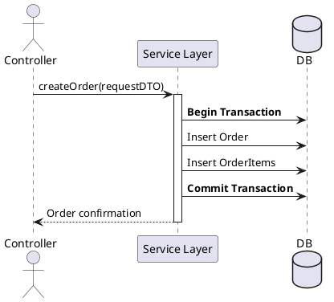

Great. I’ll write a 1,000–1,200-word executive overview titled **“Service Layer Pattern: A Thin Façade for Consistent Business Operations”** aimed at intermediate-to-advanced software engineers prepping for system design interviews.

It will use a clear, problem-solution narrative style and cover all 13 specified bullets, including a PlantUML sequence diagram embedded in code, using Java for example clarity.

I’ll let you know as soon as it’s ready for review.

# Service Layer Pattern: A Thin Façade for Consistent Business Operations

**TL;DR** – The Service Layer is a *thin façade* that exposes a cohesive set of business operations as an application’s boundary. It prevents controllers/UI code from drowning in domain calls by encapsulating workflow logic, managing transactions, and coordinating domain objects. Each service operation executes as one atomic unit (often one transaction), ensuring consistency and clarity across multiple clients and use cases.

## Motivation: Why Introduce a Service Layer?

In growing applications, controllers or UI actions often end up making numerous domain/repository calls and manually handling transactions. This leads to duplicated code and scattered orchestration logic across the UI and other interfaces. For example, without a Service Layer, both a web UI and a batch job might separately implement the steps to create an order – each opening a transaction, invoking several domain operations, sending notifications, etc., resulting in inconsistency and copy-paste code. A Service Layer addresses this by centralizing such **application logic** in one place. It defines the application’s boundary and available operations, encapsulating business logic and controlling transactions in each operation. In short, it **keeps interface code thin** and **avoids duplication**: client layers (UI, APIs, other systems) simply call a service operation, which internally handles the necessary workflow. As Martin Fowler notes, if you foresee multiple client types or complex multi-step business use cases, “it pays to design in a Service Layer from the beginning”.

## Core Anatomy of the Service Layer

A Service Layer typically consists of **service interfaces** and their **implementations**, plus supporting data-transfer objects:

* **Service Interface / Facade:** Defines a clear set of operations (methods) that comprise the application’s functionality (e.g. `OrderService.createOrder(...)`). This interface is the *application boundary* – all clients go through it to invoke business logic. It provides a cohesive API oriented around business tasks, not technical CRUD of individual tables.
* **Service Implementation:** A class (often simply called “SomethingService”) that implements the interface. It acts as a *transactional façade*: the public method typically starts a transaction, orchestrates calls to domain objects or repositories, then commits/rolls back at the end. The service is usually stateless (no conversational state between calls) and can be managed by a framework (e.g. a Spring `@Service` bean with `@Transactional` methods).
* **Dependencies:** Inside, a service uses injected **domain/repository** components. For example, an `OrderServiceImpl` might inject an `OrderRepository` and an `InventoryService` (domain service) to perform its work. The service method delegates to these lower layers for actual business calculations or persistence.
* **DTOs / Command Objects:** Services often accept **command DTOs** (data transfer objects carrying input data) and return **result DTOs**, instead of exposing the internal domain entities. This prevents *leakage* of persistence-specific objects outside and allows flexibility in mapping. For instance, a `CreateOrderRequest` DTO might encapsulate all info needed to place an order; the service converts it to domain objects, invokes the business logic, and returns an `OrderSummaryDTO`. Using DTOs is especially important if the Service Layer might be exposed remotely – it forces a clean separation. (In fact, making service methods deal in DTOs is often necessary for remote interfaces, albeit with some development overhead.)

In summary, the Service Layer’s anatomy is a simple *class interface + implementation* pair per coherent domain area, with **injected collaborators** and use of **DTOs** to keep the boundary clean.

## Responsibilities: Orchestration, Consistency, and Enforcement

The Service Layer is responsible for **orchestrating complex workflows** that involve multiple domain objects or resources. It *coordinates aggregates* and ensures business operations complete consistently:

* **Workflow Coordination:** If a use case involves multiple steps or multiple aggregates, the service method will call each in the correct order. For example, a `transferFunds` operation might debit one account and credit another via two domain objects – the service layer coordinates these calls to ensure the overall process either fully succeeds or fails as a unit.
* **Enforcing Business Invariants Across Entities:** Domain objects enforce their *local* invariants, but when a rule spans multiple entities or aggregates, the Service Layer can enforce it. For instance, “When an Order is placed, reduce the Product stock and send a confirmation email.” The Order and Product aggregates individually don’t know about each other – the service layer enforces the cross-aggregate rule.
* **Managing ACID Transactions:** A key responsibility is to manage **transaction boundaries**. The service ensures that all steps in an operation happen within a single *atomic* transaction scope. It begins a transaction (explicitly or via container/ORM), invokes multiple repository operations, and commits or rolls back at the end. This guarantees consistency – e.g. an order and its order-items are either both saved or both rolled back. Fowler’s pattern description emphasizes that such complex responses (perhaps involving multiple databases or actions) *“must be coordinated, and transacted atomically, by Service Layer operations”*. In practice, frameworks allow annotating service methods with transactional semantics so that one service call equals one unit-of-work.
* **DTO Mapping and Data Transformation:** The service maps between external-facing DTOs and internal domain models. This includes validating and translating input data into domain calls, and converting domain results into output DTOs. It thereby isolates the domain from presentation or transport formats.
* **Publishing Events and Integrations:** Often, the Service Layer handles **post-operation events**. If a domain operation triggers an important business event (order placed, payment received), the service can publish a message or call an external service. For example, after creating an Order, the service might emit an `OrderCreated` event or call an EmailService to notify the customer. In Fowler’s revenue recognition example, after domain logic computes results, the Service Layer “must respond by sending an e-mail notification to an admin and by publishing a message to notify other applications” – the Service Layer is a convenient place to fire off such domain events or integration messages in the same transaction.

In essence, the Service Layer takes on **application-wide concerns**: it ensures that **all domain operations needed for a use case are invoked**, that **all rules (including cross-entity rules) are respected**, and that **the outcome is atomic and consistent**. It delegates domain-specific computations to the domain model, but it oversees the bigger picture of each use case.

## Granularity and Naming of Service Operations

A well-designed Service Layer exposes **coarse-grained, task-oriented operations**. Each service method usually represents a *complete business action* or **use case** (often aligning with a user story or application feature):

* **Task-Oriented APIs:** Service operations are named after the business intent: e.g. `createOrder`, `changeCustomerAddress`, `approveLoan`. This makes them intuitive for developers and aligns with the ubiquitous language of the domain. Such operations hide the internal workflow behind a simple call. For example, a single `terminateEmployee(employeeId)` service call might internally update an employee’s status, revoke credentials, notify payroll, etc., but the client just sees one high-level operation.
* **Coarse-Grained vs. Fine-Grained:** Service interfaces are **coarse-grained by definition**, meaning each operation covers a significant chunk of work. This is especially important if the Service Layer is exposed to remote clients – you want to avoid “chatty” interactions that require dozens of fine-grained calls over the network. Fowler notes that a Service Layer’s interface naturally lends itself to coarse operations and thus is well suited even for remote invocation. For local calls (e.g. within a monolith), you could have finer operations, but it’s still best to keep them at the use-case level, not mere single-attribute setters.
* **One Operation per Use Case:** Often there’s a near one-to-one correspondence between **use cases (or UI actions)** and service operations. Many enterprise apps have plenty of CRUD-oriented use cases – “create this entity, update that entity” – and it’s common to have a matching service method for each. While CRUD might sound trivial, real use cases often involve additional steps like validation or notifications, which the service encapsulates. The naming should reflect the *business action*, not the low-level database action. For example, prefer `registerUser()` over `insertUserRecord()` to convey the intent.
* **Composable but Not Too Chatty:** Service operations should be *coarse* enough to handle a complete task internally, but *fine* enough that clients can still compose them for complex flows. If they’re too broad (“doEverything()”), you lose reusability; if too narrow, the client has to orchestrate multiple calls (defeating the purpose). A good heuristic is that **one operation corresponds to one transaction and one consistent state change** in the domain. Clients can then call multiple services sequentially if needed, but each call stands on its own as a meaningful unit.

**Naming** conventions typically use verbs and domain nouns (“submitOrder”, “recalculateInvoice”). This makes it clear what each service does. The goal is an API that reads like the use cases it supports.

## Transactional Boundaries: One Operation, One Transaction

A crucial principle of the Service Layer is that **each service call runs in a single atomic transaction** (when transactions are applicable, e.g. when interacting with a database). This means all data modifications within that call either **commit** together or **roll back** together on failure. In a monolithic architecture with a single database, this is straightforward – frameworks will wrap the service method in a database transaction.

* **Transactional Script vs. Domain Model:** The Service Layer can be seen as a sophisticated transactional script manager. It begins a transaction, calls into domain logic (which may involve multiple repositories), and then commits at the end. If any step fails or throws an exception, the transaction is rolled back to keep the system consistent.
* **Container-Managed Transactions:** In enterprise environments (Java EE, Spring, .NET, etc.), you typically declare service methods to be transactional (e.g. `@Transactional` on a Spring service). All repository calls then join this transaction context. Fowler’s pattern suggests using *container-managed transactions* at the service level to handle complex use cases across multiple resources. Even in a single-process application, this layering helps consistency. If you only had one UI and one database, you *could* let the controller manage transactions, but as soon as scenarios grow, it’s cleaner to put it in the service.
* **Nested Service Calls:** If one service method calls another service method internally (which is rare but can happen for shared logic), transaction management must ensure they don’t start a new transaction inside an existing one (most platforms will join or suspend transactions accordingly). The general rule is *the entire flow initiated by the external client is one transaction*.
* **Distributed Transactions and Sagas:** In modern microservice or distributed architectures, a single service call might not cover all data changes if multiple services are involved. Two-phase commit (XA transactions) across services are typically avoided due to complexity and blocking concerns. Instead, the **Saga pattern** is used for distributed transactions: the service orchestrates a series of local transactions in different services, with compensating actions on failures. In such cases, each service still adheres to “one operation, one local transaction”, but achieving global consistency relies on the saga coordinator. Implementing sagas often requires service operations to be **idempotent** (so they can be retried safely). The service layer might include retry logic or unique operation IDs to ensure that if a call is repeated (due to network issues or saga retries), the outcome is the same and duplicates are avoided.
* **Idempotent Retries:** Whether within a saga or even for public APIs, it’s wise to design service operations to handle retries gracefully. For example, a `createOrder` operation could safely ignore a duplicate request if an order with the same ID already exists, rather than creating it twice. Clients (or middleware) will sometimes retry failed calls, so the service should not produce side effects (like double-charging a credit card) on a retry.

In summary, *transactional integrity* is a cornerstone: **each service call = one consistent commit**. Below is a sequence diagram illustrating a typical service call with transaction demarcation:

## Validation and Security at the Boundary

The Service Layer is a natural place to enforce **validation** and **authorization** at the application boundary:

* **Input Validation:** Before processing a request, the service should validate the input DTO or parameters for correctness (e.g. non-empty fields, formats, business rules that can be checked upfront). This ensures that only valid data is passed to the domain model. For example, `OrderService.placeOrder(dto)` might check that the order has at least one item, the shipping address is present, etc., throwing an exception or error result if not.
* **Business Rule Validation:** Some high-level rules can also be enforced in the service, especially those that involve *global* checks. However, per the *single responsibility principle*, true business invariants are usually better enforced within domain objects. The service acts as a first line of defense (to avoid needless domain calls when data is clearly invalid), but domain entities should still enforce their own consistency internally. This *defense in depth* ensures that if the service misses something, the domain will catch it. For instance, a `Customer` object might refuse an invalid email format even if the service didn’t catch it.
* **Security (Authorization):** The service layer is an ideal spot for **role-based access control checks**. Since all important actions funnel through here, you can verify the caller’s permissions before any domain or DB work is done. For example, `InventoryService.adjustStock()` might first verify that the user has an “Inventory Manager” role. Many frameworks support annotations or interceptors for this (e.g. Spring’s `@PreAuthorize` on service methods). By doing this at the service boundary, you protect the system regardless of how the call comes in (UI, API, etc.). The domain layer, meanwhile, can be written assuming it’s being used correctly by authorized parties, though in highly sensitive logic one might still include checks or design the aggregates such that unauthorized changes can’t even be represented.
* **Authentication Delegation:** Usually authentication (verifying user identity) is handled before hitting the service (e.g. in a controller or middleware). The service can trust that the user is known, but it should still enforce *authorization* (ensuring the user is allowed to do the operation). This separation keeps the service focused on business rules and security relevant to those rules.

In practice, validation and security often use a mix of techniques: e.g. UI or controller does basic input checks and passes a DTO, service does deeper validation (especially cross-field or cross-entity checks) and authorizes the request, and domain objects finally ensure no invalid state transitions occur. This layered validation prevents bad data from slipping in and ensures **only legitimate actions are executed**.

## Integration Options: How Services Are Consumed

The Service Layer can be exposed and used in various integration styles:

* **Synchronous Calls (In-Process or RPC):** In a typical web application, a UI Controller (MVC controller, REST controller, GraphQL resolver, etc.) will call the service layer *in-process*. The service returns results or throws errors, and the controller then prepares the HTTP response. This is a simple, low-latency integration. If the service layer is in a different process or machine, it might be exposed via a network API – e.g. as RESTful endpoints or gRPC methods corresponding to the service operations. In that case, the controller is essentially a thin RPC stub and the real logic is in the service on the server side. Each operation is coarse-grained enough to be a network call.
* **Asynchronous Messaging:** Services can also consume **messages or events**. For example, a service might subscribe to a message queue or topic (e.g. an "OrderCreated" event from another system) and perform an action in response. Here the service layer would be invoked by a message handler rather than a direct method call. The service processes the message within a transaction and possibly sends follow-up messages. Asynchronous command handling (via queues) is common in event-driven architectures – e.g. placing a message on a "shipping requests" queue that a ShippingService listens to.
* **Thin UI Controllers:** Regardless of sync or async, it’s a best practice that **controllers remain thin** and simply hand off to the service. The pattern is often phrased as “Thin Controller – Thick Service (or Model)”. The controller or API endpoint should ideally do nothing except translate the web request into a service call and then translate the result back to HTTP/JSON. All business decisions happen in the service layer. This separation makes the business logic reusable (multiple UIs or interfaces can call the same service) and easier to test (you can test the service without a web layer).
* **Remote Facades:** If your service layer is meant to be accessed remotely by clients, you might introduce a *Remote Facade* – essentially a wrapper that calls the local service but presents a simplified, coarse API to remote callers. In many cases, though, you can use the same service classes directly via JSON/HTTP or gRPC as long as you mind the granularity. The key is not to expose *chatty, low-level* methods to remote callers. Sometimes a separate API layer is created on top of the Service Layer for public consumption, especially to handle versioning or protocol translation (e.g. GraphQL resolver calling a service method).
* **Internal vs External Integration:** Internally, other services or schedulers might call the service layer too. For instance, a nightly job might call `BillingService.generateInvoices()` to perform batch work. Externally, partners or clients might call via an API. In both cases, the service provides a stable contract – the internal code behind it might evolve, but the interface remains consistent for consumers.

In summary, whether via direct function calls, HTTP requests, or message queues, the Service Layer sits in the middle of a **thin controller/adaptor and the rich domain model**, ensuring a clean separation of concerns.

## DTOs and Mapping Strategies

Using **Data Transfer Objects (DTOs)** to carry data in and out of the service is a common practice, especially as systems scale or become distributed:

* **Command vs. Query DTOs:** It can be useful to distinguish *command DTOs* (inputs that instruct the system to do something, often with minimal return data) and *query DTOs* (outputs that carry data, often for read-only views). For example, a `CreateOrderCommand` DTO might just have the necessary info to create an order, and the service returns either nothing or an identifier. Conversely, a `OrderDetailsDTO` could be returned by a `getOrderDetails(orderId)` query operation, containing a rich snapshot of data. Separating these models helps tailor each to its purpose and avoid accidentally exposing internal fields in write operations.
* **No Persistence Entities Leakage:** DTOs **decouple** the service interface from the persistence layer. Rather than returning JPA or Entity Framework objects (which might be lazy-loaded proxies or include extraneous relationships), the service maps them to plain serializable structures. This avoids issues where UI code might inadvertently modify a persistent object outside a transaction or where data that shouldn’t be exposed sneaks into the API. It also frees the domain model to evolve internally without breaking API contracts.
* **Mapping Tools:** Mapping between DTOs and domain objects can be tedious, so many teams use libraries or code generators. For instance, in Java, **MapStruct** can generate mapping code at compile time, and in .NET, **AutoMapper** can map properties by convention. These tools reduce boilerplate but need careful configuration to avoid performance issues or silent mapping errors. In simpler cases, manual mapping in the service method is fine and often clearer.
* **Prevent Over-Fetching:** Design your DTOs to only include necessary data for the client. For instance, a `UserProfileDTO` for display might not include every internal field of the `User` domain object – just the ones needed on screen. Conversely, for a command DTO, include only the needed inputs. This discipline also protects the domain: clients can’t rely on or mutate things they shouldn’t know about.
* **Versioning and Evolution:** One advantage of using DTOs is the ability to version your service API. If the domain model changes (say you split an `Address` into separate BillingAddress and ShippingAddress in the domain), you can adjust the service to still accept the old DTO for existing clients, translating it into new domain calls under the hood. Over time you might introduce a new version of the DTO for new clients. This mapping layer thus acts as an **anti-corruption layer** at the boundary for your domain model changes (on a smaller scale).

In summary, DTOs are a key tool for a *clean separation of layers*. The Service Layer uses them to *translate between external representations and internal models*. The extra mapping code is usually worth the clarity and safety gained – and frameworks can help automate it. Fowler cautions that if you go for remote services, be prepared to invest in writing DTO transformation code, but this is a known cost of distributed systems.

## Testing Strategy for the Service Layer

Testing the Service Layer is vital since it contains the orchestration logic for business use cases. A multi-pronged testing approach works best:

* **Unit Tests with Mocks:** At the unit level, you can test each service method in isolation by **mocking its dependencies** (repositories, domain services, external gateways). This is fast and ensures the service coordinates calls correctly. For example, you can simulate that `orderRepository.save()` returns a certain object and that `paymentService.charge()` throws an exception, and verify the service handles it (e.g. rolls back transaction, throws the right error). Tools like JUnit + Mockito (Java) or xUnit + Moq (C#) are commonly used. The service is a good candidate for unit tests because its methods usually contain conditional logic and sequence of calls that we want to validate.
* **Integration/Slice Tests:** To gain confidence that the service layer works with real infrastructure, write integration tests that load the service with real implementations (e.g. using an in-memory database and the real repository). These tests might run slower but they test the whole stack from service to DB. Often called *service-level integration tests*, they ensure that transactions are configured correctly, data mappings work, etc. For example, using an H2 in-memory database for a Spring service test, you can start a transaction, call the service, and confirm the database state and outputs.
* **Contract Tests:** If your service layer is exposed via an API to other teams or systems, consider **contract testing** at the service boundary. This could mean using tools like Pact (consumer-driven contracts) to ensure your service’s API meets the agreed schema and behavior. Or more generally, writing tests that simulate a client calling the service through its public interface (HTTP or RPC) and verifying the responses. This ensures that from an external perspective the service does what it promises.
* **Domain vs Service Testing:** Keep in mind which rules you test where. Business rules inside domain objects should be covered by domain tests. Service tests focus on the sequencing, transaction handling, and integration points. For example, you might have a domain test ensuring an `Order` cannot have a negative quantity, and a service test ensuring that when `placeOrder` is called with an invalid DTO, the service returns a validation error (without calling repository).
* **Use of Test Doubles:** When writing service tests that involve external integrations (like sending an email), it’s common to use fakes or stubs for those gateways to avoid side effects. You might inject a dummy EmailGateway that just records that an email “would have been sent” and assert that in the test.

A well-structured service layer lends itself to testing because of clear boundaries. Fast unit tests give quick feedback on logic, and targeted integration tests ensure all the pieces work when assembled. This combination helps catch bugs both in the orchestration and in the interactions with the environment.

## Scalability and Performance Considerations

While the Service Layer is primarily an architectural pattern, there are ways to optimize it for better performance and scalability:

* **Batching and Bulk Operations:** Because a service call can hide complexity, it can also perform optimizations like **batch processing**. For example, a `UserService.importUsers(listOfUsers)` operation might internally batch database inserts (doing one `INSERT` for many users, or using bulk API calls) to improve throughput. The clients remain oblivious – they still just call one service method. Similarly, if a screen shows 100 accounts with their balances, a service method `getAccountsWithBalances()` could fetch all data with one optimized query rather than the client calling 100 times.
* **Connection Pooling and Resource Management:** In high load scenarios, ensure that the underlying resources (DB connections, threads, etc.) are pooled and reused. Most frameworks do this (e.g. a container-managed transaction will use a connection from a pool). The service layer should avoid long-running operations that hold up resources unnecessarily. If a service method needs to do something very time-consuming, consider breaking it up or doing some work asynchronously to free the main transaction sooner.
* **Read/Query Shortcuts:** Not all operations need to go through heavy domain logic. For read-only queries, one might use optimized data access. For example, a service might detect that a request for a simple list of names doesn’t require building entire domain aggregates – it could use a projection or direct SQL to fetch just those columns, mapping them to a lightweight DTO. This is a form of CQRS (Command Query Responsibility Segregation) where queries are handled differently for performance. By providing a dedicated query method in the service, you encapsulate this optimization behind the service API.
* **Caching Results:** If certain service queries are called frequently and involve expensive computation or IO, adding a **caching layer** can greatly boost performance. This can be done via AOP or decorators that cache the output of service methods based on their parameters. For instance, you might cache the result of `ProductService.getProductDetails(productId)` for a few minutes to avoid hitting the database repeatedly. Many frameworks (Spring Cache, etc.) allow annotation-driven caching at the service layer (e.g. `@Cacheable` on methods). Be cautious to cache only idempotent, read-only results and to handle cache invalidation on writes (which the service can trigger).
* **Concurrency and Scaling Out:** Service layers in a stateless architecture can usually be scaled horizontally (multiple instances behind a load balancer) since each call is independent. Ensure that any in-memory state in the service (usually none, if stateless) doesn’t impede scaling. Use appropriate locking or isolation in transactions if concurrent calls could conflict on the same data (this is more of a database concern, but the service design can influence it by perhaps using optimistic locking or sequences of updates).
* **Asynchronous Work:** For performance, a service operation might offload some non-critical work asynchronously. For example, `placeOrder()` could save the order and commit, then publish an event for sending a confirmation email rather than sending it within the transaction. This shortens the transaction length and improves throughput. The event handling (email sending) might happen in another thread or service, improving user-perceived performance. The Service Layer thus can act as a bridge to asynchronous processing for scalability.

Overall, to scale, you ensure the service methods do **just what is needed, no more** (avoid extraneous queries by using join fetches or selective loads) and employ typical enterprise performance tactics (caching, pooling, batching) behind the scenes. The beauty is that these optimizations remain transparent to service consumers – you can add caching or batching internally without changing the service interface.

## Deployment Patterns and Framework Support

The Service Layer pattern is technology-agnostic, but how it is implemented can vary across different platforms:

* **Monolithic Deployment (Jar/War):** In a traditional layered monolith, the service layer is just part of the application’s class hierarchy, typically packaged separately from controllers and domain classes (e.g. in a `service` package or module). For example, a Java web application (Spring Boot jar or Java EE war) includes service classes that are called by servlets/controllers and in turn call DAOs. Deployment is single-unit, but the logical layering still applies.
* **Spring Framework (@Service):** Spring popularized the use of the `@Service` stereotype annotation to mark service-layer classes. Combined with `@Transactional`, it handles transaction scopes automatically. In Spring, you might have `@Service public class OrderService { ... }` and you inject repositories via `@Autowired` or constructor. Spring’s approach aligns perfectly with this pattern – it encourages thin controllers calling services. Similarly, other Java frameworks like Jakarta EE or Quarkus use CDI (@ApplicationScoped beans) in a comparable way.
* **Quarkus Panache and Active Record:** Some modern frameworks like Quarkus with Panache blur the lines by letting entities have data access methods (Active Record pattern). Even then, for complex operations, one often writes transactional services (e.g. using `@Transactional` on a method in a CDI bean) that coordinate multiple Panache entities. The need for orchestration doesn’t go away – it just might shift how repositories are defined.
* **Micronaut and Others:** Micronaut, .NET Core, NestJS (Node), all have the concept of injectable singleton/scoped services. In .NET, for instance, one would define interface `IOrderService` and class `OrderService` and register it in the DI container. The patterns of usage (controllers call service, service uses repository) are the same. .NET Core might not use an annotation, but the idea of a service class fulfilling use cases is common.
* **Serverless Functions:** Even in serverless architectures (AWS Lambda, Azure Functions), the Service Layer concept can be applied. For example, if you have a Lambda function triggered by an API Gateway, the Lambda’s handler can act as the controller, instantiating or calling a Service class to do the work. The service can be a plain class that the function code uses. In Serverless, you might deploy functions per action (which might seem like just one function = one service operation) – but you still benefit from structuring the logic in a service module for testability and organization, especially if multiple functions share logic. Also, one can implement an anti-corruption layer as a service function that fronts a legacy system call, translating input/output.
* **Module or Microservice per Service:** When evolving a system, sometimes each *service class* in the monolith can become its own microservice. E.g. what was `InventoryService` becomes an independent deployed service (with possibly a REST interface). This is a deployment refactoring: initially, all service classes might run in one process; later, you carve them out into separate processes or containers if needed for scale or independence. The pattern helps here, because if your boundaries were well-defined, those boundaries become natural seams for splitting out.

In any deployment, the Service Layer’s role is consistent. It might be implemented by different underlying tech (POJOs, EJB session beans, .NET services, Functions), but its *logical position* remains the same – the layer where business use cases are implemented and transactions managed.

## Evolution and Refactoring Considerations

As systems grow and change, the Service Layer can evolve in several ways:

* **From Monolith to Microservices:** A well-defined service layer in a monolith provides a map for splitting into microservices. Each service or group of related operations could be extracted to a separate service boundary. For instance, a monolithic `OrderService` and `CustomerService` might become two microservices (with their own controllers, databases, etc.). During such refactoring, it can help to implement an **Anti-Corruption Layer (ACL)** to ensure the monolith and microservice remain consistent. An ACL is essentially a translator or adapter between old and new boundaries. For example, if the old monolith expects to call a local method, an ACL could intercept and translate that call to a REST call to the new microservice, making the split transparent to other parts of the monolith during a migration. This pattern allows you to gradually peel off services without breaking the remaining monolith.
* **Extracting Domain Logic from Services:** Over time, a service class might accumulate a lot of code, some of which is actually business logic that belongs in the domain layer. Regular refactoring should be done to **push logic down** into domain objects (entities or domain services) where appropriate. For example, if `PolicyService.approveClaim()` contains complex logic about claim validity, that logic might be better moved into the `Claim` aggregate (like a method `claim.approve()` that enforces rules). The service would then simply orchestrate and call `claim.approve()`. This makes the domain richer and the service thinner, moving towards the ideal DDD balance (rich model, thin application layer).
* **Combining or Splitting Services:** You may find that what started as one service class should be split into two as the system grows, or vice versa. Perhaps `OrderService` is doing too much – handling order placement as well as payment processing. It might make sense to create a `PaymentService` for clarity (and maybe eventually a separate team). Conversely, if two services always get called together and have intertwined logic, you might merge them or one might call the other internally to simplify the workflow.
* **Layered Architecture to Hexagonal/Clean Architecture:** Some architectures evolve to *ports-and-adapters* (hexagonal) style, where the Service Layer might be considered an **Application Layer** coordinating use case execution. The pattern still applies, but you might rephrase services as “use case interactors” or commands. The concept is similar but structured differently (each use case as a class, for example). Refactoring towards that can help when the number of service methods grows very large – you break them into individual use case handlers.
* **Maintaining the ACL for Legacy Integration:** When integrating with a legacy system or a third-party, you might create a dedicated service or adapter (Anti-Corruption Layer) to handle that interaction, translating between your domain and the external system’s format. Over time, if that legacy is replaced or you adopt a new system, you can refactor or remove that ACL without affecting the core domain logic.
* **Continuous Improvement:** The Service Layer should not be a dumping ground. Watch for signs of bloating or breaches of single responsibility. If a service method is getting too large or doing things out of its domain, consider refactoring: maybe some logic should move to a new domain service or a policy class. Also ensure new features fit logically into the existing service classes or warrant new ones. A well-factored Service Layer will align with bounded contexts or subdomains in your system; if it doesn’t, refactoring might be needed to realign it.

Evolution is easier if you’ve kept the services focused and the boundaries clear. Changes in one part of the domain ideally reflect in minimal changes in the Service Layer (just adapting orchestration). And if splitting into microservices, a clean Service Layer in the monolith often translates to a clear microservice API.

## Anti-Patterns and Pitfalls

While the Service Layer is a powerful pattern, there are common pitfalls to be aware of:

* **Anemic Domain Model:** Perhaps the biggest risk is overloading the service with business logic and leaving the domain objects as mere data containers. This *anti-pattern*, called the *Anemic Domain Model*, occurs when “there is hardly any behavior on \[domain] objects, ... Instead there are a set of service objects which capture all the domain logic, carrying out all the computation and updating the model objects with the results”. This makes the design procedural and robs you of true OO modeling benefits. The **service layer is intended to be thin** – coordinating tasks, not doing all the work itself. If you notice your services doing heavy calculations or enforcing all rules, consider moving that logic into the domain. As a rule of thumb: *business invariants and calculations = domain’s job; workflow and transactions = service’s job*.
* **God Service (Mega-Services):** A “God” Service is one that accumulates too many responsibilities. For example, an `ApplicationService` class that has  fifty methods covering everything from users to orders to billing. This usually indicates poor segmentation. It’s better to have multiple smaller services (UserService, OrderService, BillingService) even if they live in the same deployment, so that each has a cohesive purpose. Large classes are harder to maintain and test. If you spot an overly large service, consider breaking it into domain-specific services.
* **Chatty Services and Fine-Grained Remote Calls:** If you accidentally design your services too fine-grained (e.g. a service method for every tiny step), clients may need to call many service operations to get something done, which is especially bad over networks. For instance, requiring a client to call `addItemToOrder`, `applyDiscount`, and `submitOrder` as three separate calls when one `checkoutOrder()` would suffice. This chatty interaction reduces performance and increases coupling. The fix is to design more coarse operations (combine steps) or use a remote facade that aggregates fine calls into one coarse call for remote usage.
* **Duplicated Logic Between Layers:** Sometimes developers duplicate validation or business checks in multiple places – say in the controller, service, and domain. While some duplication is intentional (for performance or user experience, e.g. client-side validation plus server-side), it can become a maintenance headache if rules change. The pitfall is not clearly delineating who is the single source of truth for a rule. The best practice is to validate as early as possible (to fail fast) but ensure the ultimate enforcement is in one place (usually the domain model for core rules). Use the service to orchestrate and maybe double-check, but avoid copying complex logic in both service and domain – otherwise a rule change means changing code in two places.
* **Ignoring Security in Service:** Another pitfall is assuming that because the UI did a check, the service call is safe. Attackers or bugs might bypass UI logic and call services directly (especially if you have an API). If you don’t implement security checks in the service, unauthorized actions might slip through. Always enforce authorization at the service boundary, even if another layer checks it – **defense in depth**.
* **Transaction Management Mistakes:** A common problem is starting transactions in the wrong place or not at all. If a service method isn’t marked transactional and it calls multiple repositories, you might get partial commits on failure. Or if you put `@Transactional` on a private helper method (which Spring won’t proxy), it might not work. These misconfigurations can be subtle. Make sure your transactional demarcation is correct and covers the whole business operation. Also be mindful of performing non-transactional work within a transaction (like calling out to a slow external service) – that can hold the transaction too long.
* **Tight Coupling to Framework:** Sometimes service classes become tied to a framework (for instance, using entity manager calls or HTTP session inside the service). This can make testing and evolution harder. It’s often better to keep the service logic pure (just Java/C# code calling domain methods) and delegate framework-specific tasks to infrastructure components or aspects. This keeps the service layer easy to adapt if you change frameworks.

In summary, avoid turning the Service Layer into an *everything layer*. Follow the intent: **keep it thin, cohesive, and strictly as an orchestrator of *domain* operations and technical concerns (transactions, security)**. This ensures you reap the benefits without devolving into an anemic design or a big ball of mud.

## Key Take-aways

* The Service Layer defines a clear **application boundary** with a cohesive set of operations, serving as a *façade* over business logic.
* One service call **encapsulates a complete business use case** – coordinating multiple domain objects, enforcing cross-entity rules, and executing in a single atomic transaction.
* A well-designed service is **thin**: it delegates true business logic to domain models and focuses on workflow, thereby avoiding the *Anemic Domain Model* pitfall.
* Service operations are **coarse-grained** and intention-revealing (e.g. `processPayment`), which reduces chatty interactions and suits both local and remote clients.
* The Service Layer handles cross-cutting concerns like **transactions, validation, and security checks** at the boundary, and often publishes domain events or calls external services as part of its workflows.
* Use **DTOs** to communicate across the boundary – this decouples clients from internal data schemas and prevents exposing or tampering with domain/persistence objects.
* The Service Layer is easily testable: support fast unit tests with mocks for orchestration logic, and use integration tests to validate transaction management and data mapping.
* Common pitfalls include overly *fat services*, duplicated logic across layers, and forgetting that the Service Layer is an implementation pattern, not a license to discard good domain design principles. Keep it **thin, focused, and evolutionary** as your system grows.
